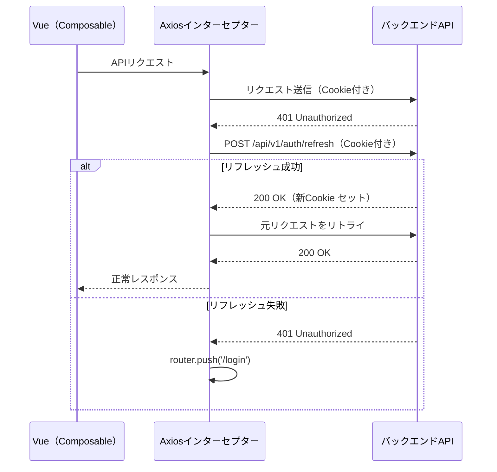

# フロントエンドアーキテクチャ

## 技術スタック

| 役割 | 採用技術 | バージョン方針 |
|------|---------|-------------|
| **フレームワーク** | Vue 3（Composition API） | 最新安定版 |
| **言語** | TypeScript | 最新安定版 |
| **UIライブラリ** | Element Plus | 最新安定版 |
| **ビルドツール** | Vite | 最新安定版 |
| **状態管理** | Pinia | 最新安定版 |
| **ルーティング** | Vue Router | 最新安定版 |
| **HTTPクライアント** | Axios | 最新安定版 |
| **フォームバリデーション** | VeeValidate + Zod | 最新安定版 |
| **多言語対応** | vue-i18n | 最新安定版 |
| **単体テスト** | Vitest | 最新安定版 |
| **E2Eテスト** | Playwright | 最新安定版 |

## 画面レイアウト

**サイドメニュー型** を採用する。

```
┌──────────────────────────────────────────────────────┐
│  [ロゴ / システム名]  [営業日: 2026-03-13]  [ユーザ情報] [ログアウト]  │  ← ヘッダー
├──────────┬───────────────────────────────────────────┤
│          │  パンくずリスト                             │
│ サイド   │ ──────────────────────────────────────── │
│ メニュー  │                                           │
│          │  メインコンテンツエリア                      │
│ ・入荷    │                                           │
│ ・在庫    │                                           │
│ ・出荷    │                                           │
│ ・マスタ  │                                           │
│ ・レポート │                                           │
│ ・バッチ  │                                           │
└──────────┴───────────────────────────────────────────┘
```

ヘッダーには **現在営業日** を常時表示する。ログイン後、全画面で営業日が確認できる。
営業日は `GET /api/v1/system/business-date` で取得し、Pinia ストアで状態管理する。

## 多言語対応

- **vue-i18n** を使用
- 初期対応言語：日本語（ja）・英語（en）
- 言語ファイル：`src/locales/ja.json`、`src/locales/en.json`
- デフォルト言語：日本語
- 言語切替：ヘッダーから選択可能

## ディレクトリ構成

```
frontend/
├── src/
│   ├── assets/              # 静的ファイル
│   ├── components/          # 共通UIコンポーネント
│   ├── composables/         # 画面単位のComposable（後述）
│   │   ├── master/
│   │   │   ├── useWarehouseList.ts
│   │   │   ├── useWarehouseForm.ts
│   │   │   └── ...
│   │   ├── inbound/
│   │   ├── inventory/
│   │   ├── outbound/
│   │   └── batch/
│   ├── layouts/             # レイアウトコンポーネント
│   │   ├── DefaultLayout.vue    # サイドメニュー付きレイアウト
│   │   └── BlankLayout.vue      # ログイン画面用（メニューなし）
│   ├── locales/             # i18n言語ファイル
│   │   ├── ja.json
│   │   └── en.json
│   ├── router/              # Vue Router設定
│   │   └── index.ts
│   ├── stores/              # Piniaストア（後述）
│   │   ├── auth.ts          # authStore
│   │   └── system.ts        # systemStore
│   ├── types/               # TypeScript型定義
│   │   └── generated/       # OpenAPIから自動生成（手動編集禁止）
│   ├── utils/               # ユーティリティ関数
│   │   └── api.ts           # Axiosインスタンス・インターセプター設定
│   ├── views/               # ページコンポーネント（.vue）
│   │   ├── auth/
│   │   ├── inbound/
│   │   ├── inventory/
│   │   ├── outbound/
│   │   ├── master/
│   │   ├── report/
│   │   └── batch/
│   ├── App.vue
│   └── main.ts
├── tests/
│   ├── unit/                # Vitestユニットテスト
│   └── e2e/                 # Playwrightテスト
├── index.html
├── vite.config.ts
├── tsconfig.json
└── package.json
```

## API型定義（OpenAPI自動生成）

バックエンド（Springdoc OpenAPI）が出力する `openapi.json` から、`openapi-typescript` でTypeScript型を自動生成する。

| 項目 | 内容 |
|------|------|
| **生成ツール** | `openapi-typescript` |
| **生成元** | バックエンドの `/v3/api-docs`（Springdoc自動出力） |
| **出力先** | `src/types/generated/` |
| **生成コマンド** | `npx openapi-typescript http://localhost:8080/v3/api-docs -o src/types/generated/api.d.ts` |
| **実行タイミング** | バックエンドのAPI変更時に手動実行（`npm run generate-types` スクリプトとして登録） |
| **ルール** | `src/types/generated/` 配下は手動編集禁止。型の拡張が必要な場合は別ファイルで `extends` する |

## Composable設計

### 方針: 画面単位で完結

各画面のロジック（API呼び出し、フォームバリデーション、状態管理）を **1画面1ファイル** のComposableに閉じ込める。画面間で共通のComposableは作らない。

**理由:** 画面ごとの独立性を保ち、変更時の影響範囲を最小化する。類似コードが生じるが、可読性・保守性（画面単位の使い捨て・書き直し）を優先する。

### 命名規則

| 画面パターン | Composable名 | 責務 |
|-------------|-------------|------|
| 一覧画面 | `use{Resource}List` | 検索条件の状態管理、一覧API呼び出し、ページネーション、有効/無効切替 |
| 登録画面 | `use{Resource}Form` | フォーム状態、バリデーション（VeeValidate + Zod）、登録API呼び出し |
| 編集画面 | `use{Resource}Form` | 登録と共用。既存データ取得 → フォーム初期化 → 更新API呼び出し |
| 特殊画面 | `use{ScreenName}` | 棚卸実施、ピッキング等の固有ロジック |

### 対応関係（例: 倉庫マスタ）

| 機能設計書 | View（.vue） | Composable |
|-----------|-------------|-----------|
| SCR-04 MST-021 倉庫一覧 | `views/master/WarehouseList.vue` | `composables/master/useWarehouseList.ts` |
| SCR-04 MST-022 倉庫登録 | `views/master/WarehouseCreate.vue` | `composables/master/useWarehouseForm.ts` |
| SCR-04 MST-023 倉庫編集 | `views/master/WarehouseEdit.vue` | `composables/master/useWarehouseForm.ts` |

### Composableの典型構造（一覧画面）

```typescript
// composables/master/useWarehouseList.ts
export function useWarehouseList() {
  // --- 状態 ---
  const items = ref<WarehouseListItem[]>([])
  const loading = ref(false)
  const page = ref(0)
  const size = ref(20)
  const totalElements = ref(0)
  const searchCriteria = reactive({ isActive: null as boolean | null })

  // --- API呼び出し ---
  async function fetchList() {
    loading.value = true
    try {
      const res = await apiClient.get('/api/v1/master/warehouses', {
        params: { ...searchCriteria, page: page.value, size: size.value }
      })
      items.value = res.data.content
      totalElements.value = res.data.totalElements
    } finally {
      loading.value = false
    }
  }

  // --- 操作 ---
  async function toggleActive(id: number) { /* ... */ }
  function resetSearch() { /* ... */ }

  return { items, loading, page, size, totalElements, searchCriteria,
           fetchList, toggleActive, resetSearch }
}
```

> `.vue` ファイルは表示とイベントバインディングに専念し、ロジックはComposableに委譲する。

## API通信・エラーハンドリング

### Axiosインスタンス設定（`src/utils/api.ts`）

```typescript
const apiClient = axios.create({
  baseURL: import.meta.env.VITE_API_BASE_URL,
  withCredentials: true,  // httpOnly Cookie を自動送信
})
```

### レスポンスインターセプター（共通エラー処理）

| ステータス | インターセプターの処理 | 画面側の対応 |
|-----------|---------------------|------------|
| **401** | `POST /api/v1/auth/refresh` でリフレッシュ試行。成功→元リクエストをリトライ。失敗→ログイン画面へリダイレクト | 不要（透過的） |
| **403** | `ElMessage.error('権限がありません')` を表示 | 不要 |
| **500** | `ElMessage.error('システムエラーが発生しました')` を表示 | 不要 |
| **400, 409, 422** | **処理しない**（そのまま reject） | 各Composableの `try/catch` で画面固有のエラー処理 |

### 401リフレッシュフロー



> リフレッシュ中に他のリクエストが同時に401を受けた場合、リフレッシュ処理を1つだけ実行し、完了後に待機中のリクエストをまとめてリトライする（キュー制御）。

### 画面側の業務エラー処理パターン

```typescript
// Composable内での業務エラー処理（400/409/422）
async function submitForm() {
  try {
    await apiClient.put(`/api/v1/master/warehouses/${id}`, {
      ...formData,
      version: version.value,  // 楽観的ロック: 取得時のversionを送り返す
    })
    ElMessage.success('倉庫を更新しました')
    router.push({ name: 'WarehouseList' })
  } catch (e: any) {
    if (e.response?.status === 400 && e.response.data.details) {
      // バリデーションエラー → フォームフィールドにエラー表示
      setFieldErrors(e.response.data.details)
    } else if (e.response?.status === 409
        && e.response.data.code === 'WMS-E-CMN-009') {
      // 楽観的ロック競合 → 再読み込みを促す
      ElMessage.error('他のユーザーが更新済みです。画面を再読み込みしてください')
    } else if (e.response?.status === 409 || e.response?.status === 422) {
      // その他の業務エラー → トーストでメッセージ表示
      ElMessage.error(e.response.data.message)
    }
    // 401/403/500 はインターセプターが処理済みなのでここには来ない
  }
}
```

### 楽観的ロック競合時のUXパターン

更新APIが 409（`OptimisticLockConflictException`）を返した場合、**シンプル通知方式** を採用する。

| 項目 | 内容 |
|------|------|
| **通知** | `ElMessage.error('他のユーザーが更新済みです。画面を再読み込みしてください')` |
| **画面の状態** | フォームはそのまま残す（ユーザーが入力値を確認・コピーできるように） |
| **復帰操作** | ユーザーが手動で画面を再読み込み（ブラウザリロードまたは画面内の再読み込みボタン） |

> **差分マージ方式を採用しない理由:** WMSのマスタ同時編集の頻度は低く（管理者のみの操作）、実装コストに見合わない。発生頻度が想定を上回った場合に再検討する。

## Piniaストア設計

### 方針

**グローバルに共有が必要な状態のみ** ストアに入れる。画面固有の状態（検索条件、フォーム入力値、ダイアログ開閉等）はComposable内の `ref` / `reactive` で管理する。

### ストア一覧

| ストア | ファイル | 保持する状態 | 更新タイミング |
|--------|---------|-------------|--------------|
| **authStore** | `stores/auth.ts` | ユーザーID、ユーザー名、ロール、ログイン状態 | ログイン成功時、ログアウト時 |
| **systemStore** | `stores/system.ts` | 営業日、選択中倉庫ID、UI言語（ja/en） | ログイン直後に取得、倉庫切替時、バッチ実行後（営業日再取得）、言語切替時 |

### authStore

```typescript
// stores/auth.ts
export const useAuthStore = defineStore('auth', () => {
  const user = ref<{ userId: number; userCode: string; fullName: string; role: string; passwordChangeRequired: boolean } | null>(null)
  const isLoggedIn = computed(() => user.value !== null)
  const isAdmin = computed(() => user.value?.role === 'SYSTEM_ADMIN')

  async function fetchCurrentUser() { /* GET /api/v1/auth/me */ }
  function clearUser() { user.value = null }

  return { user, isLoggedIn, isAdmin, fetchCurrentUser, clearUser }
})
```

### systemStore

```typescript
// stores/system.ts
export const useSystemStore = defineStore('system', () => {
  const businessDate = ref<string>('')       // 'YYYY-MM-DD'
  const selectedWarehouseId = ref<number | null>(null)
  const locale = ref<'ja' | 'en'>('ja')

  async function fetchBusinessDate() { /* GET /api/v1/system/business-date */ }

  return { businessDate, selectedWarehouseId, locale, fetchBusinessDate }
})
```

### ストアに入れないもの

| データ | 理由 |
|--------|------|
| 一覧画面の検索結果・検索条件 | 画面遷移で破棄して問題ない。Composable内の `ref` で管理 |
| フォーム入力値 | 画面ローカル。Composable内の `reactive` で管理 |
| ダイアログ・モーダルの開閉状態 | コンポーネントローカルの `ref` で管理 |
| ローディング状態 | API呼び出し単位でComposable内の `ref` で管理 |
