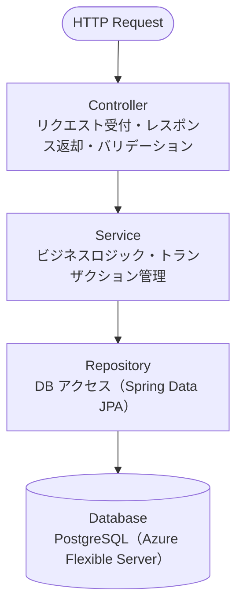

# バックエンドアーキテクチャ

## 技術スタック

| 役割 | 採用技術 | バージョン方針 |
|------|---------|-------------|
| **フレームワーク** | Spring Boot 3.x | 最新安定版 |
| **言語** | Java 21（LTS） | Java 21 |
| **ORM** | Spring Data JPA + Hibernate | Spring Boot同梱 |
| **DBマイグレーション** | Flyway | 最新安定版 |
| **OpenAPI** | Springdoc OpenAPI | 最新安定版 |
| **認証** | Spring Security + JWT（jjwt） | 最新安定版 |
| **バリデーション** | Jakarta Bean Validation | Spring Boot同梱 |
| **ビルドツール** | Gradle | 最新安定版 |
| **単体テスト** | JUnit 5 + Mockito | Spring Boot同梱 |
| **APIテスト** | Spring Boot Test + MockMvc | Spring Boot同梱 |

## アーキテクチャパターン

**標準3層アーキテクチャ** を採用する。



## モジュール構成

各業務モジュールは独立したパッケージとして実装し、モジュール間の依存は `shared` を経由する。

```
backend/
└── src/main/java/com/wms/
    ├── inbound/        # 入荷管理
    │   ├── controller/
    │   ├── service/
    │   ├── repository/
    │   └── dto/
    ├── inventory/      # 在庫管理
    ├── allocation/     # 在庫引当
    ├── outbound/       # 出荷管理
    ├── master/         # マスタ管理
    ├── report/         # レポート
    ├── batch/          # バッチ処理
    ├── interfacing/    # 外部連携I/F
    ├── system/         # システム共通（営業日取得API等）
    └── shared/         # 共通基盤
        ├── config/     # Spring設定（Security・CORS・OpenAPI等）
        ├── exception/  # 例外ハンドリング
        ├── logging/    # ロギング
        ├── security/   # JWT認証
        └── util/       # ユーティリティ
```

## API設計方針

- RESTful API
- ベースパス：`/api/v1/`
- OpenAPIドキュメント：`/swagger-ui.html`（Springdoc自動生成）
- レスポンス形式：JSON統一

## バッチ実行API

```
POST /api/v1/batch/daily-close    # 日替処理（営業日更新・入荷実績集計・出荷実績集計・在庫集計・バックアップを順次実行）
```

内部的には5処理を順番に実行するが、エンドポイントは1つ。詳細は機能要件定義書 [06-batch-processing.md](../../functional-requirements/06-batch-processing.md) 参照。

## システム共通API

業務モジュールに依存しない共通情報を提供するAPIを `shared` モジュール内に実装する。

| メソッド | パス | 説明 | 認証 |
|---------|------|------|------|
| `GET` | `/api/v1/system/business-date` | 現在の営業日を取得 | 要（ログイン済みユーザー） |

### レスポンス例（GET /api/v1/system/business-date）

```json
{
  "businessDate": "2026-03-13"
}
```

> フロントエンドはログイン直後にこのAPIを呼び出して営業日を取得し、全画面のヘッダーに表示する。
> 営業日はPiniaストア（`systemStore`）で保持し、バッチ実行後に再取得して更新する。
