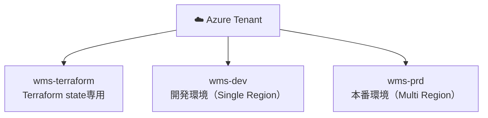

# インフラアーキテクチャ

## 構成図

→ [dev環境インフラ構成図（Japan East - Single Region）](diagrams/dev-infrastructure.drawio)

→ [prd環境インフラ構成図（Multi-Region Active-Passive）](diagrams/prd-infrastructure.drawio)

## 基本方針

| 項目 | 内容 |
|------|------|
| **クラウド** | Microsoft Azure |
| **IaC** | Terraform（Deploy/Destroy運用） |
| **環境分離** | Azureサブスクリプション単位で分離 |
| **ネットワーク** | VNet（プライベートネットワーク構成） |

## 運用方針（Terraform Deploy/Destroy）

常時稼働させず、必要な時だけデプロイして使い終わったらDestroyする運用。

| 状態 | 月額概算 |
|------|---------|
| **常時維持コスト** | ~$5/月（ACR + tfstate Blob のみ） |
| **dev稼働中** | +$9/月（日割り） |
| **prd稼働中** | +$80/月（日割り） |

> 常時稼働させる場合: dev ~$9/月、prd ~$80/月

### Destroyしない常設リソース

| リソース | 理由 |
|---------|------|
| wms-terraform サブスク の Blob Storage | Terraform state保管（数KB、ほぼ無料） |
| acrwms（ACR） | イメージを毎回ビルド＆プッシュするコスト回避 |

## 環境構成の違い

| 項目 | dev | prd |
|------|-----|-----|
| **リージョン** | Japan East のみ | Japan East（Primary）+ Japan West（Standby） |
| **Azure Front Door** | なし | あり（自動フェイルオーバー / WAF） |
| **Container Apps** | min:0 max:3 | East: min:1 max:5 / West: min:0 max:5 |
| **PostgreSQL** | B1ms 単一構成 | B1ms + Geo-redundant backup |
| **Storage** | LRS | GRS（Japan West へ自動レプリケーション） |
| **ACR** | Basic SKU（East） | Basic SKU（East のみ。Geo-replication非対応） |
| **ネットワーク** | vnet-wms-dev (10.0.0.0/16) | vnet-wms-prd-east (10.1.0.0/16) + vnet-wms-prd-west (10.2.0.0/16) |
| **メール送信** | Azure Communication Services | Azure Communication Services |

## サブスクリプション構成



## Terraform State 管理

| 項目 | 内容 |
|------|------|
| **サブスクリプション** | wms-terraform |
| **リソースグループ** | rg-wms-terraform |
| **ストレージアカウント** | stwmsterraform |
| **Blobコンテナ** | tfstate |
| **State ファイル** | dev/terraform.tfstate、prd/terraform.tfstate |

## prd環境 フェイルオーバー仕様

| 項目 | 内容 |
|------|-----|
| **フェイルオーバートリガー** | Front Door ヘルスプローブ失敗 |
| **フェイルオーバー方式** | Active-Passive（East障害時にWestへ自動切替） |
| **フロントエンド** | GRS により Japan West に自動レプリカ済み |
| **バックエンド** | CA West (min:0) が自動スケールアウト |
| **DB** | Japan East のプライマリのみ（West からもクロスリージョン接続） |
| **RPO** | 最大1時間（Geo-redundant backup基点） |
| **RTO** | フロント/API: 数分（Front Doorの自動切替） / DB復旧: 数時間（手動） |

## DNS / エンドポイント

| コンポーネント | URL形式 |
|--------------|--------|
| **フロントエンド（dev）** | `https://stwmsdev.z11.web.core.windows.net` |
| **フロントエンド（prd）** | Azure Front Door のエンドポイント URL |
| **バックエンドAPI（dev）** | `https://ca-wms-backend-dev.*.japaneast.azurecontainerapps.io` |
| **バックエンドAPI（prd）** | Azure Front Door 経由（Front Door URL /api/v1/ でルーティング） |

> ⚠️ Terraform Destroy/Apply でURLが変わるため、フロントエンドのAPI URL設定はTerraform output から動的に注入する

## Terraform ディレクトリ構成

```
infra/
├── modules/
│   ├── container-apps/
│   ├── postgresql/
│   ├── storage/
│   ├── vnet/
│   ├── acr/
│   ├── communication-services/
│   ├── monitoring/            ← Log Analytics Workspace, Application Insights
│   └── front-door/            ← prd のみ使用
├── environments/
│   ├── dev/
│   │   ├── main.tf
│   │   ├── variables.tf
│   │   └── terraform.tfvars
│   └── prd/
│       ├── main.tf
│       ├── variables.tf
│       └── terraform.tfvars
└── terraform-state/
    └── main.tf              ← tfstate用ストレージアカウント作成（一度だけ実行）
```

## Container Apps スケーリング設定

| 環境 | min replicas | max replicas | スケールトリガー |
|------|-------------|-------------|---------------|
| **dev** | 0（未使用時ゼロコスト） | 3 | HTTPリクエスト数 |
| **prd East** | 1（常時1台待機） | 5 | HTTPリクエスト数 |
| **prd West** | 0（Standby） | 5 | HTTPリクエスト数 |

> ⚠️ PostgreSQL Flexible Server は7日間で自動再起動されるため定期的な停止操作が必要
