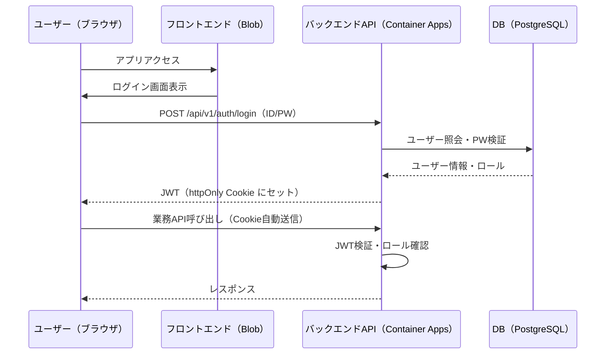

# 認証・認可アーキテクチャ

## 認証方式

| 項目 | 内容 |
|------|------|
| **方式** | JWT（JSON Web Token）+ httpOnly Cookie |
| **実装** | Spring Security + jjwt |
| **トークン保存** | httpOnly Cookie（XSS対策） |
| **CSRF対策** | SameSite=Strict + CSRFトークン |
| **トークン有効期限** | アクセストークン：1時間、リフレッシュトークン：スライディング方式（最終アクセスから1時間で失効） |

## 認証フロー



## 認可方式（RBAC）

### ロール定義

| ロール | 英名 | 想定ユーザー |
|-------|------|------------|
| **システム管理者** | `SYSTEM_ADMIN` | IT担当者 |
| **倉庫管理者** | `WAREHOUSE_MANAGER` | 倉庫責任者 |
| **倉庫スタッフ** | `WAREHOUSE_STAFF` | 作業員 |
| **閲覧者** | `VIEWER` | 経営層・他部門 |

### 機能別アクセス権限マトリクス

| 機能 | SYSTEM_ADMIN | WAREHOUSE_MANAGER | WAREHOUSE_STAFF | VIEWER |
|------|:---:|:---:|:---:|:---:|
| **ユーザー管理** | ✅ | ✗ | ✗ | ✗ |
| **マスタ管理（参照）** | ✅ | ✅ | ✅ | ✅ |
| **マスタ管理（更新）** | ✅ | ✅ | ✗ | ✗ |
| **入荷管理** | ✅ | ✅ | ✅ | 参照のみ |
| **在庫管理** | ✅ | ✅ | ✅ | 参照のみ |
| **出荷管理** | ✅ | ✅ | ✅ | 参照のみ |
| **在庫引当** | ✅ | ✅ | ✗ | ✗ |
| **レポート** | ✅ | ✅ | ✅ | ✅ |
| **バッチ実行** | ✅ | ✅ | ✗ | ✗ |
| **外部連携I/F** | ✅ | ✅ | ✗ | ✗ |
| **営業日取得**（GET /api/v1/system/business-date） | ✅ | ✅ | ✅ | ✅ |

### Spring Security 実装方針

```java
// アノテーションベースで各APIに権限を付与
@PreAuthorize("hasAnyRole('SYSTEM_ADMIN', 'WAREHOUSE_MANAGER')")
@PostMapping("/api/v1/batch/daily-close")
public ResponseEntity<Void> runDailyClose() { ... }
```
