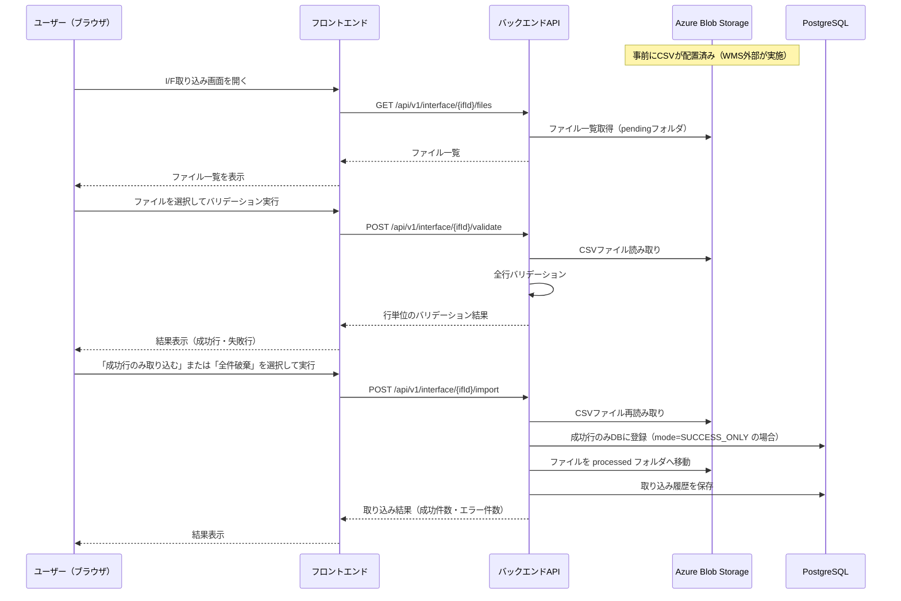

# 外部連携アーキテクチャ

## 概要

WMSが扱う外部連携I/Fはファイルベース（CSV）の取り込みのみ。
リアルタイムAPI連携は対象外（モック実装）。

CSVファイルはWMS外部（外部システム等）がAzure Blob Storageに配置する。
WMSはBlob上のファイルを選択して取り込む。

## I/F一覧

| I/F ID | I/F名 | 方向 | 形式 | 実装 |
|--------|-------|------|------|------|
| IFX-001 | 入荷予定取り込みI/F | 外部→WMS | CSV | モック（手動配置） |
| IFX-002 | 受注取り込みI/F | 外部→WMS | CSV | モック（手動配置） |

> DoD定義：外部I/Fはモック実装（実際の外部システム接続なし）

## 取り込みフロー

## Blob Storageフォルダ構成

| フォルダ | 用途 |
|---------|------|
| `iffiles/inbound-plan/pending/` | 入荷予定CSV配置場所（取り込み前） |
| `iffiles/inbound-plan/processed/` | 取り込み済みCSV（移動後） |
| `iffiles/order/pending/` | 受注CSV配置場所（取り込み前） |
| `iffiles/order/processed/` | 取り込み済みCSV（移動後） |

> pendingフォルダのファイルを画面一覧に表示する。取り込み実行（成功・破棄どちらでも）後にprocessedへ移動する。

## ステートレス2ステップ設計

バリデーションと取り込みはステートレスで処理する。バリデーション結果はDBやキャッシュに保存しない。

| ステップ | 処理 |
|---------|------|
| **バリデーション** | BlobからCSVを読み取り、全行をバリデーションして結果を返す。DBへの書き込みなし |
| **取り込み実行** | Blobから再度CSVを読み取り、modeに応じて登録。バリデーションを再実行して整合性を確保 |

> ファイルの2度読みが発生するが、WMSのCSVファイル規模では問題ない。Redisなどのキャッシュ基盤を追加しない分、構成がシンプルになる。

## 取り込みモード

| mode | 動作 |
|------|------|
| `SUCCESS_ONLY` | バリデーション成功行のみDBに登録。失敗行はスキップ |
| `DISCARD` | DBへの登録は行わない。ファイルのみprocessedへ移動 |

## APIエンドポイント

| メソッド | パス | 説明 |
|---------|------|------|
| `GET` | `/api/v1/interface/inbound-plan/files` | 入荷予定CSV一覧取得（pendingフォルダ） |
| `POST` | `/api/v1/interface/inbound-plan/validate` | 入荷予定CSVバリデーション |
| `POST` | `/api/v1/interface/inbound-plan/import` | 入荷予定CSV取り込み実行 |
| `GET` | `/api/v1/interface/inbound-plan/history` | 入荷予定取り込み履歴一覧 |
| `GET` | `/api/v1/interface/order/files` | 受注CSV一覧取得（pendingフォルダ） |
| `POST` | `/api/v1/interface/order/validate` | 受注CSVバリデーション |
| `POST` | `/api/v1/interface/order/import` | 受注CSV取り込み実行 |
| `GET` | `/api/v1/interface/order/history` | 受注取り込み履歴一覧 |

## 取り込み履歴テーブル（概要）

DBに取り込み実行履歴を保存し、画面から確認可能にする。

| カラム | 説明 |
|--------|------|
| `if_execution_id` | 実行ID（PK） |
| `if_type` | I/F種別（INBOUND_PLAN / ORDER） |
| `file_name` | 元ファイル名 |
| `blob_path` | Blob Storage パス（processed後） |
| `total_count` | 総レコード数 |
| `success_count` | 成功件数 |
| `error_count` | エラー件数 |
| `mode` | 実行モード（SUCCESS_ONLY / DISCARD） |
| `status` | 状態（COMPLETED / DISCARDED） |
| `executed_by` | 実行ユーザーID |
| `executed_at` | 実行日時 |
