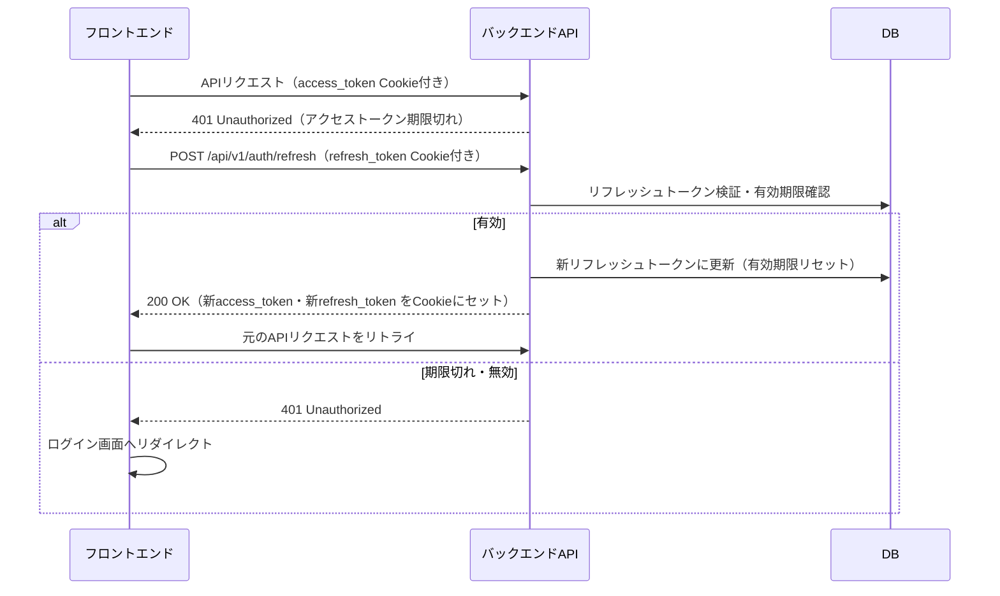

# セキュリティアーキテクチャ

## セキュリティ方針

OWASP Top 10 を基準に、WMSとして必要なセキュリティ対策を実装する。
認証・認可の詳細は [07-auth-architecture.md](07-auth-architecture.md) を参照。

## トークン設計

JWT + httpOnly Cookie 方式（セクション7確定）に対して、以下のトークン仕様を適用する。

| 項目 | 内容 |
|------|------|
| **アクセストークン** | 有効期限 1時間。httpOnly Cookie（`access_token`）に格納 |
| **リフレッシュトークン** | スライディング方式。最終アクセスから24時間で失効。httpOnly Cookie（`refresh_token`）に格納。セッションタイムアウト（60分操作なしで自動ログアウト）はフロントエンド側タイマー（55分警告→60分ログアウト）で制御する |
| **リフレッシュトークン管理** | DBの `refresh_tokens` テーブルで管理（トークンハッシュ・ユーザーID・有効期限） |
| **トークンローテーション** | リフレッシュ時に古いトークンを無効化し新しいトークンを発行（トークン盗用対策） |

### リフレッシュフロー

### 認証関連エンドポイント

| メソッド | パス | 説明 |
|---------|------|------|
| `POST` | `/api/v1/auth/login` | ログイン（トークン発行） |
| `POST` | `/api/v1/auth/refresh` | アクセストークン再発行 |
| `POST` | `/api/v1/auth/logout` | ログアウト（リフレッシュトークンをDB削除・Cookie削除） |
| `POST` | `/api/v1/auth/change-password` | パスワード変更 |
| `POST` | `/api/v1/auth/password-reset/request` | パスワードリセット申請（メール送信） |
| `POST` | `/api/v1/auth/password-reset/confirm` | パスワード再設定（トークン検証＋変更） |

## パスワード管理

| 項目 | 内容 |
|------|------|
| **ポリシー** | 8〜128文字、英大文字・英小文字・数字を各1文字以上必須 |
| **ハッシュ** | BCrypt（Spring Security デフォルト、strength=12） |
| **初回ログイン** | SYSTEM_ADMINが初期パスワードを発行。初回ログイン時にパスワード変更を強制（変更完了まで他操作不可） |
| **初回フラグ** | `users` テーブルの `password_change_required` フラグで管理 |

## ログイン失敗ロック

| 項目 | 内容 |
|------|------|
| **ロック条件** | 連続5回のログイン失敗でアカウントロック |
| **ロック状態** | `users` テーブルの `locked` フラグで管理 |
| **ロック解除** | SYSTEM_ADMINが手動解除（管理画面から操作） |
| **失敗カウンタ** | `users` テーブルの `failed_login_count` で管理。ログイン成功時にリセット |
| **パスワード変更APIのロック** | `POST /api/v1/auth/change-password` の連続5回失敗でも同様にアカウントロック。失敗カウンタ・ロック条件・解除方法はログイン失敗ロックと同一 |

## 通信セキュリティ

| 項目 | 内容 |
|------|------|
| **HTTPS強制** | Azure Container AppsでHTTPSのみ許可。HTTPアクセスはHTTPSへリダイレクト |
| **TLSバージョン** | TLS 1.2以上（Azure Container Apps デフォルト） |
| **証明書** | Azure Container Apps が自動管理 |
| **HSTS** | Spring Security で `Strict-Transport-Security` ヘッダー付与 |

## CORS設定

| 項目 | 内容 |
|------|------|
| **許可オリジン** | Blob Static Website URL（dev / prd 各環境のみ）。環境変数で設定 |
| **許可メソッド** | GET, POST, PUT, PATCH, DELETE, OPTIONS |
| **許可ヘッダー** | Content-Type |
| **認証情報** | `allowCredentials: true`（Cookie送信のため） |

## セキュリティヘッダー

Spring Security で以下のレスポンスヘッダーを全APIに付与する。

| ヘッダー | 値 | 目的 |
|---------|---|------|
| `X-Content-Type-Options` | `nosniff` | MIMEスニッフィング防止 |
| `X-Frame-Options` | `DENY` | クリックジャッキング防止 |
| `Referrer-Policy` | `strict-origin-when-cross-origin` | リファラー漏洩防止 |

## 入力バリデーション

| 対象 | 対策 |
|------|------|
| **APIリクエスト** | Jakarta Bean Validation（Controller層）で型・形式・必須チェック |
| **ビジネスルール** | Service層でバリデーション |
| **SQLインジェクション** | Spring Data JPA のパラメータバインディングで防止。ネイティブクエリは `:param` バインド必須 |
| **ファイルアップロード** | なし（ファイルアップロードはWMSの外部で実施） |

## ネットワークセキュリティ

→ 詳細は [06-infrastructure-architecture.md](06-infrastructure-architecture.md) を参照

| 項目 | 内容 |
|------|------|
| **VNet統合** | Container Apps・PostgreSQL をプライベートサブネットに配置 |
| **Blob Storage** | `iffiles` コンテナはプライベート（バックエンドAPIのみアクセス） |
| **`$web` コンテナ** | フロントエンド静的ホスティング用に公開 |

## ログ・監査

| 項目 | 内容 |
|------|------|
| **認証ログ** | ログイン成功・失敗・ロックをINFO/WARNレベルで出力（userId含む） |
| **操作ログ** | 主要業務操作（入荷確定・在庫引当・出荷確定・I/F取り込み）をINFOレベルで出力 |
| **PII保護** | ログのメールアドレス・電話番号をマスク（→ 08-common-infrastructure.md） |

## 依存ライブラリ管理

| 対策 | 内容 |
|------|------|
| **脆弱性スキャン** | GitHub Dependabot による自動検知・PR作成 |
| **対応方針** | セキュリティパッチは優先対応。Minor/Major更新は動作確認後に適用 |
