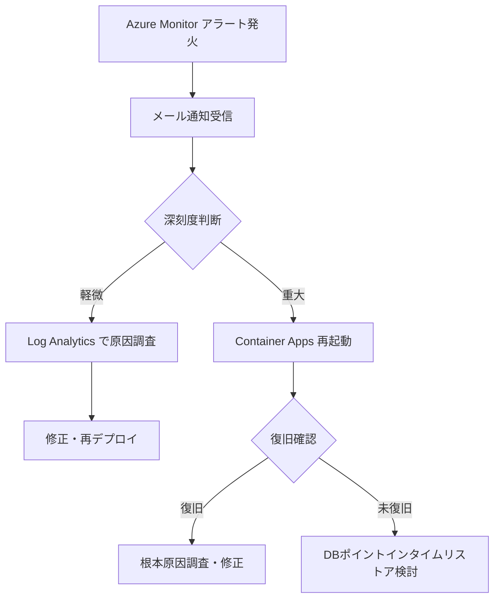

# 監視・運用アーキテクチャ

## 監視設計

→ ログ収集フローの詳細は [08-common-infrastructure.md](08-common-infrastructure.md) を参照

### 監視レイヤー

```
アプリケーション監視
    └── Log Analytics Workspace（バックエンドログ・KQL分析）
            ↓
        Azure Monitor アラート → アクション グループ（メール通知）

インフラ監視
    └── Azure Monitor（Container Apps・PostgreSQL メトリクス）
```

### アラート設定

| アラート名 | 条件 | 通知先 |
|-----------|------|--------|
| **ERRORログ検知** | ERRORレベルのログが1件以上 / 5分 | メール |
| **APIレスポンス遅延** | 平均レスポンスタイム > 3秒 / 5分 | メール |
| **DB接続失敗** | DB接続エラーログ検知 | メール |
| **ログイン失敗多発** | ログイン失敗が10件以上 / 5分 | メール |

### KQL クエリ例

```kql
// ERRORログ一覧
ContainerAppConsoleLogs
| where ContainerName == "ca-wms-backend"
| where Log contains "\"level\":\"ERROR\""
| order by TimeGenerated desc
| take 100

// トレースIDでリクエスト追跡
ContainerAppConsoleLogs
| where Log contains "\"traceId\":\"<trace-id>\""
| order by TimeGenerated asc
```

### ログ保存期間

| サービス | 保存期間 |
|---------|---------|
| **Log Analytics Workspace** | 30日（デフォルト・無料枠内） |

## ヘルスチェック

| エンドポイント | 説明 |
|-------------|------|
| `GET /actuator/health` | Spring Boot Actuator ヘルスチェック |
| `GET /actuator/info` | アプリケーション情報（バージョン等） |

Container Apps のヘルスプローブに `/actuator/health` を設定する。

## DB停止・起動運用

コスト削減のため、未使用時はPostgreSQL Flexible Serverを手動停止する。

| 操作 | コマンド |
|------|---------|
| **停止** | `az postgres flexible-server stop --resource-group <rg> --name <server>` |
| **起動** | `az postgres flexible-server start --resource-group <rg> --name <server>` |

> ⚠️ Azure Flexible Serverは7日間連続停止で自動再起動される。長期未使用時は定期的に手動停止が必要。

## バックアップ

| 対象 | 方式 | 保存期間 |
|------|------|---------|
| **PostgreSQL** | Azure Flexible Server 自動バックアップ（ポイントインタイムリストア） | 7日 |
| **Blob Storage（iffiles）** | Azure Blob Storage の冗長性（LRS）で保護 | - |

### リストア手順（PostgreSQL）

```bash
az postgres flexible-server restore \
  --resource-group <rg> \
  --name <new-server-name> \
  --source-server <source-server> \
  --restore-time "2026-03-12T10:00:00Z"
```

## ログレベル運用

| 環境 | ログレベル | 設定方法 |
|------|---------|---------|
| **prd** | INFO | Container Apps 環境変数 `LOG_LEVEL=INFO` |
| **dev** | DEBUG | Container Apps 環境変数 `LOG_LEVEL=DEBUG` |

本番でDEBUGが必要な場合は環境変数を一時変更して再起動する。

## インシデント対応フロー


