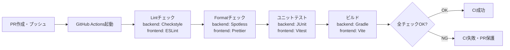
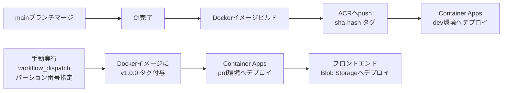

# 開発・デプロイアーキテクチャ

## ローカル開発環境

| 項目 | 内容 |
|------|------|
| **OS** | WSL2（Windows Subsystem for Linux 2） |
| **依存サービス** | Docker Compose（PostgreSQL 等） |
| **IDE** | VSCode + Claude Code |
| **Java** | Java 21 |
| **Node.js** | フロントエンドビルド用 |

### Docker Compose 構成（ローカル）

```yaml
# docker-compose.yml（ローカル開発用）
services:
  postgres:
    image: postgres:16
    environment:
      POSTGRES_DB: wms
      POSTGRES_USER: wms
      POSTGRES_PASSWORD: wms
    ports:
      - "5432:5432"
    volumes:
      - postgres_data:/var/lib/postgresql/data

volumes:
  postgres_data:
```

### 環境変数管理

| 環境 | 管理方法 |
|------|---------|
| **ローカル** | `.env` ファイル（`.gitignore` 対象） |
| **dev / prd** | Azure Container Apps 環境変数（GitHub Actions でセット） |
| **シークレット** | GitHub Actions Secrets（ACR認証情報・Azure認証情報等） |

## リポジトリ構成

```
wms/                          ← プロジェクトルート
├── backend/                  ← Spring Boot プロジェクト
│   ├── src/
│   ├── build.gradle
│   └── Dockerfile
├── frontend/                 ← Vue 3 プロジェクト
│   ├── src/
│   ├── package.json
│   └── Dockerfile（マルチステージビルド用）
├── infra/                    ← Terraform
│   ├── modules/
│   └── environments/
│       ├── dev/
│       └── prd/
├── docs/                     ← ドキュメント
├── .github/
│   └── workflows/            ← GitHub Actions
├── docker-compose.yml        ← ローカル開発用
└── .gitignore
```

## ブランチ戦略

| ブランチ | 用途 | 命名規則 | 保護ルール |
|---------|------|---------|-----------|
| `main` | 本番相当コード | - | CI構築後：CI通過必須。CI構築前：制限なし |
| `feature/{Issue#}_{説明}` | 機能開発 | `feature/12_inventory-management` | - |
| `fix/{Issue#}_{説明}` | バグ修正 | `fix/34_login-error` | - |
| `docs/{Issue#}_{説明}` | ドキュメント修正 | `docs/5_update-readme` | - |

> 実装フェーズの作業は必ずGitHub Issueを起票してからブランチを切る。Issue番号をブランチ名に含めることでトレーサビリティを確保する。
> CI/CDは全機能実装完了後に構築する（品質管理計画書参照）。

## Dockerイメージ設計

### バックエンド Dockerfile（マルチステージビルド）

```dockerfile
FROM eclipse-temurin:21-jdk-alpine AS builder
WORKDIR /app
COPY . .
RUN ./gradlew bootJar --no-daemon

FROM eclipse-temurin:21-jre-alpine
WORKDIR /app
COPY --from=builder /app/build/libs/*.jar app.jar
ENTRYPOINT ["java", "-jar", "app.jar"]
```

### イメージタグ戦略

| タグ | 用途 | 例 |
|------|------|---|
| `sha-{commitHash}` | コミット単位のトレーサビリティ | `sha-a1b2c3d` |
| `v1.0.0` | prd環境デプロイ用（SemVer） | `v1.0.0` |

> `latest` タグは使用しない。dev環境は `sha-{hash}`、prd環境は `v{semver}` でデプロイする。

## CI/CDパイプライン

### CI（継続的インテグレーション）



### CD（継続的デプロイ）



### GitHub Actions ワークフロー一覧

| ファイル | トリガー | 処理 |
|---------|---------|------|
| `ci.yml` | PR作成・プッシュ | Lint + Format + Test + Build |
| `cd-dev.yml` | mainブランチマージ | dev環境へ自動デプロイ（sha-hashタグ） |
| `cd-prd.yml` | 手動（workflow_dispatch・バージョン指定） | prd環境へ手動デプロイ（SemVerタグ） |
| `terraform.yml` | `infra/` 変更時 | Terraform plan（PRコメント）/ apply（main） |

## コーディング標準

### バックエンド（Java）

| ツール | 用途 | 設定 |
|-------|------|------|
| **Checkstyle** | コードスタイルチェック | Google Java Style ベース |
| **Spotless** | コードフォーマット自動修正 | Gradle プラグイン |

### フロントエンド（Vue / TypeScript）

| ツール | 用途 | 設定 |
|-------|------|------|
| **ESLint** | コード品質チェック | `@vue/eslint-config-typescript` |
| **Prettier** | コードフォーマット | `.prettierrc` で設定 |

## テスト戦略

→ 詳細は品質管理計画書を参照

| テストレベル | ツール | 実行タイミング |
|------------|-------|-------------|
| **ユニットテスト** | JUnit 5 / Vitest | CI（PR時） |
| **統合テスト** | Spring Boot Test（ローカルDB使用） | CI（PR時） |
| **E2Eテスト** | Playwright | 手動（prd環境） |

### カバレッジ目標（バックエンド）

> テストカバレッジ目標のSSOTは [test-specifications/00-test-plan.md](../test-specifications/00-test-plan.md) を参照。
