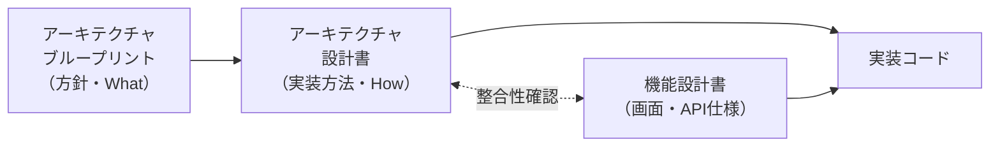
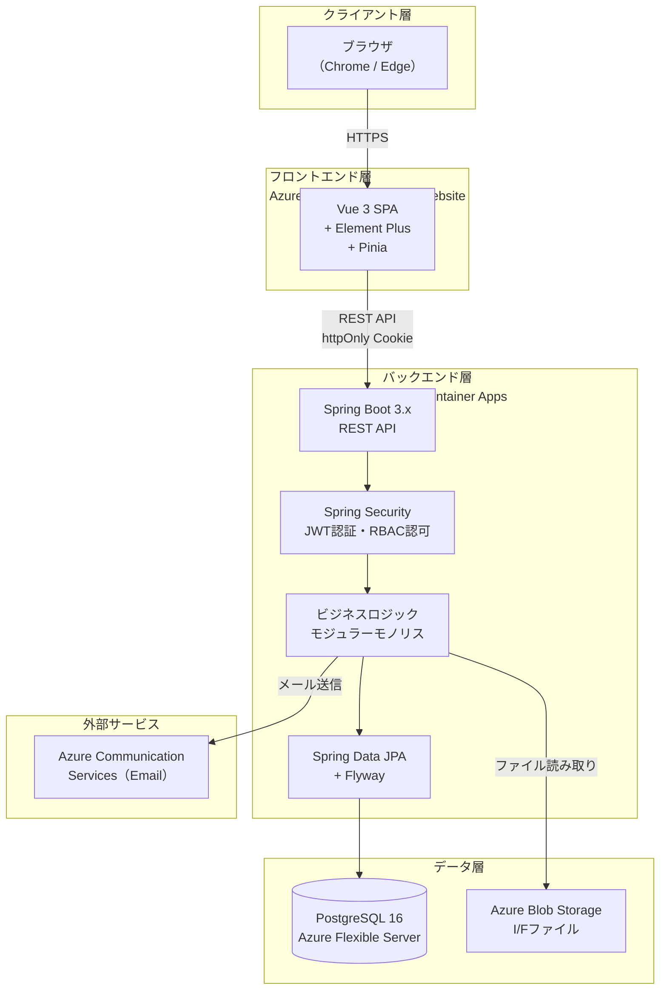
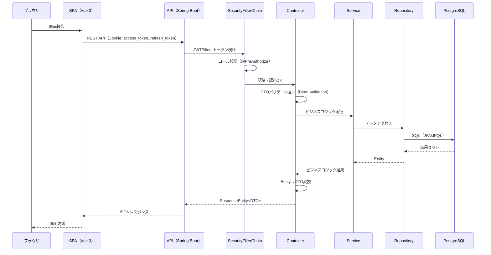
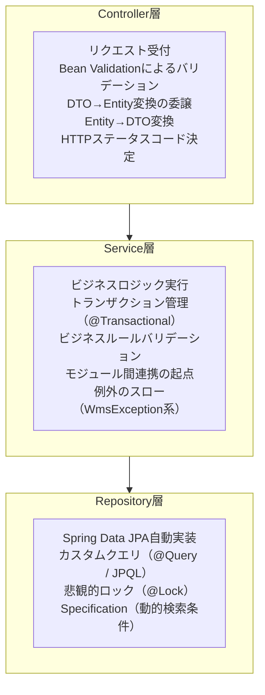
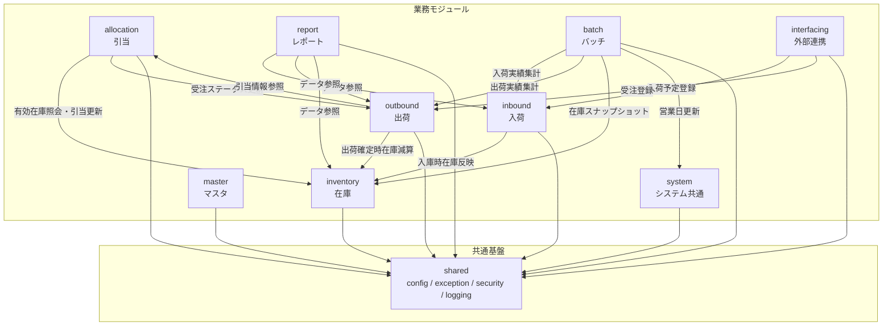
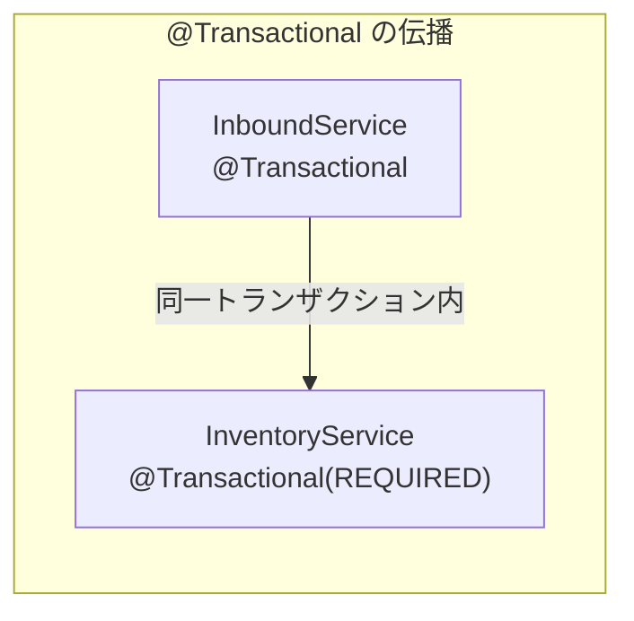
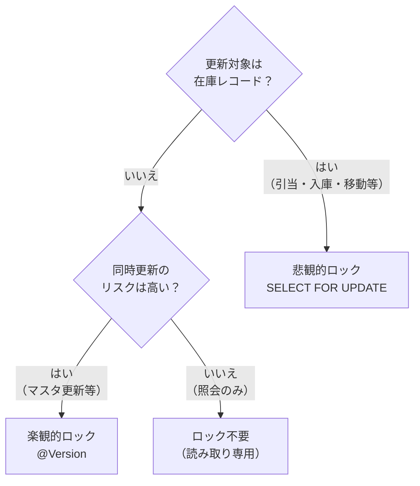
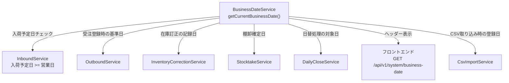
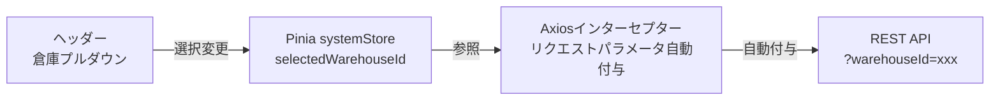
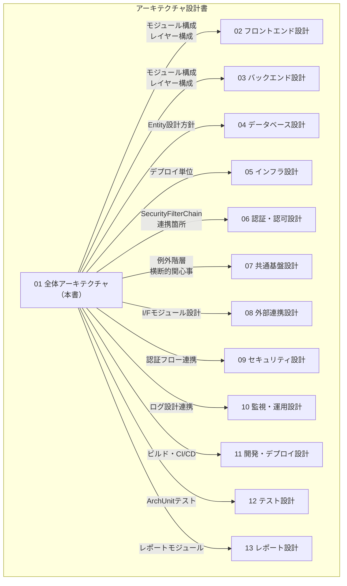

# 全体アーキテクチャ設計書

> 本書はアーキテクチャブループリント（`docs/architecture-blueprint/`）の方針に基づき、WMS実装における全体アーキテクチャの具体的な設計を定義する。
> ブループリントが「何をするか」を定義するのに対し、本書は「どう実装するか」を定義する。

---

## 目次

1. [設計の位置づけと前提条件](#1-設計の位置づけと前提条件)
2. [システム論理構成](#2-システム論理構成)
3. [モジュラーモノリスの実装設計](#3-モジュラーモノリスの実装設計)
4. [レイヤーアーキテクチャ実装設計](#4-レイヤーアーキテクチャ実装設計)
5. [モジュール間連携の実装設計](#5-モジュール間連携の実装設計)
6. [横断的関心事の実装設計](#6-横断的関心事の実装設計)
7. [営業日制御の実装設計](#7-営業日制御の実装設計)
8. [倉庫コンテキストの実装設計](#8-倉庫コンテキストの実装設計)
9. [アーキテクチャ決定記録（ADR）](#9-アーキテクチャ決定記録adr)
10. [制約事項と前提条件](#10-制約事項と前提条件)
11. [他セクションとの関係マップ](#11-他セクションとの関係マップ)

---

## 1. 設計の位置づけと前提条件

### 1.1 本書の位置づけ



| ドキュメント | 役割 | 変更頻度 |
|-------------|------|---------|
| ブループリント | 技術選定の根拠、方針決定 | 低（技術選定確定後は変更少） |
| **本書（アーキテクチャ設計書）** | 実装構造、コンポーネント間の具体的な連携方法 | 中（設計詳細化に伴い更新） |
| 機能設計書 | 各画面・APIの仕様 | 高（機能追加・変更時に更新） |

### 1.2 参照ドキュメント

| 参照先 | 参照する情報 |
|--------|-------------|
| [architecture-blueprint/01-overall-architecture.md](../architecture-blueprint/01-overall-architecture.md) | モジュラーモノリス方針、モジュール構成、レイヤー構成 |
| [architecture-blueprint/02-system-architecture.md](../architecture-blueprint/02-system-architecture.md) | Azure構成、コスト方針、通信フロー |
| [architecture-blueprint/04-backend-architecture.md](../architecture-blueprint/04-backend-architecture.md) | 3層アーキテクチャ、API設計方針、DTO規約 |
| [architecture-blueprint/08-common-infrastructure.md](../architecture-blueprint/08-common-infrastructure.md) | エラーハンドリング、ロギング、例外階層 |
| [data-model/01-overview.md](../data-model/01-overview.md) | テーブル設計方針、命名規則、共通カラム |

### 1.3 技術スタック確定事項

> 技術選定の根拠は [architecture-blueprint/01-overall-architecture.md](../architecture-blueprint/01-overall-architecture.md) を参照。

| レイヤー | 技術 | 実装上のバージョン固定方針 |
|---------|------|------------------------|
| フロントエンド | Vue 3 + TypeScript + Element Plus + Vite | `package.json` でメジャーバージョンを固定（`^3.x`） |
| バックエンド | Spring Boot 3.x + Java 21 + Gradle | `build.gradle` でSpring Boot BOM管理 |
| DB | PostgreSQL 16 | Docker Compose / Azure Flexible Serverで統一 |
| IaC | Terraform | `.terraform-version` でバージョン固定 |

---

## 2. システム論理構成

### 2.1 全体構成図



### 2.2 リクエスト処理の流れ



---

## 3. モジュラーモノリスの実装設計

### 3.1 Javaパッケージ構成

ブループリントで定義された10モジュールを、単一のSpring Bootアプリケーション内でパッケージとして分割する。

```
com.wms/
├── WmsApplication.java              # @SpringBootApplication（ルート）
├── inbound/                         # 入荷管理モジュール
│   ├── controller/
│   │   └── InboundController.java
│   ├── service/
│   │   ├── InboundService.java
│   │   └── InboundInspectionService.java
│   ├── repository/
│   │   ├── InboundSlipRepository.java
│   │   └── InboundSlipLineRepository.java
│   ├── dto/
│   │   ├── CreateInboundSlipRequest.java
│   │   ├── InboundSlipResponse.java
│   │   └── InboundSlipSearchCriteria.java
│   └── entity/
│       ├── InboundSlip.java
│       └── InboundSlipLine.java
├── inventory/                       # 在庫管理モジュール
│   ├── controller/
│   ├── service/
│   │   ├── InventoryService.java    # 在庫CRUD・移動・ばらし
│   │   ├── StocktakeService.java    # 棚卸
│   │   └── InventoryCorrectionService.java
│   ├── repository/
│   ├── dto/
│   └── entity/
├── allocation/                      # 在庫引当モジュール
│   ├── controller/
│   ├── service/
│   │   ├── AllocationService.java   # 引当アルゴリズム
│   │   └── UnpackService.java       # ばらし指示管理
│   ├── repository/
│   ├── dto/
│   └── entity/
├── outbound/                        # 出荷管理モジュール
│   ├── controller/
│   ├── service/
│   │   ├── OutboundService.java
│   │   ├── PickingService.java
│   │   └── ShippingService.java
│   ├── repository/
│   ├── dto/
│   └── entity/
├── master/                          # マスタ管理モジュール
│   ├── controller/
│   │   ├── WarehouseController.java
│   │   ├── ProductController.java
│   │   ├── PartnerController.java
│   │   ├── LocationController.java
│   │   └── UserController.java
│   ├── service/
│   ├── repository/
│   ├── dto/
│   └── entity/
├── report/                          # レポートモジュール
│   ├── controller/
│   ├── service/
│   └── dto/
├── batch/                           # バッチ処理モジュール
│   ├── controller/
│   │   └── BatchController.java     # POST /api/v1/batch/daily-close
│   ├── service/
│   │   ├── DailyCloseService.java   # 日替処理オーケストレーション
│   │   ├── BusinessDateService.java # 営業日更新
│   │   ├── InboundSummaryService.java
│   │   ├── OutboundSummaryService.java
│   │   ├── InventorySnapshotService.java
│   │   └── DataArchiveService.java  # トランデータバックアップ
│   ├── repository/
│   ├── dto/
│   └── entity/
├── interfacing/                     # 外部連携I/Fモジュール
│   ├── controller/
│   ├── service/
│   │   ├── CsvValidationService.java
│   │   └── CsvImportService.java
│   ├── repository/
│   ├── dto/
│   └── entity/
├── system/                          # システム共通モジュール
│   ├── controller/
│   │   └── SystemController.java    # GET /api/v1/system/business-date
│   ├── service/
│   │   └── SystemParameterService.java
│   ├── repository/
│   ├── dto/
│   └── entity/
└── shared/                          # 共通基盤（他モジュールから参照される）
    ├── config/
    │   ├── SecurityConfig.java
    │   ├── CorsConfig.java
    │   ├── OpenApiConfig.java
    │   ├── JpaAuditingConfig.java
    │   └── WebMvcConfig.java
    ├── exception/
    │   ├── WmsException.java
    │   ├── ResourceNotFoundException.java
    │   ├── DuplicateResourceException.java
    │   ├── BusinessRuleViolationException.java
    │   ├── OptimisticLockConflictException.java
    │   ├── InvalidStateTransitionException.java
    │   └── GlobalExceptionHandler.java
    ├── security/
    │   ├── JwtTokenProvider.java
    │   ├── JwtAuthenticationFilter.java
    │   └── WmsUserDetailsService.java
    ├── entity/
    │   └── BaseEntity.java          # 共通カラム（id, created_at等）
    ├── logging/
    │   ├── RequestLoggingFilter.java
    │   └── PiiMaskingFilter.java
    └── util/
        └── BusinessDateService.java    # 営業日取得ユーティリティ
```

### 3.2 Entity基底クラスの設計

全Entityが継承する基底クラスを `shared/entity/` に配置する。

```java
// shared/entity/BaseEntity.java
@MappedSuperclass
@EntityListeners(AuditingEntityListener.class)
public abstract class BaseEntity {

    @Id
    @GeneratedValue(strategy = GenerationType.IDENTITY)
    private Long id;

    @CreatedDate
    @Column(name = "created_at", nullable = false, updatable = false)
    private OffsetDateTime createdAt;

    @CreatedBy
    @Column(name = "created_by", updatable = false)
    private Long createdBy;

    @LastModifiedDate
    @Column(name = "updated_at", nullable = false)
    private OffsetDateTime updatedAt;

    @LastModifiedBy
    @Column(name = "updated_by")
    private Long updatedBy;
}
```

マスタ系Entityはさらに楽観的ロック用 `version` と論理削除用 `isActive` を追加した基底クラスを継承する。

```java
// shared/entity/MasterBaseEntity.java
@MappedSuperclass
public abstract class MasterBaseEntity extends BaseEntity {

    @Version
    @Column(name = "version", nullable = false)
    private Integer version = 0;

    @Column(name = "is_active", nullable = false)
    private Boolean isActive = true;
}
```

### 3.3 モジュール境界の強制

Javaパッケージはコンパイル時にモジュール境界を強制しないため、以下のルールをコーディング規約として運用する。

| ルール | 内容 | 検証方法 |
|--------|------|---------|
| Repository直接参照禁止 | 他モジュールの `repository` パッケージのクラスを直接参照しない | コードレビュー + ArchUnit テスト |
| Controller間呼び出し禁止 | `controller` パッケージのクラスから他の `controller` を呼び出さない | ArchUnit テスト |
| Service経由のアクセス | 他モジュールのデータが必要な場合は、そのモジュールの `Service` を `@Autowired` で注入して利用する | コードレビュー |
| Entity共有禁止 | 他モジュールの `entity` パッケージを直接参照しない。モジュール間のデータ受け渡しはDTO or プリミティブ型で行う | ArchUnit テスト |

**ArchUnitによるモジュール境界テスト:**

```java
// test/architecture/ModuleBoundaryTest.java
@AnalyzeClasses(packages = "com.wms")
class ModuleBoundaryTest {

    @ArchTest
    static final ArchRule repositoryIsolation =
        noClasses()
            .that().resideInAPackage("..inbound..")
            .should().accessClassesThat()
            .resideInAPackage("..outbound..repository..");

    @ArchTest
    static final ArchRule controllerIsolation =
        noClasses()
            .that().resideInAPackage("..controller..")
            .should().accessClassesThat()
            .resideInAnyPackage("..controller..")
            .andShould().not().resideInSamePackageAs(/* self */);

    @ArchTest
    static final ArchRule entityIsolation =
        noClasses()
            .that().resideInAPackage("..inbound..entity..")
            .should().beAccessedByClassesThat()
            .resideInAPackage("..outbound..");
}
```

---

## 4. レイヤーアーキテクチャ実装設計

### 4.1 各レイヤーの責務と実装規約



### 4.2 Controller層の実装パターン

```java
// inbound/controller/InboundController.java
@RestController
@RequestMapping("/api/v1/inbound")
@RequiredArgsConstructor
public class InboundController {

    private final InboundService inboundService;

    // 一覧取得: ページネーション + 検索条件
    @GetMapping("/slips")
    @PreAuthorize("hasAnyRole('SYSTEM_ADMIN','WAREHOUSE_MANAGER','WAREHOUSE_STAFF','VIEWER')")
    public PageResponse<InboundSlipListItem> getSlips(
            @Valid InboundSlipSearchCriteria criteria,
            @RequestParam(defaultValue = "0") int page,
            @RequestParam(defaultValue = "20") int size) {
        return inboundService.searchSlips(criteria, PageRequest.of(page, size));
    }

    // 新規登録
    @PostMapping("/slips")
    @PreAuthorize("hasAnyRole('SYSTEM_ADMIN','WAREHOUSE_MANAGER','WAREHOUSE_STAFF')")
    public ResponseEntity<InboundSlipResponse> createSlip(
            @Valid @RequestBody CreateInboundSlipRequest request) {
        InboundSlipResponse response = inboundService.createSlip(request);
        return ResponseEntity.status(HttpStatus.CREATED).body(response);
    }

    // 更新（楽観的ロック: version含む）
    @PutMapping("/slips/{id}")
    @PreAuthorize("hasAnyRole('SYSTEM_ADMIN','WAREHOUSE_MANAGER','WAREHOUSE_STAFF')")
    public InboundSlipResponse updateSlip(
            @PathVariable Long id,
            @Valid @RequestBody UpdateInboundSlipRequest request) {
        return inboundService.updateSlip(id, request);
    }
}
```

**Controller層の禁止事項:**

- Entity を直接レスポンスとして返さない（必ずDTOに変換）
- ビジネスロジックを書かない（Serviceに委譲）
- try-catch で例外をハンドリングしない（GlobalExceptionHandlerに委譲）
- 他のControllerを呼び出さない

### 4.3 Service層の実装パターン

```java
// inbound/service/InboundService.java
@Service
@RequiredArgsConstructor
@Transactional(readOnly = true)  // デフォルトは読み取り専用
public class InboundService {

    private final InboundSlipRepository inboundSlipRepository;
    private final InventoryService inventoryService;  // 他モジュールServiceの注入
    private final BusinessDateService businessDateUtil;

    @Transactional  // 書き込みトランザクション
    public InboundSlipResponse createSlip(CreateInboundSlipRequest request) {
        // 1. 営業日チェック
        LocalDate businessDate = businessDateUtil.getCurrentBusinessDate();
        if (request.getPlannedDate().isBefore(businessDate)) {
            throw new BusinessRuleViolationException(
                "PLANNED_DATE_BEFORE_BUSINESS_DATE",
                "入荷予定日は営業日以降の日付を指定してください"
            );
        }

        // 2. ビジネスルールバリデーション
        validateDuplicateProductLines(request.getLines());

        // 3. Entity生成・保存
        InboundSlip slip = request.toEntity(businessDate);
        slip = inboundSlipRepository.save(slip);

        // 4. DTO変換して返却
        return InboundSlipResponse.from(slip);
    }

    @Transactional
    public void confirmStorage(Long slipId, Long lineId,
                               ConfirmStorageRequest request) {
        InboundSlip slip = findSlipOrThrow(slipId);

        // 他モジュールServiceの呼び出し（在庫反映）
        inventoryService.addStock(
            request.getLocationId(),
            request.getProductId(),
            request.getUnitType(),
            request.getQuantity(),
            request.getLotNumber(),
            request.getExpiryDate()
        );

        // ステータス遷移
        slip.transitionToPartialOrComplete();
        inboundSlipRepository.save(slip);
    }
}
```

**Service層の実装規約:**

| 規約 | 詳細 |
|------|------|
| `@Transactional(readOnly = true)` | クラスレベルで読み取り専用をデフォルト設定 |
| `@Transactional` | 書き込みメソッドに個別付与 |
| Repository例外の変換 | `DataIntegrityViolationException` → `DuplicateResourceException` 等に変換 |
| 楽観的ロック例外の変換 | `OptimisticLockingFailureException` → `OptimisticLockConflictException` に変換 |
| nullチェック | `findById` の結果は `orElseThrow(() -> new ResourceNotFoundException(...))` パターン |

### 4.4 Repository層の実装パターン

```java
// inbound/repository/InboundSlipRepository.java
public interface InboundSlipRepository
        extends JpaRepository<InboundSlip, Long>,
                JpaSpecificationExecutor<InboundSlip> {

    // 業務キーによる検索
    Optional<InboundSlip> findBySlipNumber(String slipNumber);

    // 倉庫ID + ステータスでの絞り込み
    @Query("SELECT s FROM InboundSlip s WHERE s.warehouseId = :warehouseId " +
           "AND s.status IN :statuses ORDER BY s.plannedDate ASC")
    List<InboundSlip> findByWarehouseIdAndStatusIn(
        @Param("warehouseId") Long warehouseId,
        @Param("statuses") List<InboundStatus> statuses);
}
```

**動的検索条件（Specification）の活用:**

一覧画面の複数条件検索にはSpring Data JPAの `Specification` を使用する。

```java
// inbound/repository/InboundSlipSpec.java
public class InboundSlipSpec {

    public static Specification<InboundSlip> withCriteria(
            InboundSlipSearchCriteria criteria) {
        return (root, query, cb) -> {
            List<Predicate> predicates = new ArrayList<>();

            if (criteria.getWarehouseId() != null) {
                predicates.add(
                    cb.equal(root.get("warehouseId"), criteria.getWarehouseId()));
            }
            if (criteria.getStatus() != null) {
                predicates.add(
                    cb.equal(root.get("status"), criteria.getStatus()));
            }
            if (criteria.getPlannedDateFrom() != null) {
                predicates.add(
                    cb.greaterThanOrEqualTo(
                        root.get("plannedDate"), criteria.getPlannedDateFrom()));
            }

            return cb.and(predicates.toArray(new Predicate[0]));
        };
    }
}
```

---

## 5. モジュール間連携の実装設計

### 5.1 モジュール依存関係マップ



### 5.2 モジュール間呼び出しの実装方式

Service直接注入方式を採用する。モジュール間の呼び出しはService公開メソッドのみ許可する。

```java
// allocation/service/AllocationService.java
@Service
@RequiredArgsConstructor
public class AllocationService {

    // 他モジュールServiceの注入
    private final InventoryService inventoryService;   // inventory モジュール
    private final OutboundService outboundService;     // outbound モジュール

    @Transactional
    public AllocationResult allocate(Long outboundSlipId) {
        // 1. 受注明細を取得（outbound モジュール経由）
        OutboundSlipDto slip = outboundService.getSlipForAllocation(outboundSlipId);

        // 2. 有効在庫を照会（inventory モジュール経由）
        List<AvailableStock> stocks =
            inventoryService.findAvailableStocks(
                slip.getWarehouseId(), slip.getProductId(), slip.getUnitType());

        // 3. 引当アルゴリズム実行（自モジュール内ロジック）
        AllocationResult result = executeAllocation(slip, stocks);

        // 4. 在庫の引当数更新（inventory モジュール経由）
        inventoryService.updateAllocatedQty(result.getAllocations());

        // 5. 受注ステータス更新（outbound モジュール経由）
        outboundService.updateStatusAfterAllocation(outboundSlipId, result);

        return result;
    }
}
```

### 5.3 公開Service APIの設計指針

各モジュールのServiceは、他モジュールが利用可能な「公開メソッド」を明確にする。

| モジュール | 公開Serviceクラス | 主な公開メソッド |
|-----------|------------------|----------------|
| `inventory` | `InventoryService` | `addStock()`, `removeStock()`, `findAvailableStocks()`, `updateAllocatedQty()`, `isLocationLocked()` |
| `outbound` | `OutboundService` | `getSlipForAllocation()`, `updateStatusAfterAllocation()`, `createSlipFromCsv()` |
| `inbound` | `InboundService` | `createSlipFromCsv()` |
| `system` | `SystemParameterService` | `getParameter()`, `getBusinessDate()` |
| `master` | 各マスタService | `findActiveById()`, `existsByCode()` |

**引数・戻り値のルール:**

- 他モジュールへ公開するメソッドの引数はプリミティブ型またはDTOとする
- 他モジュールの Entity を引数や戻り値に使用しない
- 必要な情報だけをDTOとして切り出す

---

## 6. 横断的関心事の実装設計

### 6.1 トランザクション管理



| 場面 | 伝播レベル | 実装 |
|------|-----------|------|
| 単一モジュール内の処理 | `REQUIRED`（デフォルト） | Service メソッドに `@Transactional` |
| モジュール間連携（入庫確定→在庫反映） | `REQUIRED`（呼び出し元のTXに参加） | 呼び出される側も `@Transactional`（REQUIRED）で同一TX内で実行 |
| 読み取り専用処理 | `readOnly = true` | クラスレベルで `@Transactional(readOnly = true)` を設定し、書き込みメソッドのみ上書き |
| バッチ日替処理 | ステップごとに独立TX | `DailyCloseService` 内で各ステップを個別にtry-catchし、ステップ完了状態をDB記録 |

**バッチ処理のトランザクション分割:**

```java
// batch/service/DailyCloseService.java
@Service
@RequiredArgsConstructor
public class DailyCloseService {

    private final BatchStepExecutor stepExecutor;

    // 各ステップを独立トランザクションで実行
    public BatchExecutionResult executeDailyClose(LocalDate targetDate) {
        BatchExecutionResult result = new BatchExecutionResult(targetDate);

        // Step1: 営業日更新（独立TX）
        stepExecutor.executeStep("BUSINESS_DATE_UPDATE", targetDate, () -> {
            businessDateService.advanceDate(targetDate);
        });

        // Step2: 入荷実績集計（独立TX）
        stepExecutor.executeStep("INBOUND_SUMMARY", targetDate, () -> {
            inboundSummaryService.summarize(targetDate);
        });

        // ... Step3〜5も同様
        return result;
    }
}

// batch/service/BatchStepExecutor.java
@Service
public class BatchStepExecutor {

    @Transactional(propagation = Propagation.REQUIRES_NEW)
    public void executeStep(String stepName, LocalDate targetDate,
                            Runnable stepLogic) {
        // 完了済みステップはスキップ
        if (isStepCompleted(stepName, targetDate)) return;

        stepLogic.run();
        recordStepCompletion(stepName, targetDate);
    }
}
```

### 6.2 ロック戦略の実装

> ロック方式の方針は [architecture-blueprint/05-database-architecture.md](../architecture-blueprint/05-database-architecture.md) を参照。

**悲観的ロック（在庫引当処理）:**

```java
// inventory/repository/InventoryRepository.java
public interface InventoryRepository extends JpaRepository<Inventory, Long> {

    @Lock(LockModeType.PESSIMISTIC_WRITE)
    @Query("SELECT i FROM Inventory i " +
           "WHERE i.locationId = :locationId " +
           "AND i.productId = :productId " +
           "AND i.unitType = :unitType " +
           "AND (i.lotNumber = :lotNumber OR (i.lotNumber IS NULL AND :lotNumber IS NULL)) " +
           "AND (i.expiryDate = :expiryDate OR (i.expiryDate IS NULL AND :expiryDate IS NULL))")
    Optional<Inventory> findForUpdate(
        @Param("locationId") Long locationId,
        @Param("productId") Long productId,
        @Param("unitType") UnitType unitType,
        @Param("lotNumber") String lotNumber,
        @Param("expiryDate") LocalDate expiryDate);
}
```

**ロックの使い分け判定フロー:**



### 6.3 監査情報の自動設定

Spring Data JPA Auditing を利用して `created_at`, `created_by`, `updated_at`, `updated_by` を自動設定する。

```java
// shared/config/JpaAuditingConfig.java
@Configuration
@EnableJpaAuditing(auditorAwareRef = "auditorProvider")
public class JpaAuditingConfig {

    @Bean
    public AuditorAware<Long> auditorProvider() {
        return () -> {
            Authentication auth =
                SecurityContextHolder.getContext().getAuthentication();
            if (auth == null || !auth.isAuthenticated()) {
                return Optional.empty();
            }
            WmsUserDetails userDetails = (WmsUserDetails) auth.getPrincipal();
            return Optional.of(userDetails.getUserId());
        };
    }
}
```

### 6.4 ステータス遷移の実装

ステータス遷移はEntity内のメソッドで管理し、不正な遷移を防止する。

```java
// inbound/entity/InboundSlip.java
@Entity
@Table(name = "inbound_slips")
public class InboundSlip extends BaseEntity {

    @Enumerated(EnumType.STRING)
    @Column(name = "status", nullable = false)
    private InboundStatus status;

    // 許可された遷移の定義
    private static final Map<InboundStatus, Set<InboundStatus>> VALID_TRANSITIONS =
        Map.of(
            InboundStatus.PLANNED,    Set.of(InboundStatus.CONFIRMED, InboundStatus.CANCELLED),
            InboundStatus.CONFIRMED,  Set.of(InboundStatus.INSPECTING, InboundStatus.CANCELLED),
            InboundStatus.INSPECTING, Set.of(InboundStatus.PARTIAL_STORED, InboundStatus.STORED, InboundStatus.CANCELLED),
            InboundStatus.PARTIAL_STORED, Set.of(InboundStatus.STORED, InboundStatus.CANCELLED)
        );

    public void transitionTo(InboundStatus newStatus) {
        Set<InboundStatus> allowed = VALID_TRANSITIONS.getOrDefault(
            this.status, Set.of());
        if (!allowed.contains(newStatus)) {
            throw new InvalidStateTransitionException(
                "INVALID_STATUS_TRANSITION",
                String.format("ステータス遷移 %s → %s は許可されていません",
                    this.status, newStatus)
            );
        }
        this.status = newStatus;
    }
}
```

---

## 7. 営業日制御の実装設計

> 営業日の概念定義は [architecture-blueprint/01-overall-architecture.md](../architecture-blueprint/01-overall-architecture.md) を参照。

### 7.1 営業日取得の実装

営業日はキャッシュせず、都度DBから取得する。全モジュールが一貫して同じ方法で営業日を取得するよう、共通ユーティリティを提供する。

```java
// shared/util/BusinessDateService.java
@Component
@RequiredArgsConstructor
public class BusinessDateService {

    private final BusinessDateRepository businessDateRepository;

    /**
     * 現在営業日を取得する。
     * business_date テーブルは単一レコード（id=1）のみ保持する。
     */
    public LocalDate getCurrentBusinessDate() {
        return businessDateRepository.findById(1L)
            .orElseThrow(() -> new IllegalStateException(
                "営業日データが初期化されていません"))
            .getCurrentDate();
    }
}
```

### 7.2 営業日の利用箇所



### 7.3 営業日更新の冪等性

```java
// batch/service/BusinessDateService.java
@Service
@RequiredArgsConstructor
public class BusinessDateService {

    private final BusinessDateRepository businessDateRepository;

    @Transactional
    public void advanceDate(LocalDate targetDate) {
        BusinessDate bd = businessDateRepository.findById(1L)
            .orElseThrow();

        LocalDate nextDate = targetDate.plusDays(1);

        // 冪等性: 既に翌日に更新済みならスキップ
        if (bd.getCurrentDate().equals(nextDate)) {
            return;
        }

        // 対象営業日と現在営業日の一致を確認
        if (!bd.getCurrentDate().equals(targetDate)) {
            throw new BusinessRuleViolationException(
                "BUSINESS_DATE_MISMATCH",
                "対象営業日と現在営業日が一致しません"
            );
        }

        bd.setCurrentDate(nextDate);
        businessDateRepository.save(bd);
    }
}
```

---

## 8. 倉庫コンテキストの実装設計

### 8.1 フロントエンドの倉庫コンテキスト

> 倉庫切替の動作仕様は [functional-requirements/01-master-management.md](../functional-requirements/01-master-management.md) を参照。

ヘッダーの倉庫プルダウンで選択された倉庫IDは Pinia `systemStore` で管理し、全業務画面のAPI呼び出しに自動付与する。



### 8.2 バックエンドの倉庫コンテキスト

バックエンドでは倉庫IDをリクエストパラメータとして受け取り、Service層で利用する。暗黙的なスレッドローカル管理は行わず、明示的にパラメータとして渡す。

```java
// Controllerで倉庫IDを受け取る標準パターン
@GetMapping("/inbound/slips")
public PageResponse<InboundSlipListItem> getSlips(
        @RequestParam Long warehouseId,  // 必須パラメータ
        @Valid InboundSlipSearchCriteria criteria,
        Pageable pageable) {
    criteria.setWarehouseId(warehouseId);
    return inboundService.searchSlips(criteria, pageable);
}
```

### 8.3 倉庫コンテキストの適用除外

以下のAPIは倉庫IDパラメータを持たない（全倉庫共通の操作）。

| API | 理由 |
|-----|------|
| 認証系（`/api/v1/auth/*`） | 倉庫に依存しない |
| ユーザー管理（`/api/v1/master/users/*`） | 全倉庫共通のユーザー管理 |
| 倉庫マスタ管理（`/api/v1/master/warehouses/*`） | 全倉庫を横断的に管理 |
| システムパラメータ（`/api/v1/system/*`） | システム全体の設定 |
| バッチ処理（`/api/v1/batch/*`） | 全倉庫を対象に処理 |

---

## 9. アーキテクチャ決定記録（ADR）

### ADR-001: モジュラーモノリスの採用

| 項目 | 内容 |
|------|------|
| **ステータス** | 承認済 |
| **コンテキスト** | 1人開発のWMSプロジェクトで、マイクロサービスはオーバーヘッドが大きく、モノリスは将来の拡張性が低い |
| **決定** | モジュラーモノリスを採用。単一デプロイ単位として開発し、パッケージ構造でモジュール境界を表現する |
| **結果** | 開発の簡潔さと将来のマイクロサービス移行可能性を両立。ArchUnitテストでモジュール境界を検証 |
| **参照** | [architecture-blueprint/01-overall-architecture.md](../architecture-blueprint/01-overall-architecture.md) |

### ADR-002: モジュール間のService直接呼び出し

| 項目 | 内容 |
|------|------|
| **ステータス** | 承認済 |
| **コンテキスト** | モジュール間の連携方式として、イベント駆動、Facadeパターン、Service直接呼び出しの3案がある |
| **決定** | Service直接呼び出しを採用。ただし他モジュールのRepositoryやEntityへの直接参照は禁止 |
| **理由** | イベント駆動はトランザクション管理が複雑化し、Facadeは追加の抽象層がオーバーヘッド。1人開発では直接呼び出しの方が実装・デバッグが容易 |
| **リスク** | モジュール間の結合度が高まる可能性がある。ArchUnitテストと Entity共有禁止ルールで緩和 |
| **参照** | [architecture-blueprint/04-backend-architecture.md](../architecture-blueprint/04-backend-architecture.md) |

### ADR-003: 楽観的ロック競合時のシンプル通知方式

| 項目 | 内容 |
|------|------|
| **ステータス** | 承認済 |
| **コンテキスト** | 楽観的ロック検出時のフロントエンド対応方式として、差分マージ方式とシンプル通知方式がある |
| **決定** | シンプル通知方式を採用。409レスポンス時にトーストで通知し、手動リロードを促す |
| **理由** | WMSのマスタ同時編集頻度は低い（管理者のみの操作）。差分マージの実装コストに見合わない |
| **参照** | [architecture-blueprint/03-frontend-architecture.md](../architecture-blueprint/03-frontend-architecture.md) |

### ADR-004: 営業日のキャッシュなし都度取得

| 項目 | 内容 |
|------|------|
| **ステータス** | 承認済 |
| **コンテキスト** | 営業日をアプリケーション層でキャッシュするか、都度DBから取得するかの選択 |
| **決定** | キャッシュせず都度DBから取得する |
| **理由** | 日替処理で営業日が変更された場合に即時反映される必要がある。キャッシュ無効化の複雑さを回避。`business_date` テーブルは単一レコードのため、毎回のDBアクセスコストは無視できるほど小さい |
| **参照** | [architecture-blueprint/05-database-architecture.md](../architecture-blueprint/05-database-architecture.md)、[architecture-blueprint/08-common-infrastructure.md](../architecture-blueprint/08-common-infrastructure.md) |

### ADR-005: DTO手動マッピングの採用

| 項目 | 内容 |
|------|------|
| **ステータス** | 承認済 |
| **コンテキスト** | Entity-DTO変換にMapStruct等のライブラリを使用するか、手動マッピングにするか |
| **決定** | 手動マッピング（staticファクトリメソッド）を採用 |
| **理由** | DTOのフィールド数が限定的で手動マッピングのコストが低い。変換ロジックの可読性・デバッグ容易性を優先 |
| **再検討条件** | フィールド数が20を超えるDTOが増加した場合にMapStruct導入を再検討 |
| **参照** | [architecture-blueprint/04-backend-architecture.md](../architecture-blueprint/04-backend-architecture.md) |

### ADR-006: 在庫引当の悲観的ロック採用

| 項目 | 内容 |
|------|------|
| **ステータス** | 承認済 |
| **コンテキスト** | 在庫引当処理は複数の在庫レコードを読み取り・更新するため、楽観的ロックではリトライ頻度が高くなる可能性がある |
| **決定** | 在庫引当処理には悲観的ロック（`SELECT FOR UPDATE`）を使用 |
| **理由** | 引当処理は複数レコードの一貫性が必要であり、楽観的ロック失敗時のリトライロジックが複雑になる。悲観的ロックにより確実な排他制御を実現する |
| **トレードオフ** | ロック競合時に待ち時間が発生する。ただしWMSの同時接続数（最大50名）では実運用上問題ない |
| **参照** | [architecture-blueprint/05-database-architecture.md](../architecture-blueprint/05-database-architecture.md) |

### ADR-007: バッチ日替処理のステップ単位独立トランザクション

| 項目 | 内容 |
|------|------|
| **ステータス** | 承認済 |
| **コンテキスト** | 日替処理（5ステップ）を単一トランザクションで実行するか、ステップごとに独立トランザクションにするか |
| **決定** | ステップごとに独立トランザクション（`REQUIRES_NEW`）で実行し、完了状態をDBに記録する |
| **理由** | 5ステップ全体を1トランザクションにすると、後半ステップの失敗で前半の成功分もロールバックされ、再実行コストが高い。ステップごとの冪等性を確保し、途中失敗時は未完了ステップから再開できるようにする |
| **参照** | [functional-requirements/06-batch-processing.md](../functional-requirements/06-batch-processing.md) |

---

## 10. 制約事項と前提条件

### 10.1 技術的制約

| 制約 | 影響 | 対応方針 |
|------|------|---------|
| Azure Container Apps min replicas=0（dev環境） | コールドスタート時に初回リクエストが10〜30秒かかる | 許容する。dev環境はコスト優先 |
| PostgreSQL B1ms（1vCore, 2GB RAM） | 大量データの集計クエリに時間がかかる可能性 | トランデータのアーカイブ運用でテーブルサイズを抑制 |
| 単一リージョンDB（dev環境） | DB障害時に復旧に時間がかかる | dev環境は許容。prd環境はGeo-redundant backup |
| Blob Static Websiteのカスタムドメイン制限 | Azure Blob Static WebsiteはHTTPSカスタムドメインにAzure CDNが必要 | dev環境はデフォルトURL使用。prd環境はFront Door経由 |

### 10.2 運用上の前提条件

| 前提条件 | 説明 |
|---------|------|
| 日替処理は1日1回手動実行 | 自動スケジューリングは行わない。担当者が業務終了後に実行する |
| 棚卸明細は1回2,000行以内 | パフォーマンス設計の前提。超過する場合は棚卸範囲を分割する |
| 同時接続ユーザー数: dev 10名、prd 50名 | Container Apps のスケーリング設定の前提 |
| 外部連携はCSVファイルベースのみ | リアルタイムAPI連携はスコープ外 |
| デスクトップブラウザのみサポート | Chrome最新版、Edge最新版。解像度1280x768以上 |

### 10.3 将来の拡張ポイント

| 拡張ポイント | 現在の設計での対応 |
|-------------|------------------|
| マイクロサービス化 | モジュラーモノリスのパッケージ構造がそのままサービス分割の単位になる。Service公開APIがサービス間IFの原型 |
| リアルタイムAPI連携 | RESTful API設計により、外部システムから直接API呼び出し可能な構造 |
| 複数倉庫の並行処理 | 倉庫IDによるデータ分離が既に実現済み。将来はDB分割（マルチテナント）も可能 |
| WebSocket通知 | Spring WebSocketの追加で、在庫変動のリアルタイム通知が可能 |

---

## 11. 他セクションとの関係マップ



### セクション別の責務分担

| セクション | 本書で定義する内容 | 当該セクションで定義する内容 |
|-----------|------------------|------------------------|
| 02 フロントエンド設計 | モジュール構成との対応関係 | Vue 3コンポーネント設計、Composable設計、Pinia設計の詳細 |
| 03 バックエンド設計 | 3層アーキテクチャの実装パターン | 各APIの実装詳細、DTO定義、バリデーション規約 |
| 04 データベース設計 | Entity基底クラス、ロック方式 | テーブル定義、インデックス設計、マイグレーション手順 |
| 05 インフラ設計 | デプロイ単位（単一JAR） | Terraform構成、環境別設定、スケーリング設定 |
| 06 認証・認可設計 | SecurityFilterChainとの連携フロー | JWT実装詳細、ロール権限マトリクス実装、パスワードリセット実装 |
| 07 共通基盤設計 | 例外クラス階層の定義 | GlobalExceptionHandler実装、ロギング設定、トレースID実装 |
| 08 外部連携設計 | I/Fモジュールのパッケージ構成 | CSV解析実装、Blob Storage連携、バリデーション規約 |
| 09 セキュリティ設計 | CORSとセキュリティヘッダーの方針 | 脆弱性対策実装、入力バリデーション詳細 |
| 10 監視・運用設計 | ログ項目の標準フォーマット連携 | Azure Monitor設定、アラート設定、運用手順 |
| 11 開発・デプロイ設計 | リポジトリ構成との整合性 | GitHub Actions設定、Docker設定、環境変数管理 |
| 12 テスト設計 | ArchUnitによるモジュール境界テスト | テスト戦略、カバレッジ目標、テストデータ管理 |
| 13 レポート設計 | レポートモジュールの依存関係 | PDF生成実装、帳票レイアウト |
