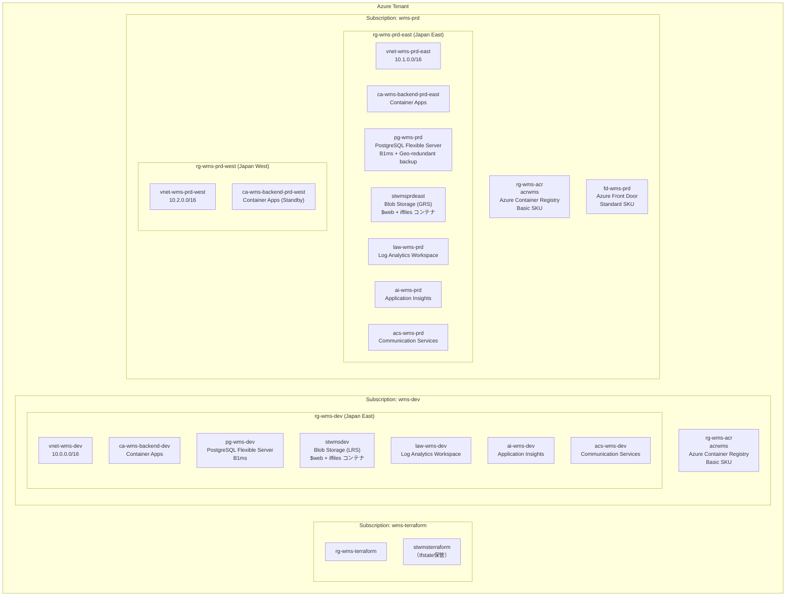
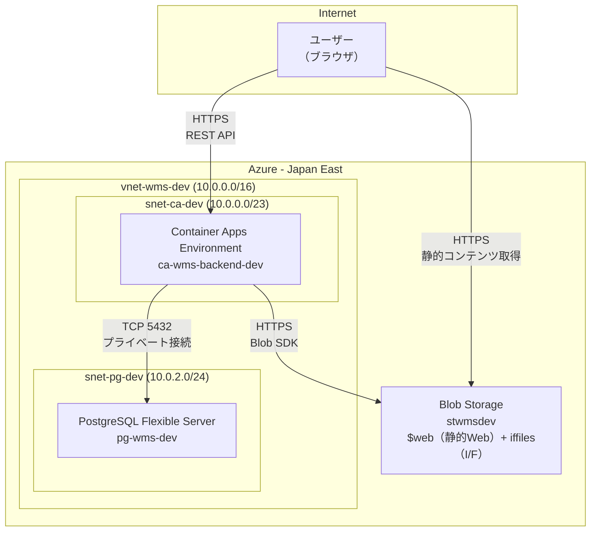
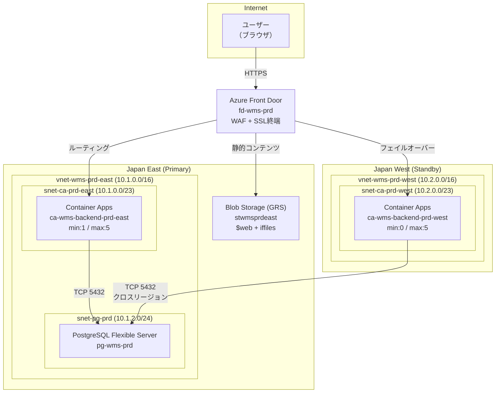
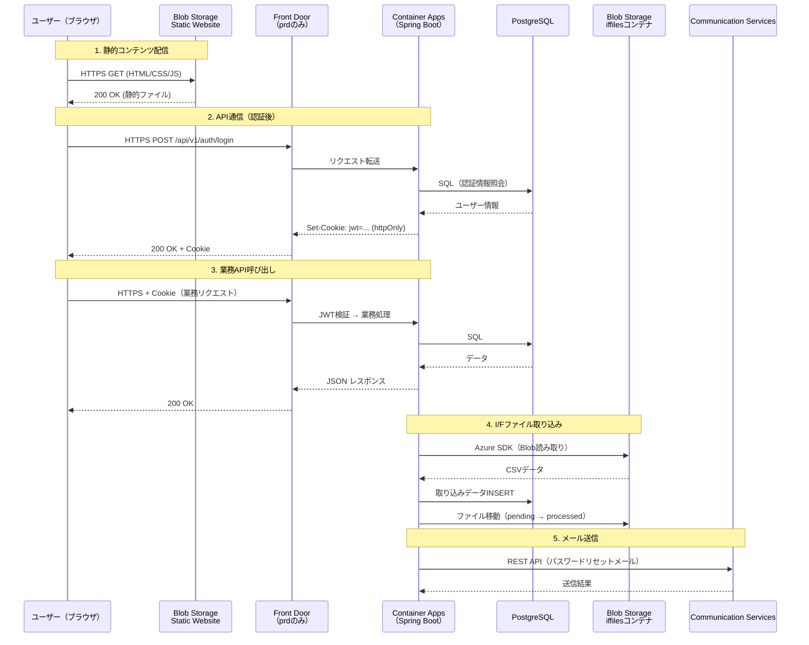
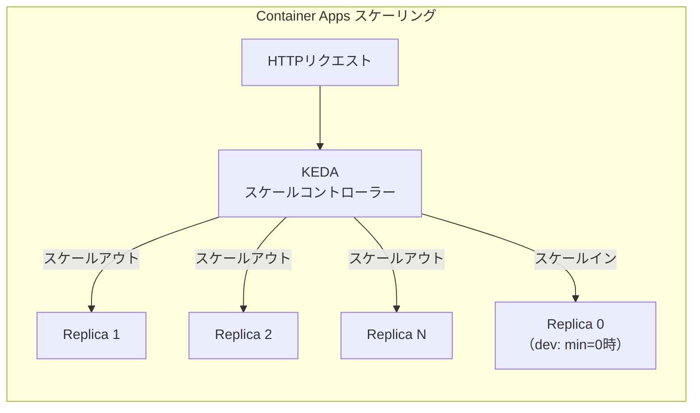
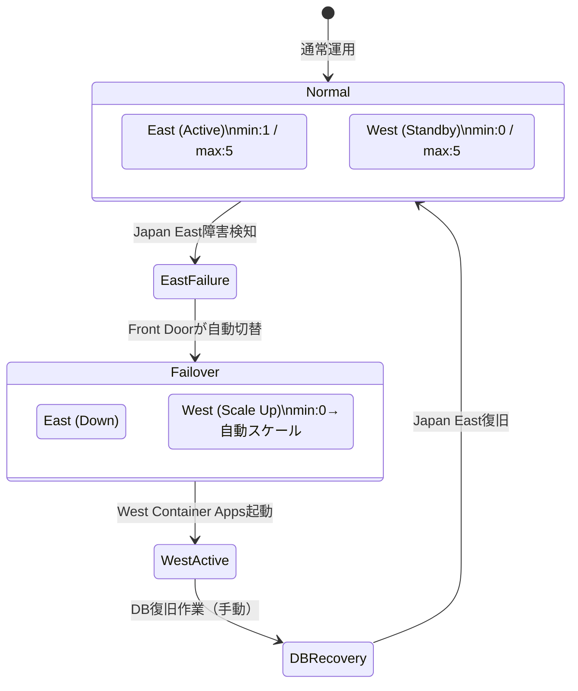
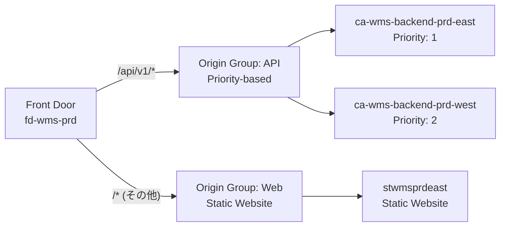
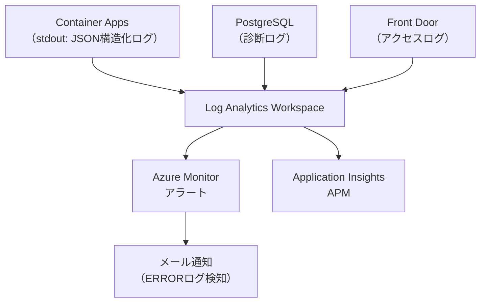

# システムアーキテクチャ設計書

> 本ドキュメントは [architecture-blueprint/02-system-architecture.md](../architecture-blueprint/02-system-architecture.md) の方針を具体化した実装設計書である。
> 技術方針・共通規約の詳細は [architecture-blueprint/](../architecture-blueprint/) を参照。

---

## 目次

1. [Azureリソース構成と配置](#1-azureリソース構成と配置)
2. [ネットワークトポロジー設計](#2-ネットワークトポロジー設計)
3. [コンポーネント間通信設計](#3-コンポーネント間通信設計)
4. [スケーリング設計](#4-スケーリング設計)
5. [可用性・冗長性設計](#5-可用性冗長性設計)
6. [環境構成](#6-環境構成devprod)
7. [DNS・エンドポイント設計](#7-dnsエンドポイント設計)
8. [セキュリティ設計（インフラ層）](#8-セキュリティ設計インフラ層)
9. [監視・ログ設計（インフラ層）](#9-監視ログ設計インフラ層)
10. [Terraform設計](#10-terraform設計)

---

## 1. Azureリソース構成と配置

### 1.1 リソース全体構成図



### 1.2 リソース一覧

| リソース種別 | dev 名称 | prd 名称 | SKU / Tier | 用途 |
|------------|---------|---------|-----------|------|
| Resource Group | rg-wms-dev | rg-wms-prd-east / rg-wms-prd-west | - | リソースグループ |
| VNet | vnet-wms-dev | vnet-wms-prd-east / vnet-wms-prd-west | - | 仮想ネットワーク |
| Container Apps Environment | cae-wms-dev | cae-wms-prd-east / cae-wms-prd-west | Consumption | コンテナ実行環境 |
| Container App | ca-wms-backend-dev | ca-wms-backend-prd-east / ca-wms-backend-prd-west | - | バックエンドAPI |
| PostgreSQL Flexible Server | pg-wms-dev | pg-wms-prd | B1ms (1 vCore, 2GB) | RDB |
| Storage Account | stwmsdev | stwmsprdeast | StorageV2 / Standard | 1アカウント内で$web（静的Web）+ iffiles（I/Fファイル）コンテナ分離 |
| Container Registry | acrwms（各サブスクリプション） | acrwms（各サブスクリプション） | Basic | Dockerイメージ保管（rg-wms-acr内、常設） |
| Log Analytics Workspace | law-wms-dev | law-wms-prd | PerGB2018 | ログ集約 |
| Application Insights | ai-wms-dev | ai-wms-prd | - | APM |
| Communication Services | acs-wms-dev | acs-wms-prd | Free | メール送信 |
| Front Door | - | fd-wms-prd | Standard | グローバルLB / WAF |

### 1.3 常設リソースとDestroyable リソース

> Terraform Deploy/Destroy 運用の詳細は [architecture-blueprint/06-infrastructure-architecture.md](../architecture-blueprint/06-infrastructure-architecture.md) を参照。

| 分類 | リソース | 理由 |
|------|---------|------|
| **常設（Destroyしない）** | stwmsterraform（tfstate Blob） | Terraform state保管。喪失するとインフラ管理不能 |
| **常設（Destroyしない）** | acrwms（ACR、dev/prd各サブスクリプションのrg-wms-acr内） | コンテナイメージの再ビルドコスト回避 |
| **Destroyable** | 上記以外の全リソース | Terraform で再作成可能 |

---

## 2. ネットワークトポロジー設計

### 2.1 dev環境 ネットワーク構成



### 2.2 prd環境 ネットワーク構成



### 2.3 サブネット設計

| 環境 | サブネット名 | CIDR | 用途 | 備考 |
|------|-----------|------|------|------|
| dev | snet-ca-dev | 10.0.0.0/23 | Container Apps Environment | /23以上推奨（CA要件） |
| dev | snet-pg-dev | 10.0.2.0/24 | PostgreSQL Flexible Server | VNet統合用 |
| prd-east | snet-ca-prd-east | 10.1.0.0/23 | Container Apps Environment | /23以上推奨 |
| prd-east | snet-pg-prd | 10.1.2.0/24 | PostgreSQL Flexible Server | VNet統合用 |
| prd-west | snet-ca-prd-west | 10.2.0.0/23 | Container Apps Environment | /23以上推奨 |

> **Container Apps の サブネット要件:** Azure Container Apps Environment は最低 /23 のサブネットを要求する（IPアドレスの確保のため）。/27 等の小さいサブネットではデプロイに失敗する。

### 2.4 NSG（Network Security Group）設計

| NSG名 | 適用先 | インバウンドルール | アウトバウンドルール |
|--------|--------|-----------------|-------------------|
| nsg-ca-dev | snet-ca-dev | HTTPS(443) from Internet | All outbound allowed |
| nsg-pg-dev | snet-pg-dev | PostgreSQL(5432) from snet-ca-dev only | Deny all outbound |
| nsg-ca-prd-east | snet-ca-prd-east | HTTPS(443) from AzureFrontDoor.Backend ServiceTag | All outbound allowed |
| nsg-pg-prd | snet-pg-prd | PostgreSQL(5432) from snet-ca-prd-east, snet-ca-prd-west | Deny all outbound |
| nsg-ca-prd-west | snet-ca-prd-west | HTTPS(443) from AzureFrontDoor.Backend ServiceTag | All outbound allowed |

---

## 3. コンポーネント間通信設計

### 3.1 通信フロー全体図



### 3.2 通信プロトコル一覧

| 通信経路 | プロトコル | 認証方式 | 暗号化 | 備考 |
|---------|----------|---------|--------|------|
| ユーザー → Blob Storage（静的） | HTTPS | なし | TLS 1.2 | 公開アクセス |
| ユーザー → Front Door（prd） | HTTPS | JWT (httpOnly Cookie) | TLS 1.2 | Front Door SSL終端 |
| ユーザー → Container Apps（dev） | HTTPS | JWT (httpOnly Cookie) | TLS 1.2 | CA組み込み証明書 |
| Front Door → Container Apps | HTTPS | Front Door ヘッダー検証 | TLS 1.2 | X-Azure-FDID による検証 |
| Container Apps → PostgreSQL | TCP 5432 | PostgreSQL認証（パスワード） | SSL required | VNet内プライベート接続 |
| Container Apps → Blob Storage (I/F) | HTTPS | Managed Identity | TLS 1.2 | Azure SDK使用 |
| Container Apps → Communication Services | HTTPS | Connection String | TLS 1.2 | メール送信API |

### 3.3 CORS設計

| 項目 | 設定値 |
|------|--------|
| **許可オリジン（dev）** | `https://stwmsdev.z11.web.core.windows.net` |
| **許可オリジン（prd）** | Front Door エンドポイントURL |
| **許可メソッド** | GET, POST, PUT, PATCH, DELETE, OPTIONS |
| **許可ヘッダー** | Content-Type |
| **認証情報** | `Access-Control-Allow-Credentials: true`（Cookie送信に必須） |
| **プリフライトキャッシュ** | `Access-Control-Max-Age: 3600`（1時間） |
| **実装箇所** | Spring Boot の `WebMvcConfigurer#addCorsMappings` |

### 3.4 同期・非同期通信の使い分け

| パターン | 方式 | 採用箇所 | 理由 |
|---------|------|---------|------|
| **同期（リクエスト/レスポンス）** | HTTPS REST | 全API通信 | モジュラーモノリスのため、同一プロセス内で完結 |
| **同期（DB接続）** | TCP / HikariCP コネクションプール | バックエンド→PostgreSQL | 標準的なJDBC接続 |
| **同期（SDK呼び出し）** | HTTPS | バックエンド→Blob Storage / Communication Services | Azure SDK経由 |

> **非同期通信（メッセージキュー等）は採用しない。** モジュラーモノリス構成であり、モジュール間通信はJavaのメソッド呼び出しで完結する。Azure Service Bus等のメッセージングサービスは不要。

---

## 4. スケーリング設計

### 4.1 Container Apps スケーリング構成



### 4.2 スケーリングパラメータ

| パラメータ | dev | prd-east | prd-west | Terraform変数名 |
|-----------|-----|----------|----------|----------------|
| **minReplicas** | 0 | 1 | 0 | `ca_min_replicas` |
| **maxReplicas** | 3 | 5 | 5 | `ca_max_replicas` |
| **スケールトリガー** | HTTP concurrent requests | HTTP concurrent requests | HTTP concurrent requests | - |
| **同時リクエスト閾値** | 10 | 10 | 10 | `ca_scale_rule_concurrent_requests` |
| **スケールイン遅延** | 300秒（5分） | 300秒（5分） | 300秒（5分） | - |

### 4.3 min replicas=0 の挙動と対策

| 状態 | 説明 | 影響 | 対策 |
|------|------|------|------|
| **ゼロスケール状態** | リクエストがない時間が続くとレプリカ数が0になる | コンテナが停止し、次のリクエストでコールドスタートが発生 | 許容する（dev環境のコスト優先） |
| **コールドスタート** | ゼロ→1へのスケールアウト | 初回リクエストに10〜30秒の遅延 | フロントエンドでローディング表示 |
| **Spring Boot起動時間** | JVMの起動 + Spring Contextの初期化 | 起動に15〜25秒程度 | 起動時間短縮の最適化（後述） |

#### コールドスタート最適化

| 対策 | 内容 | 効果 |
|------|------|------|
| **Spring Boot Lazy Initialization** | `spring.main.lazy-initialization=true` | Bean初期化を遅延し、起動時間を短縮 |
| **JVMオプション最適化** | `-XX:+UseSerialGC -Xms256m -Xmx512m` | メモリ確保を最適化。0.5 vCPU環境ではSerialGCが適切（シングルコアに近いため） |
| **不要な自動構成の除外** | `@SpringBootApplication(exclude = {...})` | 未使用モジュールの読み込み回避 |
| **ヘルスチェックの適切な設定** | Readiness probe で起動完了を判定 | 起動途中のリクエスト受信を防止 |

### 4.4 コンテナリソース設定

| リソース | dev | prd | Terraform変数名 |
|---------|-----|-----|----------------|
| **CPU** | 0.5 vCPU | 0.5 vCPU | `ca_cpu` |
| **メモリ** | 1.0 Gi | 1.0 Gi | `ca_memory` |

> Container Apps Consumption プランでは CPU 0.25〜4 vCPU、メモリ 0.5〜8 Gi の範囲で設定可能。

### 4.5 PostgreSQL スケーリング

| 項目 | dev | prd | 備考 |
|------|-----|-----|------|
| **SKU** | B1ms | B1ms | 1 vCore, 2 GB RAM |
| **ストレージ** | 32 GB | 32 GB | 自動拡張ON |
| **IOPS** | 396（B1ms標準） | 396（B1ms標準） | ストレージサイズ依存 |
| **接続数上限** | 50 | 50 | B1msの上限 |
| **コネクションプール（HikariCP）** | maximumPoolSize=5 | maximumPoolSize=10 | レプリカ数 x poolSize ≤ DB上限 |

> **スケールアップの判断基準:** CPU使用率が80%を超える状態が継続する場合、B2s（2 vCore, 4 GB）へスケールアップを検討する。

### 4.6 HikariCP コネクションプール設計

| パラメータ | dev | prd | 備考 |
|-----------|-----|-----|------|
| `maximumPoolSize` | 5 | 10 | prd: max5レプリカ x 10 = 50 = DB上限50。上限に収まる設計 |
| `minimumIdle` | 2 | 5 | アイドル接続の最小保持数 |
| `connectionTimeout` | 30000 ms | 30000 ms | 接続取得タイムアウト |
| `idleTimeout` | 600000 ms | 600000 ms | アイドル接続の破棄時間（10分） |
| `maxLifetime` | 1800000 ms | 1800000 ms | 接続の最大生存時間（30分） |

> **設計根拠:** prd環境でmaxReplicas=5、maximumPoolSize=10の場合、理論上の最大接続数は5 x 10 = 50となりDB上限50に収まる。

---

## 5. 可用性・冗長性設計

### 5.1 環境別 可用性目標

| 項目 | dev | prd |
|------|-----|-----|
| **可用性目標** | 設定なし（最善努力） | 99.5%（月間3.6時間以内のダウンタイム） |
| **構成** | Single Region | Multi-Region Active-Passive |
| **自動復旧** | なし | Front Door 自動フェイルオーバー |

### 5.2 prd環境 フェイルオーバー設計



| コンポーネント | フェイルオーバー方式 | RPO | RTO | 備考 |
|-------------|------------------|-----|-----|------|
| **フロントエンド（Blob）** | GRS自動レプリケーション | ≈0 | 数分 | Japan West に自動複製 |
| **バックエンドAPI（CA）** | Front Door ヘルスプローブ + 自動切替 | 0 | 2〜5分 | West CA がゼロからスケールアウト |
| **データベース（PostgreSQL）** | Geo-redundant backup + 手動復旧 | 最大1時間 | 数時間 | 手動でJapan Westへ復元 |
| **I/Fファイル（Blob）** | GRS自動レプリケーション | ≈0 | 数分 | Japan West に自動複製 |

### 5.3 Front Door ヘルスプローブ設定

| パラメータ | 設定値 | Terraform変数名 |
|-----------|--------|----------------|
| **プローブパス** | `/actuator/health` | `fd_health_probe_path` |
| **プローブ間隔** | 30秒 | `fd_health_probe_interval` |
| **プロトコル** | HTTPS | - |
| **成功判定** | HTTP 200 | - |
| **失敗閾値** | 3回連続失敗でフェイルオーバー | - |

### 5.4 Container Apps ヘルスプローブ設定

| プローブ種別 | パス | 間隔 | タイムアウト | 失敗閾値 | 初期遅延 |
|------------|------|------|-----------|---------|---------|
| **Readiness** | `/actuator/health/readiness` | 10秒 | 5秒 | 3回 | 30秒 |
| **Liveness** | `/actuator/health/liveness` | 30秒 | 5秒 | 3回 | 60秒 |
| **Startup** | `/actuator/health` | 10秒 | 5秒 | 30回 | 0秒 |

> **Startup Probe:** コールドスタート時のSpring Boot起動（最大30秒以上）に対応するため、Startup Probeで起動完了を判定する。起動完了まではLiveness/Readiness Probeは実行されない。

### 5.5 PostgreSQL 高可用性

| 項目 | dev | prd |
|------|-----|-----|
| **HA構成** | なし（単一構成） | なし（B1ms ではHA非対応） |
| **バックアップ** | ローカル冗長（7日間保持） | Geo-redundant（35日間保持） |
| **PITR（ポイントインタイムリストア）** | 対応（5分間隔のスナップショット） | 対応（5分間隔のスナップショット） |
| **自動再起動** | 7日間で自動再起動あり | 7日間で自動再起動あり |

> **PostgreSQL Flexible Server B1ms の制約:** Burstable SKU ではゾーン冗長HAを有効化できない。RPOを0に近づけるにはGeneral Purpose以上のSKUが必要。本プロジェクトではコスト制約からB1msを採用し、Geo-redundant backupによるRPO最大1時間を許容する。

---

## 6. 環境構成（dev/prod）

### 6.1 環境比較表

| 項目 | dev | prd |
|------|-----|-----|
| **目的** | 開発・テスト・デモ | 本番運用（ShowCase） |
| **リージョン** | Japan East のみ | Japan East + Japan West |
| **サブスクリプション** | wms-dev | wms-prd |
| **Front Door** | なし（CA直接アクセス） | あり（WAF + グローバルLB） |
| **Container Apps min** | 0 | East:1 / West:0 |
| **Container Apps max** | 3 | East:5 / West:5 |
| **Container CPU/Memory** | 0.5 vCPU / 1.0 Gi | 0.5 vCPU / 1.0 Gi |
| **PostgreSQL** | B1ms 単一構成 | B1ms + Geo-redundant backup |
| **Storage冗長性** | LRS | GRS |
| **ACR** | Basic（rg-wms-acr内、常設） | Basic（rg-wms-acr内、常設。Geo-replication非対応） |
| **ログレベル** | DEBUG | INFO |
| **月額概算（稼働中）** | ~$8.5 | ~$63 |

### 6.2 環境変数・設定値の管理

| 設定項目 | 管理方式 | 備考 |
|---------|---------|------|
| **DB接続文字列** | Container Apps のシークレット | Terraform で注入 |
| **JWT署名鍵** | Container Apps のシークレット | 環境ごとに別の鍵 |
| **Blob Storage接続** | Managed Identity | 接続文字列不要 |
| **Communication Services接続** | Container Apps のシークレット | Terraform で注入 |
| **CORS許可オリジン** | Container Apps の環境変数 | Terraform output から動的注入 |
| **Spring Profile** | Container Apps の環境変数 `SPRING_PROFILES_ACTIVE` | dev / prd |
| **ログレベル** | Spring Profile依存 | application-dev.yml / application-prd.yml |

### 6.3 Spring Profile 構成

```
src/main/resources/
├── application.yml              # 共通設定
├── application-dev.yml          # dev環境固有設定
└── application-prd.yml          # prd環境固有設定
```

| 設定項目 | application.yml（共通） | application-dev.yml | application-prd.yml |
|---------|----------------------|--------------------|--------------------|
| `server.port` | 8080 | - | - |
| `spring.datasource.hikari.maximum-pool-size` | - | 5 | 10 |
| `logging.level.com.wms` | - | DEBUG | INFO |
| `spring.main.lazy-initialization` | - | true | false |

---

## 7. DNS・エンドポイント設計

### 7.1 エンドポイント一覧

| コンポーネント | dev URL | prd URL |
|-------------|--------|---------|
| **フロントエンド** | `https://stwmsdev.z11.web.core.windows.net` | `https://fd-wms-prd-XXXXX.z01.azurefd.net` |
| **バックエンドAPI** | `https://ca-wms-backend-dev.XXXXX.japaneast.azurecontainerapps.io` | `https://fd-wms-prd-XXXXX.z01.azurefd.net/api/v1/` |
| **Actuator（ヘルスチェック）** | `https://ca-wms-backend-dev.XXXXX.../actuator/health` | Front Door ヘルスプローブ経由 |

> **URL動的注入:** Terraform Destroy/Apply でURLが変わるため、フロントエンドのAPI Base URLは Terraform output → ビルド時環境変数（`VITE_API_BASE_URL`）として注入する。

### 7.2 Front Door ルーティング設計（prdのみ）



| ルート | パスパターン | Origin Group | 備考 |
|--------|------------|-------------|------|
| API | `/api/v1/*` | og-api | Priority: East=1, West=2 |
| Web | `/*` | og-web | Blob Storage Static Website |

### 7.3 Front Door WAF設定（prdのみ）

| 設定項目 | 値 | 備考 |
|---------|-----|------|
| **WAFモード** | Prevention | ブロックモード |
| **マネージドルールセット** | Microsoft_DefaultRuleSet 2.1 | OWASP Top 10対応 |
| **レート制限** | 1000 req / 5分 / IP | DDoS緩和 |
| **Geoフィルタリング** | 設定しない | 国内限定不要（ShowCase用途） |

---

## 8. セキュリティ設計（インフラ層）

> 認証・認可・パスワードポリシー等のアプリケーション層のセキュリティは [architecture-blueprint/10-security-architecture.md](../architecture-blueprint/10-security-architecture.md) を参照。

### 8.1 ネットワークセキュリティ

| 対策 | 実装 | 対象環境 |
|------|------|---------|
| **DB アクセス制限** | PostgreSQL VNet統合（プライベートアクセスのみ） | dev / prd |
| **DB パブリックアクセス** | 無効化 | dev / prd |
| **Front Door→CA間認証** | X-Azure-FDID ヘッダー検証 | prd |
| **CA 直接アクセス制限** | Front Door 経由のみ受付（prd） | prd |
| **NSG** | 最小権限のインバウンド・アウトバウンド制御 | dev / prd |
| **TLS** | TLS 1.2 以上を強制 | dev / prd |

### 8.2 データ保護

| 対策 | 実装 | 備考 |
|------|------|------|
| **保存時暗号化** | Azure Storage Service Encryption（SSE） / PostgreSQL TDE | Azure標準。追加設定不要 |
| **通信暗号化** | TLS 1.2 | 全通信経路 |
| **シークレット管理** | Container Apps シークレット | DB接続文字列・JWT鍵等 |
| **Blob Storageアクセス制御** | I/Fファイル: Managed Identity / 静的Web: 公開 | I/Fファイルは認証必須 |

### 8.3 Managed Identity 設計

> Managed Identityの定義およびロール割当はTerraformの `container-apps` モジュール内で行う。

| リソース | ID種別 | アクセス先 | ロール |
|---------|--------|---------|--------|
| Container Apps | System-assigned | Blob Storage（iffilesコンテナ） | Storage Blob Data Contributor |
| Container Apps | System-assigned | ACR | AcrPull |

---

## 9. 監視・ログ設計（インフラ層）

> ロギング設計の詳細（ログフォーマット・PIIマスキング等）は [architecture-blueprint/08-common-infrastructure.md](../architecture-blueprint/08-common-infrastructure.md) を参照。

### 9.1 監視アーキテクチャ



### 9.2 アラートルール

| アラート名 | 条件 | 重要度 | 通知先 |
|-----------|------|--------|-------|
| API Error Rate | 5分間のHTTP 5xx率 > 5% | Critical | メール |
| Container Restart | コンテナ再起動検知 | Warning | メール |
| DB CPU High | PostgreSQL CPU > 80%（15分平均） | Warning | メール |
| DB Storage High | PostgreSQL ストレージ使用率 > 80% | Warning | メール |
| Cold Start Latency | P99応答時間 > 30秒 | Warning | メール |

### 9.3 ログ保持期間

| ログ種別 | 保持期間 | 備考 |
|---------|---------|------|
| Container Apps ログ | 30日 | Log Analytics Workspace デフォルト |
| PostgreSQL 診断ログ | 30日 | Log Analytics Workspace デフォルト |
| Front Door アクセスログ | 30日 | Log Analytics Workspace デフォルト |
| Application Insights | 90日 | デフォルト。必要に応じて延長 |

---

## 10. Terraform設計

### 10.1 ディレクトリ構成

> ディレクトリ構成は [architecture-blueprint/06-infrastructure-architecture.md](../architecture-blueprint/06-infrastructure-architecture.md) で定義済み。以下は各モジュールの責務と主要パラメータを設計する。

```
openapi/                         # OpenAPI定義（wms-api.yaml）— APIインターフェースのSSOT
infra/
├── modules/
│   ├── vnet/                  # VNet + サブネット + NSG
│   ├── container-apps/        # CA Environment + CA + スケーリングルール + Managed Identity + ロール割当
│   ├── postgresql/            # PostgreSQL Flexible Server + DB
│   ├── storage/               # Storage Account（1アカウント + $web/iffilesコンテナ）
│   ├── acr/                   # Container Registry
│   ├── communication-services/ # Communication Services
│   ├── front-door/            # Front Door + WAF (prdのみ)
│   └── monitoring/            # Log Analytics + App Insights + アラート
├── environments/
│   ├── dev/
│   │   ├── main.tf            # module呼び出し（1リージョン）
│   │   ├── variables.tf
│   │   ├── terraform.tfvars   # dev環境パラメータ
│   │   └── outputs.tf
│   └── prd/
│       ├── main.tf            # module "east" + module "west" で共通モジュールを2回呼び出し
│       ├── variables.tf
│       ├── japaneast.tfvars   # East リージョン用パラメータ
│       ├── japanwest.tfvars   # West リージョン用パラメータ
│       └── outputs.tf
└── terraform-state/
    └── main.tf
```

> **prd環境のTerraform設計方針:** prd環境では共通モジュールを `module "east"` / `module "west"` として2回呼び出す。terraform.tfvarsはリージョンごとに分離（`japaneast.tfvars` / `japanwest.tfvars`）し、dev環境と同じ変数名を使用することで対称性を確保する。
>
> ```hcl
> # environments/prd/main.tf（概要）
> module "east" {
>   source      = "../../modules"
>   environment = "prd"
>   region      = "japaneast"
>   ...
> }
> module "west" {
>   source      = "../../modules"
>   environment = "prd"
>   region      = "japanwest"
>   ...
> }
> ```

### 10.2 モジュール設計

各モジュールの責務概要を以下に示す。入力変数・出力値・HCLの詳細は [06-infrastructure-architecture.md](./06-infrastructure-architecture.md) を参照。

| モジュール | 責務 |
|-----------|------|
| `vnet` | VNet + サブネット + NSG |
| `container-apps` | CA Environment + Container App + スケーリングルール + Managed Identity + ロール割当 |
| `postgresql` | PostgreSQL Flexible Server + Database + 設定 |
| `storage` | Storage Account（1アカウント）+ $web / iffiles Blobコンテナ |
| `acr` | Azure Container Registry |
| `communication-services` | Communication Services + Email Domain |
| `monitoring` | Log Analytics Workspace + Application Insights + アラート |
| `front-door` | Front Door + WAF（prdのみ） |

### 10.3 Terraform State管理

| 項目 | 値 |
|------|-----|
| **バックエンド** | Azure Blob Storage |
| **サブスクリプション** | wms-terraform |
| **ストレージアカウント** | stwmsterraform |
| **コンテナ** | tfstate |
| **Stateファイル（dev）** | dev/terraform.tfstate |
| **Stateファイル（prd）** | prd/terraform.tfstate |
| **State Lock** | Azure Blob Lease（自動） |

### 10.4 Terraform Output → アプリケーション注入

| Output | 注入先 | 用途 |
|--------|--------|------|
| `ca_fqdn` | フロントエンドビルド時（`VITE_API_BASE_URL`） | API Base URL |
| `blob_web_endpoint` | CA環境変数（CORS許可オリジン） | CORS設定 |
| `pg_connection_string` | CAシークレット | DB接続 |
| `acs_connection_string` | CAシークレット | メール送信 |
| `acr_login_server` | CI/CDパイプライン | イメージpush先 |

---

## 付録A: コスト見積もり

> コスト方針の概要は [architecture-blueprint/02-system-architecture.md](../architecture-blueprint/02-system-architecture.md) を参照。

### 常時維持コスト（Destroyしない常設リソース）

| リソース | 月額概算 |
|---------|---------|
| ACR Basic | ~$5 |
| tfstate Blob | ~$0.01 |
| **合計** | **~$5** |

### dev環境 稼働時コスト

| リソース | 月額概算 | 備考 |
|---------|---------|------|
| Container Apps (Consumption) | ~$0〜2 | min=0のため、リクエスト時のみ課金 |
| PostgreSQL B1ms | ~$6 | 停止時はストレージのみ（~$1） |
| Blob Storage LRS x 1 | ~$0.10 | 1アカウント（$web + iffiles） |
| Log Analytics | ~$0 | 5GB無料枠内 |
| Communication Services | ~$0 | Free tier |
| **合計（稼働中）** | **~$8.5** |
| **合計（停止中）** | **~$1.1** |

### prd環境 稼働時コスト

| リソース | 月額概算 | 備考 |
|---------|---------|------|
| Container Apps East (min=1) | ~$15 | 常時1レプリカ稼働 |
| Container Apps West (min=0) | ~$0 | Standby時はゼロコスト |
| PostgreSQL B1ms + Geo-backup | ~$12 | Geo-redundant backup割増 |
| Front Door Standard | ~$35 | WAF含む |
| Blob Storage GRS x 1 | ~$0.20 | 1アカウント（$web + iffiles）、GRS割増 |
| Log Analytics | ~$0 | 5GB無料枠内 |
| Communication Services | ~$0 | Free tier |
| **合計（稼働中）** | **~$63** |
