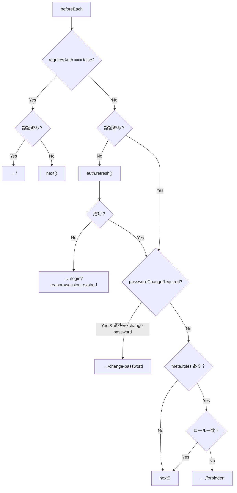
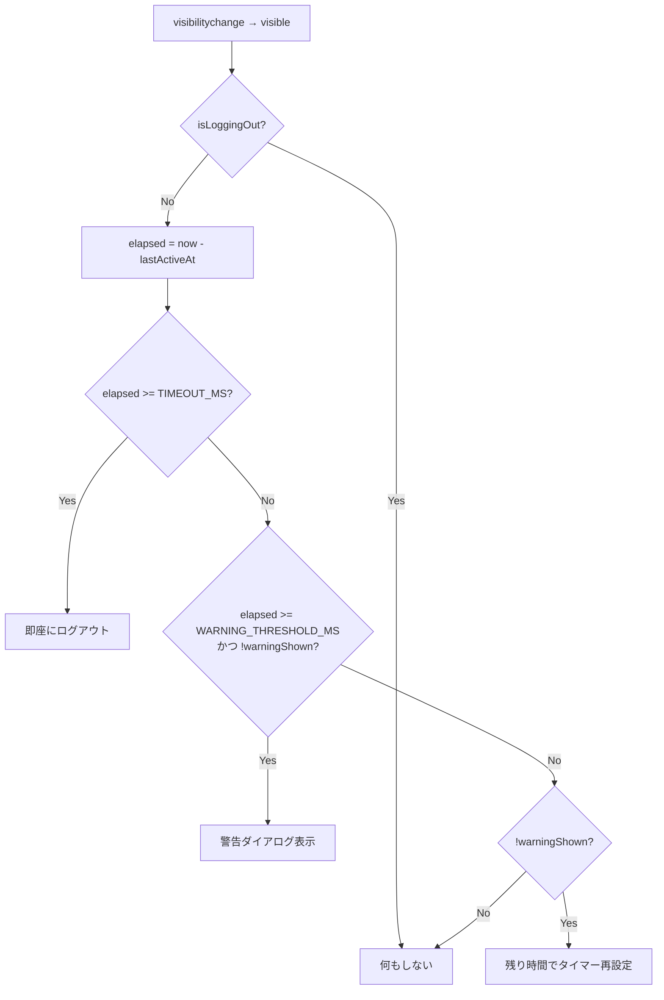

# フロントエンドアーキテクチャ設計書

> 対象: WMS（倉庫管理システム）フロントエンド
> 技術スタック: Vue 3 + TypeScript + Element Plus + Vite + Pinia + vue-i18n
> 参照: [03-frontend-architecture.md](../architecture-blueprint/03-frontend-architecture.md)（ブループリント）

---

## 1. プロジェクト構造（ディレクトリ構成）

```
frontend/
├── public/
│   └── favicon.ico
├── src/
│   ├── assets/                          # 静的リソース
│   │   ├── images/                      # 画像ファイル
│   │   │   └── logo.svg                 # WMSロゴ
│   │   └── styles/                      # グローバルスタイル
│   │       ├── variables.scss           # Element Plus テーマ変数オーバーライド
│   │       ├── global.scss              # グローバルCSS
│   │       └── transitions.scss         # トランジション定義
│   │
│   ├── components/                      # 共通UIコンポーネント
│   │   ├── layout/                      # レイアウト関連
│   │   │   ├── AppHeader.vue            # ヘッダー（倉庫切替・営業日・ユーザー）
│   │   │   ├── AppSidebar.vue           # サイドバーメニュー
│   │   │   ├── AppBreadcrumb.vue        # パンくずリスト
│   │   │   └── AppFooter.vue            # フッター
│   │   ├── common/                      # 汎用コンポーネント
│   │   │   ├── WmsTable.vue             # 一覧テーブル（el-table + ページネーション統合）
│   │   │   ├── WmsSearchForm.vue        # 検索フォームラッパー
│   │   │   ├── WmsPageHeader.vue        # ページタイトル + 操作ボタンバー
│   │   │   ├── WmsStatusBadge.vue       # ステータスバッジ
│   │   │   ├── WmsConfirmDialog.vue     # 確認ダイアログ（el-message-box ラッパー）
│   │   │   ├── WmsActiveToggle.vue      # 有効/無効切替ボタン
│   │   │   └── WmsFormSection.vue       # フォームセクション（カード+見出し）
│   │   └── report/                      # レポート関連
│   │       └── ReportExportDialog.vue   # PDF出力ダイアログ
│   │
│   ├── composables/                     # 画面単位のComposable
│   │   ├── auth/
│   │   │   ├── useLogin.ts              # AUTH-001 ログイン
│   │   │   ├── useChangePassword.ts     # AUTH-002 初回パスワード変更
│   │   │   ├── useResetRequest.ts       # AUTH-003 パスワードリセット申請
│   │   │   └── useResetConfirm.ts       # AUTH-004 パスワード再設定
│   │   ├── master/
│   │   │   ├── useProductList.ts        # MST-001 商品一覧
│   │   │   ├── useProductForm.ts        # MST-002/003 商品登録/編集
│   │   │   ├── usePartnerList.ts        # MST-011 取引先一覧
│   │   │   ├── usePartnerForm.ts        # MST-012/013 取引先登録/編集
│   │   │   ├── useWarehouseList.ts      # MST-021 倉庫一覧
│   │   │   ├── useWarehouseForm.ts      # MST-022/023 倉庫登録/編集
│   │   │   ├── useBuildingList.ts       # MST-031 棟一覧
│   │   │   ├── useBuildingForm.ts       # MST-032/033 棟登録/編集
│   │   │   ├── useAreaList.ts           # MST-041 エリア一覧
│   │   │   ├── useAreaForm.ts           # MST-042/043 エリア登録/編集
│   │   │   ├── useLocationList.ts       # MST-051 ロケーション一覧
│   │   │   ├── useLocationForm.ts       # MST-052/053 ロケーション登録/編集
│   │   │   ├── useUserList.ts           # MST-061 ユーザー一覧
│   │   │   └── useUserForm.ts           # MST-062/063 ユーザー登録/編集
│   │   ├── inbound/
│   │   │   ├── useInboundList.ts        # INB-001 入荷予定一覧
│   │   │   ├── useInboundForm.ts        # INB-002 入荷予定登録
│   │   │   ├── useInboundDetail.ts      # INB-003 入荷予定詳細
│   │   │   ├── useInboundInspect.ts     # INB-004 入荷検品
│   │   │   ├── useInboundStore.ts       # INB-005 入庫指示・確定
│   │   │   └── useInboundResults.ts     # INB-006 入荷実績照会
│   │   ├── inventory/
│   │   │   ├── useInventoryList.ts      # INV-001 在庫一覧照会
│   │   │   ├── useInventoryMove.ts      # INV-002 在庫移動
│   │   │   ├── useInventoryBreakdown.ts # INV-003 ばらし登録
│   │   │   ├── useInventoryCorrection.ts # INV-004 在庫訂正
│   │   │   ├── useStocktakeList.ts      # INV-011 棚卸一覧
│   │   │   ├── useStocktakeCreate.ts    # INV-012 棚卸開始
│   │   │   ├── useStocktakeCount.ts     # INV-013 棚卸実施
│   │   │   └── useStocktakeConfirm.ts   # INV-014 棚卸確定
│   │   ├── outbound/
│   │   │   ├── useOutboundList.ts       # OUT-001 受注一覧
│   │   │   ├── useOutboundForm.ts       # OUT-002 受注登録
│   │   │   ├── useOutboundDetail.ts     # OUT-003 受注詳細
│   │   │   ├── usePickingList.ts        # OUT-011 ピッキング指示一覧
│   │   │   ├── usePickingCreate.ts      # OUT-012 ピッキング指示作成
│   │   │   ├── usePickingComplete.ts    # OUT-013 ピッキング完了入力
│   │   │   ├── useShippingInspect.ts    # OUT-021 出荷検品
│   │   │   └── useShippingComplete.ts   # OUT-022 出荷完了
│   │   ├── allocation/
│   │   │   └── useAllocation.ts         # ALL-001 在庫引当
│   │   ├── interface/                   # 外部連携I/F画面用composable
│   │   │   └── ...
│   │   ├── batch/
│   │   │   ├── useDailyClose.ts         # BAT-001 日替処理実行
│   │   │   └── useBatchHistory.ts       # BAT-002 バッチ実行履歴
│   │   └── system/
│   │       └── useSystemParameters.ts   # SYS-001 システムパラメータ
│   │
│   ├── layouts/                         # レイアウトコンポーネント
│   │   ├── DefaultLayout.vue            # メインレイアウト（ヘッダー+サイドバー+コンテンツ）
│   │   └── AuthLayout.vue              # 認証用レイアウト（左右分割・アプリシェルなし）
│   │
│   ├── locales/                         # i18n言語ファイル
│   │   ├── ja/                          # 日本語（モジュール分割）
│   │   │   ├── common.json              # 共通（ボタン・ラベル・エラー）
│   │   │   ├── auth.json                # 認証
│   │   │   ├── master.json              # マスタ管理
│   │   │   ├── inbound.json             # 入荷管理
│   │   │   ├── inventory.json           # 在庫管理
│   │   │   ├── outbound.json            # 出荷管理
│   │   │   ├── allocation.json          # 在庫引当
│   │   │   ├── batch.json               # バッチ管理
│   │   │   ├── system.json              # システムパラメータ
│   │   │   └── report.json              # レポート
│   │   └── en/                          # 英語（同構造）
│   │       ├── common.json
│   │       ├── auth.json
│   │       └── ...
│   │
│   ├── router/                          # Vue Router設定
│   │   ├── index.ts                     # メインルーター設定
│   │   ├── guards.ts                    # ナビゲーションガード
│   │   └── routes/                      # ルート定義（モジュール分割）
│   │       ├── auth.ts
│   │       ├── master.ts
│   │       ├── inbound.ts
│   │       ├── inventory.ts
│   │       ├── outbound.ts
│   │       ├── allocation.ts
│   │       ├── interface.ts             # 外部連携I/Fルーティング
│   │       ├── batch.ts
│   │       └── system.ts
│   │
│   ├── stores/                          # Piniaストア
│   │   ├── auth.ts                      # authStore（ユーザー情報・ログイン状態）
│   │   └── system.ts                    # systemStore（営業日・選択中倉庫・言語）
│   │
│   ├── types/                           # TypeScript型定義
│   │   ├── generated/                   # OpenAPIから自動生成（手動編集禁止）
│   │   │   └── api.d.ts
│   │   ├── models.ts                    # 手動定義の共通型（ストア用等）
│   │   └── router.d.ts                  # Vue Router メタ型拡張
│   │
│   ├── utils/                           # ユーティリティ
│   │   ├── api.ts                       # Axiosインスタンス・インターセプター
│   │   ├── validators.ts                # 共通バリデーション関数（Zodスキーマ）
│   │   ├── date.ts                      # 日付ユーティリティ（営業日フォーマット等）
│   │   ├── permission.ts                # ロールベース権限チェックヘルパー
│   │   └── session-timer.ts             # セッションタイムアウト警告タイマー
│   │
│   ├── views/                           # 画面コンポーネント
│   │   ├── auth/                        # views/配下はrouter/routesと同構成
│   │   ├── master/                      # （詳細は付録A参照）
│   │   ├── inbound/
│   │   ├── inventory/
│   │   ├── outbound/
│   │   ├── allocation/
│   │   ├── interface/                   # 外部連携I/F画面
│   │   ├── batch/
│   │   ├── system/
│   │   └── NotFound.vue
│   │
│   ├── App.vue                          # ルートコンポーネント
│   └── main.ts                          # エントリポイント
│
├── tests/
│   ├── unit/                            # Vitest ユニットテスト
│   │   ├── composables/                 # Composableテスト
│   │   ├── stores/                      # Piniaストアテスト
│   │   └── utils/                       # ユーティリティテスト
│   └── e2e/                             # Playwright E2Eテスト
│       ├── auth.spec.ts
│       ├── master.spec.ts
│       ├── inbound.spec.ts
│       └── ...
│
├── index.html
├── vite.config.ts
├── tsconfig.json
├── tsconfig.node.json
├── .env                                 # ローカル開発用（VITE_API_BASE_URL等）
├── .env.production                      # 本番用
├── eslint.config.js                     # ESLint設定（Flat Config）
├── .prettierrc                          # Prettier設定
└── package.json
```

### ディレクトリ構成の設計方針

| 方針 | 内容 |
|------|------|
| **モジュール分割** | `composables/`, `views/`, `router/routes/`, `locales/` をモジュール単位（auth, master, inbound 等）で分割する |
| **Composable = 画面単位** | ブループリントの方針に従い、1画面1ファイルで閉じ込める。画面間の共有Composableは作らない |
| **共通コンポーネント** | `components/` 配下に配置。WMS固有のものは `Wms` プレフィックスを付与する |
| **型の自動生成** | `types/generated/` はOpenAPIからの自動生成。手動編集禁止 |
| **i18n分割** | モジュール単位でJSONファイルを分割し、遅延読み込みでバンドルサイズを最適化する |

---

## 2. Vue 3 Composition API 設計規約

### 2.1 Composable設計規約

ブループリント（[03-frontend-architecture.md](../architecture-blueprint/03-frontend-architecture.md)）で定義された方針に基づき、実装規約を以下に定める。

#### 命名規則

| 対象 | 規則 | 例 |
|------|------|-----|
| Composableファイル | `use{Resource}{Pattern}.ts` | `useWarehouseList.ts`, `useWarehouseForm.ts` |
| Composable関数 | `use{Resource}{Pattern}()` | `useWarehouseList()`, `useWarehouseForm()` |
| Viewファイル | `{Resource}{Pattern}.vue` | `WarehouseList.vue`, `WarehouseCreate.vue` |
| コンポーネント | PascalCase | `WmsTable.vue`, `AppHeader.vue` |

#### Composable内部の構成順序

Composable内部のコードは以下の順序で記述する。チーム全体でファイル構造を統一し、可読性を確保する。

```typescript
// composables/master/useWarehouseForm.ts
import { ref, reactive, computed } from 'vue'
import { useRouter, useRoute } from 'vue-router'
import { useI18n } from 'vue-i18n'
import { ElMessage } from 'element-plus'
import { useForm } from 'vee-validate'
import { toTypedSchema } from '@vee-validate/zod'
import { z } from 'zod'
import { apiClient } from '@/utils/api'
import type { Warehouse } from '@/types/generated/api'

export function useWarehouseForm() {
  // === 1. 依存サービス ===
  const router = useRouter()
  const route = useRoute()
  const { t } = useI18n()

  // === 2. リアクティブ状態 ===
  const loading = ref(false)
  const isEditMode = computed(() => !!route.params.id)
  const version = ref(0) // 楽観的ロック用

  // === 3. バリデーションスキーマ（Zod） ===
  const schema = toTypedSchema(
    z.object({
      warehouseCode: z.string()
        .min(1, t('master.validation.required', { field: t('master.warehouse.code') }))
        .max(4, t('master.validation.maxLength', { field: t('master.warehouse.code'), max: 4 }))
        .regex(/^[A-Z]{4}$/, t('master.warehouse.codeFormat')),
      warehouseName: z.string()
        .min(1, t('master.validation.required', { field: t('master.warehouse.name') }))
        .max(200, t('master.validation.maxLength', { field: t('master.warehouse.name'), max: 200 })),
    })
  )

  // === 4. VeeValidate フォーム ===
  const { handleSubmit, setFieldError, resetForm, values } = useForm({
    validationSchema: schema,
  })

  // === 5. API呼び出し関数 ===
  async function fetchWarehouse(id: number) {
    loading.value = true
    try {
      const res = await apiClient.get<Warehouse>(`/api/v1/master/warehouses/${id}`)
      resetForm({ values: res.data })
      version.value = res.data.version
    } finally {
      loading.value = false
    }
  }

  const onSubmit = handleSubmit(async (formValues) => {
    loading.value = true
    try {
      if (isEditMode.value) {
        await apiClient.put(`/api/v1/master/warehouses/${route.params.id}`, {
          ...formValues,
          version: version.value,
        })
        ElMessage.success(t('master.warehouse.updateSuccess'))
      } else {
        await apiClient.post('/api/v1/master/warehouses', formValues)
        ElMessage.success(t('master.warehouse.createSuccess'))
      }
      router.push({ name: 'warehouse-list' })
    } catch (e: unknown) {
      handleApiError(e)
    } finally {
      loading.value = false
    }
  })

  // === 6. エラーハンドリング ===
  function handleApiError(e: unknown) {
    const err = e as { response?: { status: number; data: { code?: string; message?: string; details?: Array<{ field: string; message: string }> } } }
    if (err.response?.status === 400 && err.response.data.details) {
      err.response.data.details.forEach((d) => setFieldError(d.field, d.message))
    } else if (err.response?.status === 409 && err.response.data.code === 'WMS-E-CMN-009') {
      ElMessage.error(t('common.error.optimisticLock'))
    } else if (err.response?.status === 409 || err.response?.status === 422) {
      ElMessage.error(err.response.data.message ?? t('common.error.businessRule'))
    }
    // 401/403/500 はAxiosインターセプターが処理済み
  }

  // === 7. return ===
  return {
    loading,
    isEditMode,
    values,
    onSubmit,
    fetchWarehouse,
  }
}
```

#### Viewファイル（.vue）の規約

.vueファイルは**表示とイベントバインディングに専念**し、ビジネスロジックをComposableに委譲する。

```vue
<!-- views/master/WarehouseCreate.vue -->
<script setup lang="ts">
import { useWarehouseForm } from '@/composables/master/useWarehouseForm'
import WmsFormSection from '@/components/common/WmsFormSection.vue'
import WmsPageHeader from '@/components/common/WmsPageHeader.vue'

const { loading, values, onSubmit } = useWarehouseForm()
</script>

<template>
  <div>
    <WmsPageHeader :title="$t('master.warehouse.createTitle')" />
    <el-form @submit.prevent="onSubmit">
      <WmsFormSection :title="$t('common.basicInfo')">
        <!-- フォーム項目 -->
      </WmsFormSection>
      <div class="form-actions">
        <el-button @click="$router.push({ name: 'warehouse-list' })">
          {{ $t('common.cancel') }}
        </el-button>
        <el-button type="primary" native-type="submit" :loading="loading">
          {{ $t('common.register') }}
        </el-button>
      </div>
    </el-form>
  </div>
</template>
```

### 2.2 コンポーネント設計規約

| 項目 | 規約 |
|------|------|
| **API** | `<script setup lang="ts">` を必須とする。Options APIは使用しない |
| **Props** | `defineProps<T>()` でTypeScript型を直接指定する。`withDefaults()` でデフォルト値を定義 |
| **Emit** | `defineEmits<T>()` で型付きEmitを定義する |
| **スタイル** | `<style scoped>` を基本とする。グローバルスタイルは `assets/styles/` に配置 |
| **テンプレート式** | 複雑なロジックはComposable内の `computed` に移動する。テンプレート内の式は3項演算子1段まで |

---

## 3. Piniaストア設計

ブループリント（[03-frontend-architecture.md](../architecture-blueprint/03-frontend-architecture.md)）で定義されたストア設計に基づき、実装詳細を記述する。

### 3.1 ストア一覧と責務

| ストア | ファイル | 責務 |
|--------|---------|------|
| **authStore** | `stores/auth.ts` | ユーザー認証状態・ロール・パスワード変更要否 |
| **systemStore** | `stores/system.ts` | 営業日・選択中倉庫・UI言語 |

> ストアに入れないデータ（検索条件、フォーム入力値、ダイアログ状態、ローディング等）の方針はブループリントを参照。

### 3.2 authStore 実装

```typescript
// stores/auth.ts
import { defineStore } from 'pinia'
import { ref, computed } from 'vue'
import { apiClient } from '@/utils/api'

interface UserInfo {
  userId: number        // OpenAPI LoginResponse: userId（SSOT: openapi/wms-api.yaml）
  userCode: string
  fullName: string      // OpenAPI LoginResponse: fullName（SSOT: openapi/wms-api.yaml）
  role: 'SYSTEM_ADMIN' | 'WAREHOUSE_MANAGER' | 'WAREHOUSE_STAFF' | 'VIEWER'
  passwordChangeRequired: boolean
}

export const useAuthStore = defineStore('auth', () => {
  // --- 状態 ---
  const user = ref<UserInfo | null>(null)

  // --- 算出プロパティ ---
  const isLoggedIn = computed(() => user.value !== null)
  const isAdmin = computed(() => user.value?.role === 'SYSTEM_ADMIN')
  const isManager = computed(() =>
    user.value?.role === 'SYSTEM_ADMIN' || user.value?.role === 'WAREHOUSE_MANAGER'
  )
  const requiresPasswordChange = computed(() => user.value?.passwordChangeRequired === true)
  const userRole = computed(() => user.value?.role ?? null)

  // --- アクション ---
  async function login(userCode: string, password: string) {
    const res = await apiClient.post<UserInfo>('/api/v1/auth/login', {
      userCode,
      password,
    })
    user.value = res.data
  }

  async function fetchCurrentUser() {
    try {
      const res = await apiClient.get<UserInfo>('/api/v1/auth/me')
      user.value = res.data
    } catch {
      user.value = null
    }
  }

  async function logout() {
    try {
      await apiClient.post('/api/v1/auth/logout')
    } finally {
      clearUser()
    }
  }

  function clearUser() {
    user.value = null
  }

  function markPasswordChanged() {
    if (user.value) {
      user.value.passwordChangeRequired = false
    }
  }

  return {
    user,
    isLoggedIn,
    isAdmin,
    isManager,
    requiresPasswordChange,
    userRole,
    login,
    fetchCurrentUser,
    logout,
    clearUser,
    markPasswordChanged,
  }
})
```

### 3.3 systemStore 実装

```typescript
// stores/system.ts
import { defineStore } from 'pinia'
import { ref, watch } from 'vue'
import { useI18n } from 'vue-i18n'
import { apiClient } from '@/utils/api'

interface Warehouse {
  id: number
  warehouseCode: string
  warehouseName: string
}

export const useSystemStore = defineStore('system', () => {
  // --- 状態 ---
  const businessDate = ref<string>('')  // 'YYYY-MM-DD'
  const selectedWarehouseId = ref<number | null>(null)
  const selectedWarehouseCode = ref<string>('')
  const warehouses = ref<Warehouse[]>([])
  const locale = ref<'ja' | 'en'>('ja')

  // --- アクション ---
  async function fetchBusinessDate() {
    const res = await apiClient.get<{ businessDate: string }>('/api/v1/system/business-date')
    businessDate.value = res.data.businessDate
  }

  async function fetchWarehouses() {
    const res = await apiClient.get<Warehouse[]>('/api/v1/master/warehouses', {
      params: { isActive: true, sort: 'warehouseCode,asc' },
    })
    warehouses.value = res.data
    // デフォルト倉庫選択: 倉庫コード昇順の先頭
    if (warehouses.value.length > 0 && selectedWarehouseId.value === null) {
      selectWarehouse(warehouses.value[0])
    }
  }

  function selectWarehouse(warehouse: Warehouse) {
    selectedWarehouseId.value = warehouse.id
    selectedWarehouseCode.value = warehouse.warehouseCode
  }

  function setLocale(newLocale: 'ja' | 'en') {
    locale.value = newLocale
    localStorage.setItem('wms-locale', newLocale)
  }

  function loadLocaleFromStorage() {
    const stored = localStorage.getItem('wms-locale') as 'ja' | 'en' | null
    if (stored) {
      locale.value = stored
    }
  }

  return {
    businessDate,
    selectedWarehouseId,
    selectedWarehouseCode,
    warehouses,
    locale,
    fetchBusinessDate,
    fetchWarehouses,
    selectWarehouse,
    setLocale,
    loadLocaleFromStorage,
  }
})
```

### 3.4 倉庫切替時の動作

倉庫切替は `systemStore.selectWarehouse()` を呼び出し、`selectedWarehouseId` の変更を各画面が `watch` で検知してデータを再取得する。

```typescript
// composables/master/useBuildingList.ts（部分）
import { watch } from 'vue'
import { useSystemStore } from '@/stores/system'

export function useBuildingList() {
  const systemStore = useSystemStore()

  watch(() => systemStore.selectedWarehouseId, () => {
    // 倉庫切替時に一覧を再取得（検索条件はリセット）
    resetSearch()
    fetchList()
  })

  // ...
}
```

> 倉庫マスタ管理画面（MST-021/022/023）はヘッダー倉庫切替の影響を受けない（全倉庫を管理する性質のため）。該当画面の Composable では `watch` を設けない。

### 倉庫切替時の画面リロード対象

`systemStore.selectedWarehouseId` の `watch` による再取得が必要な画面と、不要な画面の一覧を示す。Composable 実装時にこの表を参照し、倉庫依存画面には必ず `watch` を設けること。

判定基準: API呼び出し時に `warehouseId`（Axiosインターセプターによる自動付与を含む）をパラメータとして使用する画面を「倉庫依存」とする。倉庫コンテキストの適用除外は [01-overall-architecture.md セクション8.3](01-overall-architecture.md#83-倉庫コンテキストの適用除外) を参照。

| 画面ID | 画面名 | 倉庫依存 | リロード動作 |
|--------|--------|:--------:|------------|
| AUTH-001〜004 | 認証系（ログイン・パスワード変更・リセット） | — | リロード不要（認証は倉庫に依存しない） |
| MST-001〜003 | 商品マスタ | — | リロード不要（全倉庫共通） |
| MST-011〜013 | 取引先マスタ | — | リロード不要（全倉庫共通） |
| MST-021〜023 | 倉庫マスタ | — | リロード不要（倉庫自体の管理画面） |
| MST-031〜053 | 棟・エリア・ロケーションマスタ | ○ | 選択中倉庫配下のみ表示。切替時に検索条件をリセットして再取得 |
| MST-061〜063 | ユーザーマスタ | — | リロード不要（全倉庫共通） |
| INB-001〜006 | 入荷管理（一覧・登録・詳細・検品・入庫・実績） | ○ | 切替時に一覧を再取得。詳細・編集系画面は一覧へ遷移 |
| INV-001〜004 | 在庫管理（一覧・移動・ばらし・訂正） | ○ | 切替時に在庫一覧を再取得。操作系画面は一覧へ遷移 |
| INV-011〜014 | 棚卸管理（一覧・開始・実数入力・確定） | ○ | 切替時に棚卸一覧を再取得。詳細系画面は一覧へ遷移 |
| OUT-001〜022 | 出荷管理（受注一覧・登録・詳細・ピッキング・検品・出荷確認） | ○ | 切替時に受注一覧を再取得。詳細・操作系画面は一覧へ遷移 |
| ALL-001 | 引当管理 | ○ | 切替時に引当対象受注一覧を再取得 |
| RTN-001 | 返品登録 | ○ | 切替時にフォームをリセット（ロケーション候補が倉庫依存） |
| BAT-001〜002 | バッチ管理（日替処理・実行履歴） | — | リロード不要（全倉庫を対象に処理） |
| SYS-001 | システムパラメータ | — | リロード不要（システム全体の設定） |
| IF-001〜003 | I/F管理（ファイル一覧・バリデーション結果・取り込み履歴） | ○ | 切替時にファイル一覧を再取得（バリデーション・取り込み時に `warehouseId` を送信） |

> **実装上の注意**: 詳細・編集系画面（INB-003〜005、OUT-003、OUT-013、OUT-021〜022、INV-013〜014 等）で倉庫切替が発生した場合、表示中のデータが切替後の倉庫に属さない可能性がある。これらの画面では倉庫切替検知時に対応する一覧画面へ `router.push()` で遷移し、データ不整合を防止する。

---

## 4. vue-i18n 多言語対応設計

### 4.1 基本方針

| 項目 | 内容 |
|------|------|
| **対応言語** | 日本語（ja）・英語（en） |
| **デフォルト言語** | 日本語（ja） |
| **言語切替** | ヘッダーの言語セレクタから切替可能 |
| **永続化** | `localStorage` に保存し、次回アクセス時に復元 |
| **フォールバック** | 英語キーが見つからない場合、日本語をフォールバックとして表示 |

### 4.2 メッセージファイル構造

モジュール単位でファイルを分割し、i18n の `messages` にマージする。

```typescript
// main.ts（i18n初期化部分）
import { createI18n } from 'vue-i18n'

// 共通メッセージは同期読み込み
import jaCommon from '@/locales/ja/common.json'
import enCommon from '@/locales/en/common.json'

const i18n = createI18n({
  legacy: false, // Composition API mode
  locale: 'ja',
  fallbackLocale: 'ja',
  messages: {
    ja: { common: jaCommon },
    en: { common: enCommon },
  },
})

export default i18n
```

### 4.3 モジュール別メッセージの遅延読み込み

各モジュールのメッセージはルーター遷移時に動的にロードする。

```typescript
// router/guards.ts（言語リソース遅延読み込み部分）
async function loadLocaleModule(locale: string, module: string) {
  const messages = await import(`@/locales/${locale}/${module}.json`)
  i18n.global.mergeLocaleMessage(locale, { [module]: messages.default })
}

// 各ルートの beforeEnter で必要モジュールを読み込み
{
  path: '/inbound',
  beforeEnter: async () => {
    const locale = i18n.global.locale.value
    await loadLocaleModule(locale, 'inbound')
  },
}
```

### 4.4 メッセージキー命名規則

```
{module}.{category}.{key}
```

| 階層 | 例 | 用途 |
|------|-----|------|
| `common.button.search` | 「検索」 | 全画面共通のボタンラベル |
| `common.error.optimisticLock` | 「他のユーザーが更新済みです...」 | 共通エラーメッセージ |
| `master.warehouse.code` | 「倉庫コード」 | マスタ管理モジュール固有のラベル |
| `inbound.slip.createSuccess` | 「入荷予定を登録しました」 | 入荷管理モジュール固有のメッセージ |

### 4.5 共通メッセージファイル例

```json
// locales/ja/common.json
{
  "button": {
    "search": "検索",
    "clear": "クリア",
    "register": "登録",
    "update": "更新",
    "cancel": "キャンセル",
    "delete": "削除",
    "enable": "有効化",
    "disable": "無効化",
    "back": "戻る",
    "export": "PDF出力"
  },
  "label": {
    "status": "状態",
    "active": "有効",
    "inactive": "無効",
    "all": "すべて",
    "basicInfo": "基本情報",
    "businessDate": "営業日",
    "total": "件数"
  },
  "validation": {
    "required": "{field}は必須です",
    "maxLength": "{field}は{max}文字以内で入力してください",
    "minValue": "{field}は{min}以上を入力してください",
    "format": "{field}の形式が正しくありません"
  },
  "error": {
    "optimisticLock": "他のユーザーが更新済みです。画面を再読み込みしてください",
    "forbidden": "この操作を実行する権限がありません",
    "systemError": "システムエラーが発生しました",
    "notFound": "指定されたデータが見つかりません",
    "fetchFailed": "データの取得に失敗しました。再度お試しください"
  },
  "confirm": {
    "discard": "入力内容が失われますが、キャンセルしてよろしいですか？",
    "disable": "無効化してよろしいですか？"
  }
}
```

---

## 5. Element Plus コンポーネント利用規約・カスタマイズ方針

### 5.1 利用方針

| 項目 | 方針 |
|------|------|
| **インポート方式** | 自動インポート（`unplugin-vue-components` + `unplugin-auto-import`）を使用する。手動 import は不要 |
| **アイコン** | `@element-plus/icons-vue` を使用する |
| **カスタマイズ範囲** | テーマ変数のオーバーライドに限定する。コンポーネント内部のDOMハック・スタイル上書きは原則禁止 |

### 5.2 テーマカスタマイズ

Element Plus のSCSS変数をオーバーライドしてWMSのブランドカラーを適用する。

```scss
// assets/styles/variables.scss
// Element Plus テーマ変数オーバーライド
$--color-primary: #2c3e50;         // メインカラー（ダークネイビー）
$--color-success: #27ae60;         // 成功（有効バッジ等）
$--color-warning: #f39c12;         // 警告
$--color-danger: #e74c3c;          // エラー・削除
$--color-info: #3498db;            // 情報

// フォント
$--font-size-base: 14px;
$--font-size-small: 12px;

// テーブル
$--table-header-bg-color: #f5f7fa;
$--table-border-color: #ebeef5;

// サイドバー
$--sidebar-width: 220px;
$--sidebar-collapsed-width: 64px;
```

Vite設定でSCSS変数を注入する。

```typescript
// vite.config.ts（CSS設定部分）
export default defineConfig({
  css: {
    preprocessorOptions: {
      scss: {
        additionalData: `@use "@/assets/styles/variables.scss" as *;`,
      },
    },
  },
})
```

### 5.3 Element Plus コンポーネント利用ガイドライン

| 用途 | 使用コンポーネント | 備考 |
|------|------------------|------|
| 一覧テーブル | `el-table` + `el-table-column` | `WmsTable.vue` ラッパーで統合 |
| ページネーション | `el-pagination` | `WmsTable.vue` に内蔵 |
| フォーム入力 | `el-form` + `el-form-item` | VeeValidateと連携 |
| テキスト入力 | `el-input` | |
| 数値入力 | `el-input-number` | |
| 日付選択 | `el-date-picker` | |
| セレクト | `el-select` + `el-option` | |
| ラジオ | `el-radio-group` + `el-radio` | |
| チェックボックス | `el-checkbox` | |
| ボタン | `el-button` | |
| 通知メッセージ | `ElMessage` | 成功/エラー/警告のトースト通知 |
| 確認ダイアログ | `ElMessageBox.confirm` | 危険操作の確認 |
| ステータスバッジ | `el-tag` | `WmsStatusBadge.vue` でステータス別カラーを一元管理 |
| レイアウト | `el-container` + `el-aside` + `el-main` | DefaultLayout.vue で使用 |
| メニュー | `el-menu` + `el-sub-menu` | AppSidebar.vue で使用 |
| パンくず | `el-breadcrumb` | AppBreadcrumb.vue で使用 |

### 5.4 ステータスバッジのカラーマッピング

```typescript
// components/common/WmsStatusBadge.vue
const statusColorMap: Record<string, string> = {
  // 入荷ステータス
  PLANNED: 'info',
  CONFIRMED: 'warning',
  INSPECTING: 'warning',
  PARTIAL_STORED: 'warning',
  STORED: 'success',
  CANCELLED: 'danger',

  // 出荷ステータス
  ORDERED: 'info',
  PARTIAL_ALLOCATED: 'warning',
  ALLOCATED: 'warning',
  PICKING: 'warning',
  SHIPPING_INSPECT: 'warning',
  SHIPPED: 'success',

  // 共通
  ACTIVE: 'success',
  INACTIVE: 'info',
}
```

---

## 6. ルーティング設計

### 6.1 ルート定義

ルートはモジュール単位でファイルを分割し、`router/index.ts` で統合する。

```typescript
// router/index.ts
import { createRouter, createWebHistory } from 'vue-router'
import { setupGuards } from './guards'
import { authRoutes } from './routes/auth'
import { masterRoutes } from './routes/master'
import { inboundRoutes } from './routes/inbound'
import { inventoryRoutes } from './routes/inventory'
import { outboundRoutes } from './routes/outbound'
import { allocationRoutes } from './routes/allocation'
import { interfaceRoutes } from './routes/interface'
import { batchRoutes } from './routes/batch'
import { systemRoutes } from './routes/system'

const router = createRouter({
  history: createWebHistory(),
  routes: [
    ...authRoutes,
    {
      path: '/',
      component: () => import('@/layouts/DefaultLayout.vue'),
      meta: { requiresAuth: true },
      children: [
        ...masterRoutes,
        ...inboundRoutes,
        ...inventoryRoutes,
        ...outboundRoutes,
        ...allocationRoutes,
        ...interfaceRoutes,
        ...batchRoutes,
        ...systemRoutes,
      ],
    },
    {
      path: '/:pathMatch(.*)*',
      name: 'NotFound',
      component: () => import('@/views/NotFound.vue'),
    },
  ],
})

setupGuards(router)
export default router
```

### 6.2 ルート定義例（入荷管理）

```typescript
// router/routes/inbound.ts
import type { RouteRecordRaw } from 'vue-router'

export const inboundRoutes: RouteRecordRaw[] = [
  {
    path: '/inbound/slips',
    name: 'InboundList',
    component: () => import('@/views/inbound/InboundList.vue'),
    meta: {
      roles: ['SYSTEM_ADMIN', 'WAREHOUSE_MANAGER', 'WAREHOUSE_STAFF', 'VIEWER'],
      breadcrumb: ['inbound.menu', 'inbound.slipList'],
    },
  },
  {
    path: '/inbound/slips/new',
    name: 'InboundCreate',
    component: () => import('@/views/inbound/InboundCreate.vue'),
    meta: {
      roles: ['SYSTEM_ADMIN', 'WAREHOUSE_MANAGER', 'WAREHOUSE_STAFF'],
      breadcrumb: ['inbound.menu', 'inbound.slipList', 'inbound.slipCreate'],
    },
  },
  {
    path: '/inbound/slips/:id',
    name: 'InboundDetail',
    component: () => import('@/views/inbound/InboundDetail.vue'),
    meta: {
      roles: ['SYSTEM_ADMIN', 'WAREHOUSE_MANAGER', 'WAREHOUSE_STAFF', 'VIEWER'],
      breadcrumb: ['inbound.menu', 'inbound.slipList', 'inbound.slipDetail'],
    },
  },
  {
    path: '/inbound/slips/:id/inspect',
    name: 'InboundInspect',
    component: () => import('@/views/inbound/InboundInspect.vue'),
    meta: {
      roles: ['SYSTEM_ADMIN', 'WAREHOUSE_MANAGER', 'WAREHOUSE_STAFF'],
      breadcrumb: ['inbound.menu', 'inbound.slipDetail', 'inbound.inspect'],
    },
  },
  {
    path: '/inbound/slips/:id/store',
    name: 'InboundStore',
    component: () => import('@/views/inbound/InboundStore.vue'),
    meta: {
      roles: ['SYSTEM_ADMIN', 'WAREHOUSE_MANAGER', 'WAREHOUSE_STAFF'],
      breadcrumb: ['inbound.menu', 'inbound.slipDetail', 'inbound.store'],
    },
  },
  {
    path: '/inbound/results',
    name: 'InboundResults',
    component: () => import('@/views/inbound/InboundResults.vue'),
    meta: {
      roles: ['SYSTEM_ADMIN', 'WAREHOUSE_MANAGER', 'WAREHOUSE_STAFF', 'VIEWER'],
      breadcrumb: ['inbound.menu', 'inbound.results'],
    },
  },
]
```

### 6.3 ルートメタ型定義

```typescript
// types/router.d.ts
import 'vue-router'
import type { UserRole } from '@/stores/auth'

declare module 'vue-router' {
  interface RouteMeta {
    /** 認証必須フラグ（デフォルト: 親ルートから継承） */
    requiresAuth?: boolean
    /**
     * アクセス許可ロール。
     * 指定された場合、ユーザーのロールが含まれていなければ /forbidden へリダイレクト。
     * 未指定の場合はロールチェックをスキップ（認証のみで到達可能）。
     */
    roles?: UserRole[]
    /** パンくずリストのi18nキー配列 */
    breadcrumb?: string[]
  }
}
```

### 6.4 ナビゲーションガード

ガードは `router/index.ts` の `beforeEach` に直接記述する（ファイル分割なし）。

```typescript
// router/index.ts
import { createRouter, createWebHistory } from 'vue-router'
import { useAuthStore } from '@/stores/auth'
// RouteMeta 型拡張は types/router.d.ts で定義

const router = createRouter({ ... })

router.beforeEach(async (to) => {
  const auth = useAuthStore()

  // --- 1. 認証不要ページ ---
  if (to.meta.requiresAuth === false) {
    if (auth.isAuthenticated) return { path: '/' }
    return true
  }

  // --- 2. 認証チェック（リフレッシュ試行）---
  if (!auth.isAuthenticated) {
    const ok = await auth.refresh()
    if (!ok) {
      return { name: 'login', query: { redirect: to.fullPath, reason: 'session_expired' } }
    }
  }

  // --- 3. パスワード変更強制 ---
  if (auth.user?.passwordChangeRequired && to.name !== 'change-password') {
    return { name: 'change-password' }
  }

  // --- 4. ロールチェック ---
  const requiredRoles = to.meta.roles
  if (requiredRoles && requiredRoles.length > 0) {
    const userRole = auth.user?.role
    if (!userRole || !requiredRoles.includes(userRole)) {
      return { name: 'forbidden' }  // /forbidden ページへリダイレクト
    }
  }

  return true
})
```

### 6.5 ナビゲーションガードのフロー



---

## 7. API通信層設計

### 7.1 Axiosインスタンス

ブループリント（[03-frontend-architecture.md](../architecture-blueprint/03-frontend-architecture.md)）で定義された仕様に基づき、実装詳細を記述する。

```typescript
// utils/api.ts
import axios, { type AxiosError, type InternalAxiosRequestConfig } from 'axios'
import router from '@/router'
import { useAuthStore } from '@/stores/auth'
import { useSystemStore } from '@/stores/system'
import { ElMessage } from 'element-plus'
import i18n from '@/main'

// === Axiosインスタンス ===
export const apiClient = axios.create({
  baseURL: import.meta.env.VITE_API_BASE_URL,
  withCredentials: true,  // httpOnly Cookie 自動送信
  timeout: 30000,         // 30秒タイムアウト
  headers: {
    'Content-Type': 'application/json',
  },
})

// === リクエストインターセプター ===
apiClient.interceptors.request.use((config: InternalAxiosRequestConfig) => {
  // Accept-Language ヘッダーにUI言語をセット
  const systemStore = useSystemStore()
  config.headers['Accept-Language'] = systemStore.locale

  return config
})
```

### 7.2 レスポンスインターセプター（401リフレッシュ対応）

ブループリントの仕様に基づき、リフレッシュ中に他のリクエストが同時に401を受けた場合のキュー制御を実装する。

```typescript
// utils/api.ts（続き）

let isRefreshing = false
let failedQueue: Array<{
  resolve: (value: unknown) => void
  reject: (reason: unknown) => void
  config: InternalAxiosRequestConfig
}> = []

function processQueue(error: AxiosError | null) {
  failedQueue.forEach(({ resolve, reject, config }) => {
    if (error) {
      reject(error)
    } else {
      resolve(apiClient(config))
    }
  })
  failedQueue = []
}

// === レスポンスインターセプター ===
apiClient.interceptors.response.use(
  (response) => response,
  async (error: AxiosError) => {
    const originalRequest = error.config as InternalAxiosRequestConfig & { _retry?: boolean }
    const status = error.response?.status

    // --- 401: トークンリフレッシュ ---
    if (status === 401 && !originalRequest._retry) {
      if (isRefreshing) {
        // リフレッシュ中 → キューに追加して待機
        return new Promise((resolve, reject) => {
          failedQueue.push({ resolve, reject, config: originalRequest })
        })
      }

      originalRequest._retry = true
      isRefreshing = true

      try {
        await axios.post(
          `${import.meta.env.VITE_API_BASE_URL}/api/v1/auth/refresh`,
          {},
          { withCredentials: true }
        )
        processQueue(null)
        return apiClient(originalRequest) // 元リクエストをリトライ
      } catch (refreshError) {
        processQueue(refreshError as AxiosError)
        const authStore = useAuthStore()
        authStore.clearUser()
        router.push({ name: 'login', query: { reason: 'session_expired' } })
        return Promise.reject(refreshError)
      } finally {
        isRefreshing = false
      }
    }

    // --- 403: 権限不足 ---
    if (status === 403) {
      const { t } = i18n.global
      ElMessage.error(t('common.error.forbidden'))
      return Promise.reject(error)
    }

    // --- 500: システムエラー ---
    if (status && status >= 500) {
      const { t } = i18n.global
      ElMessage.error(t('common.error.systemError'))
      return Promise.reject(error)
    }

    // --- 400, 409, 422: 業務エラー → 各Composableの try/catch に委譲 ---
    return Promise.reject(error)
  }
)
```

### 7.3 セッションタイムアウト警告

認証アーキテクチャ（[07-auth-architecture.md](../architecture-blueprint/07-auth-architecture.md)）の仕様に基づき、55分経過時に警告ダイアログを表示する。

```typescript
// utils/session-timer.ts（抜粋）
const MAX_TIMEOUT_MS = 480 * 60 * 1000    // 上限: 8時間
const ACTIVITY_THROTTLE_MS = 30_000       // スロットリング間隔: 30秒
let WARNING_THRESHOLD_MS = 55 * 60 * 1000 // 55分（API取得で上書き可）
let TIMEOUT_MS = 60 * 60 * 1000           // 60分（API取得で上書き可）
let isActive = false  // ライフサイクル管理フラグ
let interceptorId: number | null = null   // Axiosインターセプターeject用

// --- アクティビティ検知 ---
// mousemove は 60Hz+ で発火するため、30秒間隔でスロットリングする。
// タイムアウトの粒度（55分）に対して十分に細かい。
function onActivity() {
  const now = Date.now()
  if (now - lastActiveAt < ACTIVITY_THROTTLE_MS) return
  resetSessionTimer()
}

// --- サーバー値バリデーション ---
// 上限: 8時間。warning >= timeout の場合はタイムアウト5分前にフォールバック。
function applySessionConfig(data: Record<string, unknown>): void {
  const timeout = data?.timeoutMinutes
  const warning = data?.warningMinutes
  if (typeof timeout === 'number' && timeout > 0) {
    TIMEOUT_MS = Math.min(timeout * 60 * 1000, MAX_TIMEOUT_MS)
  }
  if (typeof warning === 'number' && warning > 0) {
    WARNING_THRESHOLD_MS = Math.min(warning * 60 * 1000, MAX_TIMEOUT_MS)
  }
  if (WARNING_THRESHOLD_MS >= TIMEOUT_MS) {
    WARNING_THRESHOLD_MS = Math.max(TIMEOUT_MS - 5 * 60 * 1000, 0)
  }
}

// --- Axiosインターセプターのライフサイクル管理 ---
// startSessionTimer() で登録、stopSessionTimer() で eject する。
// isActive フラグにより、タイマー停止後の API レスポンスでタイマーが
// 再起動されるのを防ぐ。
interceptorId = apiClient.interceptors.response.use((response) => {
  if (isActive) { startTimers() }
  return response
})

// タイマーリセットのトリガー:
// 1. DOMイベント（mousemove, click, keydown, touchstart）— 30秒スロットリング
// 2. Axiosレスポンス成功時（インターセプター経由、isActive時のみ）
// 3. visibilitychange 復帰時（閾値未満の場合、残り時間で再設定）
```

#### 7.3.1 バックグラウンドタブ・スリープ復帰時チェック

ブラウザのバックグラウンドタブ最適化（タイマー throttling）やPCスリープにより、`setTimeout` が大幅に遅延する問題に対応する。`Page Visibility API`（`visibilitychange` イベント）を使用し、タブがアクティブに復帰した際に実際の経過時間を検証する。

##### 課題

- ブラウザはバックグラウンドタブの `setTimeout` を最小1秒間隔に制限する（Chrome の場合）
- PCスリープ中は `setTimeout` が完全に停止する
- 例: 55分タイマー設定後にPCスリープ → 復帰後、`setTimeout` が発火するまで追加の遅延が発生し、実際の経過時間とタイマー発火のタイミングが乖離する

##### 設計方針

- 最後のアクティビティ時刻（`lastActiveAt`）を `Date.now()` で記録する
- タイマーリセット時（`startTimers()`）に `lastActiveAt` を更新する
- `visibilitychange` イベントで `visible` 状態への遷移を検知し、実経過時間で判定する
- `setTimeout` の補償メカニズムであり、`setTimeout` 自体を置き換えるものではない

```typescript
let lastActiveAt = Date.now()

function onVisibilityChange() {
  if (document.visibilityState !== 'visible') return
  if (isLoggingOut) return

  const elapsed = Date.now() - lastActiveAt
  if (elapsed >= TIMEOUT_MS) {
    doLogout()                // タイムアウト超過 → 即座にログアウト
  } else if (elapsed >= WARNING_THRESHOLD_MS && !warningShown) {
    showWarning()             // 警告閾値超過 → 警告ダイアログ表示
  } else if (!warningShown) {
    // 閾値未満 → 残り時間でタイマーを再設定（lastActiveAt は更新しない）
    clearTimers()
    const warningRemaining = WARNING_THRESHOLD_MS - elapsed
    const timeoutRemaining = TIMEOUT_MS - elapsed
    warningTimer = setTimeout(showWarning, warningRemaining)
    timeoutTimer = setTimeout(doLogout, timeoutRemaining)
  }
}

// startSessionTimer() 内で登録
document.addEventListener('visibilitychange', onVisibilityChange)
// stopSessionTimer() 内で解除
document.removeEventListener('visibilitychange', onVisibilityChange)
```

**重要**: 復帰時に `startTimers()` を呼ぶと `lastActiveAt` がリセットされ、タブ切替だけで全タイムアウト時間が再付与されてしまう。復帰時は必ず残り時間で再設定する。

##### 判定フロー



### 7.4 マルチタブ間ログアウト同期

複数タブでアプリを開いている場合、1タブでログアウトが発生した際に他タブも即座にログアウトする。`BroadcastChannel` API を使用してタブ間でログアウトイベントを伝播させる。

#### 設計方針

- **`BroadcastChannel('wms_session')`** をモジュールロード時に初期化（`session-timer.ts` 内）
- セッションタイムアウト・手動ログアウトの両方で `{ type: 'logout' }` メッセージを送信
- 受信側は `broadcast: false` で呼び出し、再ブロードキャストを防ぐ（無限ループ回避）
- `BroadcastChannel` 非対応ブラウザ（IE等）は `typeof BroadcastChannel !== 'undefined'` で検出し、単タブ動作にフォールバック
- **nonce によるメッセージ検証**: チャンネル名だけを知る外部スクリプト（ブラウザ拡張等）からのログアウト注入を防ぐ多層防御

#### nonce 検証

`localStorage` に `wms_bc_nonce` キーで nonce（`crypto.randomUUID()`）を保持し、タブ間で共有する。送信時に nonce を含め、受信時に検証することで、nonce を知らない外部からの注入を阻止する。

> **制約**: XSS が成立した場合は `localStorage` も読めるため完全な防御ではない。チャンネル名だけを知る単純な注入攻撃を防ぐ多層防御として位置づける。

```typescript
// nonce 管理
const BC_NONCE_KEY = 'wms_bc_nonce'

function getSessionNonce(): string {
  let nonce = localStorage.getItem(BC_NONCE_KEY)
  if (!nonce) {
    nonce = crypto.randomUUID()
    localStorage.setItem(BC_NONCE_KEY, nonce)
  }
  return nonce
}

// 実行時型ガード（外部からの payload を検証）
function isLogoutMessage(data: unknown): data is { type: 'logout'; nonce: string } {
  return (
    typeof data === 'object' && data !== null &&
    (data as Record<string, unknown>)['type'] === 'logout' &&
    typeof (data as Record<string, unknown>)['nonce'] === 'string'
  )
}

// 受信: 型ガード + nonce 検証の両方を通過したメッセージのみ処理
if (bc) {
  bc.onmessage = (event: MessageEvent<unknown>) => {
    if (isLogoutMessage(event.data) && event.data.nonce === getSessionNonce()) {
      doLogout({ broadcast: false })
    }
  }
}

// 送信: nonce を含める
if (options?.broadcast !== false && bc) {
  bc.postMessage({ type: 'logout', nonce: getSessionNonce() })
}

// セッション開始時に nonce をローテーション（前セッションの nonce を無効化）
function rotateSessionNonce(): void {
  localStorage.setItem(BC_NONCE_KEY, crypto.randomUUID())
}

// ログアウト時に nonce を削除
function clearSessionNonce(): void {
  localStorage.removeItem(BC_NONCE_KEY)
}
```

**nonce ライフサイクル:**
- `startSessionTimer()` 時に `rotateSessionNonce()` で新規 nonce を発行（前セッションの nonce を無効化）
- `doLogout()` 時に `clearSessionNonce()` で localStorage から削除

#### 同期対象

| イベント | 同期 | 備考 |
|---------|------|------|
| セッションタイムアウト（60分） | ✅ | `doLogout()` 経由で送信 |
| 警告ダイアログでログアウト選択 | ✅ | `doLogout()` 経由で送信 |
| 手動ログアウト（ヘッダーボタン） | ✅ | `doLogout()` 経由で送信 |
| セッション延長（リフレッシュ） | ❌ | 各タブが独立したタイマーで動作（許容） |

---

## 8. 共通コンポーネント設計

### 8.1 WmsTable（一覧テーブル統合コンポーネント）

el-table + el-pagination を統合し、一覧画面の定型コードを削減する。

```typescript
// components/common/WmsTable.vue のProps定義
interface Props {
  data: unknown[]            // テーブルデータ
  loading: boolean           // ローディング状態
  total: number              // 総件数
  page: number               // 現在ページ（0ベース）
  size: number               // ページサイズ
  pageSizes?: number[]       // ページサイズ選択肢（デフォルト: [20, 50, 100]）
}
```

```vue
<!-- 使用例（一覧画面） -->
<WmsTable
  :data="items"
  :loading="loading"
  :total="totalElements"
  :page="page"
  :size="size"
  @page-change="onPageChange"
  @size-change="onSizeChange"
>
  <el-table-column prop="warehouseCode" :label="$t('master.warehouse.code')" />
  <el-table-column prop="warehouseName" :label="$t('master.warehouse.name')" />
  <el-table-column prop="isActive" :label="$t('common.label.status')">
    <template #default="{ row }">
      <WmsStatusBadge :status="row.isActive ? 'ACTIVE' : 'INACTIVE'" />
    </template>
  </el-table-column>
  <el-table-column :label="$t('common.label.actions')" width="200">
    <template #default="{ row }">
      <el-button size="small" @click="goEdit(row.id)">
        {{ $t('common.button.edit') }}
      </el-button>
      <WmsActiveToggle :is-active="row.isActive" @toggle="toggleActive(row.id)" />
    </template>
  </el-table-column>
</WmsTable>
```

### 8.2 WmsSearchForm（検索フォームラッパー）

検索フォームの「検索」「クリア」ボタン配置を統一する。

```vue
<!-- components/common/WmsSearchForm.vue -->
<script setup lang="ts">
defineEmits<{
  search: []
  clear: []
}>()
</script>

<template>
  <el-card shadow="never" class="wms-search-form">
    <el-form inline>
      <slot />
      <el-form-item>
        <el-button type="primary" @click="$emit('search')">
          {{ $t('common.button.search') }}
        </el-button>
        <el-button @click="$emit('clear')">
          {{ $t('common.button.clear') }}
        </el-button>
      </el-form-item>
    </el-form>
  </el-card>
</template>
```

### 8.3 WmsPageHeader（ページヘッダー）

ページタイトルとアクションボタンを統一レイアウトで配置する。

```vue
<!-- components/common/WmsPageHeader.vue -->
<script setup lang="ts">
defineProps<{
  title: string
}>()
</script>

<template>
  <div class="wms-page-header">
    <h2>{{ title }}</h2>
    <div class="wms-page-header__actions">
      <slot />
    </div>
  </div>
</template>
```

### 8.4 WmsStatusBadge（ステータスバッジ）

ステータスコードからカラーと表示テキストを一元変換する。

```vue
<!-- components/common/WmsStatusBadge.vue -->
<script setup lang="ts">
import { computed } from 'vue'
import { useI18n } from 'vue-i18n'

const props = defineProps<{
  status: string
}>()

const { t } = useI18n()

const colorMap: Record<string, 'success' | 'warning' | 'info' | 'danger'> = {
  ACTIVE: 'success',
  INACTIVE: 'info',
  PLANNED: 'info',
  CONFIRMED: 'warning',
  INSPECTING: 'warning',
  PARTIAL_STORED: 'warning',
  STORED: 'success',
  CANCELLED: 'danger',
  ORDERED: 'info',
  PARTIAL_ALLOCATED: 'warning',
  ALLOCATED: 'warning',
  PICKING: 'warning',
  SHIPPING_INSPECT: 'warning',
  SHIPPED: 'success',
}

const tagType = computed(() => colorMap[props.status] ?? 'info')
const label = computed(() => t(`common.status.${props.status}`))
</script>

<template>
  <el-tag :type="tagType" size="small" effect="light">{{ label }}</el-tag>
</template>
```

### 8.5 ReportExportDialog（レポート出力ダイアログ）

各業務画面からレポートPDFを出力する共通ダイアログ。

```vue
<!-- components/report/ReportExportDialog.vue -->
<script setup lang="ts">
import { ref } from 'vue'
import { apiClient } from '@/utils/api'
import { ElMessage } from 'element-plus'

const props = defineProps<{
  visible: boolean
  reportId: string            // RPT-001 等
  title: string
  apiEndpoint: string         // レポートAPIのパス
}>()

const emit = defineEmits<{
  'update:visible': [value: boolean]
}>()

const loading = ref(false)

async function exportPdf(params: Record<string, unknown>) {
  loading.value = true
  try {
    const res = await apiClient.get(props.apiEndpoint, {
      params,
      responseType: 'blob',
    })
    // Blobからダウンロード
    const url = window.URL.createObjectURL(new Blob([res.data], { type: 'application/pdf' }))
    const link = document.createElement('a')
    link.href = url
    link.download = `${props.reportId}_${new Date().toISOString().slice(0, 10)}.pdf`
    link.click()
    window.URL.revokeObjectURL(url)
    emit('update:visible', false)
  } catch {
    ElMessage.error('レポートの出力に失敗しました')
  } finally {
    loading.value = false
  }
}
</script>
```

### 8.6 共通コンポーネント一覧

| コンポーネント | 用途 | 使用画面 |
|-------------|------|---------|
| `AppHeader` | ヘッダー（倉庫切替・営業日・ユーザー情報） | DefaultLayout |
| `AppSidebar` | サイドバーメニュー（ロール制御つき） | DefaultLayout |
| `AppBreadcrumb` | パンくずリスト | DefaultLayout |
| `WmsTable` | 一覧テーブル + ページネーション統合 | 全一覧画面 |
| `WmsSearchForm` | 検索フォーム（検索/クリアボタン統合） | 全一覧画面 |
| `WmsPageHeader` | ページタイトル + アクションボタンバー | 全画面 |
| `WmsStatusBadge` | ステータスバッジ（カラーマッピング一元管理） | 全画面 |
| `WmsConfirmDialog` | 確認ダイアログ（ElMessageBox ラッパー） | 削除/無効化等 |
| `WmsActiveToggle` | 有効/無効切替ボタン | 全マスタ一覧 |
| `WmsFormSection` | フォームセクション（カード + 見出し） | 全登録/編集画面 |
| `ReportExportDialog` | PDFレポート出力ダイアログ | 各業務画面 |

---

## 9. ビルド・デプロイ設計

### 9.1 Vite設定

```typescript
// vite.config.ts
import { defineConfig, loadEnv } from 'vite'
import vue from '@vitejs/plugin-vue'
import AutoImport from 'unplugin-auto-import/vite'
import Components from 'unplugin-vue-components/vite'
import { ElementPlusResolver } from 'unplugin-vue-components/resolvers'
import { fileURLToPath, URL } from 'node:url'

export default defineConfig(({ mode }) => {
  const env = loadEnv(mode, process.cwd())

  return {
    plugins: [
      vue(),
      AutoImport({
        resolvers: [ElementPlusResolver()],
        imports: ['vue', 'vue-router', 'vue-i18n', 'pinia'],
        dts: 'src/auto-imports.d.ts',
      }),
      Components({
        resolvers: [ElementPlusResolver({ importStyle: 'sass' })],
        dts: 'src/components.d.ts',
        dirs: ['src/components'],
      }),
    ],

    resolve: {
      alias: {
        '@': fileURLToPath(new URL('./src', import.meta.url)),
      },
    },

    css: {
      preprocessorOptions: {
        scss: {
          additionalData: `@use "@/assets/styles/variables.scss" as *;`,
        },
      },
    },

    server: {
      port: 3000,
      proxy: {
        '/api': {
          target: env.VITE_API_BASE_URL || 'http://localhost:8080',
          changeOrigin: true,
        },
      },
    },

    build: {
      target: 'es2022',
      outDir: 'dist',
      sourcemap: false,
      rollupOptions: {
        output: {
          manualChunks: {
            'element-plus': ['element-plus'],
            'vue-vendor': ['vue', 'vue-router', 'pinia', 'vue-i18n'],
            'form-libs': ['vee-validate', 'zod'],
          },
        },
      },
    },
  }
})
```

### 9.2 環境変数

| 変数名 | 用途 | ローカル | 本番 |
|--------|------|---------|------|
| `VITE_API_BASE_URL` | バックエンドAPIのベースURL | `http://localhost:8080` | `https://wms-api.{domain}` |
| `VITE_APP_TITLE` | アプリケーションタイトル | `WMS (Dev)` | `WMS` |

### 9.3 Azure Blob Storageへのデプロイ

フロントエンドのビルド成果物は Azure Blob Storage の静的Webサイトホスティングにデプロイする。

```
ビルドフロー:
  npm run build
     ↓
  dist/ ディレクトリ生成
     ↓
  Azure CLI（az storage blob upload-batch）で $web コンテナにアップロード
     ↓
  Azure CDN（キャッシュパージ）
```

#### デプロイスクリプト

```bash
#!/bin/bash
# deploy.sh（CI/CDで実行）

STORAGE_ACCOUNT="wmsfrontend"
CONTAINER='$web'

# ビルド
npm ci
npm run build

# アップロード
az storage blob upload-batch \
  --account-name $STORAGE_ACCOUNT \
  --destination $CONTAINER \
  --source ./dist \
  --overwrite

# CDNキャッシュパージ（Azure CDN使用時）
az cdn endpoint purge \
  --resource-group wms-rg \
  --profile-name wms-cdn \
  --name wms-frontend \
  --content-paths "/*"
```

#### SPA対応（404フォールバック）

Azure Blob Storage の静的Webサイト設定で、エラードキュメントパスに `index.html` を指定する。Vue Router の `history` モードで直接URLアクセスされた場合も、`index.html` が返却されてクライアント側でルーティングされる。

### 9.4 API型定義の自動生成

API型定義は `openapi/wms-api.yaml`（APIインターフェースのSSOT）から `openapi-typescript` で自動生成する。

```bash
# OpenAPI定義から型定義を生成
npx openapi-typescript ../openapi/wms-api.yaml -o src/types/generated/api.d.ts
```

```bash
# package.json scripts
{
  "scripts": {
    "dev": "vite",
    "build": "vue-tsc --noEmit && vite build",
    "preview": "vite preview",
    "generate-types": "npx openapi-typescript ../openapi/wms-api.yaml -o src/types/generated/api.d.ts",
    "lint": "eslint . --ext .vue,.ts",
    "format": "prettier --write \"src/**/*.{vue,ts,scss,json}\"",
    "test:unit": "vitest run",
    "test:e2e": "playwright test"
  }
}
```

---

## 10. エントリポイント（main.ts）

```typescript
// main.ts
import { createApp } from 'vue'
import { createPinia } from 'pinia'
import App from './App.vue'
import router from './router'
import i18n from './i18n' // i18n設定ファイルを別途分離
import './assets/styles/global.scss'

// Element Plus 日本語ロケール
import ElementPlus from 'element-plus'
import ja from 'element-plus/es/locale/lang/ja'

const app = createApp(App)
const pinia = createPinia()

app.use(pinia)
app.use(router)
app.use(i18n)
app.use(ElementPlus, { locale: ja })

// アプリ起動時にロケール設定を復元
import { useSystemStore } from './stores/system'
const systemStore = useSystemStore()
systemStore.loadLocaleFromStorage()
i18n.global.locale.value = systemStore.locale

app.mount('#app')
```

---

## 11. バリデーション設計

### 11.1 VeeValidate + Zod 連携

フロントエンドのフォームバリデーションは VeeValidate + Zod の組み合わせで実装する。

| 役割 | ライブラリ | 用途 |
|------|-----------|------|
| **スキーマ定義** | Zod | バリデーションルールの宣言的定義 |
| **フォーム統合** | VeeValidate | Vue 3フォーム状態管理・エラー表示連携 |
| **ブリッジ** | `@vee-validate/zod` (`toTypedSchema`) | Zodスキーマ → VeeValidateスキーマ変換 |

### 11.2 共通バリデーション関数

```typescript
// utils/validators.ts
import { z } from 'zod'

/** 必須文字列（空文字不可） */
export const requiredString = (fieldName: string) =>
  z.string().min(1, `${fieldName}は必須です`)

/** 最大文字数制限付き文字列 */
export const maxLengthString = (fieldName: string, max: number) =>
  z.string().max(max, `${fieldName}は${max}文字以内で入力してください`)

/** 正の整数 */
export const positiveInteger = (fieldName: string) =>
  z.number().int().min(1, `${fieldName}は1以上の整数を入力してください`)

/** 日付（YYYY-MM-DD形式） */
export const dateString = () =>
  z.string().regex(/^\d{4}-\d{2}-\d{2}$/, '日付の形式が正しくありません')

/** パスワードポリシー */
export const passwordSchema = () =>
  z.string()
    .min(8, 'パスワードは8文字以上で入力してください')
    .max(128, 'パスワードは128文字以内で入力してください')
    .regex(/[A-Z]/, '英大文字を1文字以上含めてください')
    .regex(/[a-z]/, '英小文字を1文字以上含めてください')
    .regex(/[0-9]/, '数字を1文字以上含めてください')
```

### 11.3 バリデーション実行タイミング

| タイミング | 方式 | 対象 |
|-----------|------|------|
| **入力中（リアルタイム）** | VeeValidateのblurイベント | 必須・文字数・形式チェック |
| **送信時** | `handleSubmit` | 全項目の再バリデーション |
| **サーバー応答後** | `setFieldError` | 一意制約違反等のサーバーサイドバリデーション結果をフォームに反映 |

---

## 12. 未入力離脱防止

フォーム画面で入力途中にページを離脱しようとした場合、確認ダイアログを表示する。

```typescript
// composables内での離脱防止パターン
import { onBeforeRouteLeave } from 'vue-router'
import { ElMessageBox } from 'element-plus'

export function useUnsavedChangesGuard(isDirty: () => boolean) {
  onBeforeRouteLeave(async (_to, _from, next) => {
    if (!isDirty()) {
      return next()
    }
    try {
      await ElMessageBox.confirm(
        '入力内容が失われますが、キャンセルしてよろしいですか？',
        '確認',
        { type: 'warning' }
      )
      next()
    } catch {
      next(false)
    }
  })

  // ブラウザリロード・タブ閉じ対策
  window.addEventListener('beforeunload', (e) => {
    if (isDirty()) {
      e.preventDefault()
    }
  })
}
```

---

## 付録A: views/ ディレクトリ構成

> views/配下はrouter/routesと同構成でモジュール分割する。

```
views/
├── auth/
│   ├── Login.vue               # AUTH-001
│   ├── ChangePassword.vue      # AUTH-002
│   ├── ResetRequest.vue        # AUTH-003
│   └── ResetConfirm.vue        # AUTH-004
├── master/
│   ├── ProductList.vue         # MST-001
│   ├── ProductCreate.vue       # MST-002
│   ├── ProductEdit.vue         # MST-003
│   ├── PartnerList.vue         # MST-011
│   ├── PartnerCreate.vue       # MST-012
│   ├── PartnerEdit.vue         # MST-013
│   ├── WarehouseList.vue       # MST-021
│   ├── WarehouseCreate.vue     # MST-022
│   ├── WarehouseEdit.vue       # MST-023
│   ├── BuildingList.vue        # MST-031
│   ├── BuildingCreate.vue      # MST-032
│   ├── BuildingEdit.vue        # MST-033
│   ├── AreaList.vue            # MST-041
│   ├── AreaCreate.vue          # MST-042
│   ├── AreaEdit.vue            # MST-043
│   ├── LocationList.vue        # MST-051
│   ├── LocationCreate.vue      # MST-052
│   ├── LocationEdit.vue        # MST-053
│   ├── UserList.vue            # MST-061
│   ├── UserCreate.vue          # MST-062
│   └── UserEdit.vue            # MST-063
├── inbound/
│   ├── InboundList.vue         # INB-001
│   ├── InboundCreate.vue       # INB-002
│   ├── InboundDetail.vue       # INB-003
│   ├── InboundInspect.vue      # INB-004
│   ├── InboundStore.vue        # INB-005
│   └── InboundResults.vue      # INB-006
├── inventory/
│   ├── InventoryList.vue       # INV-001
│   ├── InventoryMove.vue       # INV-002
│   ├── InventoryBreakdown.vue  # INV-003
│   ├── InventoryCorrection.vue # INV-004
│   ├── StocktakeList.vue       # INV-011
│   ├── StocktakeCreate.vue     # INV-012
│   ├── StocktakeCount.vue      # INV-013
│   └── StocktakeConfirm.vue    # INV-014
├── outbound/
│   ├── OutboundList.vue        # OUT-001
│   ├── OutboundCreate.vue      # OUT-002
│   ├── OutboundDetail.vue      # OUT-003
│   ├── PickingList.vue         # OUT-011
│   ├── PickingCreate.vue       # OUT-012
│   ├── PickingComplete.vue     # OUT-013
│   ├── ShippingInspect.vue     # OUT-021
│   └── ShippingComplete.vue    # OUT-022
├── allocation/
│   └── Allocation.vue          # ALL-001
├── interface/                   # 外部連携I/F画面（画面追加時にここへ配置）
│   └── ...
├── batch/
│   ├── DailyClose.vue          # BAT-001
│   └── BatchHistory.vue        # BAT-002
├── system/
│   └── SystemParameters.vue    # SYS-001
└── NotFound.vue                # 404ページ
```
