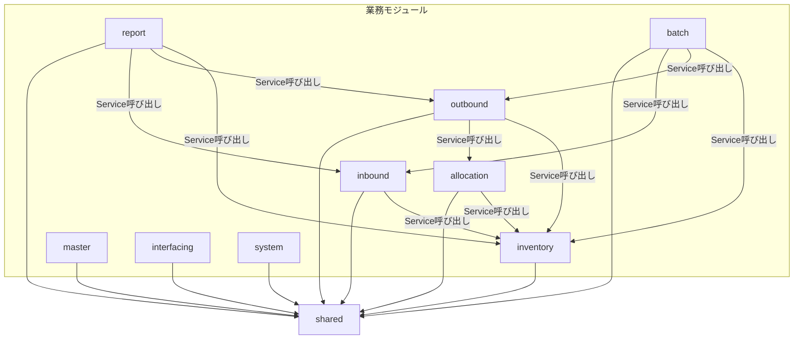
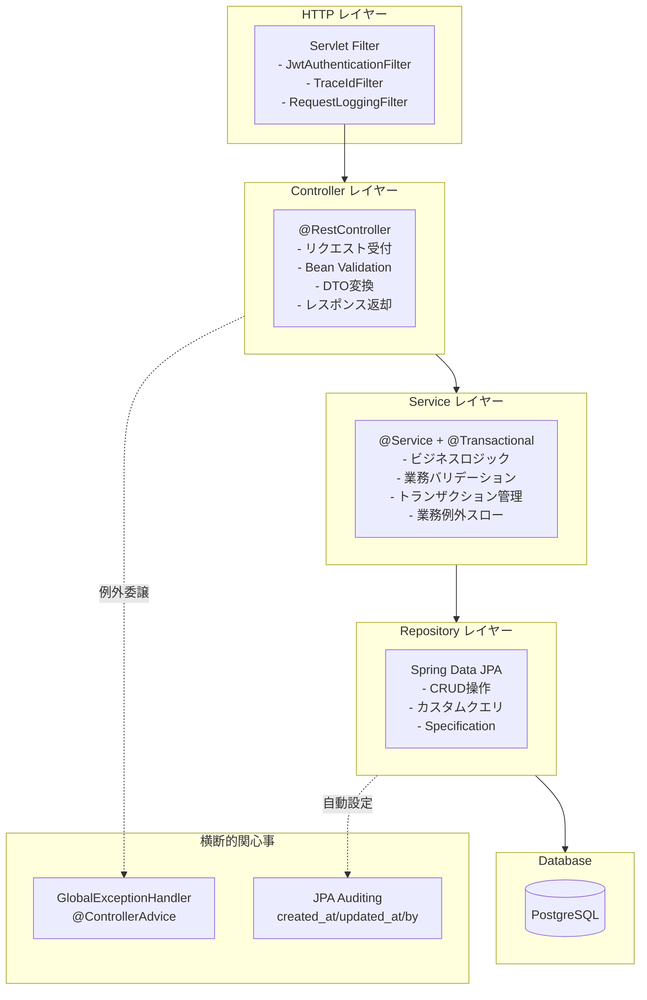
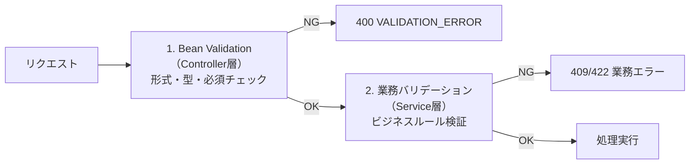
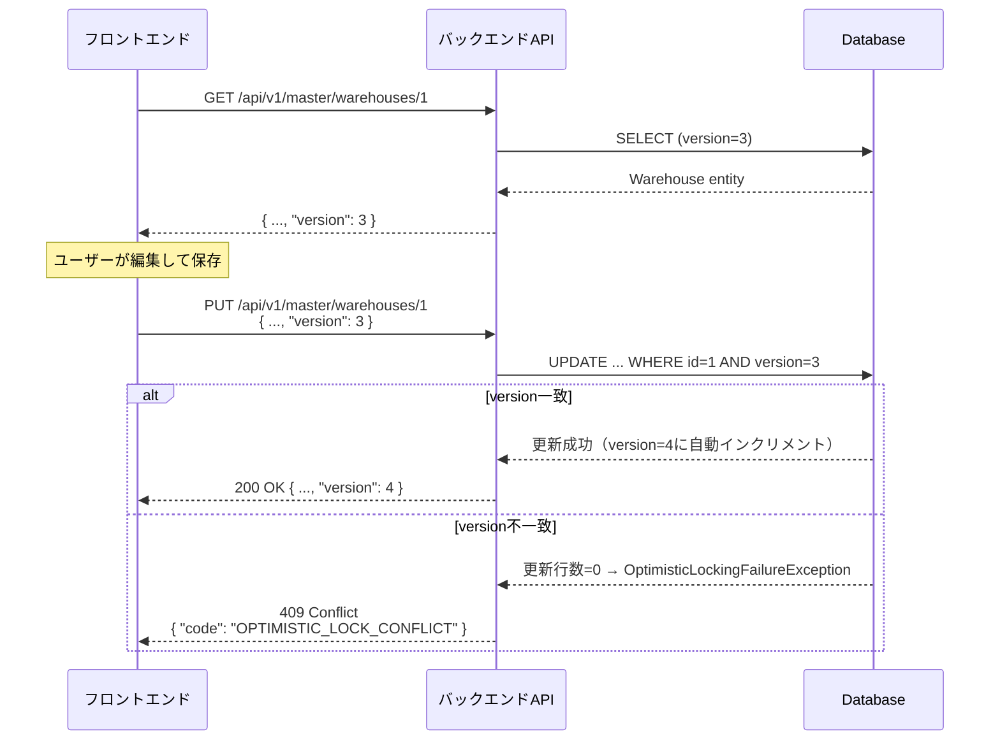

# バックエンドアーキテクチャ設計書

> **対象**: Spring Boot 3.x + Java 21 バックエンドアプリケーション
> **参照**: [04-backend-architecture.md](../architecture-blueprint/04-backend-architecture.md)（ブループリント）

---

## 目次

1. [プロジェクト構造](#1-プロジェクト構造)
2. [レイヤードアーキテクチャ設計](#2-レイヤードアーキテクチャ設計)
3. [DTO設計規約](#3-dto設計規約)
4. [例外ハンドリング設計](#4-例外ハンドリング設計)
5. [バリデーション設計](#5-バリデーション設計)
6. [トランザクション管理設計](#6-トランザクション管理設計)
7. [排他制御設計](#7-排他制御設計)
8. [ページネーション・ソート設計](#8-ページネーションソート設計)
9. [ロギング設計](#9-ロギング設計)
10. [テスト戦略](#10-テスト戦略)
11. [レポートモジュール設計](#11-レポートモジュール設計)

---

## 1. プロジェクト構造

### 1.1 Gradleモジュール構成

本プロジェクトはモジュラーモノリスを採用するが、Gradleマルチモジュールは採用しない。単一Gradleプロジェクト内でパッケージによりモジュールを分離する。

> **理由**: 1人開発であり、Gradleマルチモジュールの依存管理コストが得られるメリットを上回る。将来的にモジュール分離が必要になった場合はパッケージ構造がそのままモジュール境界になる。

```
wms-backend/
├── build.gradle
├── settings.gradle
├── gradle/
│   └── wrapper/
├── src/
│   ├── main/
│   │   ├── java/com/wms/
│   │   │   ├── WmsApplication.java          # Spring Boot メインクラス
│   │   │   ├── shared/                       # 共通基盤
│   │   │   ├── master/                       # マスタ管理
│   │   │   ├── inbound/                      # 入荷管理
│   │   │   ├── inventory/                    # 在庫管理
│   │   │   ├── allocation/                   # 在庫引当
│   │   │   ├── outbound/                     # 出荷管理
│   │   │   ├── report/                       # レポート
│   │   │   ├── batch/                        # バッチ処理
│   │   │   ├── interfacing/                  # 外部連携I/F
│   │   │   └── system/                       # システム共通
│   │   └── resources/
│   │       ├── application.yml               # 共通設定
│   │       ├── application-dev.yml          # 開発環境（ローカル開発含む）
│   │       ├── application-prd.yml           # 本番
│   │       ├── db/migration/                 # Flyway マイグレーション
│   │       └── logback-spring.xml            # ログ設定
│   └── test/
│       └── java/com/wms/
│           ├── shared/
│           ├── master/
│           └── ...                           # 各モジュールのテスト
└── Dockerfile
```

> **Spring Profile方針:** ローカル開発環境でも `SPRING_PROFILES_ACTIVE=dev` を使用する。`local` プロファイルは設けない。dev環境（Azure上）とローカル開発で同一の設定ファイル（`application-dev.yml`）を共有し、差異は環境変数で吸収する。

### 1.2 パッケージ構成

各業務モジュールは以下の統一パッケージ構成を持つ。

```
com.wms.{module}/
├── controller/          # REST Controller
│   └── {Resource}Controller.java
├── service/             # ビジネスロジック
│   ├── {Resource}Service.java
│   └── impl/            # 必要に応じてインタフェース分離（原則は具象クラスのみ）
├── repository/          # Spring Data JPA Repository
│   └── {Resource}Repository.java
├── dto/                 # リクエスト/レスポンスDTO
│   ├── Create{Resource}Request.java
│   ├── Update{Resource}Request.java
│   ├── {Resource}Response.java
│   └── {Resource}SearchCriteria.java
└── entity/              # JPA Entity
    └── {Resource}.java
```

#### shared パッケージの構成

```
com.wms.shared/
├── config/              # Spring 設定クラス
│   ├── SecurityConfig.java         # Spring Security 設定
│   ├── CorsConfig.java             # CORS 設定
│   ├── OpenApiConfig.java          # Springdoc OpenAPI 設定
│   └── JpaAuditingConfig.java      # JPA Auditing 設定
├── exception/           # 例外クラス・ハンドラー
│   ├── WmsException.java           # 基底例外クラス
│   ├── ResourceNotFoundException.java
│   ├── DuplicateResourceException.java
│   ├── BusinessRuleViolationException.java
│   ├── OptimisticLockConflictException.java
│   ├── InvalidStateTransitionException.java
│   ├── ErrorResponse.java          # エラーレスポンスDTO
│   ├── FieldError.java             # フィールドエラーDTO
│   └── GlobalExceptionHandler.java # @ControllerAdvice
├── security/            # JWT 認証
│   ├── JwtTokenProvider.java       # JWT 生成・検証
│   ├── JwtAuthenticationFilter.java # Servlet Filter
│   └── WmsUserDetails.java      # UserDetails 実装
├── logging/             # ロギング
│   ├── RequestLoggingFilter.java          # リクエストログ
│   ├── PiiMasker.java                     # PIIマスキングロジック（メール・電話・JWT・パスワード）
│   ├── PiiMaskingMessageJsonProvider.java # 本番: LogstashEncoder の message フィールドマスキング
│   ├── PiiMaskingStackTraceJsonProvider.java # 本番: スタックトレースのマスキング
│   ├── PiiMaskingPatternLayoutEncoder.java  # 開発: テキストログのマスキング
│   ├── TraceIdFilter.java                 # traceId・userId のMDC設定
│   ├── TraceContext.java                  # MDC キー定数
│   └── ServiceLoggingAspect.java          # 業務操作AOPログ
├── entity/              # 共通Entityクラス
│   ├── BaseEntity.java             # 監査カラム基底クラス
│   └── AuditorAwareImpl.java       # 監査ユーザー取得
├── dto/                 # 共通DTO
│   └── PageResponse.java           # ページングレスポンス
└── util/                # ユーティリティ
    └── BusinessDateProvider.java   # 営業日取得
```

### 1.3 モジュール間の依存ルール

> 方針の詳細は [04-backend-architecture.md（ブループリント）](../architecture-blueprint/04-backend-architecture.md) のモジュール間の依存ルールを参照。



**依存ルールの遵守方法:**

- 他モジュールの Repository は直接参照しない。必ずそのモジュールの Service 経由でアクセスする
- 他モジュールの Entity は参照のみ許可（JPA の `@ManyToOne` 等で外部キーを保持するため）
- Controller 間の直接呼び出しは禁止

### 1.4 build.gradle の主要依存関係

```groovy
plugins {
    id 'java'
    id 'org.springframework.boot' version '3.4.x'
    id 'io.spring.dependency-management' version '1.1.x'
    id 'org.openapi.generator' version '7.4.0'
}

java {
    toolchain {
        languageVersion = JavaLanguageVersion.of(21)
    }
}

// --- API First: OpenAPIからControllerインターフェース + DTOを自動生成 ---
openApiGenerate {
    generatorName = "spring"
    inputSpec = "${rootProject.projectDir}/../openapi/wms-api.yaml"
    outputDir = "${buildDir}/generated"
    apiPackage = "com.wms.generated.api"
    modelPackage = "com.wms.generated.model"
    configOptions = [
        interfaceOnly: "true",
        useSpringBoot3: "true",
        useTags: "true",
        dateLibrary: "java8-localdatetime"
    ]
}

sourceSets {
    main {
        java {
            srcDir "${buildDir}/generated/src/main/java"
        }
    }
}

dependencies {
    // Spring Boot Starters
    implementation 'org.springframework.boot:spring-boot-starter-web'
    implementation 'org.springframework.boot:spring-boot-starter-data-jpa'
    implementation 'org.springframework.boot:spring-boot-starter-security'
    implementation 'org.springframework.boot:spring-boot-starter-validation'
    implementation 'org.springframework.boot:spring-boot-starter-actuator'

    // Database
    runtimeOnly 'org.postgresql:postgresql'
    implementation 'org.flywaydb:flyway-core'
    implementation 'org.flywaydb:flyway-database-postgresql'

    // JWT
    implementation 'io.jsonwebtoken:jjwt-api:0.12.x'
    runtimeOnly 'io.jsonwebtoken:jjwt-impl:0.12.x'
    runtimeOnly 'io.jsonwebtoken:jjwt-jackson:0.12.x'

    // OpenAPI
    implementation 'org.springdoc:springdoc-openapi-starter-webmvc-ui:2.x'

    // PDF生成（Thymeleaf HTML → PDF）
    implementation 'org.springframework.boot:spring-boot-starter-thymeleaf'
    implementation 'org.xhtmlrenderer:flying-saucer-openpdf:9.7.1'

    // Logging (JSON)
    implementation 'net.logstash.logback:logstash-logback-encoder:8.x'

    // Lombok（Entity・DTOのボイラープレート削減）
    compileOnly 'org.projectlombok:lombok'
    annotationProcessor 'org.projectlombok:lombok'

    // Test
    testImplementation 'org.springframework.boot:spring-boot-starter-test'
    testImplementation 'org.springframework.security:spring-security-test'
    testImplementation 'org.testcontainers:junit-jupiter'
    testImplementation 'org.testcontainers:postgresql'
}
```

### 1.5 Java 21 の活用方針

| 機能 | 活用箇所 | 方針 |
|------|---------|------|
| **Record** | DTO（リクエスト/レスポンス）、検索条件 | イミュータブルなDTOとして積極的に使用する |
| **Sealed Classes** | 例外クラス階層 | `WmsException` を `sealed` として定義し、サブクラスを限定する |
| **Pattern Matching for switch** | ステータス遷移ロジック | `switch` 式で網羅性を活かしたステータス判定を行う |
| **Text Blocks** | ネイティブクエリ、ログメッセージ | 複数行文字列を見やすく記述する |
| **Virtual Threads** | 将来検討 | Spring Boot 3.2+ で対応可能。現時点では通常スレッドプールを使用し、負荷テスト後に検討する |

---

## 2. レイヤードアーキテクチャ設計

### 2.1 レイヤー概要

> 方針の詳細は [04-backend-architecture.md（ブループリント）](../architecture-blueprint/04-backend-architecture.md) のアーキテクチャパターンを参照。



### 2.2 Controller レイヤー

#### API First 方式

本プロジェクトでは **API First** 方式を採用する。OpenAPI定義（`openapi/wms-api.yaml`）がAPIインターフェースのSSOTであり、Controllerインターフェースおよびリクエスト/レスポンスDTOはOpenAPIから自動生成する。

| 項目 | 方針 |
|------|------|
| **インターフェース定義** | `openapi/wms-api.yaml` から `openapi-generator-gradle-plugin` で自動生成 |
| **Controllerの実装** | 自動生成されたインターフェースを `implements` して業務ロジックを実装する |
| **DTO** | OpenAPIの `schemas` から自動生成。手書きDTOは原則禁止（後述「DTO設計規約」参照） |
| **Springdoc** | 開発時のSwagger UI表示用に残す（自動生成されたコードのドキュメント確認用） |

```java
// 自動生成されたインターフェース（build/generated/src/main/java/com/wms/generated/api/）
public interface WarehousesApi {
    ResponseEntity<WarehouseResponse> getWarehouse(Long id);
    ResponseEntity<PageResponseWarehouseResponse> getWarehouses(...);
    ResponseEntity<WarehouseResponse> createWarehouse(CreateWarehouseRequest request);
    // ...
}

// 開発者が実装するController
@RestController
@RequiredArgsConstructor
public class WarehouseController implements WarehousesApi {
    private final WarehouseService warehouseService;

    @Override
    public ResponseEntity<WarehouseResponse> getWarehouse(Long id) {
        Warehouse warehouse = warehouseService.findById(id);
        return ResponseEntity.ok(WarehouseResponse.from(warehouse));
    }
    // ...
}
```

#### 責務

- HTTPリクエストの受付・パースおよびHTTPレスポンスの生成
- Jakarta Bean Validation の実行（`@Valid`）
- Entity から DTO への変換（Service から受け取った Entity を DTO に変換して返却）
- **例外処理は行わない**（`GlobalExceptionHandler` に委譲）
- **Entity を直接レスポンスとして返却しない**

#### 実装パターン

```java
@RestController
@RequestMapping("/api/v1/master/warehouses")
@RequiredArgsConstructor
public class WarehouseController {

    private final WarehouseService warehouseService;

    @GetMapping
    @PreAuthorize("isAuthenticated()")
    public PageResponse<WarehouseResponse> getWarehouses(
            WarehouseSearchCriteria criteria,
            @PageableDefault(size = 20, sort = "warehouseCode") Pageable pageable) {
        Page<Warehouse> page = warehouseService.findAll(criteria, pageable);
        return PageResponse.from(page, WarehouseResponse::from);
    }

    @PostMapping
    @PreAuthorize("hasAnyRole('SYSTEM_ADMIN', 'WAREHOUSE_MANAGER')")
    public ResponseEntity<WarehouseResponse> createWarehouse(
            @Valid @RequestBody CreateWarehouseRequest request) {
        Warehouse warehouse = warehouseService.create(request);
        return ResponseEntity.status(HttpStatus.CREATED)
                .body(WarehouseResponse.from(warehouse));
    }

    @GetMapping("/{id}")
    @PreAuthorize("isAuthenticated()")
    public WarehouseResponse getWarehouse(@PathVariable Long id) {
        Warehouse warehouse = warehouseService.findById(id);
        return WarehouseResponse.from(warehouse);
    }

    @PutMapping("/{id}")
    @PreAuthorize("hasAnyRole('SYSTEM_ADMIN', 'WAREHOUSE_MANAGER')")
    public WarehouseResponse updateWarehouse(
            @PathVariable Long id,
            @Valid @RequestBody UpdateWarehouseRequest request) {
        Warehouse warehouse = warehouseService.update(id, request);
        return WarehouseResponse.from(warehouse);
    }

    @PatchMapping("/{id}/deactivate")
    @PreAuthorize("hasAnyRole('SYSTEM_ADMIN', 'WAREHOUSE_MANAGER')")
    public WarehouseResponse deactivateWarehouse(@PathVariable Long id) {
        Warehouse warehouse = warehouseService.deactivate(id);
        return WarehouseResponse.from(warehouse);
    }
}
```

#### アノテーション規約

| アノテーション | 用途 |
|-------------|------|
| `@RestController` | REST API コントローラー |
| `@RequestMapping` | ベースパスの設定 |
| `@PreAuthorize` | メソッドレベルの認可チェック |
| `@Valid` | Bean Validation の実行トリガー |
| `@PageableDefault` | ページネーションのデフォルト値 |

### 2.3 Service レイヤー

#### 責務

- ビジネスロジックの実行
- 業務バリデーション（Bean Validation ではカバーできないルール）
- トランザクション管理（`@Transactional`）
- 業務例外（`WmsException` サブクラス）のスロー
- Repository 層の例外（`DataIntegrityViolationException` 等）のキャッチとカスタム例外への変換

#### 実装パターン

```java
@Service
@RequiredArgsConstructor
@Transactional(readOnly = true)
public class WarehouseService {

    private final WarehouseRepository warehouseRepository;
    private final InventoryService inventoryService;  // 他モジュールのService参照（許可）

    public Page<Warehouse> findAll(WarehouseSearchCriteria criteria, Pageable pageable) {
        return warehouseRepository.findAll(
                WarehouseSpecification.withCriteria(criteria), pageable);
    }

    public Warehouse findById(Long id) {
        return warehouseRepository.findById(id)
                .orElseThrow(() -> new ResourceNotFoundException(
                        "WAREHOUSE_NOT_FOUND", "指定された倉庫が見つかりません"));
    }

    @Transactional
    public Warehouse create(CreateWarehouseRequest request) {
        // 業務バリデーション: コード重複チェック
        if (warehouseRepository.existsByWarehouseCode(request.warehouseCode())) {
            throw new DuplicateResourceException(
                    "DUPLICATE_CODE", "倉庫コードが既に登録されています");
        }
        Warehouse warehouse = request.toEntity();
        return warehouseRepository.save(warehouse);
    }

    @Transactional
    public Warehouse update(Long id, UpdateWarehouseRequest request) {
        Warehouse warehouse = findById(id);
        // 楽観ロック: バージョンチェックは JPA @Version で自動実施
        warehouse.updateFrom(request);
        try {
            return warehouseRepository.save(warehouse);
        } catch (OptimisticLockingFailureException e) {
            throw new OptimisticLockConflictException(
                    "OPTIMISTIC_LOCK_CONFLICT",
                    "他のユーザーによって更新されています。画面を再読み込みしてください");
        }
    }

    @Transactional
    public Warehouse deactivate(Long id) {
        Warehouse warehouse = findById(id);
        // 業務バリデーション: 在庫があれば無効化不可
        if (inventoryService.existsByWarehouseId(id)) {
            throw new BusinessRuleViolationException(
                    "CANNOT_DEACTIVATE_HAS_INVENTORY", "在庫が存在するため無効化できません");
        }
        warehouse.deactivate();
        return warehouseRepository.save(warehouse);
    }
}
```

#### SystemParameterService のデータ取得方針

`SystemParameterService` はシステムパラメータを**都度DBから取得する（キャッシュしない）**。

| 項目 | 方針 |
|------|------|
| **キャッシュ** | 使用しない |
| **理由** | パラメータ変更の即時反映を保証するため。ShowCase規模ではDB負荷は問題にならない |
| **将来対応** | パフォーマンスが問題になる場合は、短いTTL（例: 5分）のキャッシュを導入する |

> 実装詳細とコード例は [08-common-infrastructure.md §8.7](./08-common-infrastructure.md#87-システムパラメータ取得方針) を参照。

#### Service のトランザクション設計方針

| パターン | アノテーション | 適用場面 |
|---------|-------------|---------|
| クラスレベル `readOnly=true` | `@Transactional(readOnly = true)` | クラス全体のデフォルトを参照系に設定 |
| メソッドレベル上書き | `@Transactional` | 更新系メソッドのみ書き込みトランザクション |

### 2.4 Repository レイヤー

#### 責務

- データベースアクセス（CRUD操作）
- Spring Data JPA の `JpaRepository` / `JpaSpecificationExecutor` を継承
- カスタムクエリ（`@Query`、Specification パターン）

#### 実装パターン

```java
public interface WarehouseRepository
        extends JpaRepository<Warehouse, Long>,
                JpaSpecificationExecutor<Warehouse> {

    boolean existsByWarehouseCode(String warehouseCode);

    Optional<Warehouse> findByWarehouseCode(String warehouseCode);

    @Query("SELECT w FROM Warehouse w WHERE w.isActive = true ORDER BY w.warehouseCode")
    List<Warehouse> findAllActive();
}
```

### 2.5 Entity レイヤー

#### 共通基底Entity

```java
@MappedSuperclass
@EntityListeners(AuditingEntityListener.class)
@Getter
public abstract class BaseEntity {

    @Id
    @GeneratedValue(strategy = GenerationType.IDENTITY)
    private Long id;

    @CreatedDate
    @Column(name = "created_at", nullable = false, updatable = false)
    private OffsetDateTime createdAt;

    @CreatedBy
    @Column(name = "created_by", updatable = false)
    private Long createdBy;

    @LastModifiedDate
    @Column(name = "updated_at", nullable = false)
    private OffsetDateTime updatedAt;

    @LastModifiedBy
    @Column(name = "updated_by")
    private Long updatedBy;
}
```

#### マスタEntity基底クラス

```java
@MappedSuperclass
@Getter
public abstract class MasterBaseEntity extends BaseEntity {

    @Column(name = "is_active", nullable = false)
    private Boolean isActive = true;

    @Version
    @Column(name = "version", nullable = false)
    private Integer version = 0;

    public void deactivate() {
        this.isActive = false;
    }

    public void activate() {
        this.isActive = true;
    }
}
```

#### JPA Auditing 設定

```java
@Configuration
@EnableJpaAuditing(auditorAwareRef = "auditorAware")
public class JpaAuditingConfig {

    @Bean
    public AuditorAware<Long> auditorAware() {
        return new AuditorAwareImpl();
    }
}

public class AuditorAwareImpl implements AuditorAware<Long> {

    @Override
    public Optional<Long> getCurrentAuditor() {
        return Optional.ofNullable(SecurityContextHolder.getContext().getAuthentication())
                .filter(Authentication::isAuthenticated)
                .map(auth -> ((WmsUserDetails) auth.getPrincipal()).getUserId());
    }
}
```

---

## 3. DTO設計規約

> 命名規則・配置場所・変換方針は [04-backend-architecture.md（ブループリント）](../architecture-blueprint/04-backend-architecture.md) のDTO規約を参照。

### 3.1 DTO の実装方針

**DTOはOpenAPIの `schemas` から自動生成する。手書きDTOは原則禁止。** OpenAPIのスキーマ定義で表現できないカスタムDTO（内部処理用の中間DTOなど）のみ手書きを許可する。

自動生成されないDTO（Service層内部で使用する中間DTOなど）には、Java 21 の `record` を使用する。`record` はイミュータブルであり、`equals`/`hashCode`/`toString` が自動生成されるため、DTOに最適である。

#### リクエストDTO（登録）

```java
public record CreateWarehouseRequest(
    @NotBlank(message = "倉庫コードは必須です")
    @Size(min = 4, max = 4, message = "倉庫コードは4文字で入力してください")
    @Pattern(regexp = "^[A-Z]{4}$", message = "倉庫コードは英大文字4文字で入力してください")
    String warehouseCode,

    @NotBlank(message = "倉庫名は必須です")
    @Size(max = 100, message = "倉庫名は100文字以内で入力してください")
    String warehouseName,

    @Size(max = 100, message = "倉庫名カナは100文字以内で入力してください")
    String warehouseNameKana,

    @Size(max = 255, message = "住所は255文字以内で入力してください")
    String address
) {
    public Warehouse toEntity() {
        return Warehouse.builder()
                .warehouseCode(warehouseCode)
                .warehouseName(warehouseName)
                .warehouseNameKana(warehouseNameKana)
                .address(address)
                .build();
    }
}
```

#### リクエストDTO（更新）

```java
public record UpdateWarehouseRequest(
    @NotBlank(message = "倉庫名は必須です")
    @Size(max = 100, message = "倉庫名は100文字以内で入力してください")
    String warehouseName,

    @Size(max = 100, message = "倉庫名カナは100文字以内で入力してください")
    String warehouseNameKana,

    @Size(max = 255, message = "住所は255文字以内で入力してください")
    String address,

    @NotNull(message = "バージョンは必須です")
    Integer version
) {}
```

> 更新DTOにはコード系フィールド（変更不可）を含めない。`version` フィールドは楽観ロック用に必須とする。

#### レスポンスDTO

```java
public record WarehouseResponse(
    Long id,
    String warehouseCode,
    String warehouseName,
    String warehouseNameKana,
    String address,
    Boolean isActive,
    Integer version,
    OffsetDateTime createdAt,
    OffsetDateTime updatedAt
) {
    public static WarehouseResponse from(Warehouse entity) {
        return new WarehouseResponse(
                entity.getId(),
                entity.getWarehouseCode(),
                entity.getWarehouseName(),
                entity.getWarehouseNameKana(),
                entity.getAddress(),
                entity.getIsActive(),
                entity.getVersion(),
                entity.getCreatedAt(),
                entity.getUpdatedAt()
        );
    }
}
```

#### 検索条件DTO

```java
public record WarehouseSearchCriteria(
    String keyword,
    Boolean isActive
) {}
```

### 3.2 ページングレスポンスDTO

Spring Data の `Page` オブジェクトをAPI仕様に準拠した形式に変換する共通DTOを用意する。

```java
public record PageResponse<T>(
    List<T> content,
    int page,
    int size,
    long totalElements,
    int totalPages
) {
    public static <E, T> PageResponse<T> from(Page<E> page, Function<E, T> mapper) {
        return new PageResponse<>(
                page.getContent().stream().map(mapper).toList(),
                page.getNumber(),
                page.getSize(),
                page.getTotalElements(),
                page.getTotalPages()
        );
    }
}
```

### 3.3 Entity <-> DTO 変換ルール

| 変換方向 | 実装方法 | 配置場所 |
|---------|---------|---------|
| Request -> Entity | `request.toEntity()` インスタンスメソッド | リクエストDTOに定義 |
| Entity -> Response | `Response.from(entity)` staticメソッド | レスポンスDTOに定義 |
| 更新適用 | `entity.updateFrom(request)` | Entity に定義 |
| Page -> PageResponse | `PageResponse.from(page, mapper)` | PageResponse に定義 |

> **MapStruct を採用しない理由**: ブループリントに記載の通り、フィールド数が限定的で手動マッピングのコストが低く、変換ロジックの可読性・デバッグ容易性を優先する。

### 3.4 Jackson シリアライズ設定

`application.yml` で設定する（Java Configクラスは不要）。

```yaml
spring:
  jackson:
    default-property-inclusion: non_null    # nullフィールドを除外
    serialization:
      write-dates-as-timestamps: false      # ISO 8601 形式
    time-zone: Asia/Tokyo
```

> **`date-format`（`simpleDateFormat`）について**: 本プロジェクトではAPI応答の日時に `java.time.LocalDateTime` を使用し、`java.util.Date` はAPI応答に使用しない。`write-dates-as-timestamps: false` により `LocalDateTime` は自動的にISO 8601形式でシリアライズされるため、`date-format` の明示的設定は不要。

| 設定 | 内容 |
|------|------|
| null除外 | `@JsonInclude(NON_NULL)` でnullフィールドをレスポンスに含めない |
| 空配列 | `[]` を返す（null にしない） |
| 日時形式 | ISO 8601（`2026-03-13T09:00:00+09:00`） |
| 日付形式 | `yyyy-MM-dd` |
| タイムゾーン | Asia/Tokyo 固定 |

---

## 4. 例外ハンドリング設計

> 例外クラス階層・エラーレスポンス形式・エラーコード体系は [08-common-infrastructure.md（ブループリント）](../architecture-blueprint/08-common-infrastructure.md) を参照。

### 4.1 例外クラス実装

Java 21 の `sealed` クラスを使用して例外階層を制限する。

```java
public abstract sealed class WmsException extends RuntimeException
        permits ResourceNotFoundException,
                DuplicateResourceException,
                BusinessRuleViolationException,
                OptimisticLockConflictException,
                InvalidStateTransitionException {

    private final String errorCode;

    protected WmsException(String errorCode, String message) {
        super(message);
        this.errorCode = errorCode;
    }

    protected WmsException(String errorCode, String message, Throwable cause) {
        super(message, cause);
        this.errorCode = errorCode;
    }

    public String getErrorCode() {
        return errorCode;
    }
}
```

#### 各例外クラス

```java
// 404 Not Found
public final class ResourceNotFoundException extends WmsException {
    public ResourceNotFoundException(String errorCode, String message) {
        super(errorCode, message);
    }
}

// 409 Conflict（重複）
public final class DuplicateResourceException extends WmsException {
    public DuplicateResourceException(String errorCode, String message) {
        super(errorCode, message);
    }
}

// 422 Unprocessable Entity（業務ルール違反）
public final class BusinessRuleViolationException extends WmsException {
    public BusinessRuleViolationException(String errorCode, String message) {
        super(errorCode, message);
    }
}

// 409 Conflict（楽観ロック）
public final class OptimisticLockConflictException extends WmsException {
    public OptimisticLockConflictException(String errorCode, String message) {
        super(errorCode, message);
    }
}

// 409 Conflict（ステータス遷移不正）
public final class InvalidStateTransitionException extends WmsException {
    public InvalidStateTransitionException(String errorCode, String message) {
        super(errorCode, message);
    }
}
```

### 4.2 エラーレスポンスDTO

> エラーレスポンスDTOの詳細実装は [08-common-infrastructure.md §1.1](./08-common-infrastructure.md#11-バックエンド--エラーレスポンスdto) を参照。

```java
@JsonInclude(JsonInclude.Include.NON_NULL)
public record ErrorResponse(
    String code,
    String message,
    OffsetDateTime timestamp,
    String traceId,
    List<FieldError> details
) {
    public record FieldError(
        String field,
        String message
    ) {}

    /** 業務エラー用ファクトリ */
    public static ErrorResponse of(String code, String message,
                                    String traceId) {
        return new ErrorResponse(code, message,
            OffsetDateTime.now(), traceId, null);
    }

    /** バリデーションエラー用ファクトリ */
    public static ErrorResponse validation(String message,
                                            String traceId,
                                            List<FieldError> details) {
        return new ErrorResponse("VALIDATION_ERROR", message,
            OffsetDateTime.now(), traceId, details);
    }
}
```

### 4.3 GlobalExceptionHandler

> GlobalExceptionHandler の完全な実装は [08-common-infrastructure.md §1.2](./08-common-infrastructure.md#12-バックエンド--globalexceptionhandler) を参照。
> 以下は主要なハンドラの抜粋である。

```java
@RestControllerAdvice
@Slf4j
public class GlobalExceptionHandler {

    // --- カスタム業務例外（共通ヘルパーで処理）---

    @ExceptionHandler(ResourceNotFoundException.class)
    public ResponseEntity<ErrorResponse> handleNotFound(ResourceNotFoundException ex) {
        return buildResponse(HttpStatus.NOT_FOUND, ex);
    }

    @ExceptionHandler(DuplicateResourceException.class)
    public ResponseEntity<ErrorResponse> handleDuplicate(DuplicateResourceException ex) {
        return buildResponse(HttpStatus.CONFLICT, ex);
    }

    @ExceptionHandler(BusinessRuleViolationException.class)
    public ResponseEntity<ErrorResponse> handleBusinessRule(
            BusinessRuleViolationException ex) {
        return buildResponse(HttpStatus.UNPROCESSABLE_ENTITY, ex);
    }

    @ExceptionHandler(OptimisticLockConflictException.class)
    public ResponseEntity<ErrorResponse> handleOptimisticLock(
            OptimisticLockConflictException ex) {
        return buildResponse(HttpStatus.CONFLICT, ex);
    }

    @ExceptionHandler(InvalidStateTransitionException.class)
    public ResponseEntity<ErrorResponse> handleInvalidState(
            InvalidStateTransitionException ex) {
        return buildResponse(HttpStatus.CONFLICT, ex);
    }

    // --- Jakarta Bean Validation ---

    @ExceptionHandler(MethodArgumentNotValidException.class)
    public ResponseEntity<ErrorResponse> handleValidation(
            MethodArgumentNotValidException ex) {
        List<ErrorResponse.FieldError> details = ex.getBindingResult()
                .getFieldErrors().stream()
                .map(fe -> new ErrorResponse.FieldError(fe.getField(), fe.getDefaultMessage()))
                .toList();
        ErrorResponse body = ErrorResponse.validation(
            "入力内容にエラーがあります",
            TraceContext.getCurrentTraceId(),
            details);
        return ResponseEntity.status(HttpStatus.BAD_REQUEST).body(body);
    }

    @ExceptionHandler(ConstraintViolationException.class)
    public ResponseEntity<ErrorResponse> handleConstraintViolation(
            ConstraintViolationException ex) {
        List<ErrorResponse.FieldError> details = ex.getConstraintViolations().stream()
                .map(cv -> new ErrorResponse.FieldError(
                        extractFieldName(cv.getPropertyPath()),
                        cv.getMessage()))
                .toList();
        ErrorResponse body = ErrorResponse.validation(
            "入力内容にエラーがあります",
            TraceContext.getCurrentTraceId(),
            details);
        return ResponseEntity.status(HttpStatus.BAD_REQUEST).body(body);
    }

    // --- Spring Security ---

    @ExceptionHandler(AccessDeniedException.class)
    public ResponseEntity<ErrorResponse> handleAccessDenied(AccessDeniedException ex) {
        log.warn("Access denied: {}", ex.getMessage());
        ErrorResponse body = ErrorResponse.of(
            "FORBIDDEN", "この操作を実行する権限がありません",
            TraceContext.getCurrentTraceId());
        return ResponseEntity.status(HttpStatus.FORBIDDEN).body(body);
    }

    @ExceptionHandler(HttpMessageNotReadableException.class)
    public ResponseEntity<ErrorResponse> handleHttpMessageNotReadable(
            HttpMessageNotReadableException ex) {
        log.warn("Request body not readable: {}", ex.getMessage());
        ErrorResponse body = ErrorResponse.of(
            "VALIDATION_ERROR", "リクエストの形式が不正です",
            TraceContext.getCurrentTraceId());
        return ResponseEntity.status(HttpStatus.BAD_REQUEST).body(body);
    }

    // --- フォールバック ---

    @ExceptionHandler(Exception.class)
    public ResponseEntity<ErrorResponse> handleUnexpectedException(Exception ex) {
        log.error("Unexpected error: traceId={}",
            TraceContext.getCurrentTraceId(), ex);
        ErrorResponse body = ErrorResponse.of(
            "INTERNAL_SERVER_ERROR", "サーバー内部エラーが発生しました",
            TraceContext.getCurrentTraceId());
        return ResponseEntity.status(HttpStatus.INTERNAL_SERVER_ERROR).body(body);
    }

    // --- ヘルパー ---

    private ResponseEntity<ErrorResponse> buildResponse(
            HttpStatus status, WmsException ex) {
        log.warn("Business exception: code={}, message={}, traceId={}",
            ex.getErrorCode(), ex.getMessage(),
            TraceContext.getCurrentTraceId());
        ErrorResponse body = ErrorResponse.of(
            ex.getErrorCode(), ex.getMessage(),
            TraceContext.getCurrentTraceId());
        return ResponseEntity.status(status).body(body);
    }

    private String extractFieldName(Path propertyPath) {
        String path = propertyPath.toString();
        int lastDot = path.lastIndexOf('.');
        return lastDot >= 0 ? path.substring(lastDot + 1) : path;
    }
}
```

### 4.4 例外スロー原則

| レイヤー | 例外の扱い |
|---------|----------|
| **Controller** | 例外をスローしない。`GlobalExceptionHandler` に委譲する |
| **Service** | 業務例外（`WmsException` サブクラス）をスローする。Repository 層の例外（`DataIntegrityViolationException` 等）はキャッチしてカスタム例外に変換する |
| **Repository** | Spring Data JPA の例外をそのままスローする（Service 層でキャッチ） |

### 4.5 エラーコード体系

> 詳細は [08-common-infrastructure.md（ブループリント）](../architecture-blueprint/08-common-infrastructure.md) のエラーコード体系を参照。

APIレスポンスの `code` フィールドには英語の定数名（例: `DUPLICATE_CODE`, `VALIDATION_ERROR`, `OPTIMISTIC_LOCK_CONFLICT`）を使用する。
コード命名規則: `{RESOURCE}_{ERROR_TYPE}` または `{ERROR_TYPE}`（リソース非依存の場合）

```
例:
  WAREHOUSE_NOT_FOUND        — 倉庫が見つからない
  DUPLICATE_CODE             — コード重複
  OPTIMISTIC_LOCK_CONFLICT   — 楽観的ロック競合
  VALIDATION_ERROR           — 入力バリデーションエラー
  INVALID_SORT_FIELD         — 不正なソートフィールド
  INTERNAL_SERVER_ERROR      — サーバー内部エラー
```

エラーコードは各モジュールの Service 層で定義する。定数クラスの作成は行わず、各例外スロー箇所でリテラルとして記述する（エラーコードの検索性をIDEのテキスト検索で確保する）。

---

## 5. バリデーション設計

### 5.1 バリデーション戦略

バリデーションは2段階で実施する。



| 段階 | 実行箇所 | チェック内容 | レスポンス |
|------|---------|------------|----------|
| **1. Bean Validation** | Controller（`@Valid`） | 必須チェック、文字数、形式（正規表現）、数値範囲 | 400 `VALIDATION_ERROR` + `details` |
| **2. 業務バリデーション** | Service | 一意性チェック、ステータス遷移、在庫存在チェック等 | 409/422 業務エラー |

### 5.2 標準 Bean Validation アノテーション

| アノテーション | 用途 | 例 |
|-------------|------|-----|
| `@NotBlank` | 必須文字列（null・空文字・空白のみ不可） | コード、名称 |
| `@NotNull` | 必須（null不可） | ID、バージョン、フラグ |
| `@Size` | 文字列長 | `@Size(max = 100)` |
| `@Min` / `@Max` | 数値範囲 | `@Min(1)` 数量 |
| `@Pattern` | 正規表現 | `@Pattern(regexp = "^[A-Z]{4}$")` 倉庫コード |
| `@Email` | メールアドレス形式 | メールアドレス |
| `@Positive` | 正の数 | 数量 |
| `@PositiveOrZero` | 0以上 | 在庫数 |

### 5.3 カスタムバリデータ

業務固有のバリデーションが必要な場合はカスタムバリデータを作成する。

#### パスワードポリシーバリデータ

> パスワードポリシーの定義は [10-security-architecture.md（ブループリント）](../architecture-blueprint/10-security-architecture.md) を参照。

```java
@Documented
@Constraint(validatedBy = PasswordPolicyValidator.class)
@Target({FIELD, PARAMETER})
@Retention(RUNTIME)
public @interface ValidPassword {
    String message() default "パスワードは8〜128文字で、英大文字・英小文字・数字を各1文字以上含めてください";
    Class<?>[] groups() default {};
    Class<? extends Payload>[] payload() default {};
}

public class PasswordPolicyValidator implements ConstraintValidator<ValidPassword, String> {

    private static final Pattern PASSWORD_PATTERN =
            Pattern.compile("^(?=.*[A-Z])(?=.*[a-z])(?=.*\\d).{8,128}$");

    @Override
    public boolean isValid(String value, ConstraintValidatorContext context) {
        if (value == null) return true;  // @NotBlank で別途チェック
        return PASSWORD_PATTERN.matcher(value).matches();
    }
}
```

#### 使用例

```java
public record ChangePasswordRequest(
    @NotBlank(message = "現在のパスワードは必須です")
    String currentPassword,

    @NotBlank(message = "新しいパスワードは必須です")
    @ValidPassword
    String newPassword
) {}
```

### 5.4 バリデーションメッセージ

- メッセージは各アノテーションの `message` 属性に直接日本語で記述する
- `ValidationMessages.properties` によるメッセージ外部化は行わない（メッセージ管理のシンプルさを優先）
- 将来の多言語対応時に `messages.properties` + `MessageSource` への移行を検討する

---

## 6. トランザクション管理設計

### 6.1 基本方針

> 方針の詳細は [08-common-infrastructure.md（ブループリント）](../architecture-blueprint/08-common-infrastructure.md) を参照。

| 項目 | 設計 |
|------|------|
| **トランザクション管理** | Spring の `@Transactional` を Service レイヤーに付与 |
| **デフォルト** | クラスレベルで `@Transactional(readOnly = true)` |
| **更新系** | メソッドレベルで `@Transactional`（readOnly のデフォルト false を適用） |
| **分離レベル** | PostgreSQL デフォルト（Read Committed） |
| **タイムアウト** | デフォルト（なし）。長時間バッチは個別設定 |

### 6.2 トランザクション境界パターン

#### パターン1: 単一Service内で完結

```java
@Service
@Transactional(readOnly = true)
public class ProductService {

    @Transactional
    public Product create(CreateProductRequest request) {
        // 単一トランザクション内で完結
        validateBusinessRules(request);
        Product product = request.toEntity();
        return productRepository.save(product);
    }
}
```

#### パターン2: 複数Serviceをまたがる処理

```java
@Service
@Transactional(readOnly = true)
public class InboundStoreService {

    private final InboundSlipRepository inboundSlipRepository;
    private final InventoryService inventoryService;

    @Transactional
    public void storeInbound(Long slipId, StoreInboundRequest request) {
        // 1つのトランザクション内で入荷伝票更新 + 在庫加算を実行
        InboundSlip slip = findSlipById(slipId);
        validateStoreCondition(slip, request);

        // 在庫に反映（他モジュールの Service を呼び出し）
        inventoryService.addStock(request.toStockRequest());

        // 伝票ステータス更新
        slip.updateStoreStatus(request);
        inboundSlipRepository.save(slip);
    }
}
```

> 呼び出し元の `@Transactional` が伝播するため、`inventoryService.addStock` も同一トランザクション内で実行される（デフォルトの `Propagation.REQUIRED`）。

#### パターン3: バッチ処理（ステップ単位のトランザクション）

```java
@Service
public class DailyCloseService {

    @Transactional
    public void executeStep1_UpdateBusinessDate(LocalDate targetDate) {
        // Step1: 営業日更新（個別トランザクション）
    }

    @Transactional
    public void executeStep2_SummarizeInbound(LocalDate targetDate) {
        // Step2: 入荷実績集計（個別トランザクション）
    }

    // 各ステップを呼び出すオーケストレーター（トランザクションなし）
    public void executeDailyClose(LocalDate targetDate) {
        executeStep1_UpdateBusinessDate(targetDate);
        executeStep2_SummarizeInbound(targetDate);
        executeStep3_SummarizeOutbound(targetDate);
        executeStep4_SnapshotInventory(targetDate);
        executeStep5_BackupTransactions(targetDate);
    }
}
```

> バッチの各ステップは独立したトランザクションとする。途中失敗時に完了済みステップをスキップして再開するため。

### 6.3 @Transactional の注意事項

| 注意点 | 対策 |
|--------|------|
| **Self-invocation問題** | 同一クラス内のメソッド呼び出しではプロキシが適用されない。別のBeanに切り出すか、`@Transactional` を外側のメソッドに付与する |
| **Checked Exception** | Spring の `@Transactional` はデフォルトで `RuntimeException` のみロールバック。Checked Exception は `rollbackFor` を指定するか、`RuntimeException` でラップする |
| **長時間トランザクション** | トランザクション内で外部API呼び出し（メール送信等）を行わない。外部連携はトランザクション外で実行する |

---

## 7. 排他制御設計

> 方針の詳細は [05-database-architecture.md（ブループリント）](../architecture-blueprint/05-database-architecture.md) のロック方式を参照。

### 7.1 楽観ロック

#### 対象テーブル

- 全マスタテーブル（warehouses, buildings, areas, locations, products, partners, users）
- トランザクションヘッダ（inbound_slips, outbound_slips, stocktake_headers）
- システムパラメータ（system_parameters）

#### Entity 実装

```java
@Entity
@Table(name = "warehouses")
public class Warehouse extends MasterBaseEntity {

    @Version
    @Column(name = "version", nullable = false)
    private Integer version;
    // MasterBaseEntity に定義済みだが、Entity ごとに確認のため記載
}
```

#### フロントエンド連携フロー



#### Service での処理

```java
@Transactional
public Warehouse update(Long id, UpdateWarehouseRequest request) {
    Warehouse warehouse = findById(id);

    // フロントエンドから送られたversionとEntityのversionを事前チェック
    if (!warehouse.getVersion().equals(request.version())) {
        throw new OptimisticLockConflictException(
                "OPTIMISTIC_LOCK_CONFLICT",
                "他のユーザーによって更新されています。画面を再読み込みしてください");
    }

    warehouse.updateFrom(request);
    return warehouseRepository.save(warehouse);
    // JPAの@Versionにより、DBレベルでもversion不一致時は
    // OptimisticLockingFailureException がスローされる（二重チェック）
}
```

### 7.2 悲観ロック

#### 対象

- 在庫引当処理（`inventories` テーブルの在庫レコード）

#### Repository 実装

```java
public interface InventoryRepository extends JpaRepository<Inventory, Long> {

    @Lock(LockModeType.PESSIMISTIC_WRITE)
    @Query("SELECT i FROM Inventory i WHERE i.locationId = :locationId AND i.productId = :productId")
    Optional<Inventory> findByLocationIdAndProductIdForUpdate(
            @Param("locationId") Long locationId,
            @Param("productId") Long productId);

    /**
     * 引当可能在庫をロック取得する。
     * ロック順序は inventory_id 昇順（デッドロック防止）。
     * 引当順（FEFO/FIFO）はService層で別途ソートする。
     * 詳細は「在庫引当のロック戦略」セクションを参照。
     */
    @Lock(LockModeType.PESSIMISTIC_WRITE)
    @QueryHints(@QueryHint(name = "jakarta.persistence.lock.timeout", value = "5000"))
    @Query("""
            SELECT i FROM Inventory i
            WHERE i.productId = :productId
              AND i.unitType = :unitType
              AND (i.quantity - i.allocatedQty) > 0
            ORDER BY i.id ASC
            """)
    List<Inventory> findAvailableForAllocation(
            @Param("productId") Long productId,
            @Param("unitType") String unitType);
}
```

> `PESSIMISTIC_WRITE` は `SELECT ... FOR UPDATE` を発行する。引当中は対象レコードへの他トランザクションからの更新をブロックする。

#### デッドロック防止策

| 対策 | 内容 |
|------|------|
| **ロック順序の統一** | 複数レコードをロックする場合は `inventory_id` 昇順で `SELECT ... FOR UPDATE` を取得する（下記「在庫引当のロック戦略」参照） |
| **トランザクション短縮** | 悲観ロックを含むトランザクションは最小限の処理に限定する |
| **タイムアウト設定** | `@QueryHints(@QueryHint(name = "jakarta.persistence.lock.timeout", value = "5000"))` で5秒のタイムアウトを設定する |

### 在庫引当のロック戦略

- **ロック取得順**: `inventory_id` 昇順で `SELECT ... FOR UPDATE` を取得（デッドロック防止）
- **引当順**: ロック取得後、FEFO（賞味期限短い順）→ FIFO（入庫日時順）でソートして引当
- **理由**: 複数トランザクションが同時に在庫引当を行う場合、ロック取得順を統一することでデッドロックを回避する。引当アルゴリズム（FEFO/FIFO）とロック順序は独立して管理する

#### 実装方針

```java
public interface InventoryRepository extends JpaRepository<Inventory, Long> {

    /**
     * 引当可能在庫をロック取得する。
     * ロック順序: inventory_id 昇順（デッドロック防止）
     * ※引当順（FEFO/FIFO）はService層でソートする
     */
    @Lock(LockModeType.PESSIMISTIC_WRITE)
    @QueryHints(@QueryHint(name = "jakarta.persistence.lock.timeout", value = "5000"))
    @Query("""
            SELECT i FROM Inventory i
            WHERE i.productId = :productId
              AND i.unitType = :unitType
              AND (i.quantity - i.allocatedQty) > 0
            ORDER BY i.id ASC
            """)
    List<Inventory> findAvailableForAllocationWithLock(
            @Param("productId") Long productId,
            @Param("unitType") String unitType);
}
```

```java
@Service
public class AllocationService {

    @Transactional
    public AllocationResult allocate(AllocationRequest request) {
        // 1. inventory_id 昇順でロック取得（デッドロック防止）
        List<Inventory> lockedInventories =
            inventoryRepository.findAvailableForAllocationWithLock(
                request.getProductId(), request.getUnitType());

        // 2. ロック取得後、FEFO → FIFO でソートして引当順を決定
        List<Inventory> sorted = lockedInventories.stream()
            .sorted(Comparator
                .comparing(Inventory::getExpiryDate, Comparator.nullsLast(Comparator.naturalOrder()))
                .thenComparing(Inventory::getCreatedAt))
            .toList();

        // 3. ソート順に引当処理を実行
        return executeAllocation(sorted, request.getRequiredQuantity());
    }
}
```

---

## 8. ページネーション・ソート設計

> 仕様は [04-backend-architecture.md（ブループリント）](../architecture-blueprint/04-backend-architecture.md) のページネーション共通仕様を参照。

### 8.1 Controller でのページネーション受付

```java
@GetMapping
public PageResponse<ProductResponse> getProducts(
        ProductSearchCriteria criteria,
        @PageableDefault(size = 20, sort = "productCode", direction = Sort.Direction.ASC)
        Pageable pageable) {
    Page<Product> page = productService.findAll(criteria, pageable);
    return PageResponse.from(page, ProductResponse::from);
}
```

#### ページサイズ制限

`Pageable` の `size` パラメータの上限を100に制限するために、カスタム `PageableHandlerMethodArgumentResolver` を設定する。

```java
@Configuration
public class WebConfig implements WebMvcConfigurer {

    @Override
    public void addArgumentResolvers(List<HandlerMethodArgumentResolver> resolvers) {
        PageableHandlerMethodArgumentResolver resolver =
                new PageableHandlerMethodArgumentResolver();
        resolver.setMaxPageSize(100);
        resolver.setFallbackPageable(PageRequest.of(0, 20));
        resolvers.add(resolver);
    }
}
```

### 8.2 Specification パターンによる動的検索

検索条件の動的組み立てには Spring Data JPA の `Specification` パターンを使用する。

```java
public class ProductSpecification {

    public static Specification<Product> withCriteria(ProductSearchCriteria criteria) {
        return Specification.where(keywordLike(criteria.keyword()))
                .and(isActiveEquals(criteria.isActive()))
                .and(storageConditionEquals(criteria.storageCondition()));
    }

    private static Specification<Product> keywordLike(String keyword) {
        if (keyword == null || keyword.isBlank()) return null;
        String pattern = "%" + keyword + "%";
        return (root, query, cb) -> cb.or(
                cb.like(root.get("productCode"), pattern),
                cb.like(root.get("productName"), pattern),
                cb.like(root.get("productNameKana"), pattern)
        );
    }

    private static Specification<Product> isActiveEquals(Boolean isActive) {
        if (isActive == null) return null;
        return (root, query, cb) -> cb.equal(root.get("isActive"), isActive);
    }

    private static Specification<Product> storageConditionEquals(String storageCondition) {
        if (storageCondition == null) return null;
        return (root, query, cb) -> cb.equal(root.get("storageCondition"), storageCondition);
    }
}
```

### 8.3 ソート可能フィールドの制限

任意のフィールド名でソートされることを防ぐため、許可されたフィールド名のみをソートに使用する。

```java
@Component
public class SortValidator {

    private static final Map<String, Set<String>> ALLOWED_SORT_FIELDS = Map.of(
            "products", Set.of("productCode", "productName", "isActive",
                    "createdAt", "updatedAt"),
            "warehouses", Set.of("warehouseCode", "warehouseName", "isActive",
                    "createdAt", "updatedAt"),
            "inboundSlips", Set.of("slipNumber", "plannedDate", "status",
                    "createdAt", "updatedAt")
    );

    public Pageable validate(String resource, Pageable pageable) {
        Set<String> allowed = ALLOWED_SORT_FIELDS.getOrDefault(resource, Set.of());
        for (Sort.Order order : pageable.getSort()) {
            if (!allowed.contains(order.getProperty())) {
                throw new BusinessRuleViolationException(
                        "INVALID_SORT_FIELD",
                        "不正なソートフィールド: " + order.getProperty());
            }
        }
        return pageable;
    }
}
```

### 8.4 シンプルリスト取得（ページングなし）

プルダウン選択肢など少量データの場合はページングなしの配列を直接返す。

```java
@GetMapping(params = "all=true")
@PreAuthorize("isAuthenticated()")
public List<WarehouseResponse> getAllWarehouses() {
    return warehouseService.findAllActive().stream()
            .map(WarehouseResponse::from)
            .toList();
}
```

---

## 9. ロギング設計

> 方針の詳細は [08-common-infrastructure.md（ブループリント）](../architecture-blueprint/08-common-infrastructure.md) のロギング設計を参照。

### 9.1 ロギング構成

| 項目 | 設定 |
|------|------|
| **ライブラリ** | SLF4J + Logback |
| **ロガー宣言** | Lombok `@Slf4j` アノテーションに統一（`LoggerFactory.getLogger()` の手書き禁止） |
| **形式** | JSON（logstash-logback-encoder） |
| **出力先** | 標準出力（Container Apps が自動収集） |
| **ログレベル** | 本番: INFO / ローカル: DEBUG |

### 9.2 MDC（Mapped Diagnostic Context）の活用

全リクエストに `traceId` と `userId` を付与する。

```java
@Component
@Order(Ordered.HIGHEST_PRECEDENCE)
public class TraceIdFilter extends OncePerRequestFilter {

    @Override
    protected void doFilterInternal(HttpServletRequest request,
                                     HttpServletResponse response,
                                     FilterChain filterChain)
            throws ServletException, IOException {
        try {
            String traceId = UUID.randomUUID().toString().replace("-", "");
            MDC.put("traceId", traceId);

            // userId は JWT 認証後に設定（JwtAuthenticationFilter で設定）
            filterChain.doFilter(request, response);
        } finally {
            MDC.clear();
        }
    }
}
```

### 9.3 リクエストロギング

> フィルター実行順序の詳細は [08-common-infrastructure.md §4](08-common-infrastructure.md) のサーブレットフィルター実行順序を参照。

```java
@Component
@Slf4j
@Order(Ordered.HIGHEST_PRECEDENCE + 1)  // TraceIdFilter(HIGHEST_PRECEDENCE) の直後
public class RequestLoggingFilter extends OncePerRequestFilter {

    @Override
    protected void doFilterInternal(HttpServletRequest request,
                                     HttpServletResponse response,
                                     FilterChain filterChain)
            throws ServletException, IOException {
        long startTime = System.nanoTime();
        Throwable thrown = null;

        try {
            filterChain.doFilter(request, response);
        } catch (Exception ex) {
            thrown = ex;
            throw ex;
        } finally {
            long durationMs = (System.nanoTime() - startTime) / 1_000_000;
            if (thrown != null) {
                log.warn("API request failed: method={}, path={}, duration={}ms, error={}",
                        request.getMethod(),
                        request.getRequestURI(),
                        durationMs,
                        thrown.getMessage());
            } else {
                log.info("API request completed: method={}, path={}, status={}, duration={}ms",
                        request.getMethod(),
                        request.getRequestURI(),
                        response.getStatus(),
                        durationMs);
            }
        }
    }
}
```

### 9.4 logback-spring.xml

```xml
<?xml version="1.0" encoding="UTF-8"?>
<configuration>
    <!-- 開発環境（ローカル開発含む）: テキスト形式 -->
    <springProfile name="dev">
        <appender name="CONSOLE" class="ch.qos.logback.core.ConsoleAppender">
            <encoder>
                <pattern>%d{HH:mm:ss.SSS} [%thread] %-5level %logger{36}
                    [%X{traceId}] [%X{userId}] - %msg%n</pattern>
            </encoder>
        </appender>
        <root level="DEBUG">
            <appender-ref ref="CONSOLE" />
        </root>
    </springProfile>

    <!-- 本番: JSON形式 -->
    <springProfile name="prd">
        <appender name="JSON" class="ch.qos.logback.core.ConsoleAppender">
            <encoder class="net.logstash.logback.encoder.LogstashEncoder">
                <includeMdcKeyName>traceId</includeMdcKeyName>
                <includeMdcKeyName>userId</includeMdcKeyName>
                <includeMdcKeyName>module</includeMdcKeyName>
                <fieldNames>
                    <timestamp>timestamp</timestamp>
                    <message>message</message>
                    <logger>logger</logger>
                    <level>level</level>
                </fieldNames>
            </encoder>
        </appender>
        <root level="INFO">
            <appender-ref ref="JSON" />
        </root>
    </springProfile>

    <!-- SQL ログ抑制 -->
    <logger name="org.hibernate.SQL" level="WARN" />
    <logger name="org.hibernate.type.descriptor.sql" level="WARN" />
</configuration>
```

### 9.5 PII マスキング

> 詳細設計・コードサンプルは [architecture-design/08-common-infrastructure.md § 4.4](08-common-infrastructure.md#44-バックエンド--pii-マスキング) を参照。

PII マスキングは `PiiMasker.java`（ロジック）と環境別の Logback 拡張クラスに分離されている。

| クラス | 用途 |
|--------|------|
| `PiiMasker` | メール・電話・JWT・パスワードのマスキングロジック（ユーティリティ） |
| `PiiMaskingPatternLayoutEncoder` | 開発環境（dev）: テキストフォーマットログに適用 |
| `PiiMaskingMessageJsonProvider` | 本番環境（prd）: LogstashEncoder の message フィールドに適用 |
| `PiiMaskingStackTraceJsonProvider` | 本番環境（prd）: LogstashEncoder のスタックトレースに適用 |

### 9.6 業務操作ログ

主要な業務操作にはINFOレベルのログを出力する。

| 操作 | ログメッセージ例 |
|------|---------------|
| 入荷検品完了 | `入荷検品完了: slipId={}, lineId={}` |
| 入庫確定 | `入庫確定: slipId={}, locationId={}, quantity={}` |
| 在庫引当 | `在庫引当完了: outboundSlipId={}, allocatedCount={}` |
| 出荷確定 | `出荷確定: slipId={}` |
| バッチ実行 | `日替処理開始: targetDate={}` / `日替処理完了: targetDate={}, duration={}ms` |
| ログイン | `ログイン成功: userId={}` / `ログイン失敗: userCode={}` |

---

## 10. テスト戦略

### 10.1 テストピラミッド

```
      /‾‾‾‾‾‾‾‾‾‾‾\
     /   E2E Test   \        少数: 主要業務フロー
    /   (数が少ない)   \
   /‾‾‾‾‾‾‾‾‾‾‾‾‾‾‾‾‾‾\
  / Integration Test      \   中程度: API + DB 結合
 /  (Repository・API層)     \
/‾‾‾‾‾‾‾‾‾‾‾‾‾‾‾‾‾‾‾‾‾‾‾‾\
/     Unit Test              \  最多: Service 層ロジック
/ (Service・DTO・Validation)   \
```

### 10.2 Unit Test

#### 対象

- Service 層のビジネスロジック
- DTO の変換ロジック（`from` / `toEntity`）
- カスタムバリデータ
- ユーティリティクラス

#### フレームワーク

- JUnit 5 + Mockito

#### 実装パターン

```java
@ExtendWith(MockitoExtension.class)
class WarehouseServiceTest {

    @Mock
    private WarehouseRepository warehouseRepository;

    @Mock
    private InventoryService inventoryService;

    @InjectMocks
    private WarehouseService warehouseService;

    @Test
    @DisplayName("倉庫登録: 正常系")
    void create_shouldSaveWarehouse() {
        // given
        var request = new CreateWarehouseRequest("WARA", "東京倉庫", "トウキョウソウコ", "東京都");
        when(warehouseRepository.existsByWarehouseCode("WARA")).thenReturn(false);
        when(warehouseRepository.save(any())).thenAnswer(inv -> inv.getArgument(0));

        // when
        Warehouse result = warehouseService.create(request);

        // then
        assertThat(result.getWarehouseCode()).isEqualTo("WARA");
        verify(warehouseRepository).save(any());
    }

    @Test
    @DisplayName("倉庫登録: コード重複でDuplicateResourceException")
    void create_duplicateCode_shouldThrow() {
        // given
        var request = new CreateWarehouseRequest("WARA", "東京倉庫", null, null);
        when(warehouseRepository.existsByWarehouseCode("WARA")).thenReturn(true);

        // when & then
        assertThatThrownBy(() -> warehouseService.create(request))
                .isInstanceOf(DuplicateResourceException.class)
                .hasFieldOrPropertyWithValue("errorCode", "DUPLICATE_CODE");
    }

    @Test
    @DisplayName("倉庫無効化: 在庫存在時にBusinessRuleViolationException")
    void deactivate_withInventory_shouldThrow() {
        // given
        Warehouse warehouse = createTestWarehouse(1L, "WARA");
        when(warehouseRepository.findById(1L)).thenReturn(Optional.of(warehouse));
        when(inventoryService.existsByWarehouseId(1L)).thenReturn(true);

        // when & then
        assertThatThrownBy(() -> warehouseService.deactivate(1L))
                .isInstanceOf(BusinessRuleViolationException.class);
    }
}
```

#### テスト命名規約

```
{メソッド名}_{条件}_{期待結果}
```

例: `create_duplicateCode_shouldThrowDuplicateResourceException`

### 10.3 Integration Test

#### 対象

- Repository 層（実DB接続でのクエリ検証）
- Controller 層（MockMvc を使用したHTTPレベルの検証）
- セキュリティ設定の検証（認証・認可）

#### Repository テスト

```java
@DataJpaTest
@AutoConfigureTestDatabase(replace = AutoConfigureTestDatabase.Replace.NONE)
@Testcontainers
class WarehouseRepositoryTest {

    @Container
    static PostgreSQLContainer<?> postgres = new PostgreSQLContainer<>("postgres:16-alpine");

    @DynamicPropertySource
    static void configureProperties(DynamicPropertyRegistry registry) {
        registry.add("spring.datasource.url", postgres::getJdbcUrl);
        registry.add("spring.datasource.username", postgres::getUsername);
        registry.add("spring.datasource.password", postgres::getPassword);
    }

    @Autowired
    private WarehouseRepository warehouseRepository;

    @Test
    @DisplayName("倉庫コードで検索: 存在するコード")
    void findByWarehouseCode_exists() {
        // given (Flyway migration or @Sql で初期データ投入)

        // when
        Optional<Warehouse> result =
                warehouseRepository.findByWarehouseCode("WARA");

        // then
        assertThat(result).isPresent();
        assertThat(result.get().getWarehouseName()).isEqualTo("東京第一倉庫");
    }
}
```

> **Testcontainers** を使用して PostgreSQL の Docker コンテナを起動し、実際のDBスキーマ（Flyway マイグレーション）上でテストする。

#### Controller テスト（MockMvc）

```java
@WebMvcTest(WarehouseController.class)
@Import(SecurityConfig.class)
class WarehouseControllerTest {

    @Autowired
    private MockMvc mockMvc;

    @MockBean
    private WarehouseService warehouseService;

    @Test
    @DisplayName("倉庫一覧取得: 認証済みユーザーで200 OK")
    @WithMockUser(roles = "WAREHOUSE_STAFF")
    void getWarehouses_authenticated_returns200() throws Exception {
        // given
        when(warehouseService.findAll(any(), any()))
                .thenReturn(Page.empty());

        // when & then
        mockMvc.perform(get("/api/v1/master/warehouses")
                        .param("page", "0")
                        .param("size", "20"))
                .andExpect(status().isOk())
                .andExpect(jsonPath("$.content").isArray())
                .andExpect(jsonPath("$.totalElements").value(0));
    }

    @Test
    @DisplayName("倉庫登録: VIEWER ロールで403 Forbidden")
    @WithMockUser(roles = "VIEWER")
    void createWarehouse_viewer_returns403() throws Exception {
        mockMvc.perform(post("/api/v1/master/warehouses")
                        .contentType(MediaType.APPLICATION_JSON)
                        .content("""
                            {
                              "warehouseCode": "WARA",
                              "warehouseName": "東京倉庫"
                            }
                            """))
                .andExpect(status().isForbidden());
    }

    @Test
    @DisplayName("倉庫登録: バリデーションエラーで400")
    @WithMockUser(roles = "SYSTEM_ADMIN")
    void createWarehouse_invalidRequest_returns400() throws Exception {
        mockMvc.perform(post("/api/v1/master/warehouses")
                        .contentType(MediaType.APPLICATION_JSON)
                        .content("""
                            {
                              "warehouseCode": "",
                              "warehouseName": ""
                            }
                            """))
                .andExpect(status().isBadRequest())
                .andExpect(jsonPath("$.code").value("VALIDATION_ERROR"))
                .andExpect(jsonPath("$.details").isArray());
    }
}
```

### 10.4 E2Eテスト

#### 対象

- 主要業務フローの一連の操作
  - ログイン -> マスタ登録 -> 入荷予定登録 -> 検品 -> 入庫確定
  - ログイン -> 受注登録 -> 在庫引当 -> ピッキング -> 出荷検品 -> 出荷確定
  - ログイン -> 日替処理実行

#### フレームワーク

- Spring Boot Test（`@SpringBootTest` + `TestRestTemplate`）
- Testcontainers（PostgreSQL）

```java
@SpringBootTest(webEnvironment = SpringBootTest.WebEnvironment.RANDOM_PORT)
@Testcontainers
class InboundE2ETest {

    @Container
    static PostgreSQLContainer<?> postgres = new PostgreSQLContainer<>("postgres:16-alpine");

    @Autowired
    private TestRestTemplate restTemplate;

    @Test
    @DisplayName("入荷フロー: 予定登録 -> 入荷確認 -> 検品 -> 入庫確定")
    void inboundFlow_fullCycle() {
        // 1. ログインしてトークンを取得
        // 2. 入荷予定を登録
        // 3. 入荷確認
        // 4. 検品登録
        // 5. 入庫確定
        // 6. 在庫が増加していることを検証
    }
}
```

### 10.5 テストカバレッジ目標

> カバレッジ目標のSSOTは [test-specifications/00-test-plan.md](../test-specifications/00-test-plan.md) セクション5 を参照。

### 10.6 テスト補助設定

#### テスト用 application-test.yml

```yaml
spring:
  datasource:
    url: jdbc:tc:postgresql:16-alpine:///test
    driver-class-name: org.testcontainers.jdbc.ContainerDatabaseDriver
  jpa:
    hibernate:
      ddl-auto: validate
    show-sql: true
  flyway:
    enabled: true
    locations: classpath:db/migration

jwt:
  secret: test-secret-key-for-unit-testing-only-256-bit-minimum
  expiration: 3600000

logging:
  level:
    com.wms: DEBUG
    org.springframework.security: DEBUG
```

---

## 11. レポートモジュール設計

### 11.1 パッケージ構成

```
com.wms.report/
├── controller/
│   └── ReportController.java          ← 全レポートの統一エントリポイント
├── service/
│   ├── ReportService.java             ← レポート生成オーケストレーション
│   ├── ReportDataService.java         ← データ取得（Repository呼び出し）
│   └── PdfGenerationService.java      ← Thymeleaf→PDF変換の共通基盤
├── dto/
│   ├── ReportRequest.java             ← 共通リクエスト（format, パラメータMap）
│   └── ReportResponse.java            ← JSON/CSVレスポンス
├── repository/
│   └── ReportQueryRepository.java     ← レポート専用クエリ（ネイティブSQL）
└── template/
    └── （Thymeleaf HTMLテンプレートはresources/templates/reports/配下）
```

### 11.2 ReportController 設計

```java
@RestController
@RequestMapping("/api/v1/reports")
public class ReportController {

    @GetMapping("/{reportId}")
    public ResponseEntity<?> generateReport(
            @PathVariable String reportId,
            @RequestParam String format,
            @RequestParam Map<String, String> params) {
        return switch (format) {
            case "json" -> ResponseEntity.ok(reportService.generateJson(reportId, params));
            case "csv"  -> reportService.generateCsv(reportId, params);
            case "pdf"  -> reportService.generatePdf(reportId, params);
            default     -> throw new ValidationException("INVALID_FORMAT");
        };
    }
}
```

### 11.3 PdfGenerationService 設計

```java
@Service
public class PdfGenerationService {
    private final TemplateEngine templateEngine;

    public byte[] generatePdf(String templateName, Map<String, Object> variables) {
        Context context = new Context(Locale.JAPAN, variables);
        String html = templateEngine.process("reports/" + templateName, context);

        try (ByteArrayOutputStream os = new ByteArrayOutputStream()) {
            ITextRenderer renderer = new ITextRenderer();
            renderer.getFontResolver().addFont(
                "fonts/NotoSansJP-Regular.ttf", BaseFont.IDENTITY_H, BaseFont.EMBEDDED);
            renderer.setDocumentFromString(html);
            renderer.layout();
            renderer.createPDF(os);
            return os.toByteArray();
        }
    }
}
```

---

## 付録

### A. application.yml 共通設定

```yaml
server:
  port: 8080
  servlet:
    encoding:
      charset: UTF-8
      force: true

spring:
  application:
    name: wms-backend
  jackson:
    default-property-inclusion: non_null
    time-zone: Asia/Tokyo
    date-format: "yyyy-MM-dd'T'HH:mm:ssXXX"
  jpa:
    open-in-view: false
    hibernate:
      ddl-auto: validate
    properties:
      hibernate:
        default_schema: public
        jdbc:
          time_zone: Asia/Tokyo
  flyway:
    enabled: true
    locations: classpath:db/migration
    baseline-on-migrate: false

springdoc:
  api-docs:
    path: /api-docs
  swagger-ui:
    path: /swagger-ui.html
    tags-sorter: alpha
    operations-sorter: alpha

jwt:
  secret: ${JWT_SECRET}
  expiration: 3600000  # 1時間（ミリ秒）

cors:
  allowed-origins: ${CORS_ALLOWED_ORIGINS}
```

### B. Dockerfile

```dockerfile
FROM eclipse-temurin:21-jre-alpine

WORKDIR /app

COPY build/libs/wms-backend-*.jar app.jar

EXPOSE 8080

ENTRYPOINT ["java", "-jar", "app.jar"]
```

### C. Spring Security 設定骨格

```java
@Configuration
@EnableWebSecurity
@EnableMethodSecurity
@RequiredArgsConstructor
public class SecurityConfig {

    private final JwtTokenProvider jwtTokenProvider;

    @Bean
    public SecurityFilterChain filterChain(HttpSecurity http) throws Exception {
        return http
                .csrf(AbstractHttpConfigurer::disable)  // httpOnly Cookie + SameSite=Lax で対策
                .sessionManagement(session ->
                        session.sessionCreationPolicy(SessionCreationPolicy.STATELESS))
                .authorizeHttpRequests(auth -> auth
                        .requestMatchers("/api/v1/auth/login").permitAll()
                        .requestMatchers("/api/v1/auth/logout").permitAll()
                        .requestMatchers("/api/v1/auth/refresh").permitAll()
                        .requestMatchers("/api/v1/auth/password-reset/**").permitAll()
                        .requestMatchers("/swagger-ui/**", "/api-docs/**").permitAll()
                        .requestMatchers("/actuator/health").permitAll()
                        .anyRequest().authenticated()
                )
                .addFilterBefore(
                        new JwtAuthenticationFilter(jwtTokenProvider),
                        UsernamePasswordAuthenticationFilter.class)
                .exceptionHandling(ex -> ex
                        .authenticationEntryPoint((request, response, authException) -> {
                            response.setStatus(HttpServletResponse.SC_UNAUTHORIZED);
                            response.setContentType("application/json;charset=UTF-8");
                            String traceId = TraceContext.getCurrentTraceId();
                            response.getWriter().write(
                                    """
                                    {"code":"UNAUTHORIZED","message":"認証が必要です","timestamp":"%s","traceId":"%s"}
                                    """.formatted(OffsetDateTime.now(), traceId));
                        })
                        .accessDeniedHandler((request, response, accessDeniedException) -> {
                            response.setStatus(HttpServletResponse.SC_FORBIDDEN);
                            response.setContentType("application/json;charset=UTF-8");
                            String traceId = TraceContext.getCurrentTraceId();
                            response.getWriter().write(
                                    """
                                    {"code":"FORBIDDEN","message":"この操作を実行する権限がありません","timestamp":"%s","traceId":"%s"}
                                    """.formatted(OffsetDateTime.now(), traceId));
                        })
                )
                .build();
    }

    @Bean
    public PasswordEncoder passwordEncoder() {
        return new BCryptPasswordEncoder(12);
    }
}
```
