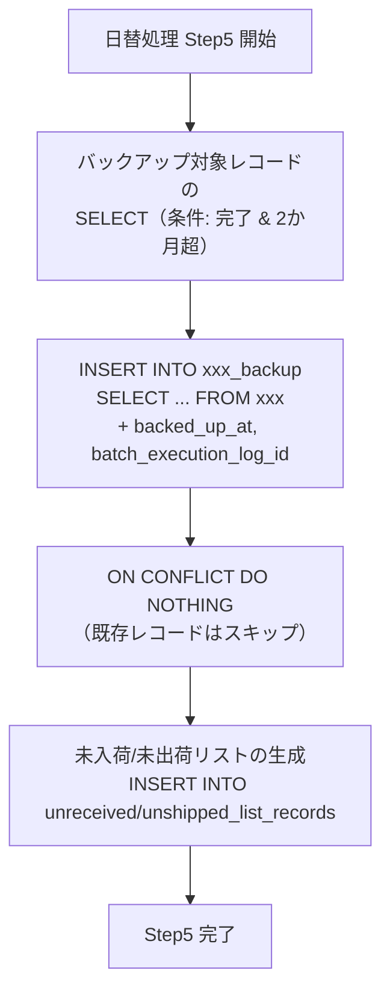

# データベースアーキテクチャ設計書

> 本書はデータベースの物理設計・運用設計を定義する。
> テーブル定義・カラム定義の詳細は [データモデル定義書](../data-model/01-overview.md) を参照。
> 設計方針（削除方式・ロック方式・監査カラム・PK採番等）は [データベースアーキテクチャ・ブループリント](../architecture-blueprint/05-database-architecture.md) を参照。

---

## 目次

1. [Azure Database for PostgreSQL Flexible Server 設計](#1-azure-database-for-postgresql-flexible-server-設計)
2. [スキーマ設計方針](#2-スキーマ設計方針)
3. [インデックス設計](#3-インデックス設計)
4. [パーティショニング設計](#4-パーティショニング設計)
5. [コネクションプール設計（HikariCP）](#5-コネクションプール設計hikaricp)
6. [マイグレーション設計（Flyway）](#6-マイグレーション設計flyway)
7. [バックアップ・リストア設計](#7-バックアップリストア設計)
8. [パフォーマンスチューニング方針](#8-パフォーマンスチューニング方針)
9. [データアーカイブ方針](#9-データアーカイブ方針)

---

## 1. Azure Database for PostgreSQL Flexible Server 設計

### 1.1 インスタンス構成

| 項目 | 設定値 | 備考 |
|------|--------|------|
| **サービス** | Azure Database for PostgreSQL Flexible Server | |
| **SKU** | B1ms（Burstable） | 1 vCore / 2 GiB RAM |
| **PostgreSQL バージョン** | 16 | NULLS NOT DISTINCT 対応（15以降） |
| **ストレージ** | 32 GiB（Premium SSD） | 自動拡張有効（max 256 GiB） |
| **IOPS** | 396 IOPS（32 GiB 時の既定値） | ストレージ拡張に伴い自動増加 |
| **可用性** | ゾーン冗長なし（コスト優先） | |
| **リージョン** | Japan East | |
| **文字コード** | UTF-8 | |
| **タイムゾーン** | Asia/Tokyo | DB接続・アプリ層ともにJST統一 |

### 1.2 サーバーパラメータ

B1ms（2 GiB RAM）に最適化した PostgreSQL パラメータ設定。

| パラメータ | 設定値 | デフォルト | 変更理由 |
|-----------|--------|-----------|---------|
| `shared_buffers` | `512MB` | 256MB | RAMの約25%。B1msの推奨値 |
| `effective_cache_size` | `1536MB` | 自動 | RAMの約75%。クエリプランナーへのヒント |
| `work_mem` | `4MB` | 4MB | ソート・ハッシュ結合用。B1msでは控えめに設定 |
| `maintenance_work_mem` | `128MB` | 64MB | VACUUM・CREATE INDEX用 |
| `max_connections` | `50` | 100 | B1msでは50程度が適切。HikariCPはdev=5/prd=10 + 管理接続の余裕 |
| `wal_buffers` | `16MB` | -1(自動) | WAL書き込みバッファ |
| `random_page_cost` | `1.1` | 4.0 | SSDストレージに最適化 |
| `effective_io_concurrency` | `200` | 1 | SSD用の並列I/O設定 |
| `checkpoint_completion_target` | `0.9` | 0.9 | チェックポイント分散（デフォルト維持） |
| `log_min_duration_statement` | `500` | -1 | 500ms以上のクエリをログ記録（スロークエリ検知） |
| `log_statement` | `ddl` | none | DDL文のみログ記録 |
| `timezone` | `Asia/Tokyo` | UTC | JSTに統一 |
| `default_text_search_config` | `pg_catalog.simple` | — | テキスト検索のデフォルト。PostgreSQL標準には日本語テキスト検索設定（`pg_catalog.japanese`）が含まれないため `simple` を使用。全文検索が必要な場合は pg_bigm 等の拡張を別途導入する |

> **注意**: Azure Flexible Server では一部パラメータが変更不可。`shared_buffers` 等はAzure Portal > サーバーパラメータから設定する。

### 1.3 ネットワーク設計

| 項目 | 設定値 |
|------|--------|
| **アクセス方式** | プライベートアクセス（VNet統合） |
| **VNet** | Container Apps と同一 VNet の DB サブネット |
| **パブリックアクセス** | 無効 |
| **SSL** | 必須（`require` モード） |
| **接続ポート** | 5432 |

### 1.4 認証設計

| 項目 | 設定値 |
|------|--------|
| **認証方式** | PostgreSQL 認証（パスワード認証） |
| **管理者ユーザー** | `wms_admin`（Terraform で作成） |
| **アプリ用ユーザー** | `wms_app`（DDL権限なし、DML権限のみ） |
| **マイグレーション用ユーザー** | `wms_migration`（DDL + DML権限） |

```sql
-- アプリ用ユーザーの作成
CREATE USER wms_app WITH PASSWORD '${WMS_APP_PASSWORD}';
GRANT CONNECT ON DATABASE wms TO wms_app;
GRANT USAGE ON SCHEMA public TO wms_app;
GRANT SELECT, INSERT, UPDATE, DELETE ON ALL TABLES IN SCHEMA public TO wms_app;
GRANT USAGE, SELECT ON ALL SEQUENCES IN SCHEMA public TO wms_app;
ALTER DEFAULT PRIVILEGES IN SCHEMA public
  GRANT SELECT, INSERT, UPDATE, DELETE ON TABLES TO wms_app;
ALTER DEFAULT PRIVILEGES IN SCHEMA public
  GRANT USAGE, SELECT ON SEQUENCES TO wms_app;

-- マイグレーション用ユーザーの作成
CREATE USER wms_migration WITH PASSWORD '${WMS_MIGRATION_PASSWORD}';
GRANT CONNECT ON DATABASE wms TO wms_migration;
GRANT ALL PRIVILEGES ON SCHEMA public TO wms_migration;
GRANT ALL PRIVILEGES ON ALL TABLES IN SCHEMA public TO wms_migration;
GRANT ALL PRIVILEGES ON ALL SEQUENCES IN SCHEMA public TO wms_migration;
ALTER DEFAULT PRIVILEGES IN SCHEMA public
  GRANT ALL PRIVILEGES ON TABLES TO wms_migration;
ALTER DEFAULT PRIVILEGES IN SCHEMA public
  GRANT ALL PRIVILEGES ON SEQUENCES TO wms_migration;
```

### 1.5 初期セットアップ手順（DBユーザー作成）

アプリ用ユーザー（`wms_app`）とマイグレーション用ユーザー（`wms_migration`）は、Terraform apply 後・Flyway マイグレーション前に `wmsadmin` で手動実行して作成する。

> **方式選定理由**: Terraform の `null_resource` + `local-exec` による自動化も検討したが、PostgreSQL への直接接続が必要でネットワーク制約（VNet 内アクセス）との兼ね合いが複雑になるため、初回は手動実行とする。

**実行タイミング**: `terraform apply` 完了後、アプリケーション（Flyway マイグレーション）起動前

**実行手順**:

```bash
# 1. wmsadmin で PostgreSQL に接続
psql "host=<server-name>.postgres.database.azure.com port=5432 dbname=wms user=wmsadmin sslmode=require"

# 2. 以下の SQL を実行
```

```sql
-- アプリ用ユーザーの作成（DML権限のみ）
CREATE USER wms_app WITH PASSWORD '<wms_app_password>';
GRANT CONNECT ON DATABASE wms TO wms_app;
GRANT USAGE ON SCHEMA public TO wms_app;
GRANT SELECT, INSERT, UPDATE, DELETE ON ALL TABLES IN SCHEMA public TO wms_app;
GRANT USAGE, SELECT ON ALL SEQUENCES IN SCHEMA public TO wms_app;
ALTER DEFAULT PRIVILEGES IN SCHEMA public
  GRANT SELECT, INSERT, UPDATE, DELETE ON TABLES TO wms_app;
ALTER DEFAULT PRIVILEGES IN SCHEMA public
  GRANT USAGE, SELECT ON SEQUENCES TO wms_app;

-- マイグレーション用ユーザーの作成（DDL + DML権限）
CREATE USER wms_migration WITH PASSWORD '<wms_migration_password>';
GRANT CONNECT ON DATABASE wms TO wms_migration;
GRANT ALL PRIVILEGES ON SCHEMA public TO wms_migration;
GRANT ALL PRIVILEGES ON ALL TABLES IN SCHEMA public TO wms_migration;
GRANT ALL PRIVILEGES ON ALL SEQUENCES IN SCHEMA public TO wms_migration;
ALTER DEFAULT PRIVILEGES IN SCHEMA public
  GRANT ALL PRIVILEGES ON TABLES TO wms_migration;
ALTER DEFAULT PRIVILEGES IN SCHEMA public
  GRANT ALL PRIVILEGES ON SEQUENCES TO wms_migration;
```

> **注意**: パスワードは Azure Key Vault に格納し、Container Apps の環境変数経由で参照する。平文でのコミットや共有は禁止。

---

## 2. スキーマ設計方針

### 2.1 スキーマ構成

単一スキーマ（`public`）を使用する。モジュラーモノリスのモジュール分割はアプリケーション層（Java パッケージ）で実現し、DB スキーマでは分割しない。

| 項目 | 方針 |
|------|------|
| **スキーマ** | `public` のみ使用 |
| **テーブル名のプレフィックス** | 使用しない（テーブル名自体がモジュールを示す） |
| **命名規則** | スネークケース・複数形（詳細は [データモデル定義書](../data-model/01-overview.md) 参照） |

**理由**: モジュール数が限定的（10モジュール未満）であり、スキーマ分割のメリット（名前空間の分離）よりも、JOIN・マイグレーション・運用のシンプルさを優先する。

### 2.2 文字列型の方針

| 項目 | 方針 |
|------|------|
| **固定長文字列** | 使用しない。全て `varchar(n)` |
| **可変長文字列** | `varchar(n)` で最大長を制約する |
| **無制限テキスト** | `text` 型（エラーメッセージ等の可変長データのみ） |

### 2.3 日時型の方針

| 用途 | 型 | 備考 |
|------|-----|------|
| 日時（タイムスタンプ） | `timestamptz`（timestamp with time zone） | JSTで統一 |
| 日付 | `date` | 営業日・予定日等 |
| 時刻のみ | 使用しない | |

### 2.4 列挙型の方針

PostgreSQL の `ENUM` 型は使用しない。`varchar` + `CHECK` 制約で管理する。

**理由**:
- `ENUM` 型の値追加には `ALTER TYPE ... ADD VALUE` が必要で Flyway マイグレーションとの相性が悪い
- `CHECK` 制約なら値の追加は `ALTER TABLE ... DROP CONSTRAINT / ADD CONSTRAINT` で対応可能
- アプリ層（Java の enum）で型安全性を担保する

```sql
-- 例: ステータス列の CHECK 制約
ALTER TABLE inbound_slips
  ADD CONSTRAINT chk_inbound_slips_status
  CHECK (status IN ('PLANNED', 'CONFIRMED', 'INSPECTING', 'PARTIAL_STORED', 'STORED', 'CANCELLED'));
```

### 2.5 外部キー制約の方針

| 項目 | 方針 |
|------|------|
| **マスタ → マスタ** | 外部キー制約を設定する |
| **トランザクション → マスタ** | 外部キー制約を設定する |
| **トランザクション → トランザクション** | 外部キー制約を設定する |
| **バックアップテーブル** | 外部キー制約を設定しない（元テーブルからの独立性を確保） |
| **ON DELETE** | `RESTRICT`（デフォルト）。カスケード削除は使用しない |
| **ON UPDATE** | `RESTRICT`（デフォルト） |

---

## 3. インデックス設計

### 3.1 インデックス設計方針

| 方針 | 説明 |
|------|------|
| **主キー** | 全テーブル `id bigserial PRIMARY KEY`（自動で B-tree インデックス） |
| **一意制約** | `UNIQUE` 制約は自動で一意インデックスを生成 |
| **外部キー** | 全外部キーカラムにインデックスを付与する（JOINおよびカスケードチェック高速化） |
| **検索条件** | 一覧画面の絞り込み条件・ソート条件に対応するインデックスを設計 |
| **部分インデックス** | 論理削除カラム（`is_active`）は部分インデックスで有効レコードのみを対象化 |
| **複合インデックス** | 検索パターンに応じた複合インデックスを設計（選択度の高いカラムを先頭に） |

### 3.2 マスタテーブルのインデックス

> テーブル定義の詳細は [データモデル定義書 — マスタ系テーブル](../data-model/02-master-tables.md) を参照。

#### `products`（商品マスタ）

| インデックス名 | カラム | 種別 | 用途 |
|---------------|--------|------|------|
| `pk_products` | `id` | PRIMARY KEY | — |
| `uq_products_product_code` | `product_code` | UNIQUE | 商品コード一意制約・コード検索 |
| `idx_products_active` | `is_active` WHERE `is_active = true` | PARTIAL | 有効商品のみの検索高速化 |
| `idx_products_name_kana` | `product_name_kana` | B-tree | カナ検索（前方一致） |

```sql
CREATE UNIQUE INDEX uq_products_product_code ON products (product_code);
CREATE INDEX idx_products_active ON products (product_code) WHERE is_active = true;
CREATE INDEX idx_products_name_kana ON products (product_name_kana varchar_pattern_ops);
```

#### `partners`（取引先マスタ）

| インデックス名 | カラム | 種別 | 用途 |
|---------------|--------|------|------|
| `pk_partners` | `id` | PRIMARY KEY | — |
| `uq_partners_partner_code` | `partner_code` | UNIQUE | 取引先コード一意制約 |
| `idx_partners_type_active` | `partner_type, is_active` | B-tree | 種別・有効フラグでの絞り込み |

```sql
CREATE UNIQUE INDEX uq_partners_partner_code ON partners (partner_code);
CREATE INDEX idx_partners_type_active ON partners (partner_type, is_active);
```

#### `warehouses`（倉庫マスタ）

| インデックス名 | カラム | 種別 | 用途 |
|---------------|--------|------|------|
| `pk_warehouses` | `id` | PRIMARY KEY | — |
| `uq_warehouses_warehouse_code` | `warehouse_code` | UNIQUE | 倉庫コード一意制約 |

#### `buildings`（棟マスタ）

| インデックス名 | カラム | 種別 | 用途 |
|---------------|--------|------|------|
| `pk_buildings` | `id` | PRIMARY KEY | — |
| `uq_buildings_warehouse_code` | `warehouse_id, building_code` | UNIQUE | 倉庫内棟コード一意制約 |
| `idx_buildings_warehouse` | `warehouse_id` | B-tree | 倉庫別棟一覧 |

#### `areas`（エリアマスタ）

| インデックス名 | カラム | 種別 | 用途 |
|---------------|--------|------|------|
| `pk_areas` | `id` | PRIMARY KEY | — |
| `uq_areas_building_code` | `building_id, area_code` | UNIQUE | 棟内エリアコード一意制約 |
| `idx_areas_warehouse` | `warehouse_id` | B-tree | 倉庫別エリア一覧 |
| `idx_areas_building` | `building_id` | B-tree | 棟別エリア一覧 |
| `idx_areas_type` | `warehouse_id, area_type` | B-tree | エリア種別での絞り込み |

#### `locations`（ロケーションマスタ）

| インデックス名 | カラム | 種別 | 用途 |
|---------------|--------|------|------|
| `pk_locations` | `id` | PRIMARY KEY | — |
| `uq_locations_warehouse_code` | `warehouse_id, location_code` | UNIQUE | 倉庫内ロケーションコード一意制約 |
| `idx_locations_code_prefix` | `warehouse_id, location_code` | B-tree (varchar_pattern_ops) | コード前方一致検索 |
| `idx_locations_area` | `area_id` | B-tree | エリア別ロケーション一覧 |

```sql
CREATE INDEX idx_locations_code_prefix
  ON locations (warehouse_id, location_code varchar_pattern_ops);
```

#### `users`（ユーザーマスタ）

| インデックス名 | カラム | 種別 | 用途 |
|---------------|--------|------|------|
| `pk_users` | `id` | PRIMARY KEY | — |
| `uq_users_user_code` | `user_code` | UNIQUE | ユーザーコード一意制約・ログイン認証 |
| `uq_users_email` | `email` | UNIQUE | メールアドレス一意制約（パスワードリセット検索） |

#### `refresh_tokens`（リフレッシュトークン）

| インデックス名 | カラム | 種別 | 用途 |
|---------------|--------|------|------|
| `pk_refresh_tokens` | `id` | PRIMARY KEY | — |
| `uq_refresh_tokens_hash` | `token_hash` | UNIQUE | トークンハッシュ一意制約 |
| `idx_refresh_tokens_user` | `user_id` | B-tree | ユーザー別トークン検索 |
| `idx_refresh_tokens_expires` | `expires_at` | B-tree | 期限切れトークンクリーンアップ |

#### `password_reset_tokens`（パスワードリセットトークン）

| インデックス名 | カラム | 種別 | 用途 |
|---------------|--------|------|------|
| `pk_password_reset_tokens` | `id` | PRIMARY KEY | — |
| `idx_password_reset_tokens_hash` | `token_hash` | B-tree | トークン検索 |
| `idx_password_reset_tokens_user` | `user_id` | B-tree | 同一ユーザー未使用トークン無効化 |

#### `system_parameters`（システムパラメータ）

| インデックス名 | カラム | 種別 | 用途 |
|---------------|--------|------|------|
| `pk_system_parameters` | `id` | PRIMARY KEY | — |
| `uq_system_parameters_key` | `param_key` | UNIQUE | パラメータキー一意制約・キー検索 |

### 3.3 トランザクションテーブルのインデックス

> テーブル定義の詳細は [データモデル定義書 — トランザクション系テーブル](../data-model/03-transaction-tables.md) を参照。

#### `inbound_slips`（入荷ヘッダ）

| インデックス名 | カラム | 種別 | 用途 |
|---------------|--------|------|------|
| `pk_inbound_slips` | `id` | PRIMARY KEY | — |
| `uq_inbound_slips_slip_number` | `slip_number` | UNIQUE | 伝票番号一意制約・伝票検索 |
| `idx_inbound_slips_wh_date` | `warehouse_id, planned_date` | B-tree | 倉庫別入荷予定日検索（一覧画面） |
| `idx_inbound_slips_wh_status` | `warehouse_id, status` | B-tree | 倉庫別ステータス検索 |
| `idx_inbound_slips_transfer` | `transfer_slip_number` | B-tree | 振替伝票照会 |

#### `inbound_slip_lines`（入荷明細）

| インデックス名 | カラム | 種別 | 用途 |
|---------------|--------|------|------|
| `pk_inbound_slip_lines` | `id` | PRIMARY KEY | — |
| `uq_inbound_slip_lines_slip_line` | `inbound_slip_id, line_no` | UNIQUE | 伝票内行番号一意 |
| `idx_inbound_slip_lines_slip` | `inbound_slip_id` | B-tree | 伝票別明細検索 |
| `idx_inbound_slip_lines_product` | `product_id` | B-tree | 商品別入荷明細検索 |

#### `outbound_slips`（出荷ヘッダ）

| インデックス名 | カラム | 種別 | 用途 |
|---------------|--------|------|------|
| `pk_outbound_slips` | `id` | PRIMARY KEY | — |
| `uq_outbound_slips_slip_number` | `slip_number` | UNIQUE | 伝票番号一意制約 |
| `idx_outbound_slips_wh_date` | `warehouse_id, planned_date` | B-tree | 倉庫別出荷予定日検索 |
| `idx_outbound_slips_wh_status` | `warehouse_id, status` | B-tree | 倉庫別ステータス検索 |
| `idx_outbound_slips_transfer` | `transfer_slip_number` | B-tree | 振替伝票照会 |

#### `outbound_slip_lines`（出荷明細）

| インデックス名 | カラム | 種別 | 用途 |
|---------------|--------|------|------|
| `pk_outbound_slip_lines` | `id` | PRIMARY KEY | — |
| `uq_outbound_slip_lines_slip_line` | `outbound_slip_id, line_no` | UNIQUE | 伝票内行番号一意 |
| `idx_outbound_slip_lines_slip` | `outbound_slip_id` | B-tree | 伝票別明細検索 |
| `idx_outbound_slip_lines_product` | `product_id` | B-tree | 商品別出荷明細検索 |

#### `picking_instructions`（ピッキング指示ヘッダ）

| インデックス名 | カラム | 種別 | 用途 |
|---------------|--------|------|------|
| `pk_picking_instructions` | `id` | PRIMARY KEY | — |
| `uq_picking_instructions_number` | `instruction_number` | UNIQUE | ピッキング指示番号一意制約 |
| `idx_picking_instructions_wh_status` | `warehouse_id, status` | B-tree | 倉庫別ステータス検索 |

#### `picking_instruction_lines`（ピッキング指示明細）

| インデックス名 | カラム | 種別 | 用途 |
|---------------|--------|------|------|
| `pk_picking_instruction_lines` | `id` | PRIMARY KEY | — |
| `uq_picking_instruction_lines_line` | `picking_instruction_id, line_no` | UNIQUE | 指示内行番号一意 |
| `idx_picking_instruction_lines_outbound` | `outbound_slip_line_id` | B-tree | 出荷明細からの逆引き |
| `idx_picking_instruction_lines_loc` | `picking_instruction_id, location_code` | B-tree | ロケーション順ソート（ピッキング指示書出力） |

#### `inventories`（在庫）

| インデックス名 | カラム | 種別 | 用途 |
|---------------|--------|------|------|
| `pk_inventories` | `id` | PRIMARY KEY | — |
| `uq_inventories_5axis` | `location_id, product_id, unit_type, lot_number, expiry_date` | UNIQUE (NULLS NOT DISTINCT) | 5軸一意制約 |
| `idx_inventories_wh_product` | `warehouse_id, product_id` | B-tree | 商品別在庫検索 |
| `idx_inventories_wh_location` | `warehouse_id, location_id` | B-tree | ロケーション別在庫検索 |
| `idx_inventories_location_product` | `location_id, product_id` | B-tree | 悲観的ロック対象（SELECT FOR UPDATE） |
| `idx_inventories_allocated` | `warehouse_id, product_id` WHERE `allocated_qty > 0` | PARTIAL | 引当済み在庫の検索 |

```sql
-- 5軸一意制約（NULLS NOT DISTINCT: PostgreSQL 15以降）
CREATE UNIQUE INDEX uq_inventories_5axis
  ON inventories (location_id, product_id, unit_type, lot_number, expiry_date)
  NULLS NOT DISTINCT;

-- 引当済み在庫の部分インデックス
CREATE INDEX idx_inventories_allocated
  ON inventories (warehouse_id, product_id) WHERE allocated_qty > 0;
```

#### `inventory_movements`（在庫変動履歴）

| インデックス名 | カラム | 種別 | 用途 |
|---------------|--------|------|------|
| `pk_inventory_movements` | `id` | PRIMARY KEY | — |
| `idx_inv_movements_wh_product_date` | `warehouse_id, product_id, executed_at` | B-tree | 在庫推移レポート |
| `idx_inv_movements_wh_location_date` | `warehouse_id, location_id, executed_at` | B-tree | ロケーション別履歴 |
| `idx_inv_movements_type_date` | `movement_type, executed_at` | B-tree | 種別別検索（FIFO用入庫日時ソート） |
| `idx_inv_movements_reference` | `reference_type, reference_id` | B-tree | 関連レコード逆引き |

#### `stocktake_headers`（棚卸ヘッダ）

| インデックス名 | カラム | 種別 | 用途 |
|---------------|--------|------|------|
| `pk_stocktake_headers` | `id` | PRIMARY KEY | — |
| `uq_stocktake_headers_number` | `stocktake_number` | UNIQUE | 棚卸番号一意制約 |
| `idx_stocktake_headers_wh_status` | `warehouse_id, status` | B-tree | 倉庫別ステータス検索 |

#### `stocktake_lines`（棚卸明細）

| インデックス名 | カラム | 種別 | 用途 |
|---------------|--------|------|------|
| `pk_stocktake_lines` | `id` | PRIMARY KEY | — |
| `idx_stocktake_lines_header_loc` | `stocktake_header_id, location_code` | B-tree | 棚卸リスト出力（ロケーション順） |
| `idx_stocktake_lines_location` | `location_id` | B-tree | ロケーション別棚卸状態確認 |

#### `allocation_details`（引当明細）

| インデックス名 | カラム | 種別 | 用途 |
|---------------|--------|------|------|
| `pk_allocation_details` | `id` | PRIMARY KEY | — |
| `idx_allocation_details_outbound_line` | `outbound_slip_line_id` | B-tree | 受注明細別引当検索 |
| `idx_allocation_details_inventory` | `inventory_id` | B-tree | 在庫別引当検索 |
| `idx_allocation_details_outbound_slip` | `outbound_slip_id` | B-tree | 受注単位引当検索 |

#### `unpack_instructions`（ばらし指示）

| インデックス名 | カラム | 種別 | 用途 |
|---------------|--------|------|------|
| `pk_unpack_instructions` | `id` | PRIMARY KEY | — |
| `idx_unpack_instructions_outbound` | `outbound_slip_id` | B-tree | 受注別ばらし指示検索 |
| `idx_unpack_instructions_status` | `status` | B-tree | ステータス別検索 |

### 3.4 バッチ・集計テーブルのインデックス

> テーブル定義の詳細は [データモデル定義書 — バッチ・集計系テーブル](../data-model/04-batch-tables.md) を参照。

#### `batch_execution_logs`（バッチ実行履歴）

| インデックス名 | カラム | 種別 | 用途 |
|---------------|--------|------|------|
| `pk_batch_execution_logs` | `id` | PRIMARY KEY | — |
| `uq_batch_execution_logs_date` | `target_business_date` | UNIQUE | 同一営業日二重実行防止 |

#### `inbound_summaries`（入荷実績サマリー）

| インデックス名 | カラム | 種別 | 用途 |
|---------------|--------|------|------|
| `pk_inbound_summaries` | `id` | PRIMARY KEY | — |
| `uq_inbound_summaries_date_wh` | `business_date, warehouse_id` | UNIQUE | 営業日×倉庫一意制約 |

#### `outbound_summaries`（出荷実績サマリー）

| インデックス名 | カラム | 種別 | 用途 |
|---------------|--------|------|------|
| `pk_outbound_summaries` | `id` | PRIMARY KEY | — |
| `uq_outbound_summaries_date_wh` | `business_date, warehouse_id` | UNIQUE | 営業日×倉庫一意制約 |

#### `inventory_snapshots`（在庫スナップショット）

| インデックス名 | カラム | 種別 | 用途 |
|---------------|--------|------|------|
| `pk_inventory_snapshots` | `id` | PRIMARY KEY | — |
| `uq_inventory_snapshots_composite` | `business_date, warehouse_id, product_id, unit_type` | UNIQUE | 複合一意制約 |
| `idx_inventory_snapshots_date` | `business_date` | B-tree | 営業日別集計検索 |

#### `unreceived_list_records` / `unshipped_list_records`

| インデックス名 | カラム | 種別 | 用途 |
|---------------|--------|------|------|
| `idx_unreceived_list_date_wh` | `batch_business_date, warehouse_code` | B-tree | 営業日×倉庫検索 |
| `idx_unshipped_list_date_wh` | `batch_business_date, warehouse_code` | B-tree | 営業日×倉庫検索 |

### 3.5 バックアップテーブルのインデックス

バックアップテーブルは元テーブルと同一のインデックスを持つが、外部キー制約は設定しない。加えて以下の管理用インデックスを付与する。

```sql
-- 全バックアップテーブル共通の管理用インデックス
CREATE INDEX idx_{table}_backup_batch ON {table}_backup (batch_execution_log_id);
CREATE INDEX idx_{table}_backup_date ON {table}_backup (backed_up_at);
```

---

## 4. パーティショニング設計

### 4.1 パーティショニング対象テーブル

B1ms の小規模構成を考慮し、初期段階ではパーティショニングを適用しない。以下の条件に達した場合にパーティショニングを導入する。

| テーブル | パーティション導入基準 | パーティション方式 | パーティションキー |
|---------|--------------------|--------------------|-----------------|
| `inventory_movements` | 1,000万行超 | RANGE | `executed_at`（月次） |
| `inventory_movements_backup` | 1,000万行超 | RANGE | `executed_at`（月次） |
| `inventory_snapshots` | 500万行超 | RANGE | `business_date`（月次） |
| `inbound_slips_backup` | 500万行超 | RANGE | `backed_up_at`（月次） |
| `outbound_slips_backup` | 500万行超 | RANGE | `backed_up_at`（月次） |

### 4.2 パーティショニング実装例

将来のパーティショニング導入時の DDL 例。

```sql
-- inventory_movements のパーティション化
-- 1. 新しいパーティションテーブルを作成
CREATE TABLE inventory_movements_partitioned (
  LIKE inventory_movements INCLUDING ALL
) PARTITION BY RANGE (executed_at);

-- 2. 月次パーティションを作成
CREATE TABLE inventory_movements_p2026_01
  PARTITION OF inventory_movements_partitioned
  FOR VALUES FROM ('2026-01-01') TO ('2026-02-01');

CREATE TABLE inventory_movements_p2026_02
  PARTITION OF inventory_movements_partitioned
  FOR VALUES FROM ('2026-02-01') TO ('2026-03-01');

-- 3. デフォルトパーティション（範囲外データの受け皿）
CREATE TABLE inventory_movements_default
  PARTITION OF inventory_movements_partitioned DEFAULT;

-- 4. データ移行 + テーブル名入替（メンテナンスウィンドウで実施）
```

### 4.3 パーティション管理の自動化

パーティション導入時は、Flyway マイグレーションスクリプトで月次パーティションを事前に3か月分作成する。月次のパーティション追加はバッチ処理または手動マイグレーションで実施する。

---

## 5. コネクションプール設計（HikariCP）

### 5.1 HikariCP 設定

Spring Boot のデフォルトコネクションプールである HikariCP を使用する。

| パラメータ | 設定値 | 説明 |
|-----------|--------|------|
| `maximum-pool-size` | dev: `5` / prd: `10` | B1ms（max_connections=50）に対し、prd: 5レプリカ x 10 = 50で上限に収まる |
| `minimum-idle` | dev: `2` / prd: `5` | アイドル時の最小接続数 |
| `idle-timeout` | `300000`（5分） | アイドル接続の保持時間 |
| `max-lifetime` | `1800000`（30分） | 接続の最大生存時間（DB側のtimeoutより短く） |
| `connection-timeout` | `30000`（30秒） | プールから接続を取得するまでの最大待機時間 |
| `leak-detection-threshold` | `60000`（60秒） | コネクションリーク検知の閾値 |
| `pool-name` | `WmsHikariPool` | プール名（ログ識別用） |

### 5.2 application.yml 設定例

```yaml
spring:
  datasource:
    url: jdbc:postgresql://${DB_HOST}:5432/wms?sslmode=require
    username: ${DB_USERNAME}
    password: ${DB_PASSWORD}
    hikari:
      maximum-pool-size: ${HIKARI_MAX_POOL_SIZE:5}  # dev: 5, prd: 10
      minimum-idle: ${HIKARI_MIN_IDLE:2}             # dev: 2, prd: 5
      idle-timeout: 300000
      max-lifetime: 1800000
      connection-timeout: 30000
      leak-detection-threshold: 60000
      pool-name: WmsHikariPool
```

### 5.3 接続数の計算根拠

| 項目 | 値 |
|------|-----|
| DB `max_connections` | 50 |
| Container Apps 最大レプリカ数（dev） | 3（スケールアウト時） |
| Container Apps 最大レプリカ数（prd） | 5（スケールアウト時） |
| 1レプリカの HikariCP `maximum-pool-size`（dev） | 5 |
| 1レプリカの HikariCP `maximum-pool-size`（prd） | 10 |
| 最大アプリ接続数（dev） | 3 × 5 = 15 |
| 最大アプリ接続数（prd） | 5 × 10 = 50 |
| 管理接続用の余裕（dev） | 35（Azure内部接続 + 手動接続用） |
| 管理接続用の余裕（prd） | 0（全接続をアプリで使用。管理接続はアイドルレプリカ分を利用） |

> **min replicas = 0** の設定により、アイドル時はレプリカが0になる。スケールイン/アウト時のコネクション管理は HikariCP の `max-lifetime` による自動リフレッシュで対応する。

### 5.4 Spring Data JPA 設定

```yaml
spring:
  jpa:
    hibernate:
      ddl-auto: validate  # Flyway で DDL 管理するため validate のみ
    properties:
      hibernate:
        dialect: org.hibernate.dialect.PostgreSQLDialect
        format_sql: true
        jdbc:
          batch_size: 50  # バッチ INSERT 時のバッチサイズ
        order_inserts: true
        order_updates: true
        default_batch_fetch_size: 16  # N+1対策
    open-in-view: false  # LazyInitializationException を明示的に検出
```

---

## 6. マイグレーション設計（Flyway）

### 6.1 Flyway 基本設定

| 項目 | 設定値 |
|------|--------|
| **実行ユーザー** | `wms_migration`（DDL + DML 権限） |
| **マイグレーションディレクトリ** | `src/main/resources/db/migration/` |
| **ファイル命名規則** | `V{version}__{description}.sql` |
| **バージョン方式** | 連番（例: `V001`, `V002`, ...） |
| **ベースラインバージョン** | `0`（初回から Flyway 管理） |
| **スキーマ履歴テーブル** | `flyway_schema_history`（デフォルト） |

### 6.2 application.yml 設定

```yaml
spring:
  flyway:
    enabled: true
    url: jdbc:postgresql://${DB_HOST}:5432/wms?sslmode=require
    user: ${FLYWAY_USERNAME}      # wms_migration
    password: ${FLYWAY_PASSWORD}
    locations: classpath:db/migration
    baseline-on-migrate: true
    baseline-version: 0
    validate-on-migrate: true
    out-of-order: false  # 本番環境ではバージョン順序を厳格に管理
```

### 6.3 マイグレーションファイルの分類

| カテゴリ | バージョン範囲 | 例 |
|---------|--------------|-----|
| **スキーマ作成** | V001 〜 V099 | テーブル・インデックス・制約の作成 |
| **初期データ投入** | V100 〜 V199 | マスタ初期データ・システムパラメータ |
| **スキーマ変更** | V200 〜 | 運用開始後のスキーマ変更 |

### 6.4 マイグレーションファイル構成（初期）

```
src/main/resources/db/migration/
├── V001__create_users_table.sql
├── V002__create_system_parameters_table.sql
├── V003__create_products_table.sql
├── V004__create_partners_table.sql
├── V005__create_warehouses_table.sql
├── V006__create_buildings_table.sql
├── V007__create_areas_table.sql
├── V008__create_locations_table.sql
├── V009__create_refresh_tokens_table.sql
├── V010__create_password_reset_tokens_table.sql
├── V020__create_inbound_slips_table.sql
├── V021__create_inbound_slip_lines_table.sql
├── V030__create_outbound_slips_table.sql
├── V031__create_outbound_slip_lines_table.sql
├── V032__create_picking_instructions_table.sql
├── V033__create_picking_instruction_lines_table.sql
├── V040__create_inventories_table.sql
├── V041__create_inventory_movements_table.sql
├── V042__create_stocktake_tables.sql
├── V043__create_allocation_details_table.sql
├── V044__create_unpack_instructions_table.sql
├── V045__create_return_slips_table.sql
├── V046__create_if_executions_table.sql
├── V050__create_business_date_table.sql
├── V051__create_batch_execution_logs_table.sql
├── V052__create_summary_tables.sql
├── V053__create_unreceived_unshipped_tables.sql
├── V054__create_daily_summary_records_table.sql
├── V060__create_backup_tables.sql
├── V100__insert_initial_system_parameters.sql
├── V101__insert_initial_admin_user.sql
└── V102__insert_initial_business_date.sql
```

### 6.5 マイグレーションファイルの記述ルール

| ルール | 説明 |
|--------|------|
| **1ファイル1テーブル** | テーブル作成は1ファイル1テーブルを原則とする（関連テーブルのまとめは許容） |
| **べき等性** | `IF NOT EXISTS` を活用して再実行可能にする |
| **ロールバック** | Flyway のロールバック機能は使用しない。ロールバックは新しいマイグレーションで対応 |
| **コメント** | ファイル先頭にテーブルの日本語名・用途を記述する |
| **トランザクション** | DDL はデフォルトでトランザクション内で実行される（PostgreSQL の DDL トランザクション対応） |

```sql
-- V003__create_products_table.sql
-- 商品マスタ（products）テーブル作成

CREATE TABLE IF NOT EXISTS products (
    id          bigserial    PRIMARY KEY,
    product_code varchar(50) NOT NULL,
    -- ... (カラム定義は data-model/02-master-tables.md に準拠)
    CONSTRAINT uq_products_product_code UNIQUE (product_code)
);

-- インデックス作成
CREATE INDEX IF NOT EXISTS idx_products_active
  ON products (product_code) WHERE is_active = true;

COMMENT ON TABLE products IS '商品マスタ';
COMMENT ON COLUMN products.product_code IS '商品コード。システム全体で一意。登録後変更不可';
```

### 6.6 初期データ投入

```sql
-- V100__insert_initial_system_parameters.sql
-- システムパラメータ初期データ
-- ※ 初期データ（パラメータキー・デフォルト値の一覧）は data-model/02-master-tables.md の
--   system_parameters 初期データセクションを参照（SSOT）。
--   実装時はそちらの定義に準拠して INSERT 文を作成すること。

INSERT INTO system_parameters (param_key, param_value, default_value, display_name, category, value_type, description)
VALUES
  -- ... (data-model/02-master-tables.md の system_parameters 初期データを参照)
ON CONFLICT (param_key) DO NOTHING;

-- V101__insert_initial_admin_user.sql
-- 初期管理者ユーザー（パスワードは BCrypt ハッシュ、初回ログイン時に変更強制）

INSERT INTO users (user_code, full_name, email, password_hash, role, is_active, password_change_required)
VALUES (
  'admin',
  'システム管理者',
  'admin@example.com',
  '${INITIAL_ADMIN_PASSWORD_HASH}',  -- BCrypt ハッシュ（環境変数またはビルド時に置換）
  'SYSTEM_ADMIN',
  true,
  true  -- 初回ログイン時パスワード変更必須
)
ON CONFLICT (user_code) DO NOTHING;

-- V102__insert_initial_business_date.sql
-- 営業日初期データ

INSERT INTO business_date (id, current_business_date, updated_at)
VALUES (1, CURRENT_DATE, now())
ON CONFLICT (id) DO NOTHING;
```

---

## 7. バックアップ・リストア設計

### 7.1 Azure 自動バックアップ

Azure Database for PostgreSQL Flexible Server のビルトインバックアップ機能を使用する。

| 項目 | 設定値 |
|------|--------|
| **バックアップ方式** | Azure 自動バックアップ（物理バックアップ） |
| **バックアップ頻度** | 毎日（Azure 自動） |
| **WAL アーカイブ** | 継続的（Azure 自動） |
| **保持期間** | 7日間（B1ms のデフォルト） |
| **バックアップ冗長性** | ローカル冗長（LRS） |
| **リストア方式** | ポイントインタイムリストア（PITR） |
| **リストア粒度** | 任意の時刻に復元可能（最大5分の遅延） |

### 7.2 バックアップ運用方針

| 項目 | 方針 |
|------|------|
| **日次フルバックアップ** | Azure 自動（操作不要） |
| **トランザクションログ** | Azure 自動アーカイブ（操作不要） |
| **追加バックアップ** | 不要（7日間の PITR で十分） |
| **クロスリージョンバックアップ** | 不要（コスト優先。災害復旧は再構築で対応） |

### 7.3 リストア手順

```
1. Azure Portal > Azure Database for PostgreSQL Flexible Server > 該当サーバー
2. [概要] > [復元] をクリック
3. 復元ポイント（日時）を指定
4. 新しいサーバー名を入力して復元を実行
5. 復元完了後、アプリケーションの接続先を新しいサーバーに切り替え
6. 動作確認後、旧サーバーを削除
```

> **注意**: PITR は新しいサーバーインスタンスとして復元される。接続先の切り替えが必要。

### 7.4 業務データバックアップ（アーカイブ）

Azure 自動バックアップとは別に、業務データのアーカイブを日替処理で実施する。詳細は [9. データアーカイブ方針](#9-データアーカイブ方針) を参照。

---

## 8. パフォーマンスチューニング方針

### 8.1 クエリ最適化方針

| 方針 | 詳細 |
|------|------|
| **N+1 問題の防止** | Spring Data JPA の `@EntityGraph` または `JOIN FETCH` を使用。`default_batch_fetch_size: 16` を設定 |
| **ページネーション** | 全一覧APIで `Pageable` を使用（デフォルト20件/ページ、最大100件）。`COUNT` クエリの最適化を検討 |
| **プルダウン用クエリ** | `all=true` パラメータでシンプルリスト返却。`SELECT id, code, name FROM xxx WHERE is_active = true` の軽量クエリ |
| **バッチINSERT** | Hibernate `batch_size: 50` で集計・バックアップテーブルへの大量INSERT を最適化 |
| **読み取り専用トランザクション** | `@Transactional(readOnly = true)` で読み取り専用トランザクションを明示（Hibernate のダーティチェック無効化） |

### 8.2 スロークエリの検知と対策

| 項目 | 設定 |
|------|------|
| **スロークエリログ** | `log_min_duration_statement = 500`（500ms以上） |
| **EXPLAIN ANALYZE** | 開発環境でのクエリチューニング時に使用 |
| **pg_stat_statements** | 有効化してクエリ統計を収集 |

```sql
-- pg_stat_statements の有効化（Azure Portal のサーバーパラメータで設定）
-- shared_preload_libraries に pg_stat_statements を追加

-- 統計確認クエリ例
SELECT
  query,
  calls,
  total_exec_time / 1000 AS total_sec,
  mean_exec_time AS mean_ms,
  rows
FROM pg_stat_statements
ORDER BY total_exec_time DESC
LIMIT 20;
```

### 8.3 VACUUM / ANALYZE 方針

| 項目 | 設定 |
|------|------|
| **autovacuum** | 有効（Azure デフォルト） |
| `autovacuum_vacuum_threshold` | 50（デフォルト） |
| `autovacuum_analyze_threshold` | 50（デフォルト） |
| `autovacuum_vacuum_scale_factor` | 0.1（テーブル行数の10%が更新されたら VACUUM） |
| `autovacuum_analyze_scale_factor` | 0.05（テーブル行数の5%が更新されたら ANALYZE） |

> `inventories` テーブルは頻繁に UPDATE されるため、autovacuum の実行頻度を監視する。必要に応じてテーブル個別に `autovacuum_vacuum_scale_factor` を下げる。

```sql
-- inventories テーブルの autovacuum を積極的に設定する例
ALTER TABLE inventories SET (
  autovacuum_vacuum_scale_factor = 0.02,
  autovacuum_analyze_scale_factor = 0.01
);
```

### 8.4 統計情報の管理

| 項目 | 方針 |
|------|------|
| **ANALYZE 実行** | autovacuum に委任（手動実行は原則不要） |
| **統計ターゲット** | 高選択度カラム（status, warehouse_id 等）は `ALTER COLUMN SET STATISTICS 200` に引き上げ |

```sql
-- ステータスカラムの統計精度を上げる
ALTER TABLE inbound_slips ALTER COLUMN status SET STATISTICS 200;
ALTER TABLE outbound_slips ALTER COLUMN status SET STATISTICS 200;
ALTER TABLE inventories ALTER COLUMN warehouse_id SET STATISTICS 200;
```

### 8.5 トランザクション設計

| 操作 | トランザクション境界 | ロック方式 | 備考 |
|------|-------------------|-----------|------|
| マスタ登録・更新 | Service メソッド単位 | 楽観的ロック（version） | |
| 入荷検品・入庫確定 | Service メソッド単位 | 楽観的ロック（version） | 在庫 INSERT/UPDATE 含む |
| 在庫引当 | 受注単位（1トランザクション） | 悲観的ロック（SELECT FOR UPDATE） | 在庫行ロック |
| 在庫移動 | 移動元・移動先を1トランザクション | 悲観的ロック（SELECT FOR UPDATE） | 在庫行ロック |
| 在庫ばらし | ばらし元・ばらし先を1トランザクション | 悲観的ロック（SELECT FOR UPDATE） | 在庫行ロック |
| 在庫訂正 | Service メソッド単位 | 悲観的ロック（SELECT FOR UPDATE） | 在庫行ロック |
| 棚卸確定 | 棚卸セッション単位 | 悲観的ロック（SELECT FOR UPDATE） | 対象在庫の一括更新 |
| 出荷確定 | 受注単位 | 悲観的ロック（SELECT FOR UPDATE） | 引当在庫の減算 |
| 日替処理 | ステップごとに独立トランザクション | — | ステップ間はコミット済み |

> ロック方式の詳細は [データベースアーキテクチャ・ブループリント](../architecture-blueprint/05-database-architecture.md) のロック方式セクションを参照。

### 8.6 デッドロック防止策

| 対策 | 説明 |
|------|------|
| **ロック順序の統一** | 同一トランザクション内で複数行をロックする場合、必ず `id` の昇順でロックを取得する |
| **トランザクション時間の短縮** | ロック保持中にI/O待ちや外部API呼び出しを行わない |
| **タイムアウト設定** | `lock_timeout = 10000`（10秒）を設定し、デッドロック検知時に早期タイムアウト |

```sql
-- セッション単位でロックタイムアウトを設定
SET lock_timeout = '10s';
```

```java
// Java 側: 在庫ロック時のID昇順ソート例
List<Long> inventoryIds = targetInventories.stream()
    .map(Inventory::getId)
    .sorted()
    .collect(Collectors.toList());

for (Long id : inventoryIds) {
    inventoryRepository.findByIdForUpdate(id);
}
```

---

## 9. データアーカイブ方針

### 9.1 アーカイブ概要

日替処理（バッチ）の「トランデータバックアップ」ステップで実施する業務データアーカイブ。Azure 自動バックアップ（物理バックアップ）とは独立した、業務レベルのデータ保存機能。

> アーカイブ対象テーブル・条件の詳細は [データモデル定義書 — バッチ・集計系テーブル](../data-model/04-batch-tables.md) のバックアップ系セクションを参照。

### 9.2 アーカイブ方針

| 項目 | 方針 |
|------|------|
| **対象** | 完了済みトランザクション（入荷完了・出荷完了）+ 在庫変動履歴 |
| **条件** | ステータスが完了状態 かつ `updated_at` / `executed_at` が 2か月以上前 |
| **方式** | `INSERT INTO xxx_backup SELECT ... FROM xxx WHERE [条件]` |
| **元データの扱い** | バックアップ後も元テーブルのデータは削除しない（参照整合性を維持） |
| **重複防止** | `ON CONFLICT DO NOTHING`（id の重複時はスキップ） |
| **保持期間** | 無期限（蓄積） |

### 9.3 アーカイブ実行フロー



### 9.4 将来的なデータ削減方針

運用初期は元テーブルのデータを削除しない方針だが、データ量がB1msのストレージ容量（32 GiB、自動拡張で最大256 GiB）に近づいた場合、以下の段階的対策を実施する。

| 段階 | 対策 | 条件 |
|------|------|------|
| **第1段階** | ストレージ自動拡張 | 32 GiB → 64 GiB → 128 GiB |
| **第2段階** | バックアップ済みの元データを物理削除 | バックアップテーブルに存在するレコードを元テーブルから DELETE |
| **第3段階** | パーティショニング導入 | 本書セクション4に従い月次パーティションを導入 |
| **第4段階** | SKU アップグレード | B1ms → B2s/GP（メモリ・ストレージ拡大） |

### 9.5 データ量見積もり

WMS の想定規模での年間データ量見積もり。

| テーブル | 1日あたりの増加見込み | 年間見込み | 1レコード平均サイズ | 年間容量見込み |
|---------|--------------------|-----------|--------------------|--------------|
| `inbound_slips` | 10件 | 3,600件 | 500 bytes | 1.8 MB |
| `inbound_slip_lines` | 50件 | 18,000件 | 400 bytes | 7.2 MB |
| `outbound_slips` | 20件 | 7,200件 | 500 bytes | 3.6 MB |
| `outbound_slip_lines` | 100件 | 36,000件 | 400 bytes | 14.4 MB |
| `inventories` | ±50件 | 最大10,000件（定常） | 200 bytes | 2.0 MB |
| `inventory_movements` | 200件 | 72,000件 | 500 bytes | 36 MB |
| `picking_instruction_lines` | 100件 | 36,000件 | 400 bytes | 14.4 MB |
| **合計（トランザクション系）** | — | — | — | **約80 MB/年** |
| **バックアップ系** | — | — | — | **約80 MB/年（追加）** |
| **集計・スナップショット系** | — | — | — | **約20 MB/年** |

**結論**: B1ms の 32 GiB ストレージで数年間は十分に運用可能。インデックスを含めても年間 500 MB 程度の増加に収まる見込み。

---

## 付録A: テーブル一覧とインデックス数サマリー

| 分類 | テーブル数 | インデックス数（PK含む） |
|------|-----------|----------------------|
| マスタ系 | 10 | 約30 |
| トランザクション系（入荷） | 2 | 約10 |
| トランザクション系（出荷） | 4 | 約15 |
| トランザクション系（在庫） | 5 | 約20 |
| バッチ・集計系 | 7 | 約15 |
| バックアップ系 | 5 | 約15 |
| **合計** | **33** | **約105** |

> インデックスの過剰作成はINSERT/UPDATEの性能劣化を招くため、B1msの性能上限を考慮し、必要最小限のインデックスに留める。運用開始後に `pg_stat_user_indexes` でインデックスの使用状況を確認し、未使用インデックスの削除を検討する。

---

## 付録B: DB接続文字列テンプレート

### Spring Boot（アプリ用）

```
jdbc:postgresql://{server-name}.postgres.database.azure.com:5432/wms?sslmode=require&currentSchema=public
```

### Flyway（マイグレーション用）

```
jdbc:postgresql://{server-name}.postgres.database.azure.com:5432/wms?sslmode=require
```

### psql（管理用）

```bash
psql "host={server-name}.postgres.database.azure.com port=5432 dbname=wms user=wms_admin sslmode=require"
```
