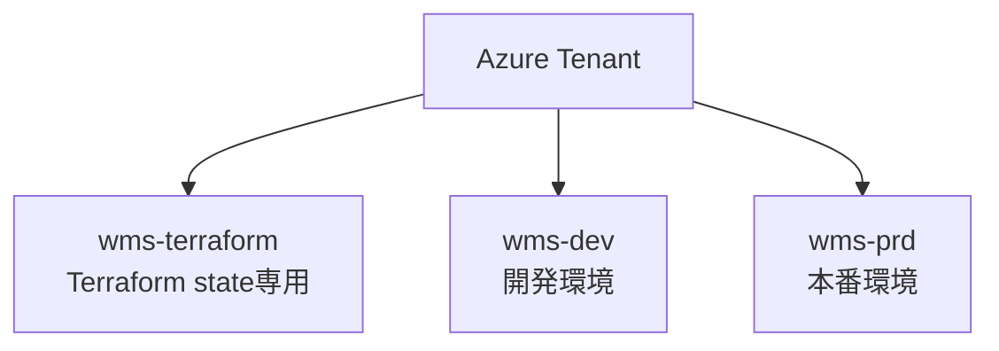
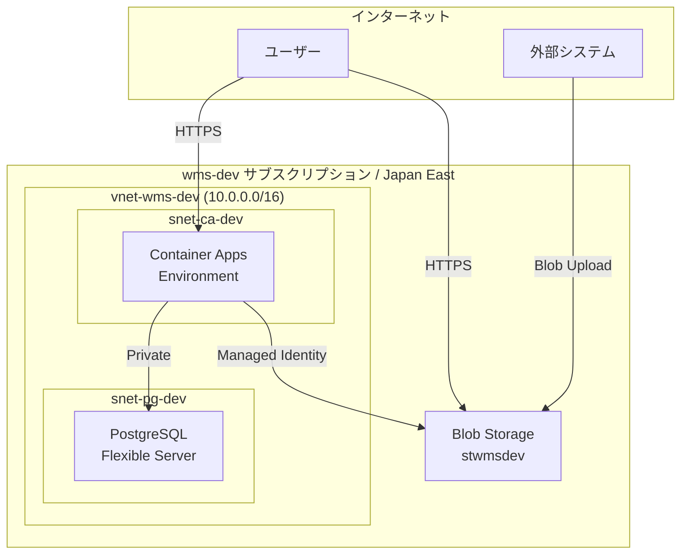
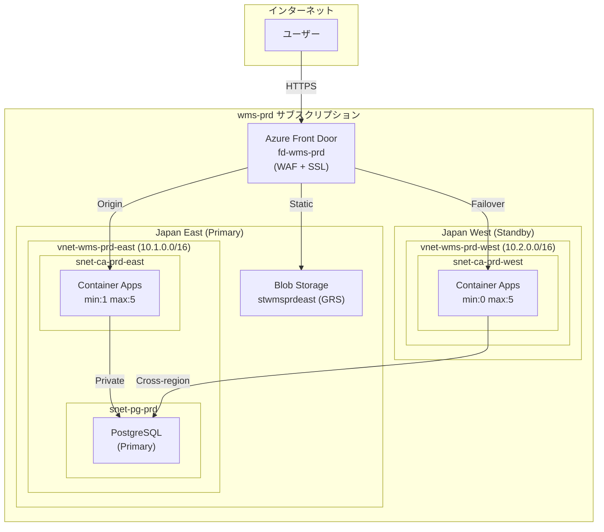
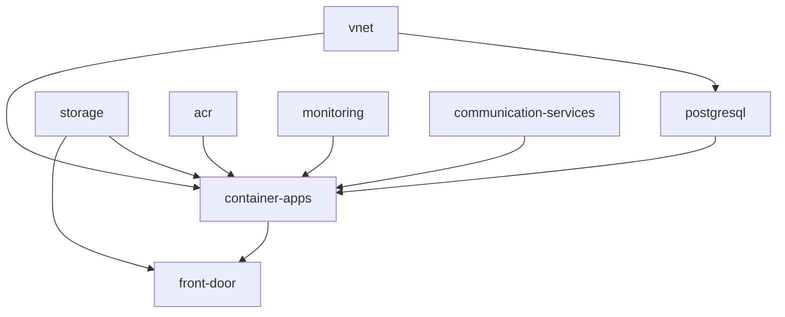
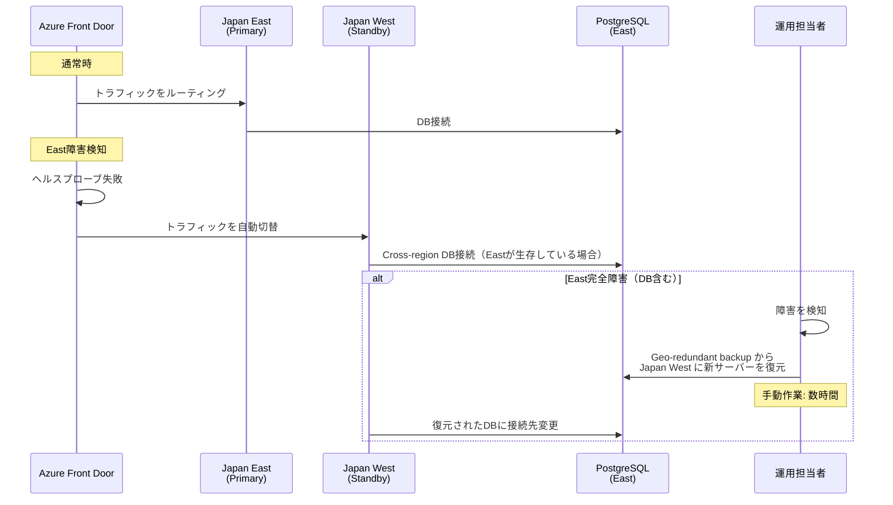

# インフラストラクチャアーキテクチャ設計書

> 本書は [architecture-blueprint/06-infrastructure-architecture.md](../architecture-blueprint/06-infrastructure-architecture.md) で定めた方針を詳細化した設計書である。
> 方針・基本設計の変更は必ずブループリント側で行い、本書は実装レベルの詳細設計を記述する。

---

## 目次

1. [Azureリソースグループ設計](#1-azureリソースグループ設計)
2. [Azure Container Apps 設計](#2-azure-container-apps-設計)
3. [Azure Container Registry 設計](#3-azure-container-registry-設計)
4. [Azure Blob Storage 設計](#4-azure-blob-storage-設計)
5. [Azure Database for PostgreSQL 設計](#5-azure-database-for-postgresql-設計)
6. [ネットワーク設計](#6-ネットワーク設計)
7. [Terraform モジュール設計](#7-terraform-モジュール設計)
8. [環境別構成](#8-環境別構成)
9. [コスト最適化設計](#9-コスト最適化設計)
10. [ディザスタリカバリ設計](#10-ディザスタリカバリ設計)

---

## 1. Azureリソースグループ設計

### 1.1 サブスクリプション構成

> 方針は [architecture-blueprint/06-infrastructure-architecture.md](../architecture-blueprint/06-infrastructure-architecture.md) を参照



### 1.2 リソースグループ一覧

#### wms-terraform サブスクリプション

| リソースグループ | 用途 | ライフサイクル |
|----------------|------|-------------|
| `rg-wms-terraform` | Terraform state用Storage Account | 常設（Destroyしない） |

#### wms-dev サブスクリプション

| リソースグループ | 用途 | ライフサイクル |
|----------------|------|-------------|
| `rg-wms-dev` | dev環境の全リソース | Deploy/Destroy対象 |
| `rg-wms-acr` | Azure Container Registry | 常設（Destroyしない） |

#### wms-prd サブスクリプション

| リソースグループ | 用途 | ライフサイクル |
|----------------|------|-------------|
| `rg-wms-prd-east` | prd環境 Japan East リソース | Deploy/Destroy対象 |
| `rg-wms-prd-west` | prd環境 Japan West リソース | Deploy/Destroy対象 |
| `rg-wms-prd-global` | Front Door等のグローバルリソース | Deploy/Destroy対象 |
| `rg-wms-acr` | Azure Container Registry（Basic SKU） | 常設（Destroyしない） |

### 1.3 命名規則

| リソース種別 | 命名パターン | 例 |
|------------|------------|-----|
| リソースグループ | `rg-wms-{env}[-{region}]` | `rg-wms-dev`, `rg-wms-prd-east` |
| Container Apps Environment | `cae-wms-{env}` | `cae-wms-dev` |
| Container App | `ca-wms-backend-{env}` | `ca-wms-backend-dev` |
| PostgreSQL | `pg-wms-{env}` | `pg-wms-dev` |
| Storage Account | `stwms{env}` | `stwmsdev`, `stwmsprdeast` |
| VNet | `vnet-wms-{env}[-{region}]` | `vnet-wms-dev`, `vnet-wms-prd-east` |
| Subnet (CA) | `snet-ca-{env}[-{region}]` | `snet-ca-dev`, `snet-ca-prd-east` |
| Subnet (PG) | `snet-pg-{env}[-{region}]` | `snet-pg-dev`, `snet-pg-prd` |
| NSG | `nsg-{subnet}-{env}` | `nsg-ca-dev`, `nsg-pg-dev` |
| Private Endpoint | `pe-{service}-{env}` | `pe-pg-dev` |
| Log Analytics Workspace | `law-wms-{env}` | `law-wms-dev` |
| Application Insights | `ai-wms-{env}` | `ai-wms-dev` |
| ACR | `acrwms` | `acrwms`（グローバル一意） |
| Front Door | `fd-wms-prd` | `fd-wms-prd` |
| Communication Services | `acs-wms-{env}` | `acs-wms-dev` |

> Azure命名制約: Storage AccountとACRはハイフン不可、小文字英数のみ。

---

## 2. Azure Container Apps 設計

### 2.1 Container Apps Environment

Container Apps Environment（CAE）はContainer Appのホスト環境であり、VNet統合の単位となる。

| パラメータ | dev | prd (East) | prd (West) |
|----------|-----|-----------|-----------|
| **名前** | `cae-wms-dev` | `cae-wms-prd-east` | `cae-wms-prd-west` |
| **リージョン** | Japan East | Japan East | Japan West |
| **VNet統合** | `snet-ca-dev` | `snet-ca-prd-east` | `snet-ca-prd-west` |
| **Log Analytics** | `law-wms-dev` | `law-wms-prd` | `law-wms-prd`（同一） |
| **内部アクセス** | false（外部公開） | false | false |

#### Container Apps Environment Terraform HCL

```hcl
resource "azurerm_container_app_environment" "main" {
  name                       = "cae-wms-${var.environment}"
  location                   = azurerm_resource_group.main.location
  resource_group_name        = azurerm_resource_group.main.name
  infrastructure_subnet_id   = azurerm_subnet.ca.id
  log_analytics_workspace_id = azurerm_log_analytics_workspace.main.id
  tags                       = local.common_tags
}
```

### 2.2 Container App 設定

#### バックエンドAPI

| パラメータ | dev | prd (East) | prd (West) |
|----------|-----|-----------|-----------|
| **名前** | `ca-wms-backend-dev` | `ca-wms-backend-prd-east` | `ca-wms-backend-prd-west` |
| **イメージ** | `acrwms.azurecr.io/wms-backend:sha-{hash}` | `acrwms.azurecr.io/wms-backend:v{semver}` | 同左 |
| **CPU** | 0.5 vCPU | 0.5 vCPU | 0.5 vCPU |
| **メモリ** | 1.0 Gi | 1.0 Gi | 1.0 Gi |
| **min replicas** | 0 | 1 | 0 |
| **max replicas** | 3 | 5 | 5 |
| **Ingress** | external, port 8080 | external, port 8080 | external, port 8080 |
| **Transport** | HTTP/1.1 | HTTP/1.1 | HTTP/1.1 |
| **Identity** | SystemAssigned | SystemAssigned | SystemAssigned |

### 2.3 スケーリングルール

```hcl
# Terraform HCL: Container App スケーリング設定
resource "azurerm_container_app" "backend" {
  name                         = "ca-wms-backend-${var.environment}"
  container_app_environment_id = azurerm_container_app_environment.main.id
  resource_group_name          = azurerm_resource_group.main.name
  revision_mode                = "Single"

  identity {
    type = "SystemAssigned"
  }

  registry {
    server   = azurerm_container_registry.main.login_server
    identity = "system"
  }

  secret {
    name  = "spring-datasource-url"
    value = var.db_connection_string
  }
  secret {
    name  = "spring-datasource-password"
    value = var.db_password
  }
  secret {
    name  = "jwt-secret"
    value = var.jwt_secret
  }
  secret {
    name  = "acs-connection-string"
    value = var.acs_connection_string
  }

  template {
    min_replicas = var.min_replicas  # dev: 0, prd-east: 1, prd-west: 0
    max_replicas = var.max_replicas  # dev: 3, prd-east: 5, prd-west: 5

    container {
      name   = "wms-backend"
      image  = "${var.acr_login_server}/wms-backend:${var.image_tag}"
      cpu    = 0.5
      memory = "1Gi"

      env {
        name  = "SPRING_PROFILES_ACTIVE"
        value = var.environment  # dev / prd
      }
      env {
        name  = "LOG_LEVEL"
        value = var.log_level  # dev: DEBUG, prd: INFO
      }
      env {
        name        = "SPRING_DATASOURCE_URL"
        secret_name = "spring-datasource-url"
      }
      env {
        name        = "SPRING_DATASOURCE_PASSWORD"
        secret_name = "spring-datasource-password"
      }
      env {
        name        = "JWT_SECRET"
        secret_name = "jwt-secret"
      }
      env {
        name        = "ACS_CONNECTION_STRING"
        secret_name = "acs-connection-string"
      }
      env {
        name  = "AZURE_STORAGE_ACCOUNT_NAME"
        value = var.storage_account_name
      }
      env {
        name  = "APPLICATIONINSIGHTS_CONNECTION_STRING"
        value = var.app_insights_connection_string
      }
      env {
        name  = "AZURE_FRONTDOOR_ID"
        value = var.frontdoor_id  # prd環境のみ設定。X-Azure-FDIDヘッダー検証用
      }
    }

    http_scale_rule {
      name                = "http-scaling"
      concurrent_requests = 10
    }
  }

  ingress {
    external_enabled = true
    target_port      = 8080
    transport        = "http"

    traffic_weight {
      percentage      = 100
      latest_revision = true
    }
  }
}

# Blob Storage: Managed Identity方式（Connection String不要）
resource "azurerm_role_assignment" "ca_storage" {
  scope                = azurerm_storage_account.main.id
  role_definition_name = "Storage Blob Data Contributor"
  principal_id         = azurerm_container_app.backend.identity[0].principal_id
}

# ACR: Managed Identity方式（Admin認証不要）
resource "azurerm_role_assignment" "ca_acr" {
  scope                = azurerm_container_registry.main.id
  role_definition_name = "AcrPull"
  principal_id         = azurerm_container_app.backend.identity[0].principal_id
}
```

### 2.4 ヘルスプローブ設定

| プローブ | パス | ポート | 間隔 | タイムアウト | 失敗閾値 |
|---------|------|------|------|-----------|---------|
| **Liveness** | `/actuator/health/liveness` | 8080 | 30秒 | 5秒 | 3 |
| **Readiness** | `/actuator/health/readiness` | 8080 | 10秒 | 5秒 | 3 |
| **Startup** | `/actuator/health` | 8080 | 10秒 | 5秒 | 30 |

```hcl
# ヘルスプローブ設定（container ブロック内）
liveness_probe {
  transport = "HTTP"
  path      = "/actuator/health/liveness"
  port      = 8080
  interval_seconds    = 30
  timeout             = 5
  failure_count_threshold = 3
}

readiness_probe {
  transport = "HTTP"
  path      = "/actuator/health/readiness"
  port      = 8080
  interval_seconds    = 10
  timeout             = 5
  failure_count_threshold = 3
}

startup_probe {
  transport = "HTTP"
  path      = "/actuator/health"
  port      = 8080
  interval_seconds    = 10
  timeout             = 5
  failure_count_threshold = 30
}
```

### 2.5 環境変数一覧

| 環境変数 | 説明 | Secret | dev値 | prd値 |
|---------|------|--------|------|------|
| `SPRING_PROFILES_ACTIVE` | Springプロファイル | No | `dev` | `prd` |
| `LOG_LEVEL` | ログレベル | No | `DEBUG` | `INFO` |
| `SPRING_DATASOURCE_URL` | DB接続文字列 | Yes | (環境依存) | (環境依存) |
| `SPRING_DATASOURCE_USERNAME` | DBユーザー名 | Yes | `wmsadmin` | `wmsadmin` |
| `SPRING_DATASOURCE_PASSWORD` | DBパスワード | Yes | (Secretsから) | (Secretsから) |
| `AZURE_STORAGE_ACCOUNT_NAME` | Blob Storageアカウント名（Managed Identity方式） | No | `stwmsdev` | `stwmsprdeast` |
| `CORS_ALLOWED_ORIGINS` | CORS許可オリジン | No | Blob Static URL | Front Door URL |
| `JWT_SECRET` | JWTトークン署名鍵 | Yes | (Secretsから) | (Secretsから) |
| `ACS_CONNECTION_STRING` | Communication Services接続文字列 | Yes | (環境依存) | (環境依存) |
| `ACS_SENDER_ADDRESS` | メール送信元アドレス | No | `DoNotReply@...` | `DoNotReply@...` |
| `APPLICATIONINSIGHTS_CONNECTION_STRING` | Application Insights接続文字列 | No | (環境依存) | (環境依存) |
| `AZURE_FRONTDOOR_ID` | Front Door ID（X-Azure-FDIDヘッダー検証用） | No | (未設定) | (Front Door ID) |

### 2.6 Front Door X-Azure-FDID 検証（prd環境）

prd環境ではAzure Front Door経由のアクセスのみを受け付けるため、Spring Bootフィルターで `X-Azure-FDID` ヘッダーを検証する。

| 項目 | 内容 |
|------|------|
| **検証対象** | `X-Azure-FDID` ヘッダー |
| **期待値** | 環境変数 `AZURE_FRONTDOOR_ID` で注入されたFront Door ID |
| **不一致時** | HTTP 403 Forbidden を返却 |
| **dev環境** | `AZURE_FRONTDOOR_ID` が未設定の場合、検証をスキップ |

> **実装方針**: Spring Security のフィルターチェインに `X-Azure-FDID` 検証フィルターを追加する。Front Door IDはTerraform output から取得し、Container Appの環境変数に注入する。

### 2.7 min replicas=0 時のコールドスタート対策

dev環境ではmin replicas=0でコスト削減を最優先するため、コールドスタートが発生する。

| 項目 | 内容 |
|------|------|
| **想定コールドスタート時間** | 15〜30秒（JVMの起動 + Spring Boot初期化） |
| **対策1** | Startupプローブの`failure_count_threshold`を30に設定（最大300秒待機） |
| **対策2** | JVMオプション `-XX:+UseSerialGC -Xss256k` で起動時間短縮 |
| **対策3** | Spring Bootの遅延初期化 `spring.main.lazy-initialization=true` をdevプロファイルで有効化 |

---

## 3. Azure Container Registry 設計

### 3.1 基本設定

| パラメータ | 値 |
|----------|---|
| **名前** | `acrwms` |
| **SKU** | Basic |
| **リソースグループ** | `rg-wms-acr`（dev/prdそれぞれのサブスクリプション） |
| **Admin有効化** | false（Managed Identityでpull） |
| **ライフサイクル** | 常設（Destroyしない） |

### 3.2 イメージ管理

| 項目 | 内容 |
|------|------|
| **リポジトリ名** | `wms-backend` |
| **タグ戦略** | dev: `sha-{commitHash}` / prd: `v{semver}` |
| **保持ポリシー** | 最新30イメージを保持（古いものは手動削除） |

### 3.3 Geo-replicationについて

Basic SKUのためGeo-replicationは非対応である。prd環境でもBasic SKUを維持し、コスト最適化を優先する。

> **注意**: prd環境でのフェイルオーバー時はJapan WestのContainer AppsがJapan EastのACRからpullする（リージョン間通信あり）。Geo-replicationが必要な場合はPremium SKU（~$50/月）への変更が必要だが、ShowCaseプロジェクトではコスト優先でBasic SKUを維持する。

### 3.4 Terraform HCL

```hcl
resource "azurerm_container_registry" "main" {
  name                = "acrwms"
  resource_group_name = azurerm_resource_group.acr.name
  location            = var.location
  sku                 = "Basic"
  admin_enabled       = false

  tags = local.common_tags
}
```

---

## 4. Azure Blob Storage 設計

### 4.1 用途別ストレージアカウント

各環境で1つのStorage Accountを使用し、コンテナ（Blobコンテナ）で用途を分離する。

| コンテナ名 | 用途 | アクセスレベル | 説明 |
|-----------|------|-------------|------|
| `$web` | フロントエンド静的ホスティング | 公開（Static Website） | Vue 3ビルド成果物 |
| `iffiles` | I/Fファイル格納 | プライベート | 外部連携CSVファイル |

### 4.2 Storage Account設定

| パラメータ | dev | prd (East) |
|----------|-----|-----------|
| **名前** | `stwmsdev` | `stwmsprdeast` |
| **リージョン** | Japan East | Japan East |
| **冗長性** | LRS | GRS |
| **アカウント種別** | StorageV2 | StorageV2 |
| **アクセス層** | Hot | Hot |
| **最小TLSバージョン** | TLS 1.2 | TLS 1.2 |
| **Static Website** | 有効 | 有効 |

### 4.3 Static Website 設定

| パラメータ | 値 |
|----------|---|
| **インデックスドキュメント** | `index.html` |
| **エラードキュメント** | `index.html`（Vue Router用SPA対応） |

### 4.4 I/Fファイルフォルダ構成

> 詳細は [architecture-blueprint/09-interface-architecture.md](../architecture-blueprint/09-interface-architecture.md) を参照

```
iffiles/
├── pending/           ← 外部システムがCSVを配置
├── processing/        ← バリデーション中・取り込み中
├── completed/         ← 取り込み完了
└── error/             ← エラーファイル
```

### 4.5 Terraform HCL

```hcl
resource "azurerm_storage_account" "main" {
  name                     = "stwms${var.environment}"
  resource_group_name      = azurerm_resource_group.main.name
  location                 = var.location
  account_tier             = "Standard"
  account_replication_type = var.storage_replication  # dev: "LRS", prd: "GRS"
  account_kind             = "StorageV2"
  min_tls_version          = "TLS1_2"

  static_website {
    index_document     = "index.html"
    error_404_document = "index.html"
  }

  blob_properties {
    cors_rule {
      allowed_headers    = ["*"]
      allowed_methods    = ["GET", "HEAD"]
      allowed_origins    = ["*"]
      exposed_headers    = ["*"]
      max_age_in_seconds = 3600
    }
  }

  tags = local.common_tags
}

resource "azurerm_storage_container" "iffiles" {
  name                  = "iffiles"
  storage_account_id    = azurerm_storage_account.main.id
  container_access_type = "private"
}
```

### 4.6 ネットワークアクセス制御

| コンテナ | アクセス方式 |
|---------|-----------|
| `$web` | パブリック（Static Websiteとして公開） |
| `iffiles` | プライベート。バックエンドAPIからManaged Identityでアクセス |

> prd環境ではFront Doorがフロントエンドへのアクセスを仲介するため、Static WebsiteのオリジンURLは直接公開しない方針だが、Azure Blob StorageのStatic Websiteは公開アクセスを前提とした機能であるため、ネットワーク制限は行わない。

---

## 5. Azure Database for PostgreSQL 設計

### 5.1 サーバー設定

| パラメータ | dev | prd |
|----------|-----|-----|
| **名前** | `pg-wms-dev` | `pg-wms-prd` |
| **リージョン** | Japan East | Japan East |
| **バージョン** | 16 | 16 |
| **SKU** | B_Standard_B1ms | B_Standard_B1ms |
| **vCPU / メモリ** | 1 vCPU / 2 GiB | 1 vCPU / 2 GiB |
| **ストレージ** | 32 GB | 32 GB |
| **ストレージ自動拡張** | 無効 | 有効 |
| **バックアップ保持期間** | 7日 | 7日 |
| **Geo冗長バックアップ** | 無効 | 有効 |
| **高可用性** | 無効 | 無効（B1msでは不可） |

### 5.2 データベース・ユーザー設定

| 項目 | 値 |
|------|---|
| **データベース名** | `wms` |
| **管理者ユーザー** | `wmsadmin` |
| **文字セット** | UTF-8 |
| **タイムゾーン** | `Asia/Tokyo` |
| **照合順序** | `ja_JP.utf8` |

### 5.3 PostgreSQLサーバーパラメータ

| パラメータ | 値 | 説明 |
|----------|---|------|
| `timezone` | `Asia/Tokyo` | サーバータイムゾーン |
| `log_timezone` | `Asia/Tokyo` | ログのタイムゾーン |
| `shared_buffers` | デフォルト | B1msでは手動チューニング不要 |
| `max_connections` | 50 | B1ms推奨値。ShowCase規模では50で十分。East/West同時接続時に不足する場合は負荷テストで検証後に引き上げ |
| `statement_timeout` | `30000` | 30秒でタイムアウト |
| `lock_timeout` | `10000` | 10秒でロックタイムアウト |
| `log_min_duration_statement` | `1000` | 1秒以上かかったクエリをログ出力（スロークエリ検知） |
| `log_statement` | `ddl` | DDL文をログ出力（スキーマ変更の監査） |

### 5.4 ネットワーク設定

| 項目 | dev | prd |
|------|-----|-----|
| **接続方式** | VNet統合（Private Access） | VNet統合（Private Access） |
| **Private DNS Zone** | `privatelink.postgres.database.azure.com` | `privatelink.postgres.database.azure.com` |
| **許可ネットワーク** | `snet-pg-dev`のみ | `snet-pg-prd` + prd-west からのクロスリージョン接続 |

### 5.5 Terraform HCL

```hcl
resource "azurerm_postgresql_flexible_server" "main" {
  name                          = "pg-wms-${var.environment}"
  resource_group_name           = azurerm_resource_group.main.name
  location                      = var.location
  version                       = "16"
  sku_name                      = "B_Standard_B1ms"
  storage_mb                    = 32768
  backup_retention_days         = 7
  geo_redundant_backup_enabled  = var.environment == "prd" ? true : false
  auto_grow_enabled             = var.environment == "prd" ? true : false
  administrator_login           = "wmsadmin"
  administrator_password        = var.db_admin_password
  zone                          = "1"

  delegated_subnet_id = azurerm_subnet.pg.id
  private_dns_zone_id = azurerm_private_dns_zone.postgres.id

  depends_on = [azurerm_private_dns_zone_virtual_network_link.postgres]

  tags = local.common_tags
}

resource "azurerm_postgresql_flexible_server_database" "wms" {
  name      = "wms"
  server_id = azurerm_postgresql_flexible_server.main.id
  charset   = "UTF8"
  collation = "ja_JP.utf8"
}

resource "azurerm_postgresql_flexible_server_configuration" "timezone" {
  server_id = azurerm_postgresql_flexible_server.main.id
  name      = "timezone"
  value     = "Asia/Tokyo"
}

resource "azurerm_postgresql_flexible_server_configuration" "statement_timeout" {
  server_id = azurerm_postgresql_flexible_server.main.id
  name      = "statement_timeout"
  value     = "30000"
}

resource "azurerm_postgresql_flexible_server_configuration" "max_connections" {
  server_id = azurerm_postgresql_flexible_server.main.id
  name      = "max_connections"
  value     = "50"
}

resource "azurerm_postgresql_flexible_server_configuration" "lock_timeout" {
  server_id = azurerm_postgresql_flexible_server.main.id
  name      = "lock_timeout"
  value     = "10000"
}

resource "azurerm_postgresql_flexible_server_configuration" "log_min_duration_statement" {
  server_id = azurerm_postgresql_flexible_server.main.id
  name      = "log_min_duration_statement"
  value     = "1000"
}

resource "azurerm_postgresql_flexible_server_configuration" "log_statement" {
  server_id = azurerm_postgresql_flexible_server.main.id
  name      = "log_statement"
  value     = "ddl"
}
```

### 5.6 停止・起動運用

> 詳細は [architecture-blueprint/11-monitoring-operations.md](../architecture-blueprint/11-monitoring-operations.md) を参照

| 項目 | 内容 |
|------|------|
| **自動再起動** | Azure仕様で7日間連続停止後に自動再起動される |
| **対策** | 停止状態を維持したい場合は7日以内に手動で停止→起動→停止を実施 |
| **Terraform影響** | 停止状態のサーバーに対してTerraform applyは可能 |

---

## 6. ネットワーク設計

### 6.1 ネットワーク構成図





### 6.2 VNet設計

#### dev環境

| VNet | CIDR | リージョン |
|------|------|---------|
| `vnet-wms-dev` | `10.0.0.0/16` | Japan East |

| サブネット | CIDR | 用途 | 委任先 |
|----------|------|------|--------|
| `snet-ca-dev` | `10.0.0.0/23` | Container Apps Environment | `Microsoft.App/environments` |
| `snet-pg-dev` | `10.0.2.0/24` | PostgreSQL Flexible Server | `Microsoft.DBforPostgreSQL/flexibleServers` |

#### prd環境 (Japan East)

| VNet | CIDR | リージョン |
|------|------|---------|
| `vnet-wms-prd-east` | `10.1.0.0/16` | Japan East |

| サブネット | CIDR | 用途 | 委任先 |
|----------|------|------|--------|
| `snet-ca-prd-east` | `10.1.0.0/23` | Container Apps Environment | `Microsoft.App/environments` |
| `snet-pg-prd` | `10.1.2.0/24` | PostgreSQL Flexible Server | `Microsoft.DBforPostgreSQL/flexibleServers` |

#### prd環境 (Japan West)

| VNet | CIDR | リージョン |
|------|------|---------|
| `vnet-wms-prd-west` | `10.2.0.0/16` | Japan West |

| サブネット | CIDR | 用途 | 委任先 |
|----------|------|------|--------|
| `snet-ca-prd-west` | `10.2.0.0/23` | Container Apps Environment | `Microsoft.App/environments` |

> Container Apps Environmentは最低 /23 のサブネットが必要（Azure要件）。

### 6.3 NSG（Network Security Group）設計

#### snet-ca サブネット用 NSG

| 優先度 | 方向 | ソース | 宛先 | ポート | プロトコル | アクション |
|-------|------|-------|------|------|----------|----------|
| 100 | Inbound | Internet | snet-ca | 443 | TCP | Allow |
| 110 | Inbound | AzureFrontDoor.Backend | snet-ca | 443 | TCP | Allow（prdのみ） |
| 200 | Inbound | AzureLoadBalancer | snet-ca | * | * | Allow |
| 4096 | Inbound | * | * | * | * | Deny |
| 100 | Outbound | snet-ca | snet-pg | 5432 | TCP | Allow |
| 110 | Outbound | snet-ca | Internet | 443 | TCP | Allow（Blob Storage等） |
| 4096 | Outbound | * | * | * | * | Deny |

#### snet-pg サブネット用 NSG

| 優先度 | 方向 | ソース | 宛先 | ポート | プロトコル | アクション |
|-------|------|-------|------|------|----------|----------|
| 100 | Inbound | snet-ca | snet-pg | 5432 | TCP | Allow |
| 4096 | Inbound | * | * | * | * | Deny |
| 4096 | Outbound | * | * | * | * | Deny |

### 6.4 Terraform HCL（VNet + サブネット + NSG）

```hcl
resource "azurerm_virtual_network" "main" {
  name                = "vnet-wms-${var.environment}"
  location            = azurerm_resource_group.main.location
  resource_group_name = azurerm_resource_group.main.name
  address_space       = [var.vnet_cidr]
  tags                = local.common_tags
}

resource "azurerm_subnet" "ca" {
  name                 = "snet-ca-${var.environment}"
  resource_group_name  = azurerm_resource_group.main.name
  virtual_network_name = azurerm_virtual_network.main.name
  address_prefixes     = [var.snet_ca_cidr]
  delegation {
    name = "container-apps"
    service_delegation {
      name    = "Microsoft.App/environments"
      actions = ["Microsoft.Network/virtualNetworks/subnets/join/action"]
    }
  }
}

resource "azurerm_subnet" "pg" {
  name                 = "snet-pg-${var.environment}"
  resource_group_name  = azurerm_resource_group.main.name
  virtual_network_name = azurerm_virtual_network.main.name
  address_prefixes     = [var.snet_pg_cidr]
  delegation {
    name = "postgresql"
    service_delegation {
      name    = "Microsoft.DBforPostgreSQL/flexibleServers"
      actions = ["Microsoft.Network/virtualNetworks/subnets/join/action"]
    }
  }
}

resource "azurerm_network_security_group" "ca" {
  name                = "nsg-ca-${var.environment}"
  location            = azurerm_resource_group.main.location
  resource_group_name = azurerm_resource_group.main.name
  tags                = local.common_tags
}

resource "azurerm_network_security_group" "pg" {
  name                = "nsg-pg-${var.environment}"
  location            = azurerm_resource_group.main.location
  resource_group_name = azurerm_resource_group.main.name
  tags                = local.common_tags
}

# --- snet-ca NSG ルール ---

resource "azurerm_network_security_rule" "ca_inbound_https" {
  name                        = "Allow-HTTPS-Inbound"
  priority                    = 100
  direction                   = "Inbound"
  access                      = "Allow"
  protocol                    = "Tcp"
  source_port_range           = "*"
  destination_port_range      = "443"
  source_address_prefix       = "Internet"
  destination_address_prefix  = "*"
  resource_group_name         = azurerm_resource_group.main.name
  network_security_group_name = azurerm_network_security_group.ca.name
}

resource "azurerm_network_security_rule" "ca_inbound_frontdoor" {
  count                       = var.enable_front_door ? 1 : 0
  name                        = "Allow-FrontDoor-Inbound"
  priority                    = 110
  direction                   = "Inbound"
  access                      = "Allow"
  protocol                    = "Tcp"
  source_port_range           = "*"
  destination_port_range      = "443"
  source_address_prefix       = "AzureFrontDoor.Backend"
  destination_address_prefix  = "*"
  resource_group_name         = azurerm_resource_group.main.name
  network_security_group_name = azurerm_network_security_group.ca.name
}

resource "azurerm_network_security_rule" "ca_inbound_lb" {
  name                        = "Allow-AzureLB-Inbound"
  priority                    = 200
  direction                   = "Inbound"
  access                      = "Allow"
  protocol                    = "*"
  source_port_range           = "*"
  destination_port_range      = "*"
  source_address_prefix       = "AzureLoadBalancer"
  destination_address_prefix  = "*"
  resource_group_name         = azurerm_resource_group.main.name
  network_security_group_name = azurerm_network_security_group.ca.name
}

resource "azurerm_network_security_rule" "ca_inbound_deny_all" {
  name                        = "Deny-All-Inbound"
  priority                    = 4096
  direction                   = "Inbound"
  access                      = "Deny"
  protocol                    = "*"
  source_port_range           = "*"
  destination_port_range      = "*"
  source_address_prefix       = "*"
  destination_address_prefix  = "*"
  resource_group_name         = azurerm_resource_group.main.name
  network_security_group_name = azurerm_network_security_group.ca.name
}

resource "azurerm_network_security_rule" "ca_outbound_pg" {
  name                        = "Allow-PostgreSQL-Outbound"
  priority                    = 100
  direction                   = "Outbound"
  access                      = "Allow"
  protocol                    = "Tcp"
  source_port_range           = "*"
  destination_port_range      = "5432"
  source_address_prefix       = "*"
  destination_address_prefix  = azurerm_subnet.pg.address_prefixes[0]
  resource_group_name         = azurerm_resource_group.main.name
  network_security_group_name = azurerm_network_security_group.ca.name
}

resource "azurerm_network_security_rule" "ca_outbound_https" {
  name                        = "Allow-HTTPS-Outbound"
  priority                    = 110
  direction                   = "Outbound"
  access                      = "Allow"
  protocol                    = "Tcp"
  source_port_range           = "*"
  destination_port_range      = "443"
  source_address_prefix       = "*"
  destination_address_prefix  = "Internet"
  resource_group_name         = azurerm_resource_group.main.name
  network_security_group_name = azurerm_network_security_group.ca.name
}

resource "azurerm_network_security_rule" "ca_outbound_deny_all" {
  name                        = "Deny-All-Outbound"
  priority                    = 4096
  direction                   = "Outbound"
  access                      = "Deny"
  protocol                    = "*"
  source_port_range           = "*"
  destination_port_range      = "*"
  source_address_prefix       = "*"
  destination_address_prefix  = "*"
  resource_group_name         = azurerm_resource_group.main.name
  network_security_group_name = azurerm_network_security_group.ca.name
}

# --- snet-pg NSG ルール ---

resource "azurerm_network_security_rule" "pg_inbound_ca" {
  name                        = "Allow-CA-PostgreSQL-Inbound"
  priority                    = 100
  direction                   = "Inbound"
  access                      = "Allow"
  protocol                    = "Tcp"
  source_port_range           = "*"
  destination_port_range      = "5432"
  source_address_prefix       = azurerm_subnet.ca.address_prefixes[0]
  destination_address_prefix  = "*"
  resource_group_name         = azurerm_resource_group.main.name
  network_security_group_name = azurerm_network_security_group.pg.name
}

resource "azurerm_network_security_rule" "pg_inbound_deny_all" {
  name                        = "Deny-All-Inbound"
  priority                    = 4096
  direction                   = "Inbound"
  access                      = "Deny"
  protocol                    = "*"
  source_port_range           = "*"
  destination_port_range      = "*"
  source_address_prefix       = "*"
  destination_address_prefix  = "*"
  resource_group_name         = azurerm_resource_group.main.name
  network_security_group_name = azurerm_network_security_group.pg.name
}

resource "azurerm_network_security_rule" "pg_outbound_deny_all" {
  name                        = "Deny-All-Outbound"
  priority                    = 4096
  direction                   = "Outbound"
  access                      = "Deny"
  protocol                    = "*"
  source_port_range           = "*"
  destination_port_range      = "*"
  source_address_prefix       = "*"
  destination_address_prefix  = "*"
  resource_group_name         = azurerm_resource_group.main.name
  network_security_group_name = azurerm_network_security_group.pg.name
}

# --- NSG をサブネットに関連付け ---

resource "azurerm_subnet_network_security_group_association" "ca" {
  subnet_id                 = azurerm_subnet.ca.id
  network_security_group_id = azurerm_network_security_group.ca.id
}

resource "azurerm_subnet_network_security_group_association" "pg" {
  subnet_id                 = azurerm_subnet.pg.id
  network_security_group_id = azurerm_network_security_group.pg.id
}
```

### 6.5 Private DNS Zone

| DNS Zone | 用途 |
|---------|------|
| `privatelink.postgres.database.azure.com` | PostgreSQL Flexible Server のプライベートDNS解決 |

```hcl
resource "azurerm_private_dns_zone" "postgres" {
  name                = "privatelink.postgres.database.azure.com"
  resource_group_name = azurerm_resource_group.main.name

  tags = local.common_tags
}

resource "azurerm_private_dns_zone_virtual_network_link" "postgres" {
  name                  = "postgres-vnet-link"
  resource_group_name   = azurerm_resource_group.main.name
  private_dns_zone_name = azurerm_private_dns_zone.postgres.name
  virtual_network_id    = azurerm_virtual_network.main.id
  registration_enabled  = false
}
```

### 6.6 prd環境 クロスリージョン接続

Japan Westの Container Apps から Japan East の PostgreSQL に接続するために、VNet Peering を構成する。

```hcl
# East → West Peering
resource "azurerm_virtual_network_peering" "east_to_west" {
  name                      = "peer-east-to-west"
  resource_group_name       = azurerm_resource_group.east.name
  virtual_network_name      = azurerm_virtual_network.east.name
  remote_virtual_network_id = azurerm_virtual_network.west.id
  allow_forwarded_traffic   = true
  allow_gateway_transit     = false
}

# West → East Peering
resource "azurerm_virtual_network_peering" "west_to_east" {
  name                      = "peer-west-to-east"
  resource_group_name       = azurerm_resource_group.west.name
  virtual_network_name      = azurerm_virtual_network.west.name
  remote_virtual_network_id = azurerm_virtual_network.east.id
  allow_forwarded_traffic   = true
  allow_gateway_transit     = false
}
```

---

## 7. Terraform モジュール設計

### 7.1 ディレクトリ構成

> 基本構成は [architecture-blueprint/06-infrastructure-architecture.md](../architecture-blueprint/06-infrastructure-architecture.md) を参照

```
infra/
├── modules/
│   ├── container-apps/
│   │   ├── main.tf           # CAE + Container App
│   │   ├── variables.tf
│   │   └── outputs.tf
│   ├── postgresql/
│   │   ├── main.tf           # Flexible Server + Database + Config
│   │   ├── variables.tf
│   │   └── outputs.tf
│   ├── storage/
│   │   ├── main.tf           # Storage Account + Containers + Static Website
│   │   ├── variables.tf
│   │   └── outputs.tf
│   ├── vnet/
│   │   ├── main.tf           # VNet + Subnets + NSGs + DNS Zone
│   │   ├── variables.tf
│   │   └── outputs.tf
│   ├── acr/
│   │   ├── main.tf           # ACR
│   │   ├── variables.tf
│   │   └── outputs.tf
│   ├── communication-services/
│   │   ├── main.tf           # ACS + Email Domain
│   │   ├── variables.tf
│   │   └── outputs.tf
│   ├── front-door/
│   │   ├── main.tf           # Front Door + Origins + Routes + WAF
│   │   ├── variables.tf
│   │   └── outputs.tf
│   └── monitoring/
│       ├── main.tf           # Log Analytics + Application Insights + Alerts + Action Group
│       ├── variables.tf
│       └── outputs.tf
├── environments/
│   ├── dev/
│   │   ├── main.tf           # モジュール呼び出し + provider設定
│   │   ├── variables.tf      # 変数定義
│   │   ├── terraform.tfvars  # dev環境パラメータ
│   │   ├── outputs.tf        # フロントエンドURL等のoutput
│   │   └── backend.tf        # tfstate backend設定
│   └── prd/
│       ├── main.tf
│       ├── variables.tf
│       ├── terraform.tfvars
│       ├── outputs.tf
│       └── backend.tf
└── terraform-state/
    ├── main.tf               # tfstate用ストレージアカウント作成
    └── variables.tf
```

### 7.2 モジュール依存関係



### 7.3 モジュール I/O 定義

各モジュールの variables.tf / outputs.tf で定義する入力変数と出力値の一覧。

#### vnet モジュール

| 区分 | 名前 | 型 | 説明 |
|------|------|---|------|
| **入力** | `environment` | string | 環境名（dev / prd） |
| **入力** | `location` | string | Azureリージョン |
| **入力** | `resource_group_name` | string | リソースグループ名 |
| **入力** | `vnet_cidr` | string | VNet CIDRブロック |
| **入力** | `snet_ca_cidr` | string | Container Appsサブネット CIDR |
| **入力** | `snet_pg_cidr` | string | PostgreSQLサブネット CIDR |
| **入力** | `enable_front_door` | bool | Front Doorルール有効化フラグ |
| **出力** | `vnet_id` | string | VNetリソースID |
| **出力** | `snet_ca_id` | string | Container AppsサブネットID |
| **出力** | `snet_pg_id` | string | PostgreSQLサブネットID |

#### container-apps モジュール

| 区分 | 名前 | 型 | 説明 |
|------|------|---|------|
| **入力** | `environment` | string | 環境名 |
| **入力** | `location` | string | Azureリージョン |
| **入力** | `resource_group_name` | string | リソースグループ名 |
| **入力** | `snet_ca_id` | string | Container AppsサブネットID |
| **入力** | `log_analytics_workspace_id` | string | Log Analytics Workspace ID |
| **入力** | `acr_login_server` | string | ACRログインサーバー |
| **入力** | `acr_id` | string | ACRリソースID（ロール割り当て用） |
| **入力** | `image_tag` | string | コンテナイメージタグ |
| **入力** | `min_replicas` | number | 最小レプリカ数 |
| **入力** | `max_replicas` | number | 最大レプリカ数 |
| **入力** | `log_level` | string | ログレベル |
| **入力** | `db_connection_string` | string | DB接続文字列（sensitive） |
| **入力** | `db_password` | string | DBパスワード（sensitive） |
| **入力** | `jwt_secret` | string | JWTシークレット（sensitive） |
| **入力** | `acs_connection_string` | string | ACS接続文字列（sensitive） |
| **入力** | `storage_account_id` | string | Storage AccountリソースID（ロール割り当て用） |
| **入力** | `storage_account_name` | string | Storage Account名 |
| **入力** | `app_insights_connection_string` | string | Application Insights接続文字列 |
| **入力** | `frontdoor_id` | string | Front Door ID（prdのみ） |
| **出力** | `container_app_id` | string | Container AppリソースID |
| **出力** | `identity_principal_id` | string | SystemAssigned Managed IdentityのプリンシパルID |
| **出力** | `fqdn` | string | Container App Ingress FQDN |

#### postgresql モジュール

| 区分 | 名前 | 型 | 説明 |
|------|------|---|------|
| **入力** | `environment` | string | 環境名 |
| **入力** | `location` | string | Azureリージョン |
| **入力** | `resource_group_name` | string | リソースグループ名 |
| **入力** | `snet_pg_id` | string | PostgreSQLサブネットID |
| **入力** | `private_dns_zone_id` | string | Private DNS Zone ID |
| **入力** | `db_admin_password` | string | DB管理者パスワード（sensitive） |
| **出力** | `server_id` | string | PostgreSQLサーバーリソースID |
| **出力** | `server_fqdn` | string | PostgreSQLサーバーFQDN |
| **出力** | `connection_string` | string | JDBC接続文字列 |

#### storage モジュール

| 区分 | 名前 | 型 | 説明 |
|------|------|---|------|
| **入力** | `environment` | string | 環境名 |
| **入力** | `location` | string | Azureリージョン |
| **入力** | `resource_group_name` | string | リソースグループ名 |
| **入力** | `storage_replication` | string | レプリケーションタイプ（LRS / GRS） |
| **出力** | `storage_account_id` | string | Storage AccountリソースID |
| **出力** | `storage_account_name` | string | Storage Account名 |
| **出力** | `static_website_url` | string | Static Website URL |

#### acr モジュール

| 区分 | 名前 | 型 | 説明 |
|------|------|---|------|
| **入力** | `location` | string | Azureリージョン |
| **入力** | `resource_group_name` | string | リソースグループ名 |
| **出力** | `acr_id` | string | ACRリソースID |
| **出力** | `acr_login_server` | string | ACRログインサーバー（`acrwms.azurecr.io`） |

#### monitoring モジュール

| 区分 | 名前 | 型 | 説明 |
|------|------|---|------|
| **入力** | `environment` | string | 環境名 |
| **入力** | `location` | string | Azureリージョン |
| **入力** | `resource_group_name` | string | リソースグループ名 |
| **入力** | `alert_email` | string | アラート通知先メールアドレス |
| **出力** | `log_analytics_workspace_id` | string | Log Analytics Workspace ID |
| **出力** | `app_insights_connection_string` | string | Application Insights接続文字列 |
| **出力** | `app_insights_instrumentation_key` | string | Application Insightsインストルメンテーションキー |

#### front-door モジュール

| 区分 | 名前 | 型 | 説明 |
|------|------|---|------|
| **入力** | `resource_group_name` | string | グローバルリソースグループ名 |
| **入力** | `backend_fqdn_east` | string | East Container App FQDN |
| **入力** | `backend_fqdn_west` | string | West Container App FQDN |
| **入力** | `static_website_hostname` | string | Static Website ホスト名 |
| **出力** | `frontdoor_id` | string | Front DoorリソースID |
| **出力** | `frontdoor_endpoint_hostname` | string | Front Doorエンドポイントホスト名 |

#### communication-services モジュール

| 区分 | 名前 | 型 | 説明 |
|------|------|---|------|
| **入力** | `environment` | string | 環境名 |
| **入力** | `resource_group_name` | string | リソースグループ名 |
| **出力** | `connection_string` | string | ACS接続文字列 |

### 7.4 State管理

| 項目 | 値 |
|------|---|
| **Backend** | azurerm（Azure Blob Storage） |
| **サブスクリプション** | wms-terraform |
| **ストレージアカウント** | `stwmsterraform` |
| **コンテナ** | `tfstate` |
| **State Key** | `{env}/terraform.tfstate` |
| **State Lock** | Azure Blob Lease（自動） |

```hcl
# environments/dev/backend.tf
terraform {
  backend "azurerm" {
    subscription_id      = "xxxxxxxx-xxxx-xxxx-xxxx-xxxxxxxxxxxx"  # wms-terraform
    resource_group_name  = "rg-wms-terraform"
    storage_account_name = "stwmsterraform"
    container_name       = "tfstate"
    key                  = "dev/terraform.tfstate"
  }
}
```

### 7.5 Provider設定

```hcl
# environments/dev/main.tf
terraform {
  required_version = ">= 1.5.0"

  required_providers {
    azurerm = {
      source  = "hashicorp/azurerm"
      version = "~> 4.0"
    }
  }
}

provider "azurerm" {
  subscription_id = var.subscription_id
  features {}
}
```

### 7.6 共通タグ

全リソースに以下のタグを付与する。

```hcl
locals {
  common_tags = {
    project     = "wms"
    environment = var.environment
    managed_by  = "terraform"
  }
}
```

### 7.7 Terraform Output（主要値）

| Output名 | 説明 | 用途 |
|----------|------|------|
| `frontend_url` | Static Website の URL | フロントエンドデプロイ先・CORS設定 |
| `backend_url` | Container App の FQDN | APIエンドポイント |
| `acr_login_server` | ACR のログインサーバー | Docker push先 |
| `db_fqdn` | PostgreSQL の FQDN | DB接続文字列 |
| `app_insights_connection_string` | Application Insights 接続文字列 | アプリケーション監視 |
| `frontdoor_endpoint` | Front Door エンドポイント | prd環境のエントリポイント |

> Terraform Destroy/Apply でURLが変わるため、GitHub ActionsのCD処理でTerraform outputから動的に値を取得してフロントエンドのAPI URL設定に注入する。

---

## 8. 環境別構成

### 8.1 パラメータ差分一覧

| パラメータ | dev | prd |
|----------|-----|-----|
| **リージョン** | Japan East | Japan East + Japan West |
| **Front Door** | なし | あり（WAF付き） |
| **CA min replicas** | 0 | East:1 / West:0 |
| **CA max replicas** | 3 | East:5 / West:5 |
| **PostgreSQL Geo-backup** | 無効 | 有効 |
| **Storage冗長性** | LRS | GRS |
| **ACR SKU** | Basic | Basic（Geo-replication非対応。コスト優先で維持） |
| **Log Analytics保持期間** | 30日 | 30日 |
| **ログレベル** | DEBUG | INFO |
| **VNet Peering** | なし | East↔West |

### 8.2 dev環境 terraform.tfvars

```hcl
# environments/dev/terraform.tfvars
environment          = "dev"
location             = "japaneast"
subscription_id      = "xxxxxxxx-dev-subscription-id"

# Container Apps
min_replicas         = 0
max_replicas         = 3
image_tag            = "sha-latest"  # CD時にオーバーライド
log_level            = "DEBUG"

# PostgreSQL
db_sku_name          = "B_Standard_B1ms"
db_storage_mb        = 32768
db_geo_backup        = false
db_auto_grow         = false

# Storage
storage_replication  = "LRS"

# ACR
acr_sku              = "Basic"

# Network
vnet_cidr            = "10.0.0.0/16"
snet_ca_cidr         = "10.0.0.0/23"
snet_pg_cidr         = "10.0.2.0/24"

# Front Door
enable_front_door    = false
```

### 8.3 prd環境 terraform.tfvars

```hcl
# environments/prd/terraform.tfvars
environment          = "prd"
location_primary     = "japaneast"
location_secondary   = "japanwest"
subscription_id      = "xxxxxxxx-prd-subscription-id"

# Container Apps (East)
min_replicas_east    = 1
max_replicas_east    = 5

# Container Apps (West)
min_replicas_west    = 0
max_replicas_west    = 5

log_level            = "INFO"

# PostgreSQL
db_sku_name          = "B_Standard_B1ms"
db_storage_mb        = 32768
db_geo_backup        = true
db_auto_grow         = true

# Storage
storage_replication  = "GRS"

# ACR
acr_sku              = "Basic"

# Network (East)
vnet_east_cidr       = "10.1.0.0/16"
snet_ca_east_cidr    = "10.1.0.0/23"
snet_pg_east_cidr    = "10.1.2.0/24"

# Network (West)
vnet_west_cidr       = "10.2.0.0/16"
snet_ca_west_cidr    = "10.2.0.0/23"

# Front Door
enable_front_door    = true
```

---

## 9. コスト最適化設計

### 9.1 コスト構造

> 基本方針は [architecture-blueprint/06-infrastructure-architecture.md](../architecture-blueprint/06-infrastructure-architecture.md) を参照

#### 常時維持コスト（Destroy後も残るリソース）

| リソース | 月額概算 | 備考 |
|---------|---------|------|
| ACR (Basic) | ~$5.00 | イメージ保管 |
| Terraform state Blob | ~$0.01 | 数KBのtfstate |
| **合計** | **~$5.01** | |

#### dev環境 稼働時コスト

| リソース | SKU/設定 | 月額概算 | 備考 |
|---------|---------|---------|------|
| Container Apps | 0.5 vCPU / 1 Gi, min:0 | ~$0（アイドル時） | リクエスト時のみ課金 |
| PostgreSQL B1ms | 1 vCPU / 2 GiB | ~$6.20 | 停止時はストレージのみ |
| Storage Account (LRS) | Hot tier | ~$0.10 | 静的サイト + I/Fファイル |
| Log Analytics | 5GB/月無料枠内 | $0 | |
| Communication Services | 従量課金 | ~$0 | 開発中はほぼ0 |
| **合計（稼働時）** | | **~$6.30** | |
| **合計（DB停止時）** | | **~$0.10** | ストレージのみ |

#### prd環境 稼働時コスト

| リソース | SKU/設定 | 月額概算 | 備考 |
|---------|---------|---------|------|
| Container Apps (East) | 0.5 vCPU / 1 Gi, min:1 | ~$15.00 | 常時1台 |
| Container Apps (West) | 0.5 vCPU / 1 Gi, min:0 | ~$0 | Standby |
| PostgreSQL B1ms | 1 vCPU / 2 GiB + Geo-backup | ~$9.30 | Geo-backup追加料金あり |
| Storage Account (GRS) | Hot tier | ~$0.20 | GRS分の追加 |
| Front Door (Standard) | | ~$35.00 | |
| Log Analytics | 5GB/月無料枠内 | $0 | |
| Communication Services | 従量課金 | ~$1.00 | |
| **合計（稼働時）** | | **~$60.50** | |

### 9.2 コスト削減施策

| 施策 | 効果 | 対象環境 |
|------|------|---------|
| Container Apps min replicas=0 | 未使用時ゼロコスト | dev, prd-west |
| PostgreSQL手動停止 | ~$6/月節約 | dev |
| Terraform Destroy運用 | 不使用時に全リソース削除 | dev |
| ACR Basic SKU | Premium比で~$45/月節約 | 全環境 |
| PostgreSQL B1ms | GP比で~$90/月節約 | 全環境 |
| Log Analytics無料枠内運用 | ログ費用$0 | 全環境 |

### 9.3 コスト監視

| 項目 | 内容 |
|------|------|
| **予算アラート** | Azureコスト管理で月額予算を設定。80%/100%到達時にメール通知 |
| **dev予算** | $15/月 |
| **prd予算** | $100/月 |

---

## 10. ディザスタリカバリ設計

### 10.1 DR方針

> フェイルオーバー仕様は [architecture-blueprint/06-infrastructure-architecture.md](../architecture-blueprint/06-infrastructure-architecture.md) を参照

| 項目 | 値 |
|------|---|
| **DR方式** | Active-Passive（prd環境のみ） |
| **Primary** | Japan East |
| **Standby** | Japan West |
| **RPO** | 最大1時間（PostgreSQL Geo-redundant backup基点） |
| **RTO** | フロント/API: 数分 / DB復旧: 数時間（手動） |

### 10.2 フェイルオーバーフロー



### 10.3 コンポーネント別DR設計

| コンポーネント | 方式 | 自動/手動 | RPO | RTO |
|-------------|------|---------|-----|-----|
| **フロントエンド** | GRS自動レプリケーション | 自動 | ほぼ0 | 数分 |
| **バックエンドAPI** | West CA (min:0) 自動スケール | 自動 | 0 | 数分 |
| **DB（East生存時）** | クロスリージョン接続 | 自動 | 0 | 数分 |
| **DB（East障害時）** | Geo-redundant backup復元 | 手動 | 最大1時間 | 数時間 |
| **I/Fファイル** | GRS自動レプリケーション | 自動 | ほぼ0 | 数分 |

### 10.4 DB復旧手順

Japan East が完全に利用不可になった場合の手動復旧手順:

```bash
# 1. Geo-redundant backup から Japan West に新サーバーを復元
az postgres flexible-server geo-restore \
  --resource-group rg-wms-prd-west \
  --name pg-wms-prd-west \
  --source-server /subscriptions/{sub}/resourceGroups/rg-wms-prd-east/providers/Microsoft.DBforPostgreSQL/flexibleServers/pg-wms-prd \
  --location japanwest

# 2. West の Container App の DB接続先を変更
az containerapp update \
  --name ca-wms-backend-prd-west \
  --resource-group rg-wms-prd-west \
  --set-env-vars "SPRING_DATASOURCE_URL=jdbc:postgresql://pg-wms-prd-west.postgres.database.azure.com:5432/wms"

# 3. 復旧確認
curl https://ca-wms-backend-prd-west.*.japanwest.azurecontainerapps.io/actuator/health
```

### 10.5 dev環境のDR

dev環境はDR対象外。障害時は Terraform apply で再構築する。

| 項目 | 内容 |
|------|------|
| **バックアップ** | PostgreSQL自動バックアップ（7日間） |
| **復旧方式** | `terraform apply` で環境再構築 + DBポイントインタイムリストア |
| **データ損失許容** | 開発データのため損失許容 |

---

## 付録A: Azure Front Door 設計（prd環境のみ）

### A.1 基本設定

| パラメータ | 値 |
|----------|---|
| **名前** | `fd-wms-prd` |
| **SKU** | Standard |
| **WAF** | 有効（Microsoft Default Rule Set 2.1, Prevention モード） |

### A.2 ルーティング設計

| ルート | パターン | Origin |
|-------|---------|--------|
| **フロントエンド** | `/*` | Blob Storage Static Website (East) |
| **バックエンドAPI** | `/api/*` | Container Apps (East → West failover) |

### A.3 Origin Group 設定

#### API Origin Group

| パラメータ | 値 |
|----------|---|
| **ヘルスプローブパス** | `/actuator/health` |
| **プローブ間隔** | 30秒 |
| **プロトコル** | HTTPS |
| **Origin (Primary)** | `ca-wms-backend-prd-east` (Priority: 1, Weight: 1000) |
| **Origin (Secondary)** | `ca-wms-backend-prd-west` (Priority: 2, Weight: 1000) |

#### Static Website Origin Group

| パラメータ | 値 |
|----------|---|
| **ヘルスプローブ** | 無効（静的コンテンツのため） |
| **Origin** | `stwmsprdeast.z11.web.core.windows.net` (Priority: 1) |

### A.4 Terraform HCL

```hcl
resource "azurerm_cdn_frontdoor_profile" "main" {
  name                = "fd-wms-prd"
  resource_group_name = azurerm_resource_group.global.name
  sku_name            = "Standard_AzureFrontDoor"

  tags = local.common_tags
}

resource "azurerm_cdn_frontdoor_endpoint" "main" {
  name                     = "wms-prd"
  cdn_frontdoor_profile_id = azurerm_cdn_frontdoor_profile.main.id
}

# --- API Origin Group（Active-Passive） ---

resource "azurerm_cdn_frontdoor_origin_group" "api" {
  name                     = "api-origin-group"
  cdn_frontdoor_profile_id = azurerm_cdn_frontdoor_profile.main.id

  health_probe {
    path                = "/actuator/health"
    protocol            = "Https"
    interval_in_seconds = 30
    request_type        = "GET"
  }

  load_balancing {
    sample_size                 = 4
    successful_samples_required = 3
  }
}

resource "azurerm_cdn_frontdoor_origin" "api_east" {
  name                          = "api-east"
  cdn_frontdoor_origin_group_id = azurerm_cdn_frontdoor_origin_group.api.id
  host_name                     = azurerm_container_app.backend_east.ingress[0].fqdn
  http_port                     = 80
  https_port                    = 443
  priority                      = 1
  weight                        = 1000
  enabled                       = true
}

resource "azurerm_cdn_frontdoor_origin" "api_west" {
  name                          = "api-west"
  cdn_frontdoor_origin_group_id = azurerm_cdn_frontdoor_origin_group.api.id
  host_name                     = azurerm_container_app.backend_west.ingress[0].fqdn
  http_port                     = 80
  https_port                    = 443
  priority                      = 2
  weight                        = 1000
  enabled                       = true
}

# API Route
resource "azurerm_cdn_frontdoor_route" "api" {
  name                          = "api-route"
  cdn_frontdoor_endpoint_id     = azurerm_cdn_frontdoor_endpoint.main.id
  cdn_frontdoor_origin_group_id = azurerm_cdn_frontdoor_origin_group.api.id
  patterns_to_match             = ["/api/*"]
  supported_protocols           = ["Https"]
  forwarding_protocol           = "HttpsOnly"
}

# --- Static Website Origin Group ---

resource "azurerm_cdn_frontdoor_origin_group" "static" {
  name                     = "static-origin-group"
  cdn_frontdoor_profile_id = azurerm_cdn_frontdoor_profile.main.id

  load_balancing {
    sample_size                 = 4
    successful_samples_required = 3
  }
}

resource "azurerm_cdn_frontdoor_origin" "static_east" {
  name                          = "static-east"
  cdn_frontdoor_origin_group_id = azurerm_cdn_frontdoor_origin_group.static.id
  host_name                     = azurerm_storage_account.main.primary_web_host
  http_port                     = 80
  https_port                    = 443
  priority                      = 1
  weight                        = 1000
  enabled                       = true
}

# Static Website Route
resource "azurerm_cdn_frontdoor_route" "static" {
  name                          = "static-route"
  cdn_frontdoor_endpoint_id     = azurerm_cdn_frontdoor_endpoint.main.id
  cdn_frontdoor_origin_group_id = azurerm_cdn_frontdoor_origin_group.static.id
  patterns_to_match             = ["/*"]
  supported_protocols           = ["Https"]
  forwarding_protocol           = "HttpsOnly"
}

# --- WAF ポリシー ---

resource "azurerm_cdn_frontdoor_firewall_policy" "main" {
  name                = "wafwmsprd"
  resource_group_name = azurerm_resource_group.global.name
  sku_name            = azurerm_cdn_frontdoor_profile.main.sku_name
  mode                = "Prevention"
  managed_rule {
    type    = "Microsoft_DefaultRuleSet"
    version = "2.1"
    action  = "Block"
  }
}

resource "azurerm_cdn_frontdoor_security_policy" "main" {
  name                     = "secpol-wms-prd"
  cdn_frontdoor_profile_id = azurerm_cdn_frontdoor_profile.main.id
  security_policies {
    firewall {
      cdn_frontdoor_firewall_policy_id = azurerm_cdn_frontdoor_firewall_policy.main.id
      association {
        domain {
          cdn_frontdoor_domain_id = azurerm_cdn_frontdoor_endpoint.main.id
        }
        patterns_to_match = ["/*"]
      }
    }
  }
}
```

---

## 付録B: Azure Communication Services 設計

### B.1 基本設定

| パラメータ | 値 |
|----------|---|
| **名前** | `acs-wms-{env}` |
| **データロケーション** | Japan |

### B.2 用途

| 機能 | 説明 |
|------|------|
| **パスワードリセットメール** | ワンタイムURLを含むリセットメールを送信 |

### B.3 Terraform HCL

```hcl
resource "azurerm_communication_service" "main" {
  name                = "acs-wms-${var.environment}"
  resource_group_name = azurerm_resource_group.main.name
  data_location       = "Japan"

  tags = local.common_tags
}

resource "azurerm_email_communication_service" "main" {
  name                = "ecs-wms-${var.environment}"
  resource_group_name = azurerm_resource_group.main.name
  data_location       = "Japan"

  tags = local.common_tags
}
```

---

## 付録C: 監視リソース設計

### C.1 Log Analytics Workspace

> アラート設定の詳細は [architecture-blueprint/11-monitoring-operations.md](../architecture-blueprint/11-monitoring-operations.md) を参照

| パラメータ | dev | prd |
|----------|-----|-----|
| **名前** | `law-wms-dev` | `law-wms-prd` |
| **SKU** | PerGB2018 | PerGB2018 |
| **保持期間** | 30日 | 30日 |
| **リソースグループ** | `rg-wms-dev` | `rg-wms-prd-east` |
| **ライフサイクル** | 環境と同居（Terraform destroy時に削除） | 環境と同居（Terraform destroy時に削除） |

> **ShowCaseプロジェクト方針**: Log Analytics WorkspaceおよびApplication Insightsは各環境のリソースグループに同居させ、`terraform destroy` 時に環境リソースと一緒に削除される。ShowCaseプロジェクトのためログの永続保存は不要であり、環境再構築時にログが失われることを許容する。

### C.2 Application Insights

| パラメータ | dev | prd |
|----------|-----|-----|
| **名前** | `ai-wms-dev` | `ai-wms-prd` |
| **アプリケーション種別** | web | web |
| **サンプリング率** | 100% | 100% |
| **Workspace統合** | `law-wms-dev` | `law-wms-prd` |

```hcl
resource "azurerm_application_insights" "main" {
  name                = "ai-wms-${var.environment}"
  location            = azurerm_resource_group.main.location
  resource_group_name = azurerm_resource_group.main.name
  workspace_id        = azurerm_log_analytics_workspace.main.id
  application_type    = "web"
  sampling_percentage = 100
  tags                = local.common_tags
}
```

### C.3 アラートルール

| ID | アラート | 条件 | 重要度 | 通知先 |
|----|---------|------|--------|-------|
| A-001 | ERRORログ検知 | ERRORレベルログ >= 1件 / 5分 | Sev2 | メール |
| A-002 | APIレスポンス遅延 | 平均レスポンスタイム > 3秒 / 5分 | Sev2 | メール |
| A-003 | DB接続失敗 | DB接続エラーログ検知 | Sev1 | メール |
| A-004 | ログイン失敗多発 | ログイン失敗 >= 10件 / 5分 | Sev2 | メール |
| A-005 | Container App再起動 | Restart回数 >= 3 / 10分 | Sev1 | メール |
| A-006 | CPU使用率高騰 | 平均CPU使用率 > 80% / 5分 | Sev2 | メール |
| A-007 | メモリ使用率高騰 | 平均メモリ使用率 > 80% / 5分 | Sev2 | メール |
| A-008 | PostgreSQL CPU高騰 | 平均CPU使用率 > 80% / 5分 | Sev2 | メール |
| A-009 | PostgreSQLストレージ残量 | ストレージ使用率 > 80% | Sev2 | メール |
| A-010 | PostgreSQL接続数枯渇 | アクティブ接続 > 40 / 5分 | Sev2 | メール |
| A-011 | Front Door 5xx率 | 5xxエラー率 > 5% / 5分 | Sev1 | メール |
| A-012 | Front Doorレイテンシ | P95レイテンシ > 5秒 / 5分 | Sev2 | メール |

### C.4 Terraform HCL

```hcl
resource "azurerm_log_analytics_workspace" "main" {
  name                = "law-wms-${var.environment}"
  resource_group_name = azurerm_resource_group.main.name
  location            = var.location
  sku                 = "PerGB2018"
  retention_in_days   = 30

  tags = local.common_tags
}

resource "azurerm_monitor_action_group" "email" {
  name                = "ag-wms-${var.environment}-email"
  resource_group_name = azurerm_resource_group.main.name
  short_name          = "wms-email"

  email_receiver {
    name          = "admin"
    email_address = var.alert_email
  }
}

# --- A-001: ERRORログ検知（ログベースアラート） ---

resource "azurerm_monitor_scheduled_query_rules_alert_v2" "error_log" {
  name                 = "alert-error-log-${var.environment}"
  resource_group_name  = azurerm_resource_group.main.name
  location             = var.location
  scopes               = [azurerm_log_analytics_workspace.main.id]
  severity             = 2
  window_duration      = "PT5M"
  evaluation_frequency = "PT5M"

  criteria {
    query = <<-KQL
      ContainerAppConsoleLogs
      | where ContainerName == "wms-backend"
      | where Log contains "\"level\":\"ERROR\""
    KQL

    time_aggregation_method = "Count"
    operator                = "GreaterThanOrEqual"
    threshold               = 1
  }

  action {
    action_groups = [azurerm_monitor_action_group.email.id]
  }

  tags = local.common_tags
}

# --- A-005: Container App再起動（メトリクスアラート） ---

resource "azurerm_monitor_metric_alert" "ca_restart" {
  name                = "alert-ca-restart-${var.environment}"
  resource_group_name = azurerm_resource_group.main.name
  scopes              = [azurerm_container_app.backend.id]
  severity            = 1
  frequency           = "PT5M"
  window_size         = "PT10M"

  criteria {
    metric_namespace = "Microsoft.App/containerApps"
    metric_name      = "RestartCount"
    aggregation      = "Total"
    operator         = "GreaterThanOrEqual"
    threshold        = 3
  }

  action {
    action_group_id = azurerm_monitor_action_group.email.id
  }

  tags = local.common_tags
}

# --- A-008: PostgreSQL CPU高騰（メトリクスアラート） ---

resource "azurerm_monitor_metric_alert" "pg_cpu" {
  name                = "alert-pg-cpu-${var.environment}"
  resource_group_name = azurerm_resource_group.main.name
  scopes              = [azurerm_postgresql_flexible_server.main.id]
  severity            = 2
  frequency           = "PT5M"
  window_size         = "PT5M"

  criteria {
    metric_namespace = "Microsoft.DBforPostgreSQL/flexibleServers"
    metric_name      = "cpu_percent"
    aggregation      = "Average"
    operator         = "GreaterThan"
    threshold        = 80
  }

  action {
    action_group_id = azurerm_monitor_action_group.email.id
  }

  tags = local.common_tags
}

# --- A-009: PostgreSQLストレージ使用率（メトリクスアラート） ---

resource "azurerm_monitor_metric_alert" "pg_storage" {
  name                = "alert-pg-storage-${var.environment}"
  resource_group_name = azurerm_resource_group.main.name
  scopes              = [azurerm_postgresql_flexible_server.main.id]
  severity            = 2
  frequency           = "PT15M"
  window_size         = "PT15M"

  criteria {
    metric_namespace = "Microsoft.DBforPostgreSQL/flexibleServers"
    metric_name      = "storage_percent"
    aggregation      = "Average"
    operator         = "GreaterThan"
    threshold        = 80
  }

  action {
    action_group_id = azurerm_monitor_action_group.email.id
  }

  tags = local.common_tags
}

# 残りのメトリクスアラート（A-002, A-003, A-004, A-006, A-007, A-010, A-011, A-012）は
# 上記パターンと同様の azurerm_monitor_metric_alert または
# azurerm_monitor_scheduled_query_rules_alert_v2 で実装する。
# metric_namespace / metric_name / threshold を各アラート定義に合わせて変更するのみ。
```

### C.5 Diagnostic Settings

主要リソースの診断ログをLog Analytics Workspaceに送信する。

```hcl
# Container Apps Environment
resource "azurerm_monitor_diagnostic_setting" "cae" {
  name                       = "diag-cae-${var.environment}"
  target_resource_id         = azurerm_container_app_environment.main.id
  log_analytics_workspace_id = azurerm_log_analytics_workspace.main.id

  enabled_log {
    category = "ContainerAppConsoleLogs"
  }
  enabled_log {
    category = "ContainerAppSystemLogs"
  }
  metric {
    category = "AllMetrics"
  }
}

# PostgreSQL Flexible Server
resource "azurerm_monitor_diagnostic_setting" "pg" {
  name                       = "diag-pg-${var.environment}"
  target_resource_id         = azurerm_postgresql_flexible_server.main.id
  log_analytics_workspace_id = azurerm_log_analytics_workspace.main.id

  enabled_log {
    category = "PostgreSQLLogs"
  }
  metric {
    category = "AllMetrics"
  }
}

# Front Door（prd環境のみ）
resource "azurerm_monitor_diagnostic_setting" "fd" {
  count                      = var.enable_front_door ? 1 : 0
  name                       = "diag-fd-prd"
  target_resource_id         = azurerm_cdn_frontdoor_profile.main.id
  log_analytics_workspace_id = azurerm_log_analytics_workspace.main.id

  enabled_log {
    category = "FrontDoorAccessLog"
  }
  enabled_log {
    category = "FrontDoorHealthProbeLog"
  }
  enabled_log {
    category = "FrontDoorWebApplicationFirewallLog"
  }
  metric {
    category = "AllMetrics"
  }
}

# Blob Storage
resource "azurerm_monitor_diagnostic_setting" "storage" {
  name                       = "diag-storage-${var.environment}"
  target_resource_id         = "${azurerm_storage_account.main.id}/blobServices/default"
  log_analytics_workspace_id = azurerm_log_analytics_workspace.main.id

  enabled_log {
    category = "StorageRead"
  }
  enabled_log {
    category = "StorageWrite"
  }
  enabled_log {
    category = "StorageDelete"
  }
  metric {
    category = "AllMetrics"
  }
}
```

---

## 付録D: Terraform State 初期構築

### D.1 初期セットアップ手順

Terraform stateの保管先は一度だけ手動で作成する。

```hcl
# infra/terraform-state/main.tf
terraform {
  required_version = ">= 1.5.0"

  required_providers {
    azurerm = {
      source  = "hashicorp/azurerm"
      version = "~> 4.0"
    }
  }
}

provider "azurerm" {
  subscription_id = var.terraform_subscription_id
  features {}
}

resource "azurerm_resource_group" "terraform" {
  name     = "rg-wms-terraform"
  location = "japaneast"

  tags = {
    project    = "wms"
    managed_by = "terraform"
    purpose    = "terraform-state"
  }
}

resource "azurerm_storage_account" "terraform" {
  name                     = "stwmsterraform"
  resource_group_name      = azurerm_resource_group.terraform.name
  location                 = azurerm_resource_group.terraform.location
  account_tier             = "Standard"
  account_replication_type = "LRS"
  min_tls_version          = "TLS1_2"

  blob_properties {
    versioning_enabled = true
  }

  tags = {
    project    = "wms"
    managed_by = "terraform"
    purpose    = "terraform-state"
  }
}

resource "azurerm_storage_container" "tfstate" {
  name                  = "tfstate"
  storage_account_id    = azurerm_storage_account.terraform.id
  container_access_type = "private"
}
```

### D.2 初期実行手順

```bash
# 1. terraform-state ディレクトリに移動
cd infra/terraform-state

# 2. 初期化（ローカルstate）
terraform init

# 3. 適用（stateストレージ作成）
terraform apply

# 4. 以降、environments/dev/ や environments/prd/ では
#    backend "azurerm" で作成したストレージを使用
```
