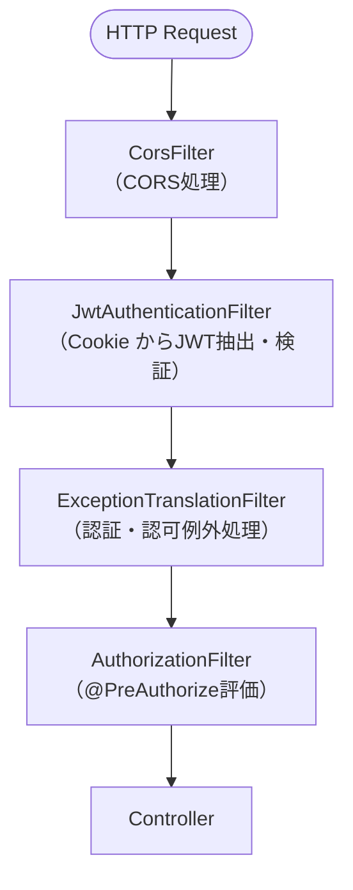
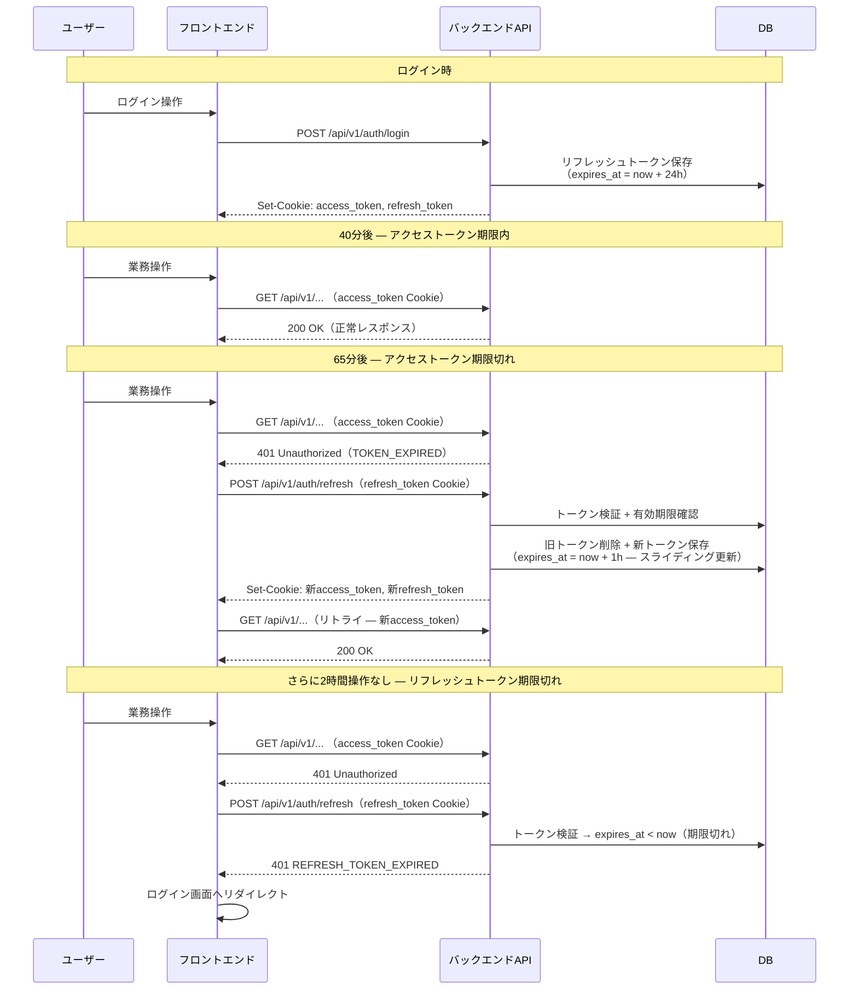
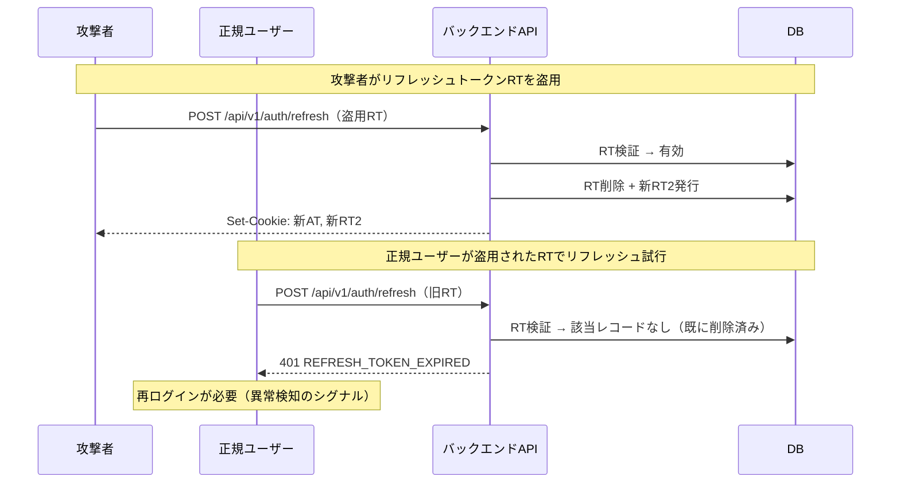
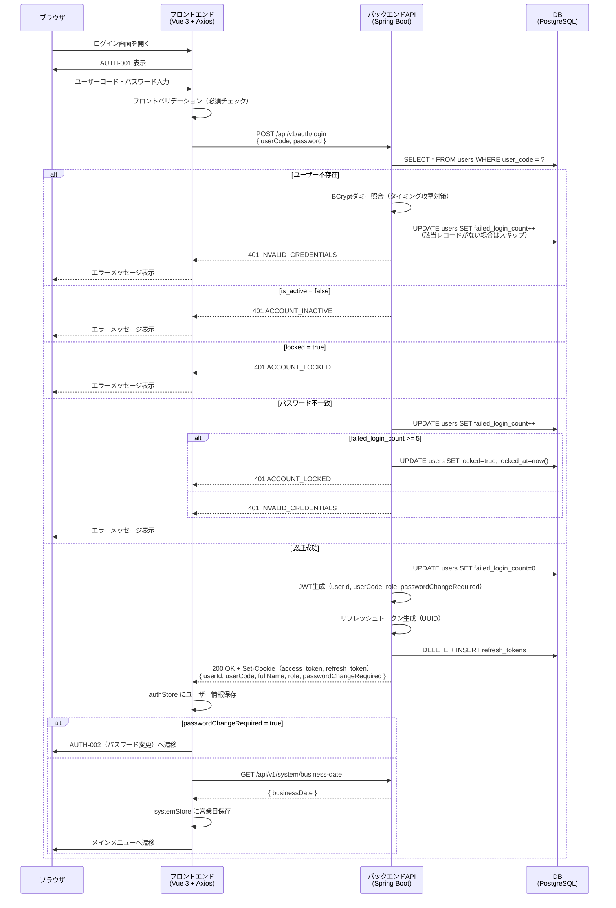
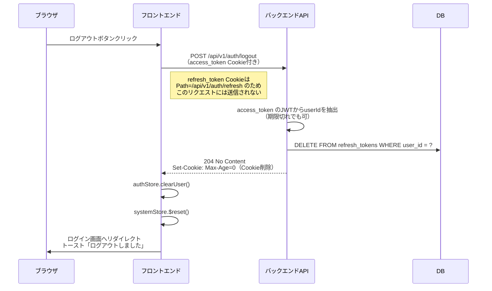
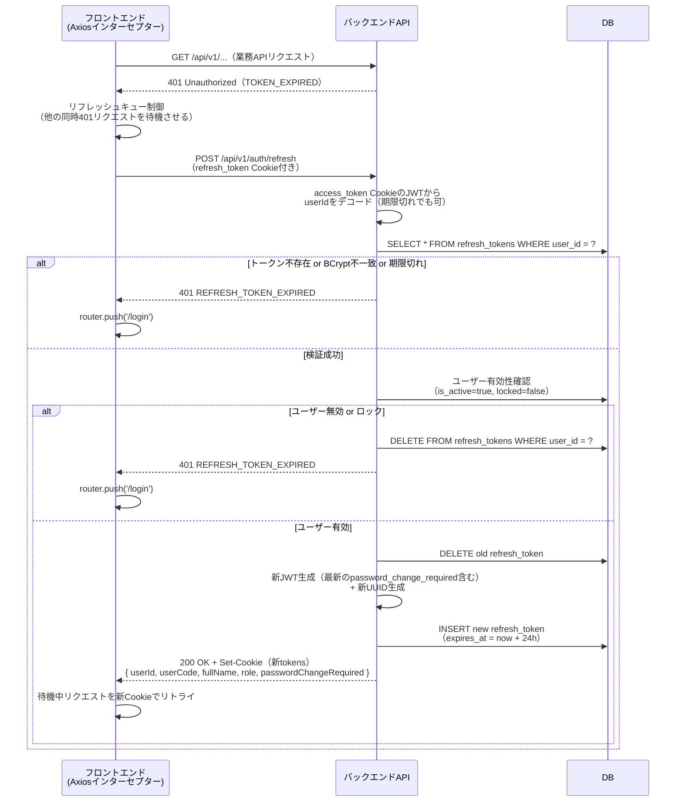
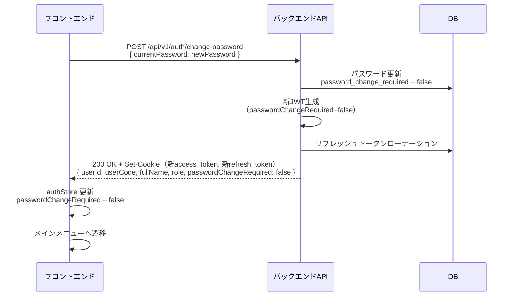
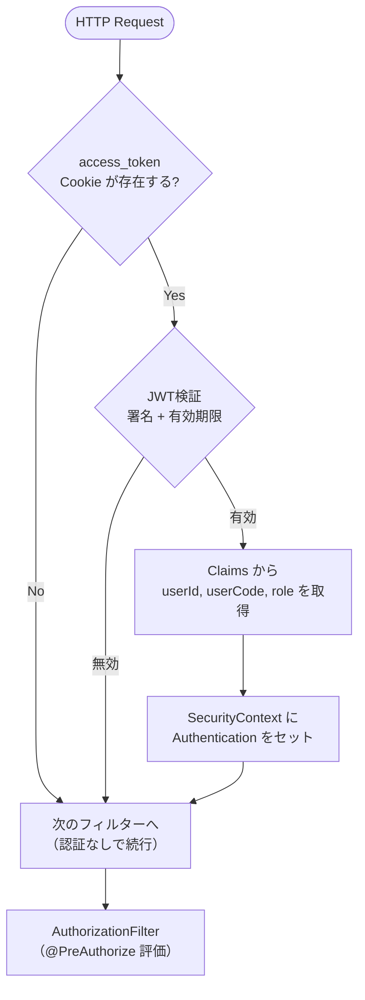
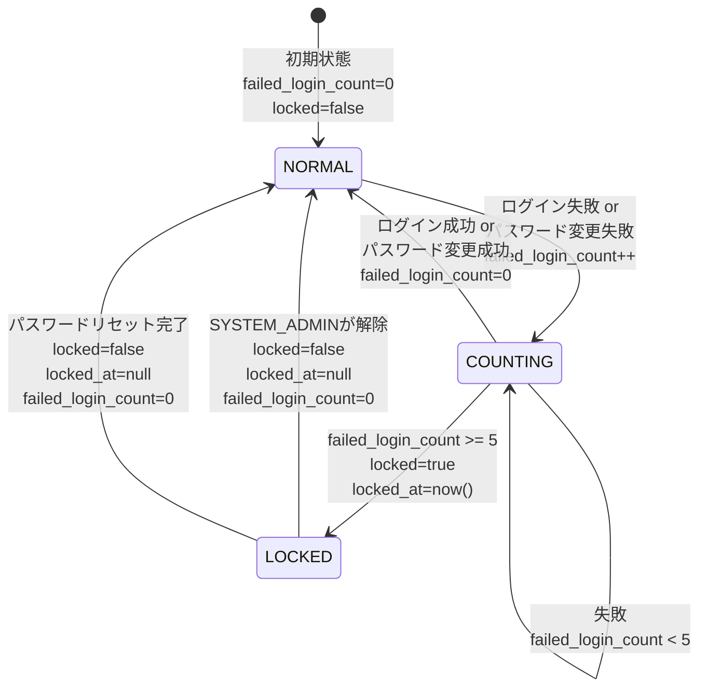

# アーキテクチャ設計書 — 認証アーキテクチャ

> **関連ドキュメント**:
> - [07-auth-architecture.md](../architecture-blueprint/07-auth-architecture.md)（認証・認可ブループリント）
> - [10-security-architecture.md](../architecture-blueprint/10-security-architecture.md)（セキュリティアーキテクチャ）
> - [04-backend-architecture.md](../architecture-blueprint/04-backend-architecture.md)（バックエンドアーキテクチャ）
> - [API-01-auth.md](../functional-design/API-01-auth.md)（認証API設計）
> - [SCR-01-auth.md](../functional-design/SCR-01-auth.md)（認証画面設計）
> - [02-master-tables.md](../data-model/02-master-tables.md)（マスタ系テーブル定義）

---

## 1. 概要

本ドキュメントは、WMS（倉庫管理システム）の認証・認可アーキテクチャの詳細設計を定義する。ブループリント（`architecture-blueprint/07-auth-architecture.md`）で策定された方針に基づき、Spring Security 6.x + JWT + httpOnly Cookie による実装設計を記述する。

### 1.1 設計方針

| 項目 | 方針 |
|------|------|
| **認証方式** | JWT（JSON Web Token）+ httpOnly Cookie |
| **認可方式** | RBAC（ロールベースアクセス制御） |
| **セッション管理** | ステートレス（サーバー側セッション不使用） |
| **CSRF対策** | SameSite=Lax + `X-Requested-With` カスタムヘッダー検証（二重防御。詳細は [10-security-architecture.md §3](10-security-architecture.md#3-csrf対策設計)） |
| **XSS対策** | httpOnly Cookie（JavaScriptからトークンにアクセス不可） |
| **フレームワーク** | Spring Security 6.x |
| **JWTライブラリ** | jjwt（io.jsonwebtoken） |

---

## 2. Spring Security 構成設計（SecurityFilterChain）

### 2.1 フィルターチェーン全体像

Spring Security 6.x の `SecurityFilterChain` Bean を使用して、認証・認可の処理フローを定義する。



### 2.2 SecurityFilterChain 設定

```java
package com.wms.shared.config;

import com.wms.shared.security.JwtAuthenticationFilter;
import com.wms.shared.security.JwtAuthenticationEntryPoint;
import com.wms.shared.security.CustomAccessDeniedHandler;
import org.springframework.context.annotation.Bean;
import org.springframework.context.annotation.Configuration;
import org.springframework.http.HttpMethod;
import org.springframework.security.config.annotation.method.configuration.EnableMethodSecurity;
import org.springframework.security.config.annotation.web.builders.HttpSecurity;
import org.springframework.security.config.annotation.web.configuration.EnableWebSecurity;
import org.springframework.security.config.http.SessionCreationPolicy;
import org.springframework.security.crypto.bcrypt.BCryptPasswordEncoder;
import org.springframework.security.crypto.password.PasswordEncoder;
import org.springframework.security.web.SecurityFilterChain;
import org.springframework.security.web.authentication.UsernamePasswordAuthenticationFilter;

@Configuration
@EnableWebSecurity
@EnableMethodSecurity  // @PreAuthorize を有効化
public class SecurityConfig {

    private final JwtAuthenticationFilter jwtAuthenticationFilter;
    private final JwtAuthenticationEntryPoint jwtAuthenticationEntryPoint;
    private final CustomAccessDeniedHandler customAccessDeniedHandler;

    public SecurityConfig(
            JwtAuthenticationFilter jwtAuthenticationFilter,
            JwtAuthenticationEntryPoint jwtAuthenticationEntryPoint,
            CustomAccessDeniedHandler customAccessDeniedHandler) {
        this.jwtAuthenticationFilter = jwtAuthenticationFilter;
        this.jwtAuthenticationEntryPoint = jwtAuthenticationEntryPoint;
        this.customAccessDeniedHandler = customAccessDeniedHandler;
    }

    @Bean
    public SecurityFilterChain securityFilterChain(HttpSecurity http) throws Exception {
        http
            // ステートレス設計: サーバー側セッション無効化
            .sessionManagement(session ->
                session.sessionCreationPolicy(SessionCreationPolicy.STATELESS))

            // CSRF無効化: SameSite=Lax Cookie によりCSRF対策済み
            .csrf(csrf -> csrf.disable())

            // CORS設定: CorsConfig から取得
            .cors(cors -> cors.configurationSource(corsConfigurationSource()))

            // セキュリティヘッダー
            .headers(headers -> headers
                .frameOptions(frame -> frame.deny())
                .contentTypeOptions(content -> {})  // X-Content-Type-Options: nosniff
                .httpStrictTransportSecurity(hsts ->
                    hsts.includeSubDomains(true).maxAgeInSeconds(31536000))
                .referrerPolicy(referrer ->
                    referrer.policy(ReferrerPolicy.STRICT_ORIGIN_WHEN_CROSS_ORIGIN)))

            // 認証不要エンドポイントの定義
            .authorizeHttpRequests(authz -> authz
                // 認証不要: ログイン・ログアウト・トークンリフレッシュ・パスワードリセット
                .requestMatchers(HttpMethod.POST, "/api/v1/auth/login").permitAll()
                .requestMatchers(HttpMethod.POST, "/api/v1/auth/logout").permitAll()
                .requestMatchers(HttpMethod.POST, "/api/v1/auth/refresh").permitAll()
                .requestMatchers(HttpMethod.POST, "/api/v1/auth/password-reset/request").permitAll()
                .requestMatchers(HttpMethod.POST, "/api/v1/auth/password-reset/confirm").permitAll()
                // OpenAPI（開発環境のみ。本番ではプロファイルで無効化）
                .requestMatchers("/swagger-ui/**", "/v3/api-docs/**").permitAll()
                // ヘルスチェック（Container Apps からのプローブ）
                .requestMatchers("/actuator/health").permitAll()
                // その他は全て認証必須
                .anyRequest().authenticated())

            // 認証・認可エラーハンドリング
            .exceptionHandling(exception -> exception
                .authenticationEntryPoint(jwtAuthenticationEntryPoint)
                .accessDeniedHandler(customAccessDeniedHandler))

            // JWTフィルター追加
            .addFilterBefore(jwtAuthenticationFilter,
                UsernamePasswordAuthenticationFilter.class);

        return http.build();
    }

    @Bean
    public PasswordEncoder passwordEncoder() {
        return new BCryptPasswordEncoder(12);  // strength=12
    }
}
```

### 2.3 認証不要エンドポイント一覧

| エンドポイント | メソッド | 理由 |
|--------------|---------|------|
| `/api/v1/auth/login` | POST | ログイン処理（未認証状態で呼び出し） |
| `/api/v1/auth/logout` | POST | ログアウト処理（期限切れJWTでもログアウト可能にするため permitAll。Controller内でJWT署名検証のみ行いuserIdを取得する） |
| `/api/v1/auth/refresh` | POST | トークンリフレッシュ（access_token 期限切れ時に呼び出し） |
| `/api/v1/auth/password-reset/request` | POST | パスワードリセット申請（未認証状態で呼び出し） |
| `/api/v1/auth/password-reset/confirm` | POST | パスワード再設定（リセットトークンで認証） |
| `/swagger-ui/**` | ALL | OpenAPIドキュメント（開発環境のみ） |
| `/v3/api-docs/**` | ALL | OpenAPIスキーマ（開発環境のみ） |
| `/actuator/health` | GET | Container Apps ヘルスチェック用 |

---

## 3. JWT設計

### 3.1 トークン構造

JWTは Header / Payload / Signature の3パートで構成される。

#### Header

```json
{
  "alg": "HS256",
  "typ": "JWT"
}
```

#### Payload（Claims）

```json
{
  "sub": "1",
  "userCode": "admin001",
  "role": "SYSTEM_ADMIN",
  "passwordChangeRequired": false,
  "iat": 1710720000,
  "exp": 1710723600
}
```

| Claim | 型 | 説明 |
|-------|-----|------|
| `sub` | String | ユーザーID（`users.id`）。数値を文字列化 |
| `userCode` | String | ユーザーコード（`users.user_code`） |
| `role` | String | ロール（`SYSTEM_ADMIN` / `WAREHOUSE_MANAGER` / `WAREHOUSE_STAFF` / `VIEWER`） |
| `passwordChangeRequired` | Boolean | パスワード変更要否（`users.password_change_required`）。`true` の場合、フロントエンドはパスワード変更画面へ強制遷移する |
| `iat` | Long | 発行日時（Unix timestamp） |
| `exp` | Long | 有効期限（Unix timestamp）。`iat` + 3600秒（1時間） |

> **設計判断**: ペイロードにはアクセス制御に必要な最小限の情報のみ含める。氏名・メールアドレス等のPIIは含めない。`passwordChangeRequired` はフロントエンドでのルーティング制御（パスワード変更画面への強制遷移）に使用するため、JWTに含める。

### 3.2 署名アルゴリズム

| 項目 | 内容 |
|------|------|
| **アルゴリズム** | HS256（HMAC-SHA256） |
| **鍵** | 256bit以上のランダム文字列 |
| **鍵の保管** | 環境変数 `JWT_SECRET` |
| **鍵のローテーション** | 運用時に環境変数を更新し、Container Apps を再デプロイ |

> **HS256を選択した理由**: 本システムは単一のバックエンドサービスがトークンの発行と検証の両方を行うため、共有鍵方式（HS256）で十分である。マイクロサービス構成（複数サービスでの検証）が必要になった場合は RS256（公開鍵方式）への移行を検討する。

### 3.3 JwtTokenProvider 実装

```java
package com.wms.shared.security;

import io.jsonwebtoken.Claims;
import io.jsonwebtoken.ExpiredJwtException;
import io.jsonwebtoken.Jwts;
import io.jsonwebtoken.security.Keys;
import org.springframework.beans.factory.annotation.Value;
import org.springframework.stereotype.Component;

import javax.crypto.SecretKey;
import java.nio.charset.StandardCharsets;
import java.util.Date;

@Component
public class JwtTokenProvider {

    private final SecretKey secretKey;
    private final long accessTokenExpiration;

    public JwtTokenProvider(
            @Value("${jwt.secret-key}") String secret,
            @Value("${jwt.access-token-expiration:3600000}") long accessTokenExpiration) {
        this.secretKey = Keys.hmacShaKeyFor(secret.getBytes(StandardCharsets.UTF_8));
        this.accessTokenExpiration = accessTokenExpiration;
    }

    /**
     * アクセストークン（JWT）を生成する。
     *
     * @param userId                  ユーザーID
     * @param userCode                ユーザーコード
     * @param role                    ロール
     * @param passwordChangeRequired  パスワード変更要否（users.password_change_required）
     */
    public String generateAccessToken(
            Long userId, String userCode, String role, boolean passwordChangeRequired) {
        Date now = new Date();
        Date expiryDate = new Date(now.getTime() + accessTokenExpiration);

        return Jwts.builder()
                .subject(String.valueOf(userId))
                .claim("userCode", userCode)
                .claim("role", role)
                .claim("passwordChangeRequired", passwordChangeRequired)
                .issuedAt(now)
                .expiration(expiryDate)
                .signWith(secretKey)
                .compact();
    }

    /**
     * JWTからClaimsを取得する。有効期限切れの場合は例外をスローする。
     */
    public Claims parseClaims(String token) {
        return Jwts.parser()
                .verifyWith(secretKey)
                .build()
                .parseSignedClaims(token)
                .getPayload();
    }

    /**
     * JWTからClaimsを取得する。有効期限切れでもClaimsを返す（ログアウト処理用）。
     */
    public Claims parseClaimsAllowExpired(String token) {
        try {
            return parseClaims(token);
        } catch (ExpiredJwtException e) {
            return e.getClaims();
        }
    }

    /**
     * トークンの有効性を検証する。
     */
    public boolean validateToken(String token) {
        try {
            parseClaims(token);
            return true;
        } catch (Exception e) {
            return false;
        }
    }

    public Long getUserId(Claims claims) {
        return Long.parseLong(claims.getSubject());
    }

    public String getUserCode(Claims claims) {
        return claims.get("userCode", String.class);
    }

    public String getRole(Claims claims) {
        return claims.get("role", String.class);
    }

    public boolean getPasswordChangeRequired(Claims claims) {
        Boolean value = claims.get("passwordChangeRequired", Boolean.class);
        return value != null && value;
    }
}
```

### 3.4 application.yml 設定

```yaml
jwt:
  secret-key: ${JWT_SECRET}                     # 環境変数から取得（256bit以上）
  access-token-expiration: 3600000             # 1時間（ミリ秒）
  refresh-token-expiration: 86400000           # 24時間（ミリ秒）= スライディング方式
```

---

## 4. httpOnly Cookie 設計

### 4.1 Cookie 仕様

| Cookie名 | 用途 | 属性 |
|----------|------|------|
| `access_token` | JWTアクセストークン | `HttpOnly; SameSite=Lax; Secure; Path=/; Max-Age=3600` |
| `refresh_token` | リフレッシュトークン（UUID） | `HttpOnly; SameSite=Lax; Secure; Path=/api/v1/auth/refresh; Max-Age=86400` |

### 4.2 Cookie 属性の設計根拠

| 属性 | 設定値 | 根拠 |
|------|--------|------|
| `HttpOnly` | `true` | JavaScript からの Cookie アクセスを禁止し、XSS によるトークン窃取を防止する |
| `SameSite` | `Lax` | クロスサイトリクエストでの Cookie 送信を制限し CSRF を防止する。`Lax` はトップレベルナビゲーション（GET）では Cookie を送信するため、ブックマークやメールリンクからのアクセスで再ログインが不要 |
| `Secure` | `true` | HTTPS 通信時のみ Cookie を送信する。Azure Container Apps で HTTPS を強制しているため常に有効 |
| `Path` | `access_token`: `/`、`refresh_token`: `/api/v1/auth/refresh` | `refresh_token` の Path を限定することで、通常の API リクエスト時にリフレッシュトークンが不要に送信されることを防ぐ |
| `Max-Age` | `access_token`: `3600`（1時間）、`refresh_token`: `86400`（24時間） | ブラウザが Cookie を保持する最大期間。トークンの有効期限に合わせて設定 |

> **`Domain` 属性を設定しない理由**: Cookie の `Domain` を省略すると、Cookie を発行したホスト（バックエンド API）のみに送信される。フロントエンド（Blob Storage）とバックエンド（Container Apps）は異なるホストのため、`withCredentials: true` による CORS Cookie 送信を利用する。

### 4.3 CookieUtil 実装

```java
package com.wms.shared.security;

import jakarta.servlet.http.Cookie;
import jakarta.servlet.http.HttpServletResponse;
import org.springframework.beans.factory.annotation.Value;
import org.springframework.http.ResponseCookie;
import org.springframework.stereotype.Component;

@Component
public class CookieUtil {

    @Value("${jwt.access-token-expiration:3600000}")
    private long accessTokenExpiration;

    @Value("${jwt.refresh-token-expiration:86400000}")
    private long refreshTokenExpiration;

    @Value("${app.cookie.secure:true}")
    private boolean secureCookie;

    private static final String ACCESS_TOKEN_COOKIE = "access_token";
    private static final String REFRESH_TOKEN_COOKIE = "refresh_token";
    private static final String REFRESH_TOKEN_PATH = "/api/v1/auth/refresh";

    /**
     * アクセストークンをCookieにセットする。
     */
    public void addAccessTokenCookie(HttpServletResponse response, String token) {
        ResponseCookie cookie = ResponseCookie.from(ACCESS_TOKEN_COOKIE, token)
                .httpOnly(true)
                .secure(secureCookie)
                .sameSite("Lax")
                .path("/")
                .maxAge(accessTokenExpiration / 1000)
                .build();
        response.addHeader("Set-Cookie", cookie.toString());
    }

    /**
     * リフレッシュトークンをCookieにセットする。
     */
    public void addRefreshTokenCookie(HttpServletResponse response, String token) {
        ResponseCookie cookie = ResponseCookie.from(REFRESH_TOKEN_COOKIE, token)
                .httpOnly(true)
                .secure(secureCookie)
                .sameSite("Lax")
                .path(REFRESH_TOKEN_PATH)
                .maxAge(refreshTokenExpiration / 1000)
                .build();
        response.addHeader("Set-Cookie", cookie.toString());
    }

    /**
     * 全認証Cookieを削除する（ログアウト時）。
     */
    public void clearAuthCookies(HttpServletResponse response) {
        ResponseCookie accessCookie = ResponseCookie.from(ACCESS_TOKEN_COOKIE, "")
                .httpOnly(true)
                .secure(secureCookie)
                .sameSite("Lax")
                .path("/")
                .maxAge(0)
                .build();
        ResponseCookie refreshCookie = ResponseCookie.from(REFRESH_TOKEN_COOKIE, "")
                .httpOnly(true)
                .secure(secureCookie)
                .sameSite("Lax")
                .path(REFRESH_TOKEN_PATH)
                .maxAge(0)
                .build();
        response.addHeader("Set-Cookie", accessCookie.toString());
        response.addHeader("Set-Cookie", refreshCookie.toString());
    }

    /**
     * HttpServletRequest のCookieからアクセストークンを抽出する。
     */
    public String extractAccessToken(Cookie[] cookies) {
        return extractCookieValue(cookies, ACCESS_TOKEN_COOKIE);
    }

    /**
     * HttpServletRequest のCookieからリフレッシュトークンを抽出する。
     */
    public String extractRefreshToken(Cookie[] cookies) {
        return extractCookieValue(cookies, REFRESH_TOKEN_COOKIE);
    }

    private String extractCookieValue(Cookie[] cookies, String name) {
        if (cookies == null) return null;
        for (Cookie cookie : cookies) {
            if (name.equals(cookie.getName())) {
                return cookie.getValue();
            }
        }
        return null;
    }
}
```

---

## 5. リフレッシュトークン設計

### 5.1 リフレッシュトークン方式

| 項目 | 内容 |
|------|------|
| **形式** | UUID v4（SecureRandom 生成） |
| **保管場所（サーバー）** | `refresh_tokens` テーブルに BCrypt ハッシュ化して保存 |
| **保管場所（クライアント）** | httpOnly Cookie（`refresh_token`） |
| **有効期限** | スライディング方式: リフレッシュ成功時に「現在日時 + 24時間」に更新 |
| **ローテーション** | リフレッシュ時に旧トークンを削除し、新トークンを発行（リプレイ攻撃対策） |

### 5.2 スライディング方式の動作



### 5.3 トークンローテーションによる盗用検知

トークンローテーションにより、リフレッシュトークンの盗用を検知・被害軽減する。



> **補足**: トークンローテーションにより、盗用されたトークンが使われた場合に正規ユーザーのトークンが無効化される。正規ユーザーが再ログインを求められることで、トークン盗用の可能性に気づくことができる。

### 5.4 RefreshTokenService 実装

```java
package com.wms.shared.security;

import com.wms.shared.security.entity.RefreshToken;
import com.wms.shared.security.repository.RefreshTokenRepository;
import org.springframework.security.crypto.password.PasswordEncoder;
import org.springframework.stereotype.Service;
import org.springframework.transaction.annotation.Transactional;

import java.time.Instant;
import java.util.Optional;
import java.util.UUID;

@Service
public class RefreshTokenService {

    private final RefreshTokenRepository refreshTokenRepository;
    private final PasswordEncoder passwordEncoder;
    private final long refreshTokenExpiration;  // ミリ秒

    public RefreshTokenService(
            RefreshTokenRepository refreshTokenRepository,
            PasswordEncoder passwordEncoder,
            @org.springframework.beans.factory.annotation.Value(
                "${jwt.refresh-token-expiration:86400000}") long refreshTokenExpiration) {
        this.refreshTokenRepository = refreshTokenRepository;
        this.passwordEncoder = passwordEncoder;
        this.refreshTokenExpiration = refreshTokenExpiration;
    }

    /**
     * 新しいリフレッシュトークンを発行する。
     * 同一ユーザーの既存トークンは削除する。
     *
     * @return 平文のリフレッシュトークン（Cookie にセットする値）
     */
    @Transactional
    public String issueRefreshToken(Long userId) {
        // 既存トークンを削除
        refreshTokenRepository.deleteByUserId(userId);

        // 新しいトークンを生成
        String rawToken = UUID.randomUUID().toString();
        String tokenHash = passwordEncoder.encode(rawToken);

        RefreshToken entity = new RefreshToken();
        entity.setUserId(userId);
        entity.setTokenHash(tokenHash);
        entity.setExpiresAt(Instant.now().plusMillis(refreshTokenExpiration));

        refreshTokenRepository.save(entity);

        return rawToken;
    }

    /**
     * リフレッシュトークンを検証する。
     * user_id で絞り込んだ後、BCrypt.matches で照合する。
     *
     * @return 検証に成功した場合は RefreshToken エンティティ、失敗時は empty
     */
    @Transactional(readOnly = true)
    public Optional<RefreshToken> validateRefreshToken(Long userId, String rawToken) {
        return refreshTokenRepository.findByUserId(userId)
                .filter(rt -> passwordEncoder.matches(rawToken, rt.getTokenHash()))
                .filter(rt -> rt.getExpiresAt().isAfter(Instant.now()));
    }

    /**
     * 指定ユーザーの全リフレッシュトークンを削除する（ログアウト時）。
     */
    @Transactional
    public void revokeAllTokens(Long userId) {
        refreshTokenRepository.deleteByUserId(userId);
    }
}
```

---

## 6. 認証フロー詳細設計

### 6.1 ログインフロー



### 6.2 ログアウトフロー

> **設計判断**: ログアウトAPIへのリクエスト時、`refresh_token` CookieはPathが `/api/v1/auth/refresh` に限定されているため、`POST /api/v1/auth/logout` には自動送信されない。ログアウトAPI側では `access_token` Cookie のJWTからユーザーを特定し、サーバー側でリフレッシュトークンを無効化する。
>
> **期限切れJWTでのログアウト**: ログアウトAPIは `permitAll()` で認証不要に設定している。これにより、アクセストークンが期限切れの状態でもログアウト操作が可能となる。Controller内では `JwtTokenProvider.parseClaimsAllowExpired()` を使用してJWT署名検証のみ行い、userIdを取得する。署名検証に失敗した場合（改ざんされたトークン等）は、Cookieの削除のみ行い正常終了する。



### 6.3 トークンリフレッシュフロー



### 6.4 フロントエンド Axios インターセプター設計

```typescript
// src/api/client.ts
import axios, { AxiosError, InternalAxiosRequestConfig } from 'axios'
import router from '@/router'
import { useAuthStore } from '@/stores/auth'

const apiClient = axios.create({
  baseURL: import.meta.env.VITE_API_BASE_URL,
  withCredentials: true, // httpOnly Cookie を自動送信
})

// リフレッシュ制御用の状態
let isRefreshing = false
let failedQueue: Array<{
  resolve: (value?: unknown) => void
  reject: (reason?: unknown) => void
  config: InternalAxiosRequestConfig
}> = []

// キューに溜まったリクエストを処理
function processQueue(error: AxiosError | null) {
  failedQueue.forEach(({ resolve, reject, config }) => {
    if (error) {
      reject(error)
    } else {
      resolve(apiClient(config))
    }
  })
  failedQueue = []
}

// レスポンスインターセプター
apiClient.interceptors.response.use(
  (response) => response,
  async (error: AxiosError) => {
    const originalRequest = error.config as InternalAxiosRequestConfig & {
      _retry?: boolean
    }

    // 401 かつ未リトライの場合
    if (error.response?.status === 401 && !originalRequest._retry) {
      // リフレッシュエンドポイント自体の401はログイン画面へ
      if (originalRequest.url?.includes('/auth/refresh')) {
        const authStore = useAuthStore()
        authStore.clearUser()
        router.push('/login')
        return Promise.reject(error)
      }

      // 既にリフレッシュ中の場合はキューに追加
      if (isRefreshing) {
        return new Promise((resolve, reject) => {
          failedQueue.push({ resolve, reject, config: originalRequest })
        })
      }

      originalRequest._retry = true
      isRefreshing = true

      try {
        await apiClient.post('/api/v1/auth/refresh')
        processQueue(null)
        return apiClient(originalRequest)
      } catch (refreshError) {
        processQueue(refreshError as AxiosError)
        const authStore = useAuthStore()
        authStore.clearUser()
        router.push('/login')
        return Promise.reject(refreshError)
      } finally {
        isRefreshing = false
      }
    }

    // 403: 権限不足
    if (error.response?.status === 403) {
      ElMessage.error('権限がありません')
      return Promise.reject(error)
    }

    // 500: サーバーエラー
    if (error.response?.status === 500) {
      ElMessage.error('システムエラーが発生しました')
      return Promise.reject(error)
    }

    // 400, 409, 422: 各Composableの try/catch で処理
    return Promise.reject(error)
  }
)

export default apiClient
```

### 6.5 パスワード変更後のトークン再発行

パスワード変更API（`POST /api/v1/auth/change-password`）成功後、`passwordChangeRequired=false` を反映した新しいJWTを発行する。



**設計ポイント**:

| 項目 | 内容 |
|------|------|
| **トークン再発行のタイミング** | パスワード変更API成功後、レスポンスの `Set-Cookie` で新しいJWT（`passwordChangeRequired=false`）を返す |
| **リフレッシュトークン** | パスワード変更成功時もリフレッシュトークンをローテーション（セキュリティ強化） |
| **トークンリフレッシュ時の動作** | `POST /api/v1/auth/refresh` 時、DBから最新の `users.password_change_required` を取得し、新JWTの `passwordChangeRequired` クレームに反映する。これにより、管理者がユーザーの `password_change_required` を `true` に変更した場合、次回リフレッシュ時に即座に反映される |

---

## 7. JwtAuthenticationFilter 設計

### 7.1 フィルター処理フロー



### 7.2 JwtAuthenticationFilter 実装

```java
package com.wms.shared.security;

import io.jsonwebtoken.Claims;
import jakarta.servlet.FilterChain;
import jakarta.servlet.ServletException;
import jakarta.servlet.http.HttpServletRequest;
import jakarta.servlet.http.HttpServletResponse;
import org.springframework.security.authentication.UsernamePasswordAuthenticationToken;
import org.springframework.security.core.authority.SimpleGrantedAuthority;
import org.springframework.security.core.context.SecurityContextHolder;
import org.springframework.stereotype.Component;
import org.springframework.web.filter.OncePerRequestFilter;

import java.io.IOException;
import java.util.List;

@Component
public class JwtAuthenticationFilter extends OncePerRequestFilter {

    private final JwtTokenProvider jwtTokenProvider;
    private final CookieUtil cookieUtil;

    public JwtAuthenticationFilter(JwtTokenProvider jwtTokenProvider, CookieUtil cookieUtil) {
        this.jwtTokenProvider = jwtTokenProvider;
        this.cookieUtil = cookieUtil;
    }

    @Override
    protected void doFilterInternal(
            HttpServletRequest request,
            HttpServletResponse response,
            FilterChain filterChain) throws ServletException, IOException {

        String token = cookieUtil.extractAccessToken(request.getCookies());

        if (token != null && jwtTokenProvider.validateToken(token)) {
            Claims claims = jwtTokenProvider.parseClaims(token);
            Long userId = jwtTokenProvider.getUserId(claims);
            String userCode = jwtTokenProvider.getUserCode(claims);
            String role = jwtTokenProvider.getRole(claims);

            // Spring Security の GrantedAuthority は "ROLE_" プレフィックスが必要
            List<SimpleGrantedAuthority> authorities =
                    List.of(new SimpleGrantedAuthority("ROLE_" + role));

            // カスタム Principal に userId, userCode を保持
            AuthenticatedUser principal = new AuthenticatedUser(userId, userCode, role);

            UsernamePasswordAuthenticationToken authentication =
                    new UsernamePasswordAuthenticationToken(principal, null, authorities);
            SecurityContextHolder.getContext().setAuthentication(authentication);
        }

        filterChain.doFilter(request, response);
    }

    @Override
    protected boolean shouldNotFilter(HttpServletRequest request) {
        // 認証不要エンドポイントはフィルターをスキップ（パフォーマンス最適化）
        String path = request.getRequestURI();
        return path.equals("/api/v1/auth/login")
                || path.equals("/api/v1/auth/logout")
                || path.equals("/api/v1/auth/refresh")
                || path.startsWith("/api/v1/auth/password-reset/")
                || path.startsWith("/swagger-ui/")
                || path.startsWith("/v3/api-docs")
                || path.equals("/actuator/health");
    }
}
```

### 7.3 AuthenticatedUser（カスタム Principal）

```java
package com.wms.shared.security;

import java.security.Principal;

/**
 * JWT から抽出したユーザー情報を保持するカスタム Principal。
 * Controller で SecurityContextHolder から取得して使用する。
 */
public record AuthenticatedUser(
        Long userId,
        String userCode,
        String role
) implements Principal {

    @Override
    public String getName() {
        return userCode;
    }
}
```

### 7.4 Controller でのユーザー情報取得

```java
// Controller での使用例
@GetMapping("/api/v1/some-resource")
public ResponseEntity<?> getResource(
        @AuthenticationPrincipal AuthenticatedUser user) {
    Long userId = user.userId();
    String role = user.role();
    // ...
}
```

### 7.5 JwtAuthenticationEntryPoint（未認証エラーレスポンス）

```java
package com.wms.shared.security;

import com.fasterxml.jackson.databind.ObjectMapper;
import jakarta.servlet.http.HttpServletRequest;
import jakarta.servlet.http.HttpServletResponse;
import org.springframework.http.MediaType;
import org.springframework.security.core.AuthenticationException;
import org.springframework.security.web.AuthenticationEntryPoint;
import org.springframework.stereotype.Component;

import java.io.IOException;
import java.util.Map;

@Component
public class JwtAuthenticationEntryPoint implements AuthenticationEntryPoint {

    private final ObjectMapper objectMapper;

    public JwtAuthenticationEntryPoint(ObjectMapper objectMapper) {
        this.objectMapper = objectMapper;
    }

    @Override
    public void commence(
            HttpServletRequest request,
            HttpServletResponse response,
            AuthenticationException authException) throws IOException {

        response.setStatus(HttpServletResponse.SC_UNAUTHORIZED);
        response.setContentType(MediaType.APPLICATION_JSON_VALUE);

        Map<String, Object> body = Map.of(
                "status", 401,
                "code", "UNAUTHORIZED",
                "message", "Authentication is required to access this resource."
        );

        objectMapper.writeValue(response.getOutputStream(), body);
    }
}
```

---

## 8. 認可設計（ロールベースアクセス制御）

### 8.1 ロール定義

ロール定義の詳細は [07-auth-architecture.md](../architecture-blueprint/07-auth-architecture.md) の認可方式（RBAC）を参照。

| ロール | Spring Security Authority | 権限レベル |
|-------|--------------------------|-----------|
| `SYSTEM_ADMIN` | `ROLE_SYSTEM_ADMIN` | 全機能アクセス可 |
| `WAREHOUSE_MANAGER` | `ROLE_WAREHOUSE_MANAGER` | ユーザー管理以外の全機能 |
| `WAREHOUSE_STAFF` | `ROLE_WAREHOUSE_STAFF` | 入荷・在庫・出荷の実作業 + 参照 |
| `VIEWER` | `ROLE_VIEWER` | 全機能参照のみ |

### 8.2 アノテーションベース認可

Spring Security の `@PreAuthorize` アノテーションを使用し、各 Controller メソッドに権限制御を適用する。

```java
// ユーザー管理: SYSTEM_ADMIN のみ
@PreAuthorize("hasRole('SYSTEM_ADMIN')")
@PostMapping("/api/v1/master/users")
public ResponseEntity<UserResponse> createUser(...) { ... }

// マスタ更新: SYSTEM_ADMIN + WAREHOUSE_MANAGER
@PreAuthorize("hasAnyRole('SYSTEM_ADMIN', 'WAREHOUSE_MANAGER')")
@PutMapping("/api/v1/master/warehouses/{id}")
public ResponseEntity<WarehouseResponse> updateWarehouse(...) { ... }

// マスタ参照: 全ロール（認証済みであれば可）
@GetMapping("/api/v1/master/warehouses")
public ResponseEntity<PagedResponse<WarehouseResponse>> listWarehouses(...) { ... }

// バッチ実行: SYSTEM_ADMIN + WAREHOUSE_MANAGER
@PreAuthorize("hasAnyRole('SYSTEM_ADMIN', 'WAREHOUSE_MANAGER')")
@PostMapping("/api/v1/batch/daily-close")
public ResponseEntity<Void> runDailyClose() { ... }
```

### 8.3 機能別アクセス権限マトリクス（実装方針）

権限マトリクスの詳細は [07-auth-architecture.md](../architecture-blueprint/07-auth-architecture.md) を参照。

実装方針:
- **参照のみ**制限は、更新系エンドポイント（POST/PUT/PATCH/DELETE）に `@PreAuthorize` を付与し、GET エンドポイントには制限を設けない（認証済みであれば全ロールが参照可能）
- **VIEWER** ロールの場合、フロントエンド側でも編集ボタン・操作ボタンを非表示にし、UX上も参照のみに制限する

### 8.4 認可エラーレスポンス

権限不足の場合、Spring Security が自動的に 403 Forbidden を返す。カスタムハンドラーで統一レスポンス形式を返す。

```java
package com.wms.shared.security;

import com.fasterxml.jackson.databind.ObjectMapper;
import jakarta.servlet.http.HttpServletRequest;
import jakarta.servlet.http.HttpServletResponse;
import org.springframework.http.MediaType;
import org.springframework.security.access.AccessDeniedException;
import org.springframework.security.web.access.AccessDeniedHandler;
import org.springframework.stereotype.Component;

import java.io.IOException;
import java.util.Map;

@Component
public class CustomAccessDeniedHandler implements AccessDeniedHandler {

    private final ObjectMapper objectMapper;

    public CustomAccessDeniedHandler(ObjectMapper objectMapper) {
        this.objectMapper = objectMapper;
    }

    @Override
    public void handle(
            HttpServletRequest request,
            HttpServletResponse response,
            AccessDeniedException accessDeniedException) throws IOException {

        response.setStatus(HttpServletResponse.SC_FORBIDDEN);
        response.setContentType(MediaType.APPLICATION_JSON_VALUE);

        Map<String, Object> body = Map.of(
                "status", 403,
                "code", "FORBIDDEN",
                "message", "You do not have permission to access this resource."
        );

        objectMapper.writeValue(response.getOutputStream(), body);
    }
}
```

> **注意**: `SecurityConfig` の `.exceptionHandling()` に `accessDeniedHandler(customAccessDeniedHandler)` を設定済み（セクション 2.2 参照）。

---

## 9. アカウントロック設計

### 9.1 ロックポリシー

ロックポリシーの詳細は [10-security-architecture.md](../architecture-blueprint/10-security-architecture.md) のログイン失敗ロックを参照。

| 項目 | 内容 |
|------|------|
| **ロック条件** | `failed_login_count` >= 5（`system_parameters.LOGIN_FAILURE_LOCK_COUNT`） |
| **対象操作** | ログイン（`/api/v1/auth/login`）、パスワード変更（`/api/v1/auth/change-password`） |
| **ロック解除** | SYSTEM_ADMIN による手動解除（ユーザー管理画面）、またはパスワードリセット完了時 |
| **カウンタリセット** | ログイン成功時、パスワード変更成功時、パスワードリセット完了時 |

### 9.2 ロック処理フロー



### 9.3 AccountLockService 実装

```java
package com.wms.shared.security;

import com.wms.master.entity.User;
import com.wms.master.repository.UserRepository;
import com.wms.shared.service.SystemParameterService;
import org.springframework.stereotype.Service;
import org.springframework.transaction.annotation.Transactional;

import java.time.Instant;

@Service
public class AccountLockService {

    private final UserRepository userRepository;
    private final SystemParameterService systemParameterService;

    public AccountLockService(
            UserRepository userRepository,
            SystemParameterService systemParameterService) {
        this.userRepository = userRepository;
        this.systemParameterService = systemParameterService;
    }

    private int getMaxFailedAttempts() {
        return systemParameterService.getIntValue("LOGIN_FAILURE_LOCK_COUNT");
    }

    /**
     * 認証失敗時に失敗カウンタをインクリメントし、閾値を超えた場合はロックする。
     *
     * @return ロックされた場合は true
     */
    @Transactional
    public boolean handleFailedAttempt(User user) {
        int newCount = user.getFailedLoginCount() + 1;
        user.setFailedLoginCount(newCount);

        if (newCount >= getMaxFailedAttempts()) {
            user.setLocked(true);
            user.setLockedAt(Instant.now());
            userRepository.save(user);
            return true;
        }

        userRepository.save(user);
        return false;
    }

    /**
     * 認証成功時に失敗カウンタをリセットする。
     */
    @Transactional
    public void resetFailedAttempts(User user) {
        user.setFailedLoginCount(0);
        userRepository.save(user);
    }

    /**
     * アカウントロックを解除する（管理者操作 or パスワードリセット完了時）。
     */
    @Transactional
    public void unlockAccount(User user) {
        user.setLocked(false);
        user.setLockedAt(null);
        user.setFailedLoginCount(0);
        userRepository.save(user);
    }
}
```

---

## 10. パスワード管理設計

### 10.1 パスワードポリシー

パスワードポリシーの詳細は [10-security-architecture.md](../architecture-blueprint/10-security-architecture.md) のパスワード管理を参照。

| 項目 | 内容 |
|------|------|
| **文字数** | 8〜128文字 |
| **文字種** | 英大文字・英小文字・数字を各1文字以上必須 |
| **ハッシュアルゴリズム** | BCrypt（strength=12） |
| **検証場所** | フロントエンド（Zod）+ バックエンド（Jakarta Bean Validation） |

### 10.2 PasswordPolicy アノテーション + PasswordPolicyValidator 実装

```java
package com.wms.shared.security.validation;

import jakarta.validation.Constraint;
import jakarta.validation.ConstraintValidator;
import jakarta.validation.ConstraintValidatorContext;
import jakarta.validation.Payload;

import java.lang.annotation.*;

/**
 * パスワードポリシーのカスタムバリデーションアノテーション。
 */
@Documented
@Constraint(validatedBy = PasswordPolicyValidator.class)
@Target({ElementType.FIELD, ElementType.PARAMETER})
@Retention(RetentionPolicy.RUNTIME)
public @interface PasswordPolicy {
    String message() default "Password must be 8-128 characters with at least one uppercase, one lowercase, and one digit.";
    Class<?>[] groups() default {};
    Class<? extends Payload>[] payload() default {};
}
```

```java
package com.wms.shared.security.validation;

import jakarta.validation.ConstraintValidator;
import jakarta.validation.ConstraintValidatorContext;

/**
 * パスワードポリシーのバリデータ実装。
 */
public class PasswordPolicyValidator implements ConstraintValidator<PasswordPolicy, String> {

    // パスワードポリシー: 8〜128文字、英大文字・英小文字・数字を各1文字以上
    private static final String PASSWORD_PATTERN =
            "^(?=.*[A-Z])(?=.*[a-z])(?=.*\\d).{8,128}$";

    @Override
    public boolean isValid(String value, ConstraintValidatorContext context) {
        if (value == null) return true;  // @NotBlank で別途チェック
        return value.matches(PASSWORD_PATTERN);
    }
}
```

### 10.3 DTO での使用例

```java
public record ChangePasswordRequest(
        @NotBlank String currentPassword,
        @NotBlank @PasswordPolicy String newPassword
) {}

public record PasswordResetConfirmRequest(
        @NotBlank String token,
        @NotBlank @PasswordPolicy String newPassword
) {}
```

### 10.4 タイミング攻撃対策

ユーザー不存在時のログインでは、BCrypt のダミー照合を実施して応答時間を統一する。

```java
// AuthService 内のログイン処理
private static final String DUMMY_HASH =
        "$2a$12$LJ3m4ys2Ss7xkq3sY.e2/.duTj8Hx2bGGEa9BoV3yN8dNSTlLB4Pu";

public LoginResponse login(LoginRequest request) {
    Optional<User> userOpt = userRepository.findByUserCode(request.userCode());

    if (userOpt.isEmpty()) {
        // ユーザーが存在しない場合もBCrypt照合を実行（タイミング攻撃対策）
        passwordEncoder.matches(request.password(), DUMMY_HASH);
        throw new InvalidCredentialsException();
    }

    User user = userOpt.get();
    // ... 以降の認証処理
}
```

---

## 11. メール送信設計（Azure Communication Services）

### 11.1 依存ライブラリ

build.gradleに以下を追加:

```groovy
implementation 'com.azure:azure-communication-email:1.0.15'
```

### 11.2 設定

```yaml
# application.yml
wms:
  email:
    connection-string: ${ACS_CONNECTION_STRING}
    sender-address: DoNotReply@{ACSドメイン}
    password-reset-base-url: ${PASSWORD_RESET_BASE_URL:http://localhost:5173}
```

### 11.3 EmailService 実装

```java
@Service
@RequiredArgsConstructor
public class EmailService {
    private final EmailClient emailClient;

    @Value("${wms.email.sender-address}")
    private String senderAddress;

    @Value("${wms.email.password-reset-base-url}")
    private String resetBaseUrl;

    public void sendPasswordResetEmail(String toAddress, String token) {
        String resetLink = resetBaseUrl + "/auth/reset-password?token=" + token;
        String subject = "【WMS】パスワードリセット";
        String htmlBody = buildResetEmailHtml(resetLink);

        EmailMessage message = new EmailMessage()
            .setSenderAddress(senderAddress)
            .setToRecipients(toAddress)
            .setSubject(subject)
            .setBodyHtml(htmlBody);

        SyncPoller<EmailSendResult, EmailSendResult> poller =
            emailClient.beginSend(message);
        poller.waitForCompletion(Duration.ofSeconds(30));
    }
}
```

### 11.4 パスワードリセットメールテンプレート

```html
<!-- resources/templates/email/password-reset.html -->
<!DOCTYPE html>
<html>
<body style="font-family: 'Hiragino Sans', 'Yu Gothic', sans-serif; max-width: 600px; margin: 0 auto;">
  <div style="background: #1a1a2e; color: white; padding: 24px; text-align: center;">
    <h1 style="margin: 0; font-size: 20px;">WMS パスワードリセット</h1>
  </div>
  <div style="padding: 32px 24px;">
    <p>以下のリンクをクリックして、パスワードを再設定してください。</p>
    <p style="text-align: center; margin: 32px 0;">
      <a href="${resetLink}"
         style="background: #A100FF; color: white; padding: 12px 32px;
                text-decoration: none; border-radius: 4px; display: inline-block;">
        パスワードを再設定する
      </a>
    </p>
    <p style="color: #636363; font-size: 14px;">
      このリンクの有効期限は30分です。<br>
      心当たりのない場合は、このメールを無視してください。
    </p>
  </div>
  <div style="background: #f4f4f4; padding: 16px; text-align: center; font-size: 12px; color: #848484;">
    このメールはWMSシステムから自動送信されています。
  </div>
</body>
</html>
```

### 11.5 EmailClient Bean定義

```java
@Configuration
public class EmailConfig {
    @Bean
    public EmailClient emailClient(
            @Value("${wms.email.connection-string}") String connectionString) {
        return new EmailClientBuilder()
            .connectionString(connectionString)
            .buildClient();
    }
}
```

### 11.6 リトライポリシー

- Azure SDK組み込みのリトライ（最大3回、指数バックオフ）
- 30秒タイムアウト
- 送信失敗時はERRORログ出力。API-AUTH-005は200 OKを返す（セキュリティ: メール送信失敗を外部に露出しない）

### 11.7 センシティブデータの扱い

- `ACS_CONNECTION_STRING` はContainer Appsのシークレットとして管理
- メール本文にパスワードを含めない（リセットリンクのみ）

---

## 12. CORS設計

### 12.1 CORS設定

CORS設定の方針は [10-security-architecture.md](../architecture-blueprint/10-security-architecture.md) のCORS設定を参照。

```java
package com.wms.shared.config;

import org.springframework.beans.factory.annotation.Value;
import org.springframework.context.annotation.Bean;
import org.springframework.context.annotation.Configuration;
import org.springframework.web.cors.CorsConfiguration;
import org.springframework.web.cors.CorsConfigurationSource;
import org.springframework.web.cors.UrlBasedCorsConfigurationSource;

import java.util.List;

@Configuration
public class CorsConfig {

    @Value("${app.cors.allowed-origins}")
    private List<String> allowedOrigins;

    @Bean
    public CorsConfigurationSource corsConfigurationSource() {
        CorsConfiguration config = new CorsConfiguration();

        // 許可オリジン: 環境変数で設定（dev / prd 各環境のBlob Static Website URL）
        config.setAllowedOrigins(allowedOrigins);

        // 許可メソッド
        config.setAllowedMethods(List.of(
                "GET", "POST", "PUT", "PATCH", "DELETE", "OPTIONS"));

        // 許可ヘッダー
        config.setAllowedHeaders(List.of("Content-Type"));

        // 認証情報（Cookie）の送信を許可
        config.setAllowCredentials(true);

        // プリフライトキャッシュ（1時間）
        config.setMaxAge(3600L);

        UrlBasedCorsConfigurationSource source = new UrlBasedCorsConfigurationSource();
        source.registerCorsConfiguration("/api/**", config);
        return source;
    }
}
```

### 12.2 application.yml 設定

```yaml
app:
  cors:
    allowed-origins: ${CORS_ALLOWED_ORIGINS:http://localhost:5173}  # 環境変数から取得（カンマ区切りで複数指定可）
  cookie:
    secure: true         # 本番環境ではtrue（HTTPSのみ）
```

### 12.3 開発環境設定

```yaml
# application-dev.yml
app:
  cookie:
    secure: false              # 開発環境ではHTTPでもCookieを送信
# CORS_ALLOWED_ORIGINS のデフォルト値が http://localhost:5173 のため、
# 開発環境では環境変数未設定でも Vite dev server への CORS が許可される
```

---

## 13. セッション管理（ステートレス設計）

### 13.1 ステートレス設計の概要

| 項目 | 内容 |
|------|------|
| **サーバー側セッション** | 使用しない（`SessionCreationPolicy.STATELESS`） |
| **認証情報の保持** | JWT（httpOnly Cookie）に格納。リクエストごとに検証 |
| **セッション状態** | リフレッシュトークンの有効期限で管理 |
| **タイムアウト** | 最終リフレッシュから24時間（スライディング方式） |

### 13.2 セッションタイムアウトの制御

セッションタイムアウトの詳細は [00-authentication.md](../functional-requirements/00-authentication.md) のセッションタイムアウトを参照。

| タイミング | 動作 |
|-----------|------|
| 最終操作から55分経過 | フロントエンドタイマーで警告ダイアログ表示 |
| 「続ける」ボタン押下 | `POST /api/v1/auth/refresh` を呼び出し、セッション延長 |
| 最終操作から60分経過 | リフレッシュトークン期限切れ。次の API 呼び出し時に 401 → リフレッシュ失敗 → ログイン画面へ |

### 13.3 フロントエンドタイマー設計

```typescript
// composables/useSessionTimeout.ts
import { ref, onMounted, onUnmounted } from 'vue'
import apiClient from '@/utils/api'

const SESSION_WARNING_MS = 55 * 60 * 1000  // 55分
let timeoutId: ReturnType<typeof setTimeout> | null = null

export function useSessionTimeout() {
  const showWarning = ref(false)

  function resetTimer() {
    if (timeoutId) clearTimeout(timeoutId)
    showWarning.value = false
    timeoutId = setTimeout(() => {
      showWarning.value = true
    }, SESSION_WARNING_MS)
  }

  async function extendSession() {
    try {
      await apiClient.post('/api/v1/auth/refresh')
      showWarning.value = false
      resetTimer()
    } catch {
      // リフレッシュ失敗 → Axiosインターセプターがログイン画面へリダイレクト
    }
  }

  onMounted(() => {
    resetTimer()
    // APIリクエスト成功時にタイマーリセット（Axiosインターセプターから呼び出し）
    apiClient.interceptors.response.use((response) => {
      resetTimer()
      return response
    })
  })

  onUnmounted(() => {
    if (timeoutId) clearTimeout(timeoutId)
  })

  return { showWarning, extendSession }
}
```

---

## 14. パッケージ構成

認証関連クラスの配置場所を以下に示す。

```
backend/src/main/java/com/wms/
├── shared/
│   ├── config/
│   │   ├── SecurityConfig.java            # SecurityFilterChain 設定
│   │   └── CorsConfig.java               # CORS 設定
│   └── security/
│       ├── JwtTokenProvider.java          # JWT生成・検証
│       ├── JwtAuthenticationFilter.java   # JWT認証フィルター
│       ├── JwtAuthenticationEntryPoint.java # 未認証エラーレスポンス
│       ├── CustomAccessDeniedHandler.java # 権限不足エラーレスポンス
│       ├── AuthenticatedUser.java         # カスタムPrincipal
│       ├── CookieUtil.java               # Cookie操作ユーティリティ
│       ├── RefreshTokenService.java       # リフレッシュトークン管理
│       ├── AccountLockService.java        # アカウントロック管理
│       ├── entity/
│       │   └── RefreshToken.java          # リフレッシュトークンEntity
│       ├── repository/
│       │   └── RefreshTokenRepository.java # リフレッシュトークンRepository
│       └── validation/
│           └── PasswordPolicyValidator.java # パスワードポリシーバリデーション
├── auth/
│   ├── controller/
│   │   └── AuthController.java            # 認証系APIエンドポイント
│   ├── service/
│   │   ├── AuthService.java               # ログイン・ログアウト処理
│   │   └── PasswordResetService.java      # パスワードリセット処理
│   └── dto/
│       ├── LoginRequest.java
│       ├── LoginResponse.java
│       ├── ChangePasswordRequest.java
│       ├── PasswordResetRequest.java
│       └── PasswordResetConfirmRequest.java
```

---

## 15. 設定パラメータ一覧

### 15.1 環境変数

| 環境変数名 | 説明 | 必須 | 例 |
|-----------|------|:----:|-----|
| `JWT_SECRET` | JWT署名用の秘密鍵（256bit以上） | 必須 | `your-256-bit-secret-key-here-must-be-long-enough` |
| `CORS_ALLOWED_ORIGINS` | CORS許可オリジン（カンマ区切りで複数指定可） | 必須 | `https://wms-frontend.z13.web.core.windows.net` |
| `SPRING_PROFILES_ACTIVE` | Spring プロファイル | 必須 | `dev` / `prd` |
| `ACS_CONNECTION_STRING` | Azure Communication Services 接続文字列 | 必須 | `endpoint=https://xxx.communication.azure.com/;accesskey=...` |
| `PASSWORD_RESET_BASE_URL` | パスワードリセットリンクのベースURL | 任意 | `https://wms-frontend.z13.web.core.windows.net`（デフォルト: `http://localhost:5173`） |

### 15.2 application.yml パラメータ

| パラメータ | デフォルト | 説明 |
|-----------|----------|------|
| `jwt.secret-key` | — | JWT署名用秘密鍵（環境変数から取得） |
| `jwt.access-token-expiration` | `3600000` | アクセストークン有効期限（ミリ秒）= 1時間 |
| `jwt.refresh-token-expiration` | `86400000` | リフレッシュトークン有効期限（ミリ秒）= 24時間 |
| ~~`security.max-failed-attempts`~~ | — | 廃止: `system_parameters.LOGIN_FAILURE_LOCK_COUNT` から動的取得（[data-model/02-master-tables.md](../data-model/02-master-tables.md) 参照） |
| `app.cors.allowed-origins` | — | CORS許可オリジン |
| `app.cookie.secure` | `true` | Cookie の Secure 属性 |
| `wms.email.connection-string` | — | ACS接続文字列（環境変数から取得） |
| `wms.email.sender-address` | — | メール送信元アドレス |
| `wms.email.password-reset-base-url` | `http://localhost:5173` | パスワードリセットリンクのベースURL |

### 15.3 システムパラメータ（DB）

DBの `system_parameters` テーブルで管理するパラメータ。詳細は [02-master-tables.md](../data-model/02-master-tables.md) を参照。

| param_key | 用途 | デフォルト |
|-----------|------|----------|
| `LOGIN_FAILURE_LOCK_COUNT` | アカウントロックまでの連続失敗回数 | `5` |
| `SESSION_TIMEOUT_MINUTES` | セッションタイムアウト（分） | `60` |
| `PASSWORD_RESET_EXPIRY_MINUTES` | パスワードリセットリンク有効期限（分） | `30` |

---

## 16. セキュリティ考慮事項

### 16.1 OWASP Top 10 への対応

| OWASP カテゴリ | 対策 |
|---------------|------|
| **A01 アクセス制御の不備** | RBAC + `@PreAuthorize` によるメソッドレベルの認可制御 |
| **A02 暗号化の失敗** | BCrypt（strength=12）によるパスワードハッシュ化、HTTPS強制、httpOnly Cookie |
| **A03 インジェクション** | Spring Data JPA のパラメータバインディング（SQL インジェクション対策）。詳細は [10-security-architecture.md](../architecture-blueprint/10-security-architecture.md) を参照 |
| **A04 安全でない設計** | ステートレス JWT 設計、トークンローテーション、スライディング方式 |
| **A05 セキュリティの設定ミス** | セキュリティヘッダー（X-Frame-Options, X-Content-Type-Options, HSTS）、CORS制限 |
| **A07 認証の不備** | アカウントロック、タイミング攻撃対策、エラーメッセージの統一（ユーザー列挙対策） |

### 16.2 その他のセキュリティ対策

| 対策 | 実装 |
|------|------|
| **XSS対策** | httpOnly Cookie（JavaScript からトークンにアクセス不可） |
| **CSRF対策** | SameSite=Lax Cookie + `X-Requested-With` カスタムヘッダー検証（二重防御） |
| **タイミング攻撃対策** | ユーザー不存在時のBCryptダミー照合、パスワードリセット時の統一レスポンス |
| **ユーザー列挙対策** | ログイン失敗・パスワードリセットで同一エラーメッセージ |
| **リプレイ攻撃対策** | リフレッシュトークンローテーション |
| **ブルートフォース対策** | アカウントロック（連続5回失敗）、パスワードリセットのレートリミット |
| **トークン盗用対策** | httpOnly Cookie + SameSite + Secure、トークンローテーション |

---

## 17. ログ・監査

認証関連のログ出力仕様。詳細は [10-security-architecture.md](../architecture-blueprint/10-security-architecture.md) のログ・監査を参照。

| イベント | ログレベル | 出力項目 |
|---------|-----------|---------|
| ログイン成功 | INFO | `userId`, `userCode`, リモートIP |
| ログイン失敗 | WARN | `userCode`（入力値）, 失敗理由, リモートIP |
| アカウントロック | WARN | `userId`, `userCode`, リモートIP |
| ログアウト | INFO | `userId`, `userCode` |
| パスワード変更成功 | INFO | `userId`, `userCode` |
| パスワードリセット申請 | INFO | `identifier`（入力値）, リモートIP |
| パスワードリセット完了 | INFO | `userId`, `userCode` |
| トークンリフレッシュ成功 | DEBUG | `userId` |
| トークンリフレッシュ失敗 | WARN | リモートIP, 失敗理由 |

```java
// ログ出力例（AuthService内）
@Slf4j
public class AuthService {

    public LoginResponse login(LoginRequest request, HttpServletRequest httpRequest) {
        // ... 認証処理

        // 成功時
        log.info("Login successful: userId={}, userCode={}, remoteIp={}",
                user.getId(), user.getUserCode(), httpRequest.getRemoteAddr());

        // 失敗時
        log.warn("Login failed: userCode={}, reason={}, remoteIp={}",
                request.userCode(), "INVALID_CREDENTIALS", httpRequest.getRemoteAddr());

        // ロック時
        log.warn("Account locked: userId={}, userCode={}, remoteIp={}",
                user.getId(), user.getUserCode(), httpRequest.getRemoteAddr());
    }
}
```

> **PII保護**: メールアドレス・電話番号はログに出力しない。`userCode` はログインIDとして監査に必要なため出力する。詳細は [08-common-infrastructure.md](../architecture-blueprint/08-common-infrastructure.md) を参照。
