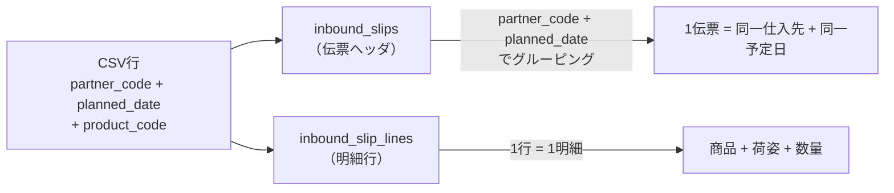
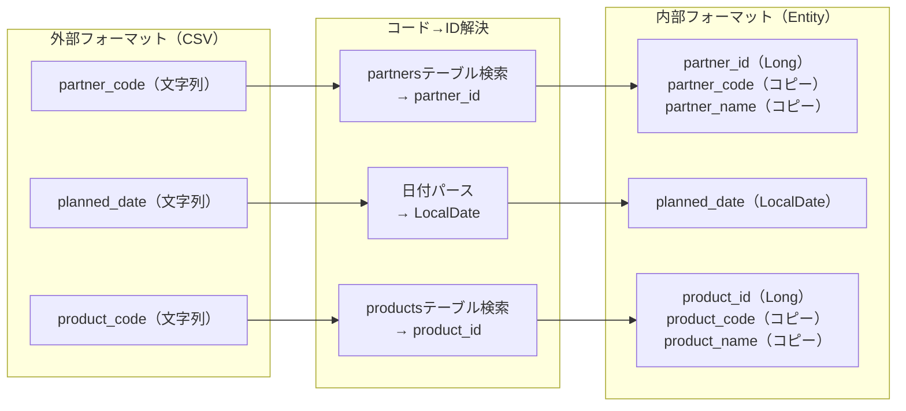
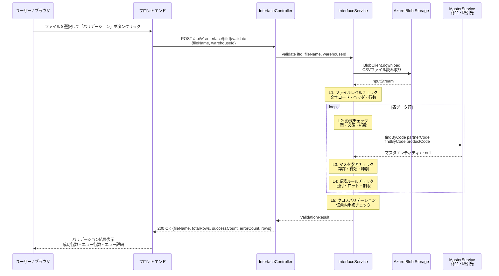
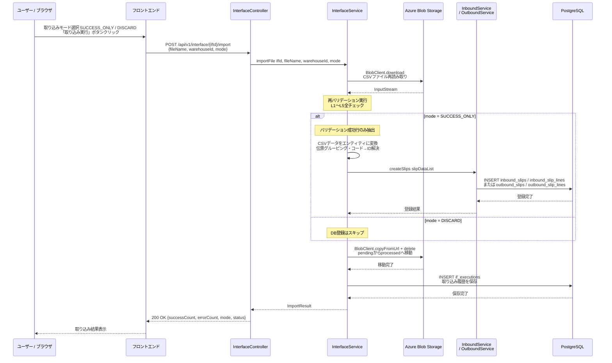
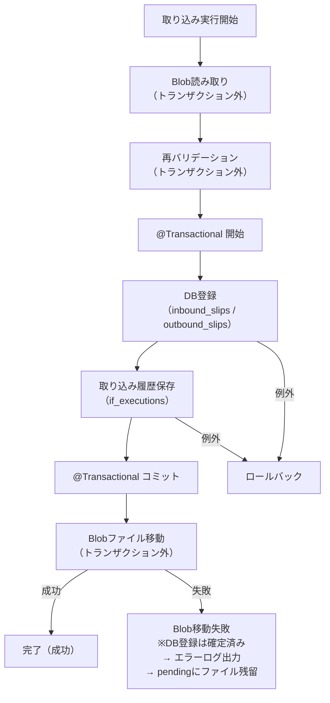

# インターフェースアーキテクチャ設計書

> **対象スコープ**: WMS外部連携I/F（ファイルベースCSV取り込み）
> **参照ブループリント**: [09-interface-architecture.md](../architecture-blueprint/09-interface-architecture.md)

---

## 目次

1. [外部システム連携一覧](#1-外部システム連携一覧)
2. [Blob Storageディレクトリ構成](#2-blob-storageディレクトリ構成)
3. [ファイル命名規約](#3-ファイル命名規約)
4. [ファイル連携設計（CSVフォーマット）](#4-ファイル連携設計csvフォーマット)
5. [データ変換設計](#5-データ変換設計)
6. [データ検証設計（バリデーション）](#6-データ検証設計バリデーション)
7. [取り込みフロー詳細設計](#7-取り込みフロー詳細設計)
8. [エラーハンドリング設計](#8-エラーハンドリング設計)
9. [バッチ連携設計](#9-バッチ連携設計)
10. [非機能要件](#10-非機能要件)

---

## 1. 外部システム連携一覧

### 1.1 I/F一覧

| I/F ID | I/F名 | 方向 | 形式 | 取り込み先テーブル | 取り込み後ステータス | 実装方式 |
|--------|-------|------|------|------------------|-------------------|---------|
| IFX-001 | 入荷予定取り込みI/F | 外部→WMS | CSV | `inbound_slips` / `inbound_slip_lines` | `PLANNED`（入荷予定） | モック（手動配置） |
| IFX-002 | 受注取り込みI/F | 外部→WMS | CSV | `outbound_slips` / `outbound_slip_lines` | `ORDERED`（受注） | モック（手動配置） |

> 本システムではリアルタイムAPI連携は対象外。外部システムがBlob Storageにファイルを配置し、WMSユーザーが画面操作で取り込む方式とする。

### 1.2 実装上の前提

| 項目 | 内容 |
|------|------|
| **外部システム接続** | なし（モック実装）。CSVファイルは手動またはスクリプトでBlob Storageに配置する |
| **実行権限** | SYSTEM_ADMIN・WAREHOUSE_MANAGER のみ |
| **実行契機** | ユーザーによるI/F管理画面からの手動操作 |
| **日付基準** | 取り込み実行時点の現在営業日をトランザクションの登録日として使用する |

---

## 2. Blob Storageディレクトリ構成

### 2.1 コンテナ構成

Azure Blob Storageのコンテナ `iffiles` 配下に、I/F種別ごとのディレクトリを配置する。

```
wms-storage-{env}/          ← Storage Account
└── iffiles/                ← Blob Container（I/Fファイル専用）
    ├── inbound-plan/       ← IFX-001: 入荷予定取り込み
    │   ├── pending/        ← 取り込み前（外部配置先）
    │   └── processed/      ← 取り込み済み（処理後移動先）
    └── order/              ← IFX-002: 受注取り込み
        ├── pending/        ← 取り込み前（外部配置先）
        └── processed/      ← 取り込み済み（処理後移動先）
```

### 2.2 フォルダの役割

| フォルダ | 用途 | 操作主体 |
|---------|------|---------|
| `pending/` | 取り込み前のCSVファイル配置場所。画面のファイル一覧に表示される | 外部（配置）/ WMS（読取） |
| `processed/` | 取り込み済みCSV。取り込み実行（SUCCESS_ONLY / DISCARD）後に移動される | WMS（移動） |

### 2.3 processedフォルダ内のサブディレクトリ

取り込み済みファイルの追跡性を高めるため、processed内を日付ディレクトリで整理する。

```
processed/
└── 2026/
    └── 03/
        └── 18/
            ├── 20260318_093015_INB-PLAN-001.csv
            └── 20260318_141200_INB-PLAN-002.csv
```

移動先のパス生成ルール: `processed/{yyyy}/{MM}/{dd}/{タイムスタンプ}_{元ファイル名}`

---

## 3. ファイル命名規約

### 3.1 外部配置ファイルの命名規約

外部システム（またはモック配置スクリプト）がpendingフォルダに配置するCSVファイルの命名規約を定義する。

| I/F ID | ファイル名パターン | 例 |
|--------|-----------------|-----|
| IFX-001 | `INB-PLAN-{連番3桁}.csv` | `INB-PLAN-001.csv` |
| IFX-002 | `ORD-{連番3桁}.csv` | `ORD-001.csv` |

> ファイル名は取り込み処理において一意性を検証しない。同一ファイル名の再配置は可能（processed移動後の再配置を想定）。取り込み履歴はファイル名＋取り込み日時で特定する。

### 3.2 processed移動後のファイル名

```
{取り込み日時(yyyyMMdd_HHmmss)}_{元ファイル名}
```

例: `20260318_093015_INB-PLAN-001.csv`

---

## 4. ファイル連携設計（CSVフォーマット）

### 4.1 共通CSV仕様

| 項目 | 仕様 |
|------|------|
| **文字コード** | UTF-8（BOMなし） |
| **改行コード** | CRLF または LF（どちらも許容） |
| **区切り文字** | カンマ（`,`） |
| **囲み文字** | ダブルクォーテーション（`"`）。値にカンマ・改行・ダブルクォーテーションを含む場合は必須 |
| **ヘッダ行** | 1行目をヘッダ行とする（カラム名を英語で記載） |
| **空行** | 無視する |
| **最大行数** | 10,000行（ヘッダ除く）。超過した場合はバリデーションエラー |

### 4.2 IFX-001: 入荷予定取り込みCSVフォーマット

#### カラム定義

| No | カラム名（ヘッダ） | 型 | 必須 | 最大長 | 説明 |
|----|------------------|-----|:----:|-------|------|
| 1 | `partner_code` | String | ○ | 50 | 仕入先コード（取引先マスタに存在する有効な仕入先） |
| 2 | `planned_date` | String | ○ | 10 | 入荷予定日（`yyyy-MM-dd` 形式） |
| 3 | `product_code` | String | ○ | 50 | 商品コード（商品マスタに存在する有効な商品） |
| 4 | `unit_type` | String | ○ | 10 | 荷姿（`CASE` / `BALL` / `PIECE`） |
| 5 | `planned_qty` | Integer | ○ | — | 入荷予定数量（1以上の正の整数） |
| 6 | `lot_number` | String | — | 100 | ロット番号（ロット管理対象商品の場合は必須） |
| 7 | `expiry_date` | String | — | 10 | 賞味/使用期限日（`yyyy-MM-dd` 形式。期限管理対象商品の場合は必須） |
| 8 | `note` | String | — | 500 | 備考 |

#### CSVファイル例

```csv
partner_code,planned_date,product_code,unit_type,planned_qty,lot_number,expiry_date,note
SUP-0001,2026-03-20,PRD-001,CASE,100,LOT-2026A,2027-03-20,定期便
SUP-0001,2026-03-20,PRD-002,PIECE,500,,,急ぎ
SUP-0002,2026-03-21,PRD-003,BALL,50,LOT-2026B,2026-12-31,
```

#### 取り込み後のデータマッピング

1CSVファイル内の同一 `partner_code` + `planned_date` の組み合わせを1件の入荷伝票（`inbound_slips`）としてまとめる。異なる組み合わせは別伝票として登録する。



### 4.3 IFX-002: 受注取り込みCSVフォーマット

#### カラム定義

| No | カラム名（ヘッダ） | 型 | 必須 | 最大長 | 説明 |
|----|------------------|-----|:----:|-------|------|
| 1 | `partner_code` | String | ○ | 50 | 出荷先コード（取引先マスタに存在する有効な出荷先） |
| 2 | `planned_date` | String | ○ | 10 | 出荷予定日（`yyyy-MM-dd` 形式） |
| 3 | `product_code` | String | ○ | 50 | 商品コード（商品マスタに存在する有効な商品） |
| 4 | `unit_type` | String | ○ | 10 | 荷姿（`CASE` / `BALL` / `PIECE`） |
| 5 | `ordered_qty` | Integer | ○ | — | 受注数量（1以上の正の整数） |
| 6 | `note` | String | — | 500 | 備考 |

#### CSVファイル例

```csv
partner_code,planned_date,product_code,unit_type,ordered_qty,note
CUS-0001,2026-03-22,PRD-001,CASE,50,通常配送
CUS-0001,2026-03-22,PRD-002,PIECE,200,
CUS-0002,2026-03-23,PRD-003,BALL,30,急ぎ
```

#### 取り込み後のデータマッピング

IFX-001と同様、1CSVファイル内の同一 `partner_code` + `planned_date` の組み合わせを1件の出荷伝票（`outbound_slips`）としてまとめる。

---

## 5. データ変換設計

### 5.1 変換方針

外部フォーマット（CSV）から内部フォーマット（エンティティ）への変換は、interfacingモジュールのService層で実施する。



### 5.2 IFX-001: 入荷予定 変換仕様

| CSVカラム | 変換処理 | 内部カラム |
|----------|---------|----------|
| `partner_code` | partnersテーブルから検索→ID取得、コード・名称をコピー保持 | `partner_id`, `partner_code`, `partner_name` |
| `planned_date` | `yyyy-MM-dd`形式でLocalDateにパース | `planned_date` |
| `product_code` | productsテーブルから検索→ID取得、コード・名称をコピー保持 | `product_id`, `product_code`, `product_name` |
| `unit_type` | 文字列をそのまま保持（ENUMバリデーション済み） | `unit_type` |
| `planned_qty` | 整数パース | `planned_qty` |
| `lot_number` | 文字列をそのまま保持（NULL許容） | `lot_number` |
| `expiry_date` | `yyyy-MM-dd`形式でLocalDateにパース（NULL許容） | `expiry_date` |
| — | 取り込み時の選択中倉庫から自動セット | `warehouse_id`, `warehouse_code`, `warehouse_name` |
| — | 固定値: `NORMAL` | `slip_type` |
| — | 固定値: `PLANNED` | `status` |
| — | 自動採番 | `slip_number` |

### 5.3 IFX-002: 受注 変換仕様

| CSVカラム | 変換処理 | 内部カラム |
|----------|---------|----------|
| `partner_code` | partnersテーブルから検索→ID取得、コード・名称をコピー保持 | `partner_id`, `partner_code`, `partner_name` |
| `planned_date` | `yyyy-MM-dd`形式でLocalDateにパース | `planned_date` |
| `product_code` | productsテーブルから検索→ID取得、コード・名称をコピー保持 | `product_id`, `product_code`, `product_name` |
| `unit_type` | 文字列をそのまま保持（ENUMバリデーション済み） | `unit_type` |
| `ordered_qty` | 整数パース | `ordered_qty` |
| — | 取り込み時の選択中倉庫から自動セット | `warehouse_id`, `warehouse_code`, `warehouse_name` |
| — | 固定値: `NORMAL` | `slip_type` |
| — | 固定値: `ORDERED` | `status` |
| — | 自動採番 | `slip_number` |

### 5.4 伝票グルーピングロジック

CSVの行を伝票（ヘッダ＋明細）に変換する際のグルーピングルールを定義する。

```java
// 擬似コード: CSVパース後のグルーピング
Map<String, List<CsvRow>> grouped = csvRows.stream()
    .collect(Collectors.groupingBy(
        row -> row.getPartnerCode() + "|" + row.getPlannedDate()
    ));
// grouped の各エントリが1伝票に対応する
// Key: "SUP-0001|2026-03-20" → 1件の inbound_slips
// Value: List<CsvRow> → 各行が inbound_slip_lines の1明細
```

#### 同一伝票内の同一商品チェック

1伝票（同一 partner_code + planned_date）内に同一 product_code が2行以上存在した場合はバリデーションエラーとする。これは手動登録と同じビジネスルール（[02-inbound-management.md](../functional-requirements/02-inbound-management.md) 参照）に準拠する。

---

## 6. データ検証設計（バリデーション）

### 6.1 バリデーション方針

- バリデーションは行単位で実施し、結果を行ごとに返す
- 1行に複数のエラーがある場合は全エラーを検出して返す（最初のエラーで中断しない）
- バリデーション結果はDBやキャッシュに保存しない（ステートレス）
- 取り込み実行時にも再バリデーションを行い、整合性を確保する

### 6.2 バリデーションレベル

| レベル | 内容 | 実施タイミング |
|-------|------|-------------|
| **L1: ファイルレベル** | ファイル形式・ヘッダ行・最大行数の検証 | バリデーション開始時 |
| **L2: 行レベル（形式）** | 各カラムの型・必須・桁数の検証 | 各行に対して実施 |
| **L3: 行レベル（マスタ参照）** | マスタ存在チェック・有効フラグチェック | 各行に対して実施 |
| **L4: 行レベル（業務ルール）** | 業務ルールに基づく整合性チェック | 各行に対して実施 |
| **L5: ファイルレベル（クロスバリデーション）** | 伝票内の重複チェック等 | 全行パース後に実施 |

### 6.3 L1: ファイルレベルバリデーション

| チェック項目 | エラーコード | エラーメッセージ |
|------------|-----------|---------------|
| 文字コードがUTF-8でない | `WMS-E-IFX-001` | ファイルの文字コードがUTF-8ではありません |
| ヘッダ行が存在しない | `WMS-E-IFX-002` | ヘッダ行が存在しません |
| ヘッダ行のカラム数が不正 | `WMS-E-IFX-003` | ヘッダ行のカラム数が不正です（期待: {expected}, 実際: {actual}） |
| ヘッダ行のカラム名が不正 | `WMS-E-IFX-004` | ヘッダ行のカラム名が不正です（{column_name}） |
| データ行が0件 | `WMS-E-IFX-005` | データ行が存在しません |
| データ行が10,000件超 | `WMS-E-IFX-006` | データ行数が上限（10,000件）を超えています（{actual}件） |

### 6.4 L2: 行レベルバリデーション（形式チェック）

#### IFX-001: 入荷予定CSV

| カラム | チェック内容 | エラーコード |
|--------|-----------|-----------|
| `partner_code` | 必須・50文字以内 | `WMS-E-IFX-101` |
| `planned_date` | 必須・`yyyy-MM-dd`形式・有効な日付 | `WMS-E-IFX-102` |
| `product_code` | 必須・50文字以内 | `WMS-E-IFX-103` |
| `unit_type` | 必須・`CASE`/`BALL`/`PIECE`のいずれか | `WMS-E-IFX-104` |
| `planned_qty` | 必須・正の整数（1以上） | `WMS-E-IFX-105` |
| `lot_number` | 100文字以内 | `WMS-E-IFX-106` |
| `expiry_date` | `yyyy-MM-dd`形式・有効な日付 | `WMS-E-IFX-107` |
| `note` | 500文字以内 | `WMS-E-IFX-108` |

#### IFX-002: 受注CSV

| カラム | チェック内容 | エラーコード |
|--------|-----------|-----------|
| `partner_code` | 必須・50文字以内 | `WMS-E-IFX-201` |
| `planned_date` | 必須・`yyyy-MM-dd`形式・有効な日付 | `WMS-E-IFX-202` |
| `product_code` | 必須・50文字以内 | `WMS-E-IFX-203` |
| `unit_type` | 必須・`CASE`/`BALL`/`PIECE`のいずれか | `WMS-E-IFX-204` |
| `ordered_qty` | 必須・正の整数（1以上） | `WMS-E-IFX-205` |
| `note` | 500文字以内 | `WMS-E-IFX-206` |

### 6.5 L3: マスタ参照バリデーション

| チェック内容 | 対象I/F | エラーコード |
|------------|---------|-----------|
| 取引先コードが取引先マスタに存在しない | 共通 | `WMS-E-IFX-301` |
| 取引先が無効化されている | 共通 | `WMS-E-IFX-302` |
| 取引先の種別がI/Fに合わない（IFX-001は仕入先/両方、IFX-002は出荷先/両方が必要） | 共通 | `WMS-E-IFX-303` |
| 商品コードが商品マスタに存在しない | 共通 | `WMS-E-IFX-304` |
| 商品が無効化されている | 共通 | `WMS-E-IFX-305` |
| 商品に出荷禁止フラグが設定されている（IFX-002のみ） | IFX-002 | `WMS-E-IFX-306` |

### 6.6 L4: 業務ルールバリデーション

| チェック内容 | 対象I/F | エラーコード |
|------------|---------|-----------|
| 入荷予定日が現在営業日より前の日付 | IFX-001 | `WMS-E-IFX-401` |
| ロット管理対象商品でlot_numberが未入力 | IFX-001 | `WMS-E-IFX-402` |
| 期限管理対象商品でexpiry_dateが未入力 | IFX-001 | `WMS-E-IFX-403` |
| 期限管理対象商品でexpiry_dateが現在営業日以前 | IFX-001 | `WMS-E-IFX-404` |

### 6.7 L5: クロスバリデーション（ファイルレベル）

| チェック内容 | 対象I/F | エラーコード |
|------------|---------|-----------|
| 同一伝票（partner_code + planned_date）内に同一product_codeの重複行 | IFX-001 | `WMS-E-IFX-501` |
| 同一伝票（partner_code + planned_date）内に同一product_codeの重複行 | IFX-002 | `WMS-E-IFX-502` |

### 6.8 バリデーション結果レスポンス形式

```json
{
  "fileName": "INB-PLAN-001.csv",
  "totalRows": 100,
  "successCount": 97,
  "errorCount": 3,
  "rows": [
    {
      "rowNumber": 1,
      "status": "SUCCESS",
      "errors": []
    },
    {
      "rowNumber": 5,
      "status": "ERROR",
      "errors": [
        {
          "column": "partner_code",
          "errorCode": "WMS-E-IFX-301",
          "message": "取引先コード（SUP-9999）が取引先マスタに存在しません"
        }
      ]
    },
    {
      "rowNumber": 23,
      "status": "ERROR",
      "errors": [
        {
          "column": "planned_qty",
          "errorCode": "WMS-E-IFX-105",
          "message": "入荷予定数量は1以上の正の整数で入力してください"
        },
        {
          "column": "lot_number",
          "errorCode": "WMS-E-IFX-402",
          "message": "ロット管理対象商品のためロット番号は必須です"
        }
      ]
    }
  ]
}
```

> レスポンスの `rows` 配列にはエラー行のみを含む。成功行はカウント（`successCount`）のみ返し、個別の行データは含めない（レスポンスサイズ抑制）。

---

## 7. 取り込みフロー詳細設計

### 7.1 ステートレス2ステップ設計

ブループリント（[09-interface-architecture.md](../architecture-blueprint/09-interface-architecture.md)）で定義された方針に従い、バリデーションと取り込みはステートレスで処理する。

| ステップ | API | 処理内容 | DB書き込み |
|---------|-----|---------|----------|
| **1. バリデーション** | `POST /api/v1/interface/{ifId}/validate` | BlobからCSV読み取り→全行バリデーション→結果返却 | なし |
| **2. 取り込み実行** | `POST /api/v1/interface/{ifId}/import` | BlobからCSV再読み取り→再バリデーション→DB登録→Blob移動→履歴保存 | あり |

### 7.2 バリデーションフロー



### 7.3 取り込み実行フロー



### 7.4 トランザクション制御



**設計判断: DB登録とBlob移動の順序**

| 順序 | 方式 | 採用 | 理由 |
|------|------|:----:|------|
| DB→Blob | DB登録を先にコミットし、その後Blobを移動 | **○** | DB登録成功後にBlob移動が失敗した場合、ファイルがpendingに残留するが、取り込み履歴はDBに記録済みのため再実行を防止できる。画面上の取り込み履歴で状態確認が可能 |
| Blob→DB | Blobを先に移動し、その後DB登録 | ✗ | Blob移動成功後にDB登録が失敗した場合、ファイルがprocessedに移動済みだがデータが登録されていない不整合が発生する。復旧が困難 |

### 7.5 interfacingモジュールのクラス構成

```
com.wms.interfacing/
├── controller/
│   └── InterfaceController.java          ← REST Controller
├── service/
│   ├── InterfaceService.java             ← 取り込みオーケストレーション
│   ├── CsvParser.java                    ← CSVパース共通処理
│   ├── InboundPlanCsvProcessor.java      ← IFX-001固有の変換・バリデーション
│   └── OrderCsvProcessor.java            ← IFX-002固有の変換・バリデーション
├── dto/
│   ├── ValidateRequest.java              ← バリデーションリクエスト
│   ├── ImportRequest.java                ← 取り込みリクエスト
│   ├── ValidationResult.java             ← バリデーション結果
│   ├── ImportResult.java                 ← 取り込み結果
│   ├── ValidationRowResult.java          ← 行単位バリデーション結果
│   ├── FileInfoResponse.java             ← ファイル一覧レスポンス
│   └── ImportHistoryResponse.java        ← 取り込み履歴レスポンス
├── repository/
│   └── IfExecutionRepository.java        ← 取り込み履歴リポジトリ
└── blob/
    └── BlobStorageClient.java            ← Azure Blob Storage操作
```

---

## 8. エラーハンドリング設計

### 8.1 エラー分類と対応方針

| エラー分類 | 発生箇所 | 対応方針 |
|----------|---------|---------|
| **Blob接続エラー** | Blob Storage読み取り・移動 | ユーザーにエラーメッセージを表示。リトライはユーザー判断で再操作 |
| **CSVパースエラー** | CSV読み取り・解析 | L1バリデーションエラーとして返却 |
| **バリデーションエラー** | 各行のバリデーション | 行単位のエラー詳細を返却。ユーザーがSUCCESS_ONLY/DISCARDを選択 |
| **DB登録エラー** | トランザクション内の登録処理 | トランザクションロールバック。ユーザーにエラー表示 |
| **Blob移動エラー** | processed移動 | ERRORログ出力。DB登録は確定済み。取り込み履歴に移動失敗フラグを記録 |

### 8.2 リトライ方針

| 処理 | リトライ | 回数 | 間隔 | 理由 |
|------|:------:|------|------|------|
| Blob Storage読み取り | ○ | 3回 | 1秒→2秒→4秒（指数バックオフ） | ネットワーク一時障害に対応 |
| Blob Storageファイル移動 | ○ | 3回 | 1秒→2秒→4秒（指数バックオフ） | ネットワーク一時障害に対応 |
| DB登録 | ✗ | — | — | トランザクション内のためリトライしない。ユーザーに再操作を促す |
| バリデーション | ✗ | — | — | ステートレスのためリトライ不要。再度バリデーション操作を実行する |

### 8.3 Blob Storage操作のリトライ実装

Azure SDK for Java の `RequestRetryOptions` を使用する。

```java
// application.yml での設定例
wms:
  blob:
    retry:
      max-tries: 3
      try-timeout-seconds: 30
      retry-delay-millis: 1000
      max-retry-delay-millis: 4000
```

### 8.4 エラー通知

| エラー種別 | 通知方法 | 通知先 |
|----------|---------|-------|
| Blob接続エラー（リトライ後も失敗） | ERRORログ → Azure Monitorアラート | 運用担当者（メール） |
| DB登録エラー（予期せぬ例外） | ERRORログ → Azure Monitorアラート | 運用担当者（メール） |
| Blob移動失敗 | ERRORログ → Azure Monitorアラート | 運用担当者（メール） |
| バリデーションエラー | 画面表示のみ | 操作ユーザー |

### 8.5 障害パターンと復旧手順

| 障害パターン | 影響 | 復旧手順 |
|------------|------|---------|
| Blob Storage一時障害 | ファイル一覧取得・バリデーション・取り込み実行が全て不可 | Blob Storageの復旧を待って再操作 |
| DB登録中のエラー | トランザクションロールバック。ファイルはpendingに残留 | 原因調査後にユーザーが再度取り込み操作 |
| Blob移動失敗（DB登録成功後） | DB登録は完了。ファイルがpendingに残留。取り込み履歴に記録あり | 手動でファイルをprocessedに移動。または取り込み履歴を確認し二重取り込みでないことを確認の上、再取り込みは不要 |
| 取り込み中のアプリケーション再起動 | トランザクション未コミットの場合はロールバック。ファイルはpendingに残留 | ユーザーが再度取り込み操作 |

---

## 9. バッチ連携設計

### 9.1 外部連携I/Fとバッチ処理の関係

外部連携I/Fの取り込みは手動実行であり、バッチ処理（日替処理）との直接的な依存関係はない。ただし、以下の間接的な関連がある。

| 関連ポイント | 説明 |
|------------|------|
| **営業日基準** | 取り込みで登録されるデータの日付基準は現在営業日。日替処理で営業日が更新されると、翌日以降の取り込みでは新しい営業日が基準となる |
| **未入荷/未出荷リスト** | 取り込みで登録した入荷予定・受注が予定日を過ぎても完了しない場合、日替処理で未入荷/未出荷として記録される |
| **トランデータバックアップ** | 取り込みで登録した伝票も、完了後2か月以上経過すると日替処理でバックアップテーブルに移動される |

### 9.2 スケジューリング

本システムでは外部連携I/Fのスケジュール自動実行は行わない（全て手動操作）。

| 項目 | 内容 |
|------|------|
| **自動スケジューリング** | なし |
| **実行タイミング** | ユーザーの任意のタイミングでI/F管理画面から操作 |
| **推奨運用** | 外部システムがCSVを配置した後、業務開始前に取り込みを実施する |

### 9.3 将来的な自動化拡張の考慮

将来的にスケジュール自動取り込みを導入する場合に備え、以下の設計上の考慮を行う。

| 考慮事項 | 設計上の対応 |
|---------|-----------|
| **Service層の独立性** | InterfaceServiceはHTTP依存を持たない。バッチスケジューラからも同一メソッドを呼び出し可能 |
| **エラーハンドリング** | エラー結果はDTO（ImportResult）で返却。バッチ実行時はログ出力に切り替え可能 |
| **Blob Eventトリガー** | Azure Blob StorageのEvent Grid連携でpending配置を検知し、自動取り込みする拡張が可能 |

---

## 10. 非機能要件

### 10.1 パフォーマンス要件

| 項目 | 目標値 | 備考 |
|------|--------|------|
| バリデーション処理時間 | 10,000行で30秒以内 | マスタ検索のバッチ化で最適化 |
| 取り込み処理時間 | 10,000行で60秒以内 | DB一括挿入（バッチINSERT）を使用 |
| 同時取り込み | 1ユーザー1ファイルずつ | 同一I/Fの並行取り込みは画面UIで制限 |

### 10.2 マスタ検索の最適化

CSV内の全行を逐次的にマスタ検索すると性能劣化するため、以下の最適化を行う。


1. CSVの全行をパースし、ユニークな `partner_code` / `product_code` を抽出する
2. `IN` 句で一括検索し、結果をメモリ上の `Map<String, Entity>` に保持する
3. 各行のバリデーションではMapを参照する（DB往復なし）

### 10.3 セキュリティ要件

| 項目 | 対応 |
|------|------|
| **認証** | JWT認証必須。未認証ユーザーはアクセス不可 |
| **認可** | SYSTEM_ADMIN・WAREHOUSE_MANAGER のみ実行可能 |
| **Blob Storage認証** | マネージドIDまたはアクセスキー（環境変数管理） |
| **CSVインジェクション対策** | 先頭文字が `=`, `+`, `-`, `@` の値は、取り込み時にそのまま文字列として処理する（数式展開しない） |
| **ファイルサイズ制限** | 50MB上限（Blob読み取り前にサイズチェック） |

### 10.4 取り込み履歴テーブル（if_executions）

> テーブル定義は [data-model/03-transaction-tables.md](../data-model/03-transaction-tables.md) の `if_executions` を参照（SSOTルール）。

**status の値**:

| 値 | 意味 |
|----|------|
| `COMPLETED` | 取り込み成功（mode=SUCCESS_ONLYでDB登録完了） |
| `DISCARDED` | 全件破棄（mode=DISCARDでDB登録なし） |
| `FAILED` | 取り込み失敗（DB登録中にエラー発生） |
