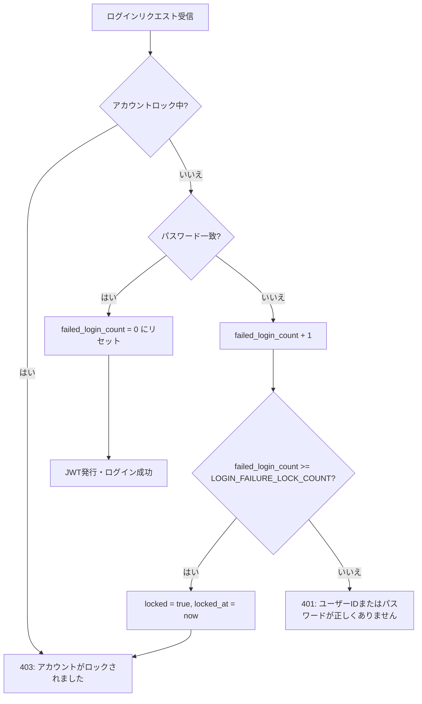

# セキュリティアーキテクチャ設計書

> 対象システム: WMS（倉庫管理システム）
> 作成日: 2026-03-18
> ステータス: 初版
> セキュリティ方針（SSOT）: [architecture-blueprint/10-security-architecture.md](../architecture-blueprint/10-security-architecture.md)

---

## 目次

1. [OWASP Top 10 対策設計](#1-owasp-top-10-対策設計)
2. [入力バリデーション設計](#2-入力バリデーション設計)
3. [CSRF対策設計](#3-csrf対策設計)
4. [セキュリティヘッダー設計](#4-セキュリティヘッダー設計)
5. [機密データ保護設計](#5-機密データ保護設計)
6. [パスワードポリシー実装設計](#6-パスワードポリシー実装設計)
7. [アカウントロックポリシー実装設計](#7-アカウントロックポリシー実装設計)
8. [監査ログ設計](#8-監査ログ設計)
9. [レートリミット（Bucket4j）](#9-レートリミットbucket4j)
10. [依存ライブラリ脆弱性管理](#10-依存ライブラリ脆弱性管理)
11. [セキュリティテスト方針](#11-セキュリティテスト方針)

---

## 1. OWASP Top 10 対策設計

本システムでは OWASP Top 10（2021）の各カテゴリに対して以下の対策を実装する。

| # | カテゴリ | リスク概要 | 本システムでの対策 | 対策の実装箇所 |
|---|---------|-----------|------------------|--------------|
| A01 | Broken Access Control | 認可不備による不正アクセス | RBAC（4ロール） + `@PreAuthorize` による API 単位の認可制御 | Spring Security Filter Chain, Controller |
| A02 | Cryptographic Failures | 暗号化不備による機密情報漏洩 | パスワード: BCrypt(strength=12)、トークン: SHA-256 ハッシュ、通信: TLS 1.2+強制 | Service層, Azure Container Apps |
| A03 | Injection | SQL/コマンドインジェクション | Spring Data JPA パラメータバインディング、ネイティブクエリは `:param` バインド必須 | Repository層 |
| A04 | Insecure Design | 設計レベルのセキュリティ不備 | 脅威モデリング（本設計書）、ビジネスロジックの Service 層集約 | 設計フェーズ |
| A05 | Security Misconfiguration | セキュリティ設定の不備 | セキュリティヘッダー一括設定、本番環境での Swagger UI 無効化、エラー詳細非公開 | SecurityConfig, application.yml |
| A06 | Vulnerable and Outdated Components | 脆弱なライブラリの使用 | GitHub Dependabot による自動検知 + PR 作成 | CI/CD |
| A07 | Identification and Authentication Failures | 認証の不備 | アカウントロック、BCrypt、JWT httpOnly Cookie、トークンローテーション | Security モジュール |
| A08 | Software and Data Integrity Failures | ソフトウェア・データの完全性不備 | Gradle 依存関係の検証、CI/CD パイプラインの保護 | build.gradle, GitHub Actions |
| A09 | Security Logging and Monitoring Failures | ログ・監視の不備 | 認証ログ（成功/失敗/ロック）、操作ログ、Azure Monitor アラート | ロギング基盤 |
| A10 | Server-Side Request Forgery (SSRF) | サーバーサイドリクエスト偽造 | 外部 URL 入力なし（ファイルアップロードなし）。I/F ファイルは Azure Blob Storage のみ | アーキテクチャレベル |

### A01: Broken Access Control — 詳細設計

#### Spring Security Filter Chain 構成

```java
@Configuration
@EnableWebSecurity
@EnableMethodSecurity  // @PreAuthorize を有効化
public class SecurityConfig {

    @Bean
    public SecurityFilterChain filterChain(HttpSecurity http) throws Exception {
        http
            .csrf(csrf -> csrf.disable())  // SameSite=Lax で CSRF 対策するため無効化
            .cors(cors -> cors.configurationSource(corsConfigurationSource()))
            .sessionManagement(session ->
                session.sessionCreationPolicy(SessionCreationPolicy.STATELESS))
            .authorizeHttpRequests(auth -> auth
                // 認証不要エンドポイント
                .requestMatchers(
                    "/api/v1/auth/login",
                    "/api/v1/auth/logout",
                    "/api/v1/auth/refresh",
                    "/api/v1/auth/password-reset/request",
                    "/api/v1/auth/password-reset/confirm",
                    "/actuator/health"
                ).permitAll()
                // それ以外は認証必須
                .anyRequest().authenticated()
            )
            .addFilterBefore(jwtAuthenticationFilter(),
                UsernamePasswordAuthenticationFilter.class)
            .exceptionHandling(ex -> ex
                .authenticationEntryPoint(jwtAuthenticationEntryPoint())
                .accessDeniedHandler(jwtAccessDeniedHandler())
            );
        return http.build();
    }
}
```

#### API 単位の認可制御（`@PreAuthorize`）

認可はメソッドセキュリティ（`@PreAuthorize`）で API 単位に設定する。

> 権限マトリクスの詳細は [architecture-blueprint/07-auth-architecture.md](../architecture-blueprint/07-auth-architecture.md) を参照

```java
// ユーザー管理: SYSTEM_ADMIN のみ
@PreAuthorize("hasRole('SYSTEM_ADMIN')")
@PostMapping("/api/v1/master/users")
public ResponseEntity<UserResponse> createUser(...) { ... }

// マスタ更新: SYSTEM_ADMIN, WAREHOUSE_MANAGER
@PreAuthorize("hasAnyRole('SYSTEM_ADMIN', 'WAREHOUSE_MANAGER')")
@PutMapping("/api/v1/master/warehouses/{id}")
public ResponseEntity<WarehouseResponse> updateWarehouse(...) { ... }

// 参照系: 全ロール（認証済みであれば可）
@PreAuthorize("isAuthenticated()")
@GetMapping("/api/v1/master/warehouses")
public ResponseEntity<PageResponse<WarehouseListItem>> listWarehouses(...) { ... }

// バッチ実行: SYSTEM_ADMIN, WAREHOUSE_MANAGER
@PreAuthorize("hasAnyRole('SYSTEM_ADMIN', 'WAREHOUSE_MANAGER')")
@PostMapping("/api/v1/batch/daily-close")
public ResponseEntity<Void> runDailyClose() { ... }
```

#### データアクセス制御

本システムでは行レベルのマルチテナント制御は不要（単一テナント）。ただし以下のビジネスルールをService層で強制する。

| ルール | 実装方法 |
|--------|---------|
| 自身のロール変更不可 | `UserService` で操作対象ユーザーIDと認証ユーザーIDを比較 |
| 自身の無効化不可 | 同上 |
| VIEWER ロールの更新操作禁止 | `@PreAuthorize` で制御 |

### A02: Cryptographic Failures — 詳細設計

| 対象データ | 暗号化方式 | 実装 |
|-----------|-----------|------|
| パスワード | BCrypt（strength=12） | `BCryptPasswordEncoder` |
| リフレッシュトークン（DB保存） | BCrypt ハッシュ | `BCryptPasswordEncoder` |
| パスワードリセットトークン（DB保存） | SHA-256 ハッシュ | `MessageDigest.getInstance("SHA-256")` |
| DB接続情報 | Azure Container Apps 環境変数（シークレット） | Terraform で Key Vault 参照 |
| 通信経路 | TLS 1.2+ | Azure Container Apps 自動管理 |

### A05: Security Misconfiguration — 詳細設計

#### 環境別セキュリティ設定

```yaml
# application.yml（共通）
spring:
  jackson:
    default-property-inclusion: non_null  # null フィールドをレスポンスから除外

---
# application-dev.yml
springdoc:
  swagger-ui:
    enabled: true
  api-docs:
    enabled: true
logging:
  level:
    com.wms: DEBUG

---
# application-prd.yml
springdoc:
  swagger-ui:
    enabled: false   # 本番では Swagger UI を無効化
  api-docs:
    enabled: false   # 本番では OpenAPI エンドポイントを無効化
logging:
  level:
    com.wms: INFO
```

#### エラーレスポンスの情報制限

本番環境では内部スタックトレースをレスポンスに含めない。

```yaml
# application.yml
server:
  error:
    include-stacktrace: never
    include-message: never
    include-binding-errors: never
```

`GlobalExceptionHandler` で未知の例外を捕捉した場合は、汎用メッセージのみ返却する。

> エラーハンドリングの詳細は [architecture-blueprint/08-common-infrastructure.md](../architecture-blueprint/08-common-infrastructure.md) を参照

```java
@ExceptionHandler(Exception.class)
public ResponseEntity<ErrorResponse> handleUnknownException(Exception ex) {
    String traceId = TraceContext.getCurrentTraceId();
    log.error("Unexpected error: traceId={}", traceId, ex);  // スタックトレースはログに出力
    ErrorResponse body = ErrorResponse.of(
        "INTERNAL_SERVER_ERROR",
        "システムエラーが発生しました",  // 内部詳細は返さない
        traceId);
    return ResponseEntity.status(500).body(body);
}
```

---

## 2. 入力バリデーション設計

### バリデーション層構成

```
クライアント（Vue 3 + VeeValidate + Zod）
    ↓ フロントエンドバリデーション（UX向上目的）
APIリクエスト
    ↓
Controller層（Jakarta Bean Validation）
    ↓ 型・形式・必須チェック（@Valid, @NotBlank, @Size 等）
Service層
    ↓ ビジネスルールバリデーション
Repository層（Spring Data JPA）
    ↓ パラメータバインディング（SQLインジェクション防止）
PostgreSQL
```

### Controller 層: Jakarta Bean Validation

```java
public record CreateWarehouseRequest(
    @NotBlank(message = "倉庫コードは必須です")
    @Size(max = 50, message = "倉庫コードは50文字以内で入力してください")
    @Pattern(regexp = "^[A-Z0-9-]+$", message = "倉庫コードは半角英大文字・数字・ハイフンのみ使用可能です")
    String warehouseCode,

    @NotBlank(message = "倉庫名は必須です")
    @Size(max = 200, message = "倉庫名は200文字以内で入力してください")
    String warehouseName,

    @Size(max = 200, message = "倉庫名カナは200文字以内で入力してください")
    String warehouseNameKana,

    @Size(max = 500, message = "住所は500文字以内で入力してください")
    String address
) {}
```

```java
@PostMapping("/api/v1/master/warehouses")
public ResponseEntity<WarehouseResponse> create(
    @Valid @RequestBody CreateWarehouseRequest request  // @Valid でバリデーション実行
) {
    // バリデーション失敗時は MethodArgumentNotValidException → 400 Bad Request
    // GlobalExceptionHandler が details 付きレスポンスを返却
    return ResponseEntity.status(201).body(warehouseService.create(request));
}
```

### SQLインジェクション対策

#### Spring Data JPA（デフォルト: 安全）

```java
// メソッドクエリ（安全: パラメータバインディング自動適用）
List<Warehouse> findByWarehouseCodeContaining(String keyword);

// JPQL（安全: パラメータバインディング自動適用）
@Query("SELECT w FROM Warehouse w WHERE w.warehouseName LIKE %:keyword%")
List<Warehouse> searchByName(@Param("keyword") String keyword);
```

#### ネイティブクエリ使用時のルール

```java
// 正しい例: パラメータバインディング
@Query(value = "SELECT * FROM warehouses WHERE warehouse_code = :code", nativeQuery = true)
Warehouse findByCodeNative(@Param("code") String code);

// 禁止: 文字列連結による動的クエリ構築
// @Query(value = "SELECT * FROM warehouses WHERE warehouse_code = '" + code + "'")
```

**ネイティブクエリの使用ルール:**
- 原則としてJPQLまたはメソッドクエリを使用する
- ネイティブクエリが必要な場合は必ず `:param` バインドを使用する
- 文字列連結による SQL 構築は全面禁止
- コードレビューでネイティブクエリの安全性を必ず確認する

### XSS対策

| 対策ポイント | 実装 |
|------------|------|
| APIレスポンス | JSON 形式のみ（HTML を返さない）。`Content-Type: application/json` |
| `X-Content-Type-Options` | `nosniff`（MIME スニッフィング防止） |
| フロントエンド | Vue 3 のテンプレートは自動的に HTML エスケープ。`v-html` の使用禁止をコーディング規約で定める |
| Cookie | `httpOnly` 属性でスクリプトからのアクセスを禁止 |

**フロントエンド側の XSS 防止ルール:**

```typescript
// 禁止: v-html の使用（XSS リスク）
// <div v-html="userInput"></div>

// 正しい: テキスト展開（自動エスケープ）
// <div>{{ userInput }}</div>
```

---

## 3. CSRF対策設計

### 方針

httpOnly Cookie の `SameSite=Lax` 属性による CSRF 対策を採用する。CSRF トークンは使用しない。

> 方針の詳細は [architecture-blueprint/07-auth-architecture.md](../architecture-blueprint/07-auth-architecture.md) を参照

### SameSite=Lax の動作

| リクエスト種別 | Cookie送信 | 説明 |
|-------------|-----------|------|
| 同一オリジンからの POST | 送信される | 通常の業務操作 |
| トップレベルナビゲーション（GET） | 送信される | ブックマーク・メールリンクからのアクセスで再ログイン不要 |
| クロスサイトからの POST | 送信されない | CSRF 攻撃をブロック |
| iframe / img / script からのリクエスト | 送信されない | 埋め込み攻撃をブロック |

### Cookie 設定

```java
public class CookieUtil {

    public static ResponseCookie createAccessTokenCookie(String token) {
        return ResponseCookie.from("access_token", token)
            .httpOnly(true)          // JavaScript からアクセス不可
            .secure(true)            // HTTPS 接続時のみ送信
            .sameSite("Lax")         // CSRF 対策
            .path("/")               // 全パスに送信
            .maxAge(Duration.ofHours(1))
            .build();
    }

    public static ResponseCookie createRefreshTokenCookie(String token) {
        return ResponseCookie.from("refresh_token", token)
            .httpOnly(true)
            .secure(true)
            .sameSite("Lax")
            .path("/api/v1/auth/")   // 認証エンドポイントのみに送信
            .maxAge(Duration.ofHours(24))
            .build();
    }

    public static ResponseCookie deleteAccessTokenCookie() {
        return ResponseCookie.from("access_token", "")
            .httpOnly(true)
            .secure(true)
            .sameSite("Lax")
            .path("/")
            .maxAge(0)  // 即時削除
            .build();
    }

    public static ResponseCookie deleteRefreshTokenCookie() {
        return ResponseCookie.from("refresh_token", "")
            .httpOnly(true)
            .secure(true)
            .sameSite("Lax")
            .path("/api/v1/auth/")
            .maxAge(0)
            .build();
    }
}
```

### Spring Security での CSRF 無効化

```java
// SecurityConfig.java 内
http.csrf(csrf -> csrf.disable());
```

> **CSRF トークンを使わない理由:** httpOnly Cookie + SameSite=Lax の組み合わせで十分な CSRF 保護が得られる。SameSite=Lax はモダンブラウザで広くサポートされている。本システムは SPA（Vue 3）であり、全 API リクエストは JavaScript（Axios）から発行されるため、SameSite 属性による保護が有効に機能する。

---

## 4. セキュリティヘッダー設計

### Spring Security によるレスポンスヘッダー設定

> ヘッダーの定義（SSOT）は [architecture-blueprint/10-security-architecture.md](../architecture-blueprint/10-security-architecture.md) を参照

```java
@Bean
public SecurityFilterChain filterChain(HttpSecurity http) throws Exception {
    http
        .headers(headers -> headers
            // X-Content-Type-Options: nosniff
            .contentTypeOptions(Customizer.withDefaults())
            // X-Frame-Options: DENY
            .frameOptions(frame -> frame.deny())
            // Referrer-Policy: strict-origin-when-cross-origin
            .referrerPolicy(referrer ->
                referrer.policy(ReferrerPolicyHeaderWriter.ReferrerPolicy.STRICT_ORIGIN_WHEN_CROSS_ORIGIN))
            // Strict-Transport-Security: max-age=31536000; includeSubDomains
            .httpStrictTransportSecurity(hsts -> hsts
                .includeSubDomains(true)
                .maxAgeInSeconds(31536000))
            // Cache-Control: no-cache, no-store, max-age=0, must-revalidate（API レスポンス）
            .cacheControl(Customizer.withDefaults())
        )
        // ... 他の設定
    ;
    return http.build();
}
```

### ヘッダー一覧と目的

| ヘッダー | 値 | 目的 |
|---------|---|------|
| `X-Content-Type-Options` | `nosniff` | ブラウザによる MIME スニッフィングを防止。意図しないスクリプト実行を阻止 |
| `X-Frame-Options` | `DENY` | iframe への埋め込みを全面禁止。クリックジャッキング攻撃を防止 |
| `Referrer-Policy` | `strict-origin-when-cross-origin` | 同一オリジンではフル URL、クロスオリジンではオリジンのみ送信。URL パラメータの漏洩を防止 |
| `Strict-Transport-Security` | `max-age=31536000; includeSubDomains` | HTTPS 接続を強制。ダウングレード攻撃を防止 |
| `Cache-Control` | `no-cache, no-store, max-age=0, must-revalidate` | API レスポンスのキャッシュを防止。機密データの残存を防止 |

### Content-Security-Policy（CSP）について

本システムのフロントエンドは Azure Blob Storage 静的ホスティングであり、バックエンド API は JSON のみを返却する。CSP ヘッダーの設定は以下の方針とする。

| コンポーネント | CSP の適用 | 理由 |
|-------------|----------|------|
| バックエンド API | 不要 | JSON レスポンスのみ。HTML を返さないため CSP は無関係 |
| フロントエンド（Blob Storage） | Azure Blob Storage のレスポンスヘッダー設定で適用（将来対応） | 静的 HTML/JS/CSS のため有効。初期リリースでは未設定とし、安定稼働後に追加 |

---

## 5. 機密データ保護設計

### データ分類

| 分類 | 対象データ | 保護方針 |
|------|----------|---------|
| **最重要** | パスワード | BCrypt ハッシュ化（不可逆）。平文保存・ログ出力禁止 |
| **最重要** | リフレッシュトークン | BCrypt ハッシュ化して DB 保存。Cookie は httpOnly |
| **重要** | パスワードリセットトークン | SHA-256 ハッシュ化して DB 保存。有効期限30分 |
| **重要** | JWT アクセストークン | Cookie は httpOnly + Secure + SameSite=Lax |
| **個人情報** | メールアドレス | ログ出力時にマスキング |
| **個人情報** | 電話番号 | ログ出力時にマスキング |
| **機密** | DB接続情報 | Azure Container Apps の環境変数（シークレット） |

### パスワードを含むAPIリクエストのログ出力対策

認証系API（login, change-password, password-reset/confirm）のリクエストボディにはパスワードが平文で含まれる。HTTPS通信によりネットワーク上は保護されるが、サーバーサイドの以下3経路でパスワードがログに残るリスクがある。

| 経路 | 対策 |
|------|------|
| アプリケーションログ（logback） | `SensitiveDataFilter` でリクエストボディをマスキング |
| Application Insightsテレメトリ | `SensitiveDataTelemetryInitializer` でテレメトリからボディを除外 |
| エラーログ（例外スタックトレース） | `SensitiveDataFilter` がMDC経由でマスキング済みボディを設定 |

> 実装詳細は [08-common-infrastructure.md のセンシティブデータのログマスキング](./08-common-infrastructure.md#45-センシティブデータのログマスキング) を参照。

### パスワードの不可逆ハッシュ化

```java
@Configuration
public class PasswordConfig {

    @Bean
    public PasswordEncoder passwordEncoder() {
        return new BCryptPasswordEncoder(12);  // strength=12
    }
}
```

```java
// パスワード保存時
String hashedPassword = passwordEncoder.encode(rawPassword);
user.setPasswordHash(hashedPassword);

// パスワード検証時
boolean matches = passwordEncoder.matches(rawPassword, user.getPasswordHash());
```

### トークンのハッシュ化

```java
// リフレッシュトークン: BCrypt ハッシュ
String rawToken = UUID.randomUUID().toString();
String tokenHash = passwordEncoder.encode(rawToken);
refreshTokenRepository.save(new RefreshToken(userId, tokenHash, expiresAt));

// パスワードリセットトークン: SHA-256 ハッシュ
String rawToken = UUID.randomUUID().toString();
String tokenHash = DigestUtils.sha256Hex(rawToken);
passwordResetTokenRepository.save(new PasswordResetToken(userId, tokenHash, expiresAt));
```

### ログのPIIマスキング

> ロギング基盤の詳細は [architecture-blueprint/08-common-infrastructure.md](../architecture-blueprint/08-common-infrastructure.md) を参照

```java
/**
 * ログメッセージ中のPII（個人情報）・機密情報をマスクするユーティリティ。
 * メールアドレス・電話番号に加え、JWT・パスワード系キーワードもマスク対象。
 * 環境別の Logback 拡張（PiiMaskingPatternLayoutEncoder / PiiMaskingMessageJsonProvider）
 * から呼び出される。
 */
public final class PiiMasker {

    // メールアドレス（ReDoS対策: possessive quantifier 使用）
    private static final Pattern EMAIL_PATTERN = ...;

    // 電話番号（日本形式: 先頭セグメント2桁以上、ワードバウンダリ付き）
    private static final Pattern PHONE_PATTERN = ...;

    // JWT トークン（JWE 5パート対応）
    private static final Pattern JWT_PATTERN = ...;

    // パスワード・シークレット系 KV 形式（key=value / key:value）
    private static final Pattern PASSWORD_KV_PATTERN = ...;

    // パスワード・シークレット系 JSON 形式（"key": "value"）
    private static final Pattern PASSWORD_JSON_PATTERN = ...;

    public static String mask(String message) { ... }
}
```

> コード全文は [08-common-infrastructure.md § 4.4](08-common-infrastructure.md#44-バックエンド--pii-マスキング) を参照。

### DB接続情報の保護

```yaml
# application.yml — 環境変数から注入（値はハードコードしない）
spring:
  datasource:
    url: ${DATABASE_URL}
    username: ${DATABASE_USERNAME}
    password: ${DATABASE_PASSWORD}
```

Azure Container Apps のシークレット設定（Terraform）:

```hcl
resource "azurerm_container_app" "backend" {
  # ...
  secret {
    name  = "database-url"
    value = "jdbc:postgresql://${azurerm_postgresql_flexible_server.main.fqdn}:5432/wms?sslmode=require"
  }
  secret {
    name  = "database-username"
    value = var.db_username
  }
  secret {
    name  = "database-password"
    value = var.db_password
  }

  template {
    container {
      env {
        name        = "DATABASE_URL"
        secret_name = "database-url"
      }
      env {
        name        = "DATABASE_USERNAME"
        secret_name = "database-username"
      }
      env {
        name        = "DATABASE_PASSWORD"
        secret_name = "database-password"
      }
    }
  }
}
```

---

## 6. パスワードポリシー実装設計

> パスワードポリシーの定義値（SSOT）は [architecture-blueprint/10-security-architecture.md](../architecture-blueprint/10-security-architecture.md) を参照

### バックエンド実装

```java
/**
 * パスワードポリシーバリデーター。
 * ポリシー値は system_parameters から動的取得（詳細は data-model/02-master-tables.md 参照）
 */
@Component
public class PasswordPolicyValidator {

    private final SystemParameterService systemParameterService;

    /**
     * パスワードがポリシーを満たすか検証する。
     * ポリシー値（最小/最大文字数、必須文字種等）は system_parameters テーブルから取得する。
     * @param password 検証対象のパスワード（平文）
     * @return バリデーションエラーメッセージのリスト。空リストならポリシー準拠
     */
    public List<String> validate(String password) {
        int minLength = systemParameterService.getIntValue("PASSWORD_MIN_LENGTH");
        int maxLength = systemParameterService.getIntValue("PASSWORD_MAX_LENGTH");
        boolean requireUppercase = systemParameterService.getBooleanValue("PASSWORD_REQUIRE_UPPERCASE");
        boolean requireLowercase = systemParameterService.getBooleanValue("PASSWORD_REQUIRE_LOWERCASE");
        boolean requireDigit = systemParameterService.getBooleanValue("PASSWORD_REQUIRE_DIGIT");

        List<String> errors = new ArrayList<>();
        if (password == null || password.length() < minLength) {
            errors.add("パスワードは" + minLength + "文字以上で入力してください");
        }
        if (password != null && password.length() > maxLength) {
            errors.add("パスワードは" + maxLength + "文字以内で入力してください");
        }
        if (requireUppercase && (password == null || !Pattern.compile("[A-Z]").matcher(password).find())) {
            errors.add("パスワードには英大文字を1文字以上含めてください");
        }
        if (requireLowercase && (password == null || !Pattern.compile("[a-z]").matcher(password).find())) {
            errors.add("パスワードには英小文字を1文字以上含めてください");
        }
        if (requireDigit && (password == null || !Pattern.compile("[0-9]").matcher(password).find())) {
            errors.add("パスワードには数字を1文字以上含めてください");
        }
        return errors;
    }
}
```

### フロントエンド実装（Zod スキーマ）

```typescript
import { z } from 'zod'
import type { PasswordPolicy } from '@/types/system-parameters'

/**
 * パスワードポリシーの Zod スキーマを動的生成する。
 * ポリシー値は API（GET /api/v1/system-parameters/password-policy）から取得する。
 * 詳細は data-model/02-master-tables.md 参照
 */
export function createPasswordSchema(policy: PasswordPolicy) {
  let schema = z.string()
    .min(policy.minLength, `パスワードは${policy.minLength}文字以上で入力してください`)
    .max(policy.maxLength, `パスワードは${policy.maxLength}文字以内で入力してください`)

  if (policy.requireUppercase) {
    schema = schema.regex(/[A-Z]/, 'パスワードには英大文字を1文字以上含めてください')
  }
  if (policy.requireLowercase) {
    schema = schema.regex(/[a-z]/, 'パスワードには英小文字を1文字以上含めてください')
  }
  if (policy.requireDigit) {
    schema = schema.regex(/[0-9]/, 'パスワードには数字を1文字以上含めてください')
  }
  return schema
}

export function createChangePasswordSchema(policy: PasswordPolicy) {
  const passwordSchema = createPasswordSchema(policy)
  return z.object({
    oldPassword: z.string().min(1, '現在のパスワードを入力してください'),
    newPassword: passwordSchema,
    confirmPassword: z.string().min(1, 'パスワード（確認）を入力してください'),
  }).refine(data => data.newPassword === data.confirmPassword, {
    message: 'パスワードが一致しません',
    path: ['confirmPassword'],
  })
}
```

### 初回ログイン時のパスワード変更強制

```java
// JwtAuthenticationFilter 内
@Override
protected void doFilterInternal(HttpServletRequest request,
                                 HttpServletResponse response,
                                 FilterChain filterChain) {
    // JWT 検証後
    if (user.isPasswordChangeRequired()) {
        String requestUri = request.getRequestURI();
        // パスワード変更・ログアウト以外の API を 403 でブロック
        if (!requestUri.equals("/api/v1/auth/change-password")
            && !requestUri.equals("/api/v1/auth/logout")
            && !requestUri.equals("/api/v1/auth/me")) {
            response.setStatus(HttpServletResponse.SC_FORBIDDEN);
            response.setContentType("application/json");
            response.getWriter().write(
                "{\"code\":\"PASSWORD_CHANGE_REQUIRED\",\"message\":\"パスワード変更が必要です\"}");
            return;
        }
    }
    filterChain.doFilter(request, response);
}
```

フロントエンド（Vue Router ガード）:

```typescript
// router/index.ts
router.beforeEach(async (to, from, next) => {
  const authStore = useAuthStore()

  if (authStore.user?.passwordChangeRequired && to.name !== 'change-password') {
    // パスワード変更画面以外への遷移をブロック
    next({ name: 'change-password' })
  } else {
    next()
  }
})
```

---

## 7. アカウントロックポリシー実装設計

> アカウントロックポリシーの定義値（SSOT）は [architecture-blueprint/10-security-architecture.md](../architecture-blueprint/10-security-architecture.md) を参照

### ログイン時のロック処理フロー



> ※ `LOGIN_FAILURE_LOCK_COUNT` は system_parameters テーブルから動的取得する（デフォルト値は [data-model/02-master-tables.md](../data-model/02-master-tables.md) 参照）

### 実装

```java
@Service
@Transactional
public class AuthService {

    private final SystemParameterService systemParameterService;

    /** LOGIN_FAILURE_LOCK_COUNT は system_parameters から取得（詳細は data-model/02-master-tables.md 参照） */
    private int getMaxFailedAttempts() {
        return systemParameterService.getIntValue("LOGIN_FAILURE_LOCK_COUNT");
    }

    public AuthResponse login(LoginRequest request) {
        User user = userRepository.findByUserCode(request.getUserCode())
            .orElseThrow(() -> new AuthenticationException(
                "AUTHENTICATION_FAILED", "ユーザーIDまたはパスワードが正しくありません"));

        // 無効ユーザーチェック
        if (!user.getIsActive()) {
            throw new AuthenticationException(
                "AUTHENTICATION_FAILED", "ユーザーIDまたはパスワードが正しくありません");
        }

        // ロック状態チェック
        if (user.getLocked()) {
            throw new BusinessRuleViolationException(
                "ACCOUNT_LOCKED", "アカウントがロックされました。管理者に連絡してください");
        }

        // パスワード検証
        if (!passwordEncoder.matches(request.getPassword(), user.getPasswordHash())) {
            user.setFailedLoginCount(user.getFailedLoginCount() + 1);
            if (user.getFailedLoginCount() >= getMaxFailedAttempts()) {
                user.setLocked(true);
                user.setLockedAt(Instant.now());
                userRepository.save(user);
                log.warn("Account locked: userId={}, failedCount={}",
                    user.getId(), user.getFailedLoginCount());
                throw new BusinessRuleViolationException(
                    "ACCOUNT_LOCKED", "アカウントがロックされました。管理者に連絡してください");
            }
            userRepository.save(user);
            log.warn("Login failed: userId={}, failedCount={}",
                user.getId(), user.getFailedLoginCount());
            throw new AuthenticationException(
                "AUTHENTICATION_FAILED", "ユーザーIDまたはパスワードが正しくありません");
        }

        // ログイン成功: 失敗カウンタリセット
        user.setFailedLoginCount(0);
        userRepository.save(user);
        log.info("Login success: userId={}", user.getId());

        return generateTokens(user);
    }
}
```

### パスワード変更APIのロック処理

パスワード変更API（`POST /api/v1/auth/change-password`）でも同一の失敗カウンタ・ロック条件を適用する。

```java
public void changePassword(Long userId, ChangePasswordRequest request) {
    User user = userRepository.findById(userId)
        .orElseThrow(() -> new ResourceNotFoundException("USER_NOT_FOUND", "ユーザーが見つかりません"));

    if (user.getLocked()) {
        throw new BusinessRuleViolationException(
            "ACCOUNT_LOCKED", "アカウントがロックされました。管理者に連絡してください");
    }

    // 旧パスワード検証（失敗カウンタはログインと共有）
    if (!passwordEncoder.matches(request.getOldPassword(), user.getPasswordHash())) {
        user.setFailedLoginCount(user.getFailedLoginCount() + 1);
        if (user.getFailedLoginCount() >= getMaxFailedAttempts()) {
            user.setLocked(true);
            user.setLockedAt(Instant.now());
            userRepository.save(user);
            log.warn("Account locked via password change: userId={}", user.getId());
            throw new BusinessRuleViolationException(
                "ACCOUNT_LOCKED", "アカウントがロックされました。管理者に連絡してください");
        }
        userRepository.save(user);
        throw new AuthenticationException(
            "CURRENT_PASSWORD_MISMATCH", "現在のパスワードが正しくありません");
    }

    // パスワードポリシー検証
    List<String> errors = passwordPolicyValidator.validate(request.getNewPassword());
    if (!errors.isEmpty()) {
        throw new BusinessRuleViolationException("PASSWORD_POLICY_VIOLATION", errors.get(0));
    }

    // パスワード更新
    user.setPasswordHash(passwordEncoder.encode(request.getNewPassword()));
    user.setFailedLoginCount(0);
    user.setPasswordChangeRequired(false);
    userRepository.save(user);
    log.info("Password changed: userId={}", user.getId());
}
```

### アカウントロック解除

| 方法 | 条件 | 処理 |
|------|------|------|
| SYSTEM_ADMIN による手動解除 | 管理画面から操作 | `locked = false`, `failed_login_count = 0`, `locked_at = null` |
| パスワードリセット完了時 | リセットフロー完了 | `locked = false`, `failed_login_count = 0`, `locked_at = null` |

---

## 8. 監査ログ設計

### 監査ログの対象イベント

| カテゴリ | イベント | ログレベル | 記録項目 |
|---------|---------|-----------|---------|
| **認証** | ログイン成功 | INFO | userId, userCode, IPアドレス |
| **認証** | ログイン失敗 | WARN | userCode（入力値）, IPアドレス, 失敗回数 |
| **認証** | アカウントロック | WARN | userId, userCode, 失敗回数 |
| **認証** | ログアウト | INFO | userId |
| **認証** | パスワード変更 | INFO | userId |
| **認証** | パスワードリセット申請 | INFO | userCodeまたはemail（マスク済み） |
| **認証** | パスワードリセット完了 | INFO | userId |
| **認可** | 権限不足アクセス | WARN | userId, requestUri, requiredRole |
| **業務操作** | 入荷確定 | INFO | userId, inboundId |
| **業務操作** | 在庫引当実行 | INFO | userId, allocationId |
| **業務操作** | 出荷確定 | INFO | userId, outboundId |
| **業務操作** | I/Fファイル取り込み | INFO | userId, fileName |
| **業務操作** | バッチ実行（日替処理） | INFO | userId, batchType |
| **マスタ操作** | ユーザー作成・更新・無効化 | INFO | operatorUserId, targetUserId, 変更内容 |
| **マスタ操作** | ロール変更 | INFO | operatorUserId, targetUserId, oldRole, newRole |

### 認証ログの実装

```java
@Component
public class AuthEventLogger {

    private static final Logger log = LoggerFactory.getLogger("AUDIT");

    public void loginSuccess(Long userId, String userCode, String ipAddress) {
        log.info("LOGIN_SUCCESS userId={} userCode={} ip={}",
            userId, userCode, ipAddress);
    }

    public void loginFailed(String userCode, String ipAddress, int failedCount) {
        log.warn("LOGIN_FAILED userCode={} ip={} failedCount={}",
            userCode, ipAddress, failedCount);
    }

    public void accountLocked(Long userId, String userCode, int failedCount) {
        log.warn("ACCOUNT_LOCKED userId={} userCode={} failedCount={}",
            userId, userCode, failedCount);
    }

    public void logout(Long userId) {
        log.info("LOGOUT userId={}", userId);
    }

    public void passwordChanged(Long userId) {
        log.info("PASSWORD_CHANGED userId={}", userId);
    }

    public void passwordResetRequested(String identifier) {
        // identifier はマスク済み（PiiMaskingFilter が適用される）
        log.info("PASSWORD_RESET_REQUESTED identifier={}", identifier);
    }

    public void passwordResetCompleted(Long userId) {
        log.info("PASSWORD_RESET_COMPLETED userId={}", userId);
    }

    public void accessDenied(Long userId, String requestUri, String requiredRole) {
        log.warn("ACCESS_DENIED userId={} uri={} requiredRole={}",
            userId, requestUri, requiredRole);
    }
}
```

### 業務操作ログの実装パターン

```java
// Service層でビジネス操作完了後にログ出力
@Service
public class InboundService {

    private static final Logger auditLog = LoggerFactory.getLogger("AUDIT");

    @Transactional
    public InboundResponse confirmInbound(Long inboundId, Long operatorUserId) {
        // ... 業務ロジック ...

        auditLog.info("INBOUND_CONFIRMED userId={} inboundId={}",
            operatorUserId, inboundId);

        return InboundResponse.from(inbound);
    }
}
```

### ログ出力先と保管

| 項目 | 設定 |
|------|------|
| 出力先 | 標準出力（JSON 構造化ログ） |
| 収集 | Azure Container Apps → Log Analytics Workspace |
| 保管期間 | 30日（Log Analytics デフォルト） |
| アラート | ERROR レベルのログで Azure Monitor アラート → メール通知 |

### Logback 設定（監査ログ用）

```xml
<!-- logback-spring.xml -->
<configuration>
    <appender name="STDOUT" class="ch.qos.logback.core.ConsoleAppender">
        <encoder class="net.logstash.logback.encoder.LogstashEncoder">
            <customFields>{"app":"wms-backend"}</customFields>
        </encoder>
    </appender>

    <!-- 監査ログ専用ロガー -->
    <logger name="AUDIT" level="INFO" additivity="false">
        <appender-ref ref="STDOUT" />
    </logger>

    <root level="INFO">
        <appender-ref ref="STDOUT" />
    </root>
</configuration>
```

### Log Analytics でのクエリ例（KQL）

```kql
// 直近24時間のログイン失敗を集計
ContainerAppConsoleLogs_CL
| where TimeGenerated > ago(24h)
| where Log_s contains "LOGIN_FAILED"
| summarize count() by bin(TimeGenerated, 1h)

// アカウントロックイベントの一覧
ContainerAppConsoleLogs_CL
| where TimeGenerated > ago(7d)
| where Log_s contains "ACCOUNT_LOCKED"
| project TimeGenerated, Log_s

// 特定ユーザーの認証イベント
ContainerAppConsoleLogs_CL
| where TimeGenerated > ago(24h)
| where Log_s contains "userId=12345"
| where Log_s contains "LOGIN" or Log_s contains "LOGOUT" or Log_s contains "PASSWORD"
| project TimeGenerated, Log_s
```

---

## 9. レートリミット（Bucket4j）

パスワードリセット申請（API-AUTH-005）に対するレートリミットを実装する。

### 依存ライブラリ

```groovy
implementation 'com.bucket4j:bucket4j-core:8.10.1'
```

### 制限ルール

| 対象 | 制限 | 単位 |
|------|------|------|
| 同一IPアドレス | 5回 | 15分あたり |
| 同一identifier（ユーザーID/メールアドレス） | 3回 | 15分あたり |

### 実装方針

- インメモリ（`ConcurrentHashMap`）でバケットを管理
- ShowCase規模のためRedis不要
- min replicas=0（コールドスタート）の場合、起動時にバケットがリセットされるが許容
- レートリミット超過時は `429 Too Many Requests`（`RATE_LIMIT_EXCEEDED`）を返す

---

## 10. 依存ライブラリ脆弱性管理

> 基本方針は [architecture-blueprint/10-security-architecture.md](../architecture-blueprint/10-security-architecture.md) を参照

### GitHub Dependabot 設定

```yaml
# .github/dependabot.yml
version: 2
updates:
  # バックエンド（Gradle）
  - package-ecosystem: "gradle"
    directory: "/backend"
    schedule:
      interval: "weekly"
      day: "monday"
    open-pull-requests-limit: 10
    labels:
      - "dependencies"
      - "security"

  # フロントエンド（npm）
  - package-ecosystem: "npm"
    directory: "/frontend"
    schedule:
      interval: "weekly"
      day: "monday"
    open-pull-requests-limit: 10
    labels:
      - "dependencies"
      - "security"

  # GitHub Actions
  - package-ecosystem: "github-actions"
    directory: "/"
    schedule:
      interval: "weekly"
    labels:
      - "dependencies"
      - "ci"

  # Terraform
  - package-ecosystem: "terraform"
    directory: "/infra"
    schedule:
      interval: "monthly"
    labels:
      - "dependencies"
      - "infrastructure"
```

### 脆弱性対応フロー

| 深刻度 | 対応期限 | 対応方法 |
|--------|---------|---------|
| **Critical / High** | 1週間以内 | Dependabot PR を優先マージ。テスト実行後に即リリース |
| **Medium** | 1ヶ月以内 | 通常の開発サイクルで対応 |
| **Low** | 次回メンテナンス時 | 他の更新とまとめて対応 |

### Gradle 依存関係の検証

```groovy
// build.gradle
plugins {
    id 'org.owasp.dependencycheck' version '10.0.0'
}

dependencyCheck {
    failBuildOnCVSS = 7.0  // CVSS 7.0 以上でビルド失敗
    suppressionFile = "dependency-check-suppressions.xml"
}
```

### npm audit の CI 統合

```yaml
# GitHub Actions ワークフロー内
- name: npm audit
  run: |
    cd frontend
    npm audit --audit-level=high
```

---

## 11. セキュリティテスト方針

### テスト種別と対象

| テスト種別 | 目的 | ツール | 実行タイミング |
|-----------|------|--------|-------------|
| **単体テスト** | 認証・認可ロジックの正確性 | JUnit 5 + Spring Security Test | PR ごと |
| **API テスト** | 認証フロー・権限チェックの統合テスト | Spring Boot Test + MockMvc | PR ごと |
| **依存関係スキャン** | 既知の脆弱性の検出 | Dependabot + OWASP Dependency Check | 週次 + PR ごと |
| **E2E テスト** | 認証フロー全体の動作確認 | Playwright | リリース前 |

### 認証・認可テストケース

#### 単体テスト（JUnit 5）

```java
@SpringBootTest
class AuthServiceTest {

    // ログイン成功
    @Test
    void login_success() { /* ... */ }

    // ログイン失敗（パスワード不一致）
    @Test
    void login_wrongPassword_incrementsFailCount() { /* ... */ }

    // LOGIN_FAILURE_LOCK_COUNT 回失敗でアカウントロック
    @Test
    void login_maxFailures_locksAccount() { /* ... */ }

    // ロック済みアカウントでのログイン試行
    @Test
    void login_lockedAccount_throwsException() { /* ... */ }

    // 無効ユーザーでのログイン試行
    @Test
    void login_inactiveUser_throwsException() { /* ... */ }

    // パスワード変更成功
    @Test
    void changePassword_success() { /* ... */ }

    // パスワード変更: 旧パスワード不一致でカウント増加
    @Test
    void changePassword_wrongOldPassword_incrementsFailCount() { /* ... */ }

    // パスワード変更: ポリシー違反
    @Test
    void changePassword_policyViolation_throwsException() { /* ... */ }

    // パスワードリセット完了: ロック解除
    @Test
    void resetPassword_unlocksAccount() { /* ... */ }
}
```

#### API テスト（MockMvc）

```java
@SpringBootTest
@AutoConfigureMockMvc
class SecurityIntegrationTest {

    // 認証なしでの API アクセス → 401
    @Test
    void unauthenticatedAccess_returns401() throws Exception {
        mockMvc.perform(get("/api/v1/master/warehouses"))
            .andExpect(status().isUnauthorized());
    }

    // VIEWER ロールでの更新操作 → 403
    @Test
    @WithMockUser(roles = "VIEWER")
    void viewerUpdateAttempt_returns403() throws Exception {
        mockMvc.perform(post("/api/v1/master/warehouses")
            .contentType(MediaType.APPLICATION_JSON)
            .content("{...}"))
            .andExpect(status().isForbidden());
    }

    // SYSTEM_ADMIN でのユーザー管理 → 200
    @Test
    @WithMockUser(roles = "SYSTEM_ADMIN")
    void adminUserManagement_returns200() throws Exception {
        mockMvc.perform(get("/api/v1/master/users"))
            .andExpect(status().isOk());
    }

    // 非 SYSTEM_ADMIN でのユーザー管理 → 403
    @Test
    @WithMockUser(roles = "WAREHOUSE_MANAGER")
    void nonAdminUserManagement_returns403() throws Exception {
        mockMvc.perform(get("/api/v1/master/users"))
            .andExpect(status().isForbidden());
    }
}
```

### セキュリティテストチェックリスト

| # | テスト観点 | 確認内容 |
|---|----------|---------|
| 1 | 認証バイパス | JWT なしで保護された API にアクセスできないこと |
| 2 | トークン有効期限 | 期限切れトークンで 401 が返ること |
| 3 | トークンローテーション | リフレッシュ後に旧トークンが無効化されること |
| 4 | ロール権限 | 各ロールの権限マトリクス通りにアクセス制御されること |
| 5 | アカウントロック | LOGIN_FAILURE_LOCK_COUNT 回連続失敗でロックされること（値は system_parameters から取得） |
| 6 | パスワードポリシー | ポリシー違反のパスワードが拒否されること |
| 7 | ユーザー列挙防止 | ログイン失敗メッセージが ID/PW のどちらが誤りかを区別しないこと |
| 8 | パスワードリセット列挙防止 | ユーザー存在有無に関わらず同一メッセージが返ること |
| 9 | SQLインジェクション | パラメータバインディングが適用されていること（ネイティブクエリ監査） |
| 10 | セキュリティヘッダー | 全レスポンスに必要なヘッダーが付与されていること |
| 11 | Cookie 属性 | httpOnly, Secure, SameSite=Lax が設定されていること |
| 12 | エラー情報漏洩 | 500 エラー時にスタックトレースがレスポンスに含まれないこと |
| 13 | 初回パスワード変更強制 | `password_change_required=true` のユーザーが他 API にアクセスできないこと |
| 14 | CORS | 許可オリジン以外からのリクエストがブロックされること |

---

## CORS設定実装

> CORS の方針は [architecture-blueprint/10-security-architecture.md](../architecture-blueprint/10-security-architecture.md) を参照

```java
@Bean
public CorsConfigurationSource corsConfigurationSource() {
    CorsConfiguration config = new CorsConfiguration();
    // 許可オリジン: application.yml の app.cors.allowed-origins から取得
    // （環境変数 CORS_ALLOWED_ORIGINS で設定。カンマ区切りで複数指定可）
    config.setAllowedOrigins(allowedOrigins);
    config.setAllowedMethods(List.of(
        "GET", "POST", "PUT", "PATCH", "DELETE", "OPTIONS"
    ));
    config.setAllowedHeaders(List.of("Content-Type"));
    config.setAllowCredentials(true);  // Cookie 送信を許可

    UrlBasedCorsConfigurationSource source = new UrlBasedCorsConfigurationSource();
    source.registerCorsConfiguration("/api/**", config);
    return source;
}
```

---

## JWT実装設計

### JWTペイロード構造

```json
{
  "sub": "12345",
  "userCode": "admin01",
  "role": "SYSTEM_ADMIN",
  "passwordChangeRequired": false,
  "iat": 1710720000,
  "exp": 1710723600
}
```

| クレーム | 説明 |
|---------|------|
| `sub` | ユーザーID（`users.id`） |
| `userCode` | ユーザーコード（ログインID） |
| `role` | ロール名 |
| `passwordChangeRequired` | 初回パスワード変更フラグ |
| `iat` | 発行日時 |
| `exp` | 有効期限（発行から1時間後） |

### JWT署名鍵の管理

```yaml
# application.yml
jwt:
  secret: ${JWT_SECRET}  # 環境変数から注入。256ビット以上のランダム文字列
  expiration-ms: 3600000  # 1時間（ミリ秒）
```

```java
@Component
public class JwtTokenProvider {

    @Value("${jwt.secret}")
    private String jwtSecret;

    @Value("${jwt.expiration-ms}")
    private long jwtExpirationMs;

    private SecretKey getSigningKey() {
        return Keys.hmacShaKeyFor(jwtSecret.getBytes(StandardCharsets.UTF_8));
    }

    public String generateToken(User user) {
        Instant now = Instant.now();
        return Jwts.builder()
            .subject(String.valueOf(user.getId()))
            .claim("userCode", user.getUserCode())
            .claim("role", user.getRole())
            .claim("passwordChangeRequired", user.getPasswordChangeRequired())
            .issuedAt(Date.from(now))
            .expiration(Date.from(now.plusMillis(jwtExpirationMs)))
            .signWith(getSigningKey())
            .compact();
    }

    public Claims parseToken(String token) {
        return Jwts.parser()
            .verifyWith(getSigningKey())
            .build()
            .parseSignedClaims(token)
            .getPayload();
    }

    public boolean validateToken(String token) {
        try {
            parseToken(token);
            return true;
        } catch (JwtException | IllegalArgumentException e) {
            return false;
        }
    }
}
```

### JWT署名鍵のローテーションと緊急対応

#### 設計方針

- 鍵はアプリケーション設定（環境変数 `JWT_SECRET`）で外部注入し、鍵変更時はアプリケーション再デプロイで反映する
- JWT署名鍵のローテーション手順は実装フェーズで運用手順書に策定する。鍵漏洩時の緊急対応手順（全トークン無効化、新鍵への切替）を含む

#### 鍵変更時の影響と対応

| 項目 | 内容 |
|------|------|
| **通常ローテーション** | 新しい `JWT_SECRET` を環境変数に設定し、アプリケーションを再デプロイする。再デプロイ後、旧鍵で発行されたアクセストークンは検証失敗となり、ユーザーは再ログインが必要になる |
| **鍵漏洩時の緊急対応** | 1. 新しい `JWT_SECRET` を生成し環境変数を更新、2. アプリケーションを即時再デプロイ（旧鍵の全トークンが無効化される）、3. 必要に応じてリフレッシュトークンのDB全レコードを削除（全ユーザー強制再ログイン）。詳細手順は運用手順書に策定する |
| **リフレッシュトークン** | リフレッシュトークンはDB保存（BCryptハッシュ）であり、JWT署名鍵とは独立している。鍵変更のみではリフレッシュトークンは無効化されないため、完全な無効化にはDBレコード削除が必要 |

### JwtAuthenticationFilter

```java
@Component
public class JwtAuthenticationFilter extends OncePerRequestFilter {

    private final JwtTokenProvider jwtTokenProvider;

    @Override
    protected void doFilterInternal(HttpServletRequest request,
                                     HttpServletResponse response,
                                     FilterChain filterChain)
            throws ServletException, IOException {

        // Cookie からアクセストークンを取得
        String token = extractTokenFromCookie(request, "access_token");

        if (token != null && jwtTokenProvider.validateToken(token)) {
            Claims claims = jwtTokenProvider.parseToken(token);
            Long userId = Long.parseLong(claims.getSubject());
            String role = claims.get("role", String.class);
            boolean passwordChangeRequired = claims.get("passwordChangeRequired", Boolean.class);

            // 初回パスワード変更チェック
            if (passwordChangeRequired) {
                String uri = request.getRequestURI();
                if (!isPasswordChangeAllowedUri(uri)) {
                    response.setStatus(HttpServletResponse.SC_FORBIDDEN);
                    response.setContentType("application/json;charset=UTF-8");
                    response.getWriter().write(
                        "{\"code\":\"PASSWORD_CHANGE_REQUIRED\",\"message\":\"パスワード変更が必要です\"}");
                    return;
                }
            }

            // Spring Security の認証コンテキストに設定
            var authorities = List.of(new SimpleGrantedAuthority("ROLE_" + role));
            var authentication = new UsernamePasswordAuthenticationToken(
                userId, null, authorities);
            SecurityContextHolder.getContext().setAuthentication(authentication);
        }

        filterChain.doFilter(request, response);
    }

    private String extractTokenFromCookie(HttpServletRequest request, String name) {
        if (request.getCookies() == null) return null;
        return Arrays.stream(request.getCookies())
            .filter(c -> name.equals(c.getName()))
            .map(Cookie::getValue)
            .findFirst()
            .orElse(null);
    }

    private boolean isPasswordChangeAllowedUri(String uri) {
        return uri.equals("/api/v1/auth/change-password")
            || uri.equals("/api/v1/auth/logout")
            || uri.equals("/api/v1/auth/me");
    }
}
```

---

## 付録: SecurityConfig 全体像

```java
@Configuration
@EnableWebSecurity
@EnableMethodSecurity
public class SecurityConfig {

    private final JwtAuthenticationFilter jwtAuthenticationFilter;
    private final JwtAuthenticationEntryPoint jwtAuthenticationEntryPoint;
    private final JwtAccessDeniedHandler jwtAccessDeniedHandler;

    @Bean
    public SecurityFilterChain filterChain(HttpSecurity http) throws Exception {
        http
            // CSRF: SameSite=Lax で対策するため無効化
            .csrf(csrf -> csrf.disable())

            // CORS: 許可オリジンを環境変数で制御
            .cors(cors -> cors.configurationSource(corsConfigurationSource()))

            // セッション管理: ステートレス（JWT）
            .sessionManagement(session ->
                session.sessionCreationPolicy(SessionCreationPolicy.STATELESS))

            // セキュリティヘッダー
            .headers(headers -> headers
                .contentTypeOptions(Customizer.withDefaults())
                .frameOptions(frame -> frame.deny())
                .referrerPolicy(referrer ->
                    referrer.policy(ReferrerPolicyHeaderWriter.ReferrerPolicy
                        .STRICT_ORIGIN_WHEN_CROSS_ORIGIN))
                .httpStrictTransportSecurity(hsts -> hsts
                    .includeSubDomains(true)
                    .maxAgeInSeconds(31536000))
                .cacheControl(Customizer.withDefaults())
            )

            // 認可ルール
            .authorizeHttpRequests(auth -> auth
                .requestMatchers(
                    "/api/v1/auth/login",
                    "/api/v1/auth/logout",
                    "/api/v1/auth/refresh",
                    "/api/v1/auth/password-reset/request",
                    "/api/v1/auth/password-reset/confirm",
                    "/actuator/health"
                ).permitAll()
                .anyRequest().authenticated()
            )

            // JWT フィルター
            .addFilterBefore(jwtAuthenticationFilter,
                UsernamePasswordAuthenticationFilter.class)

            // 例外ハンドリング
            .exceptionHandling(ex -> ex
                .authenticationEntryPoint(jwtAuthenticationEntryPoint)
                .accessDeniedHandler(jwtAccessDeniedHandler)
            );

        return http.build();
    }

    @Bean
    public PasswordEncoder passwordEncoder() {
        return new BCryptPasswordEncoder(12);
    }

    @Bean
    public CorsConfigurationSource corsConfigurationSource() {
        CorsConfiguration config = new CorsConfiguration();
        config.setAllowedOrigins(allowedOrigins);  // app.cors.allowed-origins（CORS_ALLOWED_ORIGINS 環境変数）
        config.setAllowedMethods(List.of("GET","POST","PUT","PATCH","DELETE","OPTIONS"));
        config.setAllowedHeaders(List.of("Content-Type"));
        config.setAllowCredentials(true);

        UrlBasedCorsConfigurationSource source = new UrlBasedCorsConfigurationSource();
        source.registerCorsConfiguration("/api/**", config);
        return source;
    }
}
```
