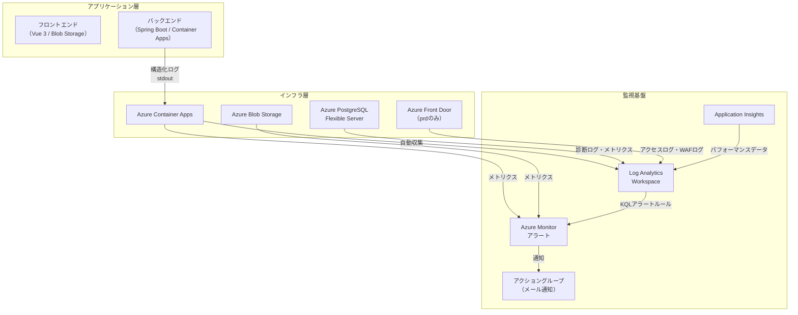
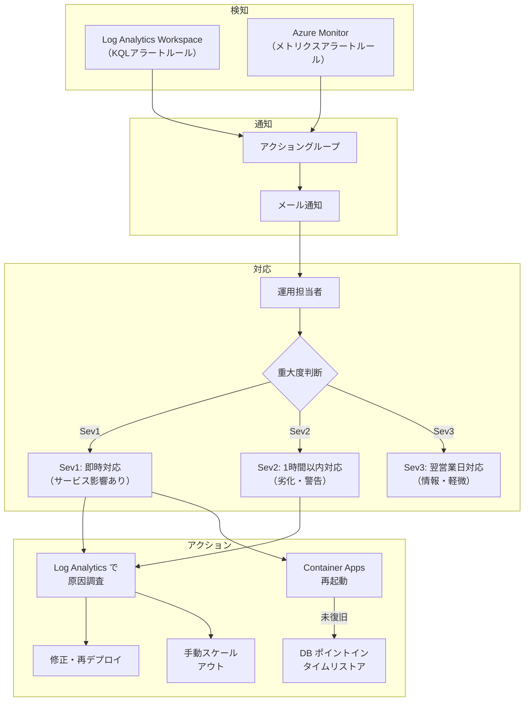
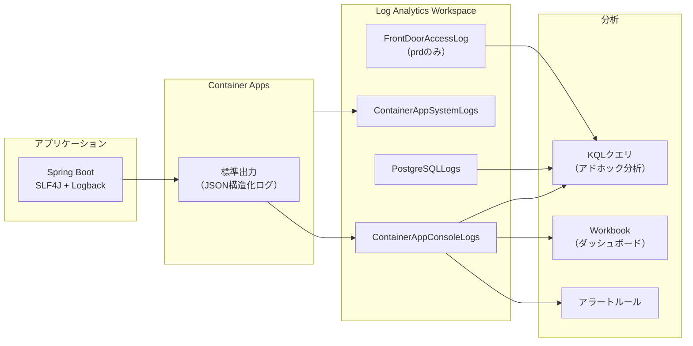
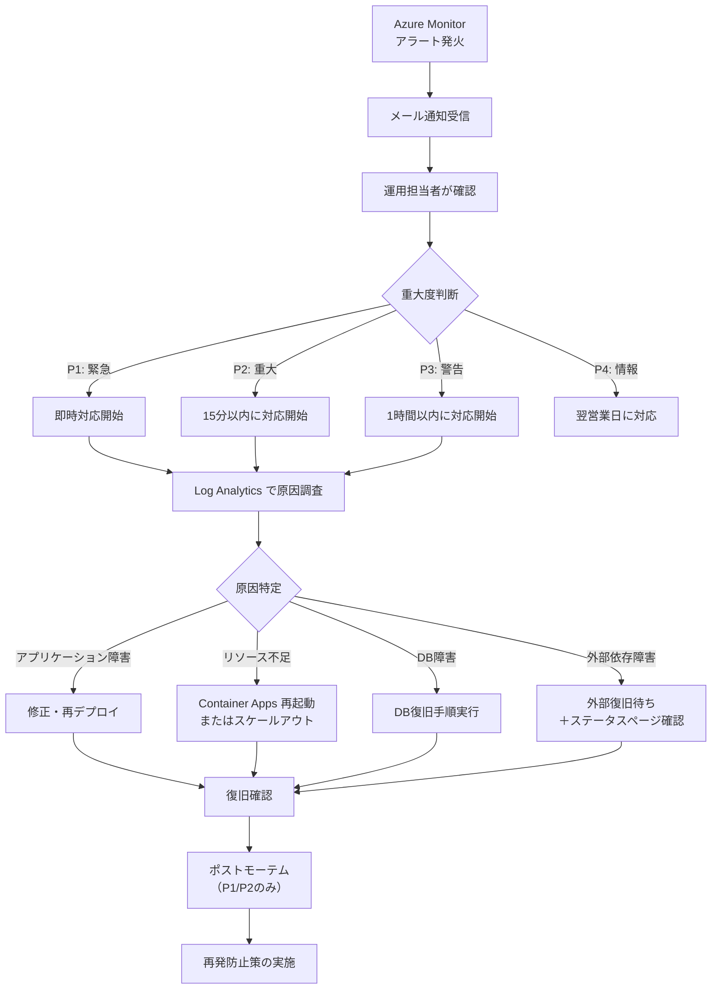

# 監視・運用設計書

> 本ドキュメントは WMS ShowCase プロジェクトの監視・運用に関する詳細設計を定義する。
> 方針・基本設計は [architecture-blueprint/11-monitoring-operations.md](../architecture-blueprint/11-monitoring-operations.md) を参照。
> 共通ログ設計は [architecture-blueprint/08-common-infrastructure.md](../architecture-blueprint/08-common-infrastructure.md) を参照。

---

## 目次

1. [監視設計（メトリクス・ログ・トレース）](#1-監視設計メトリクスログトレース)
2. [Azure Monitor / Application Insights 設計](#2-azure-monitor--application-insights-設計)
3. [アラート設計](#3-アラート設計)
4. [ヘルスチェック設計](#4-ヘルスチェック設計)
5. [ログ集約・分析設計](#5-ログ集約分析設計)
6. [SLI/SLO 定義](#6-slislo-定義)
7. [インシデント対応設計](#7-インシデント対応設計)
8. [運用手順設計](#8-運用手順設計)
9. [バックアップ運用設計](#9-バックアップ運用設計)
10. [容量管理設計](#10-容量管理設計)

---

## 1. 監視設計（メトリクス・ログ・トレース）

### 1.1 監視レイヤー全体像



### 1.2 メトリクス監視

#### 1.2.1 アプリケーションメトリクス

| メトリクス | 収集元 | 収集方法 | 単位 | 用途 |
|-----------|--------|---------|------|------|
| APIレスポンスタイム | Application Insights | 自動計測 | ms | 性能劣化検知 |
| APIリクエスト数 | Application Insights | 自動計測 | 件/分 | トラフィック監視 |
| APIエラー率 | Application Insights | 自動計測 | % | 障害検知 |
| JVMヒープ使用量 | Spring Boot Actuator | Micrometer | MB | メモリリーク検知 |
| JVM GC回数・時間 | Spring Boot Actuator | Micrometer | 回/秒 | GC圧迫検知 |
| DBコネクションプール使用数 | HikariCP | Micrometer | 本 | DB接続枯渇検知 |
| アクティブスレッド数 | Spring Boot Actuator | Micrometer | 本 | スレッド枯渇検知 |

#### 1.2.2 インフラメトリクス

| メトリクス | 収集元 | 閾値（警告） | 閾値（重大） | 用途 |
|-----------|--------|------------|------------|------|
| Container Apps CPU使用率 | Azure Monitor | 70% | 90% | スケールアウト判断 |
| Container Apps メモリ使用率 | Azure Monitor | 70% | 90% | メモリ逼迫検知 |
| Container Apps レプリカ数 | Azure Monitor | - | max到達 | スケール上限到達検知 |
| PostgreSQL CPU使用率 | Azure Monitor | 70% | 90% | DB負荷検知 |
| PostgreSQL ストレージ使用率 | Azure Monitor | 70% | 85% | ディスク枯渇予防 |
| PostgreSQL 接続数 | Azure Monitor | 80% of max | 90% of max | 接続枯渇検知 |
| Blob Storage 使用容量 | Azure Monitor | - | 10GB | コスト管理 |
| Front Door リクエスト数（prd） | Azure Monitor | - | - | トラフィック監視 |
| Front Door エラー率（prd） | Azure Monitor | 1% | 5% | CDN障害検知 |

### 1.3 ログ監視

> ログフォーマット・PIIマスキングの詳細は [architecture-blueprint/08-common-infrastructure.md](../architecture-blueprint/08-common-infrastructure.md) を参照。

#### 1.3.1 ログ分類

| ログ種別 | 出力レベル | 内容 | 保存先 |
|---------|-----------|------|--------|
| アプリケーションログ | INFO/WARN/ERROR | 業務処理の実行記録・例外情報 | Log Analytics Workspace |
| 認証ログ | INFO/WARN | ログイン成功・失敗・ロック | Log Analytics Workspace |
| 操作ログ（監査証跡） | INFO | 在庫訂正・マスタ変更等の操作記録 | Log Analytics Workspace |
| バッチ実行ログ | INFO/ERROR | 日替処理の各ステップ実行状況 | Log Analytics Workspace |
| Container Apps システムログ | - | コンテナ起動・停止・スケール | Log Analytics Workspace |
| PostgreSQL 診断ログ | - | スロークエリ・接続エラー | Log Analytics Workspace |
| Front Door アクセスログ（prd） | - | HTTPリクエスト・WAFルール適用 | Log Analytics Workspace |

#### 1.3.2 センシティブデータのマスキング

認証系API（`/api/v1/auth/**`）のリクエストボディは全てのログ出力経路（アプリケーションログ、Application Insightsテレメトリ、エラーログ）でマスキングされる。

> 実装詳細は [08-common-infrastructure.md のセンシティブデータのログマスキング](./08-common-infrastructure.md#45-センシティブデータのログマスキング) を参照。

#### 1.3.3 ログレベル運用

| 環境 | デフォルトレベル | 設定方法 | DEBUG切替手順 |
|------|----------------|---------|-------------|
| dev | DEBUG | 環境変数 `LOG_LEVEL=DEBUG` | 常時DEBUG |
| prd | INFO | 環境変数 `LOG_LEVEL=INFO` | Container Apps 環境変数を `DEBUG` に変更 → リビジョン再作成 → 調査完了後に `INFO` に戻す |

### 1.4 分散トレース

| 項目 | 設定 |
|------|------|
| **トレースID生成** | リクエストごとにUUID v4（ハイフンなし32文字Hex、例: `550e8400e29b41d4a716446655440000`）を生成（`UUID.randomUUID().toString().replace("-", "")`）。TraceIdFilter がMDCキー `traceId` に設定し、全ログに埋め込み |
| **伝播方式** | HTTPヘッダー `X-Trace-Id` でフロントエンド → バックエンド間を伝播 |
| **ログ埋め込み** | JSON構造化ログの `traceId` フィールドに出力 |
| **追跡方法** | Log Analytics で `traceId` をキーにKQLクエリで関連ログを横断検索 |

---

## 2. Azure Monitor / Application Insights 設計

### 2.1 リソース構成

| リソース | dev環境 | prd環境 | SKU/プラン |
|---------|---------|---------|-----------|
| Log Analytics Workspace | law-wms-dev | law-wms-prd | Pay-as-you-go（無料枠5GB/月） |
| Application Insights | ai-wms-dev | ai-wms-prd | ワークスペースベース |
| アクショングループ | ag-wms-dev | ag-wms-prd | メール通知 |

### 2.2 Log Analytics Workspace 設定

| 項目 | dev | prd |
|------|-----|-----|
| データ保持期間 | 30日（デフォルト・無料枠内） | 30日（デフォルト・無料枠内） |
| 日次データ上限 | 無制限（無料枠: 5GB/月） | 無制限（無料枠: 5GB/月） |
| 接続データソース | Container Apps, PostgreSQL | Container Apps, PostgreSQL, Front Door |
| リソースグループ | `rg-wms-dev`（環境と同居） | `rg-wms-prd-east`（環境と同居） |
| ライフサイクル | `terraform destroy` 時に環境と一緒に削除 | `terraform destroy` 時に環境と一緒に削除 |

> **ShowCaseプロジェクト方針**: Log Analytics WorkspaceおよびApplication Insightsは各環境のリソースグループに同居させ、`terraform destroy` 時に一緒に削除される。ShowCaseプロジェクトのためログの永続保存は不要であり、環境再構築時にログが失われることを許容する。ログの長期保存が必要になった場合は、別途リソースグループを分離する設計変更を検討すること。

### 2.3 Application Insights 設定

| 項目 | 設定値 |
|------|--------|
| SDKタイプ | Azure Monitor OpenTelemetry（Spring Boot Starter） |
| 依存関係 | `azure-spring-boot-starter-monitor`（build.gradle に追加） |
| サンプリングレート（dev） | 100%（全リクエスト記録） |
| サンプリングレート（prd） | 100%（同時接続50名程度のため全量取得可能） |
| 接続文字列 | 環境変数 `APPLICATIONINSIGHTS_CONNECTION_STRING` |
| ライブメトリクス | 有効 |
| 可用性テスト | 設定しない（Container Apps ヘルスプローブで代替） |

### 2.4 診断設定（Diagnostic Settings）

| リソース | 送信先 | 収集カテゴリ |
|---------|--------|------------|
| Container Apps | Log Analytics Workspace | ContainerAppConsoleLogs, ContainerAppSystemLogs |
| PostgreSQL Flexible Server | Log Analytics Workspace | PostgreSQLLogs, QueryStoreRuntimeStatistics |
| Front Door（prdのみ） | Log Analytics Workspace | FrontDoorAccessLog, FrontDoorHealthProbeLog, FrontDoorWebApplicationFirewallLog |
| Blob Storage | Log Analytics Workspace | StorageBlobLogs（読み取り・書き込み） |

---

## 3. アラート設計

### 3.1 アラート一覧

| No | アラート名 | 種別 | 条件 | 重大度 | 評価頻度 | 評価期間 | 通知先 |
|----|-----------|------|------|--------|---------|---------|--------|
| A-001 | ERRORログ検知 | ログアラート | ERRORレベルのログが1件以上 | Sev2（警告） | 5分 | 5分 | メール |
| A-002 | APIレスポンス遅延 | メトリクスアラート | 平均レスポンスタイム > 3秒 | Sev2（警告） | 5分 | 5分 | メール |
| A-003 | DB接続失敗 | ログアラート | DB接続エラーログ検知 | Sev1（重大） | 5分 | 5分 | メール |
| A-004 | ログイン失敗多発 | ログアラート | ログイン失敗が10件以上 / 5分 | Sev2（警告） | 5分 | 5分 | メール |
| A-005 | Container Apps CPU高負荷 | メトリクスアラート | CPU使用率 > 90% が5分継続 | Sev2（警告） | 5分 | 5分 | メール |
| A-006 | Container Apps メモリ高負荷 | メトリクスアラート | メモリ使用率 > 90% が5分継続 | Sev2（警告） | 5分 | 5分 | メール |
| A-007 | PostgreSQL CPU高負荷 | メトリクスアラート | CPU使用率 > 90% が5分継続 | Sev2（警告） | 5分 | 5分 | メール |
| A-008 | PostgreSQL ストレージ逼迫 | メトリクスアラート | ストレージ使用率 > 85% | Sev1（重大） | 1時間 | 1時間 | メール |
| A-009 | ヘルスチェック失敗 | メトリクスアラート | ヘルスプローブ連続3回失敗 | Sev1（重大） | 1分 | 3分 | メール |
| A-010 | バッチ処理失敗 | ログアラート | バッチ処理ERRORログ検知 | Sev1（重大） | 5分 | 5分 | メール |
| A-011 | APIエラー率上昇 | メトリクスアラート | 5xx エラー率 > 5% | Sev1（重大） | 5分 | 5分 | メール |
| A-012 | Front Door エラー率（prd） | メトリクスアラート | エラー率 > 5% が5分継続 | Sev1（重大） | 5分 | 5分 | メール |
| A-013 | アカウントロック発生 | ログアラート | アカウントロックイベント検知 | Sev3（情報） | 5分 | 5分 | メール |

### 3.2 アラートKQLクエリ

```kql
// A-001: ERRORログ検知
ContainerAppConsoleLogs
| where ContainerName == "wms-backend"
| where Log contains "\"level\":\"ERROR\""
| summarize ErrorCount = count() by bin(TimeGenerated, 5m)
| where ErrorCount >= 1

// A-003: DB接続失敗
ContainerAppConsoleLogs
| where ContainerName == "wms-backend"
| where Log contains "Unable to acquire JDBC Connection"
    or Log contains "Connection refused"
    or Log contains "HikariPool"
| summarize ErrorCount = count() by bin(TimeGenerated, 5m)
| where ErrorCount >= 1

// A-004: ログイン失敗多発
ContainerAppConsoleLogs
| where ContainerName == "wms-backend"
| where Log contains "\"module\":\"auth\""
| where Log contains "ログイン失敗" or Log contains "Login failed"
| summarize FailCount = count() by bin(TimeGenerated, 5m)
| where FailCount >= 10

// A-010: バッチ処理失敗
ContainerAppConsoleLogs
| where ContainerName == "wms-backend"
| where Log contains "\"module\":\"batch\""
| where Log contains "\"level\":\"ERROR\""
| summarize ErrorCount = count() by bin(TimeGenerated, 5m)
| where ErrorCount >= 1

// A-013: アカウントロック発生
ContainerAppConsoleLogs
| where ContainerName == "wms-backend"
| where Log contains "\"module\":\"auth\""
| where Log contains "アカウントロック" or Log contains "Account locked"
| summarize LockCount = count() by bin(TimeGenerated, 5m)
| where LockCount >= 1
```

### 3.3 アクショングループ設定

| 項目 | dev | prd |
|------|-----|-----|
| グループ名 | ag-wms-dev | ag-wms-prd |
| 通知タイプ | メール | メール |
| 通知先 | プロジェクト管理者メールアドレス | プロジェクト管理者メールアドレス |
| 短縮名 | wms-dev | wms-prd |

### 3.4 アラートフロー



### 3.5 エスカレーションルール

| 段階 | 条件 | アクション |
|------|------|-----------|
| L1（初動） | アラートメール受信 | 運用担当者がLog Analyticsで原因調査を開始 |
| L2（エスカレーション） | 30分以内に原因特定・復旧できない場合 | プロジェクト責任者へ連絡 |
| L3（緊急対応） | サービス完全停止が1時間継続 | DR手順（ポイントインタイムリストア等）の実行を判断 |

---

## 4. ヘルスチェック設計

### 4.1 ヘルスチェックエンドポイント

| エンドポイント | 用途 | チェック内容 | 認証 |
|--------------|------|------------|------|
| `GET /actuator/health` | Container Apps ヘルスプローブ | DB接続、ディスク容量、JVM状態 | 不要 |
| `GET /actuator/health/liveness` | ライブネスプローブ | アプリケーションプロセスの生存確認 | 不要 |
| `GET /actuator/health/readiness` | レディネスプローブ | DB接続・外部依存の準備状態 | 不要 |
| `GET /actuator/info` | アプリケーション情報 | バージョン、ビルド日時、Git情報 | 不要 |

### 4.2 Container Apps ヘルスプローブ設定

| プローブ種別 | パス | ポート | 間隔 | タイムアウト | 失敗閾値 | 成功閾値 |
|------------|------|--------|------|------------|---------|---------|
| Startup | `/actuator/health/liveness` | 8080 | 10秒 | 5秒 | 30回 | 1回 |
| Liveness | `/actuator/health/liveness` | 8080 | 30秒 | 5秒 | 3回 | 1回 |
| Readiness | `/actuator/health/readiness` | 8080 | 15秒 | 5秒 | 3回 | 1回 |

> **Startup プローブ**: Spring Bootの起動時間（JVMウォームアップ + Flyway マイグレーション）を考慮し、最大300秒（10秒 x 30回）の猶予を設定。

### 4.3 Spring Boot Actuator 設定

```yaml
# application.yml
management:
  endpoints:
    web:
      exposure:
        include: health, info
  endpoint:
    health:
      show-details: never  # 外部にDB情報等を公開しない
      probes:
        enabled: true       # liveness / readiness エンドポイント有効化
  health:
    db:
      enabled: true         # DB接続ヘルスチェック
    diskspace:
      enabled: true         # ディスク容量チェック
```

### 4.4 Front Door ヘルスプローブ（prdのみ）

| 項目 | 設定値 |
|------|--------|
| プローブパス | `/actuator/health` |
| プロトコル | HTTPS |
| 間隔 | 30秒 |
| プローブメソッド | GET |
| 成功ステータスコード | 200 |
| レイテンシ感度 | 中 |

---

## 5. ログ集約・分析設計

### 5.1 ログ収集アーキテクチャ



### 5.2 主要KQLクエリ集

```kql
// エラーログ一覧（直近1時間）
ContainerAppConsoleLogs
| where ContainerName == "wms-backend"
| where Log contains "\"level\":\"ERROR\""
| extend parsed = parse_json(Log)
| project TimeGenerated,
    Level = tostring(parsed.level),
    Logger = tostring(parsed.logger),
    Message = tostring(parsed.message),
    TraceId = tostring(parsed.traceId),
    Module = tostring(parsed.module)
| order by TimeGenerated desc
| take 100

// トレースIDでリクエスト追跡
ContainerAppConsoleLogs
| where Log contains "\"traceId\":\"<trace-id>\""
| extend parsed = parse_json(Log)
| project TimeGenerated,
    Level = tostring(parsed.level),
    Logger = tostring(parsed.logger),
    Message = tostring(parsed.message)
| order by TimeGenerated asc

// APIレスポンスタイム分析（モジュール別）
ContainerAppConsoleLogs
| where ContainerName == "wms-backend"
| where Log contains "\"level\":\"INFO\""
| extend parsed = parse_json(Log)
| where isnotempty(tostring(parsed.responseTime))
| summarize
    AvgResponseTime = avg(todouble(parsed.responseTime)),
    P95ResponseTime = percentile(todouble(parsed.responseTime), 95),
    P99ResponseTime = percentile(todouble(parsed.responseTime), 99),
    RequestCount = count()
    by Module = tostring(parsed.module), bin(TimeGenerated, 1h)
| order by TimeGenerated desc

// 認証イベント集計
ContainerAppConsoleLogs
| where ContainerName == "wms-backend"
| where Log contains "\"module\":\"auth\""
| extend parsed = parse_json(Log)
| summarize
    LoginSuccess = countif(tostring(parsed.message) contains "ログイン成功"),
    LoginFailed = countif(tostring(parsed.message) contains "ログイン失敗"),
    AccountLocked = countif(tostring(parsed.message) contains "アカウントロック")
    by bin(TimeGenerated, 1h)
| order by TimeGenerated desc

// バッチ処理実行状況
ContainerAppConsoleLogs
| where ContainerName == "wms-backend"
| where Log contains "\"module\":\"batch\""
| extend parsed = parse_json(Log)
| project TimeGenerated,
    Level = tostring(parsed.level),
    Message = tostring(parsed.message),
    TraceId = tostring(parsed.traceId)
| order by TimeGenerated desc

// PostgreSQL スロークエリ
AzureDiagnostics
| where ResourceProvider == "MICROSOFT.DBFORPOSTGRESQL"
| where Category == "QueryStoreRuntimeStatistics"
| where todouble(mean_time_s) > 1.0
| project TimeGenerated, query_id_s, mean_time_s, calls_s, db_name_s
| order by todouble(mean_time_s) desc
| take 50
```

### 5.3 Azure Monitor Workbook（ダッシュボード）

運用監視用のWorkbookを以下の構成で作成する。

| タブ名 | 表示内容 |
|--------|---------|
| Overview | APIリクエスト数推移、エラー率推移、レスポンスタイム推移（直近24時間） |
| Errors | ERRORログ一覧、エラー種別の集計（円グラフ）、モジュール別エラー件数 |
| Performance | レスポンスタイムのP50/P95/P99推移、スロークエリ一覧 |
| Authentication | ログイン成功/失敗推移、アカウントロック一覧、失敗ユーザーの集計 |
| Batch | バッチ実行履歴、各ステップの所要時間、エラー詳細 |
| Infrastructure | Container Apps CPU/メモリ推移、PostgreSQL メトリクス、レプリカ数推移 |

---

## 6. SLI/SLO 定義

### 6.1 SLI（Service Level Indicator）

| SLI ID | SLI名 | 計算式 | 計測方法 |
|--------|-------|--------|---------|
| SLI-001 | API可用性 | 成功リクエスト数 / 総リクエスト数 x 100 | Application Insights（5xxを失敗とカウント。4xxは成功扱い） |
| SLI-002 | APIレスポンスタイム | 全APIリクエストの応答時間 | Application Insights |
| SLI-003 | バッチ処理成功率 | 成功バッチ数 / 実行バッチ数 x 100 | アプリケーションログ |
| SLI-004 | ヘルスチェック成功率 | ヘルスチェック成功数 / 総チェック数 x 100 | Container Apps ヘルスプローブ |

### 6.2 SLO（Service Level Objective）

> prd環境の稼働中における目標値。Terraform Destroy期間（計画停止）は除外する。
> 非機能要件定義の要件値に基づく（[architecture-blueprint/13-non-functional-requirements.md](../architecture-blueprint/13-non-functional-requirements.md) 参照）。

| SLO ID | SLI | 目標値 | 計測期間 | エラーバジェット |
|--------|-----|--------|---------|----------------|
| SLO-001 | API可用性（SLI-001） | 99.5%以上 | 月次（稼働日ベース） | 月間稼働時間の0.5%（約2.2時間/月） |
| SLO-002 | 通常API応答時間（SLI-002） | P95 < 2秒 | 月次 | - |
| SLO-003 | 集計API応答時間（SLI-002） | P95 < 5秒 | 月次 | - |
| SLO-004 | バッチ処理成功率（SLI-003） | 99%以上 | 月次 | - |
| SLO-005 | バッチ処理時間 | 30分以内 | 各回 | - |
| SLO-006 | ヘルスチェック成功率（SLI-004） | 99.9%以上 | 月次 | - |

### 6.3 SLO計測・レポート

| 項目 | 内容 |
|------|------|
| 計測頻度 | 月次 |
| 計測方法 | Log Analytics KQLクエリで自動算出 |
| レポート先 | プロジェクト管理者 |
| SLO未達時のアクション | 根本原因分析を実施し、改善計画を策定 |

```kql
// SLO-001: 月次API可用性の計測
let startTime = startofmonth(now());
let endTime = now();
requests
| where timestamp between (startTime .. endTime)
| summarize
    TotalRequests = count(),
    SuccessRequests = countif(toint(resultCode) < 500),
    FailedRequests = countif(toint(resultCode) >= 500)
| extend Availability = round(todouble(SuccessRequests) / todouble(TotalRequests) * 100, 2)
| project TotalRequests, SuccessRequests, FailedRequests, Availability
```

---

## 7. インシデント対応設計

### 7.1 インシデント分類

| 重大度 | 定義 | 影響範囲 | 対応開始目標 | 復旧目標 |
|--------|------|---------|------------|---------|
| P1（緊急） | サービス全停止、データ損失リスク | 全ユーザー影響 | 即時 | 1時間以内 |
| P2（重大） | 主要機能停止、性能大幅劣化 | 多数ユーザー影響 | 15分以内 | 4時間以内 |
| P3（警告） | 一部機能障害、性能軽微な劣化 | 一部ユーザー影響 | 1時間以内 | 翌営業日 |
| P4（情報） | 軽微な問題、将来リスク | 影響なし〜軽微 | 翌営業日 | 次回リリース |

### 7.2 インシデント対応フロー



### 7.3 想定インシデントシナリオと対応手順

#### シナリオ1: アプリケーションエラー多発

| 手順 | アクション |
|------|-----------|
| 1 | Log Analytics で ERRORログを確認（KQL: A-001クエリ） |
| 2 | traceIdで関連ログを追跡し、エラーの原因を特定 |
| 3 | 原因に応じて修正パッチを作成・デプロイ、またはContainer Apps再起動 |
| 4 | アラートが解消されたことを確認 |

#### シナリオ2: DB接続障害

| 手順 | アクション |
|------|-----------|
| 1 | PostgreSQL のステータスを Azure Portal で確認 |
| 2 | PostgreSQL が停止中の場合 → `az postgres flexible-server start` で起動 |
| 3 | 接続数上限の場合 → 不要な接続を切断、HikariCP設定の見直し |
| 4 | データ破損の場合 → ポイントインタイムリストアを実行 |

#### シナリオ3: レスポンスタイム劣化

| 手順 | アクション |
|------|-----------|
| 1 | Application Insights でレスポンスタイムの推移を確認 |
| 2 | スロークエリの有無を確認（PostgreSQL診断ログ） |
| 3 | Container Apps のCPU/メモリ使用率を確認 |
| 4 | スロークエリ → SQLチューニング / インデックス追加 |
| 5 | リソース不足 → Container Apps のスケール上限引き上げ |

#### シナリオ4: バッチ処理失敗

| 手順 | アクション |
|------|-----------|
| 1 | バッチ実行ログでどのステップで失敗したかを特定 |
| 2 | traceIdで詳細エラーを追跡 |
| 3 | 原因を修正後、バッチ管理画面から再実行（完了済みステップはスキップされる） |
| 4 | 再実行結果を確認 |

### 7.4 ポストモーテムテンプレート

P1/P2インシデント発生時は以下のフォーマットでポストモーテムを作成する。

```
# インシデントポストモーテム

## 基本情報
- インシデントID: INC-YYYYMMDD-NNN
- 発生日時:
- 復旧日時:
- 影響範囲:
- 重大度: P1 / P2

## タイムライン
| 時刻 | イベント |
|------|---------|

## 根本原因
（原因の詳細記述）

## 影響
- 影響を受けたユーザー数:
- 影響を受けた業務:
- データ損失の有無:

## 対応内容
（実施した復旧手順）

## 再発防止策
| No | 対策 | 担当 | 期限 |
|----|------|------|------|

## 教訓
（得られた知見）
```

---

## 8. 運用手順設計

### 8.1 定常運用

#### 8.1.1 日次運用

| 時刻 | 作業内容 | 担当 | 手順 |
|------|---------|------|------|
| 業務開始前 | アラートメール確認。未対応アラートの有無を確認 | 運用担当者 | メール受信ボックスを確認 |
| 業務開始前 | Azure Monitor ダッシュボード（Workbook）で異常の有無を確認 | 運用担当者 | Azure Portal → Workbook → Overview タブ |
| 業務終了後 | バッチ処理（日替処理）の実行結果を確認 | 運用担当者 | バッチ管理画面 → 実行履歴 |

#### 8.1.2 週次運用

| 作業内容 | 担当 | 手順 |
|---------|------|------|
| SLO達成状況の確認（簡易） | 運用担当者 | Workbook の Overview タブでエラー率・レスポンスタイムの週次推移を確認 |
| PostgreSQL ストレージ使用量の確認 | 運用担当者 | Azure Portal → PostgreSQL → メトリクス → ストレージ使用量 |
| Log Analytics データ取り込み量の確認 | 運用担当者 | Azure Portal → Log Analytics → 使用量と推定コスト |

#### 8.1.3 月次運用

| 作業内容 | 担当 | 手順 |
|---------|------|------|
| SLOレポートの作成 | 運用担当者 | KQLクエリでSLI値を算出し、レポートを作成 |
| Azure利用コストの確認 | プロジェクト管理者 | Azure Cost Management で月次コストを確認 |
| Dependabotセキュリティアラートの確認・対応 | 開発担当者 | GitHub → Security → Dependabot alerts |

### 8.2 Terraform Deploy/Destroy 運用

> 詳細は [architecture-blueprint/06-infrastructure-architecture.md](../architecture-blueprint/06-infrastructure-architecture.md) を参照。

#### 8.2.1 デプロイ手順

| 手順 | コマンド / 操作 | 確認事項 |
|------|----------------|---------|
| 1. Terraform plan | `terraform plan -var-file=terraform.tfvars` | 変更内容を確認 |
| 2. Terraform apply | `terraform apply -var-file=terraform.tfvars` | リソース作成完了を確認 |
| 3. ヘルスチェック | `curl https://<backend-url>/actuator/health` | `{"status":"UP"}` を確認 |
| 4. フロントエンド確認 | ブラウザでフロントエンドURLにアクセス | ログイン画面が表示されることを確認 |

#### 8.2.2 Destroy手順

| 手順 | コマンド / 操作 | 確認事項 |
|------|----------------|---------|
| 1. 利用者への通知 | メール等で停止を周知 | - |
| 2. DBバックアップ確認 | Azure Portal でバックアップ状態を確認 | 最新バックアップが取得されていること |
| 3. Terraform destroy | `terraform destroy -var-file=terraform.tfvars` | リソース削除完了を確認 |

### 8.3 DB停止・起動運用

> コスト削減のため、未使用時はPostgreSQL Flexible Serverを手動停止する。

| 操作 | コマンド | 備考 |
|------|---------|------|
| 停止 | `az postgres flexible-server stop --resource-group <rg> --name <server>` | 7日間連続停止で自動再起動される |
| 起動 | `az postgres flexible-server start --resource-group <rg> --name <server>` | 起動まで1〜2分 |
| 状態確認 | `az postgres flexible-server show --resource-group <rg> --name <server> --query state` | `Ready` / `Stopped` |

> 7日間連続停止でAzureが自動再起動するため、長期未使用時は定期的に手動停止が必要。

### 8.4 ログレベル一時変更手順

本番環境でDEBUGログが必要な場合の手順。

| 手順 | 操作 | 備考 |
|------|------|------|
| 1 | Container Apps の環境変数 `LOG_LEVEL` を `DEBUG` に変更 | Azure Portal または Azure CLI |
| 2 | 新しいリビジョンを作成して反映 | `az containerapp update` |
| 3 | Log Analytics でDEBUGログを確認し調査 | - |
| 4 | 調査完了後、`LOG_LEVEL` を `INFO` に戻す | 必ず元に戻すこと（ログ量増大防止） |
| 5 | 新しいリビジョンを作成して反映 | - |

### 8.5 Container Apps 緊急再起動手順

| 手順 | コマンド | 備考 |
|------|---------|------|
| 1. 現在のリビジョン確認 | `az containerapp revision list -n ca-wms-backend -g <rg> -o table` | - |
| 2. リビジョン再起動 | `az containerapp revision restart -n ca-wms-backend -g <rg> --revision <revision-name>` | - |
| 3. ヘルスチェック確認 | `curl https://<backend-url>/actuator/health` | `{"status":"UP"}` を確認 |

---

## 9. バックアップ運用設計

### 9.1 バックアップ対象と方式

| 対象 | 方式 | 頻度 | 保持期間 | リストア方法 |
|------|------|------|---------|------------|
| PostgreSQL データ | Azure Flexible Server 自動バックアップ（ポイントインタイムリストア） | 自動（差分バックアップ） | 7日間 | 任意時点へのリストア |
| PostgreSQL データ（prd） | Geo-redundant backup | 自動 | 7日間 | クロスリージョンリストア可能 |
| Blob Storage（iffiles） | LRS（dev）/ GRS（prd） | 自動（冗長化） | - | Azure冗長性で保護 |
| Blob Storage（$web） | LRS（dev）/ GRS（prd） | 自動（冗長化） | - | 再デプロイで復元 |
| 業務データアーカイブ | 日替処理でバックアップテーブルに複製 | 日次（バッチ処理） | 無期限 | バックアップテーブルから復元 |
| Terraform state | Azure Blob Storage（LRS） | 自動（state更新時） | - | Blobバージョニングで復元 |
| ソースコード | GitHub | プッシュ時 | 無期限 | Gitから復元 |
| ACRコンテナイメージ | Azure Container Registry | デプロイ時 | タグ付きイメージを保持 | ACRからプル |

### 9.2 PostgreSQL リストア手順

| 手順 | コマンド / 操作 | 備考 |
|------|----------------|------|
| 1. リストアポイント決定 | Azure Portal → PostgreSQL → バックアップ で利用可能な時点を確認 | RPO: 最大1時間 |
| 2. リストア実行 | `az postgres flexible-server restore --resource-group <rg> --name <new-server> --source-server <source> --restore-time "2026-03-12T10:00:00Z"` | 新しいサーバーとしてリストア |
| 3. 接続文字列更新 | Container Apps の環境変数にリストア先サーバーの接続情報を設定 | - |
| 4. データ整合性確認 | アプリケーションから主要テーブルのレコード数・最新データを確認 | - |
| 5. 旧サーバー削除 | 不要になった旧サーバーを削除（確認後） | - |

### 9.3 バックアップ監視

| 監視項目 | 確認方法 | 頻度 |
|---------|---------|------|
| PostgreSQL自動バックアップの状態 | Azure Portal → PostgreSQL → バックアップ | 週次 |
| 最新バックアップのタイムスタンプ | Azure Portal で確認 | 週次 |
| Blob Storage の冗長性状態 | Azure Portal → Storage Account → データ保護 | 月次 |

---

## 10. 容量管理設計

### 10.1 容量見積もり

#### 10.1.1 データベース容量

| データ種別 | 見積もり根拠 | 月間増加量（概算） | 備考 |
|-----------|------------|-----------------|------|
| マスタデータ | 取引先100社、商品10,000点、倉庫5拠点 | 微増（新規登録時のみ） | 論理削除のため減少しない |
| 入荷トランデータ | 1日50件 x 22営業日 | 約1,100件/月 | 2か月超過分はバックアップテーブルへ移行 |
| 出荷トランデータ | 1日100件 x 22営業日 | 約2,200件/月 | 2か月超過分はバックアップテーブルへ移行 |
| 在庫データ | ロケーション x 商品の組み合わせ | 約10,000件（定常状態） | 大きな増減なし |
| バックアップテーブル | アーカイブ済みトランデータ | 累積約3,300件/月 | 無期限保持 |
| バッチ実行履歴 | 1日1件 | 約22件/月 | - |

> PostgreSQL B1ms: ストレージ 32GB。上記見積もりでは年間1GB未満の増加を想定。ストレージ逼迫のリスクは低い。

#### 10.1.2 Log Analytics 容量

| データソース | 月間データ量（概算） | 備考 |
|------------|-----------------|------|
| Container Apps コンソールログ | 1〜2GB/月 | INFOレベル想定 |
| Container Apps システムログ | 0.1GB/月 | - |
| PostgreSQL 診断ログ | 0.1〜0.5GB/月 | スロークエリログ含む |
| Front Door ログ（prdのみ） | 0.5〜1GB/月 | アクセスログ + WAFログ |
| **合計** | **2〜4GB/月** | 無料枠5GB/月以内に収まる見込み |

> DEBUGレベルに変更した場合はログ量が大幅に増加するため、調査完了後は速やかにINFOに戻すこと。

#### 10.1.3 Blob Storage 容量

| コンテナ | 月間増加量（概算） | 備考 |
|---------|-----------------|------|
| `$web`（フロントエンド） | 10〜50MB（ビルドごと） | デプロイ時に上書き |
| `iffiles/pending` | 一時的（取り込み後にprocessedへ移動） | - |
| `iffiles/processed` | 0.5〜1MB/月 | 取り込み済みCSVファイル |

### 10.2 容量監視と閾値

| リソース | メトリクス | 警告閾値 | 重大閾値 | アクション |
|---------|-----------|---------|---------|-----------|
| PostgreSQL ストレージ | storage_percent | 70% | 85% | ストレージ拡張の検討 |
| Log Analytics | 月間取り込み量 | 4GB/月 | 4.5GB/月 | ログレベル・サンプリング見直し |
| Blob Storage | 総使用容量 | - | 10GB | 不要ファイルの整理 |

### 10.3 容量管理サイクル

| 頻度 | 作業内容 |
|------|---------|
| 月次 | PostgreSQL ストレージ使用率の確認。Log Analytics データ取り込み量の確認 |
| 四半期 | 容量トレンドの分析。6か月後の容量予測。必要に応じてスケールアッププランの策定 |
| 年次 | ストレージプラン・SKUの見直し。バックアップテーブルの容量確認と長期方針の検討 |

---

## 付録

### A. Terraform リソース定義（監視関連）

監視関連リソースは Terraform で以下のモジュールに定義する。

```
infra/
├── modules/
│   ├── monitoring/
│   │   ├── main.tf          # Log Analytics Workspace, Application Insights, アクショングループ
│   │   ├── alerts.tf        # アラートルール定義
│   │   ├── variables.tf
│   │   └── outputs.tf
│   └── ...
```

### B. 環境変数一覧（監視関連）

| 環境変数 | 説明 | dev | prd |
|---------|------|-----|-----|
| `LOG_LEVEL` | アプリケーションログレベル | DEBUG | INFO |
| `APPLICATIONINSIGHTS_CONNECTION_STRING` | Application Insights接続文字列 | (自動設定) | (自動設定) |

### C. 用語定義

| 用語 | 定義 |
|------|------|
| SLI | Service Level Indicator。サービス品質を測る指標 |
| SLO | Service Level Objective。SLIに対する目標値 |
| エラーバジェット | SLO目標から逆算した許容障害時間 |
| ポストモーテム | インシデント発生後の振り返り・根本原因分析 |
| KQL | Kusto Query Language。Log Analytics のクエリ言語 |
| RTO | Recovery Time Objective。目標復旧時間 |
| RPO | Recovery Point Objective。目標復旧地点（許容データ損失時間） |
