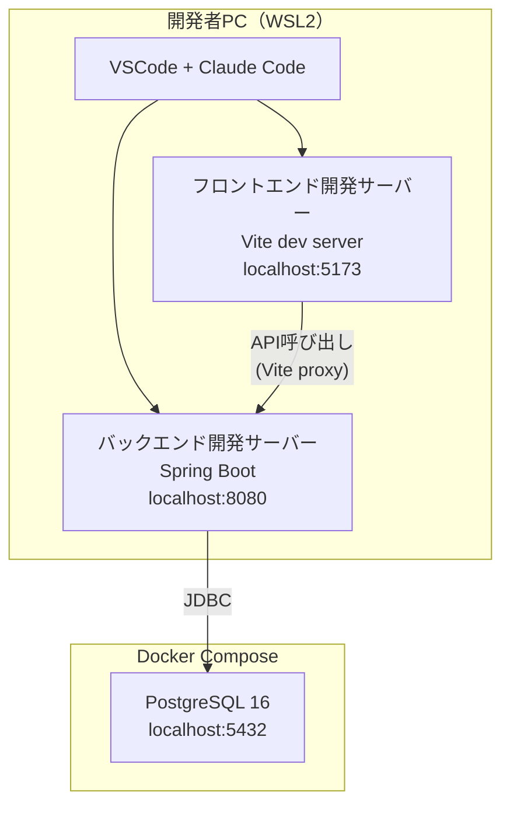
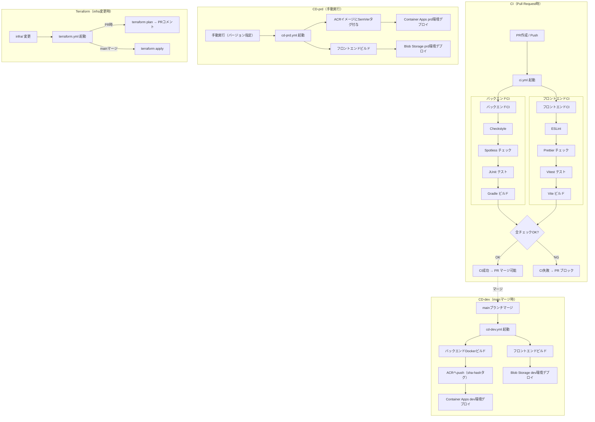
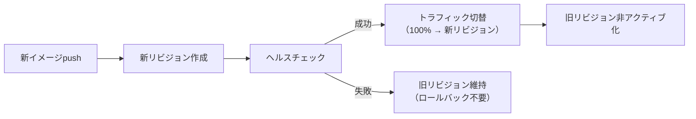
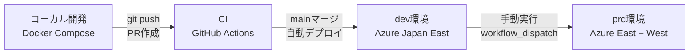
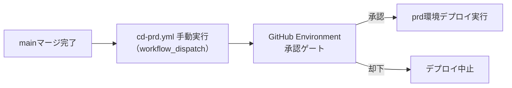
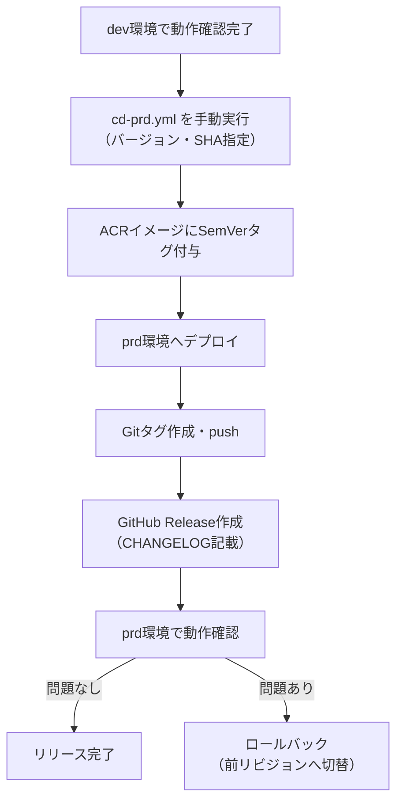

# 開発・デプロイ設計書

> 対象システム: WMS（倉庫管理システム）
> 参照ブループリント: `docs/architecture-blueprint/12-development-deploy.md`

---

## 目次

1. [開発環境セットアップ設計](#1-開発環境セットアップ設計)
2. [Git ブランチ戦略設計](#2-git-ブランチ戦略設計)
3. [CI/CD パイプライン設計](#3-cicd-パイプライン設計)
4. [ビルドプロセス設計](#4-ビルドプロセス設計)
5. [コンテナイメージビルド設計](#5-コンテナイメージビルド設計)
6. [デプロイ戦略設計](#6-デプロイ戦略設計)
7. [環境プロモーション設計](#7-環境プロモーション設計)
8. [テスト自動化設計](#8-テスト自動化設計)
9. [コード品質管理設計](#9-コード品質管理設計)
10. [リリース管理設計](#10-リリース管理設計)

---

## 1. 開発環境セットアップ設計

### 1.1 前提ソフトウェア

| ソフトウェア | バージョン | 用途 |
|------------|-----------|------|
| **WSL2** | Ubuntu 22.04+ | Linux開発環境 |
| **Docker Desktop** | 最新安定版 | コンテナ実行（WSL2バックエンド） |
| **Java** | 21（LTS） | バックエンドビルド・実行 |
| **Node.js** | 20（LTS） | フロントエンドビルド |
| **Git** | 最新安定版 | バージョン管理 |
| **VSCode** | 最新安定版 | IDE |
| **Claude Code** | 最新安定版 | AI支援開発 |

### 1.2 ローカル開発環境構成図



### 1.3 Docker Compose（ローカル開発用）

```yaml
# docker-compose.yml
services:
  postgres:
    image: postgres:16
    container_name: wms-postgres
    environment:
      POSTGRES_DB: wms
      POSTGRES_USER: wms
      POSTGRES_PASSWORD: wms
      TZ: Asia/Tokyo
    ports:
      - "5432:5432"
    volumes:
      - postgres_data:/var/lib/postgresql/data
    healthcheck:
      test: ["CMD-SHELL", "pg_isready -U wms"]
      interval: 10s
      timeout: 5s
      retries: 5

volumes:
  postgres_data:
```

### 1.4 環境変数管理

| 環境 | 管理方法 | 対象ファイル |
|------|---------|------------|
| **ローカル** | `.env` ファイル（`.gitignore` 対象） | `backend/.env`, `frontend/.env.local` |
| **dev / prd** | Azure Container Apps 環境変数 | GitHub Actions でセット |
| **シークレット** | GitHub Actions Secrets | ACR認証情報・Azure認証情報等 |

#### ローカル環境変数テンプレート

バックエンド（`backend/.env.example`）:
```properties
SPRING_DATASOURCE_URL=jdbc:postgresql://localhost:5432/wms
SPRING_DATASOURCE_USERNAME=wms
SPRING_DATASOURCE_PASSWORD=wms
JWT_SECRET=local-dev-secret-key-minimum-32-characters-long
LOG_LEVEL=DEBUG
```

フロントエンド（`frontend/.env.example`）:
```properties
VITE_API_BASE_URL=http://localhost:8080
```

### 1.5 初回セットアップ手順

```bash
# 1. リポジトリクローン
git clone https://github.com/<org>/wms.git
cd wms

# 2. Docker Compose 起動（PostgreSQL）
docker compose up -d

# 3. バックエンド起動
cd backend
cp .env.example .env
./gradlew bootRun

# 4. フロントエンド起動（別ターミナル）
cd frontend
cp .env.example .env.local
npm install
npm run dev
```

---

## 2. Git ブランチ戦略設計

### 2.1 ブランチ構成

```mermaid
gitgraph
    commit id: "initial"
    branch feature/12_inventory
    checkout feature/12_inventory
    commit id: "feat: add inventory model"
    commit id: "feat: add inventory API"
    checkout main
    merge feature/12_inventory id: "PR #12 merge"
    branch fix/34_login-error
    checkout fix/34_login-error
    commit id: "fix: login token refresh"
    checkout main
    merge fix/34_login-error id: "PR #34 merge"
    commit id: "v1.0.0" tag: "v1.0.0"
```

### 2.2 ブランチ命名規則

| ブランチ種別 | パターン | 例 | 用途 |
|------------|---------|-----|------|
| **メイン** | `main` | - | 本番相当コード |
| **機能開発** | `feature/{Issue#}_{説明}` | `feature/12_inventory-management` | 新機能実装 |
| **バグ修正** | `fix/{Issue#}_{説明}` | `fix/34_login-error` | 不具合修正 |
| **ドキュメント** | `docs/{Issue#}_{説明}` | `docs/5_update-readme` | ドキュメント修正 |

### 2.3 ワークフロー

1. GitHub Issue を起票する（要件・タスクを記録）
2. Issue番号を含むブランチを作成する
3. ブランチ上で開発・コミットする
4. PRを作成し、CIが通ることを確認する
5. レビュー後、mainブランチにマージする（Squash Merge推奨）
6. マージ後、featureブランチを削除する

### 2.4 ブランチ保護ルール（main）

| 設定項目 | 値 | 備考 |
|---------|-----|------|
| **Require status checks** | 有効 | CI構築後に適用 |
| **Required checks** | `ci` | ci.yml の完了を必須化 |
| **Require pull request** | 有効 | 直接pushを禁止 |
| **Required approvals** | 0 | 個人開発のためレビュー不要（将来変更可） |
| **Delete branch on merge** | 有効 | マージ済みブランチの自動削除 |

### 2.5 コミットメッセージ規約

[Conventional Commits](https://www.conventionalcommits.org/) に準拠する。

```
<type>(<scope>): <日本語の説明> / <English description>

例:
feat(inventory): 在庫一覧APIを実装 / Implement inventory list API
fix(auth): トークンリフレッシュの競合を修正 / Fix token refresh race condition
docs(api): API設計書を更新 / Update API design document
```

| type | 用途 |
|------|------|
| `feat` | 新機能 |
| `fix` | バグ修正 |
| `docs` | ドキュメント |
| `refactor` | リファクタリング |
| `test` | テスト追加・修正 |
| `ci` | CI/CD設定変更 |
| `chore` | その他（依存更新等） |

---

## 3. CI/CD パイプライン設計

### 3.1 全体フロー



### 3.2 GitHub Actions ワークフロー一覧

| ファイル | トリガー | 処理概要 | 実行時間目安 |
|---------|---------|---------|------------|
| `ci.yml` | PR作成・Push | Lint + Format + Test + Build | 3〜5分 |
| `cd-dev.yml` | mainブランチマージ | dev環境へ自動デプロイ | 5〜8分 |
| `cd-prd.yml` | 手動（workflow_dispatch） | prd環境へ手動デプロイ | 5〜8分 |
| `terraform.yml` | `infra/` 配下の変更 | Terraform plan/apply | 2〜5分 |

### 3.3 GitHub Actions Secrets

| Secret名 | 用途 | 設定タイミング |
|----------|------|-------------|
| `AZURE_CREDENTIALS` | Azure サービスプリンシパル（JSON） | 初回構築時。※OIDC Federated Credential（Workload Identity Federation）への移行は見送り。ShowCaseプロジェクトのため環境の作成・破棄が頻繁であり、Entra ID側のFederated Credential維持コストに見合わない |
| `ACR_LOGIN_SERVER` | ACRのログインサーバーURL | 初回構築時 |
| `ACR_USERNAME` | ACR管理者ユーザー名 | 初回構築時 |
| `ACR_PASSWORD` | ACR管理者パスワード | 初回構築時 |
| `ARM_CLIENT_ID` | Terraform用SP クライアントID | 初回構築時 |
| `ARM_CLIENT_SECRET` | Terraform用SP シークレット | 初回構築時 |
| `ARM_SUBSCRIPTION_ID` | Terraform対象サブスクリプションID | 初回構築時 |
| `ARM_TENANT_ID` | Azure AD テナントID | 初回構築時 |
| `DEV_DB_PASSWORD` | dev環境のDB接続パスワード | dev環境構築時 |
| `PRD_DB_PASSWORD` | prd環境のDB接続パスワード | prd環境構築時 |
| `JWT_SECRET_DEV` | dev環境のJWTシークレット | dev環境構築時 |
| `JWT_SECRET_PRD` | prd環境のJWTシークレット | prd環境構築時 |

> **`AZURE_CREDENTIALS` と `ARM_*` の使い分け:**
> - **CI/CD（cd-dev.yml / cd-prd.yml）**: `AZURE_CREDENTIALS`（Azure CLI認証用のJSON一括形式）
> - **Terraform（terraform.yml）**: `ARM_CLIENT_ID` / `ARM_CLIENT_SECRET` / `ARM_SUBSCRIPTION_ID` / `ARM_TENANT_ID`（Terraform AzureRM providerが要求する個別4変数）

### 3.3a GitHub Actions Variables

GitHub Actions の Repository Variables（`vars.*`）で管理する非機密値の一覧。

| Variable名 | 用途 | 設定タイミング |
|------------|------|-------------|
| `CONTAINER_APPS_DOMAIN` | dev Container Appsドメイン | Terraform apply後に手動設定 |
| `PRD_API_BASE_URL` | prd APIベースURL | Terraform apply後に手動設定 |
| `PRD_FRONTEND_URL` | prd フロントエンドURL | Terraform apply後に手動設定 |

> これらの値はTerraform outputから取得し、GitHub リポジトリの Settings → Secrets and variables → Actions → Variables タブで設定する。Terraform Destroy/Apply でインフラを再作成した場合は値の再設定が必要。

### 3.4 CI ワークフロー詳細（ci.yml）

```yaml
# .github/workflows/ci.yml
name: CI

on:
  pull_request:
    branches: [main]
    paths-ignore:
      - 'docs/**'
      - '*.md'
      - 'infra/**'

concurrency:
  group: ci-${{ github.ref }}
  cancel-in-progress: true

jobs:
  backend:
    name: Backend CI
    runs-on: ubuntu-latest
    defaults:
      run:
        working-directory: backend

    services:
      postgres:
        image: postgres:16
        env:
          POSTGRES_DB: wms_test
          POSTGRES_USER: wms
          POSTGRES_PASSWORD: wms
        ports:
          - 5432:5432
        options: >-
          --health-cmd pg_isready
          --health-interval 10s
          --health-timeout 5s
          --health-retries 5

    steps:
      - uses: actions/checkout@v4

      - name: Set up JDK 21
        uses: actions/setup-java@v4
        with:
          java-version: '21'
          distribution: 'temurin'
          cache: 'gradle'

      - name: Grant execute permission for gradlew
        run: chmod +x gradlew

      - name: Generate API code from OpenAPI
        run: ./gradlew openApiGenerate

      - name: Checkstyle
        run: ./gradlew checkstyleMain checkstyleTest

      - name: Spotless check
        run: ./gradlew spotlessCheck

      - name: Run tests
        run: ./gradlew test
        env:
          SPRING_DATASOURCE_URL: jdbc:postgresql://localhost:5432/wms_test
          SPRING_DATASOURCE_USERNAME: wms
          SPRING_DATASOURCE_PASSWORD: wms

      - name: Build
        run: ./gradlew bootJar

      - name: Upload test results
        if: always()
        uses: actions/upload-artifact@v4
        with:
          name: backend-test-results
          path: backend/build/reports/tests/
          retention-days: 7

  frontend:
    name: Frontend CI
    runs-on: ubuntu-latest
    defaults:
      run:
        working-directory: frontend

    steps:
      - uses: actions/checkout@v4

      - name: Set up Node.js
        uses: actions/setup-node@v4
        with:
          node-version: '20'
          cache: 'npm'
          cache-dependency-path: frontend/package-lock.json

      - name: Install dependencies
        run: npm ci

      - name: OpenAPI Lint
        run: npx @redocly/cli lint ../openapi/wms-api.yaml

      - name: ESLint
        run: npm run lint

      - name: Prettier check
        run: npm run format:check

      - name: Run tests
        run: npm run test:run

      - name: Build
        run: npm run build

      - name: Upload test results
        if: always()
        uses: actions/upload-artifact@v4
        with:
          name: frontend-test-results
          path: frontend/coverage/
          retention-days: 7
```

### 3.5 CD-dev ワークフロー詳細（cd-dev.yml）

> **環境変数管理の方針:** Container Appsの環境変数・シークレットはTerraformで定義・管理する。CD workflowではコンテナイメージの更新のみ行い、環境変数の変更はTerraform applyで反映する。

```yaml
# .github/workflows/cd-dev.yml
name: CD - dev

on:
  push:
    branches: [main]
    paths-ignore:
      - 'docs/**'
      - '*.md'
      - 'infra/**'

env:
  ACR_LOGIN_SERVER: ${{ secrets.ACR_LOGIN_SERVER }}
  IMAGE_NAME: wms-backend
  RESOURCE_GROUP: rg-wms-dev
  CONTAINER_APP_NAME: ca-wms-backend-dev
  STORAGE_ACCOUNT: stwmsdev

jobs:
  build-and-deploy-backend:
    name: Build & Deploy Backend
    runs-on: ubuntu-latest

    steps:
      - uses: actions/checkout@v4

      - name: Azure Login
        uses: azure/login@v2
        with:
          creds: ${{ secrets.AZURE_CREDENTIALS }}

      - name: ACR Login
        uses: azure/docker-login@v2
        with:
          login-server: ${{ secrets.ACR_LOGIN_SERVER }}
          username: ${{ secrets.ACR_USERNAME }}
          password: ${{ secrets.ACR_PASSWORD }}

      - name: Set image tag
        run: echo "IMAGE_TAG=sha-$(git rev-parse --short HEAD)" >> $GITHUB_ENV

      - name: Build and push Docker image
        run: |
          docker build -t $ACR_LOGIN_SERVER/$IMAGE_NAME:$IMAGE_TAG ./backend
          docker push $ACR_LOGIN_SERVER/$IMAGE_NAME:$IMAGE_TAG

      - name: Deploy to Container Apps
        uses: azure/container-apps-deploy-action@v2
        with:
          resourceGroup: ${{ env.RESOURCE_GROUP }}
          containerAppName: ${{ env.CONTAINER_APP_NAME }}
          imageToDeploy: ${{ env.ACR_LOGIN_SERVER }}/${{ env.IMAGE_NAME }}:${{ env.IMAGE_TAG }}

  build-and-deploy-frontend:
    name: Build & Deploy Frontend
    runs-on: ubuntu-latest

    steps:
      - uses: actions/checkout@v4

      - name: Set up Node.js
        uses: actions/setup-node@v4
        with:
          node-version: '20'
          cache: 'npm'
          cache-dependency-path: frontend/package-lock.json

      - name: Install dependencies
        run: cd frontend && npm ci

      - name: Build
        run: cd frontend && npm run build
        env:
          VITE_API_BASE_URL: https://ca-wms-backend-dev.${{ vars.CONTAINER_APPS_DOMAIN }}

      - name: Azure Login
        uses: azure/login@v2
        with:
          creds: ${{ secrets.AZURE_CREDENTIALS }}

      - name: Deploy to Blob Storage
        run: |
          az storage blob upload-batch \
            --account-name $STORAGE_ACCOUNT \
            --source frontend/dist \
            --destination '$web' \
            --overwrite
```

### 3.6 CD-prd ワークフロー詳細（cd-prd.yml）

> **環境変数管理の方針:** Container Appsの環境変数・シークレットはTerraformで定義・管理する。CD workflowではコンテナイメージの更新のみ行い、環境変数の変更はTerraform applyで反映する。

```yaml
# .github/workflows/cd-prd.yml
name: CD - prd

on:
  workflow_dispatch:
    inputs:
      version:
        description: 'Release version (SemVer, e.g., v1.0.0)'
        required: true
        type: string
      source_sha:
        description: 'Source commit SHA (short hash from dev deployment)'
        required: true
        type: string

env:
  ACR_LOGIN_SERVER: ${{ secrets.ACR_LOGIN_SERVER }}
  IMAGE_NAME: wms-backend
  RESOURCE_GROUP_EAST: rg-wms-prd-east
  RESOURCE_GROUP_WEST: rg-wms-prd-west
  CONTAINER_APP_NAME_EAST: ca-wms-backend-prd-east
  CONTAINER_APP_NAME_WEST: ca-wms-backend-prd-west
  STORAGE_ACCOUNT: stwmsprd

jobs:
  tag-and-deploy:
    name: Tag & Deploy to prd
    runs-on: ubuntu-latest
    environment: production

    steps:
      - uses: actions/checkout@v4

      - name: Azure Login
        uses: azure/login@v2
        with:
          creds: ${{ secrets.AZURE_CREDENTIALS }}

      - name: ACR Login
        uses: azure/docker-login@v2
        with:
          login-server: ${{ secrets.ACR_LOGIN_SERVER }}
          username: ${{ secrets.ACR_USERNAME }}
          password: ${{ secrets.ACR_PASSWORD }}

      - name: Re-tag image with SemVer
        run: |
          SOURCE_TAG="sha-${{ inputs.source_sha }}"
          TARGET_TAG="${{ inputs.version }}"
          docker pull $ACR_LOGIN_SERVER/$IMAGE_NAME:$SOURCE_TAG
          docker tag $ACR_LOGIN_SERVER/$IMAGE_NAME:$SOURCE_TAG $ACR_LOGIN_SERVER/$IMAGE_NAME:$TARGET_TAG
          docker push $ACR_LOGIN_SERVER/$IMAGE_NAME:$TARGET_TAG

      - name: Deploy to Container Apps (East)
        uses: azure/container-apps-deploy-action@v2
        with:
          resourceGroup: ${{ env.RESOURCE_GROUP_EAST }}
          containerAppName: ${{ env.CONTAINER_APP_NAME_EAST }}
          imageToDeploy: ${{ env.ACR_LOGIN_SERVER }}/${{ env.IMAGE_NAME }}:${{ inputs.version }}

      - name: Deploy to Container Apps (West)
        uses: azure/container-apps-deploy-action@v2
        with:
          resourceGroup: ${{ env.RESOURCE_GROUP_WEST }}
          containerAppName: ${{ env.CONTAINER_APP_NAME_WEST }}
          imageToDeploy: ${{ env.ACR_LOGIN_SERVER }}/${{ env.IMAGE_NAME }}:${{ inputs.version }}

  build-and-deploy-frontend:
    name: Build & Deploy Frontend to prd
    runs-on: ubuntu-latest
    environment: production

    steps:
      - uses: actions/checkout@v4
        with:
          ref: ${{ inputs.source_sha }}

      - name: Set up Node.js
        uses: actions/setup-node@v4
        with:
          node-version: '20'
          cache: 'npm'
          cache-dependency-path: frontend/package-lock.json

      - name: Install dependencies
        run: cd frontend && npm ci

      - name: Build
        run: cd frontend && npm run build
        env:
          VITE_API_BASE_URL: ${{ vars.PRD_API_BASE_URL }}

      - name: Azure Login
        uses: azure/login@v2
        with:
          creds: ${{ secrets.AZURE_CREDENTIALS }}

      - name: Deploy to Blob Storage
        run: |
          az storage blob upload-batch \
            --account-name $STORAGE_ACCOUNT \
            --source frontend/dist \
            --destination '$web' \
            --overwrite

      - name: Create Git tag
        run: |
          git tag ${{ inputs.version }}
          git push origin ${{ inputs.version }}
```

### 3.7 Terraform ワークフロー詳細（terraform.yml）

```yaml
# .github/workflows/terraform.yml
name: Terraform

on:
  pull_request:
    paths:
      - 'infra/**'
  push:
    branches: [main]
    paths:
      - 'infra/**'

env:
  TF_VERSION: '1.7'
  ARM_CLIENT_ID: ${{ secrets.ARM_CLIENT_ID }}
  ARM_CLIENT_SECRET: ${{ secrets.ARM_CLIENT_SECRET }}
  ARM_SUBSCRIPTION_ID: ${{ secrets.ARM_SUBSCRIPTION_ID }}
  ARM_TENANT_ID: ${{ secrets.ARM_TENANT_ID }}

jobs:
  terraform:
    name: Terraform
    runs-on: ubuntu-latest
    strategy:
      matrix:
        environment: [dev, prd]

    defaults:
      run:
        working-directory: infra/environments/${{ matrix.environment }}

    steps:
      - uses: actions/checkout@v4

      - name: Setup Terraform
        uses: hashicorp/setup-terraform@v3
        with:
          terraform_version: ${{ env.TF_VERSION }}

      - name: Terraform Init
        run: terraform init

      - name: Terraform Format Check
        run: terraform fmt -check -recursive

      - name: Terraform Validate
        run: terraform validate

      - name: Terraform Plan
        if: github.event_name == 'pull_request'
        id: plan
        run: terraform plan -no-color -out=tfplan 2>&1 | tee plan_output.txt
        continue-on-error: true

      - name: Comment Plan on PR
        if: github.event_name == 'pull_request'
        uses: actions/github-script@v7
        with:
          script: |
            const fs = require('fs');
            const planOutput = fs.readFileSync('plan_output.txt', 'utf8');
            const truncated = planOutput.length > 60000
              ? planOutput.substring(0, 60000) + '\n... (truncated)'
              : planOutput;
            const output = `#### Terraform Plan - ${{ matrix.environment }}
            \`\`\`
            ${truncated}
            \`\`\``;
            github.rest.issues.createComment({
              issue_number: context.issue.number,
              owner: context.repo.owner,
              repo: context.repo.repo,
              body: output
            });

      - name: Terraform Apply (dev)
        if: github.ref == 'refs/heads/main' && github.event_name == 'push' && matrix.environment == 'dev'
        run: terraform apply -auto-approve

  # prd環境のTerraform Applyは安全のため別ジョブとし、GitHub Environment承認ゲートを設定
  terraform-apply-prd:
    name: Terraform Apply (prd)
    needs: terraform
    if: github.ref == 'refs/heads/main' && github.event_name == 'push'
    runs-on: ubuntu-latest
    environment: production

    defaults:
      run:
        working-directory: infra/environments/prd

    steps:
      - uses: actions/checkout@v4

      - name: Setup Terraform
        uses: hashicorp/setup-terraform@v3
        with:
          terraform_version: ${{ env.TF_VERSION }}

      - name: Terraform Init
        run: terraform init

      - name: Terraform Apply
        run: terraform apply -auto-approve
```

> **prd環境の承認ゲート:** prd環境への `terraform apply` は `environment: production` を指定し、GitHub Environments の Protection Rules（Required reviewers）による承認ゲートを必須とする。これにより、意図しないインフラ変更がprd環境に適用されることを防止する。

---

## 4. ビルドプロセス設計

### 4.1 バックエンド（Gradle）

#### ビルドコマンド一覧

| コマンド | 用途 | 実行タイミング |
|---------|------|-------------|
| `./gradlew openApiGenerate` | OpenAPIからControllerインターフェース + DTO自動生成 | CI / ローカル（API定義変更時） |
| `./gradlew checkstyleMain checkstyleTest` | Checkstyleによるコードスタイルチェック | CI |
| `./gradlew spotlessCheck` | Spotlessによるフォーマットチェック | CI |
| `./gradlew spotlessApply` | フォーマット自動修正 | ローカル開発時 |
| `./gradlew test` | JUnitテスト実行 | CI / ローカル |
| `./gradlew bootJar` | 実行可能JARビルド | CI / Dockerビルド |
| `./gradlew bootRun` | 開発サーバー起動 | ローカル開発時 |

#### Gradle キャッシュ戦略（CI）

GitHub Actions の `setup-java` アクションで Gradle の依存キャッシュを有効化する。

```yaml
- uses: actions/setup-java@v4
  with:
    java-version: '21'
    distribution: 'temurin'
    cache: 'gradle'  # ~/.gradle/caches を自動キャッシュ
```

### 4.2 フロントエンド（Vite）

#### ビルドコマンド一覧

| コマンド | 用途 | 実行タイミング |
|---------|------|-------------|
| `npm run lint` | ESLintによるコードチェック | CI |
| `npm run lint:fix` | ESLint自動修正 | ローカル開発時 |
| `npm run format:check` | Prettierフォーマットチェック | CI |
| `npm run format` | Prettier自動フォーマット | ローカル開発時 |
| `npm run test:run` | Vitestテスト実行（CI用・ウォッチなし） | CI |
| `npm run test` | Vitestテスト実行（ウォッチモード） | ローカル開発時 |
| `npm run build` | 本番ビルド | CI / Dockerビルド |
| `npm run dev` | 開発サーバー起動 | ローカル開発時 |
| `npm run generate-types` | OpenAPI型定義自動生成（`openapi/wms-api.yaml` → `src/types/generated/api.d.ts`） | API変更時 |
| `npx @redocly/cli lint ../openapi/wms-api.yaml` | OpenAPI定義の構文チェック | CI / API変更時 |

#### npm キャッシュ戦略（CI）

```yaml
- uses: actions/setup-node@v4
  with:
    node-version: '20'
    cache: 'npm'
    cache-dependency-path: frontend/package-lock.json
```

### 4.3 ビルド成果物

| コンポーネント | 成果物 | 出力先 |
|-------------|-------|-------|
| **バックエンド** | `wms-backend-*.jar` | `backend/build/libs/` |
| **フロントエンド** | 静的ファイル群（HTML/JS/CSS） | `frontend/dist/` |

---

## 5. コンテナイメージビルド設計

### 5.1 バックエンド Dockerfile

マルチステージビルドにより、ビルド環境と実行環境を分離する。

```dockerfile
# backend/Dockerfile

# ---- ビルドステージ ----
FROM eclipse-temurin:21-jdk-alpine AS builder
WORKDIR /app
COPY gradle/ gradle/
COPY gradlew build.gradle settings.gradle ./
# 依存ダウンロードを先に実行（レイヤーキャッシュ活用）
RUN ./gradlew dependencies --no-daemon
COPY src/ src/
RUN ./gradlew bootJar --no-daemon -x test

# ---- 実行ステージ ----
FROM eclipse-temurin:21-jre-alpine
WORKDIR /app

# セキュリティ: 非rootユーザーで実行
RUN addgroup -S appgroup && adduser -S appuser -G appgroup
USER appuser

COPY --from=builder /app/build/libs/*.jar app.jar

# ヘルスチェック
HEALTHCHECK --interval=30s --timeout=3s --start-period=60s --retries=3 \
  CMD wget --no-verbose --tries=1 --spider http://localhost:8080/actuator/health || exit 1

EXPOSE 8080
ENTRYPOINT ["java", "-jar", "app.jar"]
```

**設計ポイント:**
- **マルチステージビルド**: JDK（ビルド用）とJRE（実行用）を分離し、イメージサイズを削減
- **レイヤーキャッシュ**: `gradlew dependencies` を先に実行し、ソースコード変更時の再ビルド時間を短縮
- **非rootユーザー**: セキュリティベストプラクティスとして `appuser` で実行
- **ヘルスチェック**: Spring Boot Actuatorのヘルスエンドポイントを利用

### 5.2 フロントエンド

フロントエンドは Azure Blob Storage の静的ウェブサイトホスティングにデプロイするため、Dockerイメージは作成しない。CI/CDパイプラインで `npm run build` した `dist/` ディレクトリを直接 Blob Storage にアップロードする。

### 5.3 イメージタグ戦略

| タグ形式 | 用途 | 環境 | 例 |
|---------|------|------|-----|
| `sha-{commitHash}` | コミット単位のトレーサビリティ | dev | `sha-a1b2c3d` |
| `v{major}.{minor}.{patch}` | SemVerリリースタグ | prd | `v1.0.0` |

> `latest` タグは使用しない。どの環境でも、デプロイされているイメージのバージョンを一意に特定できるようにする。

### 5.4 イメージサイズ目標

| コンポーネント | 目標サイズ | 根拠 |
|-------------|----------|------|
| **バックエンド** | 200MB以下 | JRE alpine + Spring Boot JAR |

---

## 6. デプロイ戦略設計

### 6.1 デプロイ方式

| 環境 | 方式 | 理由 |
|------|------|------|
| **dev** | ローリングアップデート | Container Appsのデフォルト動作。ゼロダウンタイムが不要 |
| **prd** | ローリングアップデート | Container Appsのリビジョン管理機能を活用。個人プロジェクトのため Blue/Green は過剰 |

### 6.2 Container Apps リビジョン管理



### 6.3 ロールバック手順

prd環境で問題が発生した場合、前のリビジョンに即座に切り戻す。

```bash
# 1. 現在のリビジョン一覧を確認
az containerapp revision list \
  --name ca-wms-backend-prd-east \
  --resource-group rg-wms-prd-east \
  --output table

# 2. 前のリビジョンにトラフィックを切替
az containerapp ingress traffic set \
  --name ca-wms-backend-prd-east \
  --resource-group rg-wms-prd-east \
  --revision-weight <previous-revision>=100
```

### 6.4 デプロイ前チェックリスト

| チェック項目 | 確認方法 | 必須 |
|------------|---------|------|
| CIが全て通過している | GitHub Actions のステータス確認 | 必須 |
| dev環境で動作確認済み | 手動確認 | 必須 |
| DBマイグレーションの互換性確認 | Flywayマイグレーションファイルのレビュー | 必須（DB変更時） |
| フロントエンドのAPI互換性確認 | OpenAPI差分確認 | 必須（API変更時） |

---

## 7. 環境プロモーション設計

### 7.1 環境構成



### 7.2 環境間の差異

| 項目 | ローカル | dev | prd |
|------|--------|-----|-----|
| **DB** | Docker PostgreSQL 16 | Azure Flexible Server B1ms | Azure Flexible Server B1ms + Geo-backup |
| **バックエンド** | Spring Boot直接実行 | Container Apps (min:0, max:3) | Container Apps East (min:1, max:5) + West (min:0, max:5) |
| **フロントエンド** | Vite dev server | Blob Storage (LRS) | Blob Storage (GRS) + Front Door |
| **ログレベル** | DEBUG | DEBUG | INFO |
| **CORS** | localhost:5173 | Blob Storage URL | Front Door URL |
| **DBマイグレーション** | Flyway auto (起動時) | Flyway auto (起動時) | Flyway auto (起動時) |

### 7.3 プロモーション条件

| 遷移 | 条件 | 実行者 |
|------|------|--------|
| ローカル → dev | PRのCIが通過し、mainにマージ | 開発者 |
| dev → prd | dev環境で動作確認完了 + `cd-prd.yml` を手動実行（GitHub Environment承認ゲート通過後） | 開発者 |

### 7.4 prd環境 GitHub Environment Protection Rules

prd環境へのデプロイには GitHub Environments の Protection Rules を適用し、承認ゲートを必須とする。

| 項目 | 設定 |
|------|------|
| **Environment名** | `production`（cd-prd.yml の `environment: production` に対応） |
| **Required reviewers** | 有効（手動承認を必須とする） |
| **承認者** | リポジトリオーナーまたは指定メンバー |
| **承認フロー** | mainブランチへのマージ後、`cd-prd.yml` を手動実行 → GitHub が承認リクエストを発行 → 承認者が承認 → デプロイ実行 |
| **Wait timer** | なし（承認後に即時実行） |
| **Deployment branches** | `main` ブランチのみに制限 |



### 7.5 フロントエンドのAPI URL注入

Terraform Destroy/Apply でContainer AppsのURLが変わるため、フロントエンドのビルド時に環境変数で動的注入する。

| 環境 | 環境変数 | 値の取得元 |
|------|---------|----------|
| **ローカル** | `VITE_API_BASE_URL` | `.env.local`（手動設定） |
| **dev** | `VITE_API_BASE_URL` | GitHub Actions Variables（Terraform outputから手動設定） |
| **prd** | `VITE_API_BASE_URL` | GitHub Actions Variables（Front Door URL） |

---

## 8. テスト自動化設計

> テスト戦略の詳細は品質管理計画書を参照

### 8.1 CI内テスト実行

| テストレベル | ツール | 実行タイミング | 対象 |
|------------|-------|-------------|------|
| **ユニットテスト** | JUnit 5 | CI（PR時） | バックエンド |
| **ユニットテスト** | Vitest | CI（PR時） | フロントエンド |
| **統合テスト** | Spring Boot Test | CI（PR時） | バックエンド（PostgreSQL使用） |

### 8.2 テスト実行環境

#### バックエンド統合テスト

CI環境ではGitHub Actions Servicesで PostgreSQL 16 を起動し、Spring Boot Testから接続する。

```yaml
services:
  postgres:
    image: postgres:16
    env:
      POSTGRES_DB: wms_test
      POSTGRES_USER: wms
      POSTGRES_PASSWORD: wms
    ports:
      - 5432:5432
```

Flywayマイグレーションがテスト開始時に自動実行され、テスト用DBスキーマが構築される。

#### フロントエンドユニットテスト

API呼び出しはモック化し、コンポーネントのロジックとレンダリングをテストする。

### 8.3 テスト結果レポート

| レポート | 保存先 | 保存期間 |
|---------|-------|---------|
| バックエンドテスト結果 | GitHub Actions Artifacts | 7日 |
| フロントエンドカバレッジ | GitHub Actions Artifacts | 7日 |

### 8.4 カバレッジ目標

> 詳細はアーキテクチャブループリント `12-development-deploy.md` を参照

| 対象 | C0（ステートメント） | C1（ブランチ） | C2（条件） |
|------|-------------------|--------------|-----------|
| **バックエンド** | 100% | 100% | 100% |

### 8.5 E2Eテスト

| 項目 | 内容 |
|------|------|
| **ツール** | Playwright |
| **実行タイミング** | 手動（prd環境デプロイ後） |
| **実行場所** | ローカルまたは手動GitHub Actionsワークフロー |

---

## 9. コード品質管理設計

### 9.1 バックエンド品質ツール

| ツール | 用途 | 設定ファイル | CIでの実行 |
|-------|------|------------|-----------|
| **Checkstyle** | コードスタイルチェック | `backend/config/checkstyle/checkstyle.xml` | `./gradlew checkstyleMain checkstyleTest` |
| **Spotless** | コードフォーマット | `build.gradle`（Spotless設定セクション） | `./gradlew spotlessCheck` |
| **JaCoCo** | テストカバレッジ計測 | `build.gradle`（JaCoCo設定セクション） | テスト実行時に自動生成 |

#### Checkstyle設定方針

Google Java Style Guide をベースとし、以下をカスタマイズする。

| 項目 | 設定値 | 理由 |
|------|--------|------|
| **インデント** | 4スペース | プロジェクト標準 |
| **行の最大長** | 120文字 | 現代のディスプレイに合わせて緩和 |
| **Javadoc必須** | publicメソッドのみ | 過度なドキュメント要求を回避 |

#### Spotless設定例（build.gradle）

```groovy
spotless {
    java {
        target 'src/**/*.java'
        googleJavaFormat('1.19.2').aosp()
        removeUnusedImports()
        trimTrailingWhitespace()
        endWithNewline()
    }
}
```

### 9.2 フロントエンド品質ツール

| ツール | 用途 | 設定ファイル | CIでの実行 |
|-------|------|------------|-----------|
| **ESLint** | コード品質チェック | `frontend/.eslintrc.cjs` | `npm run lint` |
| **Prettier** | コードフォーマット | `frontend/.prettierrc` | `npm run format:check` |
| **TypeScript** | 型チェック | `frontend/tsconfig.json` | `npm run build` 時に自動チェック |

#### ESLint設定方針

```javascript
// .eslintrc.cjs
module.exports = {
  extends: [
    'eslint:recommended',
    '@vue/eslint-config-typescript',
    'plugin:vue/vue3-recommended',
    'prettier',  // Prettier との競合を無効化
  ],
  rules: {
    'vue/multi-word-component-names': 'off',  // 単語コンポーネント名を許可
    '@typescript-eslint/no-explicit-any': 'warn',
  },
}
```

#### Prettier設定

```json
{
  "semi": false,
  "singleQuote": true,
  "tabWidth": 2,
  "trailingComma": "all",
  "printWidth": 100,
  "endOfLine": "lf"
}
```

### 9.3 pre-commit フック（推奨）

ローカル開発時にコミット前に品質チェックを実行する。

```json
// frontend/package.json（lint-staged設定例）
{
  "lint-staged": {
    "*.{ts,vue}": ["eslint --fix", "prettier --write"],
    "*.{json,md}": ["prettier --write"]
  }
}
```

> pre-commit フックは開発者体験向上のための推奨設定であり、CIでの品質チェックが最終的なゲートとなる。

---

## 10. リリース管理設計

### 10.1 バージョニング

[Semantic Versioning 2.0.0](https://semver.org/) に準拠する。

| バージョン要素 | インクリメント条件 | 例 |
|-------------|-----------------|-----|
| **Major** | 後方互換性のない変更（API Breaking Change） | `v2.0.0` |
| **Minor** | 後方互換性のある機能追加 | `v1.1.0` |
| **Patch** | バグ修正 | `v1.0.1` |

### 10.2 リリースフロー



### 10.3 GitHub Release / CHANGELOG

各リリース時に GitHub Release を作成し、変更内容を記録する。

```markdown
## v1.0.0 (2026-XX-XX)

### 新機能
- 入荷管理機能（入荷予定登録・入荷実績登録・入荷検品）
- 在庫管理機能（在庫照会・在庫移動・棚卸）

### バグ修正
- なし

### 破壊的変更
- なし
```

### 10.4 リリースチェックリスト

| No | チェック項目 | 確認者 |
|----|------------|--------|
| 1 | CIが全て通過している | 開発者 |
| 2 | dev環境で全機能の動作確認完了 | 開発者 |
| 3 | DBマイグレーションの後方互換性確認 | 開発者 |
| 4 | リリースバージョン番号の決定 | 開発者 |
| 5 | cd-prd.yml のバージョン・SHA入力確認 | 開発者 |
| 6 | prd環境デプロイ後の動作確認 | 開発者 |
| 7 | GitHub Release の作成 | 開発者 |

---

## 付録A: GitHub Actions Secrets 初期設定手順

```bash
# Azure サービスプリンシパル作成
az ad sp create-for-rbac --name "wms-github-actions" \
  --role contributor \
  --scopes /subscriptions/<subscription-id> \
  --sdk-auth

# 出力されたJSONを AZURE_CREDENTIALS として GitHub Secrets に登録

# ACR認証情報の取得
az acr credential show --name acrwms
# username → ACR_USERNAME, password → ACR_PASSWORD として登録
```

## 付録B: ローカル開発 よくあるトラブルシューティング

| 症状 | 原因 | 対処 |
|------|------|------|
| PostgreSQL接続エラー | Docker Compose未起動 | `docker compose up -d` で起動 |
| ポート5432が使用中 | 別のPostgreSQLプロセス | `docker compose down` → 再起動、またはポート変更 |
| Gradleビルド失敗 | Java 21未インストール | `java -version` で確認、SDKMAN等でインストール |
| npm install失敗 | Node.jsバージョン不一致 | `node -v` で確認、nvm等で20系をインストール |
| CORS エラー | Vite proxy 未設定 | `vite.config.ts` のproxy設定を確認 |
| Flyway マイグレーション失敗 | DBスキーマの不整合 | `docker compose down -v` でボリューム削除→再起動 |
