# 機能設計書 — API設計 施設マスタ（MST-FAC）

対象API: API-MST-FAC-001〜035（倉庫・棟・エリア・ロケーション）

---

## 共通仕様

### 認証・認可

全APIはJWT認証必須（httpOnly CookieのAccessTokenを検証）。認証エラー時は共通エラーレスポンスを返す。

| エラーコード | HTTPステータス | 説明 |
|-------------|--------------|------|
| `UNAUTHORIZED` | 401 | 未認証（トークンなし・期限切れ） |
| `FORBIDDEN` | 403 | 権限不足（ロール不一致） |

### ロール定義

| ロール | 説明 |
|--------|------|
| `SYSTEM_ADMIN` | システム管理者 |
| `WAREHOUSE_MANAGER` | 倉庫マネージャー |
| `WAREHOUSE_STAFF` | 倉庫スタッフ |
| `VIEWER` | 参照専用 |

### ページネーション（共通）

クエリパラメータ `page`（0始まり）・`size`（デフォルト20）を受け付ける。レスポンスは以下の共通形式。

```json
{
  "content": [...],
  "page": 0,
  "size": 20,
  "totalElements": 100,
  "totalPages": 5
}
```

### 共通エラーレスポンス形式

```json
{
  "errorCode": "DUPLICATE_CODE",
  "message": "倉庫コードがすでに使用されています。",
  "details": [
    {
      "field": "warehouseCode",
      "message": "この倉庫コードはすでに存在します。"
    }
  ]
}
```

### 監査項目

全登録・更新APIはJWTから認証ユーザーIDを取得し、`created_by` / `updated_by` に自動セットする。リクエストボディへの指定は不要。

---

## 倉庫マスタ

---

## API-MST-FAC-001 倉庫一覧取得

### 1. API概要

| 項目 | 内容 |
|------|------|
| **API ID** | `API-MST-FAC-001` |
| **API名** | 倉庫一覧取得 |
| **メソッド** | GET |
| **エンドポイント** | `/api/v1/master/warehouses` |
| **概要** | 倉庫マスタの一覧を取得する。ページング形式と全件形式（ヘッダー倉庫切替プルダウン用）の両方をサポートする。 |
| **認可ロール** | 全ロール（SYSTEM_ADMIN / WAREHOUSE_MANAGER / WAREHOUSE_STAFF / VIEWER） |

### 2. リクエスト仕様

#### クエリパラメータ

| パラメータ名 | 型 | 必須 | 説明 | バリデーション |
|------------|-----|:----:|------|-------------|
| `warehouseCode` | string | — | 倉庫コード（前方一致） | 最大50文字 |
| `warehouseName` | string | — | 倉庫名（部分一致） | 最大200文字 |
| `isActive` | boolean | — | 有効/無効フィルタ。省略時は全件 | `true` / `false` |
| `all` | boolean | — | `true` の場合ページングなしで全件返却（プルダウン用） | `true` のみ有効 |
| `page` | integer | — | ページ番号（0始まり）。デフォルト: `0` | 0以上 |
| `size` | integer | — | ページサイズ。デフォルト: `20` | 1〜100 |
| `sort` | string | — | ソート条件。デフォルト: `warehouseCode,asc` | 例: `warehouseName,desc` |

#### リクエスト例

```
GET /api/v1/master/warehouses?isActive=true&page=0&size=20&sort=warehouseCode,asc
GET /api/v1/master/warehouses?all=true&isActive=true
```

### 3. レスポンス仕様

#### 正常レスポンス（ページング形式）— HTTP 200

```json
{
  "content": [
    {
      "id": 1,
      "warehouseCode": "WH001",
      "warehouseName": "東京DC",
      "warehouseNameKana": "トウキョウディーシー",
      "address": "東京都江東区辰巳1-1-1",
      "isActive": true,
      "createdAt": "2025-01-10T09:00:00+09:00",
      "updatedAt": "2025-03-01T14:30:00+09:00"
    }
  ],
  "page": 0,
  "size": 20,
  "totalElements": 3,
  "totalPages": 1
}
```

#### 正常レスポンス（全件形式: `all=true`）— HTTP 200

```json
[
  {
    "id": 1,
    "warehouseCode": "WH001",
    "warehouseName": "東京DC",
    "isActive": true
  },
  {
    "id": 2,
    "warehouseCode": "WH002",
    "warehouseName": "大阪DC",
    "isActive": true
  }
]
```

#### エラーレスポンス

| HTTPステータス | errorCode | 発生条件 |
|--------------|-----------|---------|
| 400 | `INVALID_PARAMETER` | クエリパラメータが不正（例: `size=0`） |
| 401 | `UNAUTHORIZED` | 未認証 |

### 4. 業務ロジック

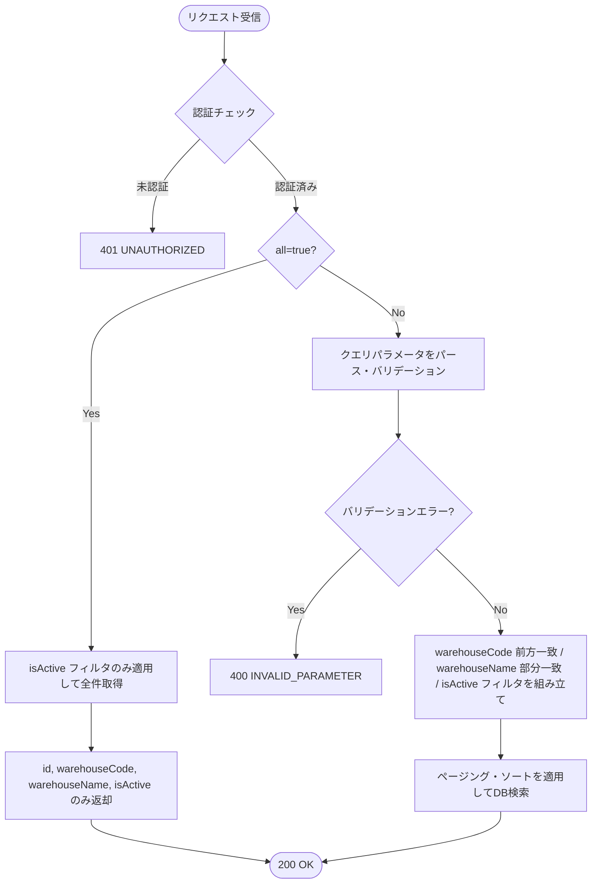

#### ビジネスルール

| # | ルール |
|---|--------|
| BR-001 | `all=true` の場合はページング・ソートパラメータを無視する |
| BR-002 | `all=true` の場合は `isActive` フィルタのみ適用し、レスポンスフィールドを最小限（id, warehouseCode, warehouseName, isActive）に絞る |
| BR-003 | `isActive` を省略した場合は有効・無効の両方を返す |
| BR-004 | `warehouseCode` は前方一致（`LIKE 'xxx%'`）、`warehouseName` は部分一致（`LIKE '%xxx%'`）とする |

### 5. 補足事項

- ヘッダーの倉庫切替プルダウンはアプリ起動時に `all=true&isActive=true` で取得し、フロントエンドでキャッシュする。
- ソート可能フィールド: `warehouseCode`、`warehouseName`、`createdAt`、`updatedAt`。

---

## API-MST-FAC-002 倉庫登録

### 1. API概要

| 項目 | 内容 |
|------|------|
| **API ID** | `API-MST-FAC-002` |
| **API名** | 倉庫登録 |
| **メソッド** | POST |
| **エンドポイント** | `/api/v1/master/warehouses` |
| **概要** | 倉庫マスタに新規倉庫を登録する。 |
| **認可ロール** | SYSTEM_ADMIN、WAREHOUSE_MANAGER |

### 2. リクエスト仕様

#### リクエストボディ（Content-Type: application/json）

| フィールド名 | 型 | 必須 | 説明 | バリデーション |
|------------|-----|:----:|------|-------------|
| `warehouseCode` | string | 必須 | 倉庫コード（登録後変更不可） | 英大文字4文字固定（正規表現: `^[A-Z]{4}$`）（例: `WARA`） |
| `warehouseName` | string | 必須 | 倉庫名 | 最大200文字 |
| `warehouseNameKana` | string | — | 倉庫名カナ | 最大200文字 |
| `address` | string | — | 住所 | 最大500文字 |

#### リクエスト例

```json
{
  "warehouseCode": "WH003",
  "warehouseName": "名古屋DC",
  "warehouseNameKana": "ナゴヤディーシー",
  "address": "愛知県名古屋市港区金城ふ頭2-2-2"
}
```

### 3. レスポンス仕様

#### 正常レスポンス — HTTP 201 Created

```json
{
  "id": 3,
  "warehouseCode": "WH003",
  "warehouseName": "名古屋DC",
  "warehouseNameKana": "ナゴヤディーシー",
  "address": "愛知県名古屋市港区金城ふ頭2-2-2",
  "isActive": true,
  "createdAt": "2026-03-13T10:00:00+09:00",
  "updatedAt": "2026-03-13T10:00:00+09:00"
}
```

#### エラーレスポンス

| HTTPステータス | errorCode | 発生条件 |
|--------------|-----------|---------|
| 400 | `VALIDATION_ERROR` | バリデーション違反（必須項目欠如・フォーマット不正） |
| 401 | `UNAUTHORIZED` | 未認証 |
| 403 | `FORBIDDEN` | ロール不足（WAREHOUSE_STAFF / VIEWER） |
| 409 | `DUPLICATE_CODE` | `warehouseCode` がすでに存在する |

### 4. 業務ロジック

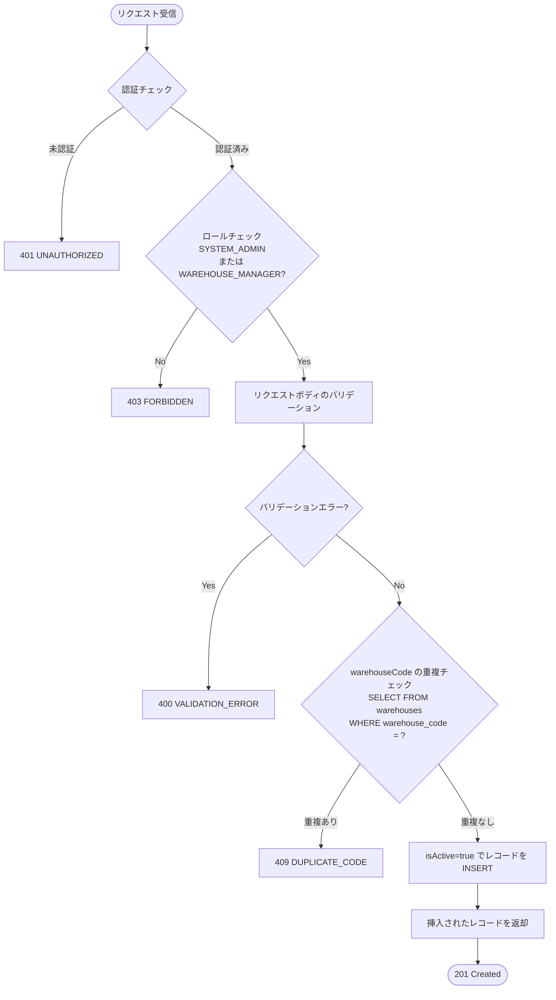

#### ビジネスルール

| # | ルール |
|---|--------|
| BR-001 | 新規登録時は `isActive` を `true` で固定する（リクエストでの指定不可） |
| BR-002 | `warehouseCode` は登録後変更不可。変更が必要な場合は新規登録・旧レコード無効化で対応 |
| BR-003 | `warehouseCode` の一意性はDB制約（UNIQUE）とアプリ層の両方でチェックする |

### 5. 補足事項

- `Location` ヘッダーに作成されたリソースのURLを返す（例: `Location: /api/v1/master/warehouses/3`）。

---

## API-MST-FAC-003 倉庫取得

### 1. API概要

| 項目 | 内容 |
|------|------|
| **API ID** | `API-MST-FAC-003` |
| **API名** | 倉庫取得 |
| **メソッド** | GET |
| **エンドポイント** | `/api/v1/master/warehouses/{id}` |
| **概要** | 指定IDの倉庫マスタを1件取得する。 |
| **認可ロール** | 全ロール |

### 2. リクエスト仕様

#### パスパラメータ

| パラメータ名 | 型 | 必須 | 説明 |
|------------|-----|:----:|------|
| `id` | long | 必須 | 倉庫ID |

### 3. レスポンス仕様

#### 正常レスポンス — HTTP 200

```json
{
  "id": 1,
  "warehouseCode": "WH001",
  "warehouseName": "東京DC",
  "warehouseNameKana": "トウキョウディーシー",
  "address": "東京都江東区辰巳1-1-1",
  "isActive": true,
  "createdAt": "2025-01-10T09:00:00+09:00",
  "updatedAt": "2025-03-01T14:30:00+09:00"
}
```

#### エラーレスポンス

| HTTPステータス | errorCode | 発生条件 |
|--------------|-----------|---------|
| 401 | `UNAUTHORIZED` | 未認証 |
| 404 | `WAREHOUSE_NOT_FOUND` | 指定IDの倉庫が存在しない |

### 4. 業務ロジック

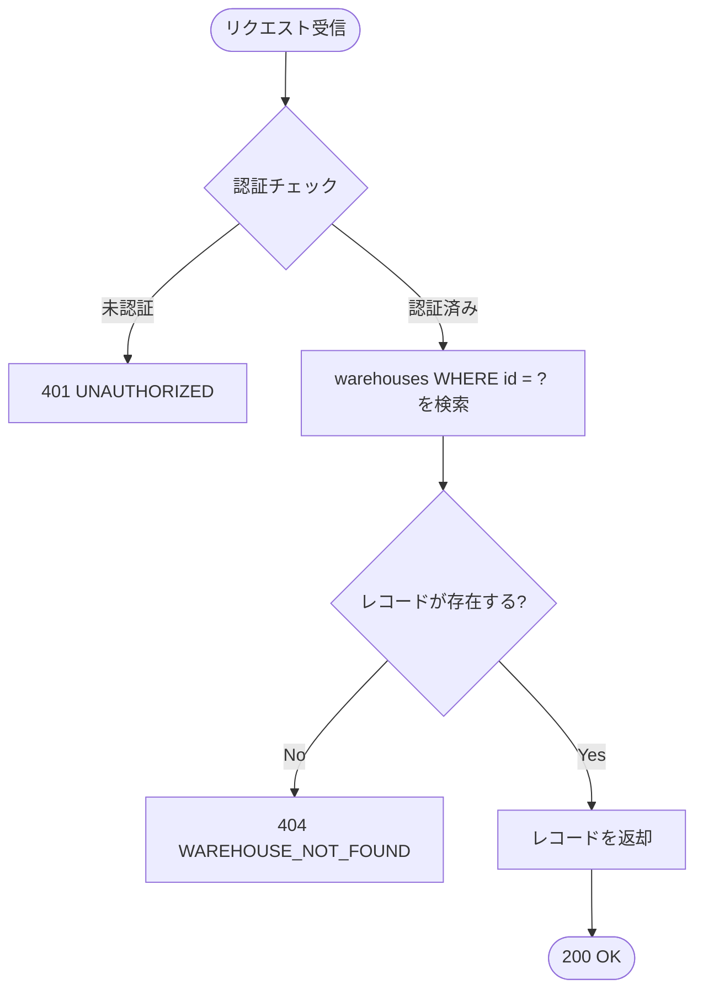

#### ビジネスルール

| # | ルール |
|---|--------|
| BR-001 | 無効化（`isActive=false`）された倉庫も取得可能。フロントエンドで状態を表示する |

### 5. 補足事項

- 編集画面の初期表示や倉庫詳細確認で使用する。

---

## API-MST-FAC-004 倉庫更新

### 1. API概要

| 項目 | 内容 |
|------|------|
| **API ID** | `API-MST-FAC-004` |
| **API名** | 倉庫更新 |
| **メソッド** | PUT |
| **エンドポイント** | `/api/v1/master/warehouses/{id}` |
| **概要** | 指定IDの倉庫マスタを更新する。倉庫コードは変更不可。 |
| **認可ロール** | SYSTEM_ADMIN、WAREHOUSE_MANAGER |

### 2. リクエスト仕様

#### パスパラメータ

| パラメータ名 | 型 | 必須 | 説明 |
|------------|-----|:----:|------|
| `id` | long | 必須 | 倉庫ID |

#### リクエストボディ

| フィールド名 | 型 | 必須 | 説明 | バリデーション |
|------------|-----|:----:|------|-------------|
| `warehouseName` | string | 必須 | 倉庫名 | 最大200文字 |
| `warehouseNameKana` | string | — | 倉庫名カナ | 最大200文字 |
| `address` | string | — | 住所 | 最大500文字 |

> `warehouseCode` はリクエストに含めない（含めた場合は無視する）。

#### リクエスト例

```json
{
  "warehouseName": "東京DC（辰巳）",
  "warehouseNameKana": "トウキョウディーシータツミ",
  "address": "東京都江東区辰巳1-2-3"
}
```

### 3. レスポンス仕様

#### 正常レスポンス — HTTP 200

```json
{
  "id": 1,
  "warehouseCode": "WH001",
  "warehouseName": "東京DC（辰巳）",
  "warehouseNameKana": "トウキョウディーシータツミ",
  "address": "東京都江東区辰巳1-2-3",
  "isActive": true,
  "createdAt": "2025-01-10T09:00:00+09:00",
  "updatedAt": "2026-03-13T10:00:00+09:00"
}
```

#### エラーレスポンス

| HTTPステータス | errorCode | 発生条件 |
|--------------|-----------|---------|
| 400 | `VALIDATION_ERROR` | バリデーション違反 |
| 401 | `UNAUTHORIZED` | 未認証 |
| 403 | `FORBIDDEN` | ロール不足 |
| 404 | `WAREHOUSE_NOT_FOUND` | 指定IDの倉庫が存在しない |

### 4. 業務ロジック

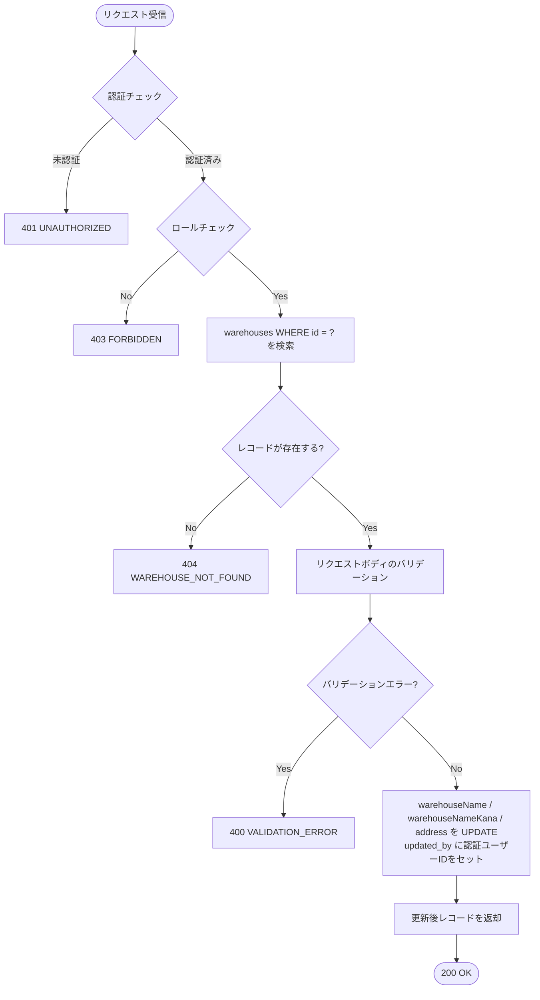

#### ビジネスルール

| # | ルール |
|---|--------|
| BR-001 | `warehouseCode` は更新対象外。リクエストに含まれていても無視する |
| BR-002 | `isActive` の変更は API-MST-FAC-005（PATCH /deactivate）で行う。本APIには含めない |

### 5. 補足事項

- 楽観的ロックは将来的に `updated_at` を使ったIf-Match方式での実装を検討する（現時点は非実装）。

---

## API-MST-FAC-005 倉庫無効化／有効化

### 1. API概要

| 項目 | 内容 |
|------|------|
| **API ID** | `API-MST-FAC-005` |
| **API名** | 倉庫無効化／有効化 |
| **メソッド** | PATCH |
| **エンドポイント** | `/api/v1/master/warehouses/{id}/deactivate` |
| **概要** | 指定IDの倉庫の有効/無効を切り替える。在庫が存在する倉庫は無効化不可。 |
| **認可ロール** | SYSTEM_ADMIN、WAREHOUSE_MANAGER |

### 2. リクエスト仕様

#### パスパラメータ

| パラメータ名 | 型 | 必須 | 説明 |
|------------|-----|:----:|------|
| `id` | long | 必須 | 倉庫ID |

#### リクエストボディ

| フィールド名 | 型 | 必須 | 説明 |
|------------|-----|:----:|------|
| `isActive` | boolean | 必須 | `false`: 無効化、`true`: 有効化 |

```json
{ "isActive": false }
```

### 3. レスポンス仕様

#### 正常レスポンス — HTTP 200

```json
{
  "id": 1,
  "warehouseCode": "WH001",
  "warehouseName": "東京DC",
  "isActive": false,
  "updatedAt": "2026-03-13T10:00:00+09:00"
}
```

#### エラーレスポンス

| HTTPステータス | errorCode | 発生条件 |
|--------------|-----------|---------|
| 400 | `VALIDATION_ERROR` | `isActive` が指定されていない |
| 401 | `UNAUTHORIZED` | 未認証 |
| 403 | `FORBIDDEN` | ロール不足 |
| 404 | `WAREHOUSE_NOT_FOUND` | 指定IDの倉庫が存在しない |
| 422 | `CANNOT_DEACTIVATE_HAS_INVENTORY` | 無効化しようとした倉庫配下に在庫が存在する |

### 4. 業務ロジック

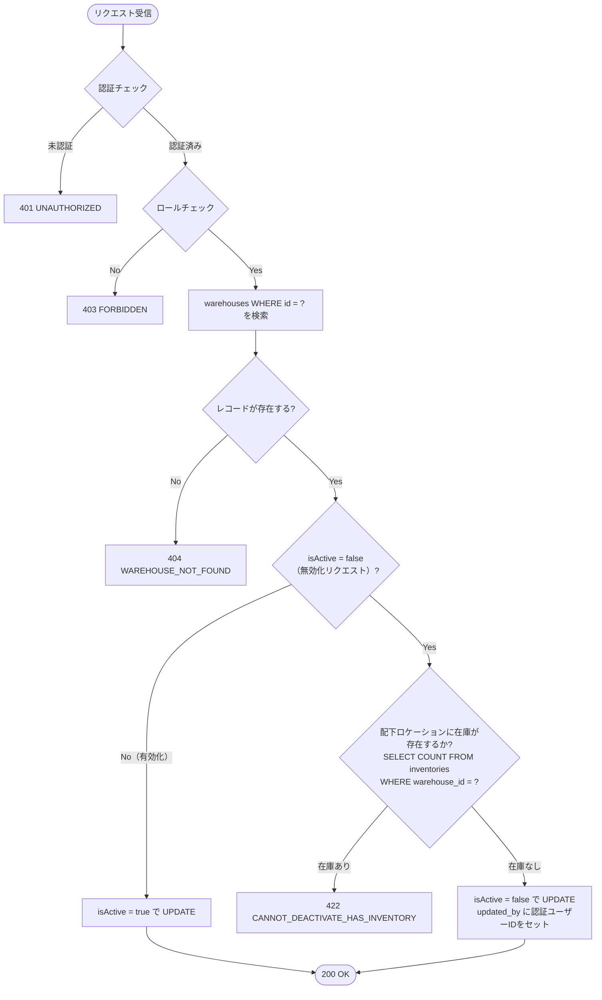

#### ビジネスルール

| # | ルール |
|---|--------|
| BR-001 | 無効化チェックは `inventories` テーブルで当該倉庫に紐づく在庫数量の合計 > 0 を条件とする |
| BR-002 | 有効化（`isActive=true`）は制約なく実行可能 |
| BR-003 | 既に同じ状態（例: 既に無効の倉庫を再度無効化）でも更新処理を実行してよい（冪等性を保証） |

### 5. 補足事項

- エンドポイント名は `/deactivate` だが、有効化（`isActive=true`）もこのエンドポイントで行う（トグル操作）。

---

## 棟マスタ

---

## API-MST-FAC-011 棟一覧取得

### 1. API概要

| 項目 | 内容 |
|------|------|
| **API ID** | `API-MST-FAC-011` |
| **API名** | 棟一覧取得 |
| **メソッド** | GET |
| **エンドポイント** | `/api/v1/master/buildings` |
| **概要** | 指定倉庫に属する棟の一覧を取得する。棟登録画面のドロップダウン用途にも使用する。 |
| **認可ロール** | 全ロール |

### 2. リクエスト仕様

#### クエリパラメータ

| パラメータ名 | 型 | 必須 | 説明 | バリデーション |
|------------|-----|:----:|------|-------------|
| `warehouseId` | long | 必須 | 対象の倉庫ID | 1以上 |
| `buildingCode` | string | — | 棟コード（前方一致） | 最大10文字 |
| `isActive` | boolean | — | 有効/無効フィルタ。省略時は全件 | `true` / `false` |
| `page` | integer | — | ページ番号（0始まり）。デフォルト: `0` | 0以上 |
| `size` | integer | — | ページサイズ。デフォルト: `20` | 1〜100 |

#### リクエスト例

```
GET /api/v1/master/buildings?warehouseId=1&isActive=true&page=0&size=20
```

### 3. レスポンス仕様

#### 正常レスポンス — HTTP 200

```json
{
  "content": [
    {
      "id": 1,
      "buildingCode": "A",
      "buildingName": "A棟",
      "warehouseId": 1,
      "warehouseCode": "WH001",
      "isActive": true,
      "createdAt": "2025-01-10T09:00:00+09:00",
      "updatedAt": "2025-03-01T14:30:00+09:00"
    }
  ],
  "page": 0,
  "size": 20,
  "totalElements": 4,
  "totalPages": 1
}
```

#### エラーレスポンス

| HTTPステータス | errorCode | 発生条件 |
|--------------|-----------|---------|
| 400 | `INVALID_PARAMETER` | `warehouseId` が指定されていない、または不正 |
| 401 | `UNAUTHORIZED` | 未認証 |
| 404 | `WAREHOUSE_NOT_FOUND` | 指定 `warehouseId` の倉庫が存在しない |

### 4. 業務ロジック

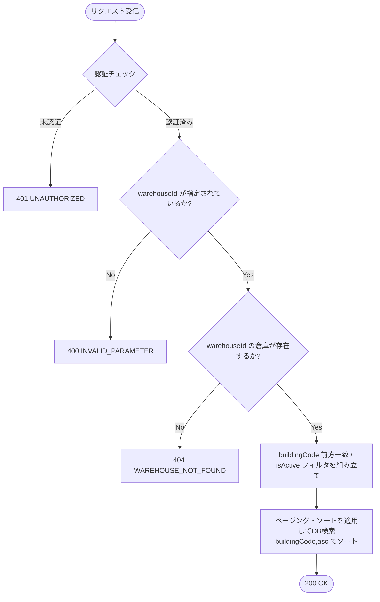

#### ビジネスルール

| # | ルール |
|---|--------|
| BR-001 | `warehouseId` は必須。倉庫をまたいだ棟一覧取得は不可 |
| BR-002 | レスポンスに `warehouseCode` を含めることで、フロントエンドが倉庫名を別APIで取得する必要をなくす |
| BR-003 | デフォルトソートは `buildingCode,asc` とする |

### 5. 補足事項

- エリア登録画面の棟ドロップダウンは `isActive=true` で使用する。

---

## API-MST-FAC-012 棟登録

### 1. API概要

| 項目 | 内容 |
|------|------|
| **API ID** | `API-MST-FAC-012` |
| **API名** | 棟登録 |
| **メソッド** | POST |
| **エンドポイント** | `/api/v1/master/buildings` |
| **概要** | 棟マスタに新規棟を登録する。 |
| **認可ロール** | SYSTEM_ADMIN、WAREHOUSE_MANAGER |

### 2. リクエスト仕様

#### リクエストボディ

| フィールド名 | 型 | 必須 | 説明 | バリデーション |
|------------|-----|:----:|------|-------------|
| `warehouseId` | long | 必須 | 所属倉庫ID | 存在するwarehouse.id |
| `buildingCode` | string | 必須 | 棟コード（倉庫内一意・変更不可） | 最大10文字、英数字のみ（正規表現: `^[A-Za-z0-9]+$`） |
| `buildingName` | string | 必須 | 棟名称 | 最大200文字 |

#### リクエスト例

```json
{
  "warehouseId": 1,
  "buildingCode": "B",
  "buildingName": "B棟"
}
```

### 3. レスポンス仕様

#### 正常レスポンス — HTTP 201 Created

```json
{
  "id": 5,
  "buildingCode": "B",
  "buildingName": "B棟",
  "warehouseId": 1,
  "warehouseCode": "WH001",
  "isActive": true,
  "createdAt": "2026-03-13T10:00:00+09:00",
  "updatedAt": "2026-03-13T10:00:00+09:00"
}
```

#### エラーレスポンス

| HTTPステータス | errorCode | 発生条件 |
|--------------|-----------|---------|
| 400 | `VALIDATION_ERROR` | バリデーション違反 |
| 401 | `UNAUTHORIZED` | 未認証 |
| 403 | `FORBIDDEN` | ロール不足 |
| 404 | `WAREHOUSE_NOT_FOUND` | 指定 `warehouseId` の倉庫が存在しない |
| 409 | `DUPLICATE_CODE` | 同一倉庫内に同じ `buildingCode` が存在する |

### 4. 業務ロジック

```mermaid
flowchart TD
    A([リクエスト受信]) --> B{認証チェック}
    B -- 未認証 --> B1[401 UNAUTHORIZED]
    B -- 認証済み --> C{ロールチェック}
    C -- No --> C1[403 FORBIDDEN]
    C -- Yes --> D[リクエストボディのバリデーション]
    D --> E{バリデーションエラー?}
    E -- Yes --> E1[400 VALIDATION_ERROR]
    E -- No --> F{warehouseId の倉庫が存在するか?}
    F -- No --> F1[404 WAREHOUSE_NOT_FOUND]
    F -- Yes --> G{同一倉庫内に buildingCode が重複するか?\nUNIQUE(warehouse_id, building_code)}
    G -- 重複あり --> G1[409 DUPLICATE_CODE]
    G -- 重複なし --> H[isActive=true でレコードを INSERT]
    H --> Z([201 Created])
```

#### ビジネスルール

| # | ルール |
|---|--------|
| BR-001 | `buildingCode` の一意性は同一倉庫内のみ。別倉庫での同一コードは許容する |
| BR-002 | `buildingCode` は登録後変更不可 |

### 5. 補足事項

- `Location` ヘッダーに作成されたリソースのURLを返す（例: `Location: /api/v1/master/buildings/5`）。

---

## API-MST-FAC-013 棟取得

### 1. API概要

| 項目 | 内容 |
|------|------|
| **API ID** | `API-MST-FAC-013` |
| **API名** | 棟取得 |
| **メソッド** | GET |
| **エンドポイント** | `/api/v1/master/buildings/{id}` |
| **概要** | 指定IDの棟マスタを1件取得する。 |
| **認可ロール** | 全ロール |

### 2. リクエスト仕様

#### パスパラメータ

| パラメータ名 | 型 | 必須 | 説明 |
|------------|-----|:----:|------|
| `id` | long | 必須 | 棟ID |

### 3. レスポンス仕様

#### 正常レスポンス — HTTP 200

```json
{
  "id": 1,
  "buildingCode": "A",
  "buildingName": "A棟",
  "warehouseId": 1,
  "warehouseCode": "WH001",
  "warehouseName": "東京DC",
  "isActive": true,
  "createdAt": "2025-01-10T09:00:00+09:00",
  "updatedAt": "2025-03-01T14:30:00+09:00"
}
```

#### エラーレスポンス

| HTTPステータス | errorCode | 発生条件 |
|--------------|-----------|---------|
| 401 | `UNAUTHORIZED` | 未認証 |
| 404 | `BUILDING_NOT_FOUND` | 指定IDの棟が存在しない |

### 4. 業務ロジック

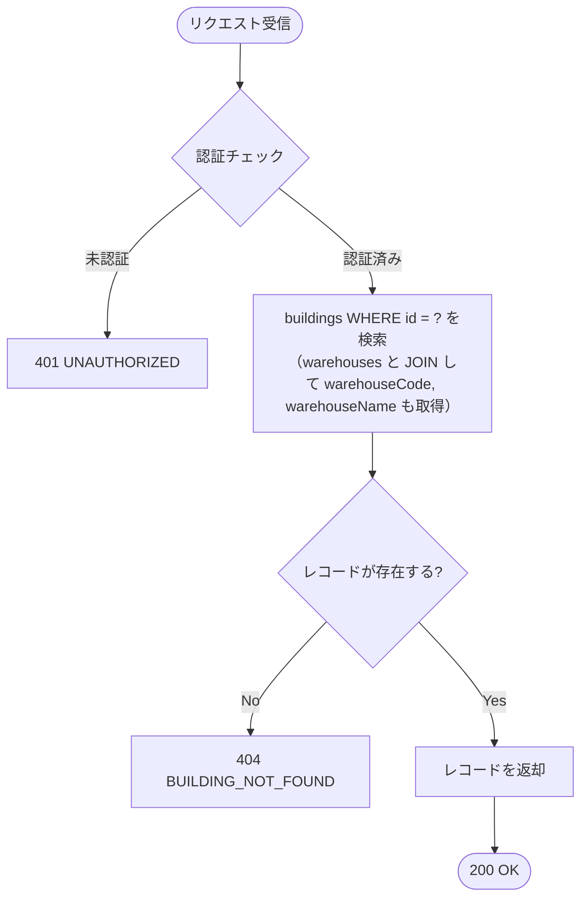

#### ビジネスルール

| # | ルール |
|---|--------|
| BR-001 | 無効化された棟も取得可能 |

### 5. 補足事項

- 棟編集画面の初期表示で使用する。

---

## API-MST-FAC-014 棟更新

### 1. API概要

| 項目 | 内容 |
|------|------|
| **API ID** | `API-MST-FAC-014` |
| **API名** | 棟更新 |
| **メソッド** | PUT |
| **エンドポイント** | `/api/v1/master/buildings/{id}` |
| **概要** | 指定IDの棟マスタを更新する。棟コード・倉庫IDは変更不可。 |
| **認可ロール** | SYSTEM_ADMIN、WAREHOUSE_MANAGER |

### 2. リクエスト仕様

#### パスパラメータ

| パラメータ名 | 型 | 必須 | 説明 |
|------------|-----|:----:|------|
| `id` | long | 必須 | 棟ID |

#### リクエストボディ

| フィールド名 | 型 | 必須 | 説明 | バリデーション |
|------------|-----|:----:|------|-------------|
| `buildingName` | string | 必須 | 棟名称 | 最大200文字 |

> `buildingCode`・`warehouseId` はリクエストに含めない（含めた場合は無視する）。

#### リクエスト例

```json
{
  "buildingName": "A棟（北エリア）"
}
```

### 3. レスポンス仕様

#### 正常レスポンス — HTTP 200

```json
{
  "id": 1,
  "buildingCode": "A",
  "buildingName": "A棟（北エリア）",
  "warehouseId": 1,
  "warehouseCode": "WH001",
  "isActive": true,
  "updatedAt": "2026-03-13T10:00:00+09:00"
}
```

#### エラーレスポンス

| HTTPステータス | errorCode | 発生条件 |
|--------------|-----------|---------|
| 400 | `VALIDATION_ERROR` | バリデーション違反 |
| 401 | `UNAUTHORIZED` | 未認証 |
| 403 | `FORBIDDEN` | ロール不足 |
| 404 | `BUILDING_NOT_FOUND` | 指定IDの棟が存在しない |

### 4. 業務ロジック

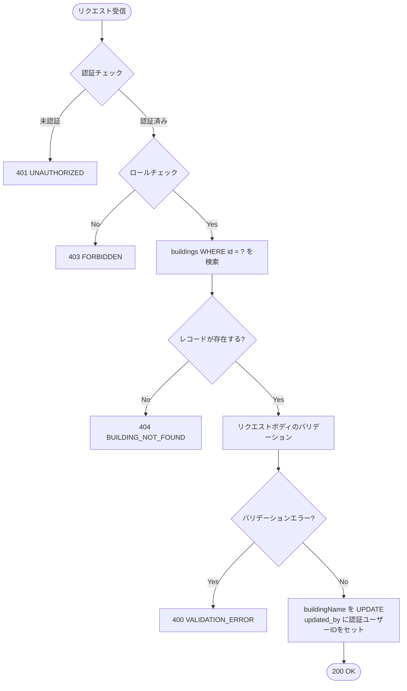

#### ビジネスルール

| # | ルール |
|---|--------|
| BR-001 | `buildingCode`・`warehouseId` は更新不可 |
| BR-002 | 無効化済みの棟でも更新可能（名称変更は許容する） |

### 5. 補足事項

- **トランザクション**: `buildings` テーブルへの UPDATE と `updated_by` / `updated_at` の更新を1トランザクションで処理する（`@Transactional`）。
- **楽観ロック**: 同時更新を防ぐため `updated_at` を楽観ロックとして活用することを推奨（実装フェーズで検討）。

---

## API-MST-FAC-015 棟無効化／有効化

### 1. API概要

| 項目 | 内容 |
|------|------|
| **API ID** | `API-MST-FAC-015` |
| **API名** | 棟無効化／有効化 |
| **メソッド** | PATCH |
| **エンドポイント** | `/api/v1/master/buildings/{id}/deactivate` |
| **概要** | 指定IDの棟の有効/無効を切り替える。配下にエリアが存在する棟は無効化不可。 |
| **認可ロール** | SYSTEM_ADMIN、WAREHOUSE_MANAGER |

### 2. リクエスト仕様

#### パスパラメータ

| パラメータ名 | 型 | 必須 | 説明 |
|------------|-----|:----:|------|
| `id` | long | 必須 | 棟ID |

#### リクエストボディ

| フィールド名 | 型 | 必須 | 説明 |
|------------|-----|:----:|------|
| `isActive` | boolean | 必須 | `false`: 無効化、`true`: 有効化 |

### 3. レスポンス仕様

#### 正常レスポンス — HTTP 200

```json
{
  "id": 1,
  "buildingCode": "A",
  "buildingName": "A棟",
  "isActive": false,
  "updatedAt": "2026-03-13T10:00:00+09:00"
}
```

#### エラーレスポンス

| HTTPステータス | errorCode | 発生条件 |
|--------------|-----------|---------|
| 400 | `VALIDATION_ERROR` | `isActive` が指定されていない |
| 401 | `UNAUTHORIZED` | 未認証 |
| 403 | `FORBIDDEN` | ロール不足 |
| 404 | `BUILDING_NOT_FOUND` | 指定IDの棟が存在しない |
| 422 | `CANNOT_DEACTIVATE_HAS_CHILDREN` | 無効化しようとした棟配下にエリアが存在する |

### 4. 業務ロジック

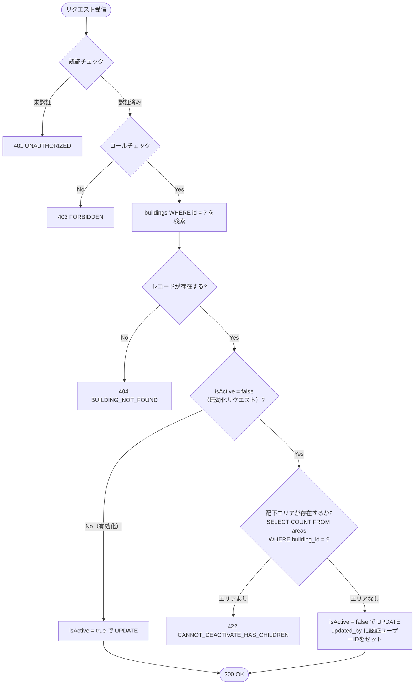

#### ビジネスルール

| # | ルール |
|---|--------|
| BR-001 | 配下エリアの有効/無効状態にかかわらず、エリアが1件でも存在すれば無効化不可 |
| BR-002 | 有効化（`isActive=true`）は制約なく実行可能 |

---

## エリアマスタ

---

## API-MST-FAC-021 エリア一覧取得

### 1. API概要

| 項目 | 内容 |
|------|------|
| **API ID** | `API-MST-FAC-021` |
| **API名** | エリア一覧取得 |
| **メソッド** | GET |
| **エンドポイント** | `/api/v1/master/areas` |
| **概要** | エリアマスタの一覧を取得する。エリア登録画面のドロップダウン用途にも使用する。 |
| **認可ロール** | 全ロール |

### 2. リクエスト仕様

#### クエリパラメータ

| パラメータ名 | 型 | 必須 | 説明 | バリデーション |
|------------|-----|:----:|------|-------------|
| `warehouseId` | long | — | 倉庫IDで絞り込み | 1以上 |
| `buildingId` | long | — | 棟IDで絞り込み | 1以上 |
| `storageCondition` | string | — | 保管条件フィルタ | `AMBIENT` / `REFRIGERATED` / `FROZEN` |
| `areaType` | string | — | エリア種別フィルタ | `STOCK` / `INBOUND` / `OUTBOUND` / `RETURN` |
| `isActive` | boolean | — | 有効/無効フィルタ | `true` / `false` |
| `page` | integer | — | ページ番号（0始まり）。デフォルト: `0` | 0以上 |
| `size` | integer | — | ページサイズ。デフォルト: `20` | 1〜100 |

#### リクエスト例

```
GET /api/v1/master/areas?warehouseId=1&buildingId=1&isActive=true
GET /api/v1/master/areas?warehouseId=1&areaType=STOCK&isActive=true
```

### 3. レスポンス仕様

#### 正常レスポンス — HTTP 200

```json
{
  "content": [
    {
      "id": 1,
      "areaCode": "A01",
      "areaName": "A棟1階 常温エリア",
      "warehouseId": 1,
      "warehouseCode": "WH001",
      "buildingId": 1,
      "buildingCode": "A",
      "storageCondition": "AMBIENT",
      "areaType": "STOCK",
      "isActive": true,
      "createdAt": "2025-01-10T09:00:00+09:00",
      "updatedAt": "2025-03-01T14:30:00+09:00"
    }
  ],
  "page": 0,
  "size": 20,
  "totalElements": 8,
  "totalPages": 1
}
```

#### エラーレスポンス

| HTTPステータス | errorCode | 発生条件 |
|--------------|-----------|---------|
| 400 | `INVALID_PARAMETER` | クエリパラメータが不正 |
| 401 | `UNAUTHORIZED` | 未認証 |

### 4. 業務ロジック

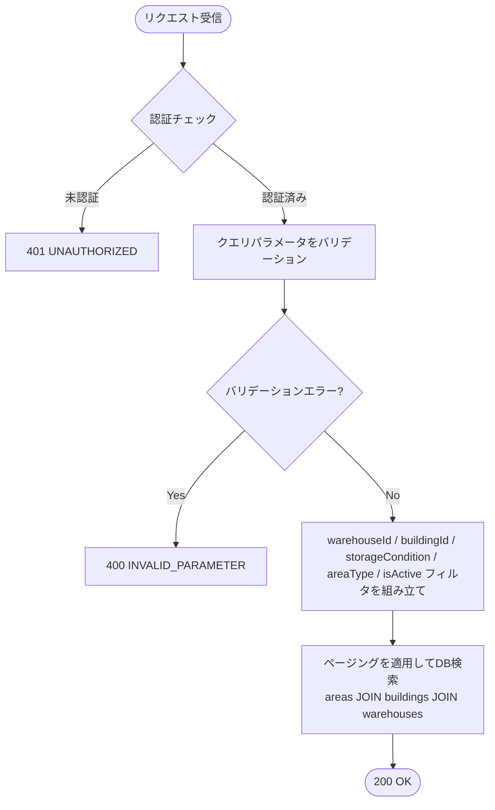

#### ビジネスルール

| # | ルール |
|---|--------|
| BR-001 | `warehouseId` と `buildingId` を同時に指定した場合、`buildingId` が `warehouseId` に属するかをチェックする（不整合な場合は結果0件を返す） |
| BR-002 | デフォルトソートは `buildingCode,asc`, `areaCode,asc` の複合ソート |

### 5. 補足事項

- ロケーション登録画面のエリアドロップダウンは `buildingId=X&areaType=STOCK&isActive=true` または `buildingId=X&isActive=true` で使用する。

---

## API-MST-FAC-022 エリア登録

### 1. API概要

| 項目 | 内容 |
|------|------|
| **API ID** | `API-MST-FAC-022` |
| **API名** | エリア登録 |
| **メソッド** | POST |
| **エンドポイント** | `/api/v1/master/areas` |
| **概要** | エリアマスタに新規エリアを登録する。 |
| **認可ロール** | SYSTEM_ADMIN、WAREHOUSE_MANAGER |

### 2. リクエスト仕様

#### リクエストボディ

| フィールド名 | 型 | 必須 | 説明 | バリデーション |
|------------|-----|:----:|------|-------------|
| `buildingId` | long | 必須 | 所属棟ID | 存在するbuildings.id |
| `areaCode` | string | 必須 | エリアコード（棟内一意・変更不可） | 最大20文字、英数字・ハイフンのみ（正規表現: `^[A-Za-z0-9\-]+$`） |
| `areaName` | string | 必須 | エリア名称 | 最大200文字 |
| `storageCondition` | string | 必須 | 保管条件 | `AMBIENT` / `REFRIGERATED` / `FROZEN` |
| `areaType` | string | 必須 | エリア種別 | `STOCK` / `INBOUND` / `OUTBOUND` / `RETURN` |

#### リクエスト例

```json
{
  "buildingId": 1,
  "areaCode": "A02",
  "areaName": "A棟2階 冷蔵エリア",
  "storageCondition": "REFRIGERATED",
  "areaType": "STOCK"
}
```

### 3. レスポンス仕様

#### 正常レスポンス — HTTP 201 Created

```json
{
  "id": 10,
  "areaCode": "A02",
  "areaName": "A棟2階 冷蔵エリア",
  "warehouseId": 1,
  "warehouseCode": "WH001",
  "buildingId": 1,
  "buildingCode": "A",
  "storageCondition": "REFRIGERATED",
  "areaType": "STOCK",
  "isActive": true,
  "createdAt": "2026-03-13T10:00:00+09:00",
  "updatedAt": "2026-03-13T10:00:00+09:00"
}
```

#### エラーレスポンス

| HTTPステータス | errorCode | 発生条件 |
|--------------|-----------|---------|
| 400 | `VALIDATION_ERROR` | バリデーション違反 |
| 401 | `UNAUTHORIZED` | 未認証 |
| 403 | `FORBIDDEN` | ロール不足 |
| 404 | `BUILDING_NOT_FOUND` | 指定 `buildingId` の棟が存在しない |
| 409 | `DUPLICATE_CODE` | 同一棟内に同じ `areaCode` が存在する |

### 4. 業務ロジック

```mermaid
flowchart TD
    A([リクエスト受信]) --> B{認証チェック}
    B -- 未認証 --> B1[401 UNAUTHORIZED]
    B -- 認証済み --> C{ロールチェック}
    C -- No --> C1[403 FORBIDDEN]
    C -- Yes --> D[リクエストボディのバリデーション]
    D --> E{バリデーションエラー?}
    E -- Yes --> E1[400 VALIDATION_ERROR]
    E -- No --> F{buildingId の棟が存在するか?}
    F -- No --> F1[404 BUILDING_NOT_FOUND]
    F -- Yes --> G{同一棟内に areaCode が重複するか?\nUNIQUE(building_id, area_code)}
    G -- 重複あり --> G1[409 DUPLICATE_CODE]
    G -- 重複なし --> H[buildings から warehouse_id を取得して冗長保持\nisActive=true でレコードを INSERT]
    H --> Z([201 Created])
```

#### ビジネスルール

| # | ルール |
|---|--------|
| BR-001 | `warehouse_id` は `buildingId` から自動導出して `areas.warehouse_id` に冗長保持する |
| BR-002 | `areaCode` の一意性は同一棟内のみ |
| BR-003 | `INBOUND` / `OUTBOUND` / `RETURN` エリアへのロケーション1件制約はロケーション登録時（API-MST-FAC-032）に検証する。エリア登録時は制約なし |

### 5. 補足事項

- `Location` ヘッダーに作成されたリソースのURLを返す（例: `Location: /api/v1/master/areas/10`）。

---

## API-MST-FAC-023 エリア取得

### 1. API概要

| 項目 | 内容 |
|------|------|
| **API ID** | `API-MST-FAC-023` |
| **API名** | エリア取得 |
| **メソッド** | GET |
| **エンドポイント** | `/api/v1/master/areas/{id}` |
| **概要** | 指定IDのエリアマスタを1件取得する。 |
| **認可ロール** | 全ロール |

### 2. リクエスト仕様

#### パスパラメータ

| パラメータ名 | 型 | 必須 | 説明 |
|------------|-----|:----:|------|
| `id` | long | 必須 | エリアID |

### 3. レスポンス仕様

#### 正常レスポンス — HTTP 200

```json
{
  "id": 1,
  "areaCode": "A01",
  "areaName": "A棟1階 常温エリア",
  "warehouseId": 1,
  "warehouseCode": "WH001",
  "warehouseName": "東京DC",
  "buildingId": 1,
  "buildingCode": "A",
  "buildingName": "A棟",
  "storageCondition": "AMBIENT",
  "areaType": "STOCK",
  "isActive": true,
  "createdAt": "2025-01-10T09:00:00+09:00",
  "updatedAt": "2025-03-01T14:30:00+09:00"
}
```

#### エラーレスポンス

| HTTPステータス | errorCode | 発生条件 |
|--------------|-----------|---------|
| 401 | `UNAUTHORIZED` | 未認証 |
| 404 | `AREA_NOT_FOUND` | 指定IDのエリアが存在しない |

### 4. 業務ロジック

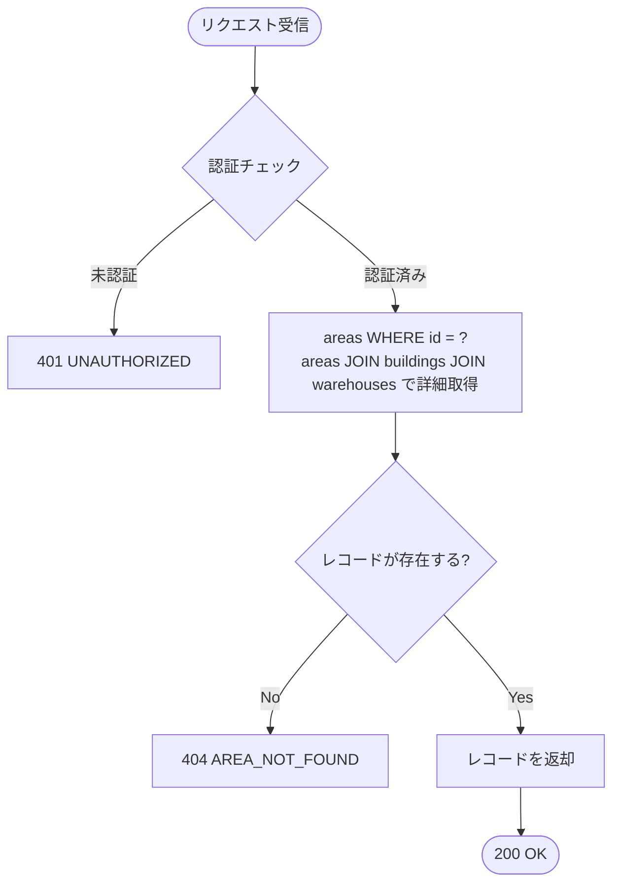

**ビジネスルール**:

| # | ルール | エラーコード |
|---|--------|------------|
| 1 | 指定IDのエリアが存在しない場合は404を返す | `AREA_NOT_FOUND` |
| 2 | 無効化済みのエリアも取得可能（ステータスに関わらず返却） | — |

---

## API-MST-FAC-024 エリア更新

### 1. API概要

| 項目 | 内容 |
|------|------|
| **API ID** | `API-MST-FAC-024` |
| **API名** | エリア更新 |
| **メソッド** | PUT |
| **エンドポイント** | `/api/v1/master/areas/{id}` |
| **概要** | 指定IDのエリアマスタを更新する。エリアコード・棟IDは変更不可。 |
| **認可ロール** | SYSTEM_ADMIN、WAREHOUSE_MANAGER |

### 2. リクエスト仕様

#### パスパラメータ

| パラメータ名 | 型 | 必須 | 説明 |
|------------|-----|:----:|------|
| `id` | long | 必須 | エリアID |

#### リクエストボディ

| フィールド名 | 型 | 必須 | 説明 | バリデーション |
|------------|-----|:----:|------|-------------|
| `areaName` | string | 必須 | エリア名称 | 最大200文字 |
| `storageCondition` | string | 必須 | 保管条件 | `AMBIENT` / `REFRIGERATED` / `FROZEN` |

> `areaCode`・`buildingId`・`areaType` はリクエストに含めない（含めた場合は無視する）。

#### リクエスト例

```json
{
  "areaName": "A棟1階 常温在庫エリア（拡張）",
  "storageCondition": "AMBIENT"
}
```

### 3. レスポンス仕様

#### 正常レスポンス — HTTP 200

```json
{
  "id": 1,
  "areaCode": "A01",
  "areaName": "A棟1階 常温在庫エリア（拡張）",
  "buildingId": 1,
  "storageCondition": "AMBIENT",
  "areaType": "STOCK",
  "isActive": true,
  "updatedAt": "2026-03-13T10:00:00+09:00"
}
```

#### エラーレスポンス

| HTTPステータス | errorCode | 発生条件 |
|--------------|-----------|---------|
| 400 | `VALIDATION_ERROR` | バリデーション違反 |
| 401 | `UNAUTHORIZED` | 未認証 |
| 403 | `FORBIDDEN` | ロール不足 |
| 404 | `AREA_NOT_FOUND` | 指定IDのエリアが存在しない |

### 4. 業務ロジック

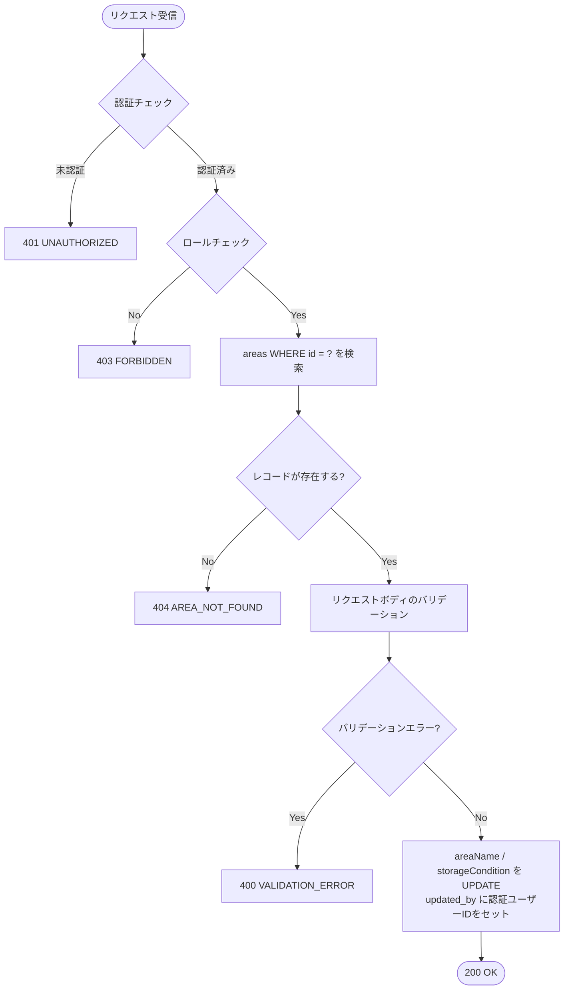

#### ビジネスルール

| # | ルール |
|---|--------|
| BR-001 | `areaCode`・`buildingId`・`warehouseId`・`areaType` は更新不可 |
| BR-002 | `storageCondition` の変更は許容するが、ロケーションに在庫が存在する場合の制約は将来的に検討する（現時点では制約なし） |
| BR-003 | 無効化済みのエリアでも更新可能（名称・保管条件変更は許容する） |

### 5. 補足事項

- **トランザクション**: `areas` テーブルへの UPDATE と `updated_by` / `updated_at` の更新を1トランザクションで処理する（`@Transactional`）。
- **areaType変更不可について**: エリア種別（STOCK/INBOUND/OUTBOUND/RETURN）は運用上の大分類であり、変更すると入荷・出荷・棚卸の業務フローに影響するため変更不可とする。

---

## API-MST-FAC-025 エリア無効化／有効化

### 1. API概要

| 項目 | 内容 |
|------|------|
| **API ID** | `API-MST-FAC-025` |
| **API名** | エリア無効化／有効化 |
| **メソッド** | PATCH |
| **エンドポイント** | `/api/v1/master/areas/{id}/deactivate` |
| **概要** | 指定IDのエリアの有効/無効を切り替える。配下にロケーションが存在するエリアは無効化不可。 |
| **認可ロール** | SYSTEM_ADMIN、WAREHOUSE_MANAGER |

### 2. リクエスト仕様

#### パスパラメータ

| パラメータ名 | 型 | 必須 | 説明 |
|------------|-----|:----:|------|
| `id` | long | 必須 | エリアID |

#### リクエストボディ

| フィールド名 | 型 | 必須 | 説明 |
|------------|-----|:----:|------|
| `isActive` | boolean | 必須 | `false`: 無効化、`true`: 有効化 |

### 3. レスポンス仕様

#### 正常レスポンス — HTTP 200

```json
{
  "id": 1,
  "areaCode": "A01",
  "areaName": "A棟1階 常温エリア",
  "isActive": false,
  "updatedAt": "2026-03-13T10:00:00+09:00"
}
```

#### エラーレスポンス

| HTTPステータス | errorCode | 発生条件 |
|--------------|-----------|---------|
| 400 | `VALIDATION_ERROR` | `isActive` が指定されていない |
| 401 | `UNAUTHORIZED` | 未認証 |
| 403 | `FORBIDDEN` | ロール不足 |
| 404 | `AREA_NOT_FOUND` | 指定IDのエリアが存在しない |
| 422 | `CANNOT_DEACTIVATE_HAS_CHILDREN` | 無効化しようとしたエリア配下にロケーションが存在する |

### 4. 業務ロジック

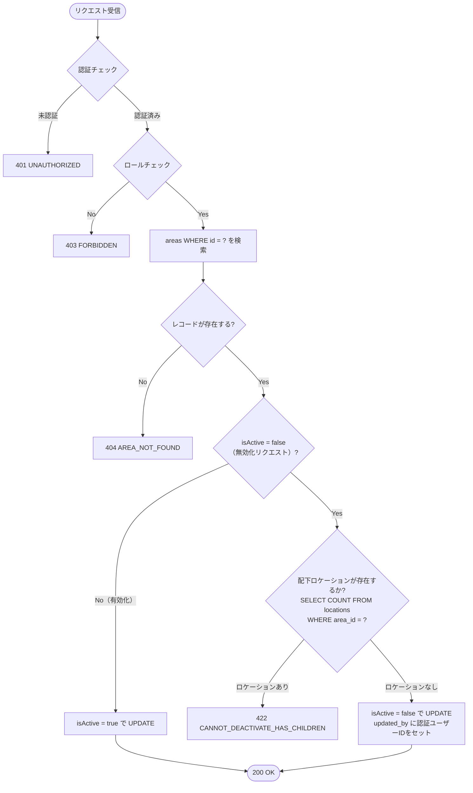

#### ビジネスルール

| # | ルール |
|---|--------|
| BR-001 | 配下ロケーションの有効/無効状態にかかわらず、ロケーションが1件でも存在すれば無効化不可 |
| BR-002 | 有効化（`isActive=true`）は制約なく実行可能 |

---

## ロケーションマスタ

---

## API-MST-FAC-031 ロケーション一覧取得

### 1. API概要

| 項目 | 内容 |
|------|------|
| **API ID** | `API-MST-FAC-031` |
| **API名** | ロケーション一覧取得 |
| **メソッド** | GET |
| **エンドポイント** | `/api/v1/master/locations` |
| **概要** | ロケーションマスタの一覧を取得する。棚卸開始時のロケーション数プレビュー用カウントAPIも含む。 |
| **認可ロール** | 全ロール |

### 2. リクエスト仕様

#### クエリパラメータ（一覧取得）

| パラメータ名 | 型 | 必須 | 説明 | バリデーション |
|------------|-----|:----:|------|-------------|
| `warehouseId` | long | — | 倉庫IDで絞り込み | 1以上 |
| `codePrefix` | string | — | ロケーションコード前方一致（INDEX活用） | 最大50文字 |
| `areaId` | long | — | エリアIDで絞り込み | 1以上 |
| `isActive` | boolean | — | 有効/無効フィルタ | `true` / `false` |
| `page` | integer | — | ページ番号（0始まり）。デフォルト: `0` | 0以上 |
| `size` | integer | — | ページサイズ。デフォルト: `20` | 1〜100 |
| `sort` | string | — | ソート条件。デフォルト: `locationCode,asc` | `locationCode,asc` / `locationCode,desc` |

#### リクエスト例

```
GET /api/v1/master/locations?warehouseId=1&codePrefix=A-01&isActive=true
GET /api/v1/master/locations?areaId=3&page=0&size=50
```

#### カウントAPI（棚卸開始プレビュー用）

```
GET /api/v1/master/locations/count?buildingId=1&areaId=2
```

| パラメータ名 | 型 | 必須 | 説明 |
|------------|-----|:----:|------|
| `warehouseId` | long | — | 倉庫IDで絞り込み |
| `buildingId` | long | — | 棟IDで絞り込み |
| `areaId` | long | — | エリアIDで絞り込み |
| `isActive` | boolean | — | 省略時は有効件数のみカウント（`true` 固定） |

### 3. レスポンス仕様

#### 正常レスポンス（一覧取得）— HTTP 200

```json
{
  "content": [
    {
      "id": 1,
      "locationCode": "A-01-A-01-01-01",
      "locationName": "A棟1階A-01棚1段1列",
      "warehouseId": 1,
      "warehouseCode": "WH001",
      "areaId": 1,
      "areaCode": "A01",
      "areaType": "STOCK",
      "isActive": true,
      "createdAt": "2025-01-10T09:00:00+09:00",
      "updatedAt": "2025-03-01T14:30:00+09:00"
    }
  ],
  "page": 0,
  "size": 20,
  "totalElements": 120,
  "totalPages": 6
}
```

#### 正常レスポンス（カウントAPI）— HTTP 200

```json
{
  "count": 42
}
```

#### エラーレスポンス

| HTTPステータス | errorCode | 発生条件 |
|--------------|-----------|---------|
| 400 | `INVALID_PARAMETER` | クエリパラメータが不正 |
| 401 | `UNAUTHORIZED` | 未認証 |

### 4. 業務ロジック

```mermaid
flowchart TD
    A([リクエスト受信]) --> B{認証チェック}
    B -- 未認証 --> B1[401 UNAUTHORIZED]
    B -- 認証済み --> C{/count エンドポイント?}
    C -- Yes --> D[warehouseId / buildingId / areaId フィルタで\nisActive=true のロケーション件数を COUNT]
    D --> D1[200 OK: count を返却]
    C -- No --> E[クエリパラメータをバリデーション]
    E --> F{バリデーションエラー?}
    F -- Yes --> F1[400 INVALID_PARAMETER]
    F -- No --> G[warehouseId / codePrefix / areaId / isActive フィルタを組み立て\nwarehouseId かつ codePrefix がある場合は INDEX(warehouse_id, location_code) を使った前方一致を適用]
    G --> H[ページング・ソートを適用してDB検索\nareas JOIN でareaCode, areaType も取得]
    H --> Z([200 OK])
```

#### ビジネスルール

| # | ルール |
|---|--------|
| BR-001 | `codePrefix` は `warehouse_id` と組み合わせて `INDEX(warehouse_id, location_code)` の前方一致検索を活用する |
| BR-002 | デフォルトソートは `locationCode,asc` |
| BR-003 | `/count` エンドポイントは `isActive` を省略した場合 `true` として扱う |
| BR-004 | `/count` エンドポイントは棚卸開始確認ダイアログでロケーション数を事前表示するために使用する |

### 5. 補足事項

- ロケーションコードの形式（在庫エリア）: `棟-フロア-エリア-棚-段-並び`（例: `A-01-A-01-01-01`）。検索時の前方一致で階層絞り込みが可能（例: `A-01` で A棟1フロア全体）。

---

## API-MST-FAC-032 ロケーション登録

### 1. API概要

| 項目 | 内容 |
|------|------|
| **API ID** | `API-MST-FAC-032` |
| **API名** | ロケーション登録 |
| **メソッド** | POST |
| **エンドポイント** | `/api/v1/master/locations` |
| **概要** | ロケーションマスタに新規ロケーションを登録する。エリア種別に応じた制約チェックを行う。 |
| **認可ロール** | SYSTEM_ADMIN、WAREHOUSE_MANAGER |

### 2. リクエスト仕様

#### リクエストボディ

| フィールド名 | 型 | 必須 | 説明 | バリデーション |
|------------|-----|:----:|------|-------------|
| `areaId` | long | 必須 | 所属エリアID | 存在するareas.id |
| `locationCode` | string | 必須 | ロケーションコード（倉庫内一意・変更不可） | 最大50文字。エリア種別が STOCK の場合は正規表現 `^[A-Z]-\d{2}-[A-Z]-\d{2}-\d{2}-\d{2}$` に一致すること |
| `locationName` | string | — | ロケーション名称 | 最大200文字 |

#### リクエスト例（STOCKエリア）

```json
{
  "areaId": 1,
  "locationCode": "A-01-A-01-01-01",
  "locationName": "A棟1階A-01棚1段1列"
}
```

#### リクエスト例（INBOUNDエリア）

```json
{
  "areaId": 5,
  "locationCode": "INBOUND-A",
  "locationName": "A棟入荷バース"
}
```

### 3. レスポンス仕様

#### 正常レスポンス — HTTP 201 Created

```json
{
  "id": 201,
  "locationCode": "A-01-A-01-01-01",
  "locationName": "A棟1階A-01棚1段1列",
  "warehouseId": 1,
  "warehouseCode": "WH001",
  "areaId": 1,
  "areaCode": "A01",
  "areaType": "STOCK",
  "isActive": true,
  "createdAt": "2026-03-13T10:00:00+09:00",
  "updatedAt": "2026-03-13T10:00:00+09:00"
}
```

#### エラーレスポンス

| HTTPステータス | errorCode | 発生条件 |
|--------------|-----------|---------|
| 400 | `VALIDATION_ERROR` | バリデーション違反（STOCKエリアのコードフォーマット不正含む） |
| 401 | `UNAUTHORIZED` | 未認証 |
| 403 | `FORBIDDEN` | ロール不足 |
| 404 | `AREA_NOT_FOUND` | 指定 `areaId` のエリアが存在しない |
| 409 | `DUPLICATE_CODE` | 同一倉庫内に同じ `locationCode` が存在する |
| 422 | `AREA_LOCATION_LIMIT_EXCEEDED` | `INBOUND` / `OUTBOUND` / `RETURN` エリアに既存ロケーションが存在する（1件制約違反） |

### 4. 業務ロジック

```mermaid
flowchart TD
    A([リクエスト受信]) --> B{認証チェック}
    B -- 未認証 --> B1[401 UNAUTHORIZED]
    B -- 認証済み --> C{ロールチェック}
    C -- No --> C1[403 FORBIDDEN]
    C -- Yes --> D[リクエストボディのバリデーション\n（必須チェック・文字数チェック）]
    D --> E{バリデーションエラー?}
    E -- Yes --> E1[400 VALIDATION_ERROR]
    E -- No --> F{areaId のエリアが存在するか?}
    F -- No --> F1[404 AREA_NOT_FOUND]
    F -- Yes --> G{エリア種別が STOCK?}
    G -- Yes --> H{locationCode が正規表現\n^[A-Z]-\\d{2}-[A-Z]-\\d{2}-\\d{2}-\\d{2}$\nに一致するか?}
    H -- No --> H1[400 VALIDATION_ERROR\nINVALID_LOCATION_CODE_FORMAT]
    H -- Yes --> I
    G -- No --> I{INBOUND/OUTBOUND/RETURN エリアに\n既存ロケーションが存在するか?\nSELECT COUNT FROM locations\nWHERE area_id = ?}
    I -- 既存あり --> I1[422 AREA_LOCATION_LIMIT_EXCEEDED]
    I -- 既存なし --> J
    J{同一倉庫内に locationCode が重複するか?\nUNIQUE(warehouse_id, location_code)}
    J -- 重複あり --> J1[409 DUPLICATE_CODE]
    J -- 重複なし --> K[エリアから warehouse_id を取得して冗長保持\nisActive=true でレコードを INSERT]
    K --> Z([201 Created])
```

#### ビジネスルール

| # | ルール |
|---|--------|
| BR-001 | `locationCode` の一意性は同一倉庫内。`UNIQUE(warehouse_id, location_code)` で保証 |
| BR-002 | 在庫エリア（STOCK）のロケーションコードは `棟-フロア-エリア-棚-段-並び` 形式を強制する |
| BR-003 | `INBOUND` / `OUTBOUND` / `RETURN` エリアへの登録は1件まで。2件目の登録試行で 422 を返す |
| BR-004 | `warehouse_id` は `areaId` → `buildingId` → `warehouseId` で自動導出し冗長保持する |

### 5. 補足事項

- `Location` ヘッダーに作成されたリソースのURLを返す（例: `Location: /api/v1/master/locations/201`）。

---

## API-MST-FAC-033 ロケーション取得

### 1. API概要

| 項目 | 内容 |
|------|------|
| **API ID** | `API-MST-FAC-033` |
| **API名** | ロケーション取得 |
| **メソッド** | GET |
| **エンドポイント** | `/api/v1/master/locations/{id}` |
| **概要** | 指定IDのロケーションマスタを1件取得する。 |
| **認可ロール** | 全ロール |

### 2. リクエスト仕様

#### パスパラメータ

| パラメータ名 | 型 | 必須 | 説明 |
|------------|-----|:----:|------|
| `id` | long | 必須 | ロケーションID |

### 3. レスポンス仕様

#### 正常レスポンス — HTTP 200

```json
{
  "id": 1,
  "locationCode": "A-01-A-01-01-01",
  "locationName": "A棟1階A-01棚1段1列",
  "warehouseId": 1,
  "warehouseCode": "WH001",
  "warehouseName": "東京DC",
  "areaId": 1,
  "areaCode": "A01",
  "areaName": "A棟1階 常温エリア",
  "areaType": "STOCK",
  "storageCondition": "AMBIENT",
  "buildingId": 1,
  "buildingCode": "A",
  "buildingName": "A棟",
  "isActive": true,
  "createdAt": "2025-01-10T09:00:00+09:00",
  "updatedAt": "2025-03-01T14:30:00+09:00"
}
```

#### エラーレスポンス

| HTTPステータス | errorCode | 発生条件 |
|--------------|-----------|---------|
| 401 | `UNAUTHORIZED` | 未認証 |
| 404 | `LOCATION_NOT_FOUND` | 指定IDのロケーションが存在しない |

### 4. 業務ロジック

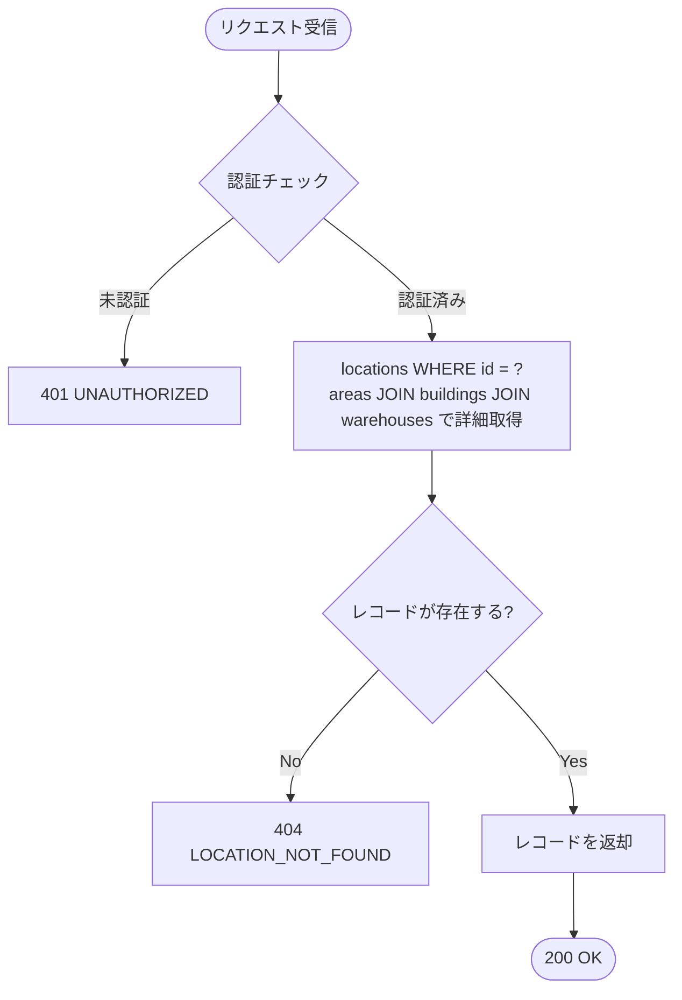

**ビジネスルール**:

| # | ルール | エラーコード |
|---|--------|------------|
| 1 | 指定IDのロケーションが存在しない場合は404を返す | `LOCATION_NOT_FOUND` |
| 2 | 無効化済みのロケーションも取得可能（ステータスに関わらず返却） | — |

---

## API-MST-FAC-034 ロケーション更新

### 1. API概要

| 項目 | 内容 |
|------|------|
| **API ID** | `API-MST-FAC-034` |
| **API名** | ロケーション更新 |
| **メソッド** | PUT |
| **エンドポイント** | `/api/v1/master/locations/{id}` |
| **概要** | 指定IDのロケーションマスタを更新する。ロケーションコード・エリアIDは変更不可。`locationName` のみ更新可能。 |
| **認可ロール** | SYSTEM_ADMIN、WAREHOUSE_MANAGER |

### 2. リクエスト仕様

#### パスパラメータ

| パラメータ名 | 型 | 必須 | 説明 |
|------------|-----|:----:|------|
| `id` | long | 必須 | ロケーションID |

#### リクエストボディ

| フィールド名 | 型 | 必須 | 説明 | バリデーション |
|------------|-----|:----:|------|-------------|
| `locationName` | string | — | ロケーション名称（空文字でクリア可） | 最大200文字 |

> `locationCode`・`areaId` はリクエストに含めない（含めた場合は無視する）。

#### リクエスト例

```json
{
  "locationName": "A棟1階A-01棚1段1列（修正）"
}
```

### 3. レスポンス仕様

#### 正常レスポンス — HTTP 200

```json
{
  "id": 1,
  "locationCode": "A-01-A-01-01-01",
  "locationName": "A棟1階A-01棚1段1列（修正）",
  "areaId": 1,
  "isActive": true,
  "updatedAt": "2026-03-13T10:00:00+09:00"
}
```

#### エラーレスポンス

| HTTPステータス | errorCode | 発生条件 |
|--------------|-----------|---------|
| 400 | `VALIDATION_ERROR` | バリデーション違反 |
| 401 | `UNAUTHORIZED` | 未認証 |
| 403 | `FORBIDDEN` | ロール不足 |
| 404 | `LOCATION_NOT_FOUND` | 指定IDのロケーションが存在しない |

### 4. 業務ロジック

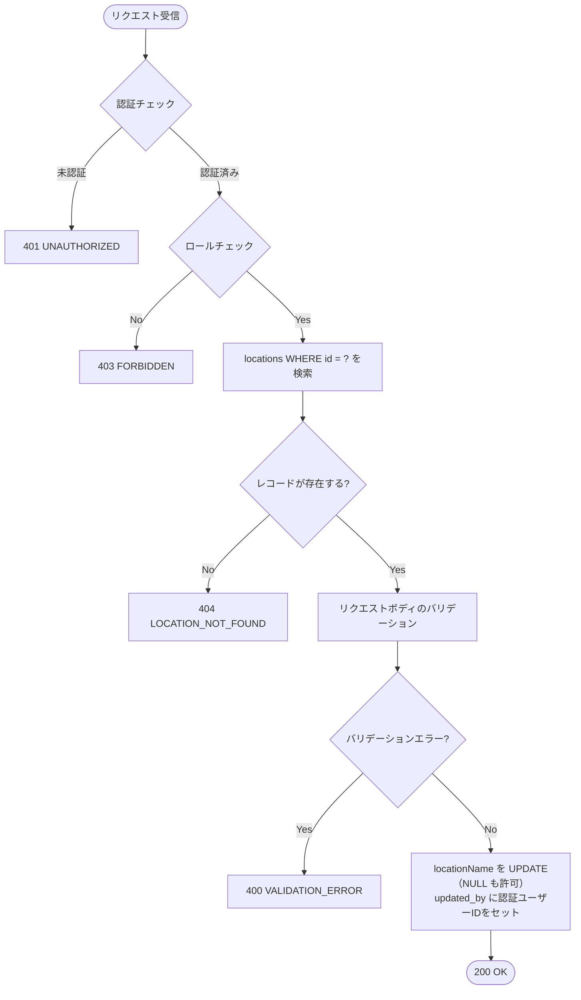

#### ビジネスルール

| # | ルール |
|---|--------|
| BR-001 | `locationCode`・`areaId`・`warehouseId` は更新不可 |
| BR-002 | `locationName` に `null` または空文字を指定した場合は NULL に更新する（名称のクリアを許容） |
| BR-003 | `isActive` の変更は API-MST-FAC-035（PATCH /deactivate）で行う |

---

## API-MST-FAC-035 ロケーション無効化／有効化

### 1. API概要

| 項目 | 内容 |
|------|------|
| **API ID** | `API-MST-FAC-035` |
| **API名** | ロケーション無効化／有効化 |
| **メソッド** | PATCH |
| **エンドポイント** | `/api/v1/master/locations/{id}/deactivate` |
| **概要** | 指定IDのロケーションの有効/無効を切り替える。在庫が存在するロケーション・棚卸中のロケーションは無効化不可。 |
| **認可ロール** | SYSTEM_ADMIN、WAREHOUSE_MANAGER |

### 2. リクエスト仕様

#### パスパラメータ

| パラメータ名 | 型 | 必須 | 説明 |
|------------|-----|:----:|------|
| `id` | long | 必須 | ロケーションID |

#### リクエストボディ

| フィールド名 | 型 | 必須 | 説明 |
|------------|-----|:----:|------|
| `isActive` | boolean | 必須 | `false`: 無効化、`true`: 有効化 |

### 3. レスポンス仕様

#### 正常レスポンス — HTTP 200

```json
{
  "id": 1,
  "locationCode": "A-01-A-01-01-01",
  "locationName": "A棟1階A-01棚1段1列",
  "isActive": false,
  "updatedAt": "2026-03-13T10:00:00+09:00"
}
```

#### エラーレスポンス

| HTTPステータス | errorCode | 発生条件 |
|--------------|-----------|---------|
| 400 | `VALIDATION_ERROR` | `isActive` が指定されていない |
| 401 | `UNAUTHORIZED` | 未認証 |
| 403 | `FORBIDDEN` | ロール不足 |
| 404 | `LOCATION_NOT_FOUND` | 指定IDのロケーションが存在しない |
| 422 | `CANNOT_DEACTIVATE_HAS_INVENTORY` | 無効化しようとしたロケーションに在庫が存在する |
| 422 | `CANNOT_DEACTIVATE_STOCKTAKE_IN_PROGRESS` | 無効化しようとしたロケーションが棚卸中 |

### 4. 業務ロジック

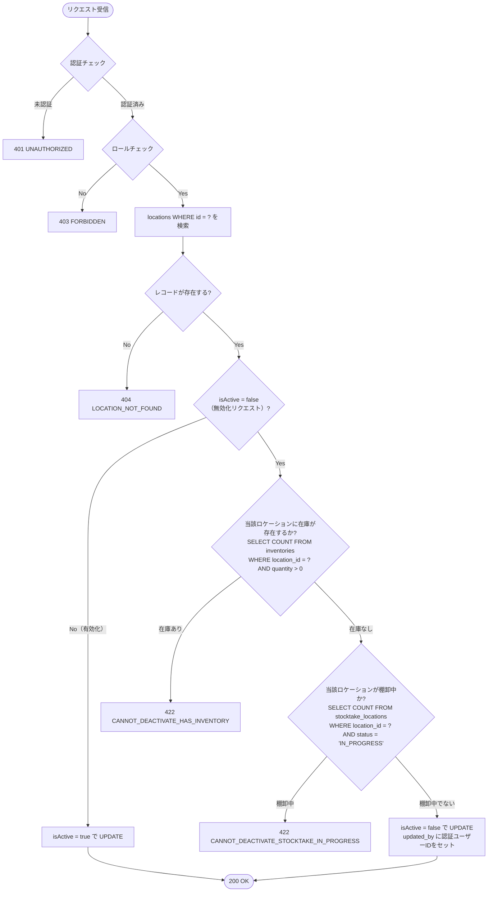

#### ビジネスルール

| # | ルール |
|---|--------|
| BR-001 | 在庫チェックは `inventories.quantity > 0` の件数で判定する |
| BR-002 | 棚卸中チェックは `stocktake_locations.status = 'IN_PROGRESS'` で判定する |
| BR-003 | 在庫チェックを先に行い、問題なければ棚卸中チェックを行う（チェック順序を統一） |
| BR-004 | 有効化（`isActive=true`）は制約なく実行可能 |

### 5. 補足事項

- 棚卸機能（`stocktake_locations` テーブル）は棚卸管理機能フェーズで実装する。それ以前は棚卸中チェックは常に「棚卸中でない」として扱う（フラグで制御可能にしておく）。

---

## API一覧サマリ

| API ID | メソッド | エンドポイント | 概要 | 認可ロール |
|--------|---------|--------------|------|----------|
| API-MST-FAC-001 | GET | `/api/v1/master/warehouses` | 倉庫一覧取得 | 全ロール |
| API-MST-FAC-002 | POST | `/api/v1/master/warehouses` | 倉庫登録 | SA, WM |
| API-MST-FAC-003 | GET | `/api/v1/master/warehouses/{id}` | 倉庫取得 | 全ロール |
| API-MST-FAC-004 | PUT | `/api/v1/master/warehouses/{id}` | 倉庫更新 | SA, WM |
| API-MST-FAC-005 | PATCH | `/api/v1/master/warehouses/{id}/deactivate` | 倉庫無効化/有効化 | SA, WM |
| API-MST-FAC-011 | GET | `/api/v1/master/buildings` | 棟一覧取得 | 全ロール |
| API-MST-FAC-012 | POST | `/api/v1/master/buildings` | 棟登録 | SA, WM |
| API-MST-FAC-013 | GET | `/api/v1/master/buildings/{id}` | 棟取得 | 全ロール |
| API-MST-FAC-014 | PUT | `/api/v1/master/buildings/{id}` | 棟更新 | SA, WM |
| API-MST-FAC-015 | PATCH | `/api/v1/master/buildings/{id}/deactivate` | 棟無効化/有効化 | SA, WM |
| API-MST-FAC-021 | GET | `/api/v1/master/areas` | エリア一覧取得 | 全ロール |
| API-MST-FAC-022 | POST | `/api/v1/master/areas` | エリア登録 | SA, WM |
| API-MST-FAC-023 | GET | `/api/v1/master/areas/{id}` | エリア取得 | 全ロール |
| API-MST-FAC-024 | PUT | `/api/v1/master/areas/{id}` | エリア更新 | SA, WM |
| API-MST-FAC-025 | PATCH | `/api/v1/master/areas/{id}/deactivate` | エリア無効化/有効化 | SA, WM |
| API-MST-FAC-031 | GET | `/api/v1/master/locations` | ロケーション一覧取得 | 全ロール |
| API-MST-FAC-031a | GET | `/api/v1/master/locations/count` | ロケーション件数取得（棚卸プレビュー） | 全ロール |
| API-MST-FAC-032 | POST | `/api/v1/master/locations` | ロケーション登録 | SA, WM |
| API-MST-FAC-033 | GET | `/api/v1/master/locations/{id}` | ロケーション取得 | 全ロール |
| API-MST-FAC-034 | PUT | `/api/v1/master/locations/{id}` | ロケーション更新 | SA, WM |
| API-MST-FAC-035 | PATCH | `/api/v1/master/locations/{id}/deactivate` | ロケーション無効化/有効化 | SA, WM |

**凡例**: SA = SYSTEM_ADMIN、WM = WAREHOUSE_MANAGER

---

## エラーコード一覧

| errorCode | HTTPステータス | 説明 |
|-----------|--------------|------|
| `UNAUTHORIZED` | 401 | 未認証（トークンなし・期限切れ） |
| `FORBIDDEN` | 403 | 権限不足 |
| `WAREHOUSE_NOT_FOUND` | 404 | 倉庫が存在しない |
| `BUILDING_NOT_FOUND` | 404 | 棟が存在しない |
| `AREA_NOT_FOUND` | 404 | エリアが存在しない |
| `LOCATION_NOT_FOUND` | 404 | ロケーションが存在しない |
| `DUPLICATE_CODE` | 409 | コードが重複している |
| `INVALID_PARAMETER` | 400 | クエリパラメータが不正 |
| `VALIDATION_ERROR` | 400 | リクエストボディのバリデーション違反 |
| `CANNOT_DEACTIVATE_HAS_INVENTORY` | 422 | 在庫が存在するため無効化不可 |
| `CANNOT_DEACTIVATE_HAS_CHILDREN` | 422 | 配下リソースが存在するため無効化不可（棟配下エリア、エリア配下ロケーション） |
| `CANNOT_DEACTIVATE_STOCKTAKE_IN_PROGRESS` | 422 | 棚卸中のため無効化不可 |
| `AREA_LOCATION_LIMIT_EXCEEDED` | 422 | INBOUND/OUTBOUND/RETURNエリアのロケーション上限（1件）超過 |
| `INVALID_LOCATION_CODE_FORMAT` | 400 | 在庫エリアのロケーションコードがフォーマット不正 |
