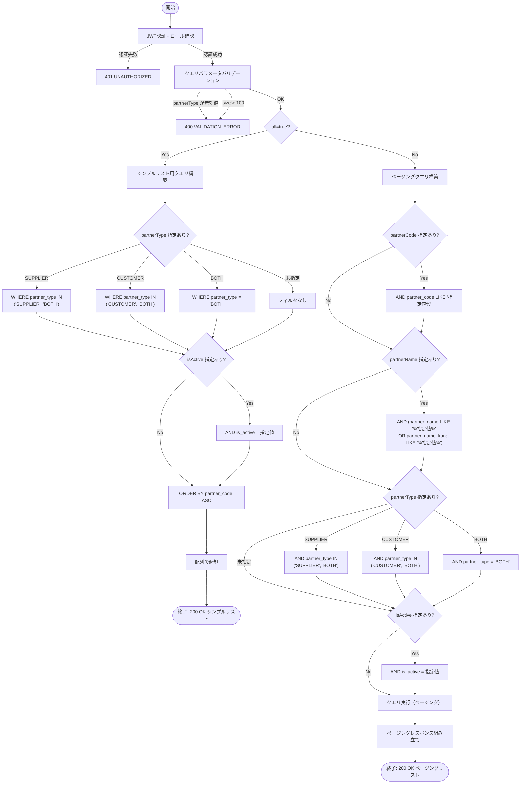
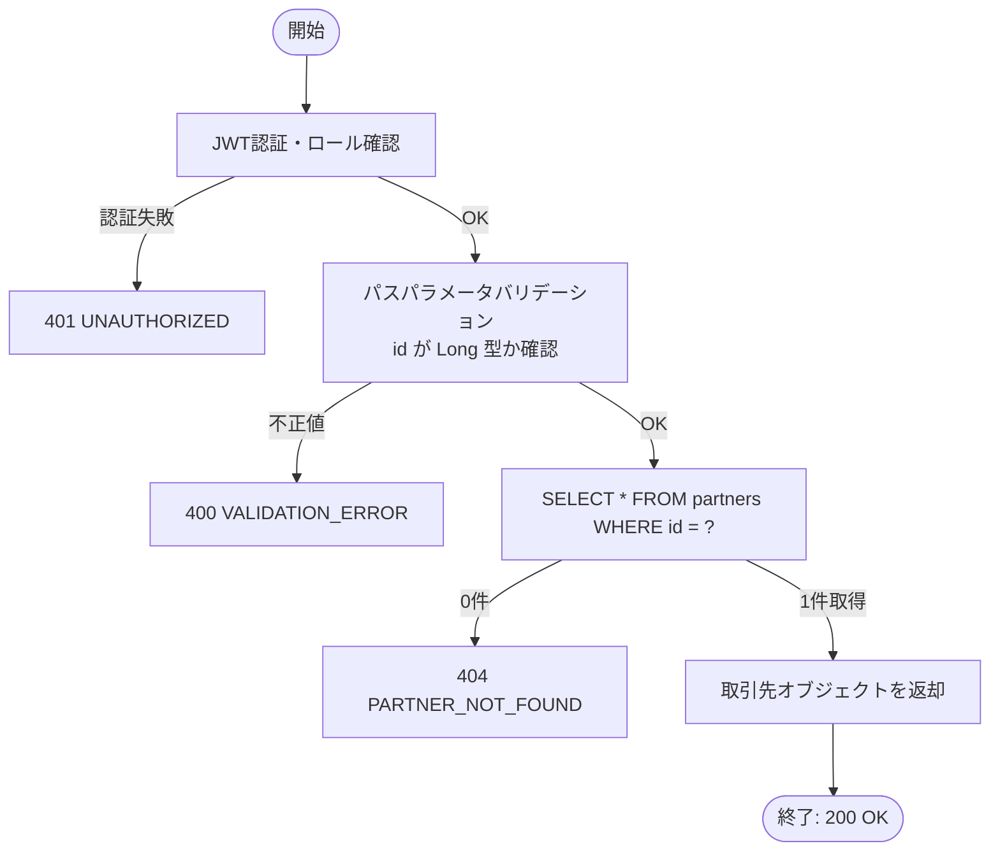
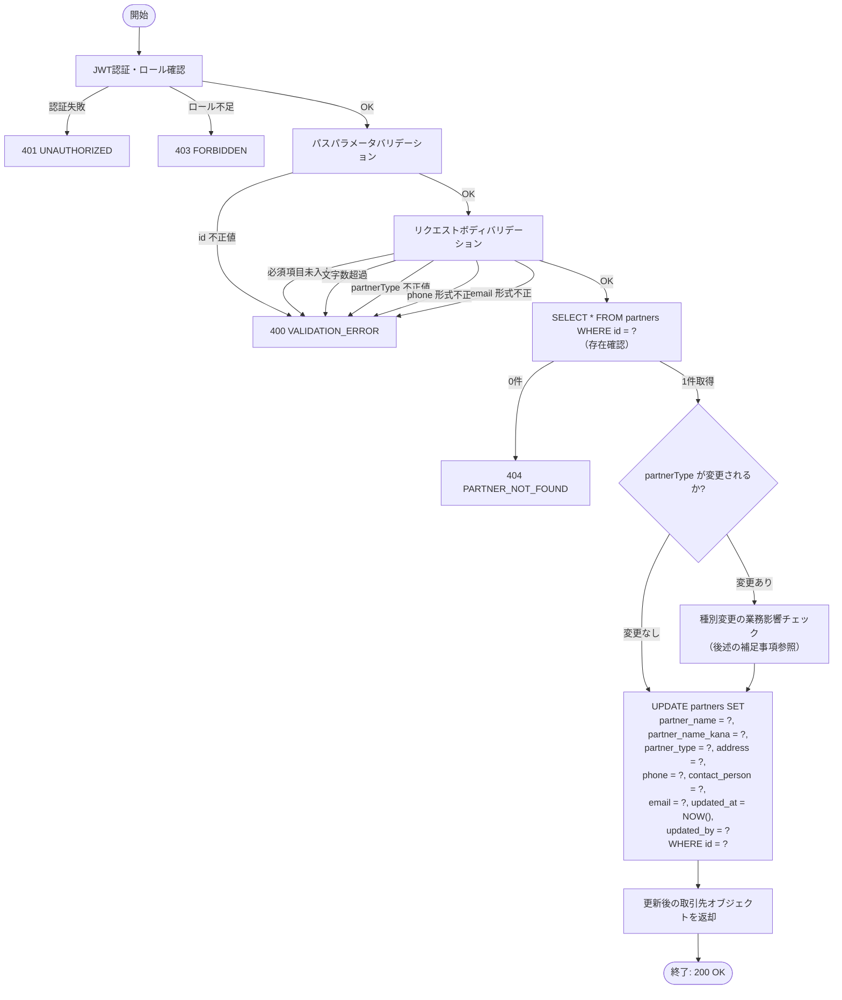
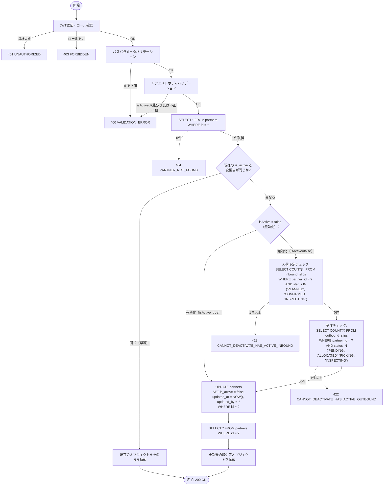

# 機能設計書 — API設計 取引先マスタ（MST-PAR）

## 目次

- [API-MST-PAR-001 取引先一覧取得](#api-mst-par-001-取引先一覧取得)
- [API-MST-PAR-002 取引先登録](#api-mst-par-002-取引先登録)
- [API-MST-PAR-003 取引先取得](#api-mst-par-003-取引先取得)
- [API-MST-PAR-004 取引先更新](#api-mst-par-004-取引先更新)
- [API-MST-PAR-005 取引先無効化/有効化](#api-mst-par-005-取引先無効化有効化)

---

## API-MST-PAR-001 取引先一覧取得

### 1. API概要

| 項目 | 内容 |
|------|------|
| **API ID** | `API-MST-PAR-001` |
| **API名** | 取引先一覧取得 |
| **メソッド** | `GET` |
| **パス** | `/api/v1/master/partners` |
| **認証** | 要 |
| **対象ロール** | 全ロール（SYSTEM_ADMIN, WAREHOUSE_MANAGER, WAREHOUSE_STAFF, VIEWER） |
| **概要** | 取引先マスタの一覧をページング形式で返す。検索条件（取引先コード・取引先名・種別・有効フラグ）による絞り込みに対応する。プルダウン選択肢用途では `all=true` を指定することでページングなしのシンプルリストを返す。 |
| **関連画面** | MST-011（取引先一覧）、INB-001（入荷予定登録 仕入先プルダウン）、OUT-002（受注登録 出荷先プルダウン） |

---

### 2. リクエスト仕様

#### クエリパラメータ

| パラメータ名 | 型 | 必須 | デフォルト | 説明 |
|------------|-----|:----:|----------|------|
| `partnerCode` | String | — | — | 取引先コード（前方一致） |
| `partnerName` | String | — | — | 取引先名（部分一致、カナ名も検索対象） |
| `partnerType` | String | — | — | 種別フィルタ。`SUPPLIER` / `CUSTOMER` / `BOTH` のいずれか |
| `isActive` | Boolean | — | — | 有効フラグ。未指定時は全件（有効・無効ともに）返す |
| `page` | Integer | — | `0` | ページ番号（0始まり） |
| `size` | Integer | — | `20` | 1ページあたりの件数（上限: 100） |
| `sort` | String | — | `partnerCode,asc` | ソート指定（例: `partnerCode,asc` / `updatedAt,desc`） |
| `all` | Boolean | — | `false` | `true` の場合、ページングなしのシンプルリスト形式で返す（後述） |

> **注意**: `all=true` 指定時は `page` / `size` / `sort` パラメータは無視される。プルダウン用途に限定して使用すること。

---

### 3. レスポンス仕様

#### 成功レスポンス（通常: ページングリスト）

**HTTPステータス**: `200 OK`

```json
{
  "content": [
    {
      "id": 1,
      "partnerCode": "P-001",
      "partnerName": "株式会社ABC商事",
      "partnerNameKana": "カブシキガイシャエービーシーショウジ",
      "partnerType": "SUPPLIER",
      "address": "東京都渋谷区道玄坂1-2-3",
      "phone": "03-1234-5678",
      "contactPerson": "田中 一郎",
      "email": "tanaka@abc-shoji.co.jp",
      "isActive": true,
      "createdAt": "2026-03-01T09:00:00+09:00",
      "updatedAt": "2026-03-13T10:30:00+09:00"
    },
    {
      "id": 2,
      "partnerCode": "P-002",
      "partnerName": "XYZ流通株式会社",
      "partnerNameKana": "エックスワイゼットリュウツウカブシキガイシャ",
      "partnerType": "CUSTOMER",
      "address": "大阪府大阪市北区梅田2-4-6",
      "phone": "06-9876-5432",
      "contactPerson": "鈴木 花子",
      "email": "suzuki@xyz-logistics.co.jp",
      "isActive": true,
      "createdAt": "2026-03-02T11:00:00+09:00",
      "updatedAt": "2026-03-13T11:00:00+09:00"
    }
  ],
  "page": 0,
  "size": 20,
  "totalElements": 42,
  "totalPages": 3
}
```

| フィールド | 型 | 説明 |
|----------|-----|------|
| `content[].id` | Long | 取引先ID |
| `content[].partnerCode` | String | 取引先コード |
| `content[].partnerName` | String | 取引先名 |
| `content[].partnerNameKana` | String | 取引先名カナ（未設定時は含まない） |
| `content[].partnerType` | String | 種別: `SUPPLIER` / `CUSTOMER` / `BOTH` |
| `content[].address` | String | 住所（未設定時は含まない） |
| `content[].phone` | String | 電話番号（未設定時は含まない） |
| `content[].contactPerson` | String | 担当者名（未設定時は含まない） |
| `content[].email` | String | メールアドレス（未設定時は含まない） |
| `content[].isActive` | Boolean | 有効フラグ |
| `content[].createdAt` | String | 作成日時（ISO 8601） |
| `content[].updatedAt` | String | 更新日時（ISO 8601） |
| `page` | Integer | 現在のページ番号（0始まり） |
| `size` | Integer | 1ページあたりの件数 |
| `totalElements` | Long | 総件数 |
| `totalPages` | Integer | 総ページ数 |

#### 成功レスポンス（`all=true`: シンプルリスト）

**HTTPステータス**: `200 OK`

```json
[
  {
    "id": 1,
    "partnerCode": "P-001",
    "partnerName": "株式会社ABC商事"
  },
  {
    "id": 3,
    "partnerCode": "P-003",
    "partnerName": "DEF食品株式会社"
  }
]
```

> `all=true` 時は `id` / `partnerCode` / `partnerName` の3フィールドのみ返す。`partnerType` フィルタと組み合わせることで、入荷予定登録（仕入先）や受注登録（出荷先）のプルダウン用に必要な選択肢のみ取得できる。

**プルダウン用途の呼び出し例**:

```
# 入荷予定登録の仕入先プルダウン（SUPPLIER + BOTH の is_active=true のみ）
GET /api/v1/master/partners?partnerType=SUPPLIER&isActive=true&all=true

# 受注登録の出荷先プルダウン（CUSTOMER + BOTH の is_active=true のみ）
GET /api/v1/master/partners?partnerType=CUSTOMER&isActive=true&all=true
```

> `partnerType=SUPPLIER` と指定した場合、バックエンドは `partner_type IN ('SUPPLIER', 'BOTH')` で検索する（`BOTH` 種別は仕入先・出荷先両方に対応するため）。`partnerType=CUSTOMER` の場合は `partner_type IN ('CUSTOMER', 'BOTH')` で検索する。

#### エラーレスポンス

| HTTPステータス | エラーコード | 発生条件 |
|-------------|-----------|--------|
| `400 Bad Request` | `VALIDATION_ERROR` | `partnerType` に無効な値が指定された、`size` が上限（100）を超えた |
| `401 Unauthorized` | `UNAUTHORIZED` | 未認証（Cookieなし・JWT期限切れ） |

---

### 4. 業務ロジック



**ビジネスルール**:

| # | ルール | 詳細 |
|---|--------|------|
| 1 | `partnerType=SUPPLIER` フィルタの解釈 | `partner_type IN ('SUPPLIER', 'BOTH')` で検索する。BOTH 種別は仕入先としても利用可能なため |
| 2 | `partnerType=CUSTOMER` フィルタの解釈 | `partner_type IN ('CUSTOMER', 'BOTH')` で検索する。BOTH 種別は出荷先としても利用可能なため |
| 3 | `partnerType=BOTH` フィルタの解釈 | `partner_type = 'BOTH'` で検索する（BOTH 種別のみ取得したい場合） |
| 4 | `isActive` 未指定時 | 有効・無効を問わず全件を返す（マスタ管理画面では無効レコードも表示する） |
| 5 | `all=true` 時の件数上限 | 上限なし（ページングなし）。ただし `isActive=true` を組み合わせて件数を絞ることを推奨 |
| 6 | `partnerName` 検索対象 | `partner_name`（取引先名）と `partner_name_kana`（カナ名）の両方を部分一致で検索する |

---

### 5. 補足事項

- **トランザクション**: 読み取り専用（`@Transactional(readOnly = true)`）。
- **ソート可能フィールド**: `partnerCode`、`partnerName`、`partnerType`、`isActive`、`createdAt`、`updatedAt`。不正なソートフィールドが指定された場合は `400 VALIDATION_ERROR` を返す。
- **パフォーマンス**: `partner_code` にはユニークインデックスが存在するため前方一致検索は高速。`partner_name` の部分一致検索はテーブルスキャンになる可能性があるため、`partner_name` に対するインデックス追加を検討すること（データ量増加時）。
- **プルダウン用途について**: `all=true` はプルダウン選択肢取得専用とし、必ず `isActive=true` との組み合わせを推奨する。件数が著しく多い場合（取引先数が数百件規模以上）はフロントエンド側でインクリメンタルサーチ（`partnerName` 部分一致 + ページングリスト）への切り替えを検討すること。

---

---

## API-MST-PAR-002 取引先登録

### 1. API概要

| 項目 | 内容 |
|------|------|
| **API ID** | `API-MST-PAR-002` |
| **API名** | 取引先登録 |
| **メソッド** | `POST` |
| **パス** | `/api/v1/master/partners` |
| **認証** | 要 |
| **対象ロール** | SYSTEM_ADMIN, WAREHOUSE_MANAGER |
| **概要** | 新規取引先を登録する。取引先コードはシステム全体で一意であり、登録後は変更不可。`is_active` は登録時に `true` で固定される。 |
| **関連画面** | MST-012（取引先登録） |

---

### 2. リクエスト仕様

#### リクエストボディ

```json
{
  "partnerCode": "P-001",
  "partnerName": "株式会社ABC商事",
  "partnerNameKana": "カブシキガイシャエービーシーショウジ",
  "partnerType": "SUPPLIER",
  "address": "東京都渋谷区道玄坂1-2-3",
  "phone": "03-1234-5678",
  "contactPerson": "田中 一郎",
  "email": "tanaka@abc-shoji.co.jp"
}
```

| フィールド名 | 型 | 必須 | バリデーション | 説明 |
|------------|-----|:----:|-------------|------|
| `partnerCode` | String | ○ | 最大50文字、英数字・ハイフンのみ（正規表現: `^[A-Za-z0-9\-]+$`） | 取引先コード。登録後変更不可 |
| `partnerName` | String | ○ | 最大200文字、空文字不可 | 取引先名 |
| `partnerNameKana` | String | — | 最大200文字 | 取引先名カナ |
| `partnerType` | String | ○ | `SUPPLIER` / `CUSTOMER` / `BOTH` のいずれか | 取引先種別 |
| `address` | String | — | 最大500文字 | 住所 |
| `phone` | String | — | 最大50文字、数字・ハイフン・括弧のみ（正規表現: `^[\d\-\(\)]+$`） | 電話番号 |
| `contactPerson` | String | — | 最大100文字 | 担当者名 |
| `email` | String | — | 最大200文字、RFC 5322準拠のメール形式 | メールアドレス |

---

### 3. レスポンス仕様

#### 成功レスポンス

**HTTPステータス**: `201 Created`

```json
{
  "id": 1,
  "partnerCode": "P-001",
  "partnerName": "株式会社ABC商事",
  "partnerNameKana": "カブシキガイシャエービーシーショウジ",
  "partnerType": "SUPPLIER",
  "address": "東京都渋谷区道玄坂1-2-3",
  "phone": "03-1234-5678",
  "contactPerson": "田中 一郎",
  "email": "tanaka@abc-shoji.co.jp",
  "isActive": true,
  "createdAt": "2026-03-13T09:00:00+09:00",
  "updatedAt": "2026-03-13T09:00:00+09:00"
}
```

#### エラーレスポンス

| HTTPステータス | エラーコード | 発生条件 |
|-------------|-----------|--------|
| `400 Bad Request` | `VALIDATION_ERROR` | 必須項目未入力、文字数超過、フォーマット不正（`details` にフィールドエラー詳細を含む） |
| `401 Unauthorized` | `UNAUTHORIZED` | 未認証 |
| `403 Forbidden` | `FORBIDDEN` | WAREHOUSE_STAFF または VIEWER ロールでのアクセス |
| `409 Conflict` | `DUPLICATE_CODE` | 指定した `partnerCode` が既に登録されている |

---

### 4. 業務ロジック

```mermaid
flowchart TD
    START([開始]) --> AUTH[JWT認証・ロール確認]
    AUTH -->|認証失敗| ERR_AUTH[401 UNAUTHORIZED]
    AUTH -->|ロール不足| ERR_FORBIDDEN[403 FORBIDDEN]
    AUTH -->|OK| VALIDATE[入力バリデーション]
    VALIDATE -->|必須項目未入力| ERR_VAL[400 VALIDATION_ERROR]
    VALIDATE -->|文字数超過| ERR_VAL
    VALIDATE -->|partnerCode 形式不正| ERR_VAL
    VALIDATE -->|partnerType 不正値| ERR_VAL
    VALIDATE -->|phone 形式不正| ERR_VAL
    VALIDATE -->|email 形式不正| ERR_VAL
    VALIDATE -->|OK| CHECK_DUPLICATE[partnerCode 重複チェック\nSELECT COUNT(*) FROM partners\nWHERE partner_code = ?]
    CHECK_DUPLICATE -->|重複あり| ERR_DUP[409 DUPLICATE_CODE]
    CHECK_DUPLICATE -->|重複なし| INSERT["INSERT INTO partners\n(partner_code, partner_name, partner_name_kana,\npartner_type, address, phone, contact_person,\nemail, is_active, created_at, created_by,\nupdated_at, updated_by)\nVALUES (?, ?, ?, ?, ?, ?, ?, ?, true, NOW(), ?, NOW(), ?)"]
    INSERT --> RETURN[登録された取引先オブジェクトを返却]
    RETURN --> END([終了: 201 Created])
```

**ビジネスルール**:

| # | ルール | エラーコード |
|---|--------|------------|
| 1 | `partnerCode` はシステム全体で一意でなければならない | `DUPLICATE_CODE` |
| 2 | `is_active` は登録時に常に `true` で設定される（登録と同時に無効化はできない） | — |
| 3 | `created_by` / `updated_by` には JWT から取得した操作ユーザーの ID を設定する | — |
| 4 | `partnerCode` に使用できる文字は英数字とハイフンのみ（大文字・小文字を区別する） | `VALIDATION_ERROR` |

---

### 5. 補足事項

- **トランザクション**: INSERT 1件のみのため単一トランザクション。
- **重複チェックのタイミング**: バリデーション後、INSERT前にチェックする。高並列環境ではDBのユニーク制約が最終防衛ラインとなるため、DBレベルの `UNIQUE (partner_code)` 制約を必ず設定すること。DBの一意制約違反は `409 DUPLICATE_CODE` にマッピングする。
- **`partnerCode` の変更不可**: 登録後の `partnerCode` 変更は業務上許容しない。`PUT` エンドポイント（API-MST-PAR-004）のリクエストボディに `partnerCode` は含まないこと。

---

---

## API-MST-PAR-003 取引先取得

### 1. API概要

| 項目 | 内容 |
|------|------|
| **API ID** | `API-MST-PAR-003` |
| **API名** | 取引先取得 |
| **メソッド** | `GET` |
| **パス** | `/api/v1/master/partners/{id}` |
| **認証** | 要 |
| **対象ロール** | 全ロール（SYSTEM_ADMIN, WAREHOUSE_MANAGER, WAREHOUSE_STAFF, VIEWER） |
| **概要** | 指定された ID の取引先を1件取得する。無効化済みの取引先も取得可能。 |
| **関連画面** | MST-011（取引先一覧）、MST-013（取引先編集） |

---

### 2. リクエスト仕様

#### パスパラメータ

| パラメータ名 | 型 | 必須 | 説明 |
|------------|-----|:----:|------|
| `id` | Long | ○ | 取引先ID |

---

### 3. レスポンス仕様

#### 成功レスポンス

**HTTPステータス**: `200 OK`

```json
{
  "id": 1,
  "partnerCode": "P-001",
  "partnerName": "株式会社ABC商事",
  "partnerNameKana": "カブシキガイシャエービーシーショウジ",
  "partnerType": "SUPPLIER",
  "address": "東京都渋谷区道玄坂1-2-3",
  "phone": "03-1234-5678",
  "contactPerson": "田中 一郎",
  "email": "tanaka@abc-shoji.co.jp",
  "isActive": true,
  "createdAt": "2026-03-01T09:00:00+09:00",
  "updatedAt": "2026-03-13T10:30:00+09:00"
}
```

| フィールド | 型 | 説明 |
|----------|-----|------|
| `id` | Long | 取引先ID |
| `partnerCode` | String | 取引先コード |
| `partnerName` | String | 取引先名 |
| `partnerNameKana` | String | 取引先名カナ（未設定時は含まない） |
| `partnerType` | String | 種別: `SUPPLIER` / `CUSTOMER` / `BOTH` |
| `address` | String | 住所（未設定時は含まない） |
| `phone` | String | 電話番号（未設定時は含まない） |
| `contactPerson` | String | 担当者名（未設定時は含まない） |
| `email` | String | メールアドレス（未設定時は含まない） |
| `isActive` | Boolean | 有効フラグ |
| `createdAt` | String | 作成日時（ISO 8601） |
| `updatedAt` | String | 更新日時（ISO 8601） |

#### エラーレスポンス

| HTTPステータス | エラーコード | 発生条件 |
|-------------|-----------|--------|
| `400 Bad Request` | `VALIDATION_ERROR` | `id` が数値でない |
| `401 Unauthorized` | `UNAUTHORIZED` | 未認証 |
| `404 Not Found` | `PARTNER_NOT_FOUND` | 指定された `id` の取引先が存在しない |

---

### 4. 業務ロジック



**ビジネスルール**:

| # | ルール | 詳細 |
|---|--------|------|
| 1 | 無効化済みの取引先も取得可能 | `is_active = false` であっても 404 にはしない。詳細画面・編集画面では無効状態を表示する |

---

### 5. 補足事項

- **トランザクション**: 読み取り専用（`@Transactional(readOnly = true)`）。
- **キャッシュ**: 取引先マスタは更新頻度が低いため、Spring Cache（`@Cacheable`）によるキャッシュを検討してよい。キャッシュ更新は PUT / PATCH 時に `@CacheEvict` で行う。

---

---

## API-MST-PAR-004 取引先更新

### 1. API概要

| 項目 | 内容 |
|------|------|
| **API ID** | `API-MST-PAR-004` |
| **API名** | 取引先更新 |
| **メソッド** | `PUT` |
| **パス** | `/api/v1/master/partners/{id}` |
| **認証** | 要 |
| **対象ロール** | SYSTEM_ADMIN, WAREHOUSE_MANAGER |
| **概要** | 指定された ID の取引先情報を更新する。`partnerCode`（取引先コード）は変更不可。リクエストボディに含まれた場合は無視する（または 400 を返す）。 |
| **関連画面** | MST-013（取引先編集） |

---

### 2. リクエスト仕様

#### パスパラメータ

| パラメータ名 | 型 | 必須 | 説明 |
|------------|-----|:----:|------|
| `id` | Long | ○ | 取引先ID |

#### リクエストボディ

```json
{
  "partnerName": "株式会社ABC商事（旧称）",
  "partnerNameKana": "カブシキガイシャエービーシーショウジキュウショウ",
  "partnerType": "BOTH",
  "address": "東京都渋谷区道玄坂4-5-6",
  "phone": "03-1234-9999",
  "contactPerson": "山田 次郎",
  "email": "yamada@abc-shoji.co.jp"
}
```

| フィールド名 | 型 | 必須 | バリデーション | 説明 |
|------------|-----|:----:|-------------|------|
| `partnerName` | String | ○ | 最大200文字、空文字不可 | 取引先名 |
| `partnerNameKana` | String | — | 最大200文字 | 取引先名カナ |
| `partnerType` | String | ○ | `SUPPLIER` / `CUSTOMER` / `BOTH` のいずれか | 取引先種別 |
| `address` | String | — | 最大500文字 | 住所 |
| `phone` | String | — | 最大50文字、数字・ハイフン・括弧のみ | 電話番号 |
| `contactPerson` | String | — | 最大100文字 | 担当者名 |
| `email` | String | — | 最大200文字、RFC 5322準拠のメール形式 | メールアドレス |

> `partnerCode` はリクエストボディに含めても無視する（サーバー側で上書きしない）。

---

### 3. レスポンス仕様

#### 成功レスポンス

**HTTPステータス**: `200 OK`

```json
{
  "id": 1,
  "partnerCode": "P-001",
  "partnerName": "株式会社ABC商事（旧称）",
  "partnerNameKana": "カブシキガイシャエービーシーショウジキュウショウ",
  "partnerType": "BOTH",
  "address": "東京都渋谷区道玄坂4-5-6",
  "phone": "03-1234-9999",
  "contactPerson": "山田 次郎",
  "email": "yamada@abc-shoji.co.jp",
  "isActive": true,
  "createdAt": "2026-03-01T09:00:00+09:00",
  "updatedAt": "2026-03-13T14:00:00+09:00"
}
```

#### エラーレスポンス

| HTTPステータス | エラーコード | 発生条件 |
|-------------|-----------|--------|
| `400 Bad Request` | `VALIDATION_ERROR` | 必須項目未入力、文字数超過、フォーマット不正 |
| `401 Unauthorized` | `UNAUTHORIZED` | 未認証 |
| `403 Forbidden` | `FORBIDDEN` | WAREHOUSE_STAFF または VIEWER ロールでのアクセス |
| `404 Not Found` | `PARTNER_NOT_FOUND` | 指定された `id` の取引先が存在しない |

---

### 4. 業務ロジック



**ビジネスルール**:

| # | ルール | エラーコード |
|---|--------|------------|
| 1 | `partnerCode` は変更不可。リクエストボディに含まれても無視する | — |
| 2 | 無効化済みの取引先（`is_active = false`）も更新可能 | — |
| 3 | `updated_by` には JWT から取得した操作ユーザーの ID を設定する | — |
| 4 | `is_active` はこの API では変更しない（有効化/無効化は API-MST-PAR-005 で行う） | — |

---

### 5. 補足事項

- **トランザクション**: UPDATE 1件のみのため単一トランザクション。
- **`partnerType` 変更時の業務影響**: `partnerType` を `BOTH` から `SUPPLIER` に変更すると、この取引先を出荷先として使用している受注が存在する場合に整合性が崩れる可能性がある。現フェーズでは **アプリ層でのチェックは行わない**（受注登録時に取引先種別を確認する設計のため、既存データへの影響は許容する）。将来的に業務影響チェックが必要になる場合はここに追記すること。
- **PUT による全フィールド更新**: PUT はリソースの全置換を意味するため、省略されたオプションフィールド（`address`、`phone`、`contactPerson`、`email`）は `NULL` にクリアする。フロントエンドは編集画面で取得した現在値を全フィールドに送信すること。

---

---

## API-MST-PAR-005 取引先無効化/有効化

### 1. API概要

| 項目 | 内容 |
|------|------|
| **API ID** | `API-MST-PAR-005` |
| **API名** | 取引先無効化/有効化 |
| **メソッド** | `PATCH` |
| **パス** | `/api/v1/master/partners/{id}/deactivate` |
| **認証** | 要 |
| **対象ロール** | SYSTEM_ADMIN, WAREHOUSE_MANAGER |
| **概要** | 指定された ID の取引先の有効フラグ（`is_active`）を切り替える。`isActive: false` で無効化、`isActive: true` で再有効化を行う。パス名は `deactivate` だが、有効化（`isActive: true`）にも対応する。 |
| **関連画面** | MST-011（取引先一覧 無効化ボタン）、MST-013（取引先編集 無効化/有効化ボタン） |

---

### 2. リクエスト仕様

#### パスパラメータ

| パラメータ名 | 型 | 必須 | 説明 |
|------------|-----|:----:|------|
| `id` | Long | ○ | 取引先ID |

#### リクエストボディ

```json
{
  "isActive": false
}
```

| フィールド名 | 型 | 必須 | バリデーション | 説明 |
|------------|-----|:----:|-------------|------|
| `isActive` | Boolean | ○ | `true` または `false` | `false`: 無効化 / `true`: 有効化 |

---

### 3. レスポンス仕様

#### 成功レスポンス

**HTTPステータス**: `200 OK`

```json
{
  "id": 1,
  "partnerCode": "P-001",
  "partnerName": "株式会社ABC商事",
  "partnerNameKana": "カブシキガイシャエービーシーショウジ",
  "partnerType": "SUPPLIER",
  "address": "東京都渋谷区道玄坂1-2-3",
  "phone": "03-1234-5678",
  "contactPerson": "田中 一郎",
  "email": "tanaka@abc-shoji.co.jp",
  "isActive": false,
  "createdAt": "2026-03-01T09:00:00+09:00",
  "updatedAt": "2026-03-13T15:00:00+09:00"
}
```

#### エラーレスポンス

| HTTPステータス | エラーコード | 発生条件 |
|-------------|-----------|--------|
| `400 Bad Request` | `VALIDATION_ERROR` | `isActive` が未指定または Boolean 以外の値 |
| `401 Unauthorized` | `UNAUTHORIZED` | 未認証 |
| `403 Forbidden` | `FORBIDDEN` | WAREHOUSE_STAFF または VIEWER ロールでのアクセス |
| `404 Not Found` | `PARTNER_NOT_FOUND` | 指定された `id` の取引先が存在しない |
| `422 Unprocessable Entity` | `CANNOT_DEACTIVATE_HAS_ACTIVE_INBOUND` | 無効化しようとした取引先が処理中の入荷予定に紐づいている（ステータスが `PLANNED`、`CONFIRMED`、または `INSPECTING`） |
| `422 Unprocessable Entity` | `CANNOT_DEACTIVATE_HAS_ACTIVE_OUTBOUND` | 無効化しようとした取引先が処理中の受注に紐づいている（ステータスが `PENDING`、`ALLOCATED`、`PICKING`、または `INSPECTING`） |

---

### 4. 業務ロジック



**ビジネスルール**:

| # | ルール | エラーコード |
|---|--------|------------|
| 1 | 処理中の入荷予定（ステータス: `PLANNED`、`CONFIRMED`、`INSPECTING`）に仕入先として紐づいている取引先は無効化不可 | `CANNOT_DEACTIVATE_HAS_ACTIVE_INBOUND` |
| 2 | 処理中の受注（ステータス: `PENDING`、`ALLOCATED`、`PICKING`、`INSPECTING`）に出荷先として紐づいている取引先は無効化不可 | `CANNOT_DEACTIVATE_HAS_ACTIVE_OUTBOUND` |
| 3 | 完了済み・キャンセル済みの伝票（`COMPLETED`、`CANCELLED`）に紐づくのみであれば無効化可能 | — |
| 4 | 現在の `is_active` と同じ値が送られた場合は変更せずに `200 OK` を返す（冪等性の確保） | — |
| 5 | 無効化した取引先は新規の入荷予定・受注のプルダウンに表示されなくなる（`isActive=true` フィルタにより） | — |
| 6 | 無効化した取引先に紐づく過去の入荷実績・出荷実績は変更されない（履歴データとして保持） | — |

---

### 5. 補足事項

- **トランザクション**: 業務制約チェック（入荷予定・受注の存在確認）と UPDATE を同一トランザクションで実行する。トランザクション分離レベルはデフォルト（READ COMMITTED）で問題ない。
- **冪等性**: 既に無効化済みの取引先に `isActive: false` を送った場合、または有効な取引先に `isActive: true` を送った場合は UPDATE を行わず `200 OK` を返す（PATCH の冪等性）。
- **有効化時の制約チェック不要**: `isActive: true`（有効化）では業務制約チェックは行わない。無効化されていた間に入荷予定・受注を作成することはできないため、有効化時に矛盾が生じることはない。
- **エラーコードの追加**: `CANNOT_DEACTIVATE_HAS_ACTIVE_INBOUND` および `CANNOT_DEACTIVATE_HAS_ACTIVE_OUTBOUND` は本 API 専用のエラーコードとして `08-api-overview.md` のエラーコード一覧に追記が必要。
- **パス名について**: エンドポイントパスは `/deactivate` だが、リクエストボディの `isActive` フラグにより無効化・有効化の両方を担う設計としている（将来的に `/activate` を別途追加することも可だが、クライアントの実装を単純化するためこの設計を採用）。
