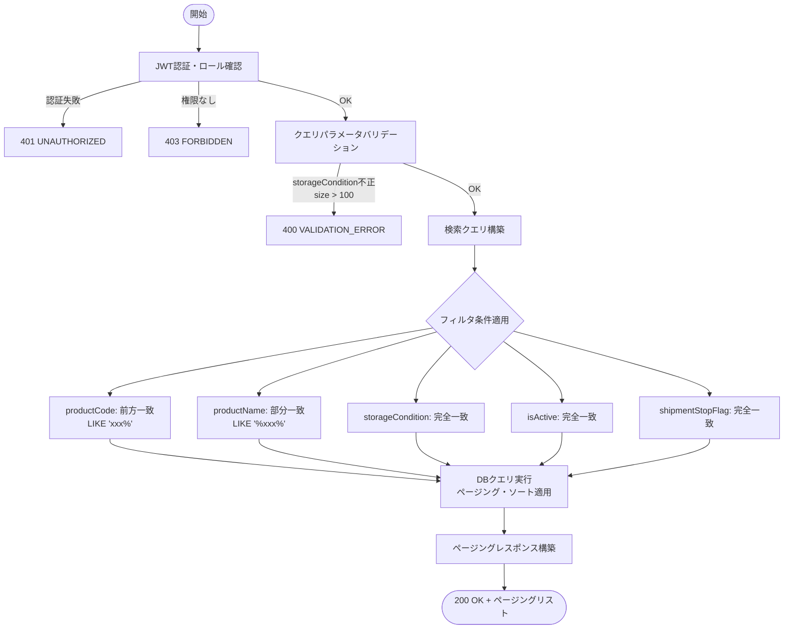
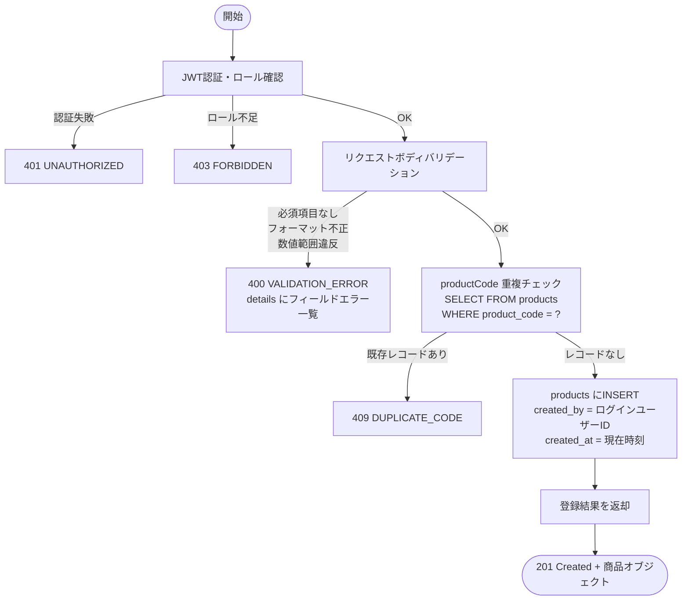
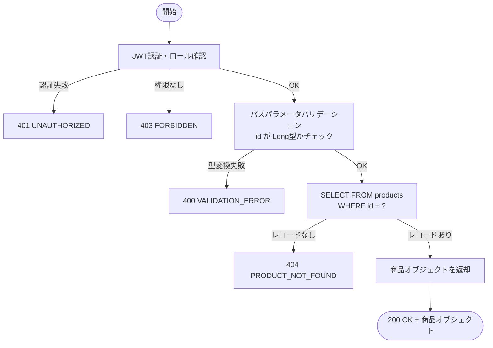
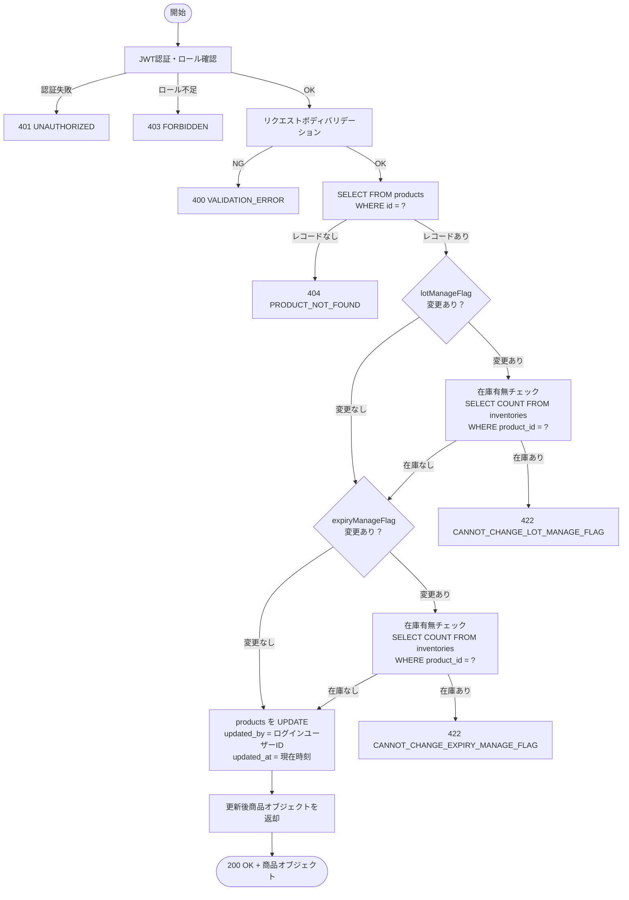
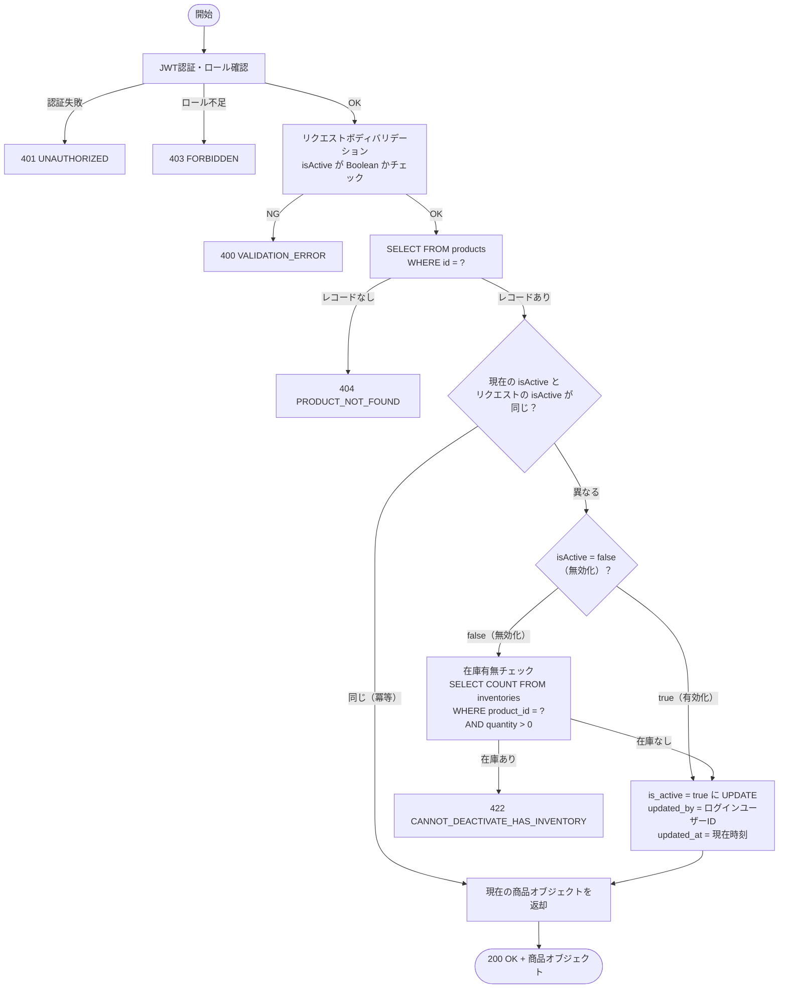

# 機能設計書 — API設計 商品マスタ（MST-PRD）

## 目次

- [API-MST-PRD-001 商品一覧取得](#api-mst-prd-001-商品一覧取得)
- [API-MST-PRD-002 商品登録](#api-mst-prd-002-商品登録)
- [API-MST-PRD-003 商品取得](#api-mst-prd-003-商品取得)
- [API-MST-PRD-004 商品更新](#api-mst-prd-004-商品更新)
- [API-MST-PRD-005 商品無効化/有効化](#api-mst-prd-005-商品無効化有効化)

---

## API-MST-PRD-001 商品一覧取得

### 1. API概要

| 項目 | 内容 |
|------|------|
| **API ID** | `API-MST-PRD-001` |
| **API名** | 商品一覧取得 |
| **メソッド** | `GET` |
| **パス** | `/api/v1/master/products` |
| **認証** | 要 |
| **対象ロール** | SYSTEM_ADMIN, WAREHOUSE_MANAGER, WAREHOUSE_STAFF, VIEWER（全ロール） |
| **概要** | 商品マスタの一覧をページング形式で取得する。複数の検索条件を組み合わせて絞り込みが可能。 |
| **関連画面** | MST-001（商品一覧） |

---

### 2. リクエスト仕様

#### クエリパラメータ

| パラメータ名 | 型 | 必須 | デフォルト | 説明 |
|------------|-----|:----:|----------|------|
| `productCode` | String | — | — | 商品コード（前方一致） |
| `productName` | String | — | — | 商品名（部分一致） |
| `storageCondition` | String | — | — | 保管条件（`AMBIENT` / `REFRIGERATED` / `FROZEN`）。指定なしは全件対象 |
| `isActive` | Boolean | — | — | 有効フラグ（`true` / `false`）。指定なしは全件対象 |
| `shipmentStopFlag` | Boolean | — | — | 出荷禁止フラグ（`true` / `false`）。指定なしは全件対象 |
| `page` | Integer | — | `0` | ページ番号（0始まり） |
| `size` | Integer | — | `20` | 1ページあたりの件数（上限: `100`） |
| `sort` | String | — | `productCode,asc` | ソート指定（例: `productCode,asc` / `updatedAt,desc`） |

#### リクエスト例

```
GET /api/v1/master/products?productCode=P-0&storageCondition=AMBIENT&isActive=true&page=0&size=20&sort=productCode,asc
```

---

### 3. レスポンス仕様

#### 成功レスポンス（200 OK）

```json
{
  "content": [
    {
      "id": 1,
      "productCode": "P-001",
      "productName": "テスト商品A",
      "productNameKana": "テストショウヒンエー",
      "caseQuantity": 6,
      "ballQuantity": 10,
      "barcode": "4901234567890",
      "storageCondition": "AMBIENT",
      "isHazardous": false,
      "lotManageFlag": false,
      "expiryManageFlag": false,
      "shipmentStopFlag": false,
      "isActive": true,
      "createdAt": "2026-03-13T09:00:00+09:00",
      "updatedAt": "2026-03-13T09:00:00+09:00"
    },
    {
      "id": 2,
      "productCode": "P-002",
      "productName": "テスト商品B",
      "productNameKana": "テストショウヒンビー",
      "caseQuantity": 12,
      "ballQuantity": 20,
      "barcode": "4901234567891",
      "storageCondition": "REFRIGERATED",
      "isHazardous": false,
      "lotManageFlag": true,
      "expiryManageFlag": true,
      "shipmentStopFlag": false,
      "isActive": true,
      "createdAt": "2026-03-13T10:00:00+09:00",
      "updatedAt": "2026-03-13T10:00:00+09:00"
    }
  ],
  "page": 0,
  "size": 20,
  "totalElements": 42,
  "totalPages": 3
}
```

#### レスポンスフィールド（`content` 各要素）

| フィールド名 | 型 | 説明 |
|------------|-----|------|
| `id` | Long | 商品ID（PK） |
| `productCode` | String | 商品コード |
| `productName` | String | 商品名 |
| `productNameKana` | String | 商品名カナ |
| `caseQuantity` | Integer | ケース入数 |
| `ballQuantity` | Integer | ボール入数 |
| `barcode` | String | バーコード / JANコード（未設定時はフィールド自体省略） |
| `storageCondition` | String | 保管条件（`AMBIENT` / `REFRIGERATED` / `FROZEN`） |
| `isHazardous` | Boolean | 危険物フラグ |
| `lotManageFlag` | Boolean | ロット管理フラグ |
| `expiryManageFlag` | Boolean | 賞味/使用期限管理フラグ |
| `shipmentStopFlag` | Boolean | 出荷禁止フラグ |
| `isActive` | Boolean | 有効フラグ |
| `createdAt` | String | 作成日時（ISO 8601形式） |
| `updatedAt` | String | 更新日時（ISO 8601形式） |

#### エラーレスポンス

| HTTPステータス | エラーコード | 発生条件 |
|-------------|------------|---------|
| `400 Bad Request` | `VALIDATION_ERROR` | `storageCondition` に無効な値が指定された / `size` が上限（100）を超えた |
| `401 Unauthorized` | `UNAUTHORIZED` | 未認証（Cookieなし・JWT期限切れ） |
| `403 Forbidden` | `FORBIDDEN` | 権限不足 |

---

### 4. 業務ロジック



**ビジネスルール**:

| # | ルール | エラーコード |
|---|--------|------------|
| 1 | `storageCondition` は `AMBIENT` / `REFRIGERATED` / `FROZEN` のいずれかのみ受け付ける | `VALIDATION_ERROR` |
| 2 | `size` パラメータの上限は `100`。超過した場合はバリデーションエラーとする | `VALIDATION_ERROR` |
| 3 | フィルタ条件を複数指定した場合はAND条件で絞り込む | — |
| 4 | `productName` の部分一致検索は大文字/小文字を区別しない（`ILIKE`） | — |
| 5 | `sort` パラメータが不正なフィールド名の場合はデフォルトソート（`productCode,asc`）にフォールバックする | — |

---

### 5. 補足事項

- **パフォーマンス**: `product_code`・`is_active` にインデックスを設けること。`product_name` の部分一致はフルスキャンになりうるため、件数が大量になる場合は pg_trgm インデックスの検討を推奨する。
- **トランザクション**: 読み取り専用（`@Transactional(readOnly = true)`）。
- **ソート複数指定**: `sort` パラメータを複数指定することで複合ソートが可能（例: `?sort=isActive,desc&sort=productCode,asc`）。
- **null フィールド**: `barcode`・`productNameKana` が null の場合、レスポンスフィールドは省略（`@JsonInclude(NON_NULL)`）。

---

---

## API-MST-PRD-002 商品登録

### 1. API概要

| 項目 | 内容 |
|------|------|
| **API ID** | `API-MST-PRD-002` |
| **API名** | 商品登録 |
| **メソッド** | `POST` |
| **パス** | `/api/v1/master/products` |
| **認証** | 要 |
| **対象ロール** | SYSTEM_ADMIN, WAREHOUSE_MANAGER |
| **概要** | 新規商品をマスタに登録する。商品コードはシステム全体で一意であり、登録後は変更不可。 |
| **関連画面** | MST-002（商品登録） |

---

### 2. リクエスト仕様

#### リクエストボディ（`application/json`）

```json
{
  "productCode": "P-001",
  "productName": "テスト商品A",
  "productNameKana": "テストショウヒンエー",
  "caseQuantity": 6,
  "ballQuantity": 10,
  "barcode": "4901234567890",
  "storageCondition": "AMBIENT",
  "isHazardous": false,
  "lotManageFlag": false,
  "expiryManageFlag": false,
  "shipmentStopFlag": false,
  "isActive": true
}
```

#### リクエストフィールド

| フィールド名 | 型 | 必須 | バリデーション | 説明 |
|------------|-----|:----:|-------------|------|
| `productCode` | String | ○ | 最大50文字 / 半角英数字・ハイフンのみ（正規表現: `^[A-Za-z0-9\-]+$`） | 商品コード。登録後変更不可 |
| `productName` | String | ○ | 最大200文字 | 商品名 |
| `productNameKana` | String | — | 最大200文字 | 商品名カナ |
| `caseQuantity` | Integer | ○ | 1以上 | ケース入数 |
| `ballQuantity` | Integer | ○ | 1以上 | ボール入数 |
| `barcode` | String | — | 最大100文字 | バーコード / JANコード |
| `storageCondition` | String | ○ | `AMBIENT` / `REFRIGERATED` / `FROZEN` のいずれか | 保管条件 |
| `isHazardous` | Boolean | ○ | — | 危険物フラグ |
| `lotManageFlag` | Boolean | ○ | — | ロット管理フラグ |
| `expiryManageFlag` | Boolean | ○ | — | 賞味/使用期限管理フラグ |
| `shipmentStopFlag` | Boolean | ○ | — | 出荷禁止フラグ |
| `isActive` | Boolean | ○ | — | 有効フラグ |

---

### 3. レスポンス仕様

#### 成功レスポンス（201 Created）

登録された商品オブジェクトをそのまま返す。

```json
{
  "id": 101,
  "productCode": "P-001",
  "productName": "テスト商品A",
  "productNameKana": "テストショウヒンエー",
  "caseQuantity": 6,
  "ballQuantity": 10,
  "barcode": "4901234567890",
  "storageCondition": "AMBIENT",
  "isHazardous": false,
  "lotManageFlag": false,
  "expiryManageFlag": false,
  "shipmentStopFlag": false,
  "isActive": true,
  "createdAt": "2026-03-13T09:00:00+09:00",
  "updatedAt": "2026-03-13T09:00:00+09:00"
}
```

#### エラーレスポンス

| HTTPステータス | エラーコード | 発生条件 |
|-------------|------------|---------|
| `400 Bad Request` | `VALIDATION_ERROR` | 必須項目の未入力 / フォーマット不正 / 数値範囲違反 |
| `401 Unauthorized` | `UNAUTHORIZED` | 未認証 |
| `403 Forbidden` | `FORBIDDEN` | ロールが WAREHOUSE_STAFF または VIEWER |
| `409 Conflict` | `DUPLICATE_CODE` | `productCode` が既に登録済み |

**バリデーションエラー例**:

```json
{
  "errorCode": "VALIDATION_ERROR",
  "message": "入力内容に誤りがあります",
  "details": [
    {
      "field": "productCode",
      "message": "商品コードは必須です"
    },
    {
      "field": "caseQuantity",
      "message": "ケース入数は1以上の整数を入力してください"
    }
  ]
}
```

**重複エラー例**:

```json
{
  "errorCode": "DUPLICATE_CODE",
  "message": "商品コード「P-001」は既に登録されています",
  "details": []
}
```

---

### 4. 業務ロジック



**ビジネスルール**:

| # | ルール | エラーコード |
|---|--------|------------|
| 1 | `productCode` はシステム全体で一意でなければならない | `DUPLICATE_CODE` |
| 2 | `productCode` は半角英数字・ハイフンのみ使用可（正規表現: `^[A-Za-z0-9\-]+$`） | `VALIDATION_ERROR` |
| 3 | `caseQuantity` / `ballQuantity` は 1 以上の整数でなければならない | `VALIDATION_ERROR` |
| 4 | `storageCondition` は `AMBIENT`・`REFRIGERATED`・`FROZEN` のいずれかでなければならない | `VALIDATION_ERROR` |
| 5 | `created_by` / `updated_by` にはリクエスト元のログインユーザーID を自動設定する | — |

---

### 5. 補足事項

- **トランザクション**: INSERT 単体のため、メソッドレベルでトランザクションを管理する（`@Transactional`）。
- **重複チェックのタイミング**: バリデーション通過後に重複チェックを実施する。並行リクエストによる競合は DB の UNIQUE 制約でガードし、`DataIntegrityViolationException` を `409 DUPLICATE_CODE` にマッピングする。
- **productCode の不変性**: 登録後は `productCode` の変更を API レベルで受け付けない（PUT リクエストのボディに `productCode` が含まれていても無視する）。

---

---

## API-MST-PRD-003 商品取得

### 1. API概要

| 項目 | 内容 |
|------|------|
| **API ID** | `API-MST-PRD-003` |
| **API名** | 商品取得 |
| **メソッド** | `GET` |
| **パス** | `/api/v1/master/products/{id}` |
| **認証** | 要 |
| **対象ロール** | SYSTEM_ADMIN, WAREHOUSE_MANAGER, WAREHOUSE_STAFF, VIEWER（全ロール） |
| **概要** | 指定したIDの商品情報を1件取得する。商品編集画面の初期表示や、在庫・入荷・出荷画面での商品詳細確認に使用する。 |
| **関連画面** | MST-003（商品編集）、その他参照系画面全般 |

---

### 2. リクエスト仕様

#### パスパラメータ

| パラメータ名 | 型 | 必須 | 説明 |
|------------|-----|:----:|------|
| `id` | Long | ○ | 商品ID（PK） |

#### リクエスト例

```
GET /api/v1/master/products/101
```

---

### 3. レスポンス仕様

#### 成功レスポンス（200 OK）

```json
{
  "id": 101,
  "productCode": "P-001",
  "productName": "テスト商品A",
  "productNameKana": "テストショウヒンエー",
  "caseQuantity": 6,
  "ballQuantity": 10,
  "barcode": "4901234567890",
  "storageCondition": "AMBIENT",
  "isHazardous": false,
  "lotManageFlag": false,
  "expiryManageFlag": false,
  "shipmentStopFlag": false,
  "isActive": true,
  "createdAt": "2026-03-13T09:00:00+09:00",
  "updatedAt": "2026-03-13T09:30:00+09:00"
}
```

#### レスポンスフィールド

| フィールド名 | 型 | 説明 |
|------------|-----|------|
| `id` | Long | 商品ID（PK） |
| `productCode` | String | 商品コード |
| `productName` | String | 商品名 |
| `productNameKana` | String | 商品名カナ（未設定時はフィールド省略） |
| `caseQuantity` | Integer | ケース入数 |
| `ballQuantity` | Integer | ボール入数 |
| `barcode` | String | バーコード / JANコード（未設定時はフィールド省略） |
| `storageCondition` | String | 保管条件（`AMBIENT` / `REFRIGERATED` / `FROZEN`） |
| `isHazardous` | Boolean | 危険物フラグ |
| `lotManageFlag` | Boolean | ロット管理フラグ |
| `expiryManageFlag` | Boolean | 賞味/使用期限管理フラグ |
| `shipmentStopFlag` | Boolean | 出荷禁止フラグ |
| `isActive` | Boolean | 有効フラグ |
| `createdAt` | String | 作成日時（ISO 8601形式） |
| `updatedAt` | String | 更新日時（ISO 8601形式） |

#### エラーレスポンス

| HTTPステータス | エラーコード | 発生条件 |
|-------------|------------|---------|
| `400 Bad Request` | `VALIDATION_ERROR` | `id` が Long に変換できない（文字列等） |
| `401 Unauthorized` | `UNAUTHORIZED` | 未認証 |
| `403 Forbidden` | `FORBIDDEN` | 権限不足 |
| `404 Not Found` | `PRODUCT_NOT_FOUND` | 指定IDの商品が存在しない |

---

### 4. 業務ロジック



**ビジネスルール**:

| # | ルール | エラーコード |
|---|--------|------------|
| 1 | 指定IDの商品が存在しない場合は 404 を返す | `PRODUCT_NOT_FOUND` |
| 2 | 有効フラグ（`isActive`）の状態に関わらず取得できる（無効化済み商品も取得可能） | — |

---

### 5. 補足事項

- **トランザクション**: 読み取り専用（`@Transactional(readOnly = true)`）。
- **利用用途**: 商品編集画面の初期表示（MST-003）の他、在庫管理・入荷・出荷の各画面から商品詳細を確認する際にも呼び出される。
- **在庫有無情報**: 商品取得レスポンスには在庫有無は含まない。編集画面で `lotManageFlag` / `expiryManageFlag` の変更可否を制御する際は、フロントエンドが別途在庫照会API（`GET /api/v1/inventory?productId=xxx`）を呼び出して判定する。

---

---

## API-MST-PRD-004 商品更新

### 1. API概要

| 項目 | 内容 |
|------|------|
| **API ID** | `API-MST-PRD-004` |
| **API名** | 商品更新 |
| **メソッド** | `PUT` |
| **パス** | `/api/v1/master/products/{id}` |
| **認証** | 要 |
| **対象ロール** | SYSTEM_ADMIN, WAREHOUSE_MANAGER |
| **概要** | 指定したIDの商品情報を更新する。商品コード（`productCode`）は変更不可。在庫が存在する商品のロット管理フラグ・賞味/使用期限管理フラグは変更不可。 |
| **関連画面** | MST-003（商品編集） |

---

### 2. リクエスト仕様

#### パスパラメータ

| パラメータ名 | 型 | 必須 | 説明 |
|------------|-----|:----:|------|
| `id` | Long | ○ | 商品ID（PK） |

#### リクエストボディ（`application/json`）

`productCode` は含まない（変更不可のため受け付けない）。

```json
{
  "productName": "テスト商品A（改）",
  "productNameKana": "テストショウヒンエーカイ",
  "caseQuantity": 6,
  "ballQuantity": 10,
  "barcode": "4901234567890",
  "storageCondition": "AMBIENT",
  "isHazardous": false,
  "lotManageFlag": false,
  "expiryManageFlag": false,
  "shipmentStopFlag": false,
  "isActive": true
}
```

#### リクエストフィールド

| フィールド名 | 型 | 必須 | バリデーション | 説明 |
|------------|-----|:----:|-------------|------|
| `productName` | String | ○ | 最大200文字 | 商品名 |
| `productNameKana` | String | — | 最大200文字 | 商品名カナ |
| `caseQuantity` | Integer | ○ | 1以上 | ケース入数 |
| `ballQuantity` | Integer | ○ | 1以上 | ボール入数 |
| `barcode` | String | — | 最大100文字 | バーコード / JANコード |
| `storageCondition` | String | ○ | `AMBIENT` / `REFRIGERATED` / `FROZEN` のいずれか | 保管条件 |
| `isHazardous` | Boolean | ○ | — | 危険物フラグ |
| `lotManageFlag` | Boolean | ○ | — | ロット管理フラグ（在庫存在時は変更不可） |
| `expiryManageFlag` | Boolean | ○ | — | 賞味/使用期限管理フラグ（在庫存在時は変更不可） |
| `shipmentStopFlag` | Boolean | ○ | — | 出荷禁止フラグ |
| `isActive` | Boolean | ○ | — | 有効フラグ |

---

### 3. レスポンス仕様

#### 成功レスポンス（200 OK）

更新後の商品オブジェクトを返す。

```json
{
  "id": 101,
  "productCode": "P-001",
  "productName": "テスト商品A（改）",
  "productNameKana": "テストショウヒンエーカイ",
  "caseQuantity": 6,
  "ballQuantity": 10,
  "barcode": "4901234567890",
  "storageCondition": "AMBIENT",
  "isHazardous": false,
  "lotManageFlag": false,
  "expiryManageFlag": false,
  "shipmentStopFlag": false,
  "isActive": true,
  "createdAt": "2026-03-13T09:00:00+09:00",
  "updatedAt": "2026-03-13T11:00:00+09:00"
}
```

#### エラーレスポンス

| HTTPステータス | エラーコード | 発生条件 |
|-------------|------------|---------|
| `400 Bad Request` | `VALIDATION_ERROR` | 必須項目の未入力 / フォーマット不正 / 数値範囲違反 |
| `401 Unauthorized` | `UNAUTHORIZED` | 未認証 |
| `403 Forbidden` | `FORBIDDEN` | ロールが WAREHOUSE_STAFF または VIEWER |
| `404 Not Found` | `PRODUCT_NOT_FOUND` | 指定IDの商品が存在しない |
| `422 Unprocessable Entity` | `CANNOT_CHANGE_LOT_MANAGE_FLAG` | 在庫が存在する商品の `lotManageFlag` を変更しようとした |
| `422 Unprocessable Entity` | `CANNOT_CHANGE_EXPIRY_MANAGE_FLAG` | 在庫が存在する商品の `expiryManageFlag` を変更しようとした |

**業務制約エラー例**:

```json
{
  "errorCode": "CANNOT_CHANGE_LOT_MANAGE_FLAG",
  "message": "在庫が存在するため、ロット管理フラグは変更できません",
  "details": []
}
```

---

### 4. 業務ロジック



**ビジネスルール**:

| # | ルール | エラーコード |
|---|--------|------------|
| 1 | `productCode` はリクエストボディに含まれていても無視する（変更不可） | — |
| 2 | リクエストの `lotManageFlag` が現在値と異なり、かつ当該商品の在庫（`inventories` テーブル）が 1 件以上存在する場合は変更不可 | `CANNOT_CHANGE_LOT_MANAGE_FLAG` |
| 3 | リクエストの `expiryManageFlag` が現在値と異なり、かつ当該商品の在庫が 1 件以上存在する場合は変更不可 | `CANNOT_CHANGE_EXPIRY_MANAGE_FLAG` |
| 4 | 在庫チェックは `inventories` テーブルの `product_id = :id AND quantity > 0` の件数で判定する | — |
| 5 | `lotManageFlag` と `expiryManageFlag` の両方が変更対象かつ両方が制約違反の場合、`CANNOT_CHANGE_LOT_MANAGE_FLAG` を先に返す | — |
| 6 | `updated_by` にはリクエスト元のログインユーザーID を自動設定する | — |

---

### 5. 補足事項

- **トランザクション**: 在庫有無チェック → UPDATE の一連の操作をひとつのトランザクション内で実行すること（`@Transactional`）。チェックと更新の間に別リクエストが在庫を追加する競合を防ぐため、商品レコードの SELECT 時に `SELECT ... FOR UPDATE` または楽観ロック（バージョン管理）の採用を検討する。
- **productCode の不変性**: リクエストボディに `productCode` フィールドが含まれていても、サーバー側でそのフィールドを無視して処理を続行する（400 エラーとしない）。
- **isActive の変更**: PUT リクエストでも `isActive` の変更は受け付ける。ただし無効化時の在庫チェックは本 API では行わない（無効化専用の API-MST-PRD-005 を使用すること）。

---

---

## API-MST-PRD-005 商品無効化/有効化

### 1. API概要

| 項目 | 内容 |
|------|------|
| **API ID** | `API-MST-PRD-005` |
| **API名** | 商品無効化/有効化 |
| **メソッド** | `PATCH` |
| **パス** | `/api/v1/master/products/{id}/deactivate` |
| **認証** | 要 |
| **対象ロール** | SYSTEM_ADMIN, WAREHOUSE_MANAGER |
| **概要** | 指定した商品の有効/無効フラグを切り替える。無効化時は在庫の有無をチェックし、在庫が存在する場合は無効化不可とする。有効化は無条件で実施可能。 |
| **関連画面** | MST-001（商品一覧） |

---

### 2. リクエスト仕様

#### パスパラメータ

| パラメータ名 | 型 | 必須 | 説明 |
|------------|-----|:----:|------|
| `id` | Long | ○ | 商品ID（PK） |

#### リクエストボディ（`application/json`）

```json
{
  "isActive": false
}
```

| フィールド名 | 型 | 必須 | バリデーション | 説明 |
|------------|-----|:----:|-------------|------|
| `isActive` | Boolean | ○ | — | `false` で無効化、`true` で有効化 |

---

### 3. レスポンス仕様

#### 成功レスポンス（200 OK）

更新後の商品オブジェクトを返す。

```json
{
  "id": 101,
  "productCode": "P-001",
  "productName": "テスト商品A",
  "productNameKana": "テストショウヒンエー",
  "caseQuantity": 6,
  "ballQuantity": 10,
  "barcode": "4901234567890",
  "storageCondition": "AMBIENT",
  "isHazardous": false,
  "lotManageFlag": false,
  "expiryManageFlag": false,
  "shipmentStopFlag": false,
  "isActive": false,
  "createdAt": "2026-03-13T09:00:00+09:00",
  "updatedAt": "2026-03-13T12:00:00+09:00"
}
```

#### エラーレスポンス

| HTTPステータス | エラーコード | 発生条件 |
|-------------|------------|---------|
| `400 Bad Request` | `VALIDATION_ERROR` | `isActive` が null / Boolean 以外の値 |
| `401 Unauthorized` | `UNAUTHORIZED` | 未認証 |
| `403 Forbidden` | `FORBIDDEN` | ロールが WAREHOUSE_STAFF または VIEWER |
| `404 Not Found` | `PRODUCT_NOT_FOUND` | 指定IDの商品が存在しない |
| `422 Unprocessable Entity` | `CANNOT_DEACTIVATE_HAS_INVENTORY` | 無効化しようとした商品に在庫が存在する |

**業務制約エラー例**:

```json
{
  "errorCode": "CANNOT_DEACTIVATE_HAS_INVENTORY",
  "message": "在庫が存在するため、この商品を無効化できません",
  "details": []
}
```

---

### 4. 業務ロジック



**ビジネスルール**:

| # | ルール | エラーコード |
|---|--------|------------|
| 1 | 無効化（`isActive: false`）時は `inventories` テーブルで `product_id = :id AND quantity > 0` の件数が 1 件以上の場合は無効化不可 | `CANNOT_DEACTIVATE_HAS_INVENTORY` |
| 2 | 有効化（`isActive: true`）は在庫の有無に関わらず無条件で実施できる | — |
| 3 | 現在の `isActive` と同じ値が送信された場合は冪等として処理し、現在の商品オブジェクトをそのまま返す（エラーとしない） | — |
| 4 | `updated_by` にはリクエスト元のログインユーザーID を自動設定する | — |
| 5 | 無効化された商品は入荷予定・受注・ピッキング指示の新規登録で選択不可となる（各 API の業務チェックで制御） | — |

---

### 5. 補足事項

- **トランザクション**: 在庫有無チェック → UPDATE の一連の操作をひとつのトランザクション内で実行すること（`@Transactional`）。
- **冪等性**: 同一状態への再リクエストは正常（200 OK）として処理する。これによりフロントエンドのリトライが安全に行える。
- **パス名について**: エンドポイントのパスは `/deactivate` だが、`isActive: true` を送信することで有効化も行える。パス名は有効化・無効化の切り替え操作を表す慣用的な命名として許容する。
- **出荷禁止フラグとの関係**: `isActive: false`（無効化）と `shipmentStopFlag: true`（出荷禁止）は独立した概念である。無効化は商品マスタ自体の使用停止を意味し、出荷禁止は一時的な出荷停止措置を意味する。
