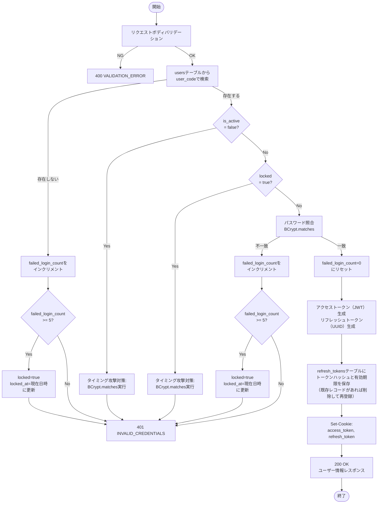
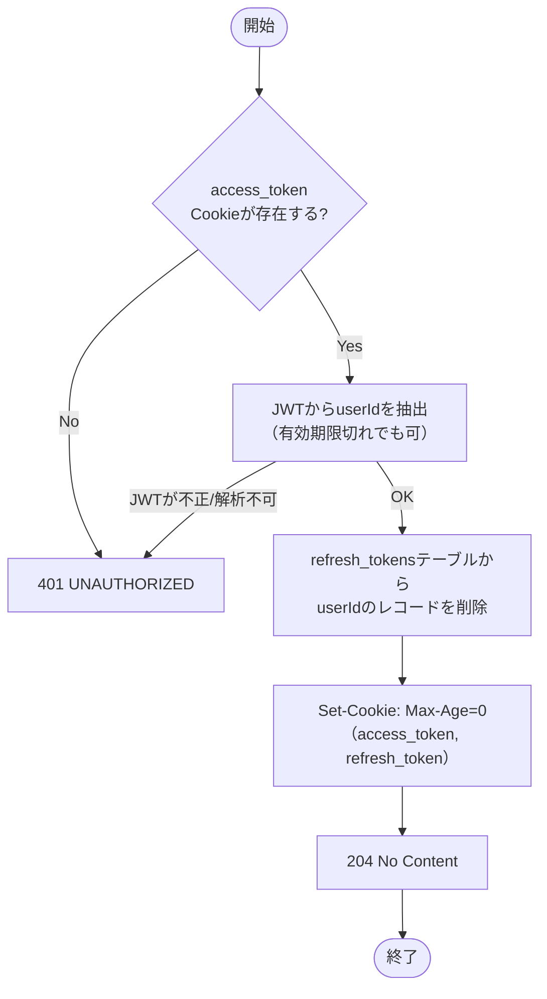
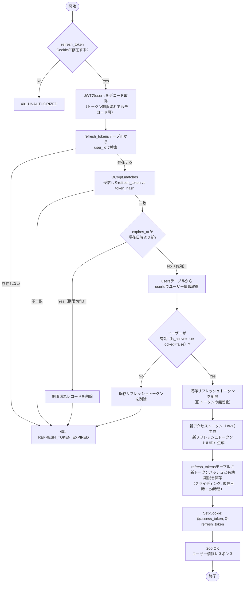
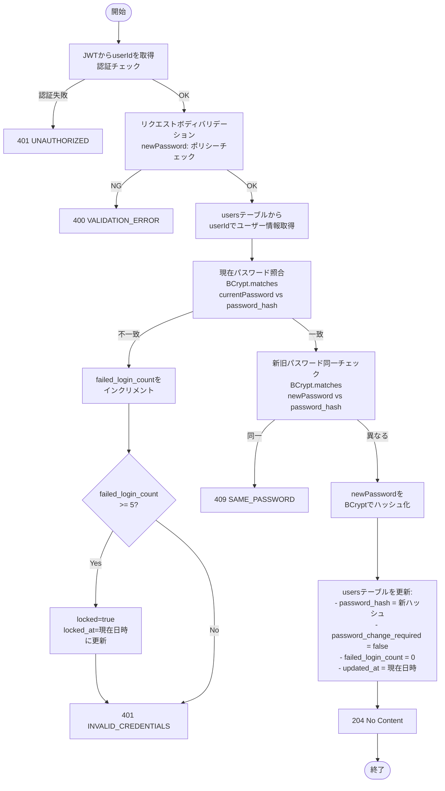
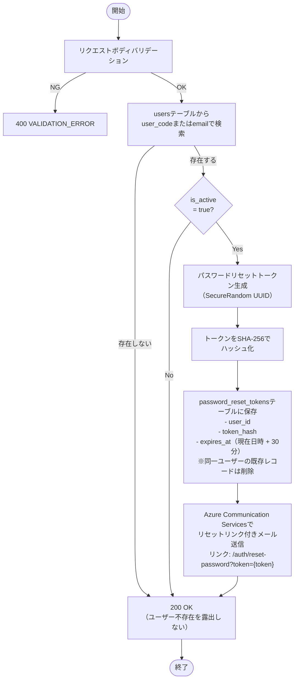
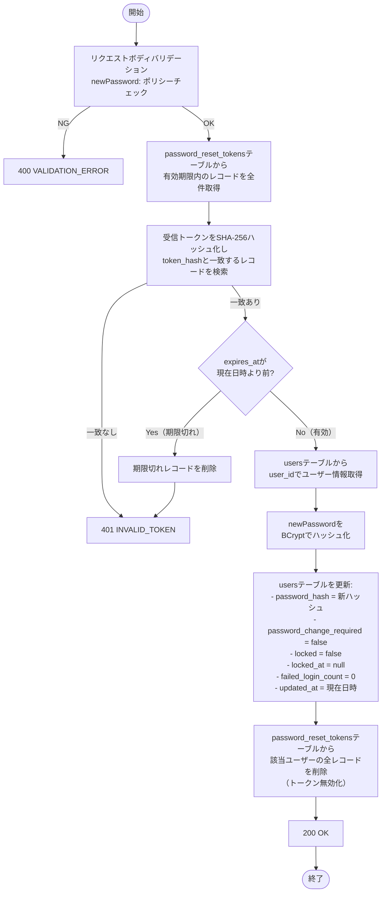
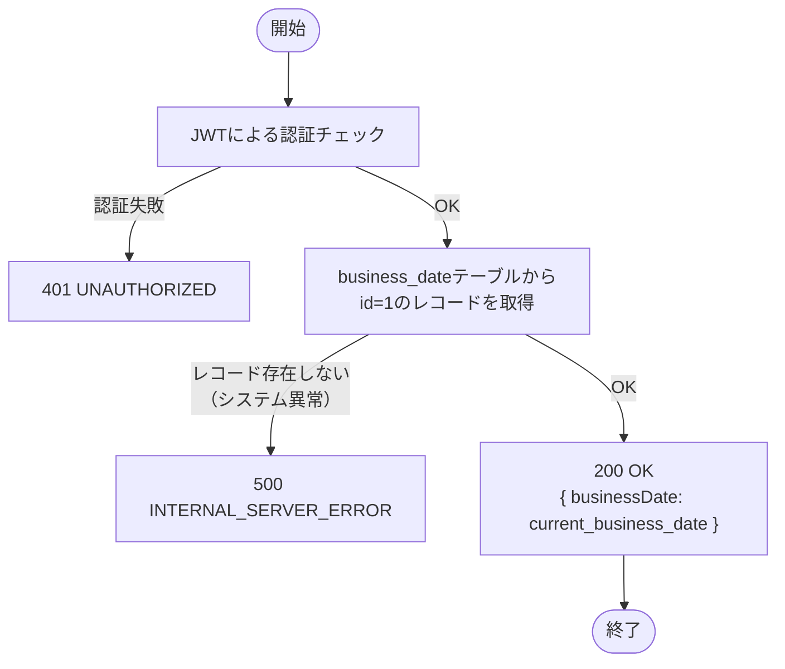

# 機能設計書 — API設計 認証・システム共通（AUTH / SYS）

> **関連ドキュメント**: [08-api-overview.md](./08-api-overview.md)（API共通仕様・エラーコード一覧）

---

## API-AUTH-001 ログイン

### 1. API概要

| 項目 | 内容 |
|------|------|
| **API ID** | `API-AUTH-001` |
| **API名** | ログイン |
| **メソッド** | `POST` |
| **パス** | `/api/v1/auth/login` |
| **認証** | 不要 |
| **対象ロール** | — |
| **概要** | ユーザーコードとパスワードで認証し、JWTアクセストークンおよびリフレッシュトークンをhttpOnlyクッキーにセットして返す |
| **関連画面** | AUTH-001（ログイン画面） |

---

### 2. リクエスト仕様

#### リクエストボディ

```json
{
  "userCode": "admin001",
  "password": "password123"
}
```

| フィールド名 | 型 | 必須 | バリデーション | 説明 |
|------------|-----|:----:|-------------|------|
| `userCode` | String | ○ | 最大50文字、空白不可 | ログインID |
| `password` | String | ○ | 最大255文字、空白不可 | パスワード（平文） |

---

### 3. レスポンス仕様

#### 成功レスポンス（200 OK）

```json
{
  "userId": 1,
  "userCode": "admin001",
  "fullName": "山田 太郎",
  "role": "SYSTEM_ADMIN",
  "passwordChangeRequired": false
}
```

| フィールド名 | 型 | 説明 |
|------------|-----|------|
| `userId` | Long | ユーザーID |
| `userCode` | String | ユーザーコード |
| `fullName` | String | 氏名 |
| `role` | String | ロール（`SYSTEM_ADMIN` / `WAREHOUSE_MANAGER` / `WAREHOUSE_STAFF` / `VIEWER`） |
| `passwordChangeRequired` | Boolean | 初回ログイン・パスワード変更要求フラグ。`true` の場合、フロントエンドはパスワード変更画面（AUTH-002）に遷移する |

#### Set-Cookie ヘッダー

| Cookie名 | 説明 | 属性 |
|----------|------|------|
| `access_token` | JWTアクセストークン | `HttpOnly; SameSite=Lax; Path=/; Max-Age=3600` |
| `refresh_token` | リフレッシュトークン（ランダム文字列） | `HttpOnly; SameSite=Lax; Path=/api/v1/auth/refresh; Max-Age=86400` |

```
Set-Cookie: access_token=eyJhbGciOiJIUzI1NiJ9...; HttpOnly; SameSite=Lax; Path=/; Max-Age=3600
Set-Cookie: refresh_token=a1b2c3d4e5f6...; HttpOnly; SameSite=Lax; Path=/api/v1/auth/refresh; Max-Age=86400
```

> `refresh_token` のPathを `/api/v1/auth/refresh` に限定することで、他のAPIリクエスト時にリフレッシュトークンが送信されることを防ぐ。

#### エラーレスポンス

| HTTPステータス | エラーコード | 発生条件 |
|-------------|-----------|---------|
| `400 Bad Request` | `VALIDATION_ERROR` | リクエストボディの必須項目が欠落、または形式不正 |
| `401 Unauthorized` | `INVALID_CREDENTIALS` | 認証失敗（理由を問わず共通） |

---

### 4. 業務ロジック



**ビジネスルール**:

| # | ルール | エラーコード |
|---|--------|------------|
| 1 | ユーザーコードが存在しない場合、パスワードが一致しない場合のどちらも `INVALID_CREDENTIALS` を返す（セキュリティのため区別しない） | `INVALID_CREDENTIALS` |
| 2 | 認証失敗（ユーザー不存在・パスワード不一致）のたびに `failed_login_count` をインクリメントする | — |
| 3 | `failed_login_count` が5以上になった場合、`locked=true` に更新してアカウントをロックする | `INVALID_CREDENTIALS` |
| 4 | `is_active=false` のユーザーは認証失敗とする（ロック確認より前に実施）。タイミング攻撃対策としてBCrypt照合を実行してから `INVALID_CREDENTIALS` を返す | `INVALID_CREDENTIALS` |
| 5 | `locked=true` のユーザーは認証失敗とする。タイミング攻撃対策としてBCrypt照合を実行してから `INVALID_CREDENTIALS` を返す | `INVALID_CREDENTIALS` |
| 6 | 認証成功時に `failed_login_count=0` にリセットする | — |
| 7 | リフレッシュトークンはUUIDを生成し、BCryptでハッシュ化して `refresh_tokens` テーブルに保存する。同一ユーザーの既存レコードは削除して再登録する | — |
| 8 | `passwordChangeRequired=true` の場合、レスポンスボディにそのまま含めて返す。フロントエンドがこのフラグを見てパスワード変更画面に遷移する | — |

> **セキュリティ注記**: 認証失敗時のエラーレスポンスは理由を問わず `401 INVALID_CREDENTIALS` に統一する。これはOWASP認証チートシートに基づくユーザー列挙防止策である。サーバー側ではアカウント状態（ロック・無効化）のチェックは引き続き実施し、監査ログにはロック・無効化の理由を記録する。

---

### 5. 補足事項

- **トランザクション境界**: ユーザー情報の更新（`failed_login_count` リセット・リフレッシュトークン保存）は単一トランザクションで実施する。
- **セキュリティ考慮**: ログイン失敗時のレスポンスタイムを一定にするため、ユーザーが存在しない場合でもBCryptのダミー照合を実施してタイミング攻撃を防ぐ。
- **アクセストークン（JWT）ペイロード**: `userId`、`userCode`、`role`、`iat`（発行日時）、`exp`（有効期限）を含む。署名アルゴリズムはHS256を使用。

---

---

## API-AUTH-002 ログアウト

### 1. API概要

| 項目 | 内容 |
|------|------|
| **API ID** | `API-AUTH-002` |
| **API名** | ログアウト |
| **メソッド** | `POST` |
| **パス** | `/api/v1/auth/logout` |
| **認証** | 要（`access_token` Cookie） |
| **対象ロール** | 全ロール（`SYSTEM_ADMIN` / `WAREHOUSE_MANAGER` / `WAREHOUSE_STAFF` / `VIEWER`） |
| **概要** | サーバー側のリフレッシュトークンを削除し、クライアント側のCookieを無効化してログアウト状態にする |
| **関連画面** | 共通ヘッダー（全画面のログアウトボタン） |

---

### 2. リクエスト仕様

#### リクエストボディ

なし（リクエストボディ不要）

---

### 3. レスポンス仕様

#### 成功レスポンス（204 No Content）

レスポンスボディなし。

#### Set-Cookie ヘッダー（Cookie削除）

```
Set-Cookie: access_token=; HttpOnly; SameSite=Lax; Path=/; Max-Age=0
Set-Cookie: refresh_token=; HttpOnly; SameSite=Lax; Path=/api/v1/auth/refresh; Max-Age=0
```

> `Max-Age=0` を指定することでブラウザ側のCookieを即時削除する。

#### エラーレスポンス

| HTTPステータス | エラーコード | 発生条件 |
|-------------|-----------|---------|
| `401 Unauthorized` | `UNAUTHORIZED` | `access_token` Cookieが存在しない、または無効なJWT |

> アクセストークンが期限切れ（`TOKEN_EXPIRED`）の場合でもログアウト処理を許容する設計とする。期限切れトークンからユーザーIDを抽出してリフレッシュトークンを削除する。

---

### 4. 業務ロジック



**ビジネスルール**:

| # | ルール | エラーコード |
|---|--------|------------|
| 1 | `access_token` CookieからユーザーIDを抽出し、`refresh_tokens` テーブルの対象ユーザーの全レコードを削除する | — |
| 2 | JWTの有効期限が切れていても、署名が正当であればユーザーIDを取得してログアウト処理を継続する | — |
| 3 | リフレッシュトークンが既にDBに存在しない場合（二重ログアウト等）でも204を返す（冪等性の確保） | — |

---

### 5. 補足事項

- **トランザクション境界**: `refresh_tokens` テーブルの削除のみ。Cookie削除はHTTPレスポンスヘッダーのため、トランザクション対象外。
- **冪等性**: 既にログアウト済みの状態（`refresh_tokens` にレコードなし）でも正常終了（204）を返す。

---

---

## API-AUTH-003 トークンリフレッシュ

### 1. API概要

| 項目 | 内容 |
|------|------|
| **API ID** | `API-AUTH-003` |
| **API名** | トークンリフレッシュ |
| **メソッド** | `POST` |
| **パス** | `/api/v1/auth/refresh` |
| **認証** | 不要（`access_token` 不要、`refresh_token` Cookieのみ使用） |
| **対象ロール** | — |
| **概要** | `refresh_token` Cookieを検証し、新しいアクセストークンとリフレッシュトークンを発行して返す（トークンローテーション） |
| **関連画面** | （フロントエンドの自動リフレッシュ処理） |

---

### 2. リクエスト仕様

#### リクエストボディ

なし（`refresh_token` CookieはブラウザによりHTTPリクエストに自動付与）

---

### 3. レスポンス仕様

#### 成功レスポンス（200 OK）

```json
{
  "userId": 1,
  "userCode": "admin001",
  "fullName": "山田 太郎",
  "role": "SYSTEM_ADMIN"
}
```

| フィールド名 | 型 | 説明 |
|------------|-----|------|
| `userId` | Long | ユーザーID |
| `userCode` | String | ユーザーコード |
| `fullName` | String | 氏名 |
| `role` | String | ロール |

#### Set-Cookie ヘッダー

新しいアクセストークンとリフレッシュトークンを発行し、Cookieをセットし直す。

```
Set-Cookie: access_token=eyJhbGciOiJIUzI1NiJ9...(新しいJWT); HttpOnly; SameSite=Lax; Path=/; Max-Age=3600
Set-Cookie: refresh_token=f7g8h9i0j1k2...(新しいUUID); HttpOnly; SameSite=Lax; Path=/api/v1/auth/refresh; Max-Age=86400
```

#### エラーレスポンス

| HTTPステータス | エラーコード | 発生条件 |
|-------------|-----------|---------|
| `401 Unauthorized` | `UNAUTHORIZED` | `refresh_token` Cookieが存在しない |
| `401 Unauthorized` | `REFRESH_TOKEN_EXPIRED` | リフレッシュトークンがDBに存在しない、または `expires_at` が現在日時より前 |

---

### 4. 業務ロジック



**ビジネスルール**:

| # | ルール | エラーコード |
|---|--------|------------|
| 1 | リフレッシュトークンはスライディング方式を採用する。リフレッシュAPIを呼び出すたびに有効期限が「現在日時 + 24時間」に更新される | — |
| 2 | トークンローテーションを実施する。旧リフレッシュトークンはDBから削除し、新リフレッシュトークンをDBに保存する（リプレイ攻撃対策） | — |
| 3 | リフレッシュトークンが存在しない、または期限切れの場合は `REFRESH_TOKEN_EXPIRED` を返し、フロントエンドに再ログインを要求する | `REFRESH_TOKEN_EXPIRED` |
| 4 | リフレッシュトークンが有効でもユーザーが無効（`is_active=false`）またはロック（`locked=true`）の場合は、トークンを削除して `REFRESH_TOKEN_EXPIRED` を返す | `REFRESH_TOKEN_EXPIRED` |
| 5 | リフレッシュトークンの検証は `user_id` でレコードを絞り込んだ後、`BCrypt.matches(受信したrefresh_token, token_hash)` で照合する。BCryptは一方向ハッシュのため「ハッシュ化して検索」は不可能であり、userIdを使って絞り込んでからBCrypt照合する方式を採用する（JWTは期限切れでもuserIdのデコードが可能） | — |

---

### 5. 補足事項

- **トランザクション境界**: 旧リフレッシュトークンの削除・新リフレッシュトークンの保存は単一トランザクションで実施する。
- **フロントエンドの自動リフレッシュ処理**: Axios インターセプターで401 `TOKEN_EXPIRED` を受信した場合にこのAPIを自動呼び出しし、元のリクエストを再実行する。
- **アクセストークンのPath制限なし**: `access_token` の `Path=/` により、全APIエンドポイントにアクセストークンが自動送信される。リフレッシュトークンは `Path=/api/v1/auth/refresh` に限定して送信範囲を絞る。

---

---

## API-AUTH-004 パスワード変更

### 1. API概要

| 項目 | 内容 |
|------|------|
| **API ID** | `API-AUTH-004` |
| **API名** | パスワード変更 |
| **メソッド** | `POST` |
| **パス** | `/api/v1/auth/change-password` |
| **認証** | 要（`access_token` Cookie） |
| **対象ロール** | 全ロール（`SYSTEM_ADMIN` / `WAREHOUSE_MANAGER` / `WAREHOUSE_STAFF` / `VIEWER`） |
| **概要** | 現在のパスワードを確認した上で新しいパスワードに変更する。初回ログイン時のパスワード変更にも使用する |
| **関連画面** | AUTH-002（パスワード変更画面） |

---

### 2. リクエスト仕様

#### リクエストボディ

```json
{
  "currentPassword": "oldpass123",
  "newPassword": "newpass456"
}
```

| フィールド名 | 型 | 必須 | バリデーション | 説明 |
|------------|-----|:----:|-------------|------|
| `currentPassword` | String | ○ | 最大255文字、空白不可 | 現在のパスワード（平文） |
| `newPassword` | String | ○ | パスワードポリシーを満たすこと（最大255文字、空白不可） | 新しいパスワード（平文） |

---

### 3. レスポンス仕様

#### 成功レスポンス（204 No Content）

レスポンスボディなし。

#### エラーレスポンス

| HTTPステータス | エラーコード | 発生条件 |
|-------------|-----------|---------|
| `400 Bad Request` | `VALIDATION_ERROR` | `newPassword` がパスワードポリシー違反、または必須項目が欠落 |
| `401 Unauthorized` | `UNAUTHORIZED` | `access_token` Cookieが存在しない、または無効なJWT |
| `401 Unauthorized` | `INVALID_CREDENTIALS` | `currentPassword` が現在のパスワードと一致しない、またはアカウントがロックされている |
| `409 Conflict` | `SAME_PASSWORD` | `newPassword` が現在のパスワードと同一 |

---

### 4. 業務ロジック



**ビジネスルール**:

| # | ルール | エラーコード |
|---|--------|------------|
| 1 | `currentPassword` が `password_hash` と一致しない場合は `failed_login_count` をインクリメントし `INVALID_CREDENTIALS` を返す | `INVALID_CREDENTIALS` |
| 2 | `failed_login_count` が5以上になった場合、`locked=true`・`locked_at=現在日時` に更新して `INVALID_CREDENTIALS` を返す（`10-security-architecture.md` に定義された連続失敗ロックポリシーをパスワード変更APIにも適用） | `INVALID_CREDENTIALS` |
| 3 | `newPassword` が現在の `password_hash` と一致する場合（同じパスワードへの変更）は `SAME_PASSWORD` を返す | `SAME_PASSWORD` |
| 4 | `newPassword` はパスワードポリシーを満たすこと（サーバー側でも検証） | `VALIDATION_ERROR` |
| 5 | パスワード変更成功時に `password_change_required=false` および `failed_login_count=0` をリセットする | — |
| 6 | パスワードはBCrypt（強度12）でハッシュ化して保存する | — |

---

### 5. 補足事項

- **トランザクション境界**: `users` テーブルの1レコード更新のみ。
- **パスワードポリシー**: パスワードポリシーの詳細は [10-security-architecture.md](../../architecture-blueprint/10-security-architecture.md) のパスワード管理を参照。
- **ログアウト不要**: パスワード変更後もセッション（JWTとリフレッシュトークン）は維持される。セキュリティ要件に応じて変更時にトークン無効化を検討すること。

---

---

## API-AUTH-005 パスワードリセット申請

### 1. API概要

| 項目 | 内容 |
|------|------|
| **API ID** | `API-AUTH-005` |
| **API名** | パスワードリセット申請 |
| **メソッド** | `POST` |
| **パス** | `/api/v1/auth/password-reset/request` |
| **認証** | 不要 |
| **対象ロール** | — |
| **概要** | ユーザーコードまたはメールアドレスを受け取り、該当ユーザーにパスワードリセット用のメールを送信する。セキュリティ上、ユーザーの存在有無にかかわらず常に同一のレスポンスを返す |
| **関連画面** | AUTH-003（パスワードリセット申請画面） |

---

### 2. リクエスト仕様

#### リクエストボディ

```json
{
  "identifier": "admin001"
}
```

| フィールド名 | 型 | 必須 | バリデーション | 説明 |
|------------|-----|:----:|-------------|------|
| `identifier` | String | ○ | 最大255文字、空白不可 | ユーザーコードまたはメールアドレス |

---

### 3. レスポンス仕様

#### 成功レスポンス（200 OK）

```json
{
  "message": "If the account exists, a password reset email has been sent."
}
```

| フィールド名 | 型 | 説明 |
|------------|-----|------|
| `message` | String | 固定メッセージ（ユーザーの存在有無にかかわらず同一） |

> セキュリティ上の理由から、ユーザーが存在しない場合でも200 OKを返す。エラーレスポンスによるユーザー列挙攻撃を防止する。

#### エラーレスポンス

| HTTPステータス | エラーコード | 発生条件 |
|-------------|-----------|---------|
| `400 Bad Request` | `VALIDATION_ERROR` | `identifier` が未入力、または形式不正 |
| `429 Too Many Requests` | `RATE_LIMIT_EXCEEDED` | 同一IPまたは同一 `identifier` からの短時間大量リクエスト（レートリミット超過） |

---

### 4. 業務ロジック



**ビジネスルール**:

| # | ルール | エラーコード |
|---|--------|------------|
| 1 | ユーザーが存在しない場合でも200 OKを返す。レスポンスの内容・応答時間を統一し、ユーザー列挙攻撃を防止する | — |
| 2 | `is_active=false` のユーザーにはメールを送信しない（200 OKは返す） | — |
| 3 | トークンはSecureRandomでUUIDを生成し、SHA-256でハッシュ化して `password_reset_tokens` テーブルに保存する | — |
| 4 | トークンの有効期限は発行から30分とする | — |
| 5 | 同一ユーザーに対する既存のリセットトークンがある場合は削除して新規発行する（最新のトークンのみ有効） | — |
| 6 | メール送信には Azure Communication Services を使用する。リセットリンクURLは環境変数から取得したベースURLに `/auth/reset-password?token={token}` を付与して生成する | — |
| 7 | レートリミットを設定し、同一IPまたは同一 `identifier` からの短時間大量リクエストを制限する | `RATE_LIMIT_EXCEEDED` |

---

### 5. 補足事項

- **トランザクション境界**: 既存トークンの削除・新トークンの保存は単一トランザクションで実施する。メール送信はトランザクション外で実施する。
- **タイミング攻撃対策**: ユーザーが存在しない場合でもSHA-256のダミーハッシュ計算を実行し、応答時間を統一する。
- **メール送信失敗**: メール送信に失敗した場合でもトークンはDBに保存される。リトライは実装しない（ユーザーが再度申請すればよい）。

---

---

## API-AUTH-006 パスワード再設定

### 1. API概要

| 項目 | 内容 |
|------|------|
| **API ID** | `API-AUTH-006` |
| **API名** | パスワード再設定 |
| **メソッド** | `POST` |
| **パス** | `/api/v1/auth/password-reset/confirm` |
| **認証** | 不要（トークンで認証） |
| **対象ロール** | — |
| **概要** | パスワードリセットトークンを検証し、新しいパスワードを設定する。成功時にはアカウントロックの解除と失敗カウンタのリセットも実施する |
| **関連画面** | AUTH-004（パスワード再設定画面） |

---

### 2. リクエスト仕様

#### リクエストボディ

```json
{
  "token": "a1b2c3d4-e5f6-7890-abcd-ef1234567890",
  "newPassword": "NewSecure#99"
}
```

| フィールド名 | 型 | 必須 | バリデーション | 説明 |
|------------|-----|:----:|-------------|------|
| `token` | String | ○ | 空白不可 | パスワードリセットトークン（メールで受信したURL内のトークン） |
| `newPassword` | String | ○ | パスワードポリシーを満たすこと（空白不可） | 新しいパスワード（平文） |

---

### 3. レスポンス仕様

#### 成功レスポンス（200 OK）

```json
{
  "message": "Password has been reset successfully."
}
```

| フィールド名 | 型 | 説明 |
|------------|-----|------|
| `message` | String | パスワード再設定成功メッセージ |

#### エラーレスポンス

| HTTPステータス | エラーコード | 発生条件 |
|-------------|-----------|---------|
| `400 Bad Request` | `VALIDATION_ERROR` | `newPassword` がパスワードポリシー違反、または必須項目が欠落 |
| `401 Unauthorized` | `INVALID_TOKEN` | トークンが無効（存在しない、改ざん、または期限切れ） |

---

### 4. 業務ロジック



**ビジネスルール**:

| # | ルール | エラーコード |
|---|--------|------------|
| 1 | トークンの照合はSHA-256ハッシュを使用する。受信したトークンをSHA-256でハッシュ化し、`password_reset_tokens` テーブルから `token_hash` が一致するレコードを検索する | `INVALID_TOKEN` |
| 2 | トークンが存在しない、または期限切れの場合は `INVALID_TOKEN` を返す | `INVALID_TOKEN` |
| 3 | `newPassword` はパスワードポリシーを満たすこと。パスワードポリシーの詳細は [10-security-architecture.md](../../architecture-blueprint/10-security-architecture.md) のパスワード管理を参照 | `VALIDATION_ERROR` |
| 4 | パスワードはBCrypt（強度12）でハッシュ化して保存する | — |
| 5 | パスワード再設定成功時にアカウントロックを解除する（`locked=false`、`locked_at=null`） | — |
| 6 | パスワード再設定成功時に `failed_login_count=0` にリセットする | — |
| 7 | パスワード再設定成功時に `password_change_required=false` を設定する | — |
| 8 | パスワード再設定成功時に該当ユーザーの全リセットトークンをDBから削除する（使用済みトークンの再利用防止） | — |

---

### 5. 補足事項

- **トランザクション境界**: ユーザー情報の更新（パスワードハッシュ・ロック解除・カウンタリセット）とトークン削除は単一トランザクションで実施する。
- **パスワードポリシー**: パスワードポリシーの詳細は [10-security-architecture.md](../../architecture-blueprint/10-security-architecture.md) のパスワード管理を参照。
- **セキュリティ考慮**: トークンは1回限りの使い捨て。使用後は即座にDBから削除し、リプレイ攻撃を防止する。トークンの有効期限は30分。

---

---

## API-SYS-001 営業日取得

### 1. API概要

| 項目 | 内容 |
|------|------|
| **API ID** | `API-SYS-001` |
| **API名** | 営業日取得 |
| **メソッド** | `GET` |
| **パス** | `/api/v1/system/business-date` |
| **認証** | 要（`access_token` Cookie） |
| **対象ロール** | 全ロール（`SYSTEM_ADMIN` / `WAREHOUSE_MANAGER` / `WAREHOUSE_STAFF` / `VIEWER`） |
| **概要** | システムで管理している現在の営業日を取得する。フロントエンドのヘッダー表示や伝票の営業日初期値に使用する |
| **関連画面** | 全画面（共通ヘッダー） |

---

### 2. リクエスト仕様

#### パスパラメータ

なし

#### クエリパラメータ

なし

#### リクエストボディ

なし

---

### 3. レスポンス仕様

#### 成功レスポンス（200 OK）

```json
{
  "businessDate": "2026-03-13"
}
```

| フィールド名 | 型 | 説明 |
|------------|-----|------|
| `businessDate` | String | 現在の営業日（`yyyy-MM-dd` 形式） |

#### エラーレスポンス

| HTTPステータス | エラーコード | 発生条件 |
|-------------|-----------|---------|
| `401 Unauthorized` | `UNAUTHORIZED` | `access_token` Cookieが存在しない、または無効なJWT |
| `500 Internal Server Error` | `INTERNAL_SERVER_ERROR` | `business_date` テーブルのレコードが存在しない（初期データ未投入等のシステム異常） |

---

### 4. 業務ロジック



**ビジネスルール**:

| # | ルール | エラーコード |
|---|--------|------------|
| 1 | `business_date` テーブルは常に `id=1` の単一レコードを持つ。レコードが存在しない場合はシステム設定不備として500を返す | `INTERNAL_SERVER_ERROR` |
| 2 | 営業日の更新は日替処理バッチ（`API-BAT-001`）が実施する。このAPIは参照のみ | — |

---

### 5. 補足事項

- **パフォーマンス**: 単一レコードの取得のみのため、応答時間は極めて短い。頻繁に呼び出されるAPIであるが、キャッシュ対応は不要（日替処理後に最新値が必要なため）。
- **呼び出しタイミング**: フロントエンドはアプリケーション起動時（ログイン後）と画面ごとの初期化時にこのAPIを呼び出し、営業日をストアに保持する。
- **日替処理との関係**: `API-BAT-001`（日替処理実行）が完了すると `current_business_date` が翌営業日に更新される。日替処理中は `business_date` テーブルが更新されるため、処理中に取得した値が古い可能性がある点に注意。

---
