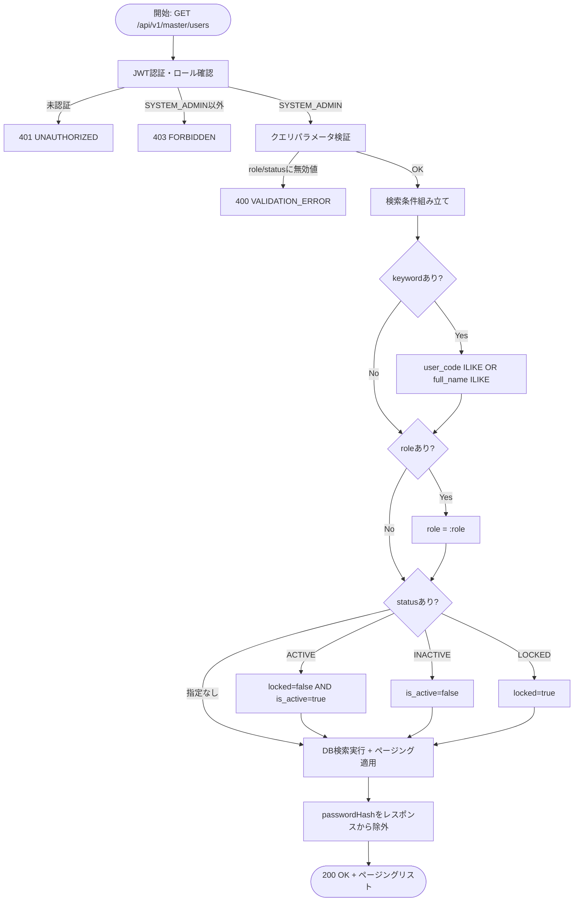
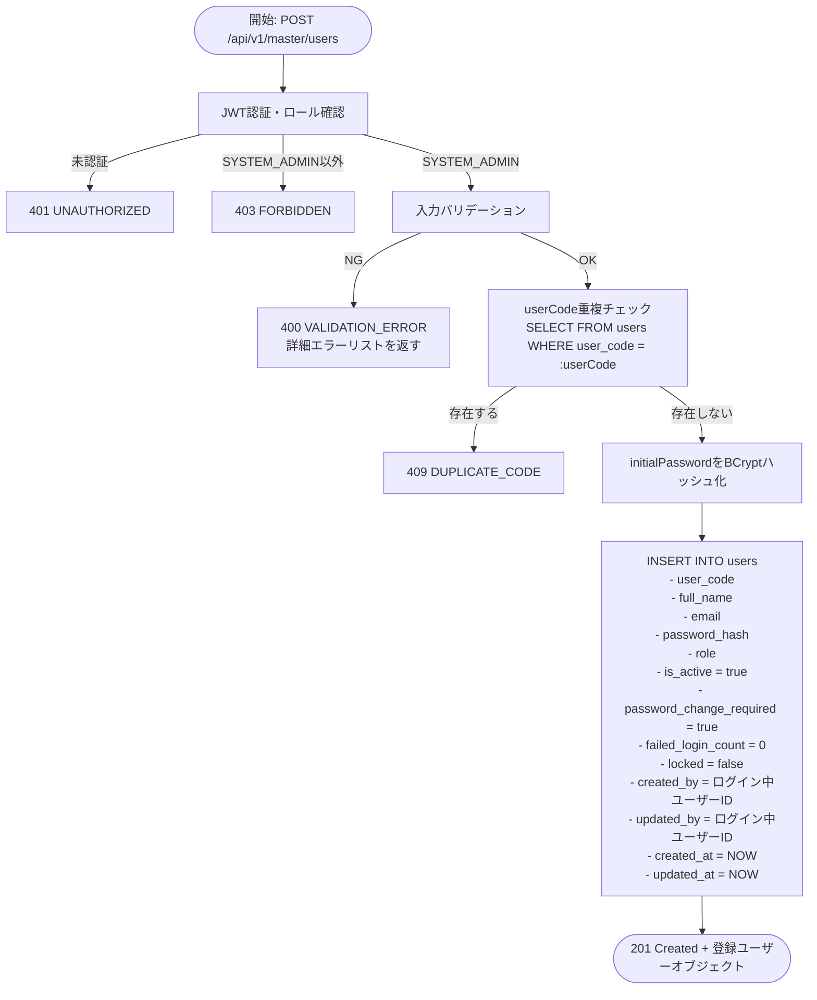
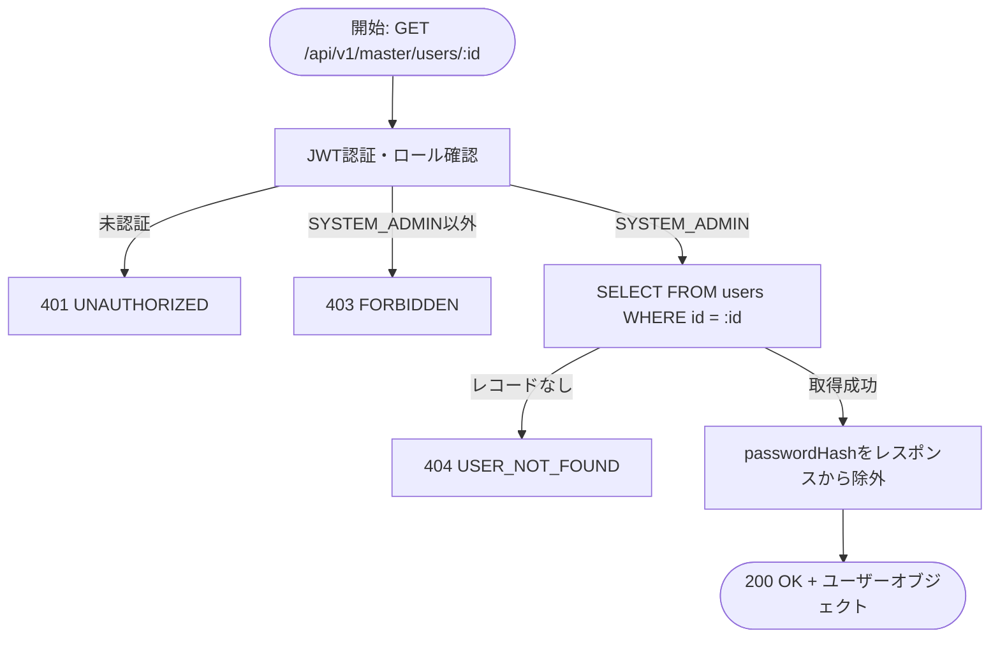
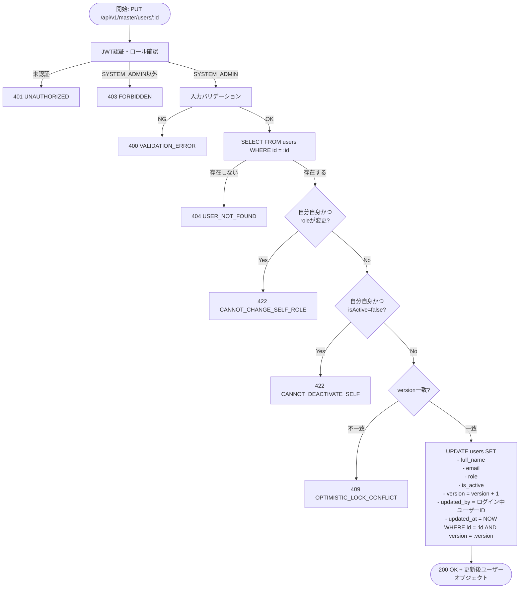
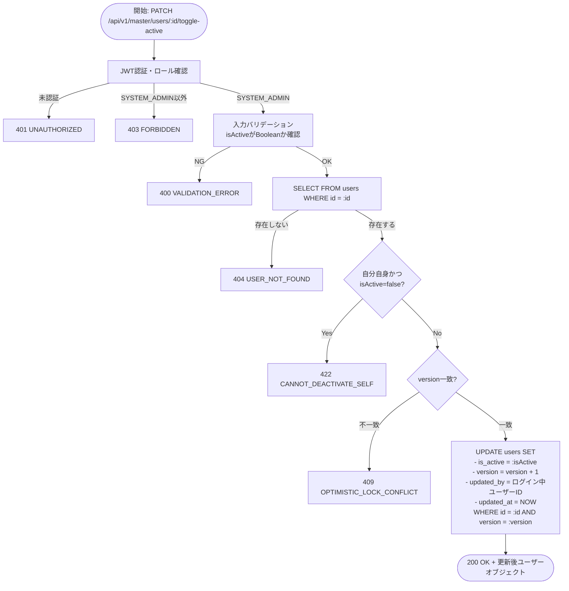
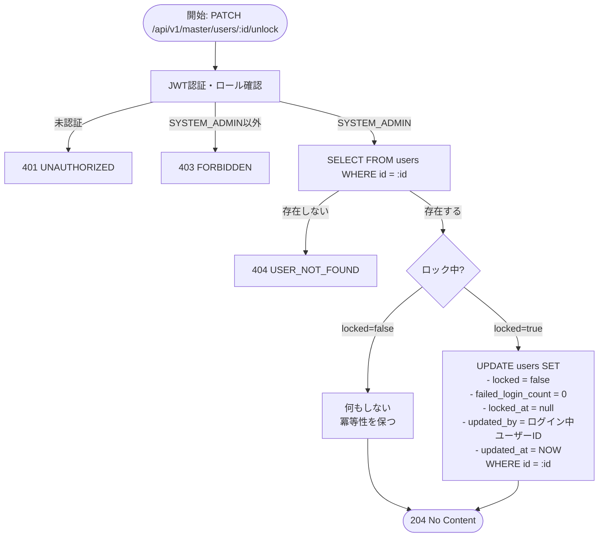
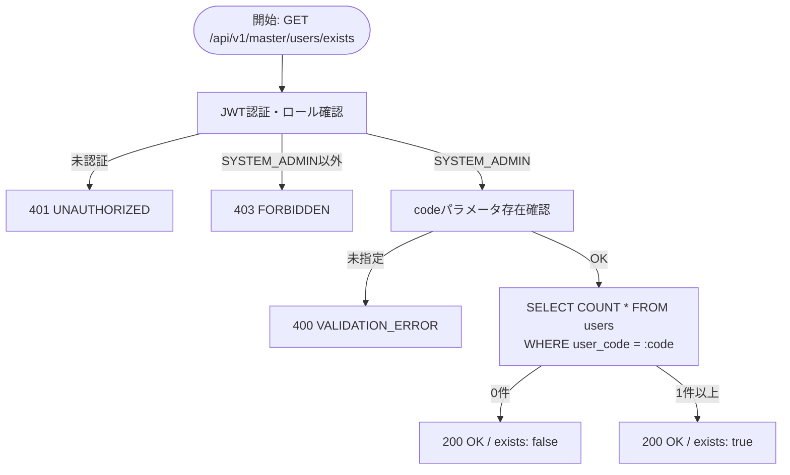

# 機能設計書 — API設計 ユーザーマスタ（MST-USR）

対象API: API-MST-USR-001 〜 API-MST-USR-007

> **アクセス制限**: 本ドキュメントに記載するAPIはすべて **SYSTEM_ADMIN ロールのみ** アクセス可能。
> WAREHOUSE_MANAGER / WAREHOUSE_STAFF / VIEWER からのリクエストは `403 FORBIDDEN` を返す。

---

## API-MST-USR-001 ユーザー一覧取得

### 1. API概要

| 項目 | 内容 |
|------|------|
| **API ID** | `API-MST-USR-001` |
| **API名** | ユーザー一覧取得 |
| **メソッド** | `GET` |
| **パス** | `/api/v1/master/users` |
| **認証** | 要 |
| **対象ロール** | SYSTEM_ADMIN のみ |
| **概要** | システムに登録されている全ユーザーをページング形式で取得する。キーワード・ロール・ステータスでの絞り込み検索に対応する。 |
| **関連画面** | MST-061（ユーザー一覧） |

---

### 2. リクエスト仕様

#### クエリパラメータ

| パラメータ名 | 型 | 必須 | デフォルト | 説明 |
|------------|-----|:----:|----------|------|
| `keyword` | String | — | — | ユーザーコードまたは氏名で部分一致検索（大文字小文字不問） |
| `role` | String | — | — | ロール絞り込み。`SYSTEM_ADMIN` / `WAREHOUSE_MANAGER` / `WAREHOUSE_STAFF` / `VIEWER` のいずれか |
| `status` | String | — | — | ステータス絞り込み。`ACTIVE` / `INACTIVE` / `LOCKED` のいずれか |
| `all` | Boolean | — | — | `true` の場合ページングなしで全件返却（プルダウン用）。`true` のみ有効。指定時は `page` / `size` / `sort` を無視する |
| `page` | Integer | — | `0` | ページ番号（0始まり） |
| `size` | Integer | — | `20` | 1ページあたりの件数（上限100） |
| `sort` | String | — | `createdAt,desc` | ソート指定。例: `userCode,asc` / `fullName,desc` |

**ステータス値とDBカラムの対応:**

| status パラメータ値 | 対応する DB 条件 |
|-----------------|----------------|
| `ACTIVE` | `locked = false AND is_active = true` |
| `INACTIVE` | `is_active = false` |
| `LOCKED` | `locked = true` |

---

### 3. レスポンス仕様

#### 成功レスポンス: `200 OK`

```json
{
  "content": [
    {
      "id": 1,
      "userCode": "admin001",
      "fullName": "山田 太郎",
      "email": "yamada@example.com",
      "role": "SYSTEM_ADMIN",
      "isActive": true,
      "locked": false,
      "lockedAt": null,
      "passwordChangeRequired": false,
      "createdAt": "2026-01-01T09:00:00+09:00",
      "updatedAt": "2026-03-01T10:00:00+09:00",
      "version": 3
    },
    {
      "id": 2,
      "userCode": "mgr001",
      "fullName": "鈴木 花子",
      "email": "suzuki@example.com",
      "role": "WAREHOUSE_MANAGER",
      "isActive": true,
      "locked": true,
      "lockedAt": "2026-03-10T08:30:00+09:00",
      "passwordChangeRequired": false,
      "createdAt": "2026-01-15T09:00:00+09:00",
      "updatedAt": "2026-03-10T08:30:00+09:00",
      "version": 5
    }
  ],
  "page": 0,
  "size": 20,
  "totalElements": 42,
  "totalPages": 3
}
```

**content 各要素のフィールド定義:**

| フィールド名 | 型 | 説明 |
|------------|-----|------|
| `id` | Long | ユーザーID |
| `userCode` | String | ログインID（ユーザーコード） |
| `fullName` | String | 氏名 |
| `email` | String | メールアドレス |
| `role` | String | ロール（`SYSTEM_ADMIN` / `WAREHOUSE_MANAGER` / `WAREHOUSE_STAFF` / `VIEWER`） |
| `isActive` | Boolean | 有効フラグ |
| `locked` | Boolean | アカウントロックフラグ |
| `lockedAt` | String (ISO 8601) | ロック発生日時。未ロック時は `null`（フィールド自体を省略） |
| `passwordChangeRequired` | Boolean | 初回ログイン・パスワード変更要求フラグ |
| `createdAt` | String (ISO 8601) | 登録日時 |
| `updatedAt` | String (ISO 8601) | 最終更新日時 |
| `version` | Integer | 楽観的ロックバージョン |

> `passwordHash` はレスポンスに **絶対含めない**。

#### エラーレスポンス

| HTTPステータス | エラーコード | 発生条件 |
|-------------|-----------|---------|
| `401 Unauthorized` | `UNAUTHORIZED` | 未認証（Cookieなし・JWT期限切れ） |
| `403 Forbidden` | `FORBIDDEN` | SYSTEM_ADMIN 以外のロールでアクセス |
| `400 Bad Request` | `VALIDATION_ERROR` | `role` や `status` に無効な値が指定された |

---

### 4. 業務ロジック



**ビジネスルール:**

| # | ルール | エラーコード |
|---|--------|------------|
| 1 | `role` パラメータは定義された4種（`SYSTEM_ADMIN` / `WAREHOUSE_MANAGER` / `WAREHOUSE_STAFF` / `VIEWER`）のみ受け付ける | `VALIDATION_ERROR` |
| 2 | `status` パラメータは `ACTIVE` / `INACTIVE` / `LOCKED` のみ受け付ける | `VALIDATION_ERROR` |
| 3 | `size` の上限は100。101以上は400エラー | `VALIDATION_ERROR` |
| 4 | `passwordHash` カラムはいかなる場合もレスポンスに含めない | — |

---

### 5. 補足事項

- `keyword` の部分一致は `ILIKE`（大文字小文字不問）で実装する。PostgreSQL の場合 `ILIKE '%keyword%'` または `lower(user_code) LIKE lower('%keyword%')`。
- ステータス `LOCKED` と `INACTIVE` は排他ではなく、`locked=true` かつ `is_active=false` のユーザーは `LOCKED` として扱う（locked 優先）。
- ソート可能なフィールドは `userCode`、`fullName`、`role`、`createdAt`、`updatedAt`。不正なソートフィールドが指定された場合はデフォルト（`createdAt,desc`）にフォールバックする。
- レスポンスの `lockedAt` フィールドは null の場合、`@JsonInclude(NON_NULL)` によってレスポンス JSON から省略される。

---

---

## API-MST-USR-002 ユーザー登録

### 1. API概要

| 項目 | 内容 |
|------|------|
| **API ID** | `API-MST-USR-002` |
| **API名** | ユーザー登録 |
| **メソッド** | `POST` |
| **パス** | `/api/v1/master/users` |
| **認証** | 要 |
| **対象ロール** | SYSTEM_ADMIN のみ |
| **概要** | 新規ユーザーを登録する。初期パスワードをBCryptでハッシュ化して保存し、初回ログイン時にパスワード変更を強制するフラグを `true` にセットする。 |
| **関連画面** | MST-062（ユーザー登録） |

---

### 2. リクエスト仕様

#### リクエストボディ

```json
{
  "userCode": "staff001",
  "fullName": "鈴木 花子",
  "email": "suzuki@example.com",
  "role": "WAREHOUSE_STAFF",
  "initialPassword": "Initial@123"
}
```

**フィールド定義:**

| フィールド名 | 型 | 必須 | バリデーション | 説明 |
|------------|-----|:----:|-------------|------|
| `userCode` | String | ○ | 1〜50文字、半角英数字（`a-z`、`A-Z`、`0-9`）とアンダースコア（`_`）のみ。パターン: `^[a-zA-Z0-9_]{1,50}$` | ログインID。登録後変更不可 |
| `fullName` | String | ○ | 1〜200文字 | 氏名 |
| `email` | String | ○ | 最大200文字、RFC 5322準拠のメール形式 | メールアドレス |
| `role` | String | ○ | `SYSTEM_ADMIN` / `WAREHOUSE_MANAGER` / `WAREHOUSE_STAFF` / `VIEWER` のいずれか | ロール |
| `initialPassword` | String | ○ | 8文字以上128文字以内 | 初期パスワード（平文で受け取りBCryptハッシュ化） |

---

### 3. レスポンス仕様

#### 成功レスポンス: `201 Created`

```json
{
  "id": 10,
  "userCode": "staff001",
  "fullName": "鈴木 花子",
  "email": "suzuki@example.com",
  "role": "WAREHOUSE_STAFF",
  "isActive": true,
  "locked": false,
  "passwordChangeRequired": true,
  "createdAt": "2026-03-13T10:00:00+09:00",
  "updatedAt": "2026-03-13T10:00:00+09:00",
  "version": 0
}
```

> `passwordHash` はレスポンスに **絶対含めない**。
> 登録直後は `passwordChangeRequired = true`、`locked = false`、`isActive = true`、`failedLoginCount = 0` で固定。

#### エラーレスポンス

| HTTPステータス | エラーコード | 発生条件 |
|-------------|-----------|---------|
| `400 Bad Request` | `VALIDATION_ERROR` | 必須項目の未入力・形式エラー・文字数超過 |
| `401 Unauthorized` | `UNAUTHORIZED` | 未認証 |
| `403 Forbidden` | `FORBIDDEN` | SYSTEM_ADMIN 以外のロールでアクセス |
| `409 Conflict` | `DUPLICATE_CODE` | 指定した `userCode` がすでに存在する |

バリデーションエラー例:

```json
{
  "errorCode": "VALIDATION_ERROR",
  "message": "入力内容に誤りがあります",
  "details": [
    {
      "field": "userCode",
      "message": "ユーザーコードは半角英数字とアンダースコアのみ使用できます"
    },
    {
      "field": "initialPassword",
      "message": "パスワードは8文字以上128文字以内で入力してください"
    }
  ]
}
```

---

### 4. 業務ロジック



**ビジネスルール:**

| # | ルール | エラーコード |
|---|--------|------------|
| 1 | `userCode` はシステム全体で一意。大文字小文字を区別して重複チェックを行う | `DUPLICATE_CODE` |
| 2 | `initialPassword` は平文のままDBに保存しない。必ずBCrypt（コストファクター12）でハッシュ化する | — |
| 3 | 登録直後の `password_change_required` は必ず `true` にセット（初回ログイン時にパスワード変更を強制） | — |
| 4 | `userCode` は登録後に変更不可。PUTエンドポイントでは `userCode` フィールドを受け付けない | — |
| 5 | INSERT 時、`created_by` と `updated_by` は共にログイン中ユーザーのIDを設定する（登録直後の `updated_by` は `created_by` と同一） | — |

---

### 5. 補足事項

- `userCode` の一意制約はDBレベルでも設定する（`UNIQUE INDEX`）。アプリケーションの重複チェックとDBのUNIQUE制約の二重チェックでデータ整合性を担保する。
- BCryptのコストファクターは設定ファイル（`application.yml`）で管理し、将来の強化に対応できるようにする。
- トランザクション: INSERT は単一トランザクションで処理する。
- パスワード上限（128文字）は、BCrypt の最大有効入力長（72バイト）を超えた入力による実質的な一致問題を回避するために設定する（`10-security-architecture.md` では「8文字以上」のみ記載だが、APIレベルで128文字上限を設けることを本書で確定とする）。

---

---

## API-MST-USR-003 ユーザー取得

### 1. API概要

| 項目 | 内容 |
|------|------|
| **API ID** | `API-MST-USR-003` |
| **API名** | ユーザー取得 |
| **メソッド** | `GET` |
| **パス** | `/api/v1/master/users/{id}` |
| **認証** | 要 |
| **対象ロール** | SYSTEM_ADMIN のみ |
| **概要** | 指定されたIDのユーザーを1件取得する。編集画面の初期表示に使用する。 |
| **関連画面** | MST-063（ユーザー編集） |

---

### 2. リクエスト仕様

#### パスパラメータ

| パラメータ名 | 型 | 必須 | 説明 |
|------------|-----|:----:|------|
| `id` | Long | ○ | ユーザーID（`users.id`） |

---

### 3. レスポンス仕様

#### 成功レスポンス: `200 OK`

```json
{
  "id": 2,
  "userCode": "mgr001",
  "fullName": "鈴木 花子",
  "email": "suzuki@example.com",
  "role": "WAREHOUSE_MANAGER",
  "isActive": true,
  "locked": true,
  "lockedAt": "2026-03-10T08:30:00+09:00",
  "passwordChangeRequired": false,
  "createdAt": "2026-01-15T09:00:00+09:00",
  "updatedAt": "2026-03-10T08:30:00+09:00",
  "version": 5
}
```

> `passwordHash` はレスポンスに **絶対含めない**。

#### エラーレスポンス

| HTTPステータス | エラーコード | 発生条件 |
|-------------|-----------|---------|
| `401 Unauthorized` | `UNAUTHORIZED` | 未認証 |
| `403 Forbidden` | `FORBIDDEN` | SYSTEM_ADMIN 以外のロールでアクセス |
| `404 Not Found` | `USER_NOT_FOUND` | 指定したIDのユーザーが存在しない |

---

### 4. 業務ロジック



**ビジネスルール:**

| # | ルール | エラーコード |
|---|--------|------------|
| 1 | 指定された `id` に一致するユーザーが存在しない場合は404を返す | `USER_NOT_FOUND` |
| 2 | `passwordHash` はいかなる場合もレスポンスに含めない | — |

---

### 5. 補足事項

- 参照系APIのため読み取り専用トランザクションで処理する。
- 論理削除は行っていないため、DBに存在しないユーザーは常に404を返す。

---

---

## API-MST-USR-004 ユーザー更新

### 1. API概要

| 項目 | 内容 |
|------|------|
| **API ID** | `API-MST-USR-004` |
| **API名** | ユーザー更新 |
| **メソッド** | `PUT` |
| **パス** | `/api/v1/master/users/{id}` |
| **認証** | 要 |
| **対象ロール** | SYSTEM_ADMIN のみ |
| **概要** | 指定されたIDのユーザー情報（氏名・メールアドレス・ロール・有効フラグ）を更新する。ユーザーコードは変更不可。自分自身のロール変更および無効化は禁止する。 |
| **関連画面** | MST-063（ユーザー編集） |

---

### 2. リクエスト仕様

#### パスパラメータ

| パラメータ名 | 型 | 必須 | 説明 |
|------------|-----|:----:|------|
| `id` | Long | ○ | ユーザーID（`users.id`） |

#### リクエストボディ

```json
{
  "fullName": "鈴木 花子（改）",
  "email": "suzuki.new@example.com",
  "role": "WAREHOUSE_STAFF",
  "isActive": true,
  "version": 5
}
```

**フィールド定義:**

| フィールド名 | 型 | 必須 | バリデーション | 説明 |
|------------|-----|:----:|-------------|------|
| `fullName` | String | ○ | 1〜200文字 | 氏名 |
| `email` | String | ○ | 最大200文字、メール形式 | メールアドレス |
| `role` | String | ○ | `SYSTEM_ADMIN` / `WAREHOUSE_MANAGER` / `WAREHOUSE_STAFF` / `VIEWER` のいずれか | ロール |
| `isActive` | Boolean | ○ | — | 有効フラグ |
| `version` | Integer | ○ | — | 楽観的ロックバージョン（取得時の値を送信） |

> `userCode` はリクエストに含めない。含まれた場合でも無視する（変更不可）。

---

### 3. レスポンス仕様

#### 成功レスポンス: `200 OK`

```json
{
  "id": 2,
  "userCode": "mgr001",
  "fullName": "鈴木 花子（改）",
  "email": "suzuki.new@example.com",
  "role": "WAREHOUSE_STAFF",
  "isActive": true,
  "locked": true,
  "lockedAt": "2026-03-10T08:30:00+09:00",
  "passwordChangeRequired": false,
  "createdAt": "2026-01-15T09:00:00+09:00",
  "updatedAt": "2026-03-13T11:00:00+09:00",
  "version": 6
}
```

> `passwordHash` はレスポンスに **絶対含めない**。

#### エラーレスポンス

| HTTPステータス | エラーコード | 発生条件 |
|-------------|-----------|---------|
| `400 Bad Request` | `VALIDATION_ERROR` | 必須項目の未入力・形式エラー・文字数超過 |
| `401 Unauthorized` | `UNAUTHORIZED` | 未認証 |
| `403 Forbidden` | `FORBIDDEN` | SYSTEM_ADMIN 以外のロールでアクセス |
| `404 Not Found` | `USER_NOT_FOUND` | 指定したIDのユーザーが存在しない |
| `409 Conflict` | `OPTIMISTIC_LOCK_CONFLICT` | 他のユーザーにより先に更新された（version不一致） |
| `422 Unprocessable Entity` | `CANNOT_CHANGE_SELF_ROLE` | 自分自身のロールを変更しようとした |
| `422 Unprocessable Entity` | `CANNOT_DEACTIVATE_SELF` | 自分自身を無効化しようとした（`isActive = false`） |

---

### 4. 業務ロジック



**ビジネスルール:**

| # | ルール | エラーコード |
|---|--------|------------|
| 1 | `userCode` は変更不可。リクエストに含まれても無視する（DB更新対象外） | — |
| 2 | ログイン中のユーザー自身の `role` 変更は不可。ロール変更によって自身のアクセス権が意図せず失われるのを防ぐ | `CANNOT_CHANGE_SELF_ROLE` |
| 3 | ログイン中のユーザー自身を `isActive = false` に更新することは不可 | `CANNOT_DEACTIVATE_SELF` |
| 4 | 更新対象ユーザーが存在しない場合は404を返す | `USER_NOT_FOUND` |
| 5 | リクエストの `version` とDBの `version` が一致しない場合は409を返す（楽観的ロック） | `OPTIMISTIC_LOCK_CONFLICT` |

> 自分自身かどうかの判定は JWT から取得したユーザーIDとパスパラメータの `id` を比較して行う。

---

### 5. 補足事項

- `locked` フラグおよび `failedLoginCount` はこのAPIでは変更しない（アンロックは API-MST-USR-006 で実施）。
- トランザクション: UPDATE は単一トランザクションで処理する。楽観的ロック（`version` カラム）により同時更新の競合を検出する。
- `is_active` を `false` に変更しても、すでに発行済みの JWT は即座には無効化されない。JWT の有効期限（1時間）が切れるまでは当該ユーザーはAPIにアクセスできる点に留意する（既知の仕様）。
- このAPIは `PUT` を使用するが、`userCode` は更新対象外である。RESTの純粋な `PUT`（完全置換）とは異なり、管理者が操作する更新可能フィールド（`fullName`・`email`・`role`・`isActive`）を全て送信することを要求する設計としているため、`PUT` を採用している。

---

---

## API-MST-USR-005 ユーザー無効化/有効化

### 1. API概要

| 項目 | 内容 |
|------|------|
| **API ID** | `API-MST-USR-005` |
| **API名** | ユーザー無効化/有効化 |
| **メソッド** | `PATCH` |
| **パス** | `/api/v1/master/users/{id}/toggle-active` |
| **認証** | 要 |
| **対象ロール** | SYSTEM_ADMIN のみ |
| **概要** | 指定されたIDのユーザーの有効/無効フラグを切り替える。ユーザー編集画面のステータスフィールドから操作する。自分自身の無効化は禁止する。 |
| **関連画面** | MST-063（ユーザー編集） |

---

### 2. リクエスト仕様

#### パスパラメータ

| パラメータ名 | 型 | 必須 | 説明 |
|------------|-----|:----:|------|
| `id` | Long | ○ | ユーザーID（`users.id`） |

#### リクエストボディ

```json
{
  "isActive": false,
  "version": 3
}
```

**フィールド定義:**

| フィールド名 | 型 | 必須 | バリデーション | 説明 |
|------------|-----|:----:|-------------|------|
| `isActive` | Boolean | ○ | `true` または `false` | 設定する有効フラグの値 |
| `version` | Integer | ○ | — | 楽観的ロックバージョン（取得時の値を送信） |

---

### 3. レスポンス仕様

#### 成功レスポンス: `200 OK`

```json
{
  "id": 3,
  "userCode": "staff001",
  "fullName": "鈴木 花子",
  "email": "suzuki@example.com",
  "role": "WAREHOUSE_STAFF",
  "isActive": false,
  "locked": false,
  "passwordChangeRequired": false,
  "createdAt": "2026-02-01T09:00:00+09:00",
  "updatedAt": "2026-03-13T12:00:00+09:00",
  "version": 4
}
```

> `passwordHash` はレスポンスに **絶対含めない**。

#### エラーレスポンス

| HTTPステータス | エラーコード | 発生条件 |
|-------------|-----------|---------|
| `400 Bad Request` | `VALIDATION_ERROR` | `isActive` が未指定または Boolean 以外の値 |
| `401 Unauthorized` | `UNAUTHORIZED` | 未認証 |
| `403 Forbidden` | `FORBIDDEN` | SYSTEM_ADMIN 以外のロールでアクセス |
| `404 Not Found` | `USER_NOT_FOUND` | 指定したIDのユーザーが存在しない |
| `409 Conflict` | `OPTIMISTIC_LOCK_CONFLICT` | 他のユーザーにより先に更新された（version不一致） |
| `422 Unprocessable Entity` | `CANNOT_DEACTIVATE_SELF` | 自分自身を無効化しようとした（`isActive = false`） |

---

### 4. 業務ロジック



**ビジネスルール:**

| # | ルール | エラーコード |
|---|--------|------------|
| 1 | ログイン中のユーザー自身を `isActive = false` に変更することは不可 | `CANNOT_DEACTIVATE_SELF` |
| 2 | `isActive = true` への再有効化は制限なく実施可能（自分自身への適用も可） | — |
| 3 | このAPIは `is_active` のみを変更する。`locked` フラグ等他のカラムには一切触れない | — |
| 4 | リクエストの `version` とDBの `version` が一致しない場合は409を返す（楽観的ロック） | `OPTIMISTIC_LOCK_CONFLICT` |

---

### 5. 補足事項

- パスは `/toggle-active` だが `isActive = true` での有効化も同一エンドポイントで受け付ける（有効化・無効化の両方に対応）。
- 無効化されたユーザーは次回ログイン時に `ACCOUNT_INACTIVE` エラーで弾かれる。ただし発行済み JWT は有効期限まで有効（既知の仕様）。
- トランザクション: UPDATE は単一トランザクションで処理する。

---

---

## API-MST-USR-006 アカウントロック解除

### 1. API概要

| 項目 | 内容 |
|------|------|
| **API ID** | `API-MST-USR-006` |
| **API名** | アカウントロック解除 |
| **メソッド** | `PATCH` |
| **パス** | `/api/v1/master/users/{id}/unlock` |
| **認証** | 要 |
| **対象ロール** | SYSTEM_ADMIN のみ |
| **概要** | ログイン連続失敗によりロックされたユーザーのアカウントロックを解除する。`locked`・`failed_login_count`・`locked_at` を初期化する。 |
| **関連画面** | MST-061（ユーザー一覧）、MST-063（ユーザー編集） |

---

### 2. リクエスト仕様

#### パスパラメータ

| パラメータ名 | 型 | 必須 | 説明 |
|------------|-----|:----:|------|
| `id` | Long | ○ | ユーザーID（`users.id`） |

#### リクエストボディ

なし（ボディは不要）

---

### 3. レスポンス仕様

#### 成功レスポンス: `204 No Content`

レスポンスボディなし。

#### エラーレスポンス

| HTTPステータス | エラーコード | 発生条件 |
|-------------|-----------|---------|
| `401 Unauthorized` | `UNAUTHORIZED` | 未認証 |
| `403 Forbidden` | `FORBIDDEN` | SYSTEM_ADMIN 以外のロールでアクセス |
| `404 Not Found` | `USER_NOT_FOUND` | 指定したIDのユーザーが存在しない |

---

### 4. 業務ロジック



**ビジネスルール:**

| # | ルール | エラーコード |
|---|--------|------------|
| 1 | ロック解除操作は冪等。すでにロック解除済みのユーザーへの解除要求も `204 No Content` を返す（エラーにしない） | — |
| 2 | ロック解除後、ユーザーは次回ログイン時に通常認証を受ける（`is_active` が `true` であることが前提） | — |
| 3 | ロック解除と同時に `failed_login_count` を `0` にリセットする。ロック解除直後に再度ログイン失敗カウントがゼロから再開される | — |
| 4 | `locked_at` を `null` にクリアする | — |

---

### 5. 補足事項

- このAPIはリクエストボディを必要としない。`Content-Type` ヘッダーも不要。
- ロック解除後も `is_active = false` のユーザーはログインできない（`ACCOUNT_INACTIVE` エラー）。ロック解除と有効化は独立した操作である。
- ロック解除のログ記録（`updated_by`・`updated_at`）により、誰がいつロック解除したかをシステム上で追跡できる。
- トランザクション: UPDATE は単一トランザクションで処理する。
- フロントエンドは `204 No Content` 受信後、`GET /api/v1/master/users/{id}` を呼び出してユーザー情報を再取得し、画面上の `locked` フラグ表示を更新すること（MST-061 は一覧再取得、MST-063 はユーザー詳細再取得）。
- ロック解除時に `refresh_tokens` テーブルの当該ユーザーのトークンを削除しない（既知の仕様）。アカウントがロックされる原因はログイン失敗であるため、ロック時点では通常 access_token は期限切れまたは存在しないと考えられる。ただし、セキュリティポリシーの要件次第では、ロック解除と同時に既存のリフレッシュトークンを `refresh_tokens` テーブルから削除して強制再ログインを求める実装も検討すること。

---

---

---

## API-MST-USR-007 ユーザーコード存在確認

### 1. API概要

| 項目 | 内容 |
|------|------|
| **API ID** | `API-MST-USR-007` |
| **API名** | ユーザーコード存在確認 |
| **メソッド** | `GET` |
| **パス** | `/api/v1/master/users/exists` |
| **認証** | 要 |
| **対象ロール** | SYSTEM_ADMIN のみ |
| **概要** | 指定されたユーザーコードがすでに登録されているか確認する。ユーザー登録画面でのリアルタイム重複チェックに使用する。 |
| **関連画面** | MST-062（ユーザー登録） |

---

### 2. リクエスト仕様

#### クエリパラメータ

| パラメータ名 | 型 | 必須 | 説明 |
|------------|-----|:----:|------|
| `code` | String | ○ | チェック対象のユーザーコード |

---

### 3. レスポンス仕様

#### 成功レスポンス: `200 OK`

```json
{ "exists": true }
```

| フィールド名 | 型 | 説明 |
|------------|-----|------|
| `exists` | Boolean | `true`: 既に存在する / `false`: 存在しない |

#### エラーレスポンス

| HTTPステータス | エラーコード | 発生条件 |
|-------------|------------|---------|
| `400` | `VALIDATION_ERROR` | `code` が未指定 |
| `401` | `UNAUTHORIZED` | 未認証 |
| `403` | `FORBIDDEN` | SYSTEM_ADMIN 以外のロールでアクセス |

---

### 4. 業務ロジック



**ビジネスルール:**

| # | ルール | エラーコード |
|---|--------|------------|
| 1 | `code` パラメータは大文字小文字を区別して照合する（DB の UNIQUE 制約に準じる） | — |
| 2 | 参照系 API のため読み取り専用トランザクションで処理する | — |

---

### 5. 補足事項

- このAPIは登録画面のフォーカスアウト時にリアルタイム重複チェックとして使用する。
- 登録時の本番チェックは API-MST-USR-002 の `DUPLICATE_CODE` エラーで担保されるため、このAPIはUX向上のための補助的な事前チェックである。

---

---

## 付録: エラーコード一覧（MST-USR）

| エラーコード | HTTPステータス | 対象API | 説明 |
|-----------|-------------|--------|------|
| `UNAUTHORIZED` | 401 | 全API | 未認証（Cookieなし・JWT期限切れ） |
| `FORBIDDEN` | 403 | 全API | SYSTEM_ADMIN 以外のロールによるアクセス |
| `VALIDATION_ERROR` | 400 | 001, 002, 004, 005, 007 | 入力バリデーションエラー |
| `USER_NOT_FOUND` | 404 | 003, 004, 005, 006 | 指定したIDのユーザーが存在しない |
| `DUPLICATE_CODE` | 409 | 002 | 指定した `userCode` がすでに存在する |
| `OPTIMISTIC_LOCK_CONFLICT` | 409 | 004, 005 | 他のユーザーにより先に更新された（version不一致） |
| `CANNOT_CHANGE_SELF_ROLE` | 422 | 004 | 自分自身のロールを変更しようとした |
| `CANNOT_DEACTIVATE_SELF` | 422 | 004, 005 | 自分自身を無効化しようとした |

---

## 付録: ユーザーオブジェクト共通フィールド定義

すべてのレスポンスで返されるユーザーオブジェクトの共通フィールド定義。

| フィールド名 | 型 | DBカラム | 説明 |
|------------|-----|--------|------|
| `id` | Long | `id` | ユーザーID（PK） |
| `userCode` | String | `user_code` | ログインID（登録後変更不可） |
| `fullName` | String | `full_name` | 氏名 |
| `email` | String | `email` | メールアドレス |
| `role` | String | `role` | ロール |
| `isActive` | Boolean | `is_active` | 有効フラグ |
| `locked` | Boolean | `locked` | アカウントロックフラグ |
| `lockedAt` | String \| null | `locked_at` | ロック発生日時（ISO 8601）。未ロック時は省略 |
| `passwordChangeRequired` | Boolean | `password_change_required` | パスワード変更要求フラグ |
| `createdAt` | String | `created_at` | 登録日時（ISO 8601） |
| `updatedAt` | String | `updated_at` | 最終更新日時（ISO 8601） |
| `version` | Integer | `version` | 楽観的ロックバージョン |

> `password_hash`、`failed_login_count`、`created_by`、`updated_by` はレスポンスに **含めない**。
