# 機能設計書 — API設計 入荷管理（INB-001〜010）

> 共通仕様（ベースURL・認証・エラーフォーマット・ページング）は [`08-api-overview.md`](08-api-overview.md) を参照。

---

## ステータス遷移図

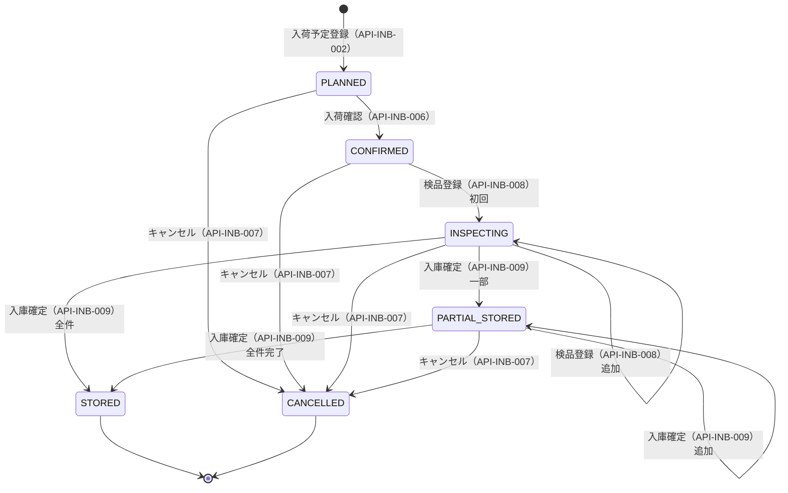

### 明細（line_status）のステータス遷移

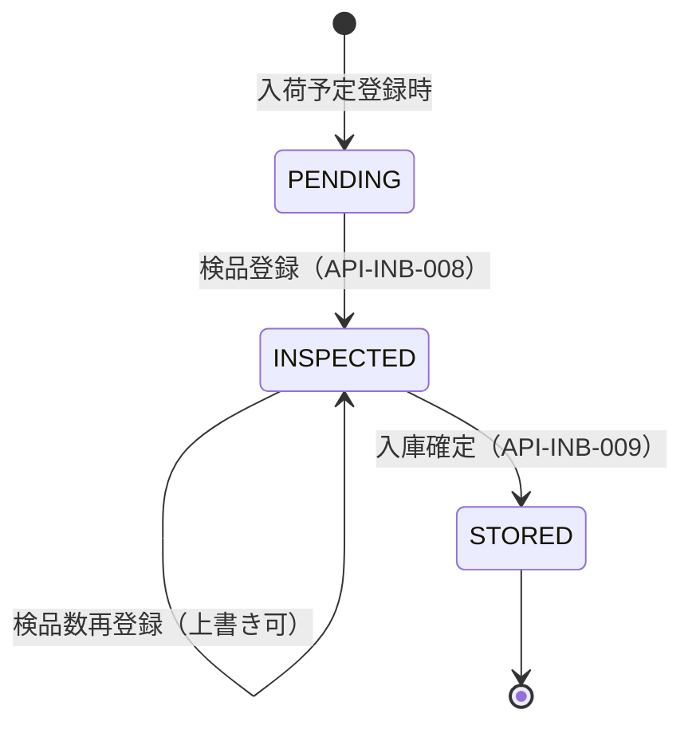

---

## API-INB-001: 入荷予定一覧取得

### 1. API概要

| 項目 | 内容 |
|------|------|
| **API ID** | `API-INB-001` |
| **API名** | 入荷予定一覧取得 |
| **メソッド** | `GET` |
| **パス** | `/api/v1/inbound/slips` |
| **認証** | 要 |
| **対象ロール** | 全ロール（SYSTEM_ADMIN, WAREHOUSE_MANAGER, WAREHOUSE_STAFF, VIEWER） |
| **概要** | 指定倉庫の入荷予定伝票をページング形式で取得する。ステータス・入荷予定日・仕入先等の条件で絞り込みが可能。 |
| **関連画面** | INB-001（入荷予定一覧） |

---

### 2. リクエスト仕様

#### クエリパラメータ

| パラメータ名 | 型 | 必須 | デフォルト | 説明 |
|------------|-----|:----:|----------|------|
| `warehouseId` | Long | ○ | — | 倉庫ID |
| `slipNumber` | String | — | — | 伝票番号（前方一致） |
| `status` | String[] | — | — | ステータス（複数指定可。例: `status=PLANNED&status=CONFIRMED`）|
| `plannedDateFrom` | String | — | — | 入荷予定日From（`yyyy-MM-dd`） |
| `plannedDateTo` | String | — | — | 入荷予定日To（`yyyy-MM-dd`） |
| `partnerId` | Long | — | — | 仕入先ID |
| `page` | Integer | — | `0` | ページ番号（0始まり） |
| `size` | Integer | — | `20` | 1ページあたりの件数（上限100） |
| `sort` | String | — | `plannedDate,asc` | ソート指定 |

---

### 3. レスポンス仕様

#### 成功レスポンス: `200 OK`

```json
{
  "content": [
    {
      "id": 1,
      "slipNumber": "INB-20260313-0001",
      "slipType": "NORMAL",
      "warehouseCode": "WH-001",
      "partnerCode": "SUP-0001",
      "partnerName": "株式会社ABC商事",
      "plannedDate": "2026-03-20",
      "status": "PLANNED",
      "lineCount": 3,
      "createdAt": "2026-03-13T10:30:00+09:00"
    }
  ],
  "page": 0,
  "size": 20,
  "totalElements": 42,
  "totalPages": 3
}
```

#### content 各要素のフィールド定義

| フィールド名 | 型 | 説明 |
|------------|-----|------|
| `id` | Long | 入荷伝票ID |
| `slipNumber` | String | 伝票番号 |
| `slipType` | String | 入荷種別（`NORMAL` / `WAREHOUSE_TRANSFER`） |
| `warehouseCode` | String | 倉庫コード |
| `partnerCode` | String | 仕入先コード（倉庫振替の場合はnull） |
| `partnerName` | String | 仕入先名（倉庫振替の場合はnull） |
| `plannedDate` | String | 入荷予定日（`yyyy-MM-dd`） |
| `status` | String | ステータス |
| `lineCount` | Integer | 明細件数 |
| `createdAt` | String | 登録日時（ISO 8601） |

#### エラーレスポンス

| HTTPステータス | エラーコード | 発生条件 |
|-------------|------------|---------|
| `400` | `VALIDATION_ERROR` | `warehouseId` が未指定、または日付フォーマット不正 |
| `401` | `UNAUTHORIZED` | 未認証 |
| `404` | `WAREHOUSE_NOT_FOUND` | 指定の倉庫が存在しない |

---

### 4. 業務ロジック

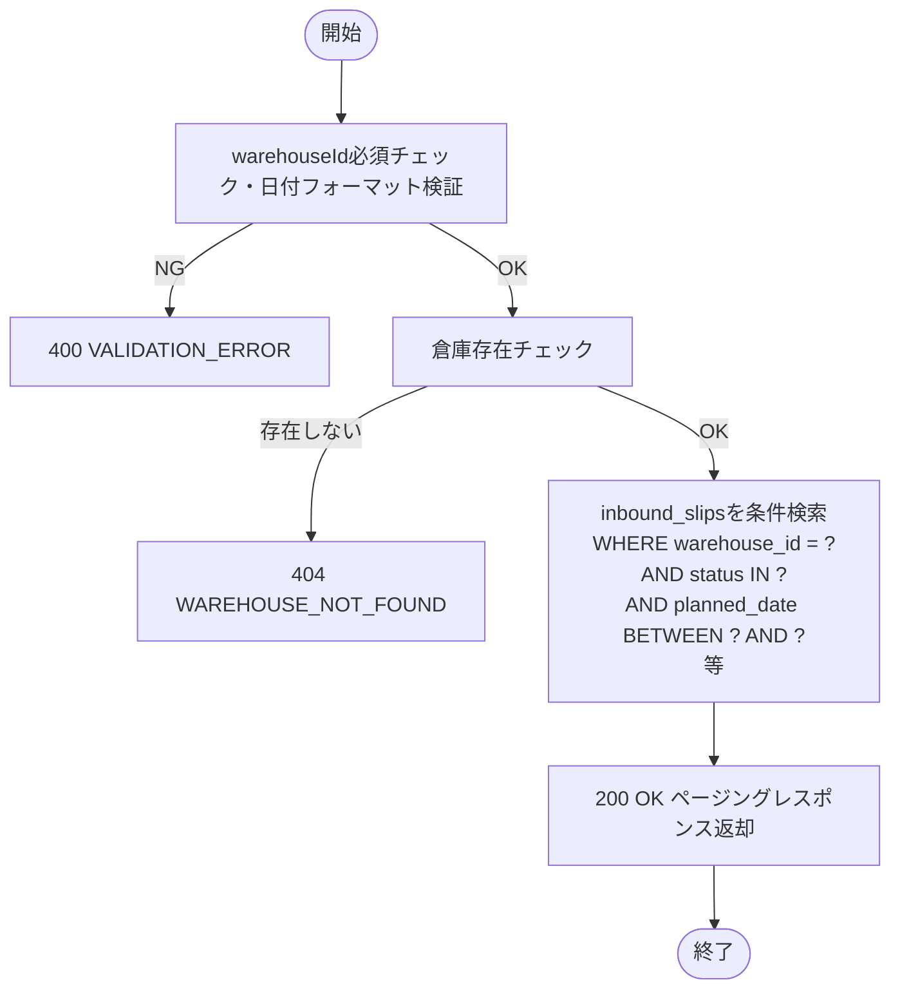

**ビジネスルール**:

| # | ルール |
|---|--------|
| 1 | `warehouseId` は必須。未指定時は 400 エラー。 |
| 2 | `plannedDateFrom` と `plannedDateTo` は両方または片方のみ指定可。FromがToより後の場合は 400 エラー。 |
| 3 | `status` は複数値を指定可能（OR条件）。定義外の値は 400 エラー。 |

---

### 5. 補足事項

- `lineCount` は `inbound_slip_lines` テーブルの件数を COUNT サブクエリまたは JOINで取得する。
- デフォルトソートは `plannedDate ASC, id ASC`（同日の場合は登録順）。

---

---

## API-INB-002: 入荷予定登録

### 1. API概要

| 項目 | 内容 |
|------|------|
| **API ID** | `API-INB-002` |
| **API名** | 入荷予定登録 |
| **メソッド** | `POST` |
| **パス** | `/api/v1/inbound/slips` |
| **認証** | 要 |
| **対象ロール** | SYSTEM_ADMIN, WAREHOUSE_MANAGER, WAREHOUSE_STAFF |
| **概要** | 新しい入荷予定伝票をヘッダー情報と明細とともに登録する。登録時のステータスは `PLANNED` で固定。伝票番号はシステムが自動採番する。 |
| **関連画面** | INB-002（入荷予定登録） |

---

### 2. リクエスト仕様

#### リクエストボディ

```json
{
  "warehouseId": 1,
  "partnerId": 5,
  "plannedDate": "2026-03-20",
  "slipType": "NORMAL",
  "note": "春季補充分",
  "lines": [
    {
      "productId": 101,
      "unitType": "CASE",
      "plannedQty": 100,
      "lotNumber": null,
      "expiryDate": null
    },
    {
      "productId": 102,
      "unitType": "PIECE",
      "plannedQty": 50,
      "lotNumber": "LOT-2026-001",
      "expiryDate": "2027-03-31"
    }
  ]
}
```

#### フィールド定義

| フィールド名 | 型 | 必須 | バリデーション | 説明 |
|------------|-----|:----:|-------------|------|
| `warehouseId` | Long | ○ | 必須・存在チェック | 倉庫ID |
| `partnerId` | Long | 条件必須 | NORMAL入荷の場合必須 | 仕入先ID |
| `plannedDate` | String | ○ | 必須・現在営業日以降 | 入荷予定日（`yyyy-MM-dd`） |
| `slipType` | String | ○ | `NORMAL` / `WAREHOUSE_TRANSFER` | 入荷種別 |
| `note` | String | — | 最大500文字 | 備考 |
| `lines` | Array | ○ | 1件以上 | 入荷明細リスト |
| `lines[].productId` | Long | ○ | 必須・存在チェック・有効商品 | 商品ID |
| `lines[].unitType` | String | ○ | `CASE` / `BALL` / `PIECE` | 荷姿 |
| `lines[].plannedQty` | Integer | ○ | 1以上999999以下 | 入荷予定数量 |
| `lines[].lotNumber` | String | 条件必須 | `lot_manage_flag=true` の商品に必須・最大100文字 | ロット番号 |
| `lines[].expiryDate` | String | 条件必須 | `expiry_manage_flag=true` の商品に必須 | 賞味/使用期限日（`yyyy-MM-dd`） |

---

### 3. レスポンス仕様

#### 成功レスポンス: `201 Created`

登録された入荷伝票の全情報（明細含む）を返す。フォーマットは [API-INB-003 レスポンス](#レスポンス仕様-2) と同形式。

#### エラーレスポンス

| HTTPステータス | エラーコード | 発生条件 |
|-------------|------------|---------|
| `400` | `VALIDATION_ERROR` | 必須項目不足・型エラー・桁数超過 |
| `401` | `UNAUTHORIZED` | 未認証 |
| `403` | `FORBIDDEN` | VIEWER ロールでのアクセス |
| `404` | `WAREHOUSE_NOT_FOUND` | 指定の倉庫が存在しない |
| `404` | `PARTNER_NOT_FOUND` | 指定の仕入先が存在しない |
| `404` | `PRODUCT_NOT_FOUND` | 明細内の商品が存在しない |
| `409` | `DUPLICATE_PRODUCT_IN_LINES` | 同一伝票内に同じ商品IDが重複 |
| `422` | `INBOUND_PARTNER_NOT_SUPPLIER` | `partnerId` の取引先種別が `SUPPLIER` または `BOTH` でない |
| `422` | `PLANNED_DATE_TOO_EARLY` | `plannedDate` が現在営業日より前 |
| `422` | `LOT_NUMBER_REQUIRED` | ロット管理フラグONの商品に `lotNumber` が未指定 |
| `422` | `EXPIRY_DATE_REQUIRED` | 期限管理フラグONの商品に `expiryDate` が未指定 |

---

### 4. 業務ロジック

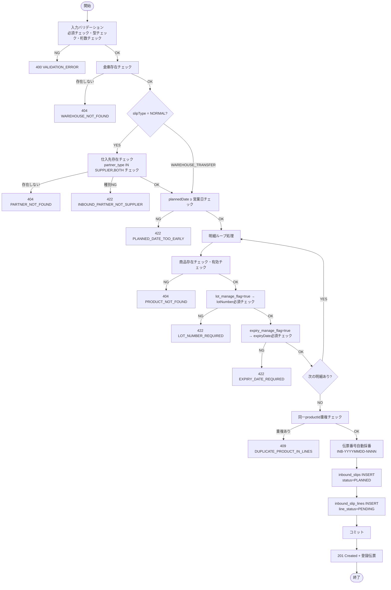

**ビジネスルール**:

| # | ルール | エラーコード |
|---|--------|------------|
| 1 | `slipType=NORMAL` の場合、`partnerId` は必須 | `VALIDATION_ERROR` |
| 2 | 仕入先の `partner_type` が `SUPPLIER` または `BOTH` でなければならない | `INBOUND_PARTNER_NOT_SUPPLIER` |
| 3 | `plannedDate` は現在営業日（`business_dates.business_date`）以降でなければならない | `PLANNED_DATE_TOO_EARLY` |
| 4 | 同一伝票内に同じ `productId` を持つ明細は登録不可 | `DUPLICATE_PRODUCT_IN_LINES` |
| 5 | 商品の `lot_manage_flag=true` の場合、`lotNumber` 必須 | `LOT_NUMBER_REQUIRED` |
| 6 | 商品の `expiry_manage_flag=true` の場合、`expiryDate` 必須 | `EXPIRY_DATE_REQUIRED` |
| 7 | 商品の `is_active=false` は明細登録不可 | `VALIDATION_ERROR` (details: productId) |

**伝票番号採番ルール**:

- 形式: `INB-YYYYMMDD-NNNN`（例: `INB-20260313-0001`）
- `YYYYMMDD` は現在営業日（`current_business_date`）
- `NNNN` は当日の入荷伝票通番（4桁ゼロ埋め）
- 採番は DB シーケンスまたは SELECT FOR UPDATE による排他制御で重複を防ぐ

---

### 5. 補足事項

- ヘッダーと全明細は同一トランザクション内で登録する。
- 登録時に `warehouse_code`, `warehouse_name`, `partner_code`, `partner_name`, `product_code`, `product_name` をマスタからコピーして保持する（マスタ変更後も伝票情報を保全するため）。
- `created_by`, `updated_by` はJWTから取得したユーザーIDをセットする。
- `warehouseId` はフロントエンドのグローバルヘッダーで選択中の倉庫IDを自動セットする（ユーザーが直接入力しない）。これにより、選択倉庫に紐づく入荷予定が自動登録される（画面設計書レビュー記録 I-12 対応）。

---

---

## API-INB-003: 入荷予定詳細取得

### 1. API概要

| 項目 | 内容 |
|------|------|
| **API ID** | `API-INB-003` |
| **API名** | 入荷予定詳細取得 |
| **メソッド** | `GET` |
| **パス** | `/api/v1/inbound/slips/{id}` |
| **認証** | 要 |
| **対象ロール** | 全ロール |
| **概要** | 指定IDの入荷予定伝票のヘッダー情報と全明細（差異数含む）を取得する。 |
| **関連画面** | INB-003（入荷予定詳細）、INB-004（入荷検品）、INB-005（入庫指示・確定） |

---

### 2. リクエスト仕様

#### パスパラメータ

| パラメータ名 | 型 | 必須 | 説明 |
|------------|-----|:----:|------|
| `id` | Long | ○ | 入荷伝票ID |

---

### 3. レスポンス仕様

#### 成功レスポンス: `200 OK`

```json
{
  "id": 1,
  "slipNumber": "INB-20260313-0001",
  "slipType": "NORMAL",
  "transferSlipNumber": null,
  "warehouseId": 1,
  "warehouseCode": "WH-001",
  "warehouseName": "東京DC",
  "partnerId": 5,
  "partnerCode": "SUP-0001",
  "partnerName": "株式会社ABC商事",
  "plannedDate": "2026-03-20",
  "status": "INSPECTING",
  "note": "春季補充分",
  "cancelledAt": null,
  "cancelledBy": null,
  "createdAt": "2026-03-13T10:30:00+09:00",
  "createdBy": 10,
  "createdByName": "山田 太郎",
  "updatedAt": "2026-03-13T14:00:00+09:00",
  "updatedBy": 10,
  "lines": [
    {
      "id": 1,
      "lineNo": 1,
      "productId": 101,
      "productCode": "PRD-0001",
      "productName": "テスト商品A",
      "unitType": "CASE",
      "plannedQty": 100,
      "inspectedQty": 98,
      "diffQty": -2,
      "lotNumber": null,
      "expiryDate": null,
      "putawayLocationId": null,
      "putawayLocationCode": null,
      "lineStatus": "INSPECTED",
      "inspectedAt": "2026-03-13T14:00:00+09:00",
      "inspectedBy": 10,
      "storedAt": null,
      "storedBy": null
    }
  ]
}
```

#### フィールド定義（ヘッダー）

| フィールド名 | 型 | 説明 |
|------------|-----|------|
| `id` | Long | 入荷伝票ID |
| `slipNumber` | String | 伝票番号 |
| `slipType` | String | 入荷種別 |
| `transferSlipNumber` | String | 振替伝票番号（倉庫振替の場合のみ） |
| `warehouseId` | Long | 倉庫ID |
| `warehouseCode` | String | 倉庫コード |
| `warehouseName` | String | 倉庫名 |
| `partnerId` | Long | 仕入先ID |
| `partnerCode` | String | 仕入先コード |
| `partnerName` | String | 仕入先名 |
| `plannedDate` | String | 入荷予定日 |
| `status` | String | ステータス |
| `note` | String | 備考 |
| `cancelledAt` | String | キャンセル日時 |
| `cancelledBy` | Long | キャンセル者ID |
| `createdAt` | String | 登録日時 |
| `createdBy` | Long | 登録者ID |
| `createdByName` | String | 登録者名 |
| `updatedAt` | String | 更新日時 |
| `updatedBy` | Long | 更新者ID |
| `lines` | Array | 明細リスト |

#### フィールド定義（明細: `lines[]`）

| フィールド名 | 型 | 説明 |
|------------|-----|------|
| `id` | Long | 明細ID |
| `lineNo` | Integer | 明細行番号 |
| `productId` | Long | 商品ID |
| `productCode` | String | 商品コード |
| `productName` | String | 商品名 |
| `unitType` | String | 荷姿 |
| `plannedQty` | Integer | 入荷予定数量 |
| `inspectedQty` | Integer | 検品数（検品前はnull） |
| `diffQty` | Integer | 差異数（`inspectedQty - plannedQty`。検品前はnull） |
| `lotNumber` | String | ロット番号 |
| `expiryDate` | String | 賞味/使用期限日 |
| `putawayLocationId` | Long | 入庫先ロケーションID（入庫確定後） |
| `putawayLocationCode` | String | 入庫先ロケーションコード（入庫確定後） |
| `lineStatus` | String | 明細ステータス（`PENDING` / `INSPECTED` / `STORED`） |
| `inspectedAt` | String | 検品日時 |
| `inspectedBy` | Long | 検品者ID |
| `storedAt` | String | 入庫確定日時 |
| `storedBy` | Long | 入庫確定者ID |

#### エラーレスポンス

| HTTPステータス | エラーコード | 発生条件 |
|-------------|------------|---------|
| `401` | `UNAUTHORIZED` | 未認証 |
| `404` | `INBOUND_SLIP_NOT_FOUND` | 指定IDの入荷伝票が存在しない |

---

### 4. 業務ロジック

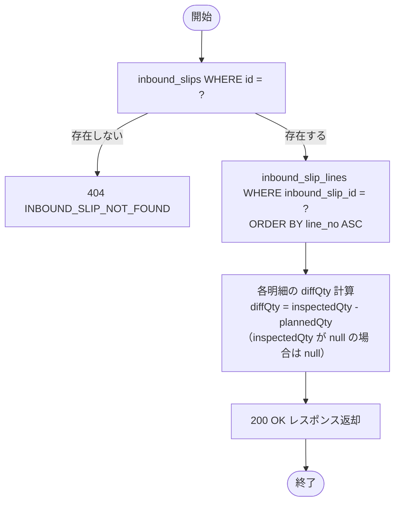

---

### 5. 補足事項

- `diffQty` はDB格納値ではなく、レスポンス生成時にアプリ層で計算する。
- `createdByName` は `users` テーブルとJOINして取得する。
- 入荷予定は作成後に変更不可。修正が必要な場合はキャンセル（API-INB-007: 入荷キャンセル）して再登録する。

---

> **注記**: API-INB-004 は欠番。入荷予定は作成後に変更不可（修正が必要な場合はキャンセル（API-INB-007）して再登録する）。

---

## API-INB-005: 入荷予定削除

### 1. API概要

| 項目 | 内容 |
|------|------|
| **API ID** | `API-INB-005` |
| **API名** | 入荷予定削除 |
| **メソッド** | `DELETE` |
| **パス** | `/api/v1/inbound/slips/{id}` |
| **認証** | 要 |
| **対象ロール** | SYSTEM_ADMIN, WAREHOUSE_MANAGER, WAREHOUSE_STAFF |
| **概要** | ステータスが `PLANNED` の入荷予定伝票を物理削除する。`PLANNED` 以外は 409 エラー。 |
| **関連画面** | INB-001（入荷予定一覧）、INB-003（入荷予定詳細） |

---

### 2. リクエスト仕様

#### パスパラメータ

| パラメータ名 | 型 | 必須 | 説明 |
|------------|-----|:----:|------|
| `id` | Long | ○ | 入荷伝票ID |

---

### 3. レスポンス仕様

#### 成功レスポンス: `204 No Content`

レスポンスボディなし。

#### エラーレスポンス

| HTTPステータス | エラーコード | 発生条件 |
|-------------|------------|---------|
| `401` | `UNAUTHORIZED` | 未認証 |
| `403` | `FORBIDDEN` | ロール不足 |
| `404` | `INBOUND_SLIP_NOT_FOUND` | 伝票が存在しない |
| `409` | `INBOUND_INVALID_STATUS` | ステータスが `PLANNED` でない |

---

### 4. 業務ロジック

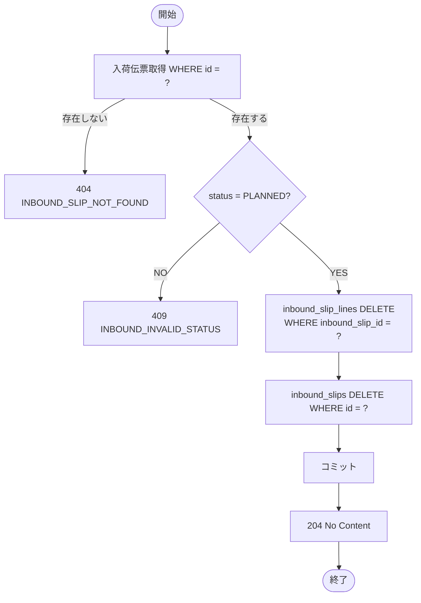

**ビジネスルール**:

| # | ルール | エラーコード |
|---|--------|------------|
| 1 | `PLANNED` ステータスの伝票のみ削除可能 | `INBOUND_INVALID_STATUS` |
| 2 | 明細（`inbound_slip_lines`）を先に削除してからヘッダーを削除する（FK制約遵守） | — |

---

---

## API-INB-006: 入荷確認

### 1. API概要

| 項目 | 内容 |
|------|------|
| **API ID** | `API-INB-006` |
| **API名** | 入荷確認 |
| **メソッド** | `POST` |
| **パス** | `/api/v1/inbound/slips/{id}/confirm` |
| **認証** | 要 |
| **対象ロール** | SYSTEM_ADMIN, WAREHOUSE_MANAGER, WAREHOUSE_STAFF |
| **概要** | `PLANNED` 状態の入荷予定伝票を `CONFIRMED`（入荷確認済）に遷移させる。担当者が入荷予定を確認・承認したことを記録する操作。 |
| **関連画面** | INB-003（入荷予定詳細）の「入荷確認」ボタン |

---

### 2. リクエスト仕様

#### パスパラメータ

| パラメータ名 | 型 | 必須 | 説明 |
|------------|-----|:----:|------|
| `id` | Long | ○ | 入荷伝票ID |

リクエストボディなし。

---

### 3. レスポンス仕様

#### 成功レスポンス: `200 OK`

更新後の入荷伝票全情報（API-INB-003 と同形式）。

#### エラーレスポンス

| HTTPステータス | エラーコード | 発生条件 |
|-------------|------------|---------|
| `401` | `UNAUTHORIZED` | 未認証 |
| `403` | `FORBIDDEN` | ロール不足 |
| `404` | `INBOUND_SLIP_NOT_FOUND` | 伝票が存在しない |
| `409` | `INBOUND_INVALID_STATUS` | ステータスが `PLANNED` でない |

---

### 4. 業務ロジック

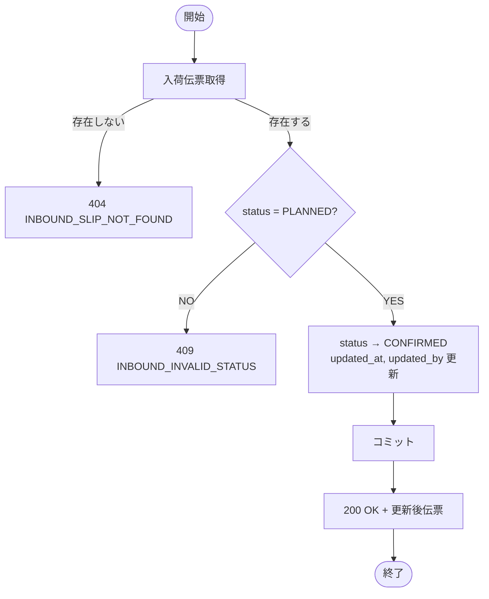

---

---

## API-INB-007: 入荷キャンセル

### 1. API概要

| 項目 | 内容 |
|------|------|
| **API ID** | `API-INB-007` |
| **API名** | 入荷キャンセル |
| **メソッド** | `POST` |
| **パス** | `/api/v1/inbound/slips/{id}/cancel` |
| **認証** | 要 |
| **対象ロール** | SYSTEM_ADMIN, WAREHOUSE_MANAGER, WAREHOUSE_STAFF |
| **概要** | `STORED`（入庫完了）および `CANCELLED` 以外の入荷予定伝票を `CANCELLED` に遷移させる。`PARTIAL_STORED` の場合は入庫確定済み在庫を戻す処理を行う。 |
| **関連画面** | INB-003（入荷予定詳細）の「キャンセル」ボタン |

---

### 2. リクエスト仕様

#### パスパラメータ

| パラメータ名 | 型 | 必須 | 説明 |
|------------|-----|:----:|------|
| `id` | Long | ○ | 入荷伝票ID |

リクエストボディなし。

---

### 3. レスポンス仕様

#### 成功レスポンス: `200 OK`

更新後の入荷伝票全情報（API-INB-003 と同形式）。

#### エラーレスポンス

| HTTPステータス | エラーコード | 発生条件 |
|-------------|------------|---------|
| `401` | `UNAUTHORIZED` | 未認証 |
| `403` | `FORBIDDEN` | ロール不足 |
| `404` | `INBOUND_SLIP_NOT_FOUND` | 伝票が存在しない |
| `409` | `INBOUND_INVALID_STATUS` | ステータスが `STORED`（入庫完了）または `CANCELLED`（キャンセル済） |

---

### 4. 業務ロジック

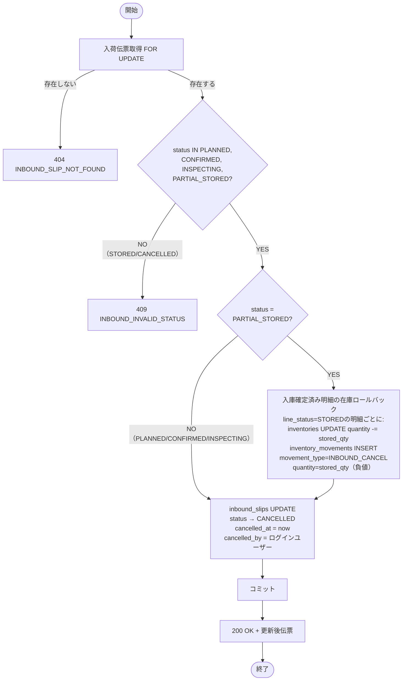

**ビジネスルール**:

| # | ルール | エラーコード |
|---|--------|------------|
| 1 | `STORED`（入庫完了）または `CANCELLED`（キャンセル済）の伝票はキャンセル不可 | `INBOUND_INVALID_STATUS` |
| 2 | キャンセル時に `cancelled_at`（現在日時）と `cancelled_by`（実行ユーザーID）を記録する | — |
| 3 | `PARTIAL_STORED` の伝票をキャンセルする場合、`line_status = STORED` の明細に対して在庫ロールバック処理を行う（`inventories.quantity` から入庫数量を減算し、`inventory_movements` に `INBOUND_CANCEL` レコードを挿入する） | — |
| 4 | `PLANNED`・`CONFIRMED`・`INSPECTING` の伝票キャンセルは在庫への影響なし（検品は在庫を変動させない） | — |

---

---

## API-INB-008: 検品登録

### 1. API概要

| 項目 | 内容 |
|------|------|
| **API ID** | `API-INB-008` |
| **API名** | 検品登録 |
| **メソッド** | `POST` |
| **パス** | `/api/v1/inbound/slips/{id}/inspect` |
| **認証** | 要 |
| **対象ロール** | SYSTEM_ADMIN, WAREHOUSE_MANAGER, WAREHOUSE_STAFF |
| **概要** | 到着した入荷品を明細単位で検品し、実際の入荷数を記録する。`CONFIRMED` からの初回呼び出し時にヘッダーステータスが `INSPECTING` に遷移する。`PARTIAL_STORED`（一部入庫済み）状態での呼び出しはヘッダーステータスを変更しない（残明細の追加検品として扱う）。検品数は再保存（上書き）可能。 |
| **関連画面** | INB-004（入荷検品）の「検品内容を保存する」ボタン |

---

### 2. リクエスト仕様

#### パスパラメータ

| パラメータ名 | 型 | 必須 | 説明 |
|------------|-----|:----:|------|
| `id` | Long | ○ | 入荷伝票ID |

#### リクエストボディ

```json
{
  "lines": [
    { "lineId": 1, "inspectedQty": 98 },
    { "lineId": 2, "inspectedQty": 50 }
  ]
}
```

| フィールド名 | 型 | 必須 | バリデーション | 説明 |
|------------|-----|:----:|-------------|------|
| `lines` | Array | ○ | 1件以上 | 検品数入力リスト |
| `lines[].lineId` | Long | ○ | 必須・当該伝票の明細IDであること | 明細ID |
| `lines[].inspectedQty` | Integer | ○ | 0以上999999以下 | 検品数（0は全量不着を意味する） |

---

### 3. レスポンス仕様

#### 成功レスポンス: `200 OK`

更新後の入荷伝票全情報（API-INB-003 と同形式）。

#### エラーレスポンス

| HTTPステータス | エラーコード | 発生条件 |
|-------------|------------|---------|
| `400` | `VALIDATION_ERROR` | バリデーションエラー（`inspectedQty` が負の値等） |
| `401` | `UNAUTHORIZED` | 未認証 |
| `403` | `FORBIDDEN` | ロール不足 |
| `404` | `INBOUND_SLIP_NOT_FOUND` | 伝票が存在しない |
| `404` | `INBOUND_LINE_NOT_FOUND` | 指定の明細IDが当該伝票に存在しない |
| `409` | `INBOUND_INVALID_STATUS` | ステータスが `CONFIRMED` / `INSPECTING` / `PARTIAL_STORED` でない |
| `422` | `EXPIRY_DATE_EXPIRED` | 賞味期限管理商品で賞味期限が営業日以前 |

---

### 4. 業務ロジック

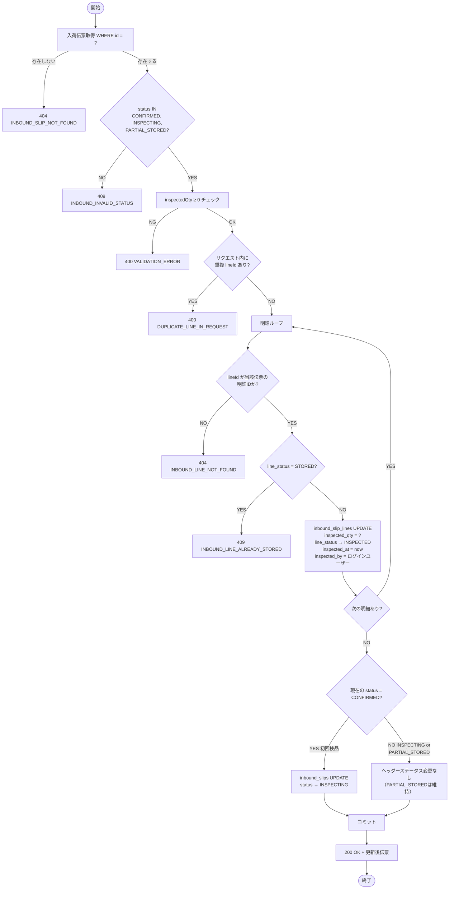

**ビジネスルール**:

| # | ルール | エラーコード |
|---|--------|------------|
| 1 | ステータスが `CONFIRMED`・`INSPECTING`・`PARTIAL_STORED` の伝票のみ検品登録可能 | `INBOUND_INVALID_STATUS` |
| 2 | `inspectedQty = 0` は「全量不着」を意味する合法な値として許容する | — |
| 3 | `CONFIRMED` からの初回呼び出しでヘッダーステータスを `CONFIRMED → INSPECTING` に遷移させる | — |
| 4 | すでに `INSPECTING` の場合、繰り返し呼び出して検品数を上書き更新できる（再検品可） | — |
| 5 | `PARTIAL_STORED` の場合、ヘッダーステータスは変更しない。残明細（`PENDING` / `INSPECTED`）のみ検品可能（入庫済み明細への操作はルール8が禁止） | — |
| 6 | リクエストに含まれない明細の `inspected_qty` は変更しない（部分更新） | — |
| 7 | `lineId` は当該伝票（`inbound_slip_id = id`）に属する明細IDでなければならない | `INBOUND_LINE_NOT_FOUND` |
| 8 | 既に `line_status = STORED` の明細は検品数上書き不可 | `INBOUND_LINE_ALREADY_STORED` |
| 9 | リクエスト内に同一 `lineId` が重複して含まれる場合はエラー | `DUPLICATE_LINE_IN_REQUEST` |

---

### 5. 補足事項

- 検品登録後に `line_status` が `STORED` の明細が一部存在する状態（`PARTIAL_STORED`）では、残りの `PENDING` / `INSPECTED` 明細に対して検品数の登録・再登録が可能。
- `PARTIAL_STORED` での検品はヘッダーステータスを `PARTIAL_STORED` のまま維持する。`INSPECTING` に戻すことはしない（入庫済み明細が存在するため、INSPECTINGへの巻き戻しは不適切）。
- 全明細が `INSPECTED` または `STORED` になった後も、`STORED` でない明細の検品数は再登録（上書き）可能とする。

---

---

## API-INB-009: 入庫確定

### 1. API概要

| 項目 | 内容 |
|------|------|
| **API ID** | `API-INB-009` |
| **API名** | 入庫確定 |
| **メソッド** | `POST` |
| **パス** | `/api/v1/inbound/slips/{id}/store` |
| **認証** | 要 |
| **対象ロール** | SYSTEM_ADMIN, WAREHOUSE_MANAGER, WAREHOUSE_STAFF |
| **概要** | 検品済み明細を指定ロケーションへ入庫確定する。確定と同時に `inventories` テーブルの在庫を加算し、`inventory_movements` に `INBOUND` レコードを追記する。全明細入庫完了でステータスが `STORED` に、一部の場合は `PARTIAL_STORED` に遷移する。 |
| **関連画面** | INB-005（入庫指示・確定）の「個別確定」および「全件入庫確定」ボタン |

---

### 2. リクエスト仕様

#### パスパラメータ

| パラメータ名 | 型 | 必須 | 説明 |
|------------|-----|:----:|------|
| `id` | Long | ○ | 入荷伝票ID |

#### リクエストボディ

```json
{
  "lines": [
    { "lineId": 1, "locationId": 50 },
    { "lineId": 2, "locationId": 51 }
  ]
}
```

| フィールド名 | 型 | 必須 | バリデーション | 説明 |
|------------|-----|:----:|-------------|------|
| `lines` | Array | ○ | 1件以上 | 入庫確定明細リスト |
| `lines[].lineId` | Long | ○ | 当該伝票の明細IDであること | 明細ID |
| `lines[].locationId` | Long | ○ | 有効なロケーション・棚卸ロック中でないこと | 入庫先ロケーションID |

---

### 3. レスポンス仕様

#### 成功レスポンス: `200 OK`

更新後の入荷伝票全情報（API-INB-003 と同形式）。

#### エラーレスポンス

| HTTPステータス | エラーコード | 発生条件 |
|-------------|------------|---------|
| `400` | `VALIDATION_ERROR` | バリデーションエラー |
| `401` | `UNAUTHORIZED` | 未認証 |
| `403` | `FORBIDDEN` | ロール不足 |
| `404` | `INBOUND_SLIP_NOT_FOUND` | 伝票が存在しない |
| `404` | `INBOUND_LINE_NOT_FOUND` | 指定の明細IDが当該伝票に存在しない |
| `404` | `LOCATION_NOT_FOUND` | 指定のロケーションが存在しない |
| `409` | `INBOUND_INVALID_STATUS` | ヘッダーステータスが `INSPECTING` / `PARTIAL_STORED` でない |
| `409` | `INBOUND_LINE_NOT_INSPECTED` | 対象明細の `line_status` が `INSPECTED` でない（`PENDING` または `STORED`） |
| `409` | `INVENTORY_STOCKTAKE_IN_PROGRESS` | 指定ロケーションが棚卸中のためロック中 |
| `422` | `LOCATION_PRODUCT_MISMATCH` | 入庫先ロケーションに既に別商品の在庫が存在する |
| `422` | `INBOUND_LOCATION_AREA_MISMATCH` | 指定ロケーションが入荷エリアに属さない |

---

### 4. 業務ロジック

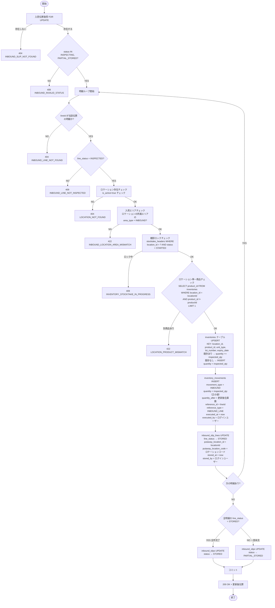

**ビジネスルール**:

| # | ルール | エラーコード |
|---|--------|------------|
| 1 | ヘッダーステータスが `INSPECTING` または `PARTIAL_STORED` の伝票のみ実行可能 | `INBOUND_INVALID_STATUS` |
| 2 | 対象明細の `line_status` が `INSPECTED` でなければならない（`PENDING` や `STORED` は不可） | `INBOUND_LINE_NOT_INSPECTED` |
| 3 | 指定ロケーションは入荷エリア（`areas.area_type = INBOUND`）に属していなければならない | `INBOUND_LOCATION_AREA_MISMATCH` |
| 4 | 指定ロケーションが棚卸中（`stocktake_headers.status = STARTED` で対象ロケーションが含まれる）の場合は入庫不可 | `INVENTORY_STOCKTAKE_IN_PROGRESS` |
| 4a | 同一ロケーションには1種類の商品のみ保管可能。入庫先ロケーションに既に別商品の在庫が存在する場合はエラーとする（`SELECT product_id FROM inventories WHERE location_id = :locationId AND product_id != :productId LIMIT 1`） | `LOCATION_PRODUCT_MISMATCH` |
| 5 | `inventories` の UPSERT は楽観的ロック（`@Version`）で並行更新の整合性を保証する | — |
| 6 | 全明細（全 `inbound_slip_lines`）の `line_status = STORED` になった時点でヘッダーを `STORED` に更新 | — |
| 7 | 一部の明細のみ確定した場合はヘッダーを `PARTIAL_STORED` に更新 | — |
| 8 | `inventory_movements` には明細単位でレコードを追記する（1明細 = 1 movementレコード） | — |
| 9 | `inspected_qty = 0` の明細は入庫確定できない（`VALIDATION_ERROR`。0入荷の場合は棚卸等で別途処理） | `VALIDATION_ERROR` |

**在庫への影響（テーブル更新サマリー）**:

| テーブル | 操作 | 内容 |
|---------|------|------|
| `inbound_slip_lines` | UPDATE | `line_status → STORED`, `putaway_location_id`, `putaway_location_code`, `stored_at`, `stored_by` をセット |
| `inbound_slips` | UPDATE | `status → PARTIAL_STORED` or `STORED`、`updated_at`, `updated_by` 更新 |
| `inventories` | INSERT or UPDATE | キー（`location_id`, `product_id`, `unit_type`, `lot_number`, `expiry_date`）で UPSERT。`quantity` を加算 |
| `inventory_movements` | INSERT | `movement_type = INBOUND`、`quantity` = 検品数（正値）、`quantity_after` = 更新後在庫数、`reference_id = lineId`、`reference_type = INBOUND_LINE` |

---

### 5. 補足事項

- ヘッダー取得時に `SELECT FOR UPDATE` を使用し、同一伝票への並行入庫確定を防ぐ。
- `inventories` の更新は楽観的ロック（Spring Data JPA の `@Version`）を使用する。楽観的ロック失敗時はリトライ（最大3回）後、500 エラーとする。
- `inventory_movements` は追記専用テーブル（UPDATE/DELETE 禁止）。
- `inspected_qty = 0` の明細は在庫に影響を与えないため、入庫確定操作をブロックする（フロントエンド側でも 0件明細の確定ボタンを非活性とすること）。

---

---

## API-INB-010: 入荷実績照会

### 1. API概要

| 項目 | 内容 |
|------|------|
| **API ID** | `API-INB-010` |
| **API名** | 入荷実績照会 |
| **メソッド** | `GET` |
| **パス** | `/api/v1/inbound/results` |
| **認証** | 要 |
| **対象ロール** | 全ロール |
| **概要** | 入庫完了した入荷伝票の実績を明細レベルで照会する。対象は `status = STORED` の伝票配下の `line_status = STORED` 明細。 |
| **関連画面** | INB-006（入荷実績照会） |

---

### 2. リクエスト仕様

#### クエリパラメータ

| パラメータ名 | 型 | 必須 | デフォルト | 説明 |
|------------|-----|:----:|----------|------|
| `warehouseId` | Long | ○ | — | 倉庫ID |
| `storedDateFrom` | String | — | 当月1日 | 入庫日From（`yyyy-MM-dd`） |
| `storedDateTo` | String | — | 現在日 | 入庫日To（`yyyy-MM-dd`） |
| `partnerId` | Long | — | — | 仕入先ID（絞り込み） |
| `slipNumber` | String | — | — | 伝票番号（前方一致） |
| `productCode` | String | — | — | 商品コード（前方一致） |
| `page` | Integer | — | `0` | ページ番号（0始まり） |
| `size` | Integer | — | `20` | 1ページあたりの件数（上限100） |
| `sort` | String | — | `storedAt,desc` | ソート指定 |

---

### 3. レスポンス仕様

#### 成功レスポンス: `200 OK`

```json
{
  "content": [
    {
      "slipId": 1,
      "slipNumber": "INB-20260313-0001",
      "slipType": "NORMAL",
      "partnerCode": "SUP-0001",
      "partnerName": "株式会社ABC商事",
      "lineId": 1,
      "lineNo": 1,
      "productCode": "PRD-0001",
      "productName": "テスト商品A",
      "unitType": "CASE",
      "lotNumber": null,
      "expiryDate": null,
      "plannedQty": 100,
      "inspectedQty": 98,
      "diffQty": -2,
      "locationCode": "A-01-01",
      "storedAt": "2026-03-13T15:30:00+09:00",
      "storedByName": "鈴木 一郎"
    }
  ],
  "page": 0,
  "size": 20,
  "totalElements": 42,
  "totalPages": 3
}
```

#### content 各要素のフィールド定義

| フィールド名 | 型 | 説明 |
|------------|-----|------|
| `slipId` | Long | 入荷伝票ID |
| `slipNumber` | String | 伝票番号 |
| `slipType` | String | 入荷種別 |
| `partnerCode` | String | 仕入先コード |
| `partnerName` | String | 仕入先名 |
| `lineId` | Long | 明細ID |
| `lineNo` | Integer | 明細行番号 |
| `productCode` | String | 商品コード |
| `productName` | String | 商品名 |
| `unitType` | String | 荷姿 |
| `lotNumber` | String | ロット番号 |
| `expiryDate` | String | 賞味/使用期限日 |
| `plannedQty` | Integer | 入荷予定数量 |
| `inspectedQty` | Integer | 検品数 |
| `diffQty` | Integer | 差異数（`inspectedQty - plannedQty`） |
| `locationCode` | String | 入庫先ロケーションコード |
| `storedAt` | String | 入庫確定日時 |
| `storedByName` | String | 入庫確定者名 |

#### エラーレスポンス

| HTTPステータス | エラーコード | 発生条件 |
|-------------|------------|---------|
| `400` | `VALIDATION_ERROR` | `warehouseId` 未指定・日付フォーマット不正 |
| `401` | `UNAUTHORIZED` | 未認証 |
| `404` | `WAREHOUSE_NOT_FOUND` | 指定の倉庫が存在しない |

---

### 4. 業務ロジック

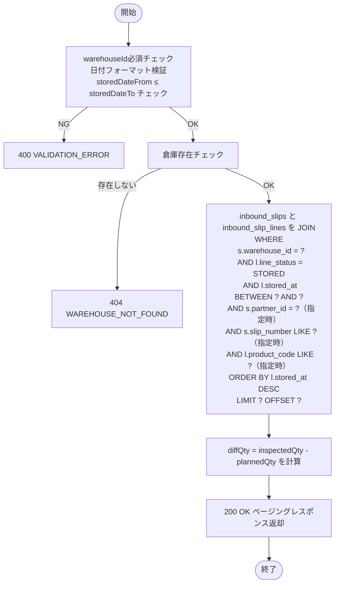

**ビジネスルール**:

| # | ルール |
|---|--------|
| 1 | 検索対象は `inbound_slip_lines.line_status = STORED` の明細のみ |
| 2 | `storedDateFrom` / `storedDateTo` は `inbound_slip_lines.stored_at` に対して適用する（`DATE(stored_at)`で比較） |
| 3 | `storedDateFrom` がデフォルト（未指定）の場合は現在営業日の月初1日を使用する |
| 4 | `productCode` 検索は前方一致（`LIKE 'XXX%'`） |
| 5 | `slipNumber` 検索は前方一致 |

---

### 5. 補足事項

- `storedByName` は `users` テーブルとJOINして取得する（`stored_by → users.id → user_name`）。
- `diffQty` はアプリ層で計算（`inspectedQty - plannedQty`）。
- デフォルトソートは `stored_at DESC, slip_number ASC, line_no ASC`。
- 件数が多い場合のパフォーマンス対策として、`INDEX (warehouse_id, stored_at)` が有効に使われるよう検索条件を設計する。

---

---

## エラーコード一覧（入荷管理）

| エラーコード | HTTPステータス | 説明 |
|-----------|-------------|------|
| `INBOUND_SLIP_NOT_FOUND` | 404 | 指定IDの入荷伝票が存在しない |
| `INBOUND_LINE_NOT_FOUND` | 404 | 指定IDの入荷明細が当該伝票に存在しない |
| `INBOUND_INVALID_STATUS` | 409 | 現在のステータスではその操作は実行不可 |
| `INBOUND_LINE_NOT_INSPECTED` | 409 | 対象明細が検品済（INSPECTED）でないため入庫確定不可 |
| `INBOUND_PARTNER_NOT_SUPPLIER` | 422 | 取引先種別が仕入先（SUPPLIER/BOTH）でない |
| `INBOUND_LOCATION_AREA_MISMATCH` | 422 | 指定ロケーションが入荷エリアに属さない |
| `LOCATION_PRODUCT_MISMATCH` | 422 | 入庫先ロケーションに既に別商品の在庫が存在する（同一ロケーション単一商品制約） |
| `DUPLICATE_PRODUCT_IN_LINES` | 409 | 同一伝票内に同じ商品IDの明細が重複 |
| `PLANNED_DATE_TOO_EARLY` | 422 | 入荷予定日が現在営業日より前 |
| `LOT_NUMBER_REQUIRED` | 422 | ロット管理フラグONの商品のロット番号未指定 |
| `EXPIRY_DATE_REQUIRED` | 422 | 期限管理フラグONの商品の期限日未指定 |
