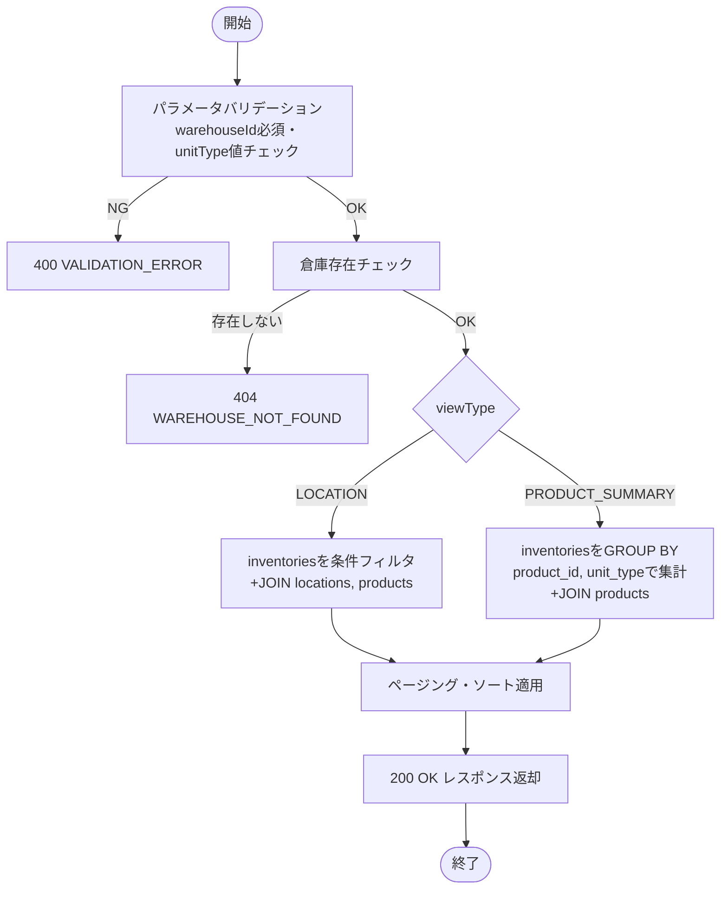
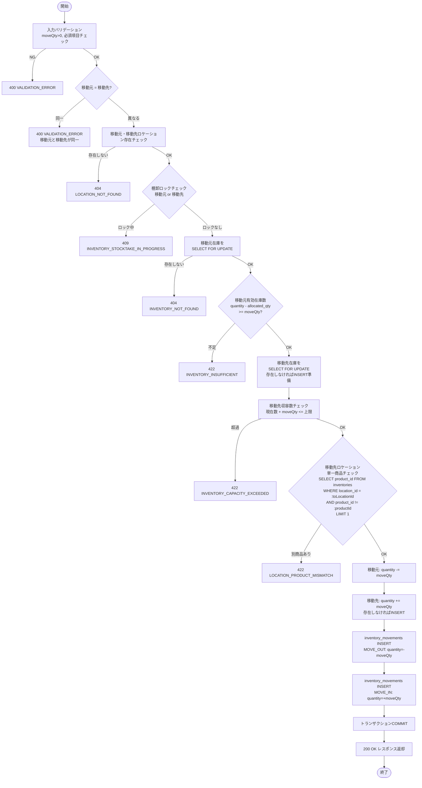
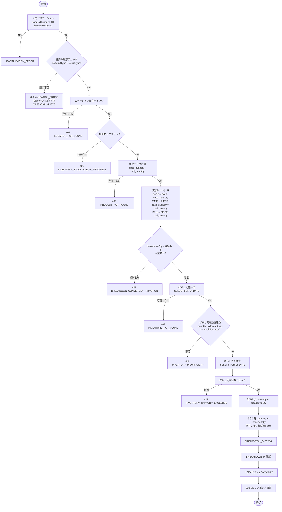
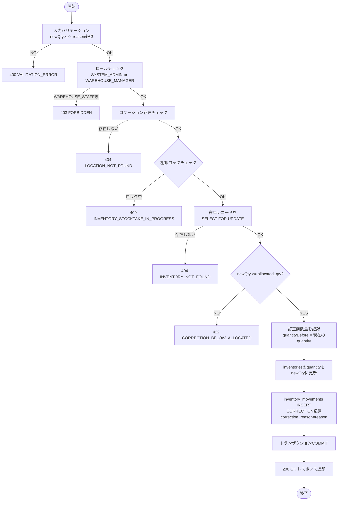
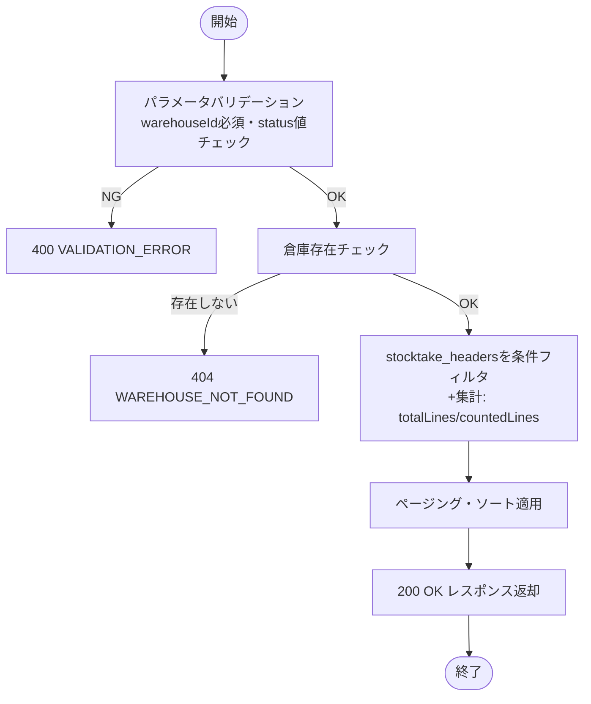
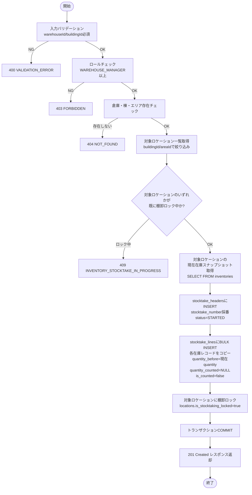
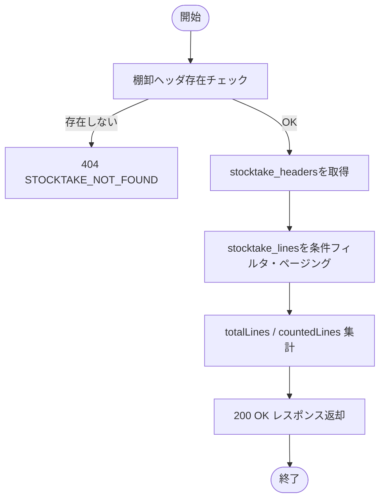
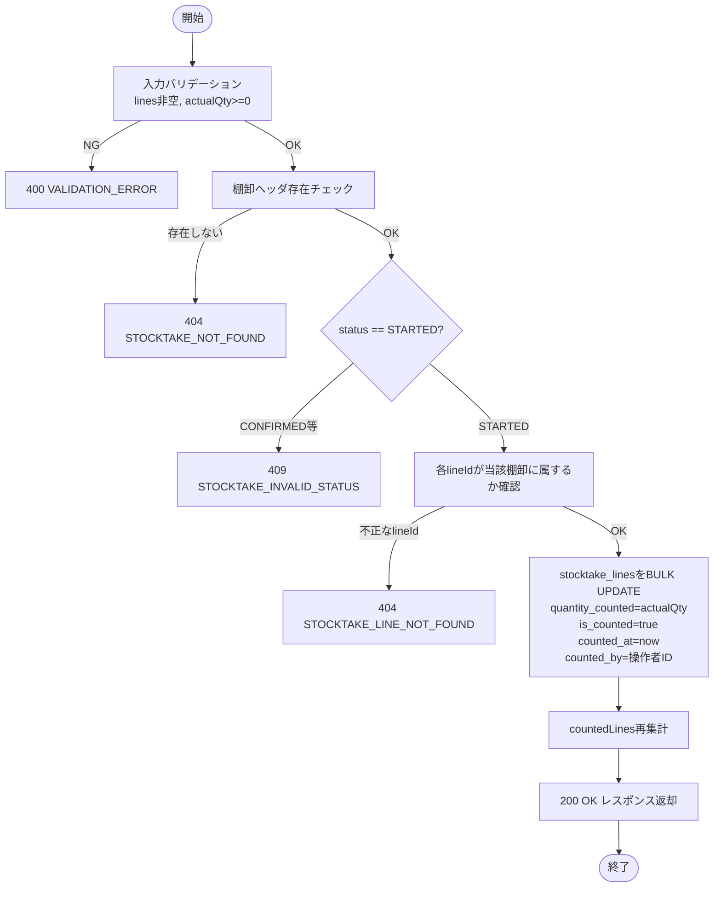
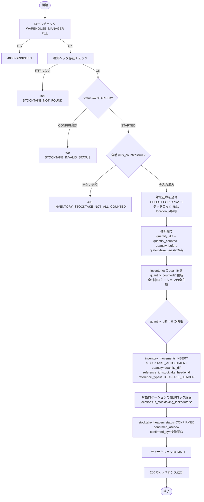
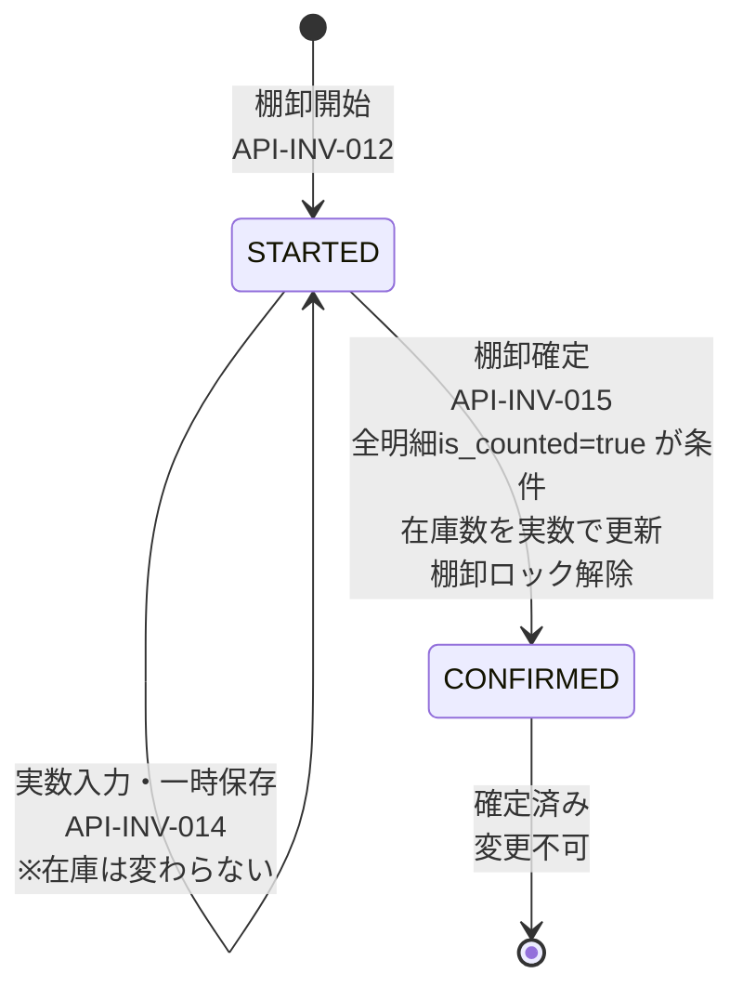

# 機能設計書 — API設計 在庫管理（API-INV-001〜015）

---

## 目次

- [API-INV-001: 在庫一覧照会](#api-inv-001-在庫一覧照会)
- [API-INV-002: 在庫移動登録](#api-inv-002-在庫移動登録)
- [API-INV-003: ばらし登録](#api-inv-003-ばらし登録)
- [API-INV-004: 在庫訂正登録](#api-inv-004-在庫訂正登録)
- [API-INV-011: 棚卸一覧取得](#api-inv-011-棚卸一覧取得)
- [API-INV-012: 棚卸開始](#api-inv-012-棚卸開始)
- [API-INV-013: 棚卸詳細取得](#api-inv-013-棚卸詳細取得)
- [API-INV-014: 棚卸実数入力・一時保存](#api-inv-014-棚卸実数入力一時保存)
- [API-INV-015: 棚卸確定](#api-inv-015-棚卸確定)

---

## テーブル構造リファレンス

> テーブル定義の詳細は [data-model/03-transaction-tables.md](../../data-model/03-transaction-tables.md) を参照。

本API設計で使用する主要テーブル:

- **inventories** — 在庫管理の中核テーブル。ロケーション・商品・荷姿・ロット番号・賞味期限の5軸で在庫を管理する。`version` カラムによる楽観的ロックをサポート。
- **inventory_movements** — 在庫の増減が発生するすべての操作を記録する追記専用テーブル。`movement_type` で変動種別（`INBOUND`, `OUTBOUND`, `MOVE_OUT`, `MOVE_IN`, `BREAKDOWN_OUT`, `BREAKDOWN_IN`, `CORRECTION`, `STOCKTAKE_ADJUSTMENT` 等）を区分する。
- **stocktake_headers** — 棚卸ヘッダ。ステータスは `STARTED` / `CONFIRMED`。
- **stocktake_lines** — 棚卸明細。`quantity_before`（開始時在庫数）、`quantity_counted`（実数）、`quantity_diff`（差異数）を管理する。

---

## ロック戦略

| 操作 | ロック方式 | 詳細 |
|------|-----------|------|
| 在庫移動・ばらし | 悲観的ロック | `SELECT ... FOR UPDATE` で在庫レコードをロック |
| 在庫訂正 | 悲観的ロック | `SELECT ... FOR UPDATE` で在庫レコードをロック |
| 棚卸確定 | 悲観的ロック | `SELECT ... FOR UPDATE` で対象在庫全件をロック |
| 入庫・出庫（入荷・出荷管理から） | 楽観的ロック | `@Version` による楽観的ロック（競合時は `OptimisticLockingFailureException` → 409） |

---

## 棚卸ロック（locations.is_stocktaking_locked）

棚卸開始時、対象ロケーションに `is_stocktaking_locked = true` をセットする。
棚卸ロック中のロケーションに対する在庫移動・ばらし・在庫訂正は `409 INVENTORY_STOCKTAKE_IN_PROGRESS` を返す。
棚卸確定後に `is_stocktaking_locked = false` へ戻す。

---

---

## API-INV-001: 在庫一覧照会

### 1. API概要

| 項目 | 内容 |
|------|------|
| **API ID** | `API-INV-001` |
| **API名** | 在庫一覧照会 |
| **メソッド** | `GET` |
| **パス** | `/api/v1/inventory` |
| **認証** | 要 |
| **対象ロール** | 全ロール（SYSTEM_ADMIN, WAREHOUSE_MANAGER, WAREHOUSE_STAFF, VIEWER） |
| **概要** | 倉庫の在庫を多軸条件で絞り込んで一覧取得する。ロケーション別明細表示（LOCATION）と商品別集計表示（PRODUCT_SUMMARY）の2モードを提供する。 |
| **関連画面** | INV-001（在庫一覧照会） |

---

### 2. リクエスト仕様

#### クエリパラメータ

| パラメータ名 | 型 | 必須 | デフォルト | 説明 |
|------------|-----|:----:|----------|------|
| `warehouseId` | Long | ○ | — | 倉庫ID |
| `locationCodePrefix` | String | — | — | ロケーションコード前方一致フィルタ（例: `A-01` → `A-01-*` を絞り込み） |
| `productId` | Long | — | — | 商品ID |
| `unitType` | String | — | — | 荷姿（`CASE` / `BALL` / `PIECE`） |
| `storageCondition` | String | — | — | 保管条件（`NORMAL` / `REFRIGERATED` / `FROZEN`） |
| `viewType` | String | — | `LOCATION` | 表示モード（`LOCATION` / `PRODUCT_SUMMARY`） |
| `page` | Integer | — | `0` | ページ番号（0始まり） |
| `size` | Integer | — | `20` | 1ページあたりの件数（上限100） |
| `sort` | String | — | `locationCode,asc` | ソート指定 |

---

### 3. レスポンス仕様

#### 成功レスポンス: 200 OK

##### viewType=LOCATION（デフォルト）

`inventories` テーブルのレコードを直接返す。1行 = 在庫5軸の1レコード。

```json
{
  "content": [
    {
      "id": 1001,
      "locationId": 10,
      "locationCode": "A-01-001",
      "productId": 101,
      "productCode": "P-001",
      "productName": "テスト商品A",
      "unitType": "CASE",
      "lotNumber": null,
      "expiryDate": null,
      "quantity": 20,
      "allocatedQty": 5,
      "availableQty": 15,
      "updatedAt": "2026-03-13T09:00:00+09:00"
    },
    {
      "id": 1002,
      "locationId": 10,
      "locationCode": "A-01-001",
      "productId": 102,
      "productCode": "P-002",
      "productName": "テスト商品B",
      "unitType": "BALL",
      "lotNumber": "LOT-20260301",
      "expiryDate": "2026-09-30",
      "quantity": 12,
      "allocatedQty": 0,
      "availableQty": 12,
      "updatedAt": "2026-03-13T10:30:00+09:00"
    }
  ],
  "page": 0,
  "size": 20,
  "totalElements": 152,
  "totalPages": 8
}
```

**content 各フィールド**:

| フィールド名 | 型 | 説明 |
|------------|-----|------|
| `id` | Long | 在庫レコードID |
| `locationId` | Long | ロケーションID |
| `locationCode` | String | ロケーションコード |
| `productId` | Long | 商品ID |
| `productCode` | String | 商品コード |
| `productName` | String | 商品名 |
| `unitType` | String | 荷姿（`CASE` / `BALL` / `PIECE`） |
| `lotNumber` | String | ロット番号（null可） |
| `expiryDate` | String | 賞味/使用期限（`yyyy-MM-dd`、null可） |
| `quantity` | Integer | 在庫数量 |
| `allocatedQty` | Integer | 引当数量 |
| `availableQty` | Integer | 有効在庫数（quantity - allocatedQty） |
| `updatedAt` | String | 最終更新日時（ISO 8601） |

##### viewType=PRODUCT_SUMMARY

商品 × 荷姿ごとに在庫数を集計する。ロット・期限をまたいで合算する。

```json
{
  "content": [
    {
      "productId": 101,
      "productCode": "P-001",
      "productName": "テスト商品A",
      "storageCondition": "NORMAL",
      "caseQuantity": 10,
      "ballQuantity": 0,
      "pieceQuantity": 24,
      "totalAllocatedQty": 3,
      "totalAvailableQty": 31,
      "totalPieceEquivalent": 1224
    }
  ],
  "page": 0,
  "size": 20,
  "totalElements": 45,
  "totalPages": 3
}
```

**content 各フィールド（PRODUCT_SUMMARY）**:

| フィールド名 | 型 | 説明 |
|------------|-----|------|
| `productId` | Long | 商品ID |
| `productCode` | String | 商品コード |
| `productName` | String | 商品名 |
| `storageCondition` | String | 保管条件 |
| `caseQuantity` | Integer | ケース在庫合計数 |
| `ballQuantity` | Integer | ボール在庫合計数 |
| `pieceQuantity` | Integer | バラ在庫合計数 |
| `totalAllocatedQty` | Integer | 引当数量合計 |
| `totalAvailableQty` | Integer | 有効在庫数合計（各荷姿の quantity 合計 - totalAllocatedQty） |
| `totalPieceEquivalent` | Long | 総バラ換算数（`caseQty × case_quantity × ball_quantity + ballQty × ball_quantity + pieceQty`） |

#### エラーレスポンス

| HTTPステータス | エラーコード | 条件 |
|-------------|------------|------|
| `400` | `VALIDATION_ERROR` | `warehouseId` 未指定、`unitType` 不正値 |
| `401` | `UNAUTHORIZED` | 未認証 |
| `404` | `WAREHOUSE_NOT_FOUND` | 指定倉庫が存在しない |

---

### 4. 業務ロジック



**ビジネスルール**:

| # | ルール | エラーコード |
|---|--------|------------|
| 1 | `warehouseId` は必須パラメータ | `VALIDATION_ERROR` |
| 2 | `unitType` は `CASE` / `BALL` / `PIECE` のいずれか | `VALIDATION_ERROR` |
| 3 | `viewType` は `LOCATION` / `PRODUCT_SUMMARY` のいずれか（デフォルト: `LOCATION`） | `VALIDATION_ERROR` |
| 4 | 指定した `warehouseId` の倉庫が存在すること | `WAREHOUSE_NOT_FOUND` |

---

### 5. 補足事項

- `locationCodePrefix` は `LIKE 'A-01%'` として適用する（前方一致）。
- `storageCondition` は `locations` テーブルの `storage_condition` カラムを JOIN して絞り込む。
- `viewType=PRODUCT_SUMMARY` の `totalPieceEquivalent` は `products.case_quantity` および `products.ball_quantity` を参照して算出する。
- ソートのデフォルトは `locationCode,asc`（LOCATION時）/ `productCode,asc`（PRODUCT_SUMMARY時）。

---

---

## API-INV-002: 在庫移動登録

### 1. API概要

| 項目 | 内容 |
|------|------|
| **API ID** | `API-INV-002` |
| **API名** | 在庫移動登録 |
| **メソッド** | `POST` |
| **パス** | `/api/v1/inventory/move` |
| **認証** | 要 |
| **対象ロール** | SYSTEM_ADMIN, WAREHOUSE_MANAGER, WAREHOUSE_STAFF |
| **概要** | 指定した在庫（商品・荷姿・ロット・期限）を移動元ロケーションから移動先ロケーションへ移動する。 |
| **関連画面** | INV-002（在庫移動） |

---

### 2. リクエスト仕様

#### リクエストボディ

```json
{
  "fromLocationId": 1,
  "productId": 101,
  "unitType": "CASE",
  "lotNumber": null,
  "expiryDate": null,
  "toLocationId": 2,
  "moveQty": 1
}
```

| フィールド名 | 型 | 必須 | バリデーション | 説明 |
|------------|-----|:----:|-------------|------|
| `fromLocationId` | Long | ○ | — | 移動元ロケーションID |
| `productId` | Long | ○ | — | 移動対象商品ID |
| `unitType` | String | ○ | `CASE` / `BALL` / `PIECE` | 荷姿 |
| `lotNumber` | String | — | — | ロット番号（null可） |
| `expiryDate` | String | — | `yyyy-MM-dd` | 賞味/使用期限（null可） |
| `toLocationId` | Long | ○ | — | 移動先ロケーションID |
| `moveQty` | Integer | ○ | 1以上の整数 | 移動数量 |

---

### 3. レスポンス仕様

#### 成功レスポンス: 200 OK

```json
{
  "fromInventoryId": 1001,
  "toInventoryId": 2005,
  "fromLocationCode": "A-01-001",
  "toLocationCode": "A-02-003",
  "productCode": "P-001",
  "productName": "テスト商品A",
  "unitType": "CASE",
  "movedQty": 1,
  "fromQuantityAfter": 4,
  "toQuantityAfter": 1
}
```

| フィールド名 | 型 | 説明 |
|------------|-----|------|
| `fromInventoryId` | Long | 移動元の在庫レコードID |
| `toInventoryId` | Long | 移動先の在庫レコードID（新規作成された場合も含む） |
| `fromLocationCode` | String | 移動元ロケーションコード |
| `toLocationCode` | String | 移動先ロケーションコード |
| `productCode` | String | 商品コード |
| `productName` | String | 商品名 |
| `unitType` | String | 荷姿 |
| `movedQty` | Integer | 移動数量 |
| `fromQuantityAfter` | Integer | 移動後の移動元在庫数 |
| `toQuantityAfter` | Integer | 移動後の移動先在庫数 |

#### エラーレスポンス

| HTTPステータス | エラーコード | 条件 |
|-------------|------------|------|
| `400` | `VALIDATION_ERROR` | 必須項目未指定・型不正・`moveQty` ≤ 0 |
| `401` | `UNAUTHORIZED` | 未認証 |
| `403` | `FORBIDDEN` | ロール不足（VIEWER） |
| `404` | `LOCATION_NOT_FOUND` | 移動元または移動先ロケーションが存在しない |
| `404` | `PRODUCT_NOT_FOUND` | 指定商品が存在しない |
| `404` | `INVENTORY_NOT_FOUND` | 移動元に対象在庫が存在しない |
| `422` | `INVENTORY_INSUFFICIENT` | 移動元在庫数 < `moveQty` |
| `409` | `INVENTORY_STOCKTAKE_IN_PROGRESS` | 移動元または移動先ロケーションが棚卸ロック中 |
| `422` | `INVENTORY_CAPACITY_EXCEEDED` | 移動先ロケーションの収容数を超過 |
| `422` | `LOCATION_PRODUCT_MISMATCH` | 移動先ロケーションに既に別商品の在庫が存在する |

---

### 4. 業務ロジック



**ビジネスルール**:

| # | ルール | エラーコード |
|---|--------|------------|
| 1 | `moveQty` は 1 以上の整数であること | `VALIDATION_ERROR` |
| 2 | `fromLocationId` と `toLocationId` が同一でないこと | `VALIDATION_ERROR` |
| 3 | 移動元ロケーションに対象在庫（5軸一致）が存在すること | `INVENTORY_NOT_FOUND` |
| 4 | 移動元の有効在庫数（`quantity - allocated_qty`）≥ `moveQty` であること。引当済み在庫は移動不可 | `INVENTORY_INSUFFICIENT` |
| 5 | 移動元ロケーションが棚卸ロック中でないこと | `INVENTORY_STOCKTAKE_IN_PROGRESS` |
| 6 | 移動先ロケーションが棚卸ロック中でないこと | `INVENTORY_STOCKTAKE_IN_PROGRESS` |
| 7 | 移動先ロケーションの現在収容数 + `moveQty` ≤ ロケーション収容上限（system_parameters） | `INVENTORY_CAPACITY_EXCEEDED` |
| 8 | 同一ロケーションには1種類の商品のみ保管可能。移動先ロケーションに既に別商品の在庫が存在する場合はエラーとする（`SELECT product_id FROM inventories WHERE location_id = :toLocationId AND product_id != :productId LIMIT 1`） | `LOCATION_PRODUCT_MISMATCH` |

**ロケーション収容上限（system_parameters）**:

| パラメータキー | 値 | 説明 |
|-------------|---|------|
| `LOCATION_CAPACITY_CASE` | 1 | ロケーションあたりのケース収容上限 |
| `LOCATION_CAPACITY_BALL` | 6 | ロケーションあたりのボール収容上限 |
| `LOCATION_CAPACITY_PIECE` | 100 | ロケーションあたりのバラ収容上限 |

収容数チェックは `unitType` に対応する上限値を使用する。同一ロケーションの同一荷姿の全在庫レコードの合計数量に対してチェックする（商品・ロット・期限をまたいで合算）。

**排他制御（悲観的ロック）**:

移動元と移動先の在庫レコードは `SELECT ... FOR UPDATE` でロックを取得する。デッドロック防止のため、常に `id` 昇順でロックを取得する（`fromInventory.id < toInventory.id` の場合は from→to 順、逆の場合は to→from 順）。

**inventory_movements 記録内容**:

| フィールド | MOVE_OUT | MOVE_IN |
|-----------|---------|--------|
| `movement_type` | `MOVE_OUT` | `MOVE_IN` |
| `location_id` | `fromLocationId` | `toLocationId` |
| `quantity` | `-moveQty`（負） | `+moveQty`（正） |
| `quantity_after` | 移動後の移動元在庫数 | 移動後の移動先在庫数 |
| `reference_id` | — | — |
| `reference_type` | — | — |

---

### 5. 補足事項

- 移動元の在庫が `moveQty` と完全一致して 0 になった場合、`inventories` レコードは削除せず `quantity=0` のまま保持する。
- 移動先に同一5軸の在庫レコードが存在しない場合は新規 INSERT する。
- 本トランザクションは `@Transactional` で単一トランザクション内に閉じる。

---

---

## API-INV-003: ばらし登録

### 1. API概要

| 項目 | 内容 |
|------|------|
| **API ID** | `API-INV-003` |
| **API名** | ばらし登録 |
| **メソッド** | `POST` |
| **パス** | `/api/v1/inventory/breakdown` |
| **認証** | 要 |
| **対象ロール** | SYSTEM_ADMIN, WAREHOUSE_MANAGER, WAREHOUSE_STAFF |
| **概要** | ケースをボール/バラへ、ボールをバラへ変換（ばらし）する。変換レートは商品マスタの `case_quantity`（ケース入数）/ `ball_quantity`（ボール入数）を参照する。 |
| **関連画面** | INV-003（ばらし） |

---

### 2. リクエスト仕様

#### リクエストボディ

```json
{
  "fromLocationId": 1,
  "productId": 101,
  "fromUnitType": "CASE",
  "breakdownQty": 1,
  "toUnitType": "BALL",
  "toLocationId": 1
}
```

| フィールド名 | 型 | 必須 | バリデーション | 説明 |
|------------|-----|:----:|-------------|------|
| `fromLocationId` | Long | ○ | — | ばらし元ロケーションID |
| `productId` | Long | ○ | — | ばらし対象商品ID |
| `fromUnitType` | String | ○ | `CASE` または `BALL` | ばらし元荷姿（`PIECE` は不可） |
| `breakdownQty` | Integer | ○ | 1以上の整数 | ばらし数量（`fromUnitType` 単位） |
| `toUnitType` | String | ○ | `BALL` または `PIECE` | ばらし先荷姿 |
| `toLocationId` | Long | ○ | — | ばらし先ロケーションID（ばらし元と同一可） |

---

### 3. レスポンス仕様

#### 成功レスポンス: 200 OK

```json
{
  "fromInventoryId": 1001,
  "toInventoryId": 1003,
  "productCode": "P-001",
  "productName": "テスト商品A",
  "fromUnitType": "CASE",
  "toUnitType": "BALL",
  "breakdownQty": 1,
  "convertedQty": 12,
  "fromQuantityAfter": 4,
  "toQuantityAfter": 12
}
```

| フィールド名 | 型 | 説明 |
|------------|-----|------|
| `fromInventoryId` | Long | ばらし元の在庫レコードID |
| `toInventoryId` | Long | ばらし先の在庫レコードID |
| `productCode` | String | 商品コード |
| `productName` | String | 商品名 |
| `fromUnitType` | String | ばらし元荷姿 |
| `toUnitType` | String | ばらし先荷姿 |
| `breakdownQty` | Integer | ばらした数量（`fromUnitType` 単位） |
| `convertedQty` | Integer | ばらし後の生成数量（`toUnitType` 単位） |
| `fromQuantityAfter` | Integer | ばらし後のばらし元在庫数 |
| `toQuantityAfter` | Integer | ばらし後のばらし先在庫数 |

#### エラーレスポンス

| HTTPステータス | エラーコード | 条件 |
|-------------|------------|------|
| `400` | `VALIDATION_ERROR` | 必須項目未指定、`fromUnitType=PIECE`、荷姿の順序不正（BALL→CASE等） |
| `401` | `UNAUTHORIZED` | 未認証 |
| `403` | `FORBIDDEN` | ロール不足（VIEWER） |
| `404` | `LOCATION_NOT_FOUND` | ばらし元または先ロケーションが存在しない |
| `404` | `PRODUCT_NOT_FOUND` | 指定商品が存在しない |
| `404` | `INVENTORY_NOT_FOUND` | ばらし元に対象在庫が存在しない |
| `422` | `INVENTORY_INSUFFICIENT` | ばらし元在庫数 < `breakdownQty` |
| `409` | `INVENTORY_STOCKTAKE_IN_PROGRESS` | ばらし元または先ロケーションが棚卸ロック中 |
| `422` | `INVENTORY_CAPACITY_EXCEEDED` | ばらし先ロケーションの収容数超過 |
| `422` | `BREAKDOWN_CONVERSION_FRACTION` | 変換後数量に端数が発生（割り切れない） |

---

### 4. 業務ロジック



**ビジネスルール**:

| # | ルール | エラーコード |
|---|--------|------------|
| 1 | `fromUnitType` は `CASE` または `BALL` のみ（`PIECE` はばらし不可） | `VALIDATION_ERROR` |
| 2 | `toUnitType` は `fromUnitType` より小さい荷姿（CASE→BALL, CASE→PIECE, BALL→PIECE のみ有効） | `VALIDATION_ERROR` |
| 3 | `breakdownQty` × 変換レートが整数で割り切れること（端数エラー） | `BREAKDOWN_CONVERSION_FRACTION` |
| 4 | ばらし元に対象在庫が存在し、有効在庫数（`quantity - allocated_qty`）≥ `breakdownQty` であること。引当済み在庫はばらし不可 | `INVENTORY_INSUFFICIENT` |
| 5 | ばらし元・先ロケーションが棚卸ロック中でないこと | `INVENTORY_STOCKTAKE_IN_PROGRESS` |
| 6 | ばらし先ロケーションの現在収容数 + `convertedQty` ≤ 収容上限 | `INVENTORY_CAPACITY_EXCEEDED` |

**変換レート計算**:

| fromUnitType | toUnitType | 変換レート |
|-------------|-----------|----------|
| `CASE` | `BALL` | `products.case_quantity`（ケース入数） |
| `CASE` | `PIECE` | `products.case_quantity × products.ball_quantity` |
| `BALL` | `PIECE` | `products.ball_quantity`（ボール入数） |

変換後数量 = `breakdownQty × 変換レート`

ロット番号・賞味期限はばらし元と同一の値がばらし先にも引き継がれる。

**inventory_movements 記録内容**:

| フィールド | BREAKDOWN_OUT | BREAKDOWN_IN |
|-----------|-------------|-------------|
| `movement_type` | `BREAKDOWN_OUT` | `BREAKDOWN_IN` |
| `location_id` | `fromLocationId` | `toLocationId` |
| `unit_type` | `fromUnitType` | `toUnitType` |
| `quantity` | `-breakdownQty`（負） | `+convertedQty`（正） |
| `quantity_after` | ばらし後のばらし元在庫数 | ばらし後のばらし先在庫数 |

---

### 5. 補足事項

- ばらし元とばらし先が同一ロケーション（`fromLocationId = toLocationId`）の場合でも処理可能。
- ばらし後に在庫が 0 になった場合でも、在庫レコードは削除せず `quantity=0` で保持する。

---

---

## API-INV-004: 在庫訂正登録

### 1. API概要

| 項目 | 内容 |
|------|------|
| **API ID** | `API-INV-004` |
| **API名** | 在庫訂正登録 |
| **メソッド** | `POST` |
| **パス** | `/api/v1/inventory/correction` |
| **認証** | 要 |
| **対象ロール** | SYSTEM_ADMIN, WAREHOUSE_MANAGER（WAREHOUSE_STAFFは不可） |
| **概要** | 指定した在庫の数量を直接指定の数量に訂正する。訂正理由の記録が必須。棚卸ロック中は不可。 |
| **関連画面** | INV-004（在庫訂正） |

---

### 2. リクエスト仕様

#### リクエストボディ

```json
{
  "locationId": 1,
  "productId": 101,
  "unitType": "CASE",
  "lotNumber": null,
  "expiryDate": null,
  "newQty": 3,
  "reason": "棚卸結果による訂正"
}
```

| フィールド名 | 型 | 必須 | バリデーション | 説明 |
|------------|-----|:----:|-------------|------|
| `locationId` | Long | ○ | — | 訂正対象ロケーションID |
| `productId` | Long | ○ | — | 訂正対象商品ID |
| `unitType` | String | ○ | `CASE` / `BALL` / `PIECE` | 荷姿 |
| `lotNumber` | String | — | — | ロット番号（null可） |
| `expiryDate` | String | — | `yyyy-MM-dd` | 賞味/使用期限（null可） |
| `newQty` | Integer | ○ | 0以上の整数 | 訂正後の在庫数量 |
| `reason` | String | ○ | 1〜200文字 | 訂正理由 |

---

### 3. レスポンス仕様

#### 成功レスポンス: 200 OK

```json
{
  "inventoryId": 1001,
  "locationCode": "A-01-001",
  "productCode": "P-001",
  "productName": "テスト商品A",
  "unitType": "CASE",
  "quantityBefore": 5,
  "quantityAfter": 3,
  "reason": "棚卸結果による訂正"
}
```

| フィールド名 | 型 | 説明 |
|------------|-----|------|
| `inventoryId` | Long | 在庫レコードID |
| `locationCode` | String | ロケーションコード |
| `productCode` | String | 商品コード |
| `productName` | String | 商品名 |
| `unitType` | String | 荷姿 |
| `quantityBefore` | Integer | 訂正前在庫数 |
| `quantityAfter` | Integer | 訂正後在庫数（= `newQty`） |
| `reason` | String | 訂正理由 |

#### エラーレスポンス

| HTTPステータス | エラーコード | 条件 |
|-------------|------------|------|
| `400` | `VALIDATION_ERROR` | 必須項目未指定、`newQty` < 0、`reason` が空または200文字超過 |
| `401` | `UNAUTHORIZED` | 未認証 |
| `403` | `FORBIDDEN` | ロール不足（WAREHOUSE_STAFF, VIEWER） |
| `404` | `LOCATION_NOT_FOUND` | 指定ロケーションが存在しない |
| `404` | `PRODUCT_NOT_FOUND` | 指定商品が存在しない |
| `404` | `INVENTORY_NOT_FOUND` | 対象在庫レコードが存在しない |
| `409` | `INVENTORY_STOCKTAKE_IN_PROGRESS` | ロケーションが棚卸ロック中 |
| `422` | `CORRECTION_BELOW_ALLOCATED` | 訂正後の数量が引当数（`allocated_qty`）を下回っている |

---

### 4. 業務ロジック



**ビジネスルール**:

| # | ルール | エラーコード |
|---|--------|------------|
| 1 | `newQty` は 0 以上の整数であること | `VALIDATION_ERROR` |
| 2 | `reason` は 1 文字以上 500 文字以下であること | `VALIDATION_ERROR` |
| 3 | 実行者のロールが `SYSTEM_ADMIN` または `WAREHOUSE_MANAGER` であること | `FORBIDDEN` |
| 4 | 対象ロケーションが棚卸ロック中でないこと | `INVENTORY_STOCKTAKE_IN_PROGRESS` |
| 5 | 対象在庫レコード（5軸一致）が存在すること | `INVENTORY_NOT_FOUND` |
| 6 | 訂正後の数量（`newQty`）が引当数（`allocated_qty`）を下回らないこと | `CORRECTION_BELOW_ALLOCATED` |

**inventory_movements 記録内容**:

| フィールド | 値 |
|-----------|---|
| `movement_type` | `CORRECTION` |
| `quantity` | `newQty - quantityBefore`（正・負・0いずれも可） |
| `quantity_after` | `newQty` |
| `correction_reason` | `reason`（リクエストの訂正理由） |
| `reference_id` | — |
| `reference_type` | — |

---

### 5. 補足事項

- `quantityBefore = newQty`（変化なし）の場合でも訂正レコードを記録する（理由登録の記録として）。
- 訂正後の在庫が `0` になってもレコードは削除しない。
- `reason`（訂正理由）は最大200文字。画面設計（INV-004）のバリデーション仕様に合わせてAPIサーバー側でも200文字以内を強制する。

---

---

## API-INV-011: 棚卸一覧取得

### 1. API概要

| 項目 | 内容 |
|------|------|
| **API ID** | `API-INV-011` |
| **API名** | 棚卸一覧取得 |
| **メソッド** | `GET` |
| **パス** | `/api/v1/inventory/stocktakes` |
| **認証** | 要 |
| **対象ロール** | 全ロール |
| **概要** | 棚卸の一覧を取得する。ステータスや倉庫で絞り込み可能。 |
| **関連画面** | INV-011（棚卸一覧） |

---

### 2. リクエスト仕様

#### クエリパラメータ

| パラメータ名 | 型 | 必須 | デフォルト | 説明 |
|------------|-----|:----:|----------|------|
| `warehouseId` | Long | ○ | — | 倉庫ID |
| `status` | String | — | — | ステータス絞り込み（`STARTED` / `CONFIRMED`） |
| `dateFrom` | String | — | — | 棚卸開始日（`yyyy-MM-dd`）の From |
| `dateTo` | String | — | — | 棚卸開始日（`yyyy-MM-dd`）の To |
| `page` | Integer | — | `0` | ページ番号（0始まり） |
| `size` | Integer | — | `20` | 1ページあたりの件数 |
| `sort` | String | — | `startedAt,desc` | ソート指定 |

---

### 3. レスポンス仕様

#### 成功レスポンス: 200 OK

```json
{
  "content": [
    {
      "id": 42,
      "stocktakeNumber": "ST-2026-00042",
      "warehouseId": 1,
      "warehouseName": "東京DC",
      "targetDescription": "A棟 全エリア",
      "status": "STARTED",
      "totalLines": 120,
      "countedLines": 80,
      "startedAt": "2026-03-13T09:00:00+09:00",
      "startedByName": "山田 太郎",
      "confirmedAt": null,
      "confirmedByName": null
    }
  ],
  "page": 0,
  "size": 20,
  "totalElements": 5,
  "totalPages": 1
}
```

| フィールド名 | 型 | 説明 |
|------------|-----|------|
| `id` | Long | 棚卸ヘッダID |
| `stocktakeNumber` | String | 棚卸番号 |
| `warehouseId` | Long | 倉庫ID |
| `warehouseName` | String | 倉庫名 |
| `targetDescription` | String | 棚卸対象説明 |
| `status` | String | ステータス（`STARTED` / `CONFIRMED`） |
| `totalLines` | Integer | 棚卸明細総件数 |
| `countedLines` | Integer | 実数入力済み件数 |
| `startedAt` | String | 棚卸開始日時 |
| `startedByName` | String | 棚卸開始者氏名 |
| `confirmedAt` | String | 棚卸確定日時（null可） |
| `confirmedByName` | String | 棚卸確定者氏名（null可） |

#### エラーレスポンス

| HTTPステータス | エラーコード | 条件 |
|-------------|------------|------|
| `400` | `VALIDATION_ERROR` | `warehouseId` 未指定、`status` 不正値 |
| `401` | `UNAUTHORIZED` | 未認証 |
| `404` | `WAREHOUSE_NOT_FOUND` | 指定倉庫が存在しない |

---

### 4. 業務ロジック



**ビジネスルール**:

| # | ルール | エラーコード |
|---|--------|------------|
| 1 | `warehouseId` は必須パラメータ | `VALIDATION_ERROR` |
| 2 | `status` は `STARTED` / `CONFIRMED` のいずれか（省略可） | `VALIDATION_ERROR` |
| 3 | 指定した `warehouseId` の倉庫が存在すること | `WAREHOUSE_NOT_FOUND` |

---

### 5. 補足事項

- `totalLines` / `countedLines` は `stocktake_lines` の集計値（副問い合わせまたは結合）。
- `startedByName` / `confirmedByName` は `users` テーブルを JOIN して取得する。
- 1回の棚卸で扱う明細数の上限は 2,000行（機能要件定義書より）。パフォーマンス設計として、棚卸明細が多い場合はページング取得推奨。

---

---

## API-INV-012: 棚卸開始

### 1. API概要

| 項目 | 内容 |
|------|------|
| **API ID** | `API-INV-012` |
| **API名** | 棚卸開始 |
| **メソッド** | `POST` |
| **パス** | `/api/v1/inventory/stocktakes` |
| **認証** | 要 |
| **対象ロール** | SYSTEM_ADMIN, WAREHOUSE_MANAGER（WAREHOUSE_STAFFは不可） |
| **概要** | 指定した棟・エリア範囲の在庫スナップショットを取得して棚卸を開始する。棚卸開始と同時に対象ロケーションに棚卸ロックをかける。 |
| **関連画面** | INV-012（棚卸開始） |

---

### 2. リクエスト仕様

#### リクエストボディ

```json
{
  "warehouseId": 1,
  "buildingId": 2,
  "areaId": null,
  "stocktakeDate": "2026-03-13",
  "note": "月次定期棚卸"
}
```

| フィールド名 | 型 | 必須 | バリデーション | 説明 |
|------------|-----|:----:|-------------|------|
| `warehouseId` | Long | ○ | — | 倉庫ID |
| `buildingId` | Long | ○ | — | 棟ID（対象棟） |
| `areaId` | Long | — | — | エリアID（null=棟全体が対象） |
| `stocktakeDate` | String | ○ | `yyyy-MM-dd` | 棚卸実施日 |
| `note` | String | — | 最大500文字 | 備考 |

---

### 3. レスポンス仕様

#### 成功レスポンス: 201 Created

```json
{
  "id": 42,
  "stocktakeNumber": "ST-2026-00042",
  "targetDescription": "A棟 全エリア",
  "status": "STARTED",
  "totalLines": 120,
  "startedAt": "2026-03-13T09:00:00+09:00"
}
```

| フィールド名 | 型 | 説明 |
|------------|-----|------|
| `id` | Long | 棚卸ヘッダID |
| `stocktakeNumber` | String | 採番された棚卸番号 |
| `targetDescription` | String | 棚卸対象説明 |
| `status` | String | `STARTED` |
| `totalLines` | Integer | 作成された棚卸明細件数 |
| `startedAt` | String | 棚卸開始日時 |

#### エラーレスポンス

| HTTPステータス | エラーコード | 条件 |
|-------------|------------|------|
| `400` | `VALIDATION_ERROR` | 必須項目未指定 |
| `401` | `UNAUTHORIZED` | 未認証 |
| `403` | `FORBIDDEN` | ロール不足（WAREHOUSE_STAFF, VIEWER） |
| `404` | `WAREHOUSE_NOT_FOUND` | 指定倉庫が存在しない |
| `404` | `BUILDING_NOT_FOUND` | 指定棟が存在しない |
| `404` | `AREA_NOT_FOUND` | 指定エリアが存在しない |
| `409` | `INVENTORY_STOCKTAKE_IN_PROGRESS` | 同一ロケーション範囲に実施中棚卸が存在する |

---

### 4. 業務ロジック



**ビジネスルール**:

| # | ルール | エラーコード |
|---|--------|------------|
| 1 | 実行者のロールが `WAREHOUSE_MANAGER` 以上であること | `FORBIDDEN` |
| 2 | `warehouseId`・`buildingId` が存在すること | `NOT_FOUND` |
| 3 | `areaId` が指定された場合、その `areaId` が `buildingId` 配下であること | `AREA_NOT_FOUND` |
| 4 | 同一ロケーション範囲で `status=STARTED` の棚卸が存在しないこと | `INVENTORY_STOCKTAKE_IN_PROGRESS` |

**棚卸番号採番規則**:

形式: `ST-{YYYY}-{NNNNN}`
- `YYYY`: 棚卸開始年（西暦4桁）
- `NNNNN`: システム全体での通し番号（5桁ゼロ埋め）

例: `ST-2026-00042`

**stocktake_lines 作成ロジック**:

対象ロケーションの `inventories` テーブルを全件取得し、在庫数0のレコードを除き有効な在庫レコードを `stocktake_lines` にコピーする。各行の `quantity_before` は取得時点の `quantity` をセットする。

**targetDescription の自動生成**:

| 条件 | targetDescription 例 |
|------|---------------------|
| `areaId` が null（棟全体） | `{棟名} 全エリア`（例: `A棟 全エリア`） |
| `areaId` 指定あり | `{棟名} {エリア名}`（例: `A棟 冷蔵エリア`） |

---

### 5. 補足事項

- 在庫数がゼロのロケーションについては `stocktake_lines` を作成しない（ロケーション自体にゼロ在庫が存在する場合は作成しない）。帳簿上ゼロだが実際に商品が存在するケース（入庫漏れ等）は、在庫訂正（API-INV-004）で対応する運用とする。
- `stocktake_lines` は `inventories` の各レコードに対して 1:1 で作成する（在庫の5軸ごとに明細行を作成）。
- 棚卸ロックは `locations.is_stocktaking_locked` カラムで管理し、`UPDATE locations SET is_stocktaking_locked = true WHERE id IN (...)` で一括セットする。
- 1回の棚卸で扱う明細数の上限は2,000行。対象ロケーションが広範囲となり明細数が2,000行を超える場合は、エリアを絞って複数回の棚卸に分割すること（業務運用ルール）。

---

---

## API-INV-013: 棚卸詳細取得

### 1. API概要

| 項目 | 内容 |
|------|------|
| **API ID** | `API-INV-013` |
| **API名** | 棚卸詳細取得 |
| **メソッド** | `GET` |
| **パス** | `/api/v1/inventory/stocktakes/{id}` |
| **認証** | 要 |
| **対象ロール** | 全ロール |
| **概要** | 指定した棚卸のヘッダ情報と明細一覧を返す。実数入力画面・棚卸確定の前後確認に使用する。 |
| **関連画面** | INV-013（棚卸実施・実数入力）、INV-014（棚卸確定） |

---

### 2. リクエスト仕様

#### パスパラメータ

| パラメータ名 | 型 | 必須 | 説明 |
|------------|-----|:----:|------|
| `id` | Long | ○ | 棚卸ヘッダID |

#### クエリパラメータ

| パラメータ名 | 型 | 必須 | デフォルト | 説明 |
|------------|-----|:----:|----------|------|
| `isCounted` | Boolean | — | — | 実数入力済み絞り込み（`true`=入力済み, `false`=未入力） |
| `locationCodePrefix` | String | — | — | ロケーションコード前方一致 |
| `page` | Integer | — | `0` | ページ番号 |
| `size` | Integer | — | `50` | 1ページあたりの件数 |

---

### 3. レスポンス仕様

#### 成功レスポンス: 200 OK

```json
{
  "id": 42,
  "stocktakeNumber": "ST-2026-00042",
  "warehouseId": 1,
  "warehouseName": "東京DC",
  "targetDescription": "A棟 全エリア",
  "status": "STARTED",
  "totalLines": 120,
  "countedLines": 80,
  "startedAt": "2026-03-13T09:00:00+09:00",
  "startedByName": "山田 太郎",
  "confirmedAt": null,
  "confirmedByName": null,
  "lines": {
    "content": [
      {
        "lineId": 1001,
        "locationId": 10,
        "locationCode": "A-01-001",
        "productId": 101,
        "productCode": "P-001",
        "productName": "テスト商品A",
        "unitType": "CASE",
        "lotNumber": null,
        "expiryDate": null,
        "quantityBefore": 5,
        "quantityCounted": 4,
        "quantityDiff": null,
        "isCounted": true,
        "countedAt": "2026-03-13T10:15:00+09:00",
        "countedByName": "鈴木 一郎"
      },
      {
        "lineId": 1002,
        "locationId": 11,
        "locationCode": "A-01-002",
        "productId": 102,
        "productCode": "P-002",
        "productName": "テスト商品B",
        "unitType": "BALL",
        "lotNumber": "LOT-001",
        "expiryDate": "2026-09-30",
        "quantityBefore": 6,
        "quantityCounted": null,
        "quantityDiff": null,
        "isCounted": false,
        "countedAt": null,
        "countedByName": null
      }
    ],
    "page": 0,
    "size": 50,
    "totalElements": 120,
    "totalPages": 3
  }
}
```

**lines.content 各フィールド**:

| フィールド名 | 型 | 説明 |
|------------|-----|------|
| `lineId` | Long | 棚卸明細ID |
| `locationId` | Long | ロケーションID |
| `locationCode` | String | ロケーションコード（コピー値） |
| `productId` | Long | 商品ID |
| `productCode` | String | 商品コード（コピー値） |
| `productName` | String | 商品名（コピー値） |
| `unitType` | String | 荷姿 |
| `lotNumber` | String | ロット番号（null可） |
| `expiryDate` | String | 賞味/使用期限（null可） |
| `quantityBefore` | Integer | 棚卸開始時在庫数 |
| `quantityCounted` | Integer | 実数（null=未入力） |
| `quantityDiff` | Integer | 差異数（null=棚卸確定前） |
| `isCounted` | Boolean | 実数入力済みフラグ |
| `countedAt` | String | 実数入力日時（null可） |
| `countedByName` | String | 実数入力者氏名（null可） |

#### エラーレスポンス

| HTTPステータス | エラーコード | 条件 |
|-------------|------------|------|
| `401` | `UNAUTHORIZED` | 未認証 |
| `404` | `STOCKTAKE_NOT_FOUND` | 指定IDの棚卸が存在しない |

---

### 4. 業務ロジック



**ビジネスルール**:

| # | ルール | エラーコード |
|---|--------|------------|
| 1 | 指定した `id` の棚卸ヘッダが存在すること | `STOCKTAKE_NOT_FOUND` |

---

### 5. 補足事項

- `quantityDiff` は棚卸確定後（`status=CONFIRMED`）のみ値が入る（確定前は `null`）。
- `countedByName` は `users` テーブルを JOIN して取得する。

---

---

## API-INV-014: 棚卸実数入力・一時保存

### 1. API概要

| 項目 | 内容 |
|------|------|
| **API ID** | `API-INV-014` |
| **API名** | 棚卸実数入力・一時保存 |
| **メソッド** | `PUT` |
| **パス** | `/api/v1/inventory/stocktakes/{id}/lines` |
| **認証** | 要 |
| **対象ロール** | SYSTEM_ADMIN, WAREHOUSE_MANAGER, WAREHOUSE_STAFF |
| **概要** | 棚卸実施中（`status=STARTED`）の棚卸に対して、実測した在庫数（実数）を入力・保存する。複数明細を一括保存可能。確定（API-INV-015）までは在庫数量は変更されない。 |
| **関連画面** | INV-013（棚卸実施・実数入力） |

---

### 2. リクエスト仕様

#### パスパラメータ

| パラメータ名 | 型 | 必須 | 説明 |
|------------|-----|:----:|------|
| `id` | Long | ○ | 棚卸ヘッダID |

#### リクエストボディ

```json
{
  "lines": [
    {
      "lineId": 1001,
      "actualQty": 4
    },
    {
      "lineId": 1002,
      "actualQty": 6
    }
  ]
}
```

| フィールド名 | 型 | 必須 | バリデーション | 説明 |
|------------|-----|:----:|-------------|------|
| `lines` | Array | ○ | 1件以上 | 更新する棚卸明細の配列 |
| `lines[].lineId` | Long | ○ | — | 棚卸明細ID |
| `lines[].actualQty` | Integer | ○ | 0以上の整数 | 実測数量 |

---

### 3. レスポンス仕様

#### 成功レスポンス: 200 OK

```json
{
  "updatedCount": 2,
  "totalLines": 120,
  "countedLines": 82
}
```

| フィールド名 | 型 | 説明 |
|------------|-----|------|
| `updatedCount` | Integer | 今回更新した明細件数 |
| `totalLines` | Integer | 棚卸明細総件数 |
| `countedLines` | Integer | 実数入力済み件数（更新後） |

#### エラーレスポンス

| HTTPステータス | エラーコード | 条件 |
|-------------|------------|------|
| `400` | `VALIDATION_ERROR` | `actualQty` < 0、`lines` が空 |
| `401` | `UNAUTHORIZED` | 未認証 |
| `403` | `FORBIDDEN` | ロール不足（VIEWER） |
| `404` | `STOCKTAKE_NOT_FOUND` | 指定IDの棚卸が存在しない |
| `404` | `STOCKTAKE_LINE_NOT_FOUND` | `lineId` に対応する明細が存在しない、または指定棚卸に属さない |
| `409` | `STOCKTAKE_INVALID_STATUS` | 棚卸が `STARTED` 状態でない（既に確定済み） |

---

### 4. 業務ロジック



**ビジネスルール**:

| # | ルール | エラーコード |
|---|--------|------------|
| 1 | `lines` は 1 件以上であること | `VALIDATION_ERROR` |
| 2 | 各 `actualQty` は 0 以上の整数であること | `VALIDATION_ERROR` |
| 3 | 指定棚卸の `status` が `STARTED` であること（確定済みは変更不可） | `STOCKTAKE_INVALID_STATUS` |
| 4 | 各 `lineId` が指定棚卸に属する明細であること | `STOCKTAKE_LINE_NOT_FOUND` |

---

### 5. 補足事項

- 本 API は「一時保存」であり、`inventories` テーブルの在庫数量は変更しない。
- 同一明細に対して複数回呼び出しが可能（最後に入力した値が保存される）。
- `stocktake_headers.status` は `STARTED` のまま変更しない。
- BULK UPDATE により一括処理するが、`lines` の件数が多い場合（100件超）はパフォーマンスに注意し、バッチサイズを設定すること。

---

---

## API-INV-015: 棚卸確定

### 1. API概要

| 項目 | 内容 |
|------|------|
| **API ID** | `API-INV-015` |
| **API名** | 棚卸確定 |
| **メソッド** | `POST` |
| **パス** | `/api/v1/inventory/stocktakes/{id}/confirm` |
| **認証** | 要 |
| **対象ロール** | SYSTEM_ADMIN, WAREHOUSE_MANAGER（WAREHOUSE_STAFFは不可） |
| **概要** | 棚卸（`status=STARTED`）を確定する。全明細の実数入力済みを確認した上で、在庫数量を実数に更新し、差異をinventory_movementsに記録する。棚卸ロックを解除する。 |
| **関連画面** | INV-014（棚卸確定） |

---

### 2. リクエスト仕様

#### パスパラメータ

| パラメータ名 | 型 | 必須 | 説明 |
|------------|-----|:----:|------|
| `id` | Long | ○ | 棚卸ヘッダID |

リクエストボディなし。

---

### 3. レスポンス仕様

#### 成功レスポンス: 200 OK

```json
{
  "id": 42,
  "stocktakeNumber": "ST-2026-00042",
  "status": "CONFIRMED",
  "totalLines": 120,
  "adjustedLines": 3,
  "confirmedAt": "2026-03-13T17:30:00+09:00"
}
```

| フィールド名 | 型 | 説明 |
|------------|-----|------|
| `id` | Long | 棚卸ヘッダID |
| `stocktakeNumber` | String | 棚卸番号 |
| `status` | String | `CONFIRMED` |
| `totalLines` | Integer | 棚卸明細総件数 |
| `adjustedLines` | Integer | 差異が発生して在庫調整が行われた明細件数 |
| `confirmedAt` | String | 確定日時 |

#### エラーレスポンス

| HTTPステータス | エラーコード | 条件 |
|-------------|------------|------|
| `401` | `UNAUTHORIZED` | 未認証 |
| `403` | `FORBIDDEN` | ロール不足（WAREHOUSE_STAFF, VIEWER） |
| `404` | `STOCKTAKE_NOT_FOUND` | 指定IDの棚卸が存在しない |
| `409` | `STOCKTAKE_INVALID_STATUS` | 棚卸が `STARTED` 状態でない（既に確定済み） |
| `409` | `INVENTORY_STOCKTAKE_NOT_ALL_COUNTED` | 未入力の実数がある（`is_counted=false` の明細が存在する） |

---

### 4. 業務ロジック



**棚卸確定処理の状態遷移**:



**ビジネスルール**:

| # | ルール | エラーコード |
|---|--------|------------|
| 1 | 実行者のロールが `WAREHOUSE_MANAGER` 以上であること | `FORBIDDEN` |
| 2 | 指定棚卸の `status` が `STARTED` であること | `STOCKTAKE_INVALID_STATUS` |
| 3 | 全明細の `is_counted = true` であること（未入力明細が 1 件でも存在すれば確定不可） | `INVENTORY_STOCKTAKE_NOT_ALL_COUNTED` |

**inventory_movements 記録内容（差異あり明細のみ）**:

| フィールド | 値 |
|-----------|---|
| `movement_type` | `STOCKTAKE_ADJUSTMENT` |
| `quantity` | `quantity_diff`（正・負いずれも可） |
| `quantity_after` | `quantity_counted` |
| `reference_id` | `stocktake_headers.id` |
| `reference_type` | `STOCKTAKE_HEADER` |

差異が 0 の明細（`quantity_before = quantity_counted`）については `inventory_movements` へのレコードは作成しない。

**排他制御（悲観的ロック）**:

棚卸確定は対象ロケーションの全在庫レコードに対して一括ロックを取得する。ロックの取得順は `inventories.id` 昇順で統一し、他の在庫操作とのデッドロックを防止する。

---

### 5. 補足事項

- 本トランザクションは全明細の在庫更新・変動履歴登録・ロック解除・ステータス更新を単一トランザクション内で完結させる。
- 確定後の `stocktake_headers` / `stocktake_lines` は変更不可（読み取り専用の履歴レコードとして扱う）。
- 大量明細（例: 1,000件超）の場合は処理時間が長くなる可能性があるため、フロントエンドでは処理中スピナーを表示し、タイムアウト設定（90秒）を考慮すること。

---

---

## エラーコード一覧（在庫管理）

| エラーコード | HTTPステータス | 説明 | 関連API |
|-----------|-------------|------|--------|
| `INVENTORY_NOT_FOUND` | 404 | 在庫レコードが存在しない | INV-002, INV-003, INV-004 |
| `INVENTORY_INSUFFICIENT` | 422 | 有効在庫数（quantity - allocated_qty）不足 | INV-002, INV-003 |
| `INVENTORY_STOCKTAKE_IN_PROGRESS` | 409 | 棚卸ロック中のため操作不可 | INV-002, INV-003, INV-004, INV-012 |
| `INVENTORY_CAPACITY_EXCEEDED` | 422 | ロケーション収容数上限超過 | INV-002, INV-003 |
| `LOCATION_PRODUCT_MISMATCH` | 422 | ロケーションに既に別商品の在庫が存在する（同一ロケーション単一商品制約） | INV-002 |
| `BREAKDOWN_CONVERSION_FRACTION` | 422 | ばらし変換に端数が発生 | INV-003 |
| `STOCKTAKE_NOT_FOUND` | 404 | 棚卸が存在しない | INV-013, INV-014, INV-015 |
| `STOCKTAKE_LINE_NOT_FOUND` | 404 | 棚卸明細が存在しない、または棚卸に属さない | INV-014 |
| `STOCKTAKE_INVALID_STATUS` | 409 | 現在のステータスではその操作は不可 | INV-014, INV-015 |
| `INVENTORY_STOCKTAKE_NOT_ALL_COUNTED` | 409 | 未入力の実数がある（全明細入力が確定条件） | INV-015 |

---

## 改訂履歴

| バージョン | 日付 | 変更内容 | 変更者 |
|----------|------|---------|-------|
| 1.0 | 2026-03-13 | 初版作成 | — |
| 1.1 | 2026-03-14 | セルフレビューによる修正: 「棟卸」→「棚卸」誤記全修正、inventory_movementsのカラム名をデータモデル定義に合わせ修正（created_at/created_by→executed_at/executed_by）、target_description をNULL可に修正、API-INV-011にビジネスルール表追加、API-INV-013の関連画面記述修正、API-INV-011/012の補足事項に明細上限2,000行の記載追加 | Java バックエンド REST API設計スペシャリスト（AI） |
