# 機能設計書 — API設計 出荷管理（API-OUT-001〜022）

> **関連ファイル**: [08-api-overview.md](08-api-overview.md)（共通仕様・エラーコード一覧）

---

## 目次

1. [テーブル定義](#テーブル定義)
2. [ステータス遷移](#ステータス遷移)
3. [API-OUT-001: 受注一覧取得](#api-out-001-受注一覧取得)
4. [API-OUT-002: 受注登録](#api-out-002-受注登録)
5. [API-OUT-003: 受注詳細取得](#api-out-003-受注詳細取得)
6. [API-OUT-004: 受注削除](#api-out-004-受注削除)
7. [補助API: 受注キャンセル](#補助api-受注キャンセル)
10. [API-OUT-011: ピッキング指示一覧取得](#api-out-011-ピッキング指示一覧取得)
11. [API-OUT-012: ピッキング指示作成](#api-out-012-ピッキング指示作成)
12. [API-OUT-013: ピッキング指示詳細取得](#api-out-013-ピッキング指示詳細取得)
13. [API-OUT-014: ピッキング完了登録](#api-out-014-ピッキング完了登録)
14. [API-OUT-021: 出荷検品登録](#api-out-021-出荷検品登録)
15. [API-OUT-022: 出荷完了登録](#api-out-022-出荷完了登録)
16. [エラーコード一覧（出荷管理）](#エラーコード一覧出荷管理)

---

## テーブル定義

> テーブル定義（カラム・型・制約）は [data-model/03-transaction-tables.md](../data-model/03-transaction-tables.md) を参照（SSOTルール）。
>
> 本API設計書で参照するテーブル:
> - `outbound_slips`（出荷伝票ヘッダ）
> - `outbound_slip_lines`（出荷伝票明細）
> - `picking_instructions`（ピッキング指示ヘッダ）
> - `picking_instruction_lines`（ピッキング指示明細）

---

## ステータス遷移

### 受注ステータス遷移

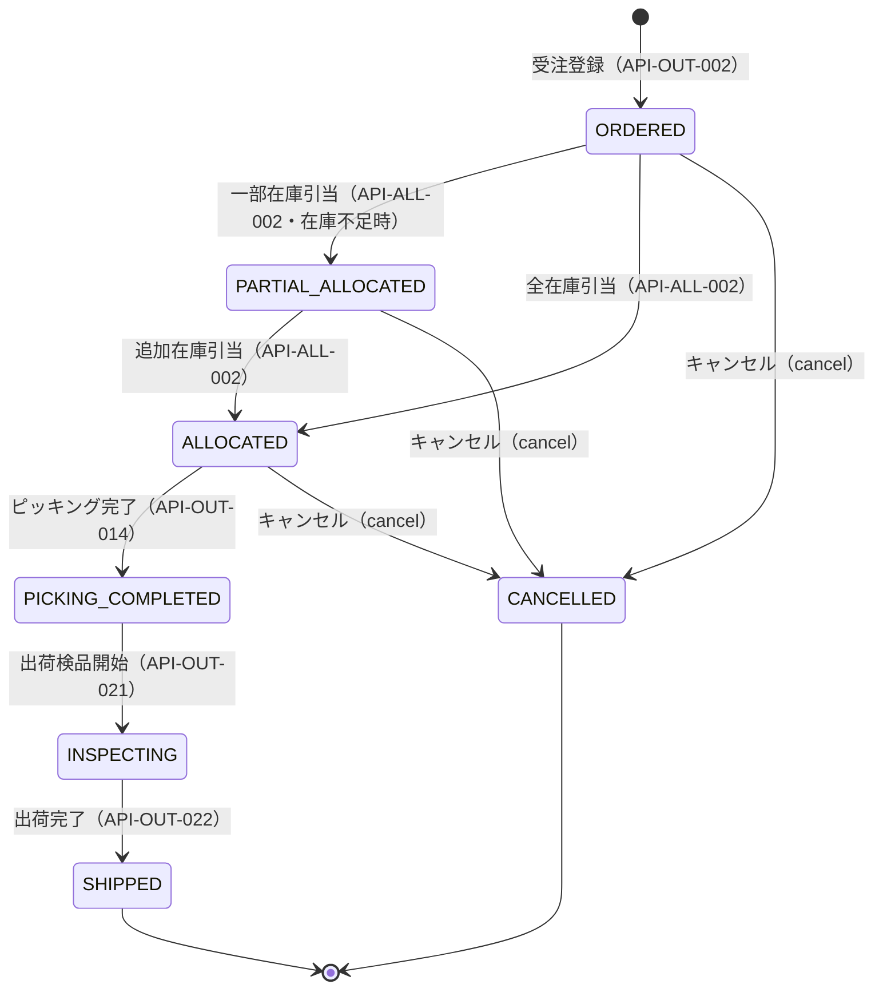

| 遷移前 | 操作 | 遷移後 | トリガーAPI |
|--------|------|--------|------------|
| `ORDERED` | 在庫引当（全量引当可） | `ALLOCATED` | `POST /api/v1/allocation/execute` |
| `ORDERED` | 在庫引当（在庫不足・一部のみ） | `PARTIAL_ALLOCATED` | `POST /api/v1/allocation/execute` |
| `PARTIAL_ALLOCATED` | 追加在庫引当（全量引当完了） | `ALLOCATED` | `POST /api/v1/allocation/execute` |
| `PARTIAL_ALLOCATED` | 追加在庫引当（まだ不足） | `PARTIAL_ALLOCATED` | `POST /api/v1/allocation/execute` |
| `ALLOCATED` | ピッキング完了登録 | `PICKING_COMPLETED` | `API-OUT-014` |
| `PICKING_COMPLETED` | 出荷検品登録 | `INSPECTING` | `API-OUT-021` |
| `INSPECTING` | 出荷完了登録 | `SHIPPED` | `API-OUT-022` |
| `ORDERED` | キャンセル | `CANCELLED` | `POST /cancel` |
| `PARTIAL_ALLOCATED` | キャンセル | `CANCELLED` | `POST /cancel` |
| `ALLOCATED` | キャンセル | `CANCELLED` | `POST /cancel` |

### ピッキング指示ステータス遷移

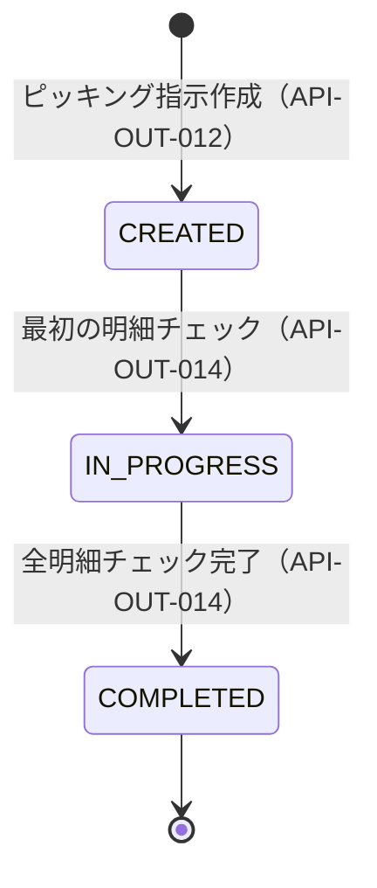

---

## API-OUT-001: 受注一覧取得

### 1. API概要

| 項目 | 内容 |
|------|------|
| **API ID** | `API-OUT-001` |
| **API名** | 受注一覧取得 |
| **メソッド** | `GET` |
| **パス** | `/api/v1/outbound/slips` |
| **認証** | 要 |
| **対象ロール** | 全ロール |
| **概要** | 出荷伝票（受注）の一覧をページング形式で取得する。倉庫ID必須。各種条件で絞り込み可能。 |
| **関連画面** | `OUT-001`（受注一覧） |

---

### 2. リクエスト仕様

#### クエリパラメータ

| パラメータ名 | 型 | 必須 | デフォルト | 説明 |
|------------|-----|:----:|----------|------|
| `warehouseId` | Long | ○ | — | 倉庫ID（必須） |
| `slipNumber` | String | — | — | 伝票番号（前方一致） |
| `plannedDateFrom` | String | — | — | 出荷予定日の開始日（`yyyy-MM-dd`） |
| `plannedDateTo` | String | — | — | 出荷予定日の終了日（`yyyy-MM-dd`） |
| `partnerId` | Long | — | — | 出荷先取引先ID |
| `status` | String[] | — | — | ステータス（複数指定可）。例: `status=ORDERED&status=ALLOCATED` |
| `page` | Integer | — | `0` | ページ番号（0始まり） |
| `size` | Integer | — | `20` | 1ページあたりの件数（上限: 100） |
| `sort` | String | — | `plannedDate,asc` | ソート指定（例: `plannedDate,desc`） |

---

### 3. レスポンス仕様

#### 成功レスポンス（200 OK）

```json
{
  "content": [
    {
      "id": 1,
      "slipNumber": "OUT-20260313-0001",
      "slipType": "NORMAL",
      "partnerName": "株式会社テスト商事",
      "plannedDate": "2026-03-20",
      "status": "ORDERED",
      "lineCount": 3,
      "createdAt": "2026-03-13T09:00:00+09:00"
    }
  ],
  "page": 0,
  "size": 20,
  "totalElements": 42,
  "totalPages": 3
}
```

**content 要素のフィールド**

| フィールド名 | 型 | 説明 |
|------------|-----|------|
| `id` | Long | 出荷伝票ID |
| `slipNumber` | String | 伝票番号 |
| `slipType` | String | 伝票種別（`NORMAL` / `WAREHOUSE_TRANSFER`） |
| `partnerName` | String | 出荷先取引先名（振替の場合はnull） |
| `plannedDate` | String | 出荷予定日（`yyyy-MM-dd`） |
| `status` | String | 受注ステータス |
| `lineCount` | Integer | 明細件数 |
| `createdAt` | String | 作成日時（ISO 8601） |

#### エラーレスポンス

| HTTPステータス | エラーコード | 説明 |
|-------------|------------|------|
| `400` | `VALIDATION_ERROR` | `warehouseId` が未指定・不正 |
| `401` | `UNAUTHORIZED` | 未認証 |
| `404` | `WAREHOUSE_NOT_FOUND` | 指定倉庫が存在しない |

---

### 4. 業務ロジック

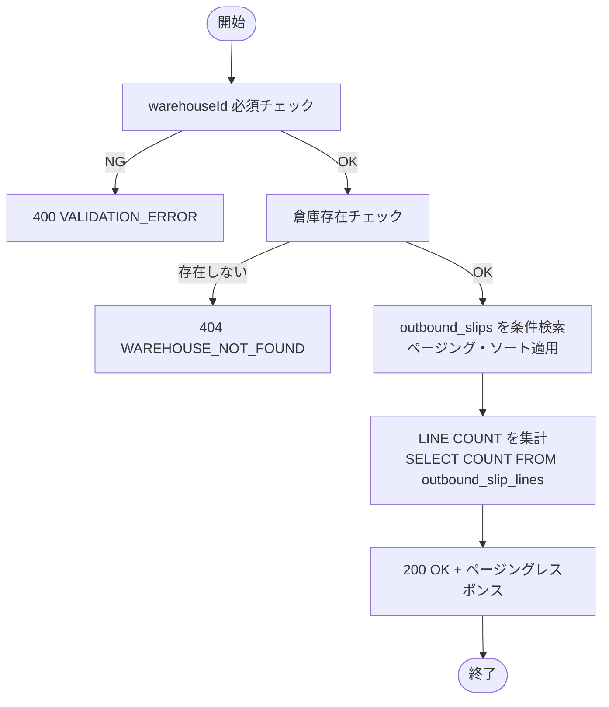

**ビジネスルール**

| # | ルール |
|---|--------|
| 1 | `warehouseId` は必須パラメータ。未指定の場合 400 を返す |
| 2 | `plannedDateFrom` と `plannedDateTo` はどちらか一方のみの指定も可（片方省略時は上限・下限なし） |
| 3 | `status` は複数指定可能（IN句で絞り込み） |
| 4 | デフォルトソートは `planned_date ASC, slip_number ASC` |

---

### 5. 補足事項

- `lineCount` はサブクエリまたはJOINで集計する。N+1問題を避けること。

---

---

## API-OUT-002: 受注登録

### 1. API概要

| 項目 | 内容 |
|------|------|
| **API ID** | `API-OUT-002` |
| **API名** | 受注登録 |
| **メソッド** | `POST` |
| **パス** | `/api/v1/outbound/slips` |
| **認証** | 要 |
| **対象ロール** | `SYSTEM_ADMIN`, `WAREHOUSE_MANAGER`, `WAREHOUSE_STAFF` |
| **概要** | 新規の出荷受注（受注伝票）を登録する。登録時のステータスは `ORDERED` 固定。伝票番号は自動採番される。 |
| **関連画面** | `OUT-002`（受注登録） |

---

### 2. リクエスト仕様

#### リクエストボディ

```json
{
  "warehouseId": 1,
  "slipType": "NORMAL",
  "partnerId": 10,
  "plannedDate": "2026-03-20",
  "note": "緊急注文",
  "lines": [
    {
      "productId": 101,
      "unitType": "CASE",
      "orderedQty": 5
    },
    {
      "productId": 102,
      "unitType": "PIECE",
      "orderedQty": 20
    }
  ]
}
```

| フィールド名 | 型 | 必須 | バリデーション | 説明 |
|------------|-----|:----:|-------------|------|
| `warehouseId` | Long | ○ | 存在する倉庫ID | 出荷元倉庫 |
| `slipType` | String | ○ | `NORMAL` / `WAREHOUSE_TRANSFER` | 伝票種別 |
| `partnerId` | Long | △ | `NORMAL` 時は必須 | 出荷先取引先ID |
| `plannedDate` | String | ○ | `yyyy-MM-dd`、現在営業日以降 | 出荷予定日 |
| `note` | String | — | 最大500文字 | 備考 |
| `lines` | Array | ○ | 1件以上 | 出荷明細 |
| `lines[].productId` | Long | ○ | 存在する商品ID | 商品 |
| `lines[].unitType` | String | ○ | `CASE` / `BALL` / `PIECE` | 数量単位 |
| `lines[].orderedQty` | Integer | ○ | 1以上999,999以下の整数 | 受注数量 |

---

### 3. レスポンス仕様

#### 成功レスポンス（201 Created）

```json
{
  "id": 1,
  "slipNumber": "OUT-20260313-0001",
  "slipType": "NORMAL",
  "warehouseId": 1,
  "warehouseCode": "WH-001",
  "warehouseName": "東京DC",
  "partnerId": 10,
  "partnerCode": "C-001",
  "partnerName": "株式会社テスト商事",
  "plannedDate": "2026-03-20",
  "status": "ORDERED",
  "note": "緊急注文",
  "lines": [
    {
      "id": 1,
      "lineNo": 1,
      "productId": 101,
      "productCode": "P-001",
      "productName": "テスト商品A",
      "unitType": "CASE",
      "orderedQty": 5,
      "shippedQty": null,
      "lineStatus": "ORDERED"
    }
  ],
  "createdAt": "2026-03-13T09:00:00+09:00",
  "updatedAt": "2026-03-13T09:00:00+09:00",
  "createdBy": 1,
  "updatedBy": 1
}
```

#### エラーレスポンス

| HTTPステータス | エラーコード | 説明 |
|-------------|------------|------|
| `400` | `VALIDATION_ERROR` | 入力値バリデーションエラー（必須項目不足・型エラー・桁数超過） |
| `404` | `WAREHOUSE_NOT_FOUND` | 倉庫が存在しない |
| `404` | `PARTNER_NOT_FOUND` | 取引先が存在しない |
| `404` | `PRODUCT_NOT_FOUND` | 商品が存在しない |
| `409` | `DUPLICATE_PRODUCT_IN_LINES` | 同一伝票内に同じ商品が複数指定されている |
| `422` | `OUTBOUND_PARTNER_REQUIRED` | `slipType=NORMAL` で出荷先IDが未指定 |
| `422` | `OUTBOUND_PARTNER_NOT_CUSTOMER` | 取引先種別が出荷先（`CUSTOMER` / `BOTH`）でない |
| `422` | `PRODUCT_INACTIVE` | 無効な商品が指定されている |
| `422` | `OUTBOUND_PRODUCT_SHIPMENT_STOPPED` | 出荷禁止フラグが立っている商品を選択した |
| `422` | `PLANNED_DATE_TOO_EARLY` | `plannedDate` が現在営業日より前 |

---

### 4. 業務ロジック

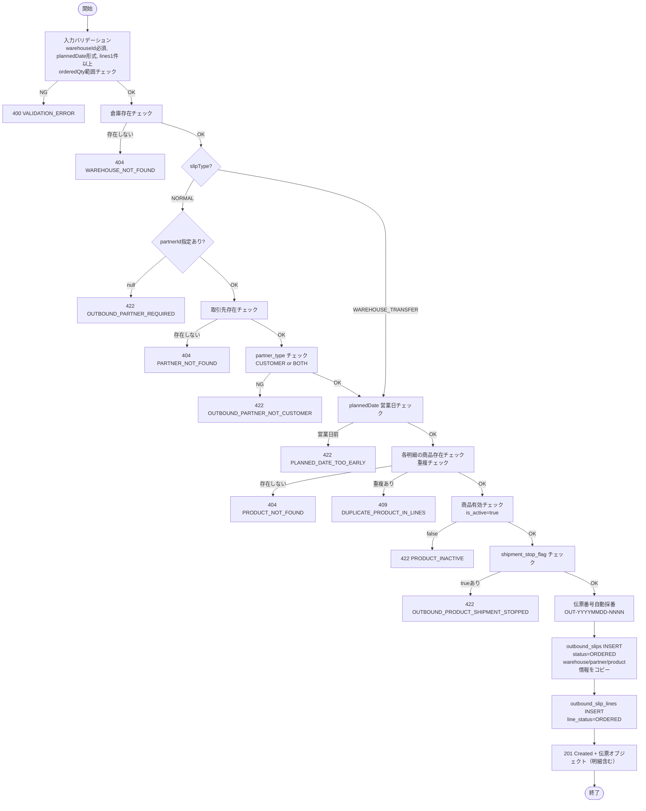

**ビジネスルール**

| # | ルール | エラーコード |
|---|--------|------------|
| 1 | `slipType=NORMAL` の場合 `partnerId` は必須 | `OUTBOUND_PARTNER_REQUIRED` |
| 2 | `partnerId` が指定された場合、`partner_type` が `CUSTOMER` または `BOTH` でなければならない | `OUTBOUND_PARTNER_NOT_CUSTOMER` |
| 3 | 商品の `is_active=false` は明細登録不可 | `PRODUCT_INACTIVE` |
| 4 | `shipment_stop_flag=true` の商品は明細に含められない | `OUTBOUND_PRODUCT_SHIPMENT_STOPPED` |
| 5 | `plannedDate` は現在営業日（`system_business_date` テーブル参照）以降でなければならない | `PLANNED_DATE_TOO_EARLY` |
| 6 | `lines` に同一 `productId` の重複は不可 | `DUPLICATE_PRODUCT_IN_LINES` |
| 7 | 伝票番号は `OUT-YYYYMMDD-NNNN`（4桁連番）形式で自動採番。`YYYYMMDD` は現在営業日（`current_business_date`）。採番はシーケンスまたはROWロックで重複排除する | — |
| 8 | `warehouse_code`, `warehouse_name`, `partner_code`, `partner_name`, `product_code`, `product_name` は登録時点の値をコピーして保持する（マスタ変更の影響を受けない） | — |

---

### 5. 補足事項

- 伝票番号採番とINSERTはひとつのトランザクションで行い、採番の重複を防ぐ。
- `plannedDate` の営業日チェックは `GET /api/v1/system/business-date` と同じ日付参照テーブルを使用する。

---

---

## API-OUT-003: 受注詳細取得

### 1. API概要

| 項目 | 内容 |
|------|------|
| **API ID** | `API-OUT-003` |
| **API名** | 受注詳細取得 |
| **メソッド** | `GET` |
| **パス** | `/api/v1/outbound/slips/{id}` |
| **認証** | 要 |
| **対象ロール** | 全ロール |
| **概要** | 出荷伝票IDを指定して受注ヘッダ・全明細を取得する。 |
| **関連画面** | `OUT-003`（受注詳細） |

---

### 2. リクエスト仕様

#### パスパラメータ

| パラメータ名 | 型 | 必須 | 説明 |
|------------|-----|:----:|------|
| `id` | Long | ○ | 出荷伝票ID |

---

### 3. レスポンス仕様

#### 成功レスポンス（200 OK）

```json
{
  "id": 1,
  "slipNumber": "OUT-20260313-0001",
  "slipType": "NORMAL",
  "transferSlipNumber": null,
  "warehouseId": 1,
  "warehouseCode": "WH-001",
  "warehouseName": "東京DC",
  "partnerId": 10,
  "partnerCode": "C-001",
  "partnerName": "株式会社テスト商事",
  "plannedDate": "2026-03-20",
  "carrier": null,
  "trackingNumber": null,
  "status": "ORDERED",
  "note": "緊急注文",
  "shippedAt": null,
  "shippedBy": null,
  "cancelledAt": null,
  "cancelledBy": null,
  "lines": [
    {
      "id": 1,
      "lineNo": 1,
      "productId": 101,
      "productCode": "P-001",
      "productName": "テスト商品A",
      "unitType": "CASE",
      "orderedQty": 5,
      "shippedQty": null,
      "lineStatus": "ORDERED"
    }
  ],
  "createdAt": "2026-03-13T09:00:00+09:00",
  "updatedAt": "2026-03-13T09:00:00+09:00",
  "createdBy": 1,
  "updatedBy": 1
}
```

#### エラーレスポンス

| HTTPステータス | エラーコード | 説明 |
|-------------|------------|------|
| `404` | `OUTBOUND_SLIP_NOT_FOUND` | 指定IDの出荷伝票が存在しない |

---

### 4. 業務ロジック

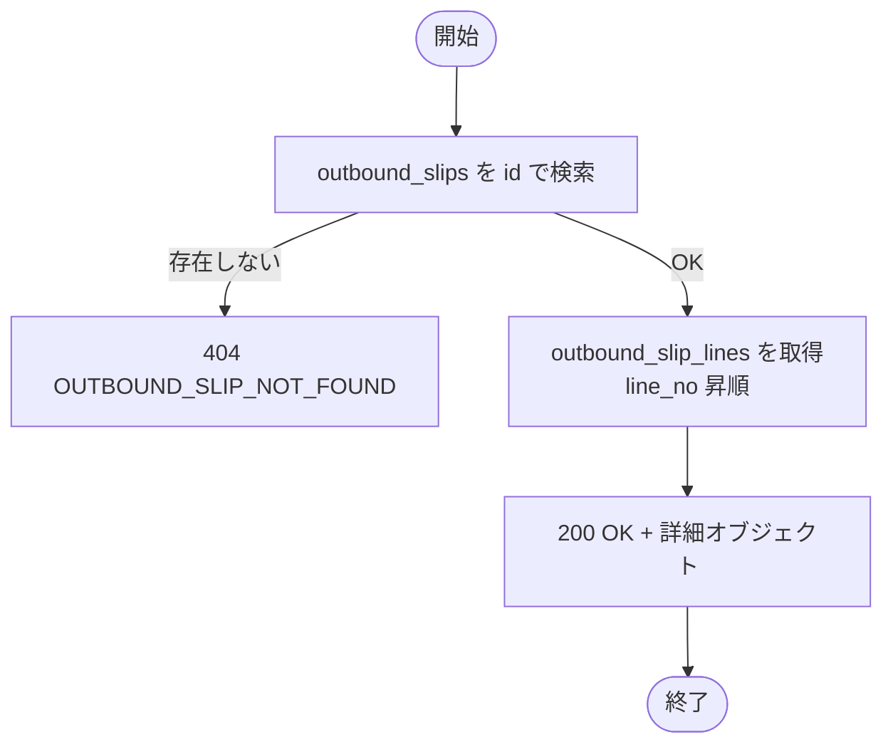

---

### 5. 補足事項

- 明細は `line_no ASC` でソートして返す。

---

---

## API-OUT-004: 受注削除

### 1. API概要

| 項目 | 内容 |
|------|------|
| **API ID** | `API-OUT-004` |
| **API名** | 受注削除 |
| **メソッド** | `DELETE` |
| **パス** | `/api/v1/outbound/slips/{id}` |
| **認証** | 要 |
| **対象ロール** | `SYSTEM_ADMIN`, `WAREHOUSE_MANAGER`, `WAREHOUSE_STAFF` |
| **概要** | `ORDERED` 状態の受注伝票を物理削除する。在庫引当済み（`PARTIAL_ALLOCATED` / `ALLOCATED` 以降）は削除不可。 |
| **関連画面** | `OUT-003`（受注詳細・削除ボタン） |

---

### 2. リクエスト仕様

#### パスパラメータ

| パラメータ名 | 型 | 必須 | 説明 |
|------------|-----|:----:|------|
| `id` | Long | ○ | 出荷伝票ID |

---

### 3. レスポンス仕様

#### 成功レスポンス

| HTTPステータス | 説明 |
|-------------|------|
| `204 No Content` | 削除成功（レスポンスボディなし） |

#### エラーレスポンス

| HTTPステータス | エラーコード | 説明 |
|-------------|------------|------|
| `404` | `OUTBOUND_SLIP_NOT_FOUND` | 指定IDの出荷伝票が存在しない |
| `409` | `OUTBOUND_INVALID_STATUS` | `ORDERED` 以外のステータスは削除不可 |

---

### 4. 業務ロジック

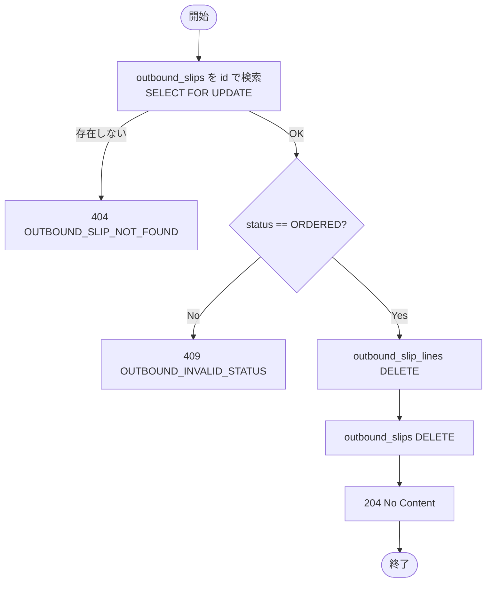

**ビジネスルール**

| # | ルール | エラーコード |
|---|--------|------------|
| 1 | 削除可能なステータスは `ORDERED` のみ。`PARTIAL_ALLOCATED` 以降はキャンセルAPIを使用すること | `OUTBOUND_INVALID_STATUS` |
| 2 | 削除は物理削除（`DELETE FROM`）。明細（`outbound_slip_lines`）も連鎖削除する | — |

---

---

> **引当機能について**: 在庫引当は `API-12-allocation.md`（`POST /api/v1/allocation/execute`）がSSOTです。個別引当・一括引当ともに引当APIを参照してください。

---

## 補助API: 受注キャンセル

### 1. API概要

| 項目 | 内容 |
|------|------|
| **API ID** | `API-OUT-005` |
| **API名** | 受注キャンセル |
| **メソッド** | `POST` |
| **パス** | `/api/v1/outbound/slips/{id}/cancel` |
| **認証** | 要 |
| **対象ロール** | `SYSTEM_ADMIN`, `WAREHOUSE_MANAGER` |
| **概要** | `ORDERED`、`PARTIAL_ALLOCATED`、または `ALLOCATED` 状態の受注をキャンセルする。引当済みの場合は引当情報も取り消す。 |
| **関連画面** | `OUT-003`（受注詳細・キャンセルボタン） |

---

### 2. リクエスト仕様

#### パスパラメータ

| パラメータ名 | 型 | 必須 | 説明 |
|------------|-----|:----:|------|
| `id` | Long | ○ | 出荷伝票ID |

#### リクエストボディ

```json
{
  "reason": "顧客都合によるキャンセル"
}
```

| フィールド名 | 型 | 必須 | バリデーション | 説明 |
|------------|-----|:----:|-------------|------|
| `reason` | String | — | 最大500文字 | キャンセル理由（任意） |

---

### 3. レスポンス仕様

#### 成功レスポンス（200 OK）

```json
{
  "id": 1,
  "slipNumber": "OUT-20260313-0001",
  "status": "CANCELLED",
  "cancelledAt": "2026-03-13T10:00:00+09:00",
  "cancelledBy": 1
}
```

#### エラーレスポンス

| HTTPステータス | エラーコード | 説明 |
|-------------|------------|------|
| `404` | `OUTBOUND_SLIP_NOT_FOUND` | 出荷伝票が存在しない |
| `409` | `OUTBOUND_INVALID_STATUS` | `PICKING_COMPLETED` 以降はキャンセル不可 |

---

### 4. 業務ロジック

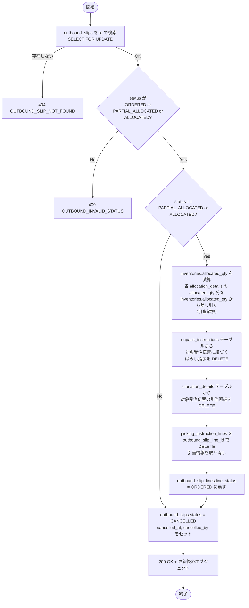

**ビジネスルール**

| # | ルール | エラーコード |
|---|--------|------------|
| 1 | キャンセル可能なステータスは `ORDERED`、`PARTIAL_ALLOCATED`、`ALLOCATED` のみ | `OUTBOUND_INVALID_STATUS` |
| 2 | `PARTIAL_ALLOCATED` または `ALLOCATED` 状態でキャンセルする場合、引当解放を同時実行する。具体的には以下の順序で処理する: (a) `inventories.allocated_qty` を各 `allocation_details.allocated_qty` 分だけ減算（引当解放）、(b) 対象受注伝票に紐づく `unpack_instructions` を DELETE、(c) 対象受注伝票の `allocation_details` を DELETE、(d) 対応する `picking_instruction_lines` を DELETE | — |
| 3 | キャンセル時は引当解放を同時実行する。引当済み在庫の `allocated_qty` を減算することで、当該在庫を他の受注への引当に再利用可能な状態に戻す | — |
| 4 | `cancelled_at`、`cancelled_by` を記録する | — |

---

---

## API-OUT-011: ピッキング指示一覧取得

### 1. API概要

| 項目 | 内容 |
|------|------|
| **API ID** | `API-OUT-011` |
| **API名** | ピッキング指示一覧取得 |
| **メソッド** | `GET` |
| **パス** | `/api/v1/outbound/picking` |
| **認証** | 要 |
| **対象ロール** | 全ロール |
| **概要** | ピッキング指示の一覧をページング形式で取得する。倉庫IDによる絞り込みが必須。 |
| **関連画面** | `OUT-011`（ピッキング指示一覧） |

---

### 2. リクエスト仕様

#### クエリパラメータ

| パラメータ名 | 型 | 必須 | デフォルト | 説明 |
|------------|-----|:----:|----------|------|
| `warehouseId` | Long | ○ | — | 倉庫ID（必須） |
| `instructionNumber` | String | — | — | 指示番号（前方一致） |
| `status` | String[] | — | — | ステータス（複数指定可）。例: `status=CREATED&status=IN_PROGRESS` |
| `createdDateFrom` | String | — | — | 作成日の開始日（`yyyy-MM-dd`） |
| `createdDateTo` | String | — | — | 作成日の終了日（`yyyy-MM-dd`） |
| `page` | Integer | — | `0` | ページ番号（0始まり） |
| `size` | Integer | — | `20` | 1ページあたりの件数（上限: 100） |
| `sort` | String | — | `createdAt,desc` | ソート指定 |

---

### 3. レスポンス仕様

#### 成功レスポンス（200 OK）

```json
{
  "content": [
    {
      "id": 50,
      "instructionNumber": "PIC-20260313-001",
      "warehouseId": 1,
      "warehouseName": "東京DC",
      "areaId": 5,
      "areaName": "A区画",
      "status": "CREATED",
      "lineCount": 10,
      "createdAt": "2026-03-13T09:00:00+09:00",
      "createdByName": "担当 太郎"
    }
  ],
  "page": 0,
  "size": 20,
  "totalElements": 5,
  "totalPages": 1
}
```

#### エラーレスポンス

| HTTPステータス | エラーコード | 説明 |
|-------------|------------|------|
| `400` | `VALIDATION_ERROR` | `warehouseId` が未指定 |
| `404` | `WAREHOUSE_NOT_FOUND` | 指定倉庫が存在しない |

---

### 4. 業務ロジック

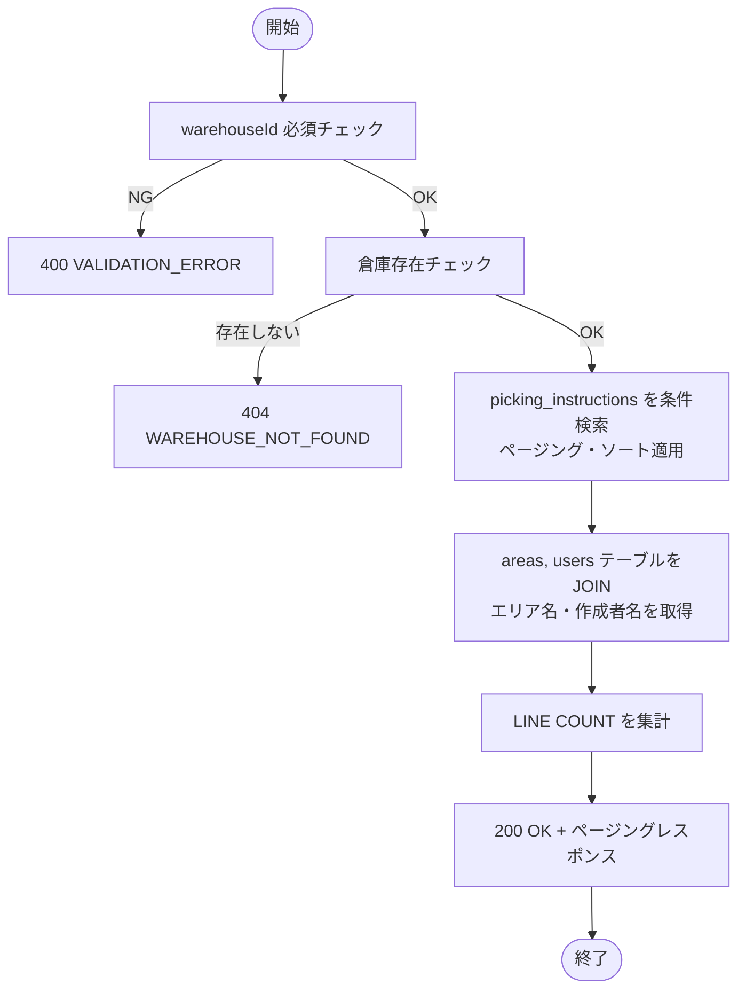

**ビジネスルール**:

| # | ルール | エラーコード |
|---|--------|------------|
| 1 | `warehouseId` は必須。未指定時は400を返す | `VALIDATION_ERROR` |
| 2 | 指定された倉庫が存在しない場合は404を返す | `WAREHOUSE_NOT_FOUND` |
| 3 | 検索結果が0件の場合は空の `content: []` を返す（エラーとしない） | — |

---

### 5. 補足事項

- **warehouseId 必須の理由**: ピッキング指示は特定倉庫に属するため、倉庫をまたいだ一覧取得は業務上不要。全件取得によるパフォーマンス劣化を防ぐためにも必須パラメータとしている。
- **lineCount**: 各ピッキング指示の明細件数。JOIN先の `picking_instruction_lines` で COUNT 集計して返す。
- **ソート**: デフォルトは `createdAt,desc`（新しい指示が先頭）。

---

---

## API-OUT-012: ピッキング指示作成

### 1. API概要

| 項目 | 内容 |
|------|------|
| **API ID** | `API-OUT-012` |
| **API名** | ピッキング指示作成 |
| **メソッド** | `POST` |
| **パス** | `/api/v1/outbound/picking` |
| **認証** | 要 |
| **対象ロール** | `SYSTEM_ADMIN`, `WAREHOUSE_MANAGER` |
| **概要** | 在庫引当済みの受注（`ALLOCATED` 状態）からピッキング指示書を作成する。複数の受注を束ねて1つのピッキング指示にまとめることができる。 |
| **関連画面** | `OUT-011`（ピッキング指示一覧・指示作成ボタン） |

---

### 2. リクエスト仕様

#### リクエストボディ

```json
{
  "slipIds": [1, 2],
  "areaId": 5
}
```

| フィールド名 | 型 | 必須 | バリデーション | 説明 |
|------------|-----|:----:|-------------|------|
| `slipIds` | Long[] | ○ | 1件以上・重複不可 | 対象の出荷伝票IDリスト。`ALLOCATED` 状態のもののみ |
| `areaId` | Long | — | 存在するエリアID | 対象エリア絞り込み（省略時は全エリア対象） |

---

### 3. レスポンス仕様

#### 成功レスポンス（201 Created）

```json
{
  "id": 50,
  "instructionNumber": "PIC-20260313-001",
  "warehouseId": 1,
  "warehouseName": "東京DC",
  "areaId": 5,
  "areaName": "A区画",
  "status": "CREATED",
  "lines": [
    {
      "id": 101,
      "lineNo": 1,
      "outboundSlipNumber": "OUT-20260313-0001",
      "outboundSlipLineId": 1,
      "locationId": 10,
      "locationCode": "A-01-01",
      "productCode": "P-001",
      "productName": "テスト商品A",
      "unitType": "CASE",
      "lotNumber": "LOT-001",
      "expiryDate": "2027-03-31",
      "qtyToPick": 5,
      "qtyPicked": null,
      "lineStatus": "PENDING"
    }
  ],
  "createdAt": "2026-03-13T09:00:00+09:00",
  "createdBy": 1
}
```

#### エラーレスポンス

| HTTPステータス | エラーコード | 説明 |
|-------------|------------|------|
| `400` | `VALIDATION_ERROR` | `slipIds` が未指定または空 |
| `404` | `OUTBOUND_SLIP_NOT_FOUND` | 指定IDの出荷伝票が存在しない |
| `404` | `AREA_NOT_FOUND` | 指定エリアが存在しない |
| `409` | `OUTBOUND_INVALID_STATUS` | `ALLOCATED` 以外の伝票が含まれている |
| `409` | `UNPACK_NOT_COMPLETED` | 未完了のばらし指示が存在するため、ピッキング指示を作成できない |

---

### 4. 業務ロジック

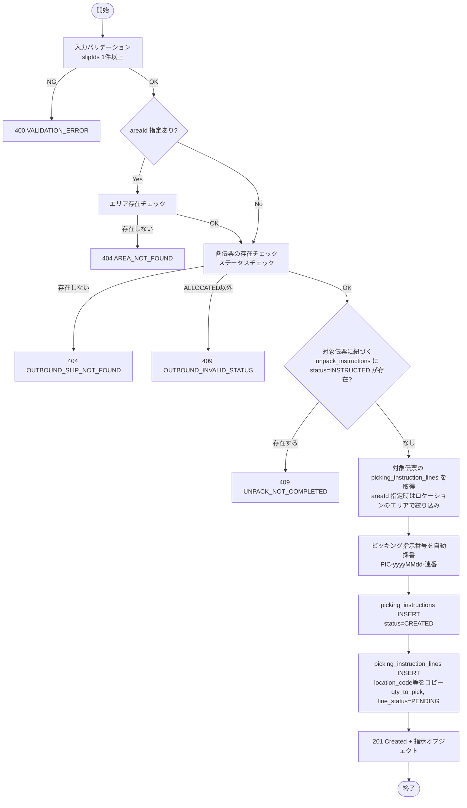

**ビジネスルール**

| # | ルール | エラーコード |
|---|--------|------------|
| 1 | `slipIds` に含まれる伝票は全て `ALLOCATED` 状態でなければならない | `OUTBOUND_INVALID_STATUS` |
| 2 | 対象受注伝票に紐づく `unpack_instructions` のうち `status = 'INSTRUCTED'`（未完了）が存在する場合はエラーとする。未完了のばらし指示が存在するため、ピッキング指示を作成できない | `UNPACK_NOT_COMPLETED` |
| 3 | ピッキング指示を作成しても受注伝票の `status` は `ALLOCATED` のまま変更しない（ピッキング指示と受注ステータスは独立管理） | — |
| 4 | `areaId` が指定された場合、対象ロケーションが当該エリアに属する引当明細のみを対象とする | — |
| 5 | 指示番号は `PIC-yyyyMMdd-NNN`（3桁連番）形式で自動採番する | — |
| 6 | `picking_instruction_lines` の `qty_to_pick` は、引当時に `inventory_allocations` テーブルに記録された `allocated_qty`（引当数量）をそのままセットする | — |

---

### 5. 補足事項

- 受注ステータス（`outbound_slips.status`）はピッキング指示作成時には変更しない。ステータスが `PICKING_COMPLETED` に遷移するのは `API-OUT-014`（ピッキング完了登録）のタイミングである。
- 1つの出荷伝票明細に対して複数のピッキング指示明細が生成される場合がある（複数ロケーション・ロットにまたがる引当の場合）。

---

---

## API-OUT-013: ピッキング指示詳細取得

### 1. API概要

| 項目 | 内容 |
|------|------|
| **API ID** | `API-OUT-013` |
| **API名** | ピッキング指示詳細取得 |
| **メソッド** | `GET` |
| **パス** | `/api/v1/outbound/picking/{id}` |
| **認証** | 要 |
| **対象ロール** | 全ロール |
| **概要** | ピッキング指示IDを指定してヘッダ・全明細を取得する。ピッキング作業者が作業内容を確認するために使用する。 |
| **関連画面** | `OUT-012`（ピッキング指示詳細） |

---

### 2. リクエスト仕様

#### パスパラメータ

| パラメータ名 | 型 | 必須 | 説明 |
|------------|-----|:----:|------|
| `id` | Long | ○ | ピッキング指示ID |

---

### 3. レスポンス仕様

#### 成功レスポンス（200 OK）

```json
{
  "id": 50,
  "instructionNumber": "PIC-20260313-001",
  "warehouseId": 1,
  "warehouseName": "東京DC",
  "areaId": 5,
  "areaName": "A区画",
  "status": "CREATED",
  "lines": [
    {
      "id": 101,
      "lineNo": 1,
      "outboundSlipNumber": "OUT-20260313-0001",
      "outboundSlipLineId": 1,
      "locationId": 10,
      "locationCode": "A-01-01",
      "productCode": "P-001",
      "productName": "テスト商品A",
      "unitType": "CASE",
      "lotNumber": "LOT-001",
      "expiryDate": "2027-03-31",
      "qtyToPick": 5,
      "qtyPicked": null,
      "lineStatus": "PENDING"
    }
  ],
  "createdAt": "2026-03-13T09:00:00+09:00",
  "createdBy": 1,
  "completedAt": null,
  "completedBy": null
}
```

#### エラーレスポンス

| HTTPステータス | エラーコード | 説明 |
|-------------|------------|------|
| `404` | `PICKING_NOT_FOUND` | 指定IDのピッキング指示が存在しない |

---

### 4. 業務ロジック

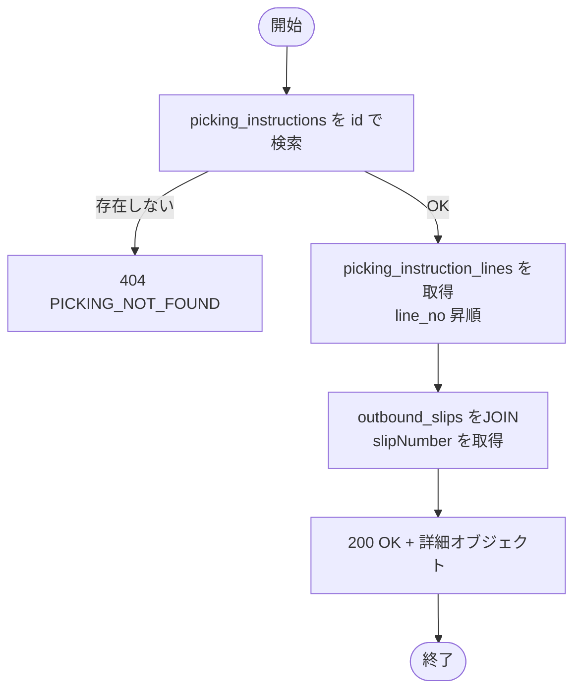

**ビジネスルール**:

| # | ルール | エラーコード |
|---|--------|------------|
| 1 | 指定IDのピッキング指示が存在しない場合は404を返す | `PICKING_NOT_FOUND` |
| 2 | 明細は `line_no` 昇順で返す | — |

---

### 5. 補足事項

- **ステータスによるアクセス制限なし**: ピッキング指示はどのステータスでも取得可能（CREATED / IN_PROGRESS / COMPLETED）。
- **createdByName**: `users` テーブルをJOINして作成者氏名を返す。
- **completedAt / completedBy**: ピッキング完了前は `null`。`API-OUT-014` 完了時に設定される。

---

---

## API-OUT-014: ピッキング完了登録

### 1. API概要

| 項目 | 内容 |
|------|------|
| **API ID** | `API-OUT-014` |
| **API名** | ピッキング完了登録 |
| **メソッド** | `PUT` |
| **パス** | `/api/v1/outbound/picking/{id}/complete` |
| **認証** | 要 |
| **対象ロール** | `SYSTEM_ADMIN`, `WAREHOUSE_MANAGER`, `WAREHOUSE_STAFF` |
| **概要** | ピッキング作業者がピッキングした数量を登録する。全明細完了時に指示ステータスを `COMPLETED` に更新し、関連する受注ステータスを `PICKING_COMPLETED` に変更する。 |
| **関連画面** | `OUT-012`（ピッキング指示詳細・完了入力） |

---

### 2. リクエスト仕様

#### パスパラメータ

| パラメータ名 | 型 | 必須 | 説明 |
|------------|-----|:----:|------|
| `id` | Long | ○ | ピッキング指示ID |

#### リクエストボディ

```json
{
  "lines": [
    { "lineId": 101, "qtyPicked": 5 },
    { "lineId": 102, "qtyPicked": 3 }
  ]
}
```

| フィールド名 | 型 | 必須 | バリデーション | 説明 |
|------------|-----|:----:|-------------|------|
| `lines` | Array | ○ | 1件以上 | ピッキング完了明細リスト |
| `lines[].lineId` | Long | ○ | 当該指示に属する明細ID | ピッキング指示明細ID |
| `lines[].qtyPicked` | Integer | ○ | 0以上 `qty_to_pick` 以下 | ピッキング完了数量（0は未ピッキングとして扱う） |

---

### 3. レスポンス仕様

#### 成功レスポンス（200 OK）

```json
{
  "id": 50,
  "instructionNumber": "PIC-20260313-001",
  "status": "COMPLETED",
  "completedAt": "2026-03-13T11:00:00+09:00",
  "completedBy": 1,
  "lines": [
    {
      "id": 101,
      "lineNo": 1,
      "qtyToPick": 5,
      "qtyPicked": 5,
      "lineStatus": "COMPLETED"
    }
  ]
}
```

#### エラーレスポンス

| HTTPステータス | エラーコード | 説明 |
|-------------|------------|------|
| `400` | `VALIDATION_ERROR` | `qtyPicked` が `qty_to_pick` を超えている等 |
| `404` | `PICKING_NOT_FOUND` | 指定IDのピッキング指示が存在しない |
| `409` | `OUTBOUND_INVALID_STATUS` | 既に `COMPLETED` 状態のピッキング指示 |

---

### 4. 業務ロジック

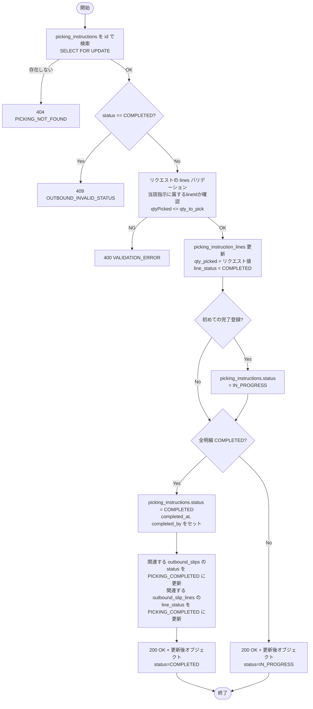

**ビジネスルール**

| # | ルール | エラーコード |
|---|--------|------------|
| 1 | リクエストの `lineId` は当該ピッキング指示に属する明細IDでなければならない | `VALIDATION_ERROR` |
| 2 | `qtyPicked` は `qty_to_pick` を超えることはできない | `VALIDATION_ERROR` |
| 3 | 最初の明細チェックが記録された時点で `picking_instructions.status` を `IN_PROGRESS` に更新する | — |
| 4 | 全明細が `COMPLETED` になった時点で `picking_instructions.status` を `COMPLETED` に更新し、`completed_at`、`completed_by` を記録する | — |
| 5 | 全明細完了時に、当該ピッキング指示に紐づく全ての `outbound_slips.status` を `PICKING_COMPLETED` に更新する | — |
| 6 | 全明細完了時に、対応する `outbound_slip_lines.line_status` を `PICKING_COMPLETED` に更新する | — |

---

### 5. 補足事項

- 1回の PUT リクエストで全明細分の完了数量をまとめて送信することも、一部の明細のみ送信することも可能。
- リクエストに含まれていない明細（`PENDING` のまま）は更新されない。
- 受注への反映（`outbound_slips.status = PICKING_COMPLETED`）は当該ピッキング指示の全明細が完了した場合のみ実施する。

---

---

## API-OUT-021: 出荷検品登録

### 1. API概要

| 項目 | 内容 |
|------|------|
| **API ID** | `API-OUT-021` |
| **API名** | 出荷検品登録 |
| **メソッド** | `POST` |
| **パス** | `/api/v1/outbound/slips/{id}/inspect` |
| **認証** | 要 |
| **対象ロール** | `SYSTEM_ADMIN`, `WAREHOUSE_MANAGER`, `WAREHOUSE_STAFF` |
| **概要** | ピッキング完了済みまたは検品中の出荷伝票（`PICKING_COMPLETED` または `INSPECTING` 状態）に対して出荷検品数量を登録し、ステータスを `INSPECTING` に更新する。 |
| **関連画面** | `OUT-004`（出荷検品） |

---

### 2. リクエスト仕様

#### パスパラメータ

| パラメータ名 | 型 | 必須 | 説明 |
|------------|-----|:----:|------|
| `id` | Long | ○ | 出荷伝票ID |

#### リクエストボディ

```json
{
  "lines": [
    { "lineId": 1, "inspectedQty": 5 },
    { "lineId": 2, "inspectedQty": 20 }
  ]
}
```

| フィールド名 | 型 | 必須 | バリデーション | 説明 |
|------------|-----|:----:|-------------|------|
| `lines` | Array | ○ | 1件以上 | 検品明細リスト |
| `lines[].lineId` | Long | ○ | 当該伝票に属する明細ID | 出荷明細ID |
| `lines[].inspectedQty` | Integer | ○ | 0以上 | 検品数量 |

---

### 3. レスポンス仕様

#### 成功レスポンス（200 OK）

```json
{
  "id": 1,
  "slipNumber": "OUT-20260313-0001",
  "status": "INSPECTING",
  "lines": [
    {
      "id": 1,
      "lineNo": 1,
      "productCode": "P-001",
      "productName": "テスト商品A",
      "unitType": "CASE",
      "orderedQty": 5,
      "inspectedQty": 5,
      "lineStatus": "PICKING_COMPLETED"
    }
  ]
}
```

#### エラーレスポンス

| HTTPステータス | エラーコード | 説明 |
|-------------|------------|------|
| `400` | `VALIDATION_ERROR` | 入力値エラー（明細ID不正等） |
| `404` | `OUTBOUND_SLIP_NOT_FOUND` | 出荷伝票が存在しない |
| `409` | `OUTBOUND_INVALID_STATUS` | `PICKING_COMPLETED` または `INSPECTING` 以外のステータスには登録不可 |

---

### 4. 業務ロジック

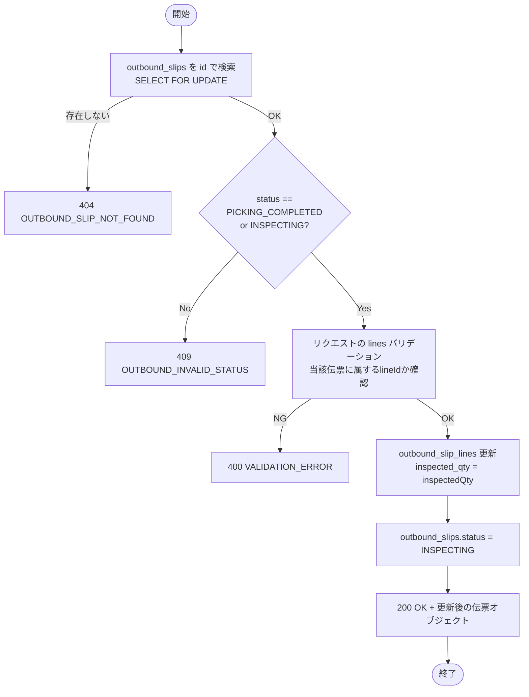

**ビジネスルール**

| # | ルール | エラーコード |
|---|--------|------------|
| 1 | `PICKING_COMPLETED` または `INSPECTING` 状態の伝票が対象 | `OUTBOUND_INVALID_STATUS` |
| 2 | 検品数量が受注数量（`ordered_qty`）と異なる場合も登録可能（差異は出荷完了時に確定する） | — |
| 3 | リクエストの `lineId` は当該伝票に属するものでなければならない | `VALIDATION_ERROR` |
| 4 | 全明細を一括で送信しなくても、部分的な検品数量入力（途中保存）が可能。未指定明細の `shipped_qty` は更新しない | — |
| 5 | `INSPECTING` ステータスの伝票に対する再入力（部分保存後の追加入力）を許可する。後続の呼び出しが既存の検品数量を上書きする | — |

---

### 5. 補足事項

- **inspectedQty の格納先**: 検品数量は `outbound_slip_lines` テーブルの `inspected_qty` カラムに記録する。`API-OUT-022`（出荷完了）時に `inspected_qty` の値を `shipped_qty`（正式な出荷数）として確定する。
- **途中保存対応**: `review-records.md` のO-5指摘事項に対応。同一伝票に対して複数回の `POST /inspect` 呼び出しが可能で、後続の呼び出しが既存の検品数量を上書きする。
- **トランザクション**: `outbound_slip_lines` の `shipped_qty` 更新と `outbound_slips.status` の `INSPECTING` 更新を1トランザクションで処理する（`@Transactional`）。

---

---

## API-OUT-022: 出荷完了登録

### 1. API概要

| 項目 | 内容 |
|------|------|
| **API ID** | `API-OUT-022` |
| **API名** | 出荷完了登録 |
| **メソッド** | `POST` |
| **パス** | `/api/v1/outbound/slips/{id}/ship` |
| **認証** | 要 |
| **対象ロール** | `SYSTEM_ADMIN`, `WAREHOUSE_MANAGER`, `WAREHOUSE_STAFF` |
| **概要** | 出荷検品済みの伝票（`INSPECTING` 状態）に対して出荷完了処理を行う。在庫の実減算・移動履歴の記録・伝票ステータス更新をトランザクションで一括処理する。 |
| **関連画面** | `OUT-004`（出荷検品・出荷完了ボタン） |

---

### 2. リクエスト仕様

#### パスパラメータ

| パラメータ名 | 型 | 必須 | 説明 |
|------------|-----|:----:|------|
| `id` | Long | ○ | 出荷伝票ID |

#### リクエストボディ

```json
{
  "carrier": "ヤマト運輸",
  "trackingNumber": "123456789012",
  "shippedDate": "2026-03-13",
  "note": ""
}
```

| フィールド名 | 型 | 必須 | バリデーション | 説明 |
|------------|-----|:----:|-------------|------|
| `carrier` | String | — | 最大100文字 | 配送業者名 |
| `trackingNumber` | String | — | 最大100文字 | 送り状番号 |
| `shippedDate` | String | ○ | `yyyy-MM-dd`、過去日不可 | 実際の出荷日 |
| `note` | String | — | 最大500文字 | 備考 |

---

### 3. レスポンス仕様

#### 成功レスポンス（200 OK）

```json
{
  "id": 1,
  "slipNumber": "OUT-20260313-0001",
  "status": "SHIPPED",
  "carrier": "ヤマト運輸",
  "trackingNumber": "123456789012",
  "shippedAt": "2026-03-13T14:00:00+09:00",
  "shippedBy": 1,
  "lines": [
    {
      "id": 1,
      "lineNo": 1,
      "productCode": "P-001",
      "productName": "テスト商品A",
      "unitType": "CASE",
      "orderedQty": 5,
      "shippedQty": 5,
      "lineStatus": "SHIPPED"
    }
  ]
}
```

#### エラーレスポンス

| HTTPステータス | エラーコード | 説明 |
|-------------|------------|------|
| `400` | `VALIDATION_ERROR` | `shippedDate` 不正等 |
| `404` | `OUTBOUND_SLIP_NOT_FOUND` | 出荷伝票が存在しない |
| `409` | `OUTBOUND_INVALID_STATUS` | `INSPECTING` 以外のステータスには登録不可 |
| `422` | `INVENTORY_INSUFFICIENT` | 在庫が不足しており在庫減算できない |

---

### 4. 業務ロジック

出荷完了時の在庫減算は最も重要なトランザクション処理であり、厳密な排他制御が必要である。

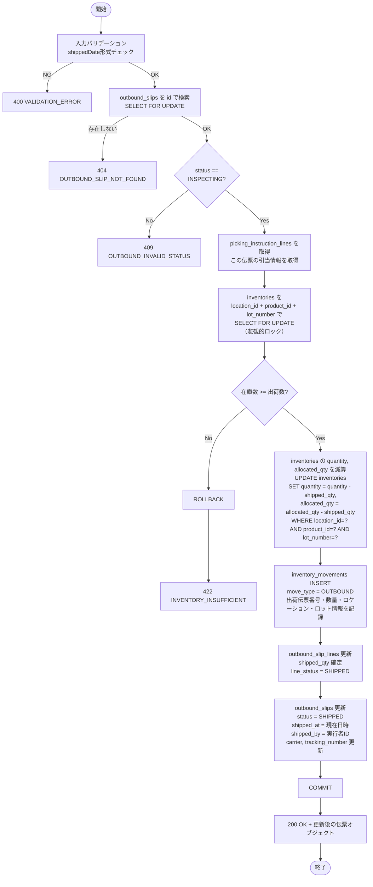

**在庫減算処理の詳細**

| ステップ | 処理内容 | SQL例 |
|---------|---------|-------|
| 1. ロック取得 | ピッキング指示明細で引当されたロケーション・商品・ロット番号の組み合わせで在庫レコードを `SELECT FOR UPDATE` | `SELECT * FROM inventories WHERE location_id=? AND product_id=? AND lot_number=? FOR UPDATE` |
| 2. 在庫チェック | 現在の `quantity` が出荷数量（`shipped_qty`）以上であることを確認 | — |
| 3. 在庫減算 | `quantity` と `allocated_qty` の両方から出荷数量を差し引く。`quantity` が 0 になった場合はレコードを削除する（または 0 のまま保持する、設計方針に従う） | `UPDATE inventories SET quantity = quantity - ?, allocated_qty = allocated_qty - ? WHERE id = ?` |
| 4. 移動履歴登録 | `inventory_movements` に `move_type=OUTBOUND` のレコードを INSERT | 出荷伝票番号・明細番号・ロケーション・商品・ロット・数量を記録 |
| 5. 伝票更新 | `outbound_slips.status = SHIPPED`、`shipped_at`、`shipped_by` を更新 | — |

**ビジネスルール**

| # | ルール | エラーコード |
|---|--------|------------|
| 1 | `INSPECTING` 状態の伝票のみ出荷完了可能 | `OUTBOUND_INVALID_STATUS` |
| 2 | 引当ロケーション・ロットの在庫が `shipped_qty` 未満の場合は 422 を返してロールバックする | `INVENTORY_INSUFFICIENT` |
| 3 | 在庫減算・移動履歴登録・ステータス更新は単一トランザクションで処理する | — |
| 4 | 在庫減算は `picking_instruction_lines` に記録された引当情報（ロケーション・ロット）に基づいて行う | — |
| 5 | `inventory_movements` に `move_type=OUTBOUND` で記録することで在庫の追跡可能性（トレーサビリティ）を担保する | — |
| 6 | `shippedDate` は当日以前の日付でなければならない（未来日不可） | `VALIDATION_ERROR` |
| 7 | `outbound_slip_lines.line_status` を `SHIPPED` に更新する | — |
| 8 | 出荷完了時は `inventories.quantity` と `inventories.allocated_qty` を同時に減算する。引当時に加算された `allocated_qty` を出荷完了で解放し、実在庫（`quantity`）も減らすことで整合性を保つ | — |

---

### 5. 補足事項

- 出荷完了処理はシステムの最重要トランザクションのひとつであり、必ずDB接続エラー時にリトライ可能な設計とすること。
- `inventory_movements` には以下の情報を記録する: `move_type=OUTBOUND`, `outbound_slip_id`, `outbound_slip_number`, `outbound_slip_line_id`, `location_id`, `location_code`, `product_id`, `product_code`, `lot_number`, `expiry_date`, `qty`, `moved_at`, `moved_by`
- 出荷数量（`shipped_qty`）は出荷検品時（`API-OUT-021`）に `outbound_slip_lines` に格納された検品数量を使用する。
- 在庫ロック取得順序はデッドロック防止のため `inventories.id` 昇順で統一すること。

---

---

## エラーコード一覧（出荷管理）

| エラーコード | HTTPステータス | 説明 | 発生API |
|-----------|-------------|------|--------|
| `OUTBOUND_SLIP_NOT_FOUND` | 404 | 出荷伝票が見つからない | OUT-003, 004, cancel, OUT-021, OUT-022 |
| `OUTBOUND_INVALID_STATUS` | 409 | 現在のステータスではその操作は不可 | OUT-004, cancel, OUT-014, OUT-021, OUT-022 |
| `OUTBOUND_PARTNER_REQUIRED` | 422 | 通常出荷で出荷先IDが未指定 | OUT-002 |
| `OUTBOUND_PARTNER_NOT_CUSTOMER` | 422 | 取引先種別が出荷先（CUSTOMER/BOTH）でない | OUT-002 |
| `PRODUCT_INACTIVE` | 422 | 無効な商品が指定されている | OUT-002 |
| `OUTBOUND_PRODUCT_SHIPMENT_STOPPED` | 422 | 出荷禁止フラグが設定された商品 | OUT-002 |
| `PLANNED_DATE_TOO_EARLY` | 422 | 出荷予定日が現在営業日より前 | OUT-002 |
| `DUPLICATE_PRODUCT_IN_LINES` | 409 | 同一伝票内に同じ商品が複数指定されている | OUT-002 |
| `PICKING_NOT_FOUND` | 404 | ピッキング指示が見つからない | OUT-013, OUT-014 |
| `UNPACK_NOT_COMPLETED` | 409 | 未完了のばらし指示が存在するためピッキング指示作成不可 | OUT-012 |
| `ALLOCATION_INSUFFICIENT` | 422 | 在庫引当に必要な在庫が不足 | API-ALL-002（引当実行） |
| `INVENTORY_INSUFFICIENT` | 422 | 出荷完了時の在庫減算で在庫不足 | OUT-022 |

---

*最終更新: 2026-03-26*
