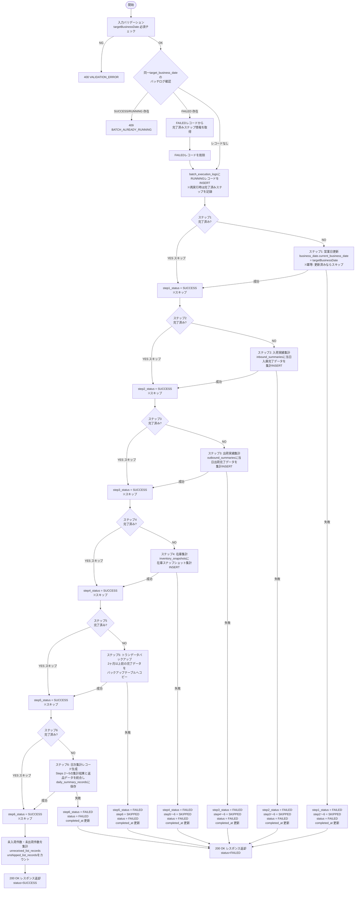
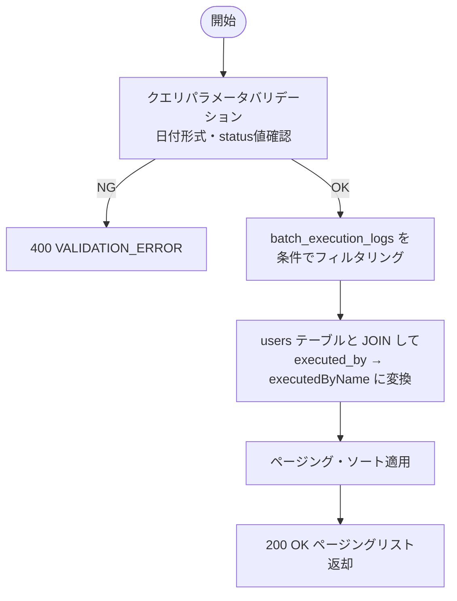
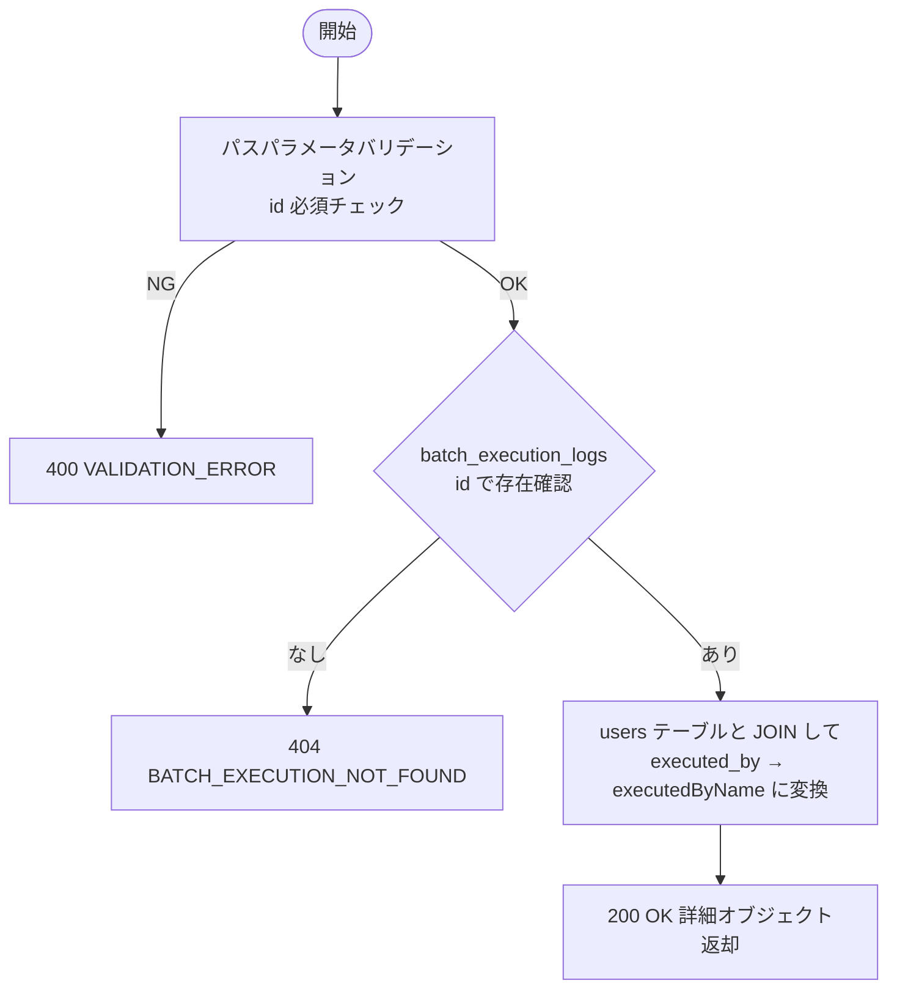

# 機能設計書 — API設計 バッチ管理（BAT）

## バッチ管理

---

### API-BAT-001 日替処理実行

#### 1. API概要

| 項目 | 内容 |
|------|------|
| **API ID** | `API-BAT-001` |
| **API名** | 日替処理実行 |
| **メソッド** | `POST` |
| **パス** | `/api/v1/batch/daily-close` |
| **認証** | 要 |
| **対象ロール** | SYSTEM_ADMIN, WAREHOUSE_MANAGER |
| **概要** | 指定した営業日に対して日替処理を実行する。営業日更新→入荷集計→出荷集計→在庫集計→トランデータバックアップ→日次集計レコード生成の6ステップを同期で順次実行し、実行結果を返す。 |
| **関連画面** | BAT-001（日替処理画面） |

---

#### 2. リクエスト仕様

##### リクエストボディ

```json
{
  "targetBusinessDate": "2026-03-14"
}
```

| フィールド名 | 型 | 必須 | バリデーション | 説明 |
|------------|-----|:----:|-------------|------|
| `targetBusinessDate` | String (date) | ○ | `yyyy-MM-dd` 形式 | 処理対象営業日 |

---

#### 3. レスポンス仕様

##### 成功レスポンス（200 OK）

```json
{
  "executionId": 45,
  "status": "SUCCESS",
  "targetBusinessDate": "2026-03-14",
  "startedAt": "2026-03-14T23:00:01+09:00",
  "completedAt": "2026-03-14T23:00:08+09:00",
  "steps": [
    { "step": 1, "name": "営業日更新",           "status": "SUCCESS" },
    { "step": 2, "name": "入荷実績集計",           "status": "SUCCESS" },
    { "step": 3, "name": "出荷実績集計",           "status": "SUCCESS" },
    { "step": 4, "name": "在庫集計",             "status": "SUCCESS" },
    { "step": 5, "name": "トランデータバックアップ", "status": "SUCCESS" },
    { "step": 6, "name": "日次集計レコード生成",     "status": "SUCCESS" }
  ],
  "unreceivedCount": 3,
  "unshippedCount": 1
}
```

失敗時（200 OK でステップ失敗が判明する場合も同形式）:

```json
{
  "executionId": 46,
  "status": "FAILED",
  "targetBusinessDate": "2026-03-15",
  "startedAt": "2026-03-15T23:00:01+09:00",
  "completedAt": "2026-03-15T23:00:04+09:00",
  "steps": [
    { "step": 1, "name": "営業日更新",           "status": "SUCCESS" },
    { "step": 2, "name": "入荷実績集計",           "status": "SUCCESS" },
    { "step": 3, "name": "出荷実績集計",           "status": "FAILED", "errorMessage": "集計クエリで例外が発生しました" },
    { "step": 4, "name": "在庫集計",             "status": "SKIPPED" },
    { "step": 5, "name": "トランデータバックアップ", "status": "SKIPPED" },
    { "step": 6, "name": "日次集計レコード生成",     "status": "SKIPPED" }
  ],
  "unreceivedCount": null,
  "unshippedCount": null
}
```

| フィールド名 | 型 | 説明 |
|------------|-----|------|
| `executionId` | Long | バッチ実行ログID（`batch_execution_logs.id`） |
| `status` | String | 全体ステータス（`SUCCESS` / `FAILED`）。本APIは同期実行のため `RUNNING` は返さない |
| `targetBusinessDate` | String (date) | 処理対象営業日 |
| `startedAt` | String (datetime) | 処理開始日時 |
| `completedAt` | String (datetime) | 処理完了日時 |
| `steps` | Array | 各ステップの実行結果 |
| `steps[].step` | Integer | ステップ番号（1〜6） |
| `steps[].name` | String | ステップ名 |
| `steps[].status` | String | ステップステータス（`SUCCESS` / `FAILED` / `SKIPPED`） |
| `steps[].errorMessage` | String | エラーメッセージ（FAILED 時のみ） |
| `unreceivedCount` | Integer | 未入荷件数（SUCCESS 時のみ。ステップ6完了後に `unreceived_list_records` から集計） |
| `unshippedCount` | Integer | 未出荷件数（SUCCESS 時のみ。ステップ6完了後に `unshipped_list_records` から集計） |

##### エラーレスポンス

| HTTPステータス | エラーコード | 発生条件 |
|-------------|------------|---------|
| `400 Bad Request` | `VALIDATION_ERROR` | `targetBusinessDate` が未指定または日付形式不正 |
| `401 Unauthorized` | `UNAUTHORIZED` | 未認証 |
| `403 Forbidden` | `FORBIDDEN` | 対象ロール以外 |
| `409 Conflict` | `BATCH_ALREADY_RUNNING` | 同一営業日に `SUCCESS` または `RUNNING` レコードが存在する |

---

#### 4. 業務ロジック



##### ビジネスルール

| # | ルール | エラーコード |
|---|--------|------------|
| 1 | 同一 `targetBusinessDate` に `status=SUCCESS` または `status=RUNNING` のレコードが存在する場合は実行不可 | `BATCH_ALREADY_RUNNING` |
| 2 | 同一 `targetBusinessDate` に `status=FAILED` のレコードが存在する場合は、そのレコードを削除して再実行可能 | — |
| 3 | 各ステップはトランザクション境界が独立しており、失敗したステップのロールバックは当該ステップのみ適用 | — |
| 4 | ステップ失敗時は後続ステップをすべて `SKIPPED` にして処理を終了する（部分実行しない） | — |
| 5 | 再実行時は完了済みステップをスキップし、未完了のステップから再開する。各ステップの完了状態は `batch_execution_logs` の `step{N}_status`（N=1〜6）で判定する | — |
| 6 | 営業日更新（ステップ1）は冪等に実行される（`current_business_date` が既に `targetBusinessDate` に更新済みの場合はスキップ） | — |

##### 各ステップの処理詳細

| ステップ | 処理内容 | 対象テーブル |
|---------|---------|------------|
| ステップ1 | `business_date` テーブルの `current_business_date` を `targetBusinessDate` に更新。`updated_at`・`updated_by` も更新 | `business_date` |
| ステップ2 | `targetBusinessDate` に `status='STORED'`（入庫完了）となった入荷伝票を集計し `inbound_summaries` へ INSERT（倉庫別に件数・明細行数・数量合計） | `inbound_slips`, `inbound_slip_lines`, `inbound_summaries` |
| ステップ3 | `targetBusinessDate` に `status='SHIPPED'`（出荷完了）となった出荷伝票を集計し `outbound_summaries` へ INSERT（倉庫別に件数・明細行数・数量合計） | `outbound_slips`, `outbound_slip_lines`, `outbound_summaries` |
| ステップ4 | `targetBusinessDate` 末時点の `inventory` テーブルの在庫残高を `inventory_snapshots` へ INSERT（倉庫・商品・荷姿別の在庫スナップショット） | `inventory`, `inventory_snapshots` |
| ステップ5 | ① 2ヶ月以上前の入荷・出荷・在庫移動等の完了済みトランデータをバックアップテーブルへコピー（本テーブルからは削除しない）。② 未入荷リスト（`unreceived_list_records`）と未出荷リスト（`unshipped_list_records`）をバッチ営業日付きで生成（06-batch-processing.md「⑤ トランデータバックアップ＋未入荷・未出荷リスト生成」に準拠） | バックアップ対象テーブル, `inbound_slips`, `unreceived_list_records`, `outbound_slips`, `unshipped_list_records` |
| ステップ6 | Steps 2〜5の集計結果と返品データを統合して `daily_summary_records` に保存 | `inbound_summaries`, `outbound_summaries`, `inventory_snapshots`, `return_slips`, `unreceived_list_records`, `unshipped_list_records`, `daily_summary_records` |

---

#### 5. 補足事項

- **同期実行**: 本APIはHTTPリクエスト内で全6ステップを同期実行する。処理時間は通常数秒〜数十秒程度を想定。
- **フロントエンドのポーリング**: フロントエンドは実行中の進捗確認のため `GET /api/v1/batch/executions/{id}` を定期ポーリング（1〜2秒間隔）して画面を更新する。`status` が `SUCCESS` または `FAILED` になったらポーリングを終了する。
- **トランザクション**: 各ステップは独立したトランザクションで実行する。`batch_execution_logs` の `step{N}_status` 更新は各ステップの直後に行い、障害時にどのステップまで完了したかを確認できるようにする。
- **UNIQUE制約**: `batch_execution_logs` テーブルには `UNIQUE(target_business_date)` 制約を持つ。FAILEDレコード削除→新規INSERTの順序で二重実行防止を担保する。

---

### API-BAT-002 バッチ実行履歴一覧取得

#### 1. API概要

| 項目 | 内容 |
|------|------|
| **API ID** | `API-BAT-002` |
| **API名** | バッチ実行履歴一覧取得 |
| **メソッド** | `GET` |
| **パス** | `/api/v1/batch/executions` |
| **認証** | 要 |
| **対象ロール** | SYSTEM_ADMIN, WAREHOUSE_MANAGER |
| **概要** | バッチ実行履歴をページング形式で返す。日付範囲・ステータス等で絞り込み可能。 |
| **関連画面** | BAT-001（日替処理画面）、BAT-002（バッチ実行履歴画面） |

---

#### 2. リクエスト仕様

##### クエリパラメータ

| パラメータ名 | 型 | 必須 | デフォルト | 説明 |
|------------|-----|:----:|----------|------|
| `executedDateFrom` | String (date) | — | — | 実行日（From） `yyyy-MM-dd` |
| `executedDateTo` | String (date) | — | — | 実行日（To） `yyyy-MM-dd` |
| `targetBusinessDate` | String (date) | — | — | 処理対象営業日 `yyyy-MM-dd` |
| `status` | String | — | — | ステータス絞り込み（`SUCCESS` / `FAILED` / `RUNNING`） |
| `page` | Integer | — | `0` | ページ番号（0始まり） |
| `size` | Integer | — | `20` | 1ページあたりの件数（上限100） |
| `sort` | String | — | `startedAt,desc` | ソート指定 |

---

#### 3. レスポンス仕様

##### 成功レスポンス（200 OK）

```json
{
  "content": [
    {
      "id": 45,
      "targetBusinessDate": "2026-03-14",
      "status": "SUCCESS",
      "step1Status": "SUCCESS",
      "step2Status": "SUCCESS",
      "step3Status": "SUCCESS",
      "step4Status": "SUCCESS",
      "step5Status": "SUCCESS",
      "step6Status": "SUCCESS",
      "errorMessage": null,
      "startedAt": "2026-03-14T23:00:01+09:00",
      "completedAt": "2026-03-14T23:00:08+09:00",
      "executedByName": "田中 太郎"
    }
  ],
  "page": 0,
  "size": 20,
  "totalElements": 45,
  "totalPages": 3
}
```

| フィールド名 | 型 | 説明 |
|------------|-----|------|
| `id` | Long | バッチ実行ログID |
| `targetBusinessDate` | String (date) | 処理対象営業日 |
| `status` | String | 全体ステータス（`SUCCESS` / `FAILED` / `RUNNING`） |
| `step1Status` 〜 `step6Status` | String | 各ステップのステータス（`SUCCESS` / `FAILED` / `SKIPPED`） |
| `errorMessage` | String | エラーメッセージ（FAILED 時のみ） |
| `startedAt` | String (datetime) | 処理開始日時 |
| `completedAt` | String (datetime) | 処理完了日時（RUNNING 中は null） |
| `executedByName` | String | 実行者氏名 |

##### エラーレスポンス

| HTTPステータス | エラーコード | 発生条件 |
|-------------|------------|---------|
| `400 Bad Request` | `VALIDATION_ERROR` | 日付形式不正、status 値不正 |
| `401 Unauthorized` | `UNAUTHORIZED` | 未認証 |
| `403 Forbidden` | `FORBIDDEN` | 対象ロール以外 |

---

#### 4. 業務ロジック



##### ビジネスルール

| # | ルール | エラーコード |
|---|--------|------------|
| 1 | `status` パラメータは `SUCCESS` / `FAILED` / `RUNNING` のいずれかのみ受け付ける。それ以外の値は 400 を返す | `VALIDATION_ERROR` |
| 2 | `executedDateFrom` / `executedDateTo` は `started_at` の日付部分で絞り込む | — |
| 3 | `RUNNING` ステータスのレコードが存在する場合、そのレコードも一覧に含める（フロントエンドのポーリング用） | — |

---

#### 5. 補足事項

- `executedDateFrom` / `executedDateTo` は `started_at` の日付部分で絞り込む。
- `RUNNING` ステータスのレコードが存在する場合、そのレコードも一覧に表示される（フロントエンドでのポーリング用）。
- 日替処理の実行頻度は1日1回程度のため、総件数は限定的。ページング上限（100件/ページ）は通常の利用で上限に達することはない。

---

### API-BAT-003 バッチ実行履歴詳細取得

#### 1. API概要

| 項目 | 内容 |
|------|------|
| **API ID** | `API-BAT-003` |
| **API名** | バッチ実行履歴詳細取得 |
| **メソッド** | `GET` |
| **パス** | `/api/v1/batch/executions/{id}` |
| **認証** | 要 |
| **対象ロール** | SYSTEM_ADMIN, WAREHOUSE_MANAGER |
| **概要** | バッチ実行履歴の詳細を1件取得する。フロントエンドが実行中の進捗ポーリングに使用する。 |

---

#### 2. リクエスト仕様

##### パスパラメータ

| パラメータ名 | 型 | 必須 | 説明 |
|------------|-----|:----:|------|
| `id` | Long | ○ | バッチ実行ログID |

---

#### 3. レスポンス仕様

##### 成功レスポンス（200 OK）

API-BAT-002 の `content` 配列の1要素と同形式のオブジェクトを返す。

##### エラーレスポンス

| HTTPステータス | エラーコード | 発生条件 |
|-------------|------------|---------|
| `401 Unauthorized` | `UNAUTHORIZED` | 未認証 |
| `403 Forbidden` | `FORBIDDEN` | 対象ロール以外 |
| `404 Not Found` | `BATCH_EXECUTION_NOT_FOUND` | 指定 ID のレコードが存在しない |

---

#### 4. 業務ロジック



##### ビジネスルール

| # | ルール | エラーコード |
|---|--------|------------|
| 1 | 指定 `id` に対応するレコードが存在しない場合は 404 を返す | `BATCH_EXECUTION_NOT_FOUND` |
| 2 | `RUNNING` 状態のレコードも取得可能（フロントエンドのポーリング用途） | — |

---

#### 5. 補足事項

- 本APIはフロントエンドが日替処理実行後に1〜2秒間隔でポーリングする用途に使用する。
- `status` が `SUCCESS` または `FAILED` になった時点でポーリングを停止することをフロントエンドに推奨する。
- 実行中（`RUNNING`）のレコードは `completedAt` が `null` となる。

---

---
