# 機能設計書 — API設計 レポート出力（RPT）

## レポート出力

---

### レポートAPI 共通仕様

#### format パラメータ

すべてのレポートAPIは `format` クエリパラメータで出力形式を切り替える。

| `format` 値 | 説明 |
|------------|------|
| `json`（デフォルト） | データ配列を JSON で返す |
| `csv` | CSV形式でファイルダウンロード |
| `pdf` | サーバーサイドでPDFをレンダリングし、`Content-Type: application/pdf` / `Content-Disposition: attachment; filename="..."` で返却する |

#### JSON レスポンス

- `Content-Type: application/json; charset=UTF-8`
- レスポンスボディはデータオブジェクトの配列（`[]`）を直接返す。
- ページングなし（全件返却）。件数が多い場合はクエリパラメータで期間等を絞ること。

#### CSV レスポンス

| ヘッダー | 値 |
|---------|-----|
| `Content-Type` | `text/csv; charset=UTF-8` |
| `Content-Disposition` | `attachment; filename="{レポート識別子}_{YYYYMMDD}.csv"` |

- 文字コード: UTF-8（BOM付き ※Excelでの文字化け防止）
- 1行目: ヘッダー行（日本語カラム名）
- 2行目以降: データ行

#### PDF レスポンス

| ヘッダー | 値 |
|---------|-----|
| `Content-Type` | `application/pdf` |
| `Content-Disposition` | `attachment; filename="{レポート識別子}_{YYYYMMDD}.pdf"` |

- HTTP 200 で返却
- レスポンスボディはバイナリPDFデータ

#### 認証・認可

全レポートAPIで共通:

- **認証**: 要
- **対象ロール**: 全ロール（SYSTEM_ADMIN / WAREHOUSE_MANAGER / WAREHOUSE_STAFF / VIEWER）

#### エラーレスポンス（全レポート共通）

| HTTPステータス | エラーコード | 発生条件 |
|-------------|------------|---------|
| `400 Bad Request` | `VALIDATION_ERROR` | 必須パラメータ未指定、日付形式不正 |
| `401 Unauthorized` | `UNAUTHORIZED` | 未認証 |
| `403 Forbidden` | `FORBIDDEN` | 権限不足 |
| `404 Not Found` | 各API参照 | 指定リソースが存在しない |

#### パフォーマンス考慮（全レポート共通）

レポートAPIはページングなしで全件返却するため、大量データ時のパフォーマンスに注意が必要:

| 対策 | 内容 |
|------|------|
| **期間絞り込み** | 検索期間を必須またはデフォルト設定して過大なデータ取得を防ぐ |
| **件数上限** | 取得件数が上限（デフォルト: 10,000件）を超えた場合は `400 VALIDATION_ERROR` を返し、絞り込み条件の追加を促す |
| **クエリ最適化** | インデックスを活用した効率的なクエリを実装する |
| **タイムアウト** | レポートクエリのタイムアウトは30秒を上限とする |

---

### API-RPT-001 入荷検品レポート

#### 1. API概要

| 項目 | 内容 |
|------|------|
| **API ID** | `API-RPT-001` |
| **API名** | 入荷検品レポート |
| **メソッド** | `GET` |
| **パス** | `/api/v1/reports/inbound-inspection` |
| **認証** | 要 |
| **対象ロール** | 全ロール（SYSTEM_ADMIN / WAREHOUSE_MANAGER / WAREHOUSE_STAFF / VIEWER） |
| **概要** | 指定した入荷伝票の検品結果レポートを出力する。予定数・検品数・差異を品目ごとに出力する。 |
| **関連画面** | INB-003（入荷検品画面） |

#### 2. リクエスト仕様

##### クエリパラメータ

| パラメータ名 | 型 | 必須 | 説明 |
|------------|-----|:----:|------|
| `slipId` | Long | ○ | 入荷伝票ID |
| `format` | String | — | `json`（デフォルト）/ `csv` / `pdf` |

#### 3. レスポンス仕様（JSON）

```json
[
  {
    "slipNumber": "INB-2026-00123",
    "supplierName": "テスト仕入先A",
    "plannedDate": "2026-03-14",
    "productCode": "P-001",
    "productName": "商品A",
    "caseQuantity": 10,
    "plannedQuantityCas": 5,
    "inspectedQuantityCas": 5,
    "diffQuantityCas": 0,
    "plannedQuantityPcs": 50,
    "inspectedQuantityPcs": 50,
    "diffQuantityPcs": 0,
    "lotNumber": "LOT-001",
    "expiryDate": "2027-03-14"
  }
]
```

| フィールド名 | 型 | 説明 |
|------------|-----|------|
| `slipNumber` | String | 入荷伝票番号 |
| `supplierName` | String | 仕入先名 |
| `plannedDate` | String (date) | 入荷予定日 |
| `productCode` | String | 商品コード |
| `productName` | String | 商品名 |
| `caseQuantity` | Integer | ケース入数 |
| `plannedQuantityCas` | Integer | 予定数（ケース） |
| `inspectedQuantityCas` | Integer | 検品数（ケース） |
| `diffQuantityCas` | Integer | 差異数（ケース）= 検品数 − 予定数 |
| `plannedQuantityPcs` | Integer | 予定数（バラ） |
| `inspectedQuantityPcs` | Integer | 検品数（バラ） |
| `diffQuantityPcs` | Integer | 差異数（バラ）= 検品数 − 予定数 |
| `lotNumber` | String | ロット番号 |
| `expiryDate` | String (date) | 期限日 |

#### 4. 業務ロジック

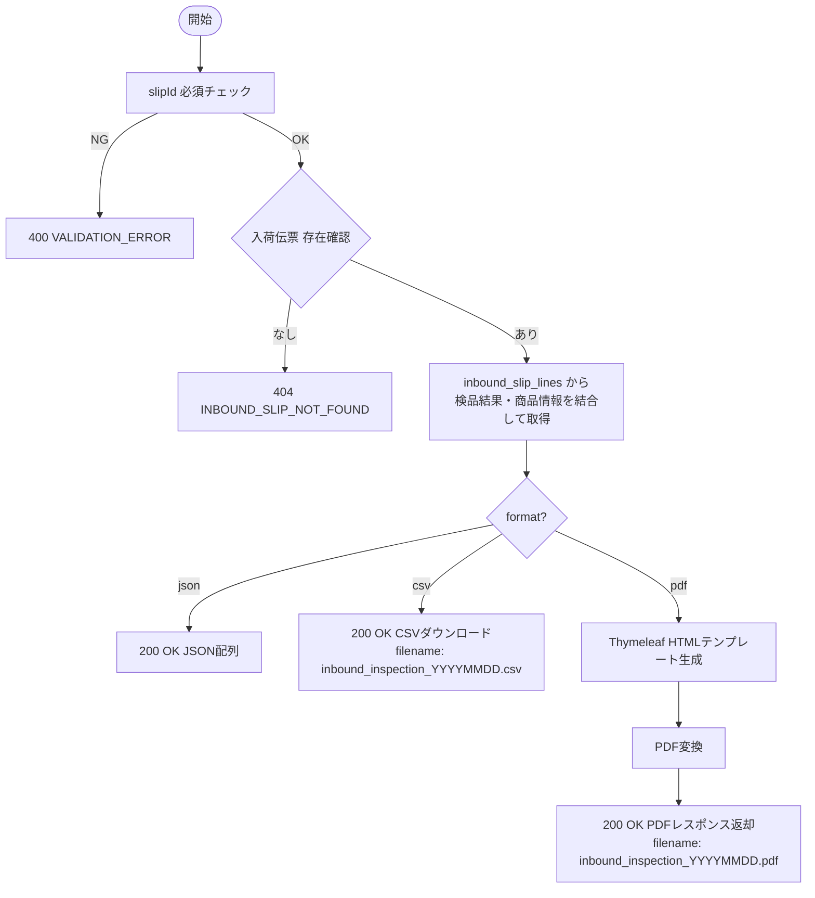
```mermaid
flowchart TD
    START([開始]) --> VALIDATE[slipId 必須チェック]
    VALIDATE -->|NG| ERR_VAL[400 VALIDATION_ERROR]
    VALIDATE -->|OK| FIND_SLIP{入荷伝票 存在確認}
    FIND_SLIP -->|なし| ERR_404[404 INBOUND_SLIP_NOT_FOUND]
    FIND_SLIP -->|あり| QUERY[inbound_slip_lines から\n検品結果・商品情報を結合して取得]
    QUERY --> FORMAT{format?}
    FORMAT -->|json| RES_JSON[200 OK JSON配列]
    FORMAT -->|csv| RES_CSV[200 OK CSVダウンロード\nfilename: inbound_inspection_YYYYMMDD.csv]
    FORMAT -->|pdf| GEN_HTML[Thymeleaf HTMLテンプレート生成] --> CONVERT_PDF[PDF変換] --> RES_PDF[200 OK PDFレスポンス返却\nfilename: inbound_inspection_YYYYMMDD.pdf]
```

**ビジネスルール**:

| # | ルール | エラーコード |
|---|--------|------------|
| 1 | `slipId` に対応する入荷伝票が存在しない場合は 404 を返す | `INBOUND_SLIP_NOT_FOUND` |

#### 5. 補足事項

- 本APIは1伝票の明細全件を返すため、ページングなし。1伝票あたりの明細数は通常数件〜数十件程度のため、パフォーマンス上の問題は発生しにくい。
- CSV出力時のファイル名: `inbound_inspection_{YYYYMMDD}.csv`（YYYYMMDD はリクエスト処理日）
- CSV出力時のヘッダー行（日本語）: `伝票番号,仕入先名,入荷予定日,商品コード,商品名,ケース入数,予定数(ケース),検品数(ケース),差異(ケース),予定数(バラ),検品数(バラ),差異(バラ),ロット番号,期限日`

---

### API-RPT-003 入荷予定レポート

#### 1. API概要

| 項目 | 内容 |
|------|------|
| **API ID** | `API-RPT-003` |
| **API名** | 入荷予定レポート |
| **メソッド** | `GET` |
| **パス** | `/api/v1/reports/inbound-plan` |
| **認証** | 要 |
| **対象ロール** | 全ロール（SYSTEM_ADMIN / WAREHOUSE_MANAGER / WAREHOUSE_STAFF / VIEWER） |
| **概要** | 指定倉庫・期間の入荷予定一覧を出力する。 |
| **関連画面** | INB-001（入荷予定一覧画面）、RPT-001（レポート画面） |

#### 2. リクエスト仕様

##### クエリパラメータ

| パラメータ名 | 型 | 必須 | デフォルト | 説明 |
|------------|-----|:----:|----------|------|
| `warehouseId` | Long | ○ | — | 倉庫ID |
| `plannedDateFrom` | String (date) | — | — | 入荷予定日（From） |
| `plannedDateTo` | String (date) | — | — | 入荷予定日（To） |
| `status` | String | — | — | ステータス絞り込み |
| `partnerId` | Long | — | — | 仕入先ID |
| `format` | String | — | `json` | `json` / `csv` / `pdf` |

#### 3. レスポンス仕様（JSON）

```json
[
  {
    "slipNumber": "INB-2026-00124",
    "supplierName": "テスト仕入先A",
    "plannedDate": "2026-03-15",
    "productCode": "P-002",
    "productName": "商品B",
    "plannedQuantityCas": 10,
    "plannedQuantityPcs": 100,
    "status": "PLANNED",
    "statusLabel": "入荷予定"
  }
]
```

| フィールド名 | 型 | 説明 |
|------------|-----|------|
| `slipNumber` | String | 入荷伝票番号 |
| `supplierName` | String | 仕入先名 |
| `plannedDate` | String (date) | 入荷予定日 |
| `productCode` | String | 商品コード |
| `productName` | String | 商品名 |
| `plannedQuantityCas` | Integer | 予定数（ケース） |
| `plannedQuantityPcs` | Integer | 予定数（バラ） |
| `status` | String | ステータスコード |
| `statusLabel` | String | ステータス表示名 |

#### 4. 業務ロジック

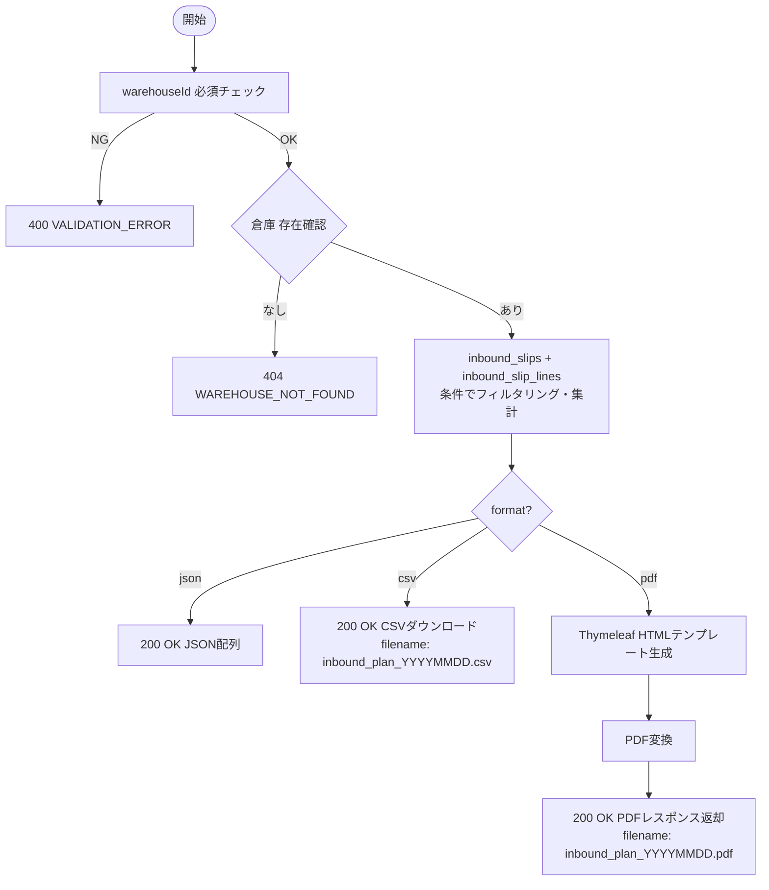
```mermaid
flowchart TD
    START([開始]) --> VALIDATE[warehouseId 必須チェック]
    VALIDATE -->|NG| ERR_VAL[400 VALIDATION_ERROR]
    VALIDATE -->|OK| FIND_WH{倉庫 存在確認}
    FIND_WH -->|なし| ERR_404[404 WAREHOUSE_NOT_FOUND]
    FIND_WH -->|あり| QUERY[inbound_slips + inbound_slip_lines\n条件でフィルタリング・集計]
    QUERY --> FORMAT{format?}
    FORMAT -->|json| RES_JSON[200 OK JSON配列]
    FORMAT -->|csv| RES_CSV[200 OK CSVダウンロード\nfilename: inbound_plan_YYYYMMDD.csv]
    FORMAT -->|pdf| GEN_HTML[Thymeleaf HTMLテンプレート生成] --> CONVERT_PDF[PDF変換] --> RES_PDF[200 OK PDFレスポンス返却\nfilename: inbound_plan_YYYYMMDD.pdf]
```

##### データ取得仕様

| 項目 | 内容 |
|------|------|
| **主テーブル** | `inbound_slips` |
| **結合** | `INNER JOIN inbound_slip_lines ON inbound_slips.id = inbound_slip_lines.inbound_slip_id` |
|  | `LEFT JOIN products ON inbound_slip_lines.product_id = products.id` |
|  | `LEFT JOIN partners ON inbound_slips.partner_id = partners.id` |
| **フィルタ条件** | `inbound_slips.warehouse_id = :warehouseId`（必須） |
|  | `inbound_slips.planned_date >= :plannedDateFrom`（任意） |
|  | `inbound_slips.planned_date <= :plannedDateTo`（任意） |
|  | `inbound_slips.partner_id = :partnerId`（任意） |
|  | `inbound_slips.status = :status`（任意） |
| **ソート順** | `inbound_slips.planned_date ASC, partners.partner_name ASC, products.product_code ASC` |

**ビジネスルール**:

| # | ルール | エラーコード |
|---|--------|------------|
| 1 | `warehouseId` に対応する倉庫が存在しない場合は 404 を返す | `WAREHOUSE_NOT_FOUND` |
| 2 | 取得件数が10,000件を超える場合は 400 を返し、期間絞り込みを促す | `VALIDATION_ERROR` |

#### 5. 補足事項

- 期間指定なしの場合は全期間が対象となるため、大量データになりやすい。`plannedDateFrom` / `plannedDateTo` で期間を絞り込むことを推奨する。
- CSV出力時のファイル名: `inbound_plan_{YYYYMMDD}.csv`
- CSV出力時のヘッダー行（日本語）: `伝票番号,仕入先名,入荷予定日,商品コード,商品名,予定数(ケース),予定数(バラ),ステータス`

---

### API-RPT-004 入庫実績レポート

#### 1. API概要

| 項目 | 内容 |
|------|------|
| **API ID** | `API-RPT-004` |
| **API名** | 入庫実績レポート |
| **メソッド** | `GET` |
| **パス** | `/api/v1/reports/inbound-result` |
| **認証** | 要 |
| **対象ロール** | 全ロール（SYSTEM_ADMIN / WAREHOUSE_MANAGER / WAREHOUSE_STAFF / VIEWER） |
| **概要** | 指定倉庫・期間の入庫実績一覧を出力する。 |
| **関連画面** | INB-006（入荷実績照会） |

#### 2. リクエスト仕様

##### クエリパラメータ

| パラメータ名 | 型 | 必須 | デフォルト | 説明 |
|------------|-----|:----:|----------|------|
| `warehouseId` | Long | ○ | — | 倉庫ID |
| `storedDateFrom` | String (date) | — | — | 入庫日（From） |
| `storedDateTo` | String (date) | — | — | 入庫日（To） |
| `partnerId` | Long | — | — | 仕入先ID |
| `format` | String | — | `json` | `json` / `csv` / `pdf` |

#### 3. レスポンス仕様（JSON）

```json
[
  {
    "slipNumber": "INB-2026-00120",
    "storedDate": "2026-03-10",
    "supplierName": "テスト仕入先A",
    "productCode": "P-001",
    "productName": "商品A",
    "plannedQuantityCas": 10,
    "inspectedQuantityCas": 10,
    "diffQuantityCas": 0,
    "storedLocationCode": "A-01-001",
    "returnQuantity": 2
  }
]
```

| フィールド名 | 型 | 説明 |
|------------|-----|------|
| `slipNumber` | String | 入荷伝票番号 |
| `storedDate` | String (date) | 入庫日 |
| `supplierName` | String | 仕入先名 |
| `productCode` | String | 商品コード |
| `productName` | String | 商品名 |
| `plannedQuantityCas` | Integer | 予定数（ケース） |
| `inspectedQuantityCas` | Integer | 検品数（ケース） |
| `diffQuantityCas` | Integer | 差異数（ケース） |
| `storedLocationCode` | String | 格納ロケーションコード |
| `returnQuantity` | Integer | 返品数量（入荷返品 `return_type='INBOUND'` のうち当該入荷伝票に紐づくもの。返品なしの場合は `null`） |

#### 4. 業務ロジック


```mermaid
flowchart TD
    START([開始]) --> VALIDATE[warehouseId 必須チェック]
    VALIDATE -->|NG| ERR_VAL[400 VALIDATION_ERROR]
    VALIDATE -->|OK| FIND_WH{倉庫 存在確認}
    FIND_WH -->|なし| ERR_404[404 WAREHOUSE_NOT_FOUND]
    FIND_WH -->|あり| QUERY[status='STORED' のデータを\nパートナー・日付でフィルタリング]
    QUERY --> FORMAT{format?}
    FORMAT -->|json| RES_JSON[200 OK JSON配列]
    FORMAT -->|csv| RES_CSV[200 OK CSVダウンロード\nfilename: inbound_result_YYYYMMDD.csv]
    FORMAT -->|pdf| GEN_HTML[Thymeleaf HTMLテンプレート生成] --> CONVERT_PDF[PDF変換] --> RES_PDF[200 OK PDFレスポンス返却\nfilename: inbound_result_YYYYMMDD.pdf]
```

##### データ取得仕様

| 項目 | 内容 |
|------|------|
| **主テーブル** | `inbound_slips` |
| **結合** | `INNER JOIN inbound_slip_lines ON inbound_slips.id = inbound_slip_lines.inbound_slip_id` |
|  | `LEFT JOIN products ON inbound_slip_lines.product_id = products.id` |
|  | `LEFT JOIN partners ON inbound_slips.partner_id = partners.id` |
|  | `LEFT JOIN locations ON inbound_slip_lines.putaway_location_id = locations.id` |
| **フィルタ条件** | `inbound_slips.warehouse_id = :warehouseId`（必須） |
|  | `inbound_slips.status = 'STORED'`（入庫完了のみ） |
|  | `DATE(inbound_slip_lines.stored_at) >= :receivedDateFrom`（任意） |
|  | `DATE(inbound_slip_lines.stored_at) <= :receivedDateTo`（任意） |
| **ソート順** | `inbound_slip_lines.stored_at DESC, inbound_slips.slip_number ASC` |

**ビジネスルール**:

| # | ルール | エラーコード |
|---|--------|------------|
| 1 | `warehouseId` に対応する倉庫が存在しない場合は 404 を返す | `WAREHOUSE_NOT_FOUND` |
| 2 | `status='STORED'`（入庫完了）のレコードのみを対象とする | — |
| 3 | 取得件数が10,000件を超える場合は 400 を返し、期間絞り込みを促す | `VALIDATION_ERROR` |

#### 5. 補足事項

- 入庫日（`storedDateFrom` / `storedDateTo`）は `inbound_slips.updated_at` の日付部分で絞り込む。
- CSV出力時のファイル名: `inbound_result_{YYYYMMDD}.csv`
- CSV出力時のヘッダー行（日本語）: `伝票番号,入庫日,仕入先名,商品コード,商品名,予定数(ケース),検品数(ケース),差異(ケース),返品数量,格納ロケーション`

---

### API-RPT-005 未入荷リスト（リアルタイム）

#### 1. API概要

| 項目 | 内容 |
|------|------|
| **API ID** | `API-RPT-005` |
| **API名** | 未入荷リスト（リアルタイム） |
| **メソッド** | `GET` |
| **パス** | `/api/v1/reports/unreceived-realtime` |
| **認証** | 要 |
| **対象ロール** | 全ロール（SYSTEM_ADMIN / WAREHOUSE_MANAGER / WAREHOUSE_STAFF / VIEWER） |
| **概要** | 指定日時点でまだ入荷していない伝票の一覧をリアルタイムで返す。集計バッチを介さずに `inbound_slips` を直接参照する。 |
| **関連画面** | RPT-001（レポート画面） |

#### 2. リクエスト仕様

##### クエリパラメータ

| パラメータ名 | 型 | 必須 | デフォルト | 説明 |
|------------|-----|:----:|----------|------|
| `warehouseId` | Long | ○ | — | 倉庫ID |
| `asOfDate` | String (date) | — | 現在の営業日 | 基準日（この日以前の予定日で未入荷のもの） |
| `format` | String | — | `json` | `json` / `csv` / `pdf` |

#### 3. レスポンス仕様（JSON）

```json
[
  {
    "slipNumber": "INB-2026-00115",
    "supplierName": "テスト仕入先B",
    "plannedDate": "2026-03-12",
    "productCode": "P-003",
    "productName": "商品C",
    "plannedQuantityCas": 5,
    "status": "INSPECTED",
    "statusLabel": "検品済",
    "delayDays": 2
  }
]
```

| フィールド名 | 型 | 説明 |
|------------|-----|------|
| `slipNumber` | String | 入荷伝票番号 |
| `supplierName` | String | 仕入先名 |
| `plannedDate` | String (date) | 入荷予定日 |
| `productCode` | String | 商品コード |
| `productName` | String | 商品名 |
| `plannedQuantityCas` | Integer | 予定数（ケース） |
| `status` | String | 現在のステータスコード |
| `statusLabel` | String | ステータス表示名 |
| `delayDays` | Integer | 遅延日数（asOfDate − plannedDate） |

#### 4. 業務ロジック

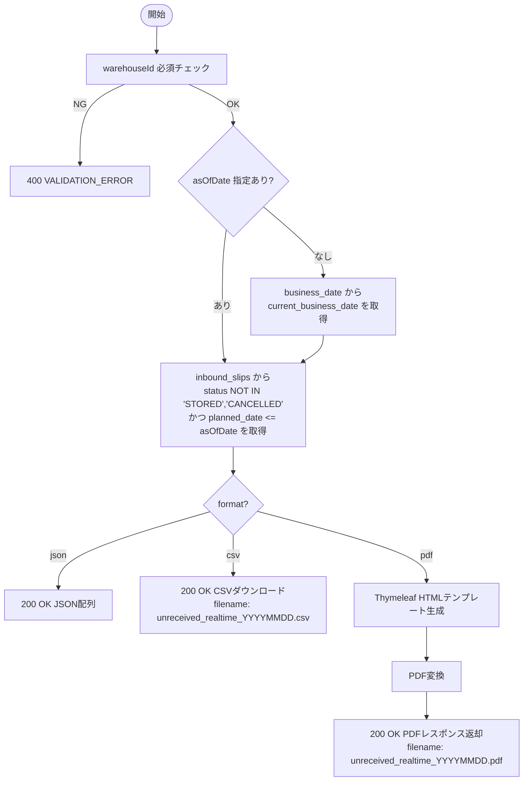
```mermaid
flowchart TD
    START([開始]) --> VALIDATE[warehouseId 必須チェック]
    VALIDATE -->|NG| ERR_VAL[400 VALIDATION_ERROR]
    VALIDATE -->|OK| DEFAULT_DATE{asOfDate 指定あり?}
    DEFAULT_DATE -->|なし| GET_BD[business_date から\ncurrent_business_date を取得]
    DEFAULT_DATE -->|あり| QUERY
    GET_BD --> QUERY[inbound_slips から\nstatus NOT IN 'STORED','CANCELLED'\nかつ planned_date <= asOfDate を取得]
    QUERY --> FORMAT{format?}
    FORMAT -->|json| RES_JSON[200 OK JSON配列]
    FORMAT -->|csv| RES_CSV[200 OK CSVダウンロード\nfilename: unreceived_realtime_YYYYMMDD.csv]
    FORMAT -->|pdf| GEN_HTML[Thymeleaf HTMLテンプレート生成] --> CONVERT_PDF[PDF変換] --> RES_PDF[200 OK PDFレスポンス返却\nfilename: unreceived_realtime_YYYYMMDD.pdf]
```

**ビジネスルール**:

| # | ルール | エラーコード |
|---|--------|------------|
| 1 | `warehouseId` に対応する倉庫が存在しない場合は 404 を返す | `WAREHOUSE_NOT_FOUND` |
| 2 | `asOfDate` が未指定の場合は現在の営業日（`business_date.current_business_date`）を使用する | — |
| 3 | `STORED`（入庫完了）・`CANCELLED`（キャンセル）のステータスは除外する | — |

#### 5. 補足事項

- 本APIはリアルタイムで `inbound_slips` テーブルを直接参照するため、最新状態を反映する。
- `asOfDate` を現在営業日と同日にすると当日業務の進捗確認に使用できる。
- 大量の未入荷が蓄積している場合は件数が多くなる可能性があるため、件数上限（10,000件）を設ける。
- CSV出力時のファイル名: `unreceived_realtime_{YYYYMMDD}.csv`
- CSV出力時のヘッダー行（日本語）: `伝票番号,仕入先名,入荷予定日,商品コード,商品名,予定数(ケース),ステータス,遅延日数`

---

### API-RPT-006 未入荷リスト（確定）

#### 1. API概要

| 項目 | 内容 |
|------|------|
| **API ID** | `API-RPT-006` |
| **API名** | 未入荷リスト（確定） |
| **メソッド** | `GET` |
| **パス** | `/api/v1/reports/unreceived-confirmed` |
| **認証** | 要 |
| **対象ロール** | 全ロール（SYSTEM_ADMIN / WAREHOUSE_MANAGER / WAREHOUSE_STAFF / VIEWER） |
| **概要** | 日替処理で確定した指定営業日の未入荷リストを返す。`unreceived_list_records` テーブルから取得するため、営業日末時点の確定データとなる。 |
| **関連画面** | RPT-001（レポート画面） |

#### 2. リクエスト仕様

##### クエリパラメータ

| パラメータ名 | 型 | 必須 | 説明 |
|------------|-----|:----:|------|
| `warehouseId` | Long | ○ | 倉庫ID |
| `batchBusinessDate` | String (date) | ○ | バッチ処理営業日（`unreceived_list_records.batch_business_date`） |
| `format` | String | — | `json`（デフォルト）/ `csv` / `pdf` |

#### 3. レスポンス仕様（JSON）

```json
[
  {
    "batchBusinessDate": "2026-03-14",
    "slipNumber": "INB-2026-00115",
    "supplierName": "テスト仕入先B",
    "plannedDate": "2026-03-12",
    "productCode": "P-003",
    "productName": "商品C",
    "plannedQuantityCas": 5,
    "statusAtBatch": "INSPECTED"
  }
]
```

| フィールド名 | 型 | 説明 |
|------------|-----|------|
| `batchBusinessDate` | String (date) | バッチ処理営業日 |
| `slipNumber` | String | 入荷伝票番号 |
| `supplierName` | String | 仕入先名 |
| `plannedDate` | String (date) | 入荷予定日 |
| `productCode` | String | 商品コード |
| `productName` | String | 商品名 |
| `plannedQuantityCas` | Integer | 予定数（ケース） |
| `statusAtBatch` | String | バッチ処理時点のステータスコード |

#### 4. 業務ロジック


```mermaid
flowchart TD
    START([開始]) --> VALIDATE[warehouseId・batchBusinessDate 必須チェック]
    VALIDATE -->|NG| ERR_VAL[400 VALIDATION_ERROR]
    VALIDATE -->|OK| QUERY[unreceived_list_records から\nbatch_business_date + warehouse_id で取得]
    QUERY --> FORMAT{format?}
    FORMAT -->|json| RES_JSON[200 OK JSON配列]
    FORMAT -->|csv| RES_CSV[200 OK CSVダウンロード\nfilename: unreceived_confirmed_YYYYMMDD.csv]
    FORMAT -->|pdf| GEN_HTML[Thymeleaf HTMLテンプレート生成] --> CONVERT_PDF[PDF変換] --> RES_PDF[200 OK PDFレスポンス返却\nfilename: unreceived_confirmed_YYYYMMDD.pdf]
```

**ビジネスルール**:

| # | ルール | エラーコード |
|---|--------|------------|
| 1 | `warehouseId` に対応する倉庫が存在しない場合は 404 を返す | `WAREHOUSE_NOT_FOUND` |
| 2 | 指定 `batchBusinessDate` の日替処理が実行されていない場合は空配列（`[]`）を返す（404 ではない） | — |

#### 5. 補足事項

- 本APIは日替処理で生成された `unreceived_list_records` テーブルの確定データを参照する。リアルタイム版（API-RPT-005）とは異なり、バッチ処理時点のスナップショットを返す。
- 指定した `batchBusinessDate` に日替処理が実行されていない場合は空配列を返す。
- `warehouseId` を受け取った場合、`warehouses` テーブルから対応する `warehouse_code` を取得し、`unreceived_list_records.warehouse_code` カラムで絞り込む（`unreceived_list_records` テーブルには `warehouse_id` カラムが存在せず `warehouse_code` カラムのみのため）。
- CSV出力時のファイル名: `unreceived_confirmed_{YYYYMMDD}.csv`
- CSV出力時のヘッダー行（日本語）: `バッチ処理営業日,伝票番号,仕入先名,入荷予定日,商品コード,商品名,予定数(ケース),バッチ時点ステータス`

---

### API-RPT-007 在庫一覧レポート

#### 1. API概要

| 項目 | 内容 |
|------|------|
| **API ID** | `API-RPT-007` |
| **API名** | 在庫一覧レポート |
| **メソッド** | `GET` |
| **パス** | `/api/v1/reports/inventory` |
| **認証** | 要 |
| **対象ロール** | 全ロール（SYSTEM_ADMIN / WAREHOUSE_MANAGER / WAREHOUSE_STAFF / VIEWER） |
| **概要** | 指定倉庫の現在在庫を一覧で出力する。ロケーション・商品・荷姿単位。 |
| **関連画面** | INV-001（在庫一覧画面）、RPT-001（レポート画面） |

#### 2. リクエスト仕様

##### クエリパラメータ

| パラメータ名 | 型 | 必須 | デフォルト | 説明 |
|------------|-----|:----:|----------|------|
| `warehouseId` | Long | ○ | — | 倉庫ID |
| `locationCodePrefix` | String | — | — | ロケーションコードの前方一致 |
| `productId` | Long | — | — | 商品ID |
| `unitType` | String | — | — | 荷姿種別（`CASE` / `BALL` / `PIECE`） |
| `storageCondition` | String | — | — | 保管条件（`AMBIENT` / `REFRIGERATED` / `FROZEN`）。商品マスタの保管条件コードに準拠 |
| `format` | String | — | `json` | `json` / `csv` / `pdf` |

#### 3. レスポンス仕様（JSON）

```json
[
  {
    "locationCode": "A-01-001",
    "buildingName": "1号棟",
    "areaName": "保管エリアA",
    "productCode": "P-001",
    "productName": "商品A",
    "unitType": "CAS",
    "quantity": 10,
    "allocatedQty": 3,
    "availableQty": 7,
    "lotNumber": "LOT-001",
    "expiryDate": "2027-03-14"
  }
]
```

| フィールド名 | 型 | 説明 |
|------------|-----|------|
| `locationCode` | String | ロケーションコード |
| `buildingName` | String | 棟名 |
| `areaName` | String | エリア名 |
| `productCode` | String | 商品コード |
| `productName` | String | 商品名 |
| `unitType` | String | 荷姿種別（`CAS` / `PCS`） |
| `quantity` | Integer | 在庫数量 |
| `allocatedQty` | Integer | 引当済数量 |
| `availableQty` | Integer | 引当可能数量（= quantity - allocatedQty） |
| `lotNumber` | String | ロット番号 |
| `expiryDate` | String (date) | 期限日 |

#### 4. 業務ロジック

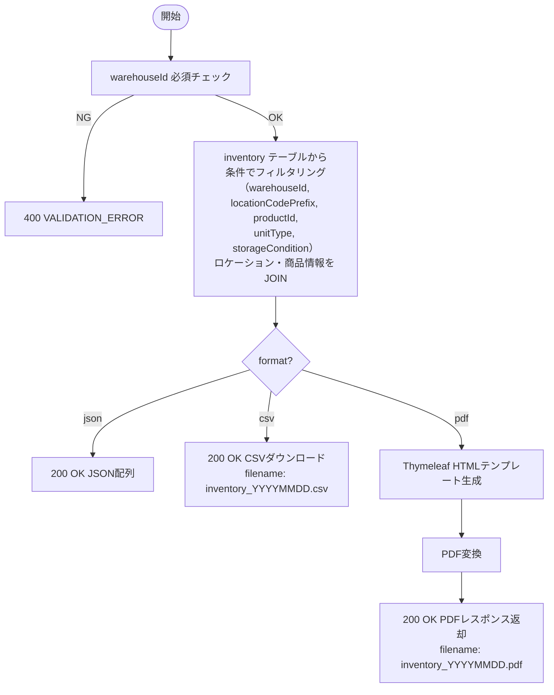
```mermaid
flowchart TD
    START([開始]) --> VALIDATE[warehouseId 必須チェック]
    VALIDATE -->|NG| ERR_VAL[400 VALIDATION_ERROR]
    VALIDATE -->|OK| QUERY[inventory テーブルから\n条件でフィルタリング\n（warehouseId, locationCodePrefix, productId,\nunitType, storageCondition）\nロケーション・商品情報を JOIN]
    QUERY --> FORMAT{format?}
    FORMAT -->|json| RES_JSON[200 OK JSON配列]
    FORMAT -->|csv| RES_CSV[200 OK CSVダウンロード\nfilename: inventory_YYYYMMDD.csv]
    FORMAT -->|pdf| GEN_HTML[Thymeleaf HTMLテンプレート生成] --> CONVERT_PDF[PDF変換] --> RES_PDF[200 OK PDFレスポンス返却\nfilename: inventory_YYYYMMDD.pdf]
```

**ビジネスルール**:

| # | ルール | エラーコード |
|---|--------|------------|
| 1 | `warehouseId` に対応する倉庫が存在しない場合は 404 を返す | `WAREHOUSE_NOT_FOUND` |
| 2 | 在庫数量が0のレコードは除外する（`quantity > 0` のみ対象） | — |
| 3 | 取得件数が10,000件を超える場合は 400 を返し、絞り込み条件の追加を促す | `VALIDATION_ERROR` |

#### 5. 補足事項

- 現時点の `inventory` テーブルをリアルタイムで参照するため、在庫操作が多い時間帯はクエリ時間が延びる可能性がある。
- ロケーションコード昇順でソートして返す。
- CSV出力時のファイル名: `inventory_{YYYYMMDD}.csv`
- CSV出力時のヘッダー行（日本語）: `ロケーションコード,棟名,エリア名,商品コード,商品名,荷姿,在庫数量,ロット番号,期限日`

---

### API-RPT-008 在庫推移レポート

#### 1. API概要

| 項目 | 内容 |
|------|------|
| **API ID** | `API-RPT-008` |
| **API名** | 在庫推移レポート |
| **メソッド** | `GET` |
| **パス** | `/api/v1/reports/inventory-transition` |
| **認証** | 要 |
| **対象ロール** | 全ロール（SYSTEM_ADMIN / WAREHOUSE_MANAGER / WAREHOUSE_STAFF / VIEWER） |
| **概要** | 指定倉庫・商品の在庫移動履歴を日付順に出力する。`inventory_movements` から集計し、入出庫・移動・訂正等の変動要因を含む。 |
| **関連画面** | INV-001（在庫一覧照会） |

#### 2. リクエスト仕様

##### クエリパラメータ

| パラメータ名 | 型 | 必須 | デフォルト | 説明 |
|------------|-----|:----:|----------|------|
| `warehouseId` | Long | ○ | — | 倉庫ID |
| `productId` | Long | ○ | — | 商品ID |
| `dateFrom` | String (date) | — | 当月1日 | 対象期間（From） |
| `dateTo` | String (date) | — | 本日 | 対象期間（To） |
| `format` | String | — | `json` | `json` / `csv` / `pdf` |

#### 3. レスポンス仕様（JSON）

```json
[
  {
    "movementDate": "2026-03-10",
    "movementType": "INBOUND",
    "movementTypeLabel": "入庫",
    "locationCode": "A-01-001",
    "unitType": "CAS",
    "quantityBefore": 5,
    "quantityChange": 10,
    "quantityAfter": 15,
    "referenceNumber": "INB-2026-00120",
    "lotNumber": "LOT-001"
  }
]
```

| フィールド名 | 型 | 説明 |
|------------|-----|------|
| `movementDate` | String (date) | 在庫変動日 |
| `movementType` | String | 変動種別コード（INBOUND / OUTBOUND / MOVE_OUT / MOVE_IN / BREAKDOWN_OUT / BREAKDOWN_IN / STOCKTAKE_ADJUSTMENT / RETURN / INBOUND_CANCEL） |
| `movementTypeLabel` | String | 変動種別表示名 |
| `locationCode` | String | ロケーションコード |
| `unitType` | String | 荷姿種別 |
| `quantityBefore` | Integer | 変動前在庫数 |
| `quantityChange` | Integer | 変動数（増加は正、減少は負） |
| `quantityAfter` | Integer | 変動後在庫数 |
| `referenceNumber` | String | 参照番号（入荷伝票番号・出荷伝票番号等） |
| `lotNumber` | String | ロット番号 |

#### 4. 業務ロジック

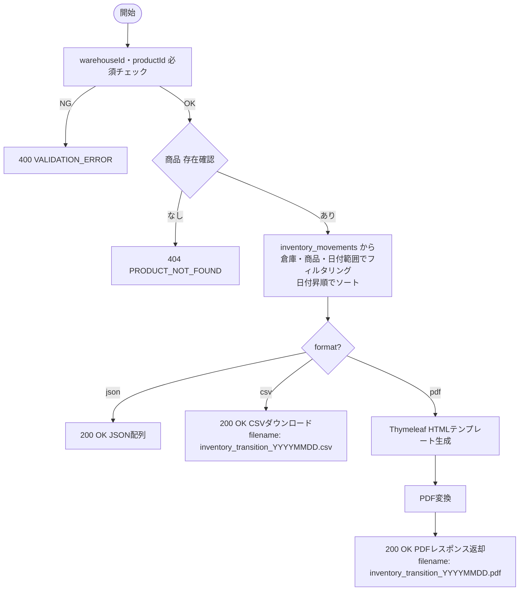
```mermaid
flowchart TD
    START([開始]) --> VALIDATE[warehouseId・productId 必須チェック]
    VALIDATE -->|NG| ERR_VAL[400 VALIDATION_ERROR]
    VALIDATE -->|OK| FIND_PRD{商品 存在確認}
    FIND_PRD -->|なし| ERR_404[404 PRODUCT_NOT_FOUND]
    FIND_PRD -->|あり| QUERY[inventory_movements から\n倉庫・商品・日付範囲でフィルタリング\n日付昇順でソート]
    QUERY --> FORMAT{format?}
    FORMAT -->|json| RES_JSON[200 OK JSON配列]
    FORMAT -->|csv| RES_CSV[200 OK CSVダウンロード\nfilename: inventory_transition_YYYYMMDD.csv]
    FORMAT -->|pdf| GEN_HTML[Thymeleaf HTMLテンプレート生成] --> CONVERT_PDF[PDF変換] --> RES_PDF[200 OK PDFレスポンス返却\nfilename: inventory_transition_YYYYMMDD.pdf]
```

##### データ取得仕様

| 項目 | 内容 |
|------|------|
| **主テーブル** | `inventory_movements` |
| **結合** | `LEFT JOIN inventories ON inventory_movements.location_id = inventories.location_id AND inventory_movements.product_id = inventories.product_id AND inventory_movements.unit_type = inventories.unit_type` |
|  | `LEFT JOIN products ON inventory_movements.product_id = products.id` |
|  | `LEFT JOIN locations ON inventory_movements.location_id = locations.id` |
| **フィルタ条件** | `inventory_movements.warehouse_id = :warehouseId`（必須） |
|  | `DATE(inventory_movements.executed_at) >= :dateFrom`（任意。デフォルト: 当月1日） |
|  | `DATE(inventory_movements.executed_at) <= :dateTo`（任意。デフォルト: 本日） |
|  | `inventory_movements.product_id = :productId`（任意） |
|  | `inventory_movements.movement_type = :movementType`（任意） |
| **ソート順** | `inventory_movements.executed_at ASC, products.product_code ASC` |
| **計算フィールド** | `quantityBefore = inventory_movements.quantity_after - inventory_movements.quantity`（移動前数量は移動後数量から変動量を逆算） |

**ビジネスルール**:

| # | ルール | エラーコード |
|---|--------|------------|
| 1 | `warehouseId` に対応する倉庫が存在しない場合は 404 を返す | `WAREHOUSE_NOT_FOUND` |
| 2 | `productId` に対応する商品が存在しない場合は 404 を返す | `PRODUCT_NOT_FOUND` |
| 3 | `dateFrom` が未指定の場合は当月1日、`dateTo` が未指定の場合は本日（営業日）をデフォルトとする | — |
| 4 | 取得件数が10,000件を超える場合は 400 を返し、期間絞り込みを促す | `VALIDATION_ERROR` |

#### 5. 補足事項

- `unitType` の表示変換仕様: DB値 `CASE`/`BALL`/`PIECE` → 「ケース」/「ボール」/「バラ」（日本語表示はフロント側で変換）
- 在庫移動履歴が多い商品（入出庫頻度が高い）は期間を短く絞り込むことを推奨する。
- 古いデータはバックアップテーブルに移行されている可能性があるため、2ヶ月以上前のデータは参照できない場合がある（バックアップ対象は完了済みデータのみ）。
- CSV出力時のファイル名: `inventory_transition_{YYYYMMDD}.csv`
- CSV出力時のヘッダー行（日本語）: `変動日,変動種別,ロケーションコード,荷姿,変動前数量,変動数,変動後数量,参照番号,ロット番号`

---

### API-RPT-009 在庫訂正一覧

#### 1. API概要

| 項目 | 内容 |
|------|------|
| **API ID** | `API-RPT-009` |
| **API名** | 在庫訂正一覧 |
| **メソッド** | `GET` |
| **パス** | `/api/v1/reports/inventory-correction` |
| **認証** | 要 |
| **対象ロール** | 全ロール（SYSTEM_ADMIN / WAREHOUSE_MANAGER / WAREHOUSE_STAFF / VIEWER） |
| **概要** | 指定倉庫・期間の在庫訂正履歴一覧を出力する。`inventory_movements` テーブルから `movement_type = 'CORRECTION'` のレコードを抽出する。 |
| **関連画面** | INV-003（在庫訂正画面）、RPT-001（レポート画面） |

#### 2. リクエスト仕様

##### クエリパラメータ

| パラメータ名 | 型 | 必須 | デフォルト | 説明 |
|------------|-----|:----:|----------|------|
| `warehouseId` | Long | ○ | — | 倉庫ID |
| `correctionDateFrom` | String (date) | — | 当月1日 | 訂正日（From） |
| `correctionDateTo` | String (date) | — | 本日 | 訂正日（To） |
| `format` | String | — | `json` | `json` / `csv` / `pdf` |

#### 3. レスポンス仕様（JSON）

```json
[
  {
    "correctionDate": "2026-03-10",
    "locationCode": "A-01-001",
    "productCode": "P-001",
    "productName": "商品A",
    "unitType": "CAS",
    "quantityBefore": 10,
    "quantityAfter": 9,
    "quantityChange": -1,
    "reason": "棚卸差異調整",
    "operatorName": "田中 太郎"
  }
]
```

| フィールド名 | 型 | 説明 |
|------------|-----|------|
| `correctionDate` | String (date) | 訂正日 |
| `locationCode` | String | ロケーションコード |
| `productCode` | String | 商品コード |
| `productName` | String | 商品名 |
| `unitType` | String | 荷姿種別 |
| `quantityBefore` | Integer | 訂正前数量 |
| `quantityAfter` | Integer | 訂正後数量 |
| `quantityChange` | Integer | 変動数（訂正後 − 訂正前） |
| `reason` | String | 訂正理由 |
| `operatorName` | String | 実施者氏名 |

#### 4. 業務ロジック

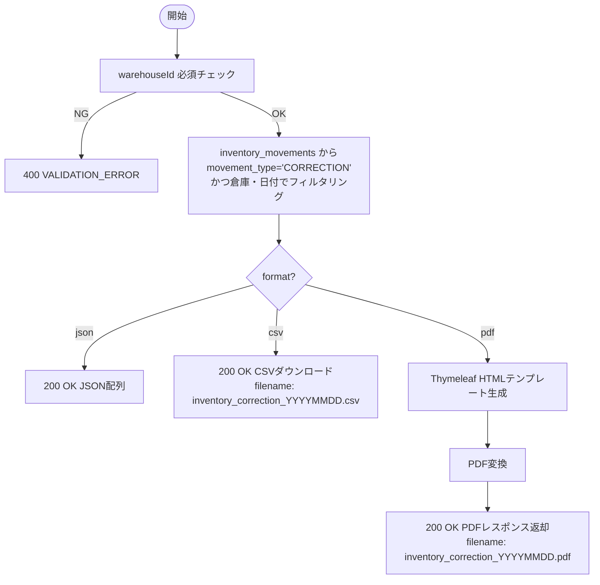
```mermaid
flowchart TD
    START([開始]) --> VALIDATE[warehouseId 必須チェック]
    VALIDATE -->|NG| ERR_VAL[400 VALIDATION_ERROR]
    VALIDATE -->|OK| QUERY[inventory_movements から\nmovement_type='CORRECTION'\nかつ倉庫・日付でフィルタリング]
    QUERY --> FORMAT{format?}
    FORMAT -->|json| RES_JSON[200 OK JSON配列]
    FORMAT -->|csv| RES_CSV[200 OK CSVダウンロード\nfilename: inventory_correction_YYYYMMDD.csv]
    FORMAT -->|pdf| GEN_HTML[Thymeleaf HTMLテンプレート生成] --> CONVERT_PDF[PDF変換] --> RES_PDF[200 OK PDFレスポンス返却\nfilename: inventory_correction_YYYYMMDD.pdf]
```

##### データ取得仕様

| 項目 | 内容 |
|------|------|
| **主テーブル** | `inventory_movements` |
| **結合** | `LEFT JOIN inventories ON inventory_movements.location_id = inventories.location_id AND inventory_movements.product_id = inventories.product_id AND inventory_movements.unit_type = inventories.unit_type` |
|  | `LEFT JOIN products ON inventory_movements.product_id = products.id` |
|  | `LEFT JOIN locations ON inventory_movements.location_id = locations.id` |
| **フィルタ条件** | `inventory_movements.movement_type = 'STOCKTAKE_ADJUSTMENT'`（固定） |
|  | `inventory_movements.warehouse_id = :warehouseId`（必須） |
|  | `DATE(inventory_movements.executed_at) >= :dateFrom`（任意。デフォルト: 当月1日） |
|  | `DATE(inventory_movements.executed_at) <= :dateTo`（任意。デフォルト: 本日） |
|  | `inventory_movements.product_id = :productId`（任意） |
| **ソート順** | `inventory_movements.executed_at DESC, products.product_code ASC` |
| **計算フィールド** | `quantityBefore = inventory_movements.quantity_after - inventory_movements.quantity`（移動前数量は移動後数量から変動量を逆算） |

**ビジネスルール**:

| # | ルール | エラーコード |
|---|--------|------------|
| 1 | `warehouseId` に対応する倉庫が存在しない場合は 404 を返す | `WAREHOUSE_NOT_FOUND` |
| 2 | `movement_type = 'STOCKTAKE_ADJUSTMENT'` のレコードのみを対象とする | — |
| 3 | 取得件数が10,000件を超える場合は 400 を返し、期間絞り込みを促す | `VALIDATION_ERROR` |

#### 5. 補足事項

- 在庫訂正は通常少頻度の操作のため、大量データになることは少ない。
- 訂正日は `inventory_movements.executed_at` の日付部分で絞り込む。
- CSV出力時のファイル名: `inventory_correction_{YYYYMMDD}.csv`
- CSV出力時のヘッダー行（日本語）: `訂正日,ロケーションコード,商品コード,商品名,荷姿,訂正前数量,訂正後数量,変動数,訂正理由,実施者`

---

### API-RPT-010 棚卸リスト

#### 1. API概要

| 項目 | 内容 |
|------|------|
| **API ID** | `API-RPT-010` |
| **API名** | 棚卸リスト |
| **メソッド** | `GET` |
| **パス** | `/api/v1/reports/stocktake-list` |
| **認証** | 要 |
| **対象ロール** | 全ロール（SYSTEM_ADMIN / WAREHOUSE_MANAGER / WAREHOUSE_STAFF / VIEWER） |
| **概要** | 棚卸作業用のリストを出力する。棚卸ID指定時は棚卸対象の在庫データを、buildingId+areaId指定時は棚卸開始前プレビューとして現在在庫を出力する。実数入力欄は空欄。 |
| **関連画面** | INV-012（棚卸新規作成）、INV-013（棚卸カウント入力） |

#### 2. リクエスト仕様

##### クエリパラメータ

| パラメータ名 | 型 | 必須 | 説明 |
|------------|-----|:----:|------|
| `stocktakeId` | Long | ※1 | 棚卸ID（棚卸開始後） |
| `buildingId` | Long | ※1 | 棟ID（プレビュー用） |
| `areaId` | Long | — | エリアID（プレビュー用・絞り込み） |
| `format` | String | — | `json`（デフォルト）/ `csv` / `pdf` |
| `hideBookQty` | Boolean | — | false | `true`の場合、PDF出力時に帳簿数量カラムを非表示にする（カウント作業の先入観防止） |

> ※1: `stocktakeId` または `buildingId` のどちらか一方が必須

#### 3. レスポンス仕様（JSON）

```json
[
  {
    "locationCode": "A-01-001",
    "areaName": "保管エリアA",
    "productCode": "P-001",
    "productName": "商品A",
    "unitType": "CAS",
    "systemQuantity": 10,
    "actualQuantity": null,
    "lotNumber": "LOT-001",
    "expiryDate": "2027-03-14"
  }
]
```

| フィールド名 | 型 | 説明 |
|------------|-----|------|
| `locationCode` | String | ロケーションコード |
| `areaName` | String | エリア名 |
| `productCode` | String | 商品コード |
| `productName` | String | 商品名 |
| `unitType` | String | 荷姿種別 |
| `systemQuantity` | Integer | システム在庫数（棚卸前） |
| `actualQuantity` | Integer | 実数（null = 未入力） |
| `lotNumber` | String | ロット番号 |
| `expiryDate` | String (date) | 期限日 |

#### 4. 業務ロジック

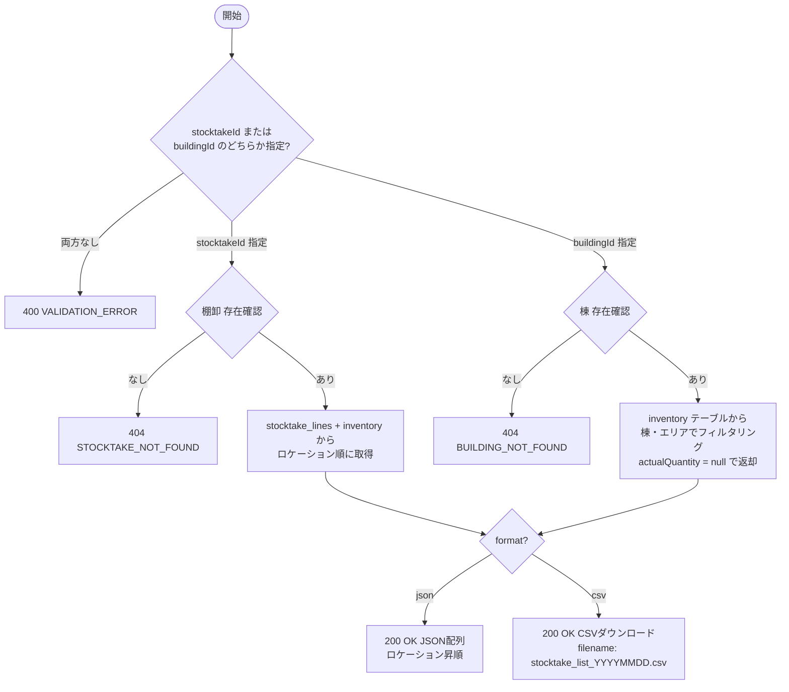
```mermaid
flowchart TD
    START([開始]) --> VALIDATE{stocktakeId または\nbuildingId のどちらか指定?}
    VALIDATE -->|両方なし| ERR_VAL[400 VALIDATION_ERROR]
    VALIDATE -->|stocktakeId 指定| FIND_STK{棚卸 存在確認}
    VALIDATE -->|buildingId 指定| FIND_BLD{棟 存在確認}

    FIND_STK -->|なし| ERR_STK[404 STOCKTAKE_NOT_FOUND]
    FIND_STK -->|あり| QUERY_STK[stocktake_lines + inventory から\nロケーション順に取得]

    FIND_BLD -->|なし| ERR_BLD[404 BUILDING_NOT_FOUND]
    FIND_BLD -->|あり| QUERY_BLD[inventory テーブルから\n棟・エリアでフィルタリング\nactualQuantity = null で返却]

    QUERY_STK --> FORMAT{format?}
    QUERY_BLD --> FORMAT
    FORMAT -->|json| RES_JSON[200 OK JSON配列\nロケーション昇順]
    FORMAT -->|csv| RES_CSV[200 OK CSVダウンロード\nfilename: stocktake_list_YYYYMMDD.csv]
```

**ビジネスルール**:

| # | ルール | エラーコード |
|---|--------|------------|
| 1 | `stocktakeId` と `buildingId` の両方が未指定の場合は 400 を返す | `VALIDATION_ERROR` |
| 2 | `stocktakeId` 指定時に棚卸が存在しない場合は 404 を返す | `STOCKTAKE_NOT_FOUND` |
| 3 | `buildingId` 指定時に棟が存在しない場合は 404 を返す | `BUILDING_NOT_FOUND` |
| 4 | 結果はロケーションコード昇順でソートして返す（現場でのピッキング動線に合わせる） | — |

#### 5. 補足事項

- **棚卸開始後（`stocktakeId` 指定）**: `stocktake_lines` から棚卸対象の在庫情報を取得する。既に実数入力済みのデータは `actualQuantity` に値が入る。
- **棚卸開始前プレビュー（`buildingId` 指定）**: `inventory` テーブルから現在在庫を取得し、`actualQuantity = null`（空欄）で返す。棚卸作業帳票の印刷に使用する。
- CSV出力時のファイル名: `stocktake_list_{YYYYMMDD}.csv`
- CSV出力時のヘッダー行（日本語）: `ロケーションコード,エリア名,商品コード,商品名,荷姿,システム在庫数,実数,ロット番号,期限日`

---

### API-RPT-011 棚卸結果レポート

#### 1. API概要

| 項目 | 内容 |
|------|------|
| **API ID** | `API-RPT-011` |
| **API名** | 棚卸結果レポート |
| **メソッド** | `GET` |
| **パス** | `/api/v1/reports/stocktake-result` |
| **認証** | 要 |
| **対象ロール** | 全ロール（SYSTEM_ADMIN / WAREHOUSE_MANAGER / WAREHOUSE_STAFF / VIEWER） |
| **概要** | 棚卸確定後の結果レポートを出力する。棚卸前在庫・実数・差異数・差異率を出力する。 |
| **関連画面** | INV-014（棚卸確定） |

#### 2. リクエスト仕様

##### クエリパラメータ

| パラメータ名 | 型 | 必須 | 説明 |
|------------|-----|:----:|------|
| `stocktakeId` | Long | ○ | 棚卸ID |
| `format` | String | — | `json`（デフォルト）/ `csv` / `pdf` |

#### 3. レスポンス仕様（JSON）

```json
[
  {
    "locationCode": "A-01-001",
    "productCode": "P-001",
    "productName": "商品A",
    "unitType": "CAS",
    "systemQuantity": 10,
    "actualQuantity": 9,
    "diffQuantity": -1,
    "diffRate": -10.0,
    "lotNumber": "LOT-001"
  }
]
```

| フィールド名 | 型 | 説明 |
|------------|-----|------|
| `locationCode` | String | ロケーションコード |
| `productCode` | String | 商品コード |
| `productName` | String | 商品名 |
| `unitType` | String | 荷姿種別 |
| `systemQuantity` | Integer | システム在庫数（棚卸前） |
| `actualQuantity` | Integer | 実数 |
| `diffQuantity` | Integer | 差異数 = 実数 − システム在庫数 |
| `diffRate` | Double | 差異率（%）= 差異数 / システム在庫数 × 100（システム在庫数=0の場合は null） |
| `lotNumber` | String | ロット番号 |

#### 4. 業務ロジック

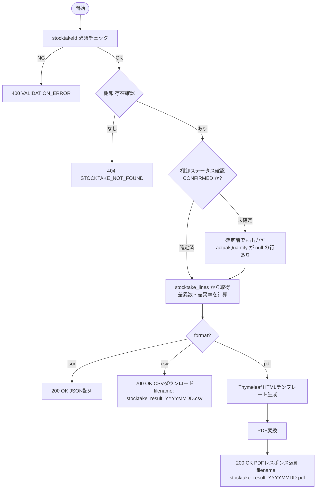
```mermaid
flowchart TD
    START([開始]) --> VALIDATE[stocktakeId 必須チェック]
    VALIDATE -->|NG| ERR_VAL[400 VALIDATION_ERROR]
    VALIDATE -->|OK| FIND_STK{棚卸 存在確認}
    FIND_STK -->|なし| ERR_404[404 STOCKTAKE_NOT_FOUND]
    FIND_STK -->|あり| CHECK_STATUS{棚卸ステータス確認\nCONFIRMED か?}
    CHECK_STATUS -->|未確定| WARN[確定前でも出力可\nactualQuantity が null の行あり]
    CHECK_STATUS -->|確定済| QUERY
    WARN --> QUERY[stocktake_lines から取得\n差異数・差異率を計算]
    QUERY --> FORMAT{format?}
    FORMAT -->|json| RES_JSON[200 OK JSON配列]
    FORMAT -->|csv| RES_CSV[200 OK CSVダウンロード\nfilename: stocktake_result_YYYYMMDD.csv]
    FORMAT -->|pdf| GEN_HTML[Thymeleaf HTMLテンプレート生成] --> CONVERT_PDF[PDF変換] --> RES_PDF[200 OK PDFレスポンス返却\nfilename: stocktake_result_YYYYMMDD.pdf]
```

**ビジネスルール**:

| # | ルール | エラーコード |
|---|--------|------------|
| 1 | `stocktakeId` に対応する棚卸が存在しない場合は 404 を返す | `STOCKTAKE_NOT_FOUND` |
| 2 | システム在庫数が0の場合、差異率は null を返す（ゼロ除算回避） | — |
| 3 | 棚卸確定前でも出力可能（未入力行は `actualQuantity = null`） | — |

#### 5. 補足事項

- 差異がある明細（`diffQuantity != 0`）を識別しやすくするため、CSV出力時は差異フラグ列を追加することを検討できる。
- 棚卸確定（`CONFIRMED`）後に出力することを推奨するが、確定前でも出力可能とする。
- CSV出力時のファイル名: `stocktake_result_{YYYYMMDD}.csv`
- CSV出力時のヘッダー行（日本語）: `ロケーションコード,商品コード,商品名,荷姿,システム在庫数,実数,差異数,差異率(%),ロット番号`

---

### API-RPT-012 ピッキング指示書

#### 1. API概要

| 項目 | 内容 |
|------|------|
| **API ID** | `API-RPT-012` |
| **API名** | ピッキング指示書 |
| **メソッド** | `GET` |
| **パス** | `/api/v1/reports/picking-instruction` |
| **認証** | 要 |
| **対象ロール** | 全ロール（SYSTEM_ADMIN / WAREHOUSE_MANAGER / WAREHOUSE_STAFF / VIEWER） |
| **概要** | 指定ピッキング指示のピッキング指示書を出力する。ロケーション順に商品・数量・受注番号を出力する。 |
| **関連画面** | OUT-011（ピッキングリスト）、OUT-013（ピッキング完了） |

#### 2. リクエスト仕様

##### クエリパラメータ

| パラメータ名 | 型 | 必須 | 説明 |
|------------|-----|:----:|------|
| `pickingInstructionId` | Long | ○ | ピッキング指示ID |
| `format` | String | — | `json`（デフォルト）/ `csv` / `pdf` |

#### 3. レスポンス仕様（JSON）

```json
[
  {
    "locationCode": "A-01-001",
    "productCode": "P-001",
    "productName": "商品A",
    "unitType": "CAS",
    "instructedQuantity": 3,
    "outboundSlipNumber": "OUT-2026-00050",
    "customerName": "テスト出荷先A",
    "plannedShipDate": "2026-03-15",
    "lotNumber": "LOT-001"
  }
]
```

| フィールド名 | 型 | 説明 |
|------------|-----|------|
| `locationCode` | String | ロケーションコード |
| `productCode` | String | 商品コード |
| `productName` | String | 商品名 |
| `unitType` | String | 荷姿種別 |
| `instructedQuantity` | Integer | ピッキング指示数量 |
| `outboundSlipNumber` | String | 対応出荷伝票番号 |
| `customerName` | String | 出荷先名 |
| `plannedShipDate` | String (date) | 出荷予定日 |
| `lotNumber` | String | ロット番号 |

#### 4. 業務ロジック

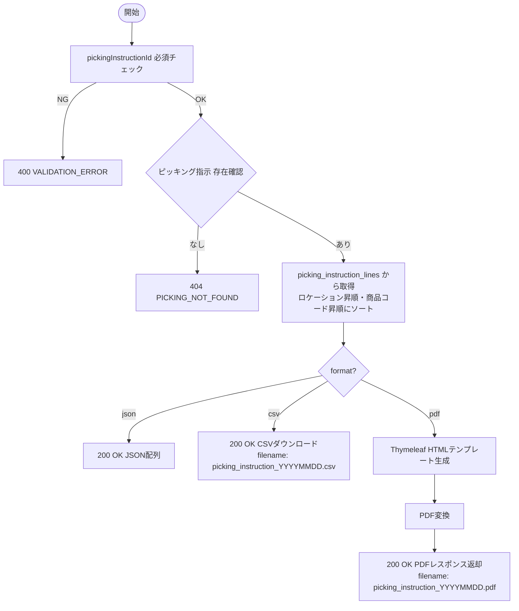
```mermaid
flowchart TD
    START([開始]) --> VALIDATE[pickingInstructionId 必須チェック]
    VALIDATE -->|NG| ERR_VAL[400 VALIDATION_ERROR]
    VALIDATE -->|OK| FIND_PICK{ピッキング指示 存在確認}
    FIND_PICK -->|なし| ERR_404[404 PICKING_NOT_FOUND]
    FIND_PICK -->|あり| QUERY[picking_instruction_lines から取得\nロケーション昇順・商品コード昇順にソート]
    QUERY --> FORMAT{format?}
    FORMAT -->|json| RES_JSON[200 OK JSON配列]
    FORMAT -->|csv| RES_CSV[200 OK CSVダウンロード\nfilename: picking_instruction_YYYYMMDD.csv]
    FORMAT -->|pdf| GEN_HTML[Thymeleaf HTMLテンプレート生成] --> CONVERT_PDF[PDF変換] --> RES_PDF[200 OK PDFレスポンス返却\nfilename: picking_instruction_YYYYMMDD.pdf]
```

**ビジネスルール**:

| # | ルール | エラーコード |
|---|--------|------------|
| 1 | `pickingInstructionId` に対応するピッキング指示が存在しない場合は 404 を返す | `PICKING_NOT_FOUND` |
| 2 | 結果はロケーションコード昇順、商品コード昇順でソートして返す（効率的なピッキング動線を実現） | — |

#### 5. 補足事項

- ピッキング指示書は現場スタッフが携行して使用する作業帳票。ロケーション昇順ソートにより動線を最適化する。
- 1ピッキング指示あたりの明細数は通常数件〜数十件のため、ページングなしでも問題ない。
- CSV出力時のファイル名: `picking_instruction_{YYYYMMDD}.csv`
- CSV出力時のヘッダー行（日本語）: `ロケーションコード,商品コード,商品名,荷姿,指示数量,出荷伝票番号,出荷先名,出荷予定日,ロット番号`

---

### API-RPT-013 出荷検品レポート

#### 1. API概要

| 項目 | 内容 |
|------|------|
| **API ID** | `API-RPT-013` |
| **API名** | 出荷検品レポート |
| **メソッド** | `GET` |
| **パス** | `/api/v1/reports/shipping-inspection` |
| **認証** | 要 |
| **対象ロール** | 全ロール（SYSTEM_ADMIN / WAREHOUSE_MANAGER / WAREHOUSE_STAFF / VIEWER） |
| **概要** | 指定出荷伝票の出荷検品結果レポートを出力する。ピッキング数・検品数・差異を品目ごとに出力する。 |
| **関連画面** | OUT-021（出荷検品） |

#### 2. リクエスト仕様

##### クエリパラメータ

| パラメータ名 | 型 | 必須 | 説明 |
|------------|-----|:----:|------|
| `slipId` | Long | ○ | 出荷伝票ID |
| `format` | String | — | `json`（デフォルト）/ `csv` / `pdf` |

#### 3. レスポンス仕様（JSON）

```json
[
  {
    "slipNumber": "OUT-2026-00050",
    "customerName": "テスト出荷先A",
    "plannedShipDate": "2026-03-15",
    "productCode": "P-001",
    "productName": "商品A",
    "unitType": "CASE",
    "pickedQuantity": 3,
    "inspectedQuantity": 3,
    "diffQuantity": 0
  }
]
```

| フィールド名 | 型 | 説明 |
|------------|-----|------|
| `slipNumber` | String | 出荷伝票番号 |
| `customerName` | String | 出荷先名 |
| `plannedShipDate` | String (date) | 出荷予定日 |
| `productCode` | String | 商品コード |
| `productName` | String | 商品名 |
| `unitType` | String | 荷姿種別 |
| `pickedQuantity` | Integer | ピッキング数量 |
| `inspectedQuantity` | Integer | 検品数量 |
| `diffQuantity` | Integer | 差異数 = 検品数 − ピッキング数 |

#### 4. 業務ロジック

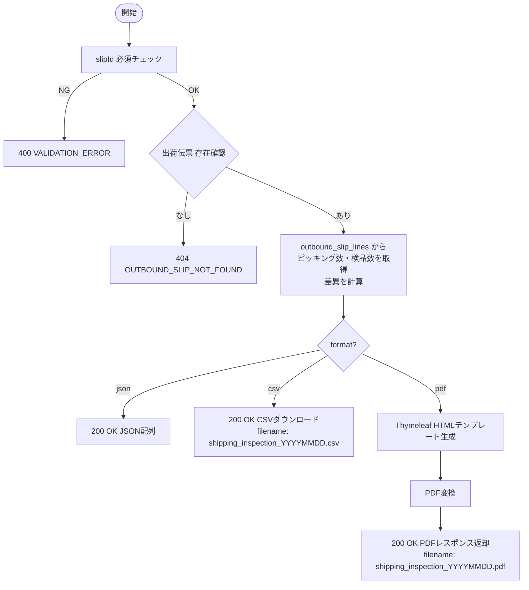
```mermaid
flowchart TD
    START([開始]) --> VALIDATE[slipId 必須チェック]
    VALIDATE -->|NG| ERR_VAL[400 VALIDATION_ERROR]
    VALIDATE -->|OK| FIND_SLIP{出荷伝票 存在確認}
    FIND_SLIP -->|なし| ERR_404[404 OUTBOUND_SLIP_NOT_FOUND]
    FIND_SLIP -->|あり| QUERY[outbound_slip_lines から\nピッキング数・検品数を取得\n差異を計算]
    QUERY --> FORMAT{format?}
    FORMAT -->|json| RES_JSON[200 OK JSON配列]
    FORMAT -->|csv| RES_CSV[200 OK CSVダウンロード\nfilename: shipping_inspection_YYYYMMDD.csv]
    FORMAT -->|pdf| GEN_HTML[Thymeleaf HTMLテンプレート生成] --> CONVERT_PDF[PDF変換] --> RES_PDF[200 OK PDFレスポンス返却\nfilename: shipping_inspection_YYYYMMDD.pdf]
```

**ビジネスルール**:

| # | ルール | エラーコード |
|---|--------|------------|
| 1 | `slipId` に対応する出荷伝票が存在しない場合は 404 を返す | `OUTBOUND_SLIP_NOT_FOUND` |

#### 5. 補足事項

- 本APIは1出荷伝票の明細全件を返すため、ページングなし。1伝票あたりの明細数は通常数件〜数十件のため問題ない。
- CSV出力時のファイル名: `shipping_inspection_{YYYYMMDD}.csv`
- CSV出力時のヘッダー行（日本語）: `伝票番号,出荷先名,出荷予定日,商品コード,商品名,荷姿,ピッキング数,検品数,差異数`

---

### API-RPT-014 配送リスト

#### 1. API概要

| 項目 | 内容 |
|------|------|
| **API ID** | `API-RPT-014` |
| **API名** | 配送リスト |
| **メソッド** | `GET` |
| **パス** | `/api/v1/reports/delivery-list` |
| **認証** | 要 |
| **対象ロール** | 全ロール（SYSTEM_ADMIN / WAREHOUSE_MANAGER / WAREHOUSE_STAFF / VIEWER） |
| **概要** | 指定倉庫・期間の出荷予定リストを配送用に出力する。 |
| **関連画面** | OUT-001（受注一覧画面）、RPT-001（レポート画面） |

#### 2. リクエスト仕様

##### クエリパラメータ

| パラメータ名 | 型 | 必須 | デフォルト | 説明 |
|------------|-----|:----:|----------|------|
| `warehouseId` | Long | ○ | — | 倉庫ID |
| `plannedDateFrom` | String (date) | — | — | 出荷予定日（From） |
| `plannedDateTo` | String (date) | — | — | 出荷予定日（To） |
| `status` | String | — | — | ステータス絞り込み |
| `carrier` | String | — | — | 配送業者名で絞り込み（部分一致） |
| `format` | String | — | `json` | `json` / `csv` / `pdf` |

#### 3. レスポンス仕様（JSON）

```json
[
  {
    "slipNumber": "OUT-2026-00050",
    "customerName": "テスト出荷先A",
    "deliveryAddress": "東京都千代田区1-1-1",
    "plannedShipDate": "2026-03-15",
    "status": "ALLOCATED",
    "statusLabel": "引当完了",
    "carrier": "ヤマト運輸",
    "trackingNumber": "1234567890",
    "totalQuantityCas": 5,
    "totalQuantityPcs": 50,
    "lines": [
      {
        "productCode": "P-001",
        "productName": "商品A（テスト用）",
        "unitType": "CS",
        "quantity": 3
      },
      {
        "productCode": "P-002",
        "productName": "商品B（サンプル品）",
        "unitType": "pcs",
        "quantity": 20
      }
    ]
  }
]
```

| フィールド名 | 型 | 説明 |
|------------|-----|------|
| `slipNumber` | String | 出荷伝票番号 |
| `customerName` | String | 出荷先名 |
| `deliveryAddress` | String | 配送先住所 |
| `plannedShipDate` | String (date) | 出荷予定日 |
| `status` | String | ステータスコード |
| `statusLabel` | String | ステータス表示名 |
| `carrier` | String | 配送業者名（null = 未設定） |
| `trackingNumber` | String | 送り状番号（null = 未設定） |
| `totalQuantityCas` | Integer | 合計数量（ケース） |
| `totalQuantityPcs` | Integer | 合計数量（バラ） |
| `lines` | Array | 商品明細行の配列 |
| `lines[].productCode` | String | 商品コード |
| `lines[].productName` | String | 商品名 |
| `lines[].unitType` | String | 荷姿（CS / pcs 等） |
| `lines[].quantity` | Integer | 数量 |

#### 4. 業務ロジック

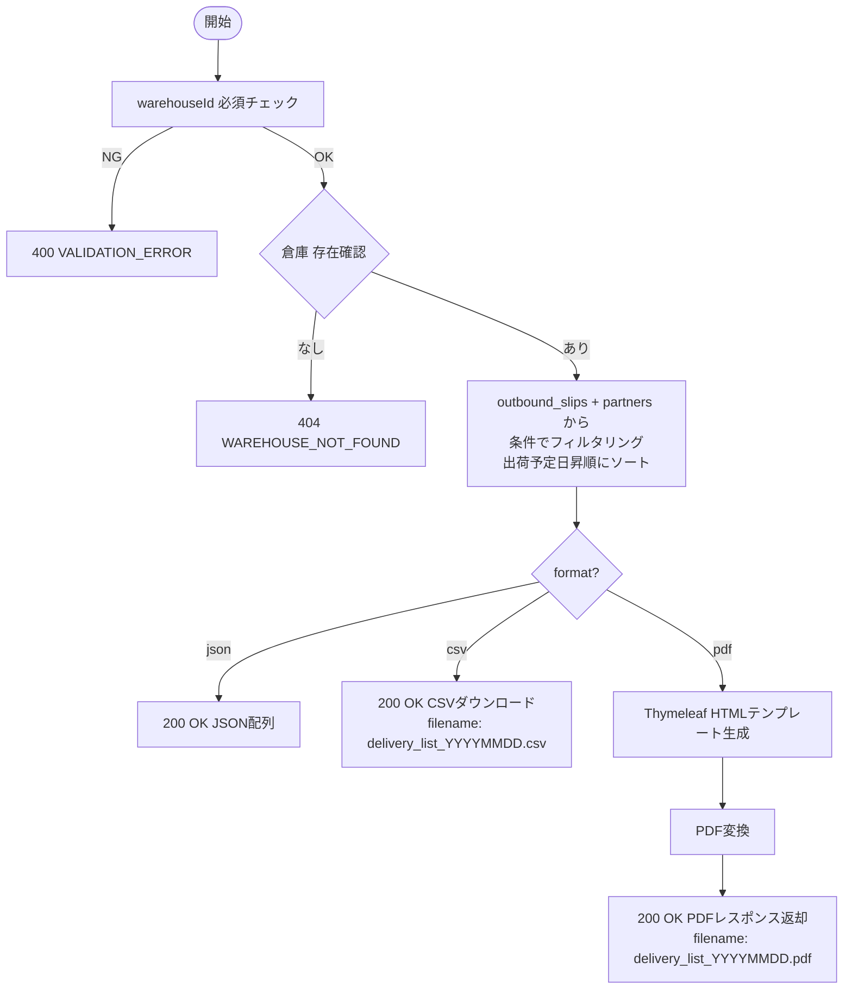
```mermaid
flowchart TD
    START([開始]) --> VALIDATE[warehouseId 必須チェック]
    VALIDATE -->|NG| ERR_VAL[400 VALIDATION_ERROR]
    VALIDATE -->|OK| FIND_WH{倉庫 存在確認}
    FIND_WH -->|なし| ERR_404[404 WAREHOUSE_NOT_FOUND]
    FIND_WH -->|あり| QUERY[outbound_slips + partners から\n条件でフィルタリング\n出荷予定日昇順にソート]
    QUERY --> FORMAT{format?}
    FORMAT -->|json| RES_JSON[200 OK JSON配列]
    FORMAT -->|csv| RES_CSV[200 OK CSVダウンロード\nfilename: delivery_list_YYYYMMDD.csv]
    FORMAT -->|pdf| GEN_HTML[Thymeleaf HTMLテンプレート生成] --> CONVERT_PDF[PDF変換] --> RES_PDF[200 OK PDFレスポンス返却\nfilename: delivery_list_YYYYMMDD.pdf]
```

**ビジネスルール**:

| # | ルール | エラーコード |
|---|--------|------------|
| 1 | `warehouseId` に対応する倉庫が存在しない場合は 404 を返す | `WAREHOUSE_NOT_FOUND` |
| 2 | 取得件数が10,000件を超える場合は 400 を返し、期間絞り込みを促す | `VALIDATION_ERROR` |

#### 5. 補足事項

- 配送リストは配送業者への連絡・出荷確認に使用する帳票。出荷予定日昇順でソートして返す。
- `deliveryAddress` は `partners` テーブルの配送先住所を参照する。
- CSV出力時のファイル名: `delivery_list_{YYYYMMDD}.csv`
- CSV出力時のヘッダー行（日本語）: `伝票番号,出荷先名,配送先住所,出荷予定日,ステータス,配送業者,送り状番号,商品コード,商品名,荷姿,数量`
- CSV出力時は伝票情報を明細行ごとに繰り返すフラット形式で出力する（1行 = 1商品明細）

---

### API-RPT-015 未出荷リスト（リアルタイム）

#### 1. API概要

| 項目 | 内容 |
|------|------|
| **API ID** | `API-RPT-015` |
| **API名** | 未出荷リスト（リアルタイム） |
| **メソッド** | `GET` |
| **パス** | `/api/v1/reports/unshipped-realtime` |
| **認証** | 要 |
| **対象ロール** | 全ロール（SYSTEM_ADMIN / WAREHOUSE_MANAGER / WAREHOUSE_STAFF / VIEWER） |
| **概要** | 指定日時点でまだ出荷していない伝票の一覧をリアルタイムで返す。集計バッチを介さずに `outbound_slips` を直接参照する。 |
| **関連画面** | OUT-001（出荷一覧）、RPT-001（レポート画面） |

#### 2. リクエスト仕様

##### クエリパラメータ

| パラメータ名 | 型 | 必須 | デフォルト | 説明 |
|------------|-----|:----:|----------|------|
| `warehouseId` | Long | ○ | — | 倉庫ID |
| `asOfDate` | String (date) | — | 現在の営業日 | 基準日（この日以前の予定日で未出荷のもの） |
| `format` | String | — | `json` | `json` / `csv` / `pdf` |

#### 3. レスポンス仕様（JSON）

```json
[
  {
    "slipNumber": "OUT-2026-00045",
    "customerName": "テスト出荷先B",
    "plannedShipDate": "2026-03-12",
    "productCode": "P-002",
    "productName": "商品B",
    "totalQuantityCas": 3,
    "status": "PICKING",
    "statusLabel": "ピッキング中",
    "delayDays": 2
  }
]
```

| フィールド名 | 型 | 説明 |
|------------|-----|------|
| `slipNumber` | String | 出荷伝票番号 |
| `customerName` | String | 出荷先名 |
| `plannedShipDate` | String (date) | 出荷予定日 |
| `productCode` | String | 商品コード |
| `productName` | String | 商品名 |
| `totalQuantityCas` | Integer | 合計数量（ケース） |
| `status` | String | 現在のステータスコード |
| `statusLabel` | String | ステータス表示名 |
| `delayDays` | Integer | 遅延日数（asOfDate − plannedShipDate） |

#### 4. 業務ロジック

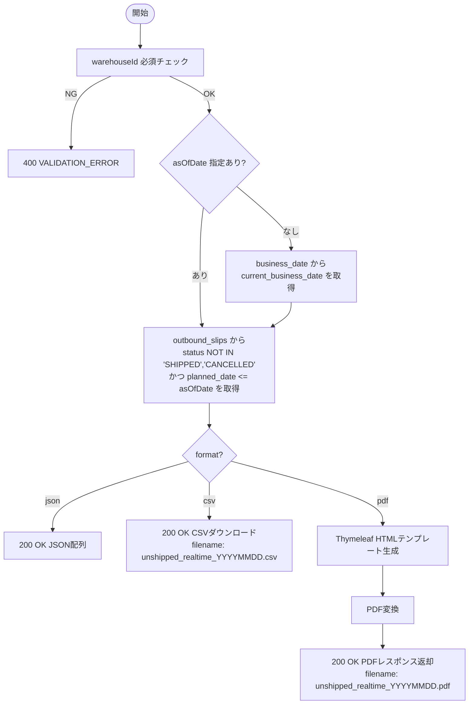
```mermaid
flowchart TD
    START([開始]) --> VALIDATE[warehouseId 必須チェック]
    VALIDATE -->|NG| ERR_VAL[400 VALIDATION_ERROR]
    VALIDATE -->|OK| DEFAULT_DATE{asOfDate 指定あり?}
    DEFAULT_DATE -->|なし| GET_BD[business_date から\ncurrent_business_date を取得]
    DEFAULT_DATE -->|あり| QUERY
    GET_BD --> QUERY[outbound_slips から\nstatus NOT IN 'SHIPPED','CANCELLED'\nかつ planned_date <= asOfDate を取得]
    QUERY --> FORMAT{format?}
    FORMAT -->|json| RES_JSON[200 OK JSON配列]
    FORMAT -->|csv| RES_CSV[200 OK CSVダウンロード\nfilename: unshipped_realtime_YYYYMMDD.csv]
    FORMAT -->|pdf| GEN_HTML[Thymeleaf HTMLテンプレート生成] --> CONVERT_PDF[PDF変換] --> RES_PDF[200 OK PDFレスポンス返却\nfilename: unshipped_realtime_YYYYMMDD.pdf]
```

**ビジネスルール**:

| # | ルール | エラーコード |
|---|--------|------------|
| 1 | `warehouseId` に対応する倉庫が存在しない場合は 404 を返す | `WAREHOUSE_NOT_FOUND` |
| 2 | `asOfDate` が未指定の場合は現在の営業日（`business_date.current_business_date`）を使用する | — |
| 3 | `SHIPPED`（出荷完了）・`CANCELLED`（キャンセル）のステータスは除外する | — |

#### 5. 補足事項

- 本APIはリアルタイムで `outbound_slips` テーブルを直接参照するため、最新状態を反映する。
- `asOfDate` を現在営業日と同日にすると当日業務の出荷督促確認に使用できる。
- 大量の未出荷が蓄積している場合は件数が多くなる可能性があるため、件数上限（10,000件）を設ける。
- CSV出力時のファイル名: `unshipped_realtime_{YYYYMMDD}.csv`
- CSV出力時のヘッダー行（日本語）: `伝票番号,出荷先名,出荷予定日,商品コード,商品名,合計数量(ケース),ステータス,遅延日数`

---

### API-RPT-016 未出荷リスト（確定）

#### 1. API概要

| 項目 | 内容 |
|------|------|
| **API ID** | `API-RPT-016` |
| **API名** | 未出荷リスト（確定） |
| **メソッド** | `GET` |
| **パス** | `/api/v1/reports/unshipped-confirmed` |
| **認証** | 要 |
| **対象ロール** | 全ロール（SYSTEM_ADMIN / WAREHOUSE_MANAGER / WAREHOUSE_STAFF / VIEWER） |
| **概要** | 日替処理で確定した指定営業日の未出荷リストを返す。`unshipped_list_records` テーブルから取得するため、営業日末時点の確定データとなる。 |
| **関連画面** | RPT-001（レポート画面） |

#### 2. リクエスト仕様

##### クエリパラメータ

| パラメータ名 | 型 | 必須 | 説明 |
|------------|-----|:----:|------|
| `warehouseId` | Long | ○ | 倉庫ID |
| `batchBusinessDate` | String (date) | ○ | バッチ処理営業日（`unshipped_list_records.batch_business_date`） |
| `format` | String | — | `json`（デフォルト）/ `csv` / `pdf` |

#### 3. レスポンス仕様（JSON）

```json
[
  {
    "batchBusinessDate": "2026-03-14",
    "slipNumber": "OUT-2026-00045",
    "customerName": "テスト出荷先B",
    "plannedShipDate": "2026-03-12",
    "productCode": "P-002",
    "productName": "商品B",
    "totalQuantityCas": 3,
    "statusAtBatch": "PICKING_COMPLETED"
  }
]
```

| フィールド名 | 型 | 説明 |
|------------|-----|------|
| `batchBusinessDate` | String (date) | バッチ処理営業日 |
| `slipNumber` | String | 出荷伝票番号 |
| `customerName` | String | 出荷先名 |
| `plannedShipDate` | String (date) | 出荷予定日 |
| `productCode` | String | 商品コード |
| `productName` | String | 商品名 |
| `totalQuantityCas` | Integer | 合計数量（ケース） |
| `statusAtBatch` | String | バッチ処理時点のステータスコード |

#### 4. 業務ロジック

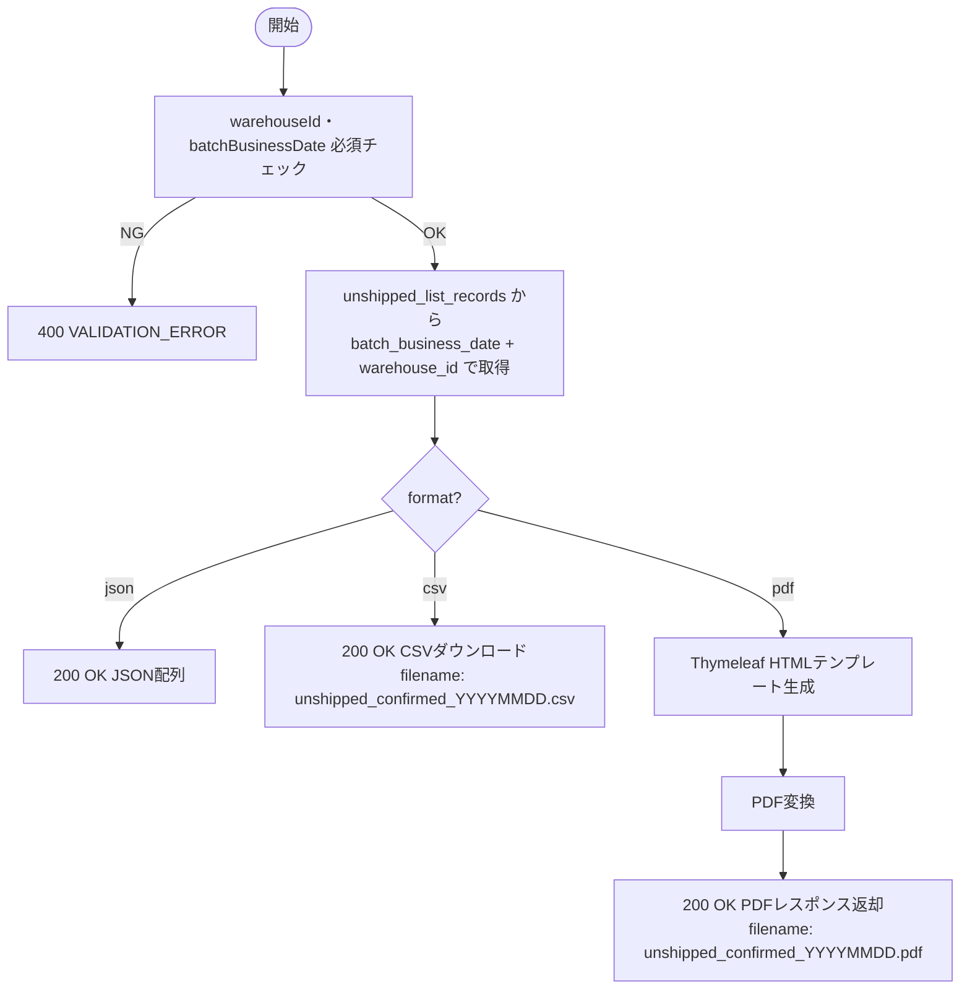
```mermaid
flowchart TD
    START([開始]) --> VALIDATE[warehouseId・batchBusinessDate 必須チェック]
    VALIDATE -->|NG| ERR_VAL[400 VALIDATION_ERROR]
    VALIDATE -->|OK| QUERY[unshipped_list_records から\nbatch_business_date + warehouse_id で取得]
    QUERY --> FORMAT{format?}
    FORMAT -->|json| RES_JSON[200 OK JSON配列]
    FORMAT -->|csv| RES_CSV[200 OK CSVダウンロード\nfilename: unshipped_confirmed_YYYYMMDD.csv]
    FORMAT -->|pdf| GEN_HTML[Thymeleaf HTMLテンプレート生成] --> CONVERT_PDF[PDF変換] --> RES_PDF[200 OK PDFレスポンス返却\nfilename: unshipped_confirmed_YYYYMMDD.pdf]
```

##### データ取得仕様

| 項目 | 内容 |
|------|------|
| **主テーブル** | `unshipped_list_records`（日替バッチで確定されたスナップショット） |
| **結合** | `LEFT JOIN products ON unshipped_list_records.product_code = products.product_code` |
|  | `LEFT JOIN partners ON unshipped_list_records.partner_code = partners.partner_code` |
|  | `INNER JOIN warehouses ON unshipped_list_records.warehouse_code = warehouses.warehouse_code` |
| **フィルタ条件** | `unshipped_list_records.warehouse_code = (SELECT warehouse_code FROM warehouses WHERE id = :warehouseId)`（必須） |
|  | `unshipped_list_records.batch_business_date = :batchBusinessDate`（必須） |
| **ソート順** | `unshipped_list_records.partner_name ASC, unshipped_list_records.planned_date ASC, unshipped_list_records.product_code ASC` |

**ビジネスルール**:

| # | ルール | エラーコード |
|---|--------|------------|
| 1 | `warehouseId` に対応する倉庫が存在しない場合は 404 を返す | `WAREHOUSE_NOT_FOUND` |
| 2 | 指定 `batchBusinessDate` の日替処理が実行されていない場合は空配列（`[]`）を返す（404 ではない） | — |

#### 5. 補足事項

- 本APIは日替処理で生成された `unshipped_list_records` テーブルの確定データを参照する。リアルタイム版（API-RPT-015）とは異なり、バッチ処理時点のスナップショットを返す。
- 指定した `batchBusinessDate` に日替処理が実行されていない場合は空配列を返す。
- `warehouseId` を受け取った場合、`warehouses` テーブルから対応する `warehouse_code` を取得し、`unshipped_list_records.warehouse_code` カラムで絞り込む（`unshipped_list_records` テーブルには `warehouse_id` カラムが存在せず `warehouse_code` カラムのみのため）。
- CSV出力時のファイル名: `unshipped_confirmed_{YYYYMMDD}.csv`
- CSV出力時のヘッダー行（日本語）: `バッチ処理営業日,伝票番号,出荷先名,出荷予定日,商品コード,商品名,合計数量(ケース),バッチ時点ステータス`

---

### API-RPT-017 日次集計レポート

#### 1. API概要

| 項目 | 内容 |
|------|------|
| **API ID** | `API-RPT-017` |
| **API名** | 日次集計レポート |
| **メソッド** | `GET` |
| **パス** | `/api/v1/reports/daily-summary` |
| **認証** | 要 |
| **対象ロール** | 全ロール（SYSTEM_ADMIN / WAREHOUSE_MANAGER / WAREHOUSE_STAFF / VIEWER） |
| **概要** | 日替処理で集計した指定営業日の日次サマリーを返す。入荷件数・数量、出荷件数・数量、在庫数量（営業日末時点）、未入荷件数、未出荷件数を含む。 |
| **関連画面** | BAT-002（バッチ実行履歴一覧）/ RPT-017ダイアログ |

#### 2. リクエスト仕様

##### クエリパラメータ

| パラメータ名 | 型 | 必須 | 説明 |
|------------|-----|:----:|------|
| `targetBusinessDate` | String (date) | ○ | 対象営業日（日替処理が完了している必要がある） |
| `format` | String | — | `json`（デフォルト）/ `csv` / `pdf` |

#### 3. レスポンス仕様（JSON）

```json
[
  {
    "businessDate": "2026-03-14",
    "warehouseId": 1,
    "warehouseName": "東京DC",
    "inboundCount": 12,
    "inboundLineCount": 45,
    "inboundQuantityTotal": 1230,
    "outboundCount": 8,
    "outboundLineCount": 30,
    "outboundQuantityTotal": 870,
    "returnCount": 2,
    "returnQuantityTotal": 150,
    "inventoryQuantityTotal": 5600,
    "unreceivedCount": 3,
    "unshippedCount": 1
  }
]
```

| フィールド名 | 型 | 説明 |
|------------|-----|------|
| `businessDate` | String (date) | 対象営業日 |
| `warehouseId` | Long | 倉庫ID |
| `warehouseName` | String | 倉庫名 |
| `inboundCount` | Integer | 入荷件数（当日入庫完了伝票数） |
| `inboundLineCount` | Integer | 入荷明細行数 |
| `inboundQuantityTotal` | Integer | 入荷数量合計（バラ換算） |
| `outboundCount` | Integer | 出荷件数（当日出荷完了伝票数） |
| `outboundLineCount` | Integer | 出荷明細行数 |
| `outboundQuantityTotal` | Integer | 出荷数量合計（バラ換算） |
| `returnCount` | Integer | 返品件数（当日返品処理完了伝票数） |
| `returnQuantityTotal` | Integer | 返品数量合計（バラ換算） |
| `inventoryQuantityTotal` | Integer | 在庫数量合計（営業日末時点・バラ換算） |
| `unreceivedCount` | Integer | 未入荷件数（当日時点の累積） |
| `unshippedCount` | Integer | 未出荷件数（当日時点の累積） |

##### エラーレスポンス

| HTTPステータス | エラーコード | 発生条件 |
|-------------|------------|---------|
| `400 Bad Request` | `VALIDATION_ERROR` | `targetBusinessDate` が未指定または日付形式不正 |
| `404 Not Found` | `BATCH_EXECUTION_NOT_FOUND` | 指定日付の `batch_execution_logs` に `status=SUCCESS` のレコードが存在しない |

#### 4. 業務ロジック

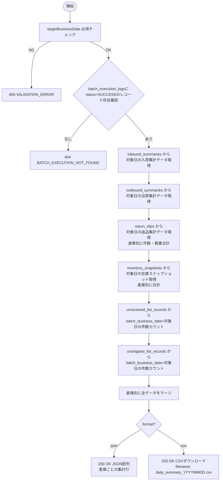
```mermaid
flowchart TD
    START([開始]) --> VALIDATE[targetBusinessDate 必須チェック]
    VALIDATE -->|NG| ERR_VAL[400 VALIDATION_ERROR]
    VALIDATE -->|OK| CHECK_BATCH{batch_execution_logsに\nstatus=SUCCESSのレコード存在確認}
    CHECK_BATCH -->|なし| ERR_404[404 BATCH_EXECUTION_NOT_FOUND]
    CHECK_BATCH -->|あり| QUERY_INB[inbound_summaries から\n対象日の入荷集計データ取得]
    QUERY_INB --> QUERY_OUT[outbound_summaries から\n対象日の出荷集計データ取得]
    QUERY_OUT --> QUERY_RTN[return_slips から\n対象日の返品集計データ取得\n倉庫別に件数・数量合計]
    QUERY_RTN --> QUERY_INV[inventory_snapshots から\n対象日の在庫スナップショット取得\n倉庫別に合計]
    QUERY_INV --> QUERY_UNRCV[unreceived_list_records から\nbatch_business_date=対象日の件数カウント]
    QUERY_UNRCV --> QUERY_UNSHIP[unshipped_list_records から\nbatch_business_date=対象日の件数カウント]
    QUERY_UNSHIP --> MERGE[倉庫別に全データをマージ]
    MERGE --> FORMAT{format?}
    FORMAT -->|json| RES_JSON[200 OK JSON配列\n倉庫ごとの集計行]
    FORMAT -->|csv| RES_CSV[200 OK CSVダウンロード\nfilename: daily_summary_YYYYMMDD.csv]
```

**ビジネスルール**:

| # | ルール | エラーコード |
|---|--------|------------|
| 1 | 指定日の日替処理が `SUCCESS` で完了していない場合は 404 を返す（`RUNNING` や `FAILED` の場合も 404） | `BATCH_EXECUTION_NOT_FOUND` |
| 2 | 複数倉庫が存在する場合、倉庫ごとに1行出力する（倉庫IDの昇順） | — |
| 3 | 倉庫に入出荷実績がない場合でも、在庫スナップショットがあれば出力する | — |

#### 5. 補足事項

- 複数倉庫が存在する場合、倉庫ごとに1行出力する（倉庫IDの昇順）。
- `inboundQuantityTotal` / `outboundQuantityTotal` / `inventoryQuantityTotal` はすべてバラ（PCS）換算での合計値。
- CSV出力の場合もヘッダー行を含む全倉庫分のデータを出力する。
- 日次集計レポートは `inbound_summaries`、`outbound_summaries`、`return_slips`、`inventory_snapshots`、`unreceived_list_records`、`unshipped_list_records` の6テーブルから集計するため、日替処理（`SUCCESS`）完了後でなければ取得できない。
- CSV出力時のファイル名: `daily_summary_{YYYYMMDD}.csv`
- CSV出力時のヘッダー行（日本語）: `対象営業日,倉庫ID,倉庫名,入荷件数,入荷明細行数,入荷数量合計,出荷件数,出荷明細行数,出荷数量合計,返品件数,返品数量合計,在庫数量合計,未入荷件数,未出荷件数`

---

### API-RPT-018 返品レポート

#### 1. API概要

| 項目 | 内容 |
|------|------|
| **API ID** | `API-RPT-018` |
| **API名** | 返品レポート |
| **メソッド** | `GET` |
| **パス** | `/api/v1/reports/returns` |
| **認証** | 要 |
| **対象ロール** | 全ロール（SYSTEM_ADMIN / WAREHOUSE_MANAGER / WAREHOUSE_STAFF / VIEWER） |
| **概要** | 指定倉庫・期間の返品実績一覧を返品種別ごとに出力する。返品理由の分析・仕入先への報告に活用する。 |
| **関連画面** | RTN-001（返品登録画面） |

#### 2. リクエスト仕様

##### クエリパラメータ

| パラメータ名 | 型 | 必須 | デフォルト | 説明 |
|------------|-----|:----:|----------|------|
| `warehouseId` | Long | ○ | — | 倉庫ID |
| `returnType` | String | — | — | 返品種別（`INBOUND` / `OUTBOUND` / `INVENTORY`）。未指定時は全種別 |
| `returnDateFrom` | String (date) | — | — | 返品日（From） |
| `returnDateTo` | String (date) | — | — | 返品日（To） |
| `productId` | Long | — | — | 商品ID |
| `partnerId` | Long | — | — | 仕入先/届け先パートナーID |
| `returnReason` | String | — | — | 返品理由コード |
| `format` | String | — | `json` | `json` / `csv` / `pdf` |

#### 3. レスポンス仕様（JSON）

```json
[
  {
    "returnNumber": "RTN-2026-00010",
    "returnType": "INBOUND",
    "returnTypeLabel": "入荷返品",
    "returnDate": "2026-03-05",
    "productCode": "P-001",
    "productName": "商品A",
    "quantity": 10,
    "unitType": "CAS",
    "returnReason": "QUALITY_DEFECT",
    "returnReasonLabel": "品質不良",
    "returnReasonNote": "外箱破損あり",
    "relatedSlipNumber": "INB-2026-00120",
    "partnerName": "テスト仕入先A"
  }
]
```

| フィールド名 | 型 | 説明 |
|------------|-----|------|
| `returnNumber` | String | 返品伝票番号 |
| `returnType` | String | 返品種別コード（`INBOUND` / `OUTBOUND` / `INVENTORY`） |
| `returnTypeLabel` | String | 返品種別ラベル（「入荷返品」/「出荷返品」/「在庫返品」） |
| `returnDate` | String (date) | 返品日 |
| `productCode` | String | 商品コード |
| `productName` | String | 商品名 |
| `quantity` | Integer | 数量 |
| `unitType` | String | 荷姿種別（`CAS` / `BAL` / `PCS`） |
| `returnReason` | String | 返品理由コード |
| `returnReasonLabel` | String | 返品理由ラベル（日本語） |
| `returnReasonNote` | String | 返品理由備考（自由入力テキスト。未入力時は `null`） |
| `relatedSlipNumber` | String | 関連伝票番号（入荷伝票番号 or 出荷伝票番号。紐づけなしの場合は `null`） |
| `partnerName` | String | 仕入先名（入荷返品）/ 届け先パートナー名（出荷返品） |

##### エラーレスポンス

| HTTPステータス | エラーコード | 発生条件 |
|-------------|------------|---------|
| `400 Bad Request` | `VALIDATION_ERROR` | `warehouseId` 未指定、日付形式不正、`returnType` の値が不正 |
| `404 Not Found` | `WAREHOUSE_NOT_FOUND` | 指定した `warehouseId` の倉庫が存在しない |

#### 4. 業務ロジック

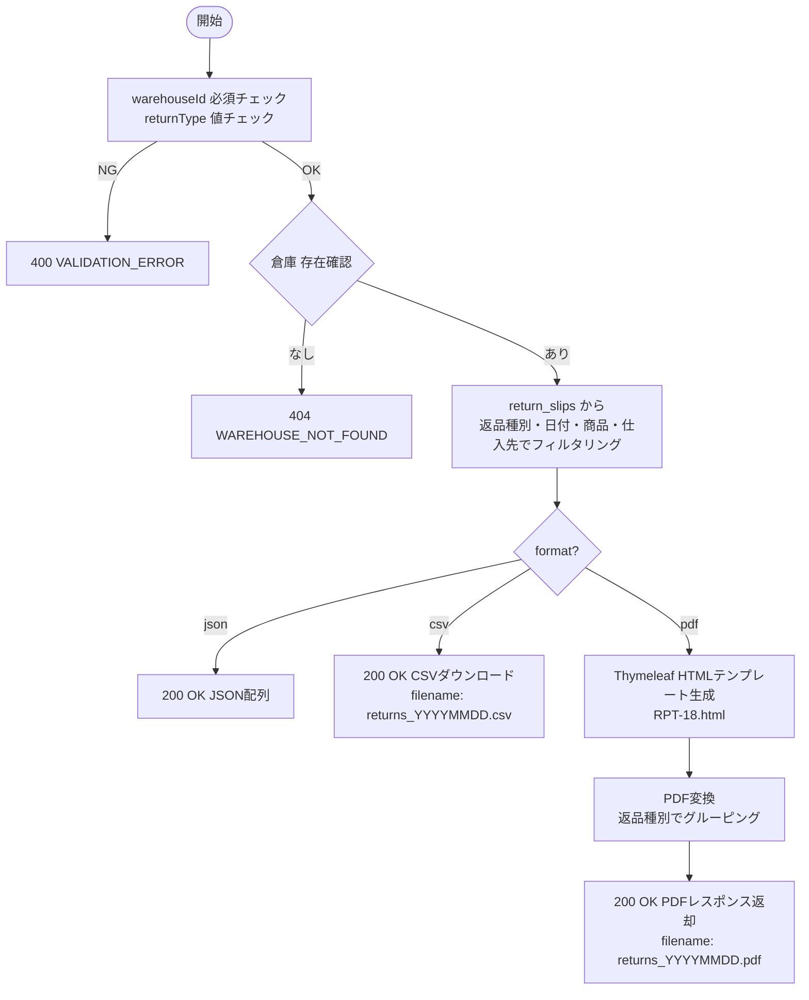
```mermaid
flowchart TD
    START([開始]) --> VALIDATE[warehouseId 必須チェック\nreturnType 値チェック]
    VALIDATE -->|NG| ERR_VAL[400 VALIDATION_ERROR]
    VALIDATE -->|OK| FIND_WH{倉庫 存在確認}
    FIND_WH -->|なし| ERR_404[404 WAREHOUSE_NOT_FOUND]
    FIND_WH -->|あり| QUERY[return_slips から\n返品種別・日付・商品・仕入先でフィルタリング]
    QUERY --> FORMAT{format?}
    FORMAT -->|json| RES_JSON[200 OK JSON配列]
    FORMAT -->|csv| RES_CSV[200 OK CSVダウンロード\nfilename: returns_YYYYMMDD.csv]
    FORMAT -->|pdf| GEN_HTML[Thymeleaf HTMLテンプレート生成\nRPT-18.html] --> CONVERT_PDF[PDF変換\n返品種別でグルーピング] --> RES_PDF[200 OK PDFレスポンス返却\nfilename: returns_YYYYMMDD.pdf]
```

##### データ取得仕様

**主テーブル・結合**

```sql
-- 論理SQL（実装はJPQL/Criteria APIでも可）
SELECT
    rs.return_number,
    rs.return_type,
    rs.return_date,
    p.product_code,
    p.product_name,
    rs.quantity,
    rs.unit_type,
    rs.return_reason,
    rs.return_reason_note,
    rs.related_slip_number,
    pt.partner_name
FROM return_slips AS rs
    JOIN products AS p ON rs.product_id = p.id
    LEFT JOIN partners AS pt ON rs.partner_id = pt.id
    JOIN warehouses AS w ON rs.warehouse_id = w.id
WHERE rs.warehouse_id = :warehouseId
ORDER BY rs.return_type ASC, rs.return_date ASC, rs.return_number ASC
```

**フィルタ条件（クエリパラメータ → WHERE句マッピング）**

| クエリパラメータ | WHERE句 | 備考 |
|----------------|---------|------|
| `warehouseId` | `rs.warehouse_id = :warehouseId` | 必須 |
| `returnType` | `rs.return_type = :returnType` | 任意。未指定時は全種別 |
| `returnDateFrom` | `rs.return_date >= :returnDateFrom` | 任意。未指定時は条件なし |
| `returnDateTo` | `rs.return_date <= :returnDateTo` | 任意。未指定時は条件なし |
| `productId` | `rs.product_id = :productId` | 任意。未指定時は全商品 |
| `partnerId` | `rs.partner_id = :partnerId` | 任意。未指定時は全パートナー |
| `returnReason` | `rs.return_reason = :returnReason` | 任意。未指定時は全理由 |

**計算フィールド（レスポンスフィールド ← 導出元）**

| レスポンスフィールド | 導出方法 |
|--------------------|---------|
| `returnTypeLabel` | `return_type` の enum → 日本語ラベル変換（`INBOUND` → 「入荷返品」、`OUTBOUND` → 「出荷返品」。アプリ側） |
| `returnReasonLabel` | `return_reason` の enum → 日本語ラベル変換（アプリ側） |
| `partnerName` | `partners.partner_name`（`return_slips.partner_id` → `partners.id`） |

**ソート順**

| 優先度 | カラム | 方向 |
|--------|-------|------|
| 1 | `rs.return_type` | ASC |
| 2 | `rs.return_date` | ASC |
| 3 | `rs.return_number` | ASC |

**集計（該当する場合のみ）**

| 集計種別 | 対象 | 方法 |
|---------|------|------|
| グループ集計 | `return_type` ごとの数量小計 | アプリ側ストリーム集計 |
| 全体合計 | 最終行の数量合計 | アプリ側で全行を合算 |

**ビジネスルール**:

| # | ルール | エラーコード |
|---|--------|------------|
| 1 | `warehouseId` に対応する倉庫が存在しない場合は 404 を返す | `WAREHOUSE_NOT_FOUND` |
| 2 | `returnType` に `INBOUND` / `OUTBOUND` 以外の値が指定された場合は 400 を返す | `VALIDATION_ERROR` |
| 3 | 取得件数が10,000件を超える場合は 400 を返し、期間絞り込みを促す | `VALIDATION_ERROR` |

#### 5. 補足事項

- 入荷返品の場合、`relatedSlipNumber` には入荷伝票番号が入る。出荷返品の場合は出荷伝票番号が入る。紐づけなしの場合は `null`
- `partnerName` は入荷返品の場合は仕入先名、出荷返品の場合は届け先パートナー名を取得する
- CSV出力時のファイル名: `returns_{YYYYMMDD}.csv`
- CSV出力時のヘッダー行（日本語）: `返品伝票番号,返品種別,返品種別名,返品日,商品コード,商品名,数量,荷姿,返品理由,返品理由名,返品理由備考,関連伝票番号,仕入先名`

---
