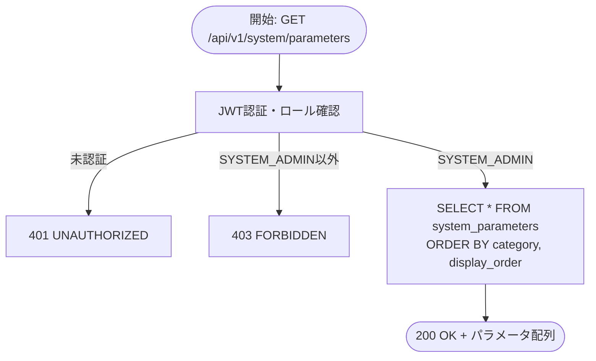

# 機能設計書 — API設計 システムパラメータ（SYS）

対象API: API-SYS-002 〜 API-SYS-003

> **注記**: API-SYS-001（営業日取得）は API-01-auth.md に定義されています。

> **アクセス制限**: 本ドキュメントに記載するAPIはすべて **SYSTEM_ADMIN ロールのみ** アクセス可能。
> WAREHOUSE_MANAGER / WAREHOUSE_STAFF / VIEWER からのリクエストは `403 FORBIDDEN` を返す。

---

## API-SYS-002 パラメータ一覧取得

### 1. API概要

| 項目 | 内容 |
|------|------|
| **API ID** | `API-SYS-002` |
| **API名** | パラメータ一覧取得 |
| **メソッド** | `GET` |
| **パス** | `/api/v1/system/parameters` |
| **認証** | 要 |
| **対象ロール** | SYSTEM_ADMIN のみ |
| **概要** | システムに登録されているすべてのシステムパラメータを取得する。パラメータ数は限定的であるためページングは行わず、全件を配列で返す。 |
| **関連画面** | SYS-001（システムパラメータ設定） |

---

### 2. リクエスト仕様

パラメータなし。

---

### 3. レスポンス仕様

#### 成功レスポンス: `200 OK`

```json
[
  {
    "paramKey": "LOCATION_CAPACITY_CASE",
    "paramValue": "1",
    "defaultValue": "1",
    "displayName": "ロケーション収容上限（ケース）",
    "category": "INVENTORY",
    "valueType": "INTEGER",
    "description": "1ロケーションあたりのケース最大数",
    "updatedAt": "2026-03-17T10:00:00+09:00",
    "updatedBy": 1
  },
  {
    "paramKey": "STOCK_ALERT_THRESHOLD",
    "paramValue": "50",
    "defaultValue": "50",
    "displayName": "在庫アラート閾値",
    "category": "INVENTORY",
    "valueType": "INTEGER",
    "description": "在庫数がこの値を下回るとアラートを表示する",
    "updatedAt": "2026-03-17T10:00:00+09:00",
    "updatedBy": 1
  }
]
```

**各要素のフィールド定義:**

| フィールド名 | 型 | 説明 |
|------------|-----|------|
| `paramKey` | String | パラメータキー（一意識別子） |
| `paramValue` | String | 現在の設定値（すべて文字列で返す） |
| `defaultValue` | String | デフォルト値 |
| `displayName` | String | パラメータの表示名 |
| `category` | String | カテゴリ（`INVENTORY` / `OUTBOUND` / `INBOUND` / `SYSTEM` 等） |
| `valueType` | String | 値の型（`INTEGER` / `STRING` / `BOOLEAN`） |
| `description` | String | パラメータの説明文 |
| `updatedAt` | String (ISO 8601) | 最終更新日時 |
| `updatedBy` | Long | 最終更新者のユーザーID |

#### エラーレスポンス

| HTTPステータス | エラーコード | 発生条件 |
|-------------|-----------|---------|
| `401 Unauthorized` | `UNAUTHORIZED` | 未認証（Cookieなし・JWT期限切れ） |
| `403 Forbidden` | `FORBIDDEN` | SYSTEM_ADMIN 以外のロールでアクセス |

---

### 4. 業務ロジック



**ビジネスルール:**

| # | ルール | エラーコード |
|---|--------|------------|
| 1 | 全件を配列で返す（ページングなし）。パラメータ数はシステム設計上限定的であるため | — |
| 2 | レスポンスは `category` → `display_order` の順でソートする | — |

---

### 5. 補足事項

- 参照系APIのため読み取り専用トランザクションで処理する。
- `paramValue` はすべて文字列型で返す。フロントエンドが `valueType` を参照して適切な型変換・入力コントロールの選択を行う。
- `updatedBy` はユーザーIDを返す。`updatedByName` にはサーバーサイドで解決した更新者名を含める（一覧取得時はN+1回避のため一括取得）。

---

---

## API-SYS-003 パラメータ値更新

### 1. API概要

| 項目 | 内容 |
|------|------|
| **API ID** | `API-SYS-003` |
| **API名** | パラメータ値更新 |
| **メソッド** | `PUT` |
| **パス** | `/api/v1/system/parameters/{paramKey}` |
| **認証** | 要 |
| **対象ロール** | SYSTEM_ADMIN のみ |
| **概要** | 指定されたパラメータキーの値を更新する。値の型（`valueType`）に応じたバリデーションを実施する。 |
| **関連画面** | SYS-001（システムパラメータ設定） |

---

### 2. リクエスト仕様

#### パスパラメータ

| パラメータ名 | 型 | 必須 | 説明 |
|------------|-----|:----:|------|
| `paramKey` | String | ○ | パラメータキー（`system_parameters.param_key`） |

#### リクエストボディ

```json
{
  "paramValue": "10"
}
```

**フィールド定義:**

| フィールド名 | 型 | 必須 | バリデーション | 説明 |
|------------|-----|:----:|-------------|------|
| `paramValue` | String | ○ | `valueType` に応じた型チェック（後述） | 更新後のパラメータ値（文字列で送信） |

**valueType 別バリデーション:**

| valueType | バリデーションルール |
|-----------|-------------------|
| `INTEGER` | 正の整数（`^[1-9][0-9]*$` または `0`）。負の値・小数・空文字は不可 |
| `STRING` | 1文字以上500文字以内。空文字は不可 |
| `BOOLEAN` | `true` または `false`（大文字小文字を区別しない）。空文字は不可 |

---

### 3. レスポンス仕様

#### 成功レスポンス: `200 OK`

```json
{
  "paramKey": "LOCATION_CAPACITY_CASE",
  "paramValue": "10",
  "defaultValue": "1",
  "displayName": "ロケーション収容上限（ケース）",
  "category": "INVENTORY",
  "valueType": "INTEGER",
  "description": "1ロケーションあたりのケース最大数",
  "updatedAt": "2026-03-17T11:00:00+09:00",
  "updatedBy": 1
}
```

#### エラーレスポンス

| HTTPステータス | エラーコード | 発生条件 |
|-------------|-----------|---------|
| `400 Bad Request` | `VALIDATION_ERROR` | `paramValue` が未指定、または `valueType` に対して不正な値 |
| `401 Unauthorized` | `UNAUTHORIZED` | 未認証 |
| `403 Forbidden` | `FORBIDDEN` | SYSTEM_ADMIN 以外のロールでアクセス |
| `404 Not Found` | `PARAM_NOT_FOUND` | 指定した `paramKey` が存在しない |

バリデーションエラー例:

```json
{
  "errorCode": "VALIDATION_ERROR",
  "message": "入力内容に誤りがあります",
  "details": [
    {
      "field": "paramValue",
      "message": "正の整数を入力してください"
    }
  ]
}
```

---

### 4. 業務ロジック

```mermaid
flowchart TD
    START([開始: PUT /api/v1/system/parameters/{paramKey}]) --> AUTH[JWT認証・ロール確認]
    AUTH -->|未認証| ERR_401[401 UNAUTHORIZED]
    AUTH -->|SYSTEM_ADMIN以外| ERR_403[403 FORBIDDEN]
    AUTH -->|SYSTEM_ADMIN| FETCH["SELECT FROM system_parameters\nWHERE param_key = :paramKey"]

    FETCH -->|存在しない| ERR_404[404 PARAM_NOT_FOUND]
    FETCH -->|存在する| VALIDATE[paramValue バリデーション\nvalueTypeに応じた型チェック]

    VALIDATE -->|NG| ERR_400[400 VALIDATION_ERROR\n詳細エラーを返す]
    VALIDATE -->|OK| UPDATE["UPDATE system_parameters SET<br/>- param_value = :paramValue<br/>- updated_by = ログイン中ユーザーID<br/>- updated_at = NOW<br/>WHERE param_key = :paramKey"]

    UPDATE --> END([200 OK + 更新後パラメータオブジェクト])
```

**ビジネスルール:**

| # | ルール | エラーコード |
|---|--------|------------|
| 1 | 指定された `paramKey` に一致するパラメータが存在しない場合は404を返す | `PARAM_NOT_FOUND` |
| 2 | `valueType = INTEGER` の場合、`paramValue` は正の整数（0以上の整数）であること | `VALIDATION_ERROR` |
| 3 | `valueType = STRING` の場合、`paramValue` は1文字以上500文字以内であること | `VALIDATION_ERROR` |
| 3a | `valueType = BOOLEAN` の場合、`paramValue` は `true` または `false`（大文字小文字を区別しない）であること | `VALIDATION_ERROR` |
| 4 | `paramKey`・`defaultValue`・`displayName`・`category`・`valueType`・`description` は更新不可（`paramValue` のみ更新対象） | — |

---

### 5. 補足事項

- パラメータの追加・削除はこのAPIでは行わない。パラメータの定義はアプリケーション初期設定（マイグレーション）で行い、管理画面では値の変更のみを許可する。
- トランザクション: UPDATE は単一トランザクションで処理する。
- パラメータの変更はシステム全体に影響を与えるため、更新ログ（`updated_by`・`updated_at`）を記録し、変更履歴の追跡を可能とする。
- 楽観的ロックは導入しない。パラメータの同時更新は発生頻度が極めて低く、SYSTEM_ADMIN のみがアクセスするため、最終更新の値が常に優先される（Last Write Wins）。

---

---

## 付録: エラーコード一覧（SYS）

| エラーコード | HTTPステータス | 対象API | 説明 |
|-----------|-------------|--------|------|
| `UNAUTHORIZED` | 401 | 全API | 未認証（Cookieなし・JWT期限切れ） |
| `FORBIDDEN` | 403 | 全API | SYSTEM_ADMIN 以外のロールによるアクセス |
| `VALIDATION_ERROR` | 400 | 002 | 入力バリデーションエラー（valueTypeに対する不正な値） |
| `PARAM_NOT_FOUND` | 404 | 002 | 指定したパラメータキーが存在しない |

---

## 付録: パラメータオブジェクト共通フィールド定義

すべてのレスポンスで返されるパラメータオブジェクトの共通フィールド定義。

| フィールド名 | 型 | DBカラム | 説明 |
|------------|-----|--------|------|
| `paramKey` | String | `param_key` | パラメータキー（PK） |
| `paramValue` | String | `param_value` | 現在の設定値 |
| `defaultValue` | String | `default_value` | デフォルト値 |
| `displayName` | String | `display_name` | パラメータの表示名 |
| `category` | String | `category` | カテゴリ |
| `valueType` | String | `value_type` | 値の型（`INTEGER` / `STRING` / `BOOLEAN`） |
| `description` | String | `description` | パラメータの説明文 |
| `updatedAt` | String | `updated_at` | 最終更新日時（ISO 8601） |
| `updatedBy` | Long | `updated_by` | 最終更新者のユーザーID |
| `updatedByName` | String | — | 最終更新者名（サーバーサイドで解決） |
