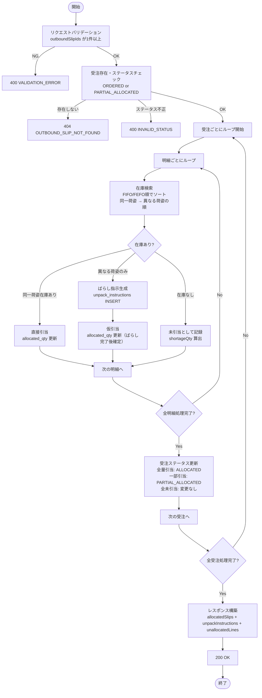
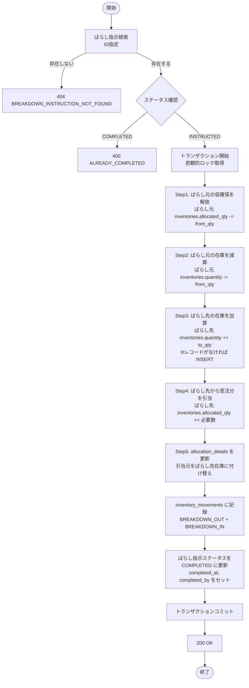
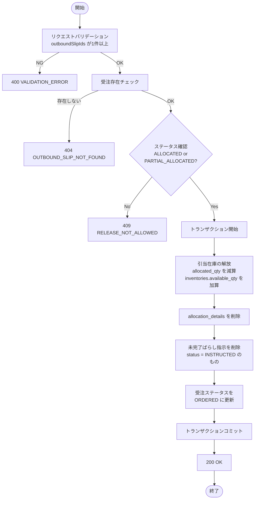

# 機能設計書 — API設計 在庫引当（ALL）

> **関連ファイル**: [08-api-overview.md](08-api-overview.md)（共通仕様・エラーコード一覧）

---

## 目次

1. [API-ALL-001: 引当対象受注一覧取得](#api-all-001-引当対象受注一覧取得)
2. [API-ALL-002: 引当実行](#api-all-002-引当実行)
3. [API-ALL-003: ばらし指示一覧取得](#api-all-003-ばらし指示一覧取得)
4. [API-ALL-004: ばらし完了](#api-all-004-ばらし完了)
5. [API-ALL-005: 引当済み受注一覧取得](#api-all-005-引当済み受注一覧取得)
6. [API-ALL-006: 引当解放](#api-all-006-引当解放)
7. [エラーコード一覧（在庫引当）](#エラーコード一覧在庫引当)

---

---

## API-ALL-001: 引当対象受注一覧取得

### 1. API概要

| 項目 | 内容 |
|------|------|
| **API ID** | `API-ALL-001` |
| **API名** | 引当対象受注一覧取得 |
| **メソッド** | `GET` |
| **パス** | `/api/v1/allocation/orders` |
| **認証** | 要 |
| **対象ロール** | `SYSTEM_ADMIN`, `WAREHOUSE_MANAGER` |
| **概要** | 引当対象となる受注（ステータスが `ORDERED` または `PARTIAL_ALLOCATED`）をページング形式で取得する。出荷予定日・出荷先での絞り込みが可能。 |
| **関連画面** | `ALL-001`（在庫引当 - 引当実行タブ） |

---

### 2. リクエスト仕様

#### クエリパラメータ

| パラメータ名 | 型 | 必須 | デフォルト | 説明 |
|------------|-----|:----:|----------|------|
| `warehouseId` | Long | ○ | — | 倉庫ID |
| `status` | String[] | — | `ORDERED,PARTIAL_ALLOCATED` | ステータス（複数指定可）。例: `status=ORDERED&status=PARTIAL_ALLOCATED` |
| `shippingDateFrom` | String | — | — | 出荷予定日の開始日（`yyyy-MM-dd`） |
| `shippingDateTo` | String | — | — | 出荷予定日の終了日（`yyyy-MM-dd`） |
| `partnerName` | String | — | — | 出荷先名（部分一致） |
| `page` | Integer | — | `0` | ページ番号（0始まり） |
| `size` | Integer | — | `20` | 1ページあたりの件数（上限: 100） |
| `sort` | String | — | `plannedDate,asc` | ソート指定 |

---

### 3. レスポンス仕様

#### 成功レスポンス（200 OK）

```json
{
  "content": [
    {
      "id": 1,
      "slipNumber": "OUT-20260313-001",
      "plannedDate": "2026-03-20",
      "partnerName": "株式会社テスト商事",
      "lineCount": 3,
      "status": "ORDERED"
    }
  ],
  "page": 0,
  "size": 20,
  "totalElements": 42,
  "totalPages": 3
}
```

**content 要素のフィールド**

| フィールド名 | 型 | 説明 |
|------------|-----|------|
| `id` | Long | 出荷伝票ID |
| `slipNumber` | String | 伝票番号 |
| `plannedDate` | String | 出荷予定日（`yyyy-MM-dd`） |
| `partnerName` | String | 出荷先取引先名 |
| `lineCount` | Integer | 明細件数 |
| `status` | String | 受注ステータス（`ORDERED` / `PARTIAL_ALLOCATED`） |

#### エラーレスポンス

| HTTPステータス | エラーコード | 説明 |
|-------------|------------|------|
| `400` | `VALIDATION_ERROR` | パラメータ不正 |
| `401` | `UNAUTHORIZED` | 未認証 |
| `403` | `FORBIDDEN` | 権限不足 |

---

### 4. 業務ロジック

**ビジネスルール**

| # | ルール |
|---|--------|
| 1 | `status` 未指定時はデフォルトで `ORDERED`, `PARTIAL_ALLOCATED` の受注を取得 |
| 2 | `partnerName` は部分一致（LIKE '%keyword%'）で絞り込み |
| 3 | デフォルトソートは `planned_date ASC, slip_number ASC` |
| 4 | `lineCount` はサブクエリで集計し、N+1問題を回避する |

---

---

## API-ALL-002: 引当実行

### 1. API概要

| 項目 | 内容 |
|------|------|
| **API ID** | `API-ALL-002` |
| **API名** | 引当実行 |
| **メソッド** | `POST` |
| **パス** | `/api/v1/allocation/execute` |
| **認証** | 要 |
| **対象ロール** | `SYSTEM_ADMIN`, `WAREHOUSE_MANAGER` |
| **概要** | 選択された受注に対して在庫引当を実行する。FIFO/FEFO方式で在庫を引き当て、荷姿変換が必要な場合はばらし指示を自動生成する。 |
| **関連画面** | `ALL-001`（在庫引当 - 引当実行タブ） |

---

### 2. リクエスト仕様

#### リクエストボディ

```json
{
  "outboundSlipIds": [1, 2, 3]
}
```

| フィールド名 | 型 | 必須 | バリデーション | 説明 |
|------------|-----|:----:|-------------|------|
| `outboundSlipIds` | Long[] | ○ | 1件以上、各IDが存在する受注 | 引当対象の出荷伝票IDリスト |

---

### 3. レスポンス仕様

#### 成功レスポンス（200 OK）

```json
{
  "allocatedCount": 2,
  "allocatedSlips": [
    {
      "outboundSlipId": 1,
      "slipNumber": "OUT-20260313-001",
      "status": "ALLOCATED",
      "allocatedLines": [
        {
          "lineNo": 1,
          "productCode": "PRD-001",
          "productName": "テスト商品A",
          "orderedQty": 10,
          "allocatedQty": 10
        }
      ]
    }
  ],
  "unpackInstructions": [
    {
      "id": 101,
      "productCode": "PRD-002",
      "productName": "テスト商品B",
      "fromUnitType": "CASE",
      "toUnitType": "PIECE",
      "quantity": 24,
      "status": "INSTRUCTED"
    }
  ],
  "unallocatedLines": [
    {
      "outboundSlipId": 3,
      "slipNumber": "OUT-20260313-003",
      "lineNo": 2,
      "productCode": "PRD-005",
      "productName": "テスト商品E",
      "shortageQty": 10
    }
  ]
}
```

**レスポンスフィールド**

| フィールド名 | 型 | 説明 |
|------------|-----|------|
| `allocatedCount` | Integer | 引当成功件数（全量引当 + 一部引当の合計） |
| `allocatedSlips` | Array | 引当成功した受注の詳細リスト |
| `allocatedSlips[].outboundSlipId` | Long | 出荷伝票ID |
| `allocatedSlips[].slipNumber` | String | 伝票番号 |
| `allocatedSlips[].status` | String | 引当後ステータス（`ALLOCATED` / `PARTIAL_ALLOCATED`） |
| `allocatedSlips[].allocatedLines` | Array | 引当された明細リスト |
| `unpackInstructions` | Array | 自動生成されたばらし指示リスト |
| `unpackInstructions[].id` | Long | ばらし指示ID |
| `unpackInstructions[].productCode` | String | 商品コード |
| `unpackInstructions[].productName` | String | 商品名 |
| `unpackInstructions[].fromUnitType` | String | 元荷姿（`CASE` / `BALL`） |
| `unpackInstructions[].toUnitType` | String | 先荷姿（`BALL` / `PIECE`） |
| `unpackInstructions[].quantity` | Integer | ばらし数量 |
| `unpackInstructions[].status` | String | ステータス（`INSTRUCTED`） |
| `unallocatedLines` | Array | 在庫不足で引当できなかった明細リスト |
| `unallocatedLines[].shortageQty` | Integer | 不足数量 |

#### エラーレスポンス

| HTTPステータス | エラーコード | 説明 |
|-------------|------------|------|
| `400` | `VALIDATION_ERROR` | リクエスト不正（IDリストが空など） |
| `400` | `INVALID_STATUS` | 対象受注のステータスが引当可能でない |
| `401` | `UNAUTHORIZED` | 未認証 |
| `403` | `FORBIDDEN` | 権限不足 |
| `404` | `OUTBOUND_SLIP_NOT_FOUND` | 指定IDの受注が存在しない |

---

### 4. 業務ロジック



**ビジネスルール**

| # | ルール |
|---|--------|
| 1 | 在庫引当はFIFO（先入先出）を基本とし、賞味期限がある商品はFEFO（先期限先出）を優先する |
| 2 | 同一荷姿（unitType一致）の在庫を優先して引当する |
| 3 | 同一荷姿の在庫が不足し、上位荷姿（CASE→PIECE等）の在庫がある場合、ばらし指示を自動生成する |
| 4 | ばらし指示のステータスは `INSTRUCTED` で作成される。ばらし完了まで在庫は仮引当状態 |
| 5 | 全明細が引当完了した受注は `ALLOCATED`、一部のみは `PARTIAL_ALLOCATED` にステータス更新 |
| 6 | 引当処理はトランザクション内で実行し、途中エラー時はロールバックする |
| 7 | `allocation_details` テーブルに引当明細（どの在庫からいくつ引き当てたか）を記録する |

---

---

## API-ALL-003: ばらし指示一覧取得

### 1. API概要

| 項目 | 内容 |
|------|------|
| **API ID** | `API-ALL-003` |
| **API名** | ばらし指示一覧取得 |
| **メソッド** | `GET` |
| **パス** | `/api/v1/allocation/unpack-instructions` |
| **認証** | 要 |
| **対象ロール** | `SYSTEM_ADMIN`, `WAREHOUSE_MANAGER` |
| **概要** | ばらし指示の一覧を取得する。出荷伝票IDやステータスでの絞り込みが可能。 |
| **関連画面** | `ALL-001`（在庫引当 - 引当実行タブ） |

---

### 2. リクエスト仕様

#### クエリパラメータ

| パラメータ名 | 型 | 必須 | デフォルト | 説明 |
|------------|-----|:----:|----------|------|
| `outboundSlipId` | Long | — | — | 出荷伝票IDで絞り込み |
| `status` | String | — | — | ステータス（`INSTRUCTED` / `COMPLETED`） |
| `page` | Integer | — | `0` | ページ番号（0始まり） |
| `size` | Integer | — | `20` | 1ページあたりの件数（上限: 100） |

---

### 3. レスポンス仕様

#### 成功レスポンス（200 OK）

```json
{
  "content": [
    {
      "id": 101,
      "outboundSlipId": 1,
      "slipNumber": "OUT-20260313-001",
      "productCode": "PRD-002",
      "productName": "テスト商品B",
      "fromUnitType": "CASE",
      "toUnitType": "PIECE",
      "quantity": 24,
      "status": "INSTRUCTED",
      "createdAt": "2026-03-17T10:30:00+09:00"
    }
  ],
  "page": 0,
  "size": 20,
  "totalElements": 5,
  "totalPages": 1
}
```

**content 要素のフィールド**

| フィールド名 | 型 | 説明 |
|------------|-----|------|
| `id` | Long | ばらし指示ID |
| `outboundSlipId` | Long | 出荷伝票ID |
| `slipNumber` | String | 出荷伝票番号 |
| `productCode` | String | 商品コード |
| `productName` | String | 商品名 |
| `fromUnitType` | String | 元荷姿 |
| `toUnitType` | String | 先荷姿 |
| `quantity` | Integer | ばらし数量 |
| `status` | String | ステータス（`INSTRUCTED` / `COMPLETED`） |
| `createdAt` | String | 作成日時（ISO 8601） |

#### エラーレスポンス

| HTTPステータス | エラーコード | 説明 |
|-------------|------------|------|
| `401` | `UNAUTHORIZED` | 未認証 |
| `403` | `FORBIDDEN` | 権限不足 |

---

### 4. 業務ロジック

**ビジネスルール**

| # | ルール |
|---|--------|
| 1 | `outboundSlipId` 指定時は該当受注のばらし指示のみ返却 |
| 2 | `status` 指定時は該当ステータスで絞り込み |
| 3 | デフォルトソートは `created_at DESC` |

---

---

## API-ALL-004: ばらし完了

### 1. API概要

| 項目 | 内容 |
|------|------|
| **API ID** | `API-ALL-004` |
| **API名** | ばらし完了 |
| **メソッド** | `PUT` |
| **パス** | `/api/v1/allocation/unpack-instructions/{id}/complete` |
| **認証** | 要 |
| **対象ロール** | `SYSTEM_ADMIN`, `WAREHOUSE_MANAGER`, `WAREHOUSE_STAFF` |
| **概要** | ばらし指示を完了し、在庫の荷姿変換を確定する。元荷姿の在庫を減算し、先荷姿の在庫を加算する。 |
| **関連画面** | `ALL-001`（在庫引当 - 引当実行タブ） |

---

### 2. リクエスト仕様

#### パスパラメータ

| パラメータ名 | 型 | 必須 | 説明 |
|------------|-----|:----:|------|
| `id` | Long | ○ | ばらし指示ID |

#### リクエストボディ

なし

---

### 3. レスポンス仕様

#### 成功レスポンス（200 OK）

```json
{
  "id": 101,
  "status": "COMPLETED",
  "completedAt": "2026-03-17T14:00:00+09:00",
  "inventoryMovements": [
    {
      "movementType": "BREAKDOWN_OUT",
      "productCode": "PRD-002",
      "unitType": "CASE",
      "quantity": -1,
      "locationCode": "A-01-01"
    },
    {
      "movementType": "BREAKDOWN_IN",
      "productCode": "PRD-002",
      "unitType": "PIECE",
      "quantity": 24,
      "locationCode": "A-01-01"
    }
  ]
}
```

**レスポンスフィールド**

| フィールド名 | 型 | 説明 |
|------------|-----|------|
| `id` | Long | ばらし指示ID |
| `status` | String | 完了後ステータス（`COMPLETED`） |
| `completedAt` | String | 完了日時（ISO 8601） |
| `inventoryMovements` | Array | 在庫変動記録リスト |
| `inventoryMovements[].movementType` | String | 変動種別（`BREAKDOWN_OUT` / `BREAKDOWN_IN`） |
| `inventoryMovements[].productCode` | String | 商品コード |
| `inventoryMovements[].unitType` | String | 荷姿 |
| `inventoryMovements[].quantity` | Integer | 数量（減算はマイナス） |
| `inventoryMovements[].locationCode` | String | ロケーションコード |

#### エラーレスポンス

| HTTPステータス | エラーコード | 説明 |
|-------------|------------|------|
| `400` | `ALREADY_COMPLETED` | 既に完了済みのばらし指示 |
| `401` | `UNAUTHORIZED` | 未認証 |
| `403` | `FORBIDDEN` | 権限不足 |
| `404` | `BREAKDOWN_INSTRUCTION_NOT_FOUND` | 指定IDのばらし指示が存在しない |

---

### 4. 業務ロジック



**ばらし完了時の `allocated_qty` 更新フロー（詳細）**

以下の5ステップを1トランザクション内で実行する。`allocated_qty <= quantity` の制約は全ステップを通して常に維持される。

| Step | 操作 | 対象 | 例（BALL 1 → PIECE 6、受注引当数 5） |
|------|------|------|------|
| 1 | ばらし元の仮確保を解放 | ばらし元 `allocated_qty -= from_qty` | BALL: allocated 1→0 |
| 2 | ばらし元の在庫を減算 | ばらし元 `quantity -= from_qty` | BALL: qty 1→0 |
| 3 | ばらし先の在庫を加算 | ばらし先 `quantity += to_qty` | PIECE: qty 5→11 |
| 4 | ばらし先から受注分を引当 | ばらし先 `allocated_qty += 必要数` | PIECE: allocated 5→10 |
| 5 | 引当明細を付け替え | `allocation_details` の引当元をばらし先在庫に変更 | inventory_id をPIECE在庫IDに更新 |

> **制約チェック**: 各ステップの実行後に `allocated_qty <= quantity` が成立することをDBの CHECK 制約で保証する。Step1→Step2 の順序が重要（先に仮確保を解放してから在庫を減算しないと CHECK 制約に違反する）。

**ビジネスルール**

| # | ルール |
|---|--------|
| 1 | ステータスが `INSTRUCTED` の場合のみ完了可能 |
| 2 | 在庫変動は `inventory_movements` テーブルに `BREAKDOWN_OUT`（減算）と `BREAKDOWN_IN`（加算）の2レコードを記録する |
| 3 | 全操作は同一トランザクション内で処理し、途中エラー時はロールバックする |
| 4 | 完了時に `completed_at` と `completed_by`（実行者ID）を記録する |
| 5 | ばらし元の `allocated_qty` 解放 → 在庫減算 → ばらし先加算 → 引当付け替えの順序を厳守する（`allocated_qty <= quantity` の CHECK 制約を維持するため） |
| 6 | ばらし先の在庫レコードが存在しない場合は新規作成（INSERT）する |

---

---

## API-ALL-005: 引当済み受注一覧取得

### 1. API概要

| 項目 | 内容 |
|------|------|
| **API ID** | `API-ALL-005` |
| **API名** | 引当済み受注一覧取得 |
| **メソッド** | `GET` |
| **パス** | `/api/v1/allocation/allocated-orders` |
| **認証** | 要 |
| **対象ロール** | `SYSTEM_ADMIN`, `WAREHOUSE_MANAGER` |
| **概要** | 引当済み（`ALLOCATED` または `PARTIAL_ALLOCATED`）の受注一覧をページング形式で取得する。 |
| **関連画面** | `ALL-001`（在庫引当 - 引当済み一覧タブ） |

---

### 2. リクエスト仕様

#### クエリパラメータ

| パラメータ名 | 型 | 必須 | デフォルト | 説明 |
|------------|-----|:----:|----------|------|
| `page` | Integer | — | `0` | ページ番号（0始まり） |
| `size` | Integer | — | `20` | 1ページあたりの件数（上限: 100） |
| `sort` | String | — | `plannedDate,asc` | ソート指定 |

---

### 3. レスポンス仕様

#### 成功レスポンス（200 OK）

```json
{
  "content": [
    {
      "id": 4,
      "slipNumber": "OUT-20260313-004",
      "plannedDate": "2026-03-18",
      "partnerName": "株式会社テスト商事",
      "lineCount": 2,
      "allocatedLineCount": 2,
      "status": "ALLOCATED"
    }
  ],
  "page": 0,
  "size": 20,
  "totalElements": 15,
  "totalPages": 1
}
```

**content 要素のフィールド**

| フィールド名 | 型 | 説明 |
|------------|-----|------|
| `id` | Long | 出荷伝票ID |
| `slipNumber` | String | 伝票番号 |
| `plannedDate` | String | 出荷予定日（`yyyy-MM-dd`） |
| `partnerName` | String | 出荷先取引先名 |
| `lineCount` | Integer | 全明細件数 |
| `allocatedLineCount` | Integer | 引当済み明細件数 |
| `status` | String | ステータス（`ALLOCATED` / `PARTIAL_ALLOCATED`） |

#### エラーレスポンス

| HTTPステータス | エラーコード | 説明 |
|-------------|------------|------|
| `401` | `UNAUTHORIZED` | 未認証 |
| `403` | `FORBIDDEN` | 権限不足 |

---

### 4. 業務ロジック

**ビジネスルール**

| # | ルール |
|---|--------|
| 1 | ステータスが `ALLOCATED` または `PARTIAL_ALLOCATED` の受注のみ取得 |
| 2 | `lineCount` と `allocatedLineCount` はサブクエリで集計 |
| 3 | デフォルトソートは `planned_date ASC, slip_number ASC` |

---

---

## API-ALL-006: 引当解放

### 1. API概要

| 項目 | 内容 |
|------|------|
| **API ID** | `API-ALL-006` |
| **API名** | 引当解放 |
| **メソッド** | `POST` |
| **パス** | `/api/v1/allocation/release` |
| **認証** | 要 |
| **対象ロール** | `SYSTEM_ADMIN`, `WAREHOUSE_MANAGER` |
| **概要** | 引当済みの受注から引当を解放する。引当済み在庫を元に戻し、受注ステータスを `ORDERED` に戻す。ピッキング指示済み以降のステータスでは解放不可。 |
| **関連画面** | `ALL-001`（在庫引当 - 引当済み一覧タブ） |

---

### 2. リクエスト仕様

#### リクエストボディ

```json
{
  "outboundSlipIds": [1]
}
```

| フィールド名 | 型 | 必須 | バリデーション | 説明 |
|------------|-----|:----:|-------------|------|
| `outboundSlipIds` | Long[] | ○ | 1件以上、各IDが存在する受注 | 引当解放対象の出荷伝票IDリスト |

---

### 3. レスポンス仕様

#### 成功レスポンス（200 OK）

```json
{
  "releasedCount": 1,
  "releasedSlips": [
    {
      "outboundSlipId": 1,
      "slipNumber": "OUT-20260313-001",
      "previousStatus": "ALLOCATED",
      "newStatus": "ORDERED"
    }
  ]
}
```

**レスポンスフィールド**

| フィールド名 | 型 | 説明 |
|------------|-----|------|
| `releasedCount` | Integer | 解放成功件数 |
| `releasedSlips` | Array | 解放された受注リスト |
| `releasedSlips[].outboundSlipId` | Long | 出荷伝票ID |
| `releasedSlips[].slipNumber` | String | 伝票番号 |
| `releasedSlips[].previousStatus` | String | 解放前ステータス |
| `releasedSlips[].newStatus` | String | 解放後ステータス（`ORDERED`） |

#### エラーレスポンス

| HTTPステータス | エラーコード | 説明 |
|-------------|------------|------|
| `400` | `VALIDATION_ERROR` | リクエスト不正（IDリストが空など） |
| `401` | `UNAUTHORIZED` | 未認証 |
| `403` | `FORBIDDEN` | 権限不足 |
| `404` | `OUTBOUND_SLIP_NOT_FOUND` | 指定IDの受注が存在しない |
| `409` | `RELEASE_NOT_ALLOWED` | ピッキング指示済み以降のステータスのため解放不可 |

---

### 4. 業務ロジック



**ビジネスルール**

| # | ルール |
|---|--------|
| 1 | ステータスが `ALLOCATED` または `PARTIAL_ALLOCATED` の受注のみ解放可能 |
| 2 | `PICKING_COMPLETED` 以降のステータスの場合は `409 RELEASE_NOT_ALLOWED` を返す |
| 3 | 解放時に `allocated_qty` を減算し、在庫の引当数量を元に戻す |
| 4 | `allocation_details` テーブルの該当レコードを削除する |
| 5 | 未完了（`INSTRUCTED`）のばらし指示がある場合は合わせて削除する |
| 6 | 解放後の受注ステータスは `ORDERED` に戻す |
| 7 | 解放処理はトランザクション内で実行し、途中エラー時はロールバックする |

---

---

## エラーコード一覧（在庫引当）

| エラーコード | HTTPステータス | 説明 |
|------------|-------------|------|
| `VALIDATION_ERROR` | 400 | リクエストパラメータ不正 |
| `INVALID_STATUS` | 400 | 引当不可能なステータス |
| `ALREADY_COMPLETED` | 400 | 既に完了済みのばらし指示 |
| `UNAUTHORIZED` | 401 | 未認証 |
| `FORBIDDEN` | 403 | 権限不足（対象ロール外） |
| `OUTBOUND_SLIP_NOT_FOUND` | 404 | 出荷伝票が存在しない |
| `BREAKDOWN_INSTRUCTION_NOT_FOUND` | 404 | ばらし指示が存在しない |
| `RELEASE_NOT_ALLOWED` | 409 | ピッキング指示済み以降のため引当解放不可 |
