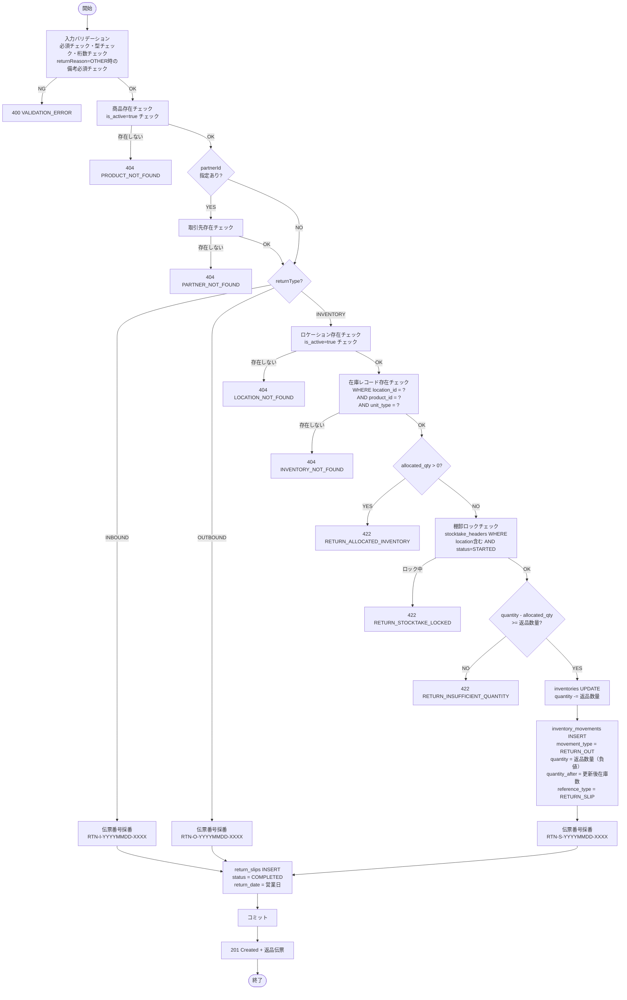
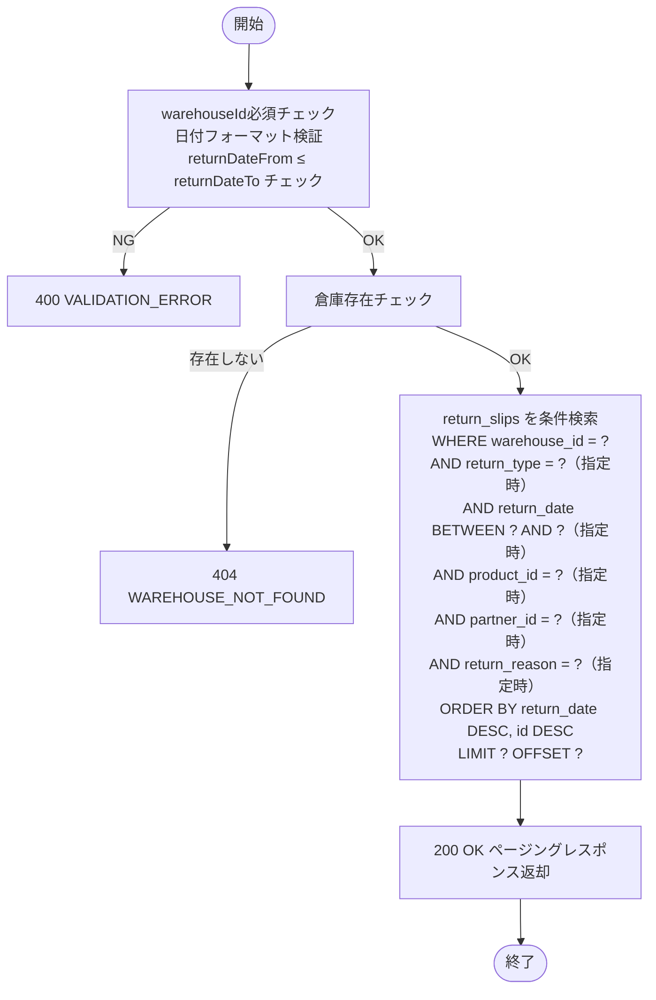

# 機能設計書 — API設計 返品管理（RTN-001〜002）

> 共通仕様（ベースURL・認証・エラーフォーマット・ページング）は [`_standard-api.md`](_standard-api.md) を参照。
> 返品の業務フロー・ビジネスルールは [`../functional-requirements/08-returns.md`](../functional-requirements/08-returns.md) を参照。

---

## ステータスコード定義（SSOT）

| コード | 表示名 | 説明 |
|--------|--------|------|
| `REGISTERED` | 登録済 | 返品伝票が登録された状態 |
| `COMPLETED` | 完了 | 返品処理が完了した状態（在庫返品の場合は在庫減算も完了） |

> 返品は登録と同時にステータスが `COMPLETED` になる即時処理フロー。`REGISTERED` は将来の承認フロー導入時に使用する予約ステータス。

---

## 返品理由コード定義（SSOT）

| 理由コード | 理由名 |
|-----------|--------|
| `QUALITY_DEFECT` | 品質不良 |
| `EXCESS_QUANTITY` | 数量過剰 |
| `WRONG_DELIVERY` | 誤配送 |
| `EXPIRED` | 期限切れ |
| `DAMAGED` | 破損 |
| `OTHER` | その他 |

---

## API-RTN-001: 返品登録

### 1. API概要

| 項目 | 内容 |
|------|------|
| **API ID** | `API-RTN-001` |
| **API名** | 返品登録 |
| **メソッド** | `POST` |
| **パス** | `/api/v1/returns` |
| **認証** | 要 |
| **対象ロール** | SYSTEM_ADMIN, WAREHOUSE_MANAGER, WAREHOUSE_STAFF |
| **概要** | 返品伝票を登録する。1伝票1商品。返品種別に応じて在庫操作（在庫返品の場合のみ即時減算）を行い、ステータスは `COMPLETED` で確定する。 |
| **関連画面** | RTN-001（返品登録画面） |

---

### 2. リクエスト仕様

#### リクエストボディ

```json
{
  "returnType": "INVENTORY",
  "productId": 123,
  "quantity": 10,
  "unitType": "CASE",
  "locationId": 456,
  "partnerId": 789,
  "returnReason": "QUALITY_DEFECT",
  "returnReasonNote": "外装に破れあり",
  "relatedSlipNumber": "INB-20260318-0001",
  "lotNumber": "LOT-001",
  "expiryDate": "2026-12-31"
}
```

#### フィールド定義

| フィールド名 | 型 | 必須 | バリデーション | 説明 |
|------------|-----|:----:|-------------|------|
| `returnType` | String | ○ | `INBOUND` / `INVENTORY` / `OUTBOUND` | 返品種別 |
| `productId` | Long | ○ | 必須・存在チェック・有効商品 | 商品ID |
| `quantity` | Integer | ○ | 1以上999999以下 | 返品数量 |
| `unitType` | String | ○ | `CASE` / `BALL` / `PIECE` | 荷姿 |
| `locationId` | Long | 条件必須 | `returnType=INVENTORY` の場合必須・存在チェック | ロケーションID（在庫返品の場合のみ） |
| `partnerId` | Long | — | 存在チェック（指定時） | 取引先ID（任意） |
| `returnReason` | String | ○ | 返品理由コード定義のいずれか | 返品理由 |
| `returnReasonNote` | String | 条件必須 | `returnReason=OTHER` の場合必須・最大500文字 | 返品理由備考（`OTHER` 選択時は必須、それ以外は任意） |
| `relatedSlipNumber` | String | — | 最大50文字 | 関連伝票番号（入荷返品: 入荷伝票番号、出荷返品: 出荷伝票番号） |
| `lotNumber` | String | — | 最大100文字 | ロット番号（任意） |
| `expiryDate` | String | — | `yyyy-MM-dd` 形式 | 賞味/使用期限日（任意） |

> `warehouseId` はフロントエンドのグローバルヘッダーで選択中の倉庫IDをリクエストヘッダーまたはJWTコンテキストから取得する（入荷管理と同様）。

---

### 3. レスポンス仕様

#### 成功レスポンス: `201 Created`

```json
{
  "id": 1,
  "slipNumber": "RTN-S-20260318-0001",
  "returnType": "INVENTORY",
  "warehouseId": 1,
  "warehouseCode": "WH-001",
  "warehouseName": "東京DC",
  "productId": 123,
  "productCode": "PRD-0001",
  "productName": "テスト商品A",
  "quantity": 10,
  "unitType": "CASE",
  "locationId": 456,
  "locationCode": "A-01-01",
  "partnerId": 789,
  "partnerCode": "SUP-0001",
  "partnerName": "株式会社ABC商事",
  "returnReason": "QUALITY_DEFECT",
  "returnReasonNote": "外装に破れあり",
  "relatedSlipNumber": "INB-20260318-0001",
  "lotNumber": "LOT-001",
  "expiryDate": "2026-12-31",
  "returnDate": "2026-03-18",
  "status": "COMPLETED",
  "createdAt": "2026-03-18T10:30:00+09:00",
  "createdBy": 10,
  "createdByName": "山田 太郎"
}
```

#### フィールド定義

| フィールド名 | 型 | 説明 |
|------------|-----|------|
| `id` | Long | 返品伝票ID |
| `slipNumber` | String | 返品伝票番号 |
| `returnType` | String | 返品種別（`INBOUND` / `INVENTORY` / `OUTBOUND`） |
| `warehouseId` | Long | 倉庫ID |
| `warehouseCode` | String | 倉庫コード |
| `warehouseName` | String | 倉庫名 |
| `productId` | Long | 商品ID |
| `productCode` | String | 商品コード |
| `productName` | String | 商品名 |
| `quantity` | Integer | 返品数量 |
| `unitType` | String | 荷姿 |
| `locationId` | Long | ロケーションID（在庫返品の場合のみ） |
| `locationCode` | String | ロケーションコード（在庫返品の場合のみ） |
| `partnerId` | Long | 取引先ID |
| `partnerCode` | String | 取引先コード |
| `partnerName` | String | 取引先名 |
| `returnReason` | String | 返品理由コード |
| `returnReasonNote` | String | 返品理由備考 |
| `relatedSlipNumber` | String | 関連伝票番号 |
| `lotNumber` | String | ロット番号 |
| `expiryDate` | String | 賞味/使用期限日 |
| `returnDate` | String | 返品日（営業日。`yyyy-MM-dd`） |
| `status` | String | ステータス |
| `createdAt` | String | 登録日時（ISO 8601） |
| `createdBy` | Long | 登録者ID |
| `createdByName` | String | 登録者名 |

#### エラーレスポンス

| HTTPステータス | エラーコード | 発生条件 |
|-------------|------------|---------|
| `400` | `VALIDATION_ERROR` | 必須項目不足・型エラー・桁数超過・返品理由 `OTHER` 時に備考未入力 |
| `401` | `UNAUTHORIZED` | 未認証 |
| `403` | `FORBIDDEN` | VIEWER ロールでのアクセス |
| `404` | `PRODUCT_NOT_FOUND` | 指定の商品が存在しない |
| `404` | `LOCATION_NOT_FOUND` | 指定のロケーションが存在しない（在庫返品時） |
| `404` | `PARTNER_NOT_FOUND` | 指定の取引先が存在しない |
| `404` | `INVENTORY_NOT_FOUND` | 対象在庫レコードが存在しない（在庫返品時） |
| `422` | `RETURN_ALLOCATED_INVENTORY` | 引当済み在庫は返品できません |
| `422` | `RETURN_STOCKTAKE_LOCKED` | 棚卸ロック中のロケーションからは返品できません |
| `422` | `RETURN_INSUFFICIENT_QUANTITY` | 返品数量が在庫数を超えています |

---

### 4. 業務ロジック



**ビジネスルール**:

| # | ルール | エラーコード |
|---|--------|------------|
| 1 | `returnType` は `INBOUND` / `INVENTORY` / `OUTBOUND` のいずれか | `VALIDATION_ERROR` |
| 2 | `returnType=INVENTORY` の場合、`locationId` は必須 | `VALIDATION_ERROR` |
| 3 | `returnReason=OTHER` の場合、`returnReasonNote` は必須 | `VALIDATION_ERROR` |
| 4 | 商品の `is_active=false` は返品登録不可 | `VALIDATION_ERROR` (details: productId) |
| 5 | 在庫返品: 対象在庫（location_id + product_id + unit_type）が存在しなければならない | `INVENTORY_NOT_FOUND` |
| 6 | 在庫返品: `allocated_qty > 0` の在庫からの返品は不可 | `RETURN_ALLOCATED_INVENTORY` |
| 7 | 在庫返品: 棚卸ロック中のロケーションからの返品は不可 | `RETURN_STOCKTAKE_LOCKED` |
| 8 | 在庫返品: 返品数量が在庫の利用可能数（`quantity - allocated_qty`）を超えてはならない | `RETURN_INSUFFICIENT_QUANTITY` |
| 9 | 入荷返品・出荷返品: 在庫操作なし（inventory_movements にも記録しない） | — |
| 10 | 登録と同時にステータスは `COMPLETED` で確定（即時処理） | — |
| 11 | `return_date` は登録時の現在営業日（`business_dates.business_date`）を自動セット | — |

**伝票番号採番ルール**:

- 形式: `RTN-{T}-YYYYMMDD-XXXX`
  - `{T}`: 返品種別プレフィックス（`I` = 入荷返品、`S` = 在庫返品、`O` = 出荷返品）
  - `YYYYMMDD`: 登録日（システム日付）
  - `XXXX`: 当日の返品伝票通番（4桁ゼロ埋め、種別ごとではなく全種別通し番号）
- 採番は DB シーケンスまたは SELECT FOR UPDATE による排他制御で重複を防ぐ

**在庫への影響（テーブル更新サマリー — 在庫返品のみ）**:

| テーブル | 操作 | 内容 |
|---------|------|------|
| `return_slips` | INSERT | 返品伝票の全情報を登録。`status = COMPLETED` |
| `inventories` | UPDATE | `quantity -= 返品数量`（在庫返品のみ） |
| `inventory_movements` | INSERT | `movement_type = RETURN_OUT`、`quantity` = 返品数量（負値）、`quantity_after` = 更新後在庫数、`reference_type = RETURN_SLIP`（在庫返品のみ） |

---

### 5. 補足事項

- 在庫返品の在庫減算と伝票登録は同一トランザクション内で処理する。
- `inventories` の更新は楽観的ロック（`@Version`）で並行更新の整合性を保証する。楽観的ロック失敗時はリトライ（最大3回）後、500 エラーとする。
- 登録時に `warehouse_code`, `warehouse_name`, `product_code`, `product_name`, `partner_code`, `partner_name` をマスタからコピーして保持する（マスタ変更後も伝票情報を保全するため）。
- `created_by`, `updated_by` はJWTから取得したユーザーIDをセットする。
- 返品伝票は登録後の修正・削除不可。誤登録の場合は在庫訂正（API-INV-004）で対応する。
- `inventory_movements` は追記専用テーブル（UPDATE/DELETE 禁止）。

---

---

## API-RTN-002: 返品一覧取得

### 1. API概要

| 項目 | 内容 |
|------|------|
| **API ID** | `API-RTN-002` |
| **API名** | 返品一覧取得 |
| **メソッド** | `GET` |
| **パス** | `/api/v1/returns` |
| **認証** | 要 |
| **対象ロール** | SYSTEM_ADMIN, WAREHOUSE_MANAGER, WAREHOUSE_STAFF |
| **概要** | 指定倉庫の返品伝票をページング形式で取得する。返品種別・返品日・商品・取引先・返品理由等の条件で絞り込みが可能。レポートAPI（RPT-18）と兼用する。 |
| **関連画面** | —（レポートAPI兼用） |

---

### 2. リクエスト仕様

#### クエリパラメータ

| パラメータ名 | 型 | 必須 | デフォルト | 説明 |
|------------|-----|:----:|----------|------|
| `warehouseId` | Long | ○ | — | 倉庫ID |
| `returnType` | String | — | — | 返品種別（`INBOUND` / `INVENTORY` / `OUTBOUND`） |
| `returnDateFrom` | String | — | — | 返品日From（`yyyy-MM-dd`） |
| `returnDateTo` | String | — | — | 返品日To（`yyyy-MM-dd`） |
| `productId` | Long | — | — | 商品ID |
| `partnerId` | Long | — | — | 取引先ID |
| `returnReason` | String | — | — | 返品理由コード |
| `page` | Integer | — | `0` | ページ番号（0始まり） |
| `size` | Integer | — | `20` | 1ページあたりの件数（上限100） |
| `sort` | String | — | `returnDate,desc` | ソート指定 |

---

### 3. レスポンス仕様

#### 成功レスポンス: `200 OK`

```json
{
  "content": [
    {
      "id": 1,
      "slipNumber": "RTN-S-20260318-0001",
      "returnType": "INVENTORY",
      "warehouseCode": "WH-001",
      "productCode": "PRD-0001",
      "productName": "テスト商品A",
      "quantity": 10,
      "unitType": "CASE",
      "locationCode": "A-01-01",
      "partnerCode": "SUP-0001",
      "partnerName": "株式会社ABC商事",
      "returnReason": "QUALITY_DEFECT",
      "returnReasonNote": "外装に破れあり",
      "relatedSlipNumber": "INB-20260318-0001",
      "returnDate": "2026-03-18",
      "status": "COMPLETED",
      "createdAt": "2026-03-18T10:30:00+09:00",
      "createdByName": "山田 太郎"
    }
  ],
  "page": 0,
  "size": 20,
  "totalElements": 15,
  "totalPages": 1
}
```

#### content 各要素のフィールド定義

| フィールド名 | 型 | 説明 |
|------------|-----|------|
| `id` | Long | 返品伝票ID |
| `slipNumber` | String | 返品伝票番号 |
| `returnType` | String | 返品種別 |
| `warehouseCode` | String | 倉庫コード |
| `productCode` | String | 商品コード |
| `productName` | String | 商品名 |
| `quantity` | Integer | 返品数量 |
| `unitType` | String | 荷姿 |
| `locationCode` | String | ロケーションコード（在庫返品の場合のみ。それ以外はnull） |
| `partnerCode` | String | 取引先コード |
| `partnerName` | String | 取引先名 |
| `returnReason` | String | 返品理由コード |
| `returnReasonNote` | String | 返品理由備考 |
| `relatedSlipNumber` | String | 関連伝票番号 |
| `returnDate` | String | 返品日（`yyyy-MM-dd`） |
| `status` | String | ステータス |
| `createdAt` | String | 登録日時（ISO 8601） |
| `createdByName` | String | 登録者名 |

#### エラーレスポンス

| HTTPステータス | エラーコード | 発生条件 |
|-------------|------------|---------|
| `400` | `VALIDATION_ERROR` | `warehouseId` が未指定、または日付フォーマット不正 |
| `401` | `UNAUTHORIZED` | 未認証 |
| `404` | `WAREHOUSE_NOT_FOUND` | 指定の倉庫が存在しない |

---

### 4. 業務ロジック



**ビジネスルール**:

| # | ルール |
|---|--------|
| 1 | `warehouseId` は必須。未指定時は 400 エラー。 |
| 2 | `returnDateFrom` と `returnDateTo` は両方または片方のみ指定可。FromがToより後の場合は 400 エラー。 |
| 3 | `returnType` は定義外の値を指定した場合は 400 エラー。 |
| 4 | `returnReason` は定義外の値を指定した場合は 400 エラー。 |

---

### 5. 補足事項

- `createdByName` は `users` テーブルとJOINして取得する。
- デフォルトソートは `return_date DESC, id DESC`（新しい返品が先頭）。
- 件数が多い場合のパフォーマンス対策として、`INDEX (warehouse_id, return_date)` が有効に使われるよう検索条件を設計する。

---

---

## エラーコード一覧（返品管理）

| エラーコード | HTTPステータス | 説明 |
|-----------|-------------|------|
| `RETURN_ALLOCATED_INVENTORY` | 422 | 引当済み在庫は返品できません |
| `RETURN_STOCKTAKE_LOCKED` | 422 | 棚卸ロック中のロケーションからは返品できません |
| `RETURN_INSUFFICIENT_QUANTITY` | 422 | 返品数量が在庫数を超えています |
