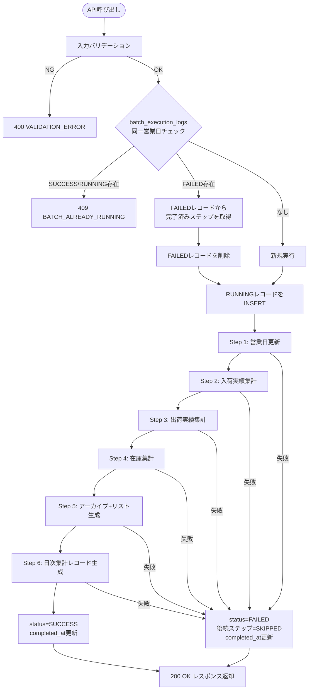
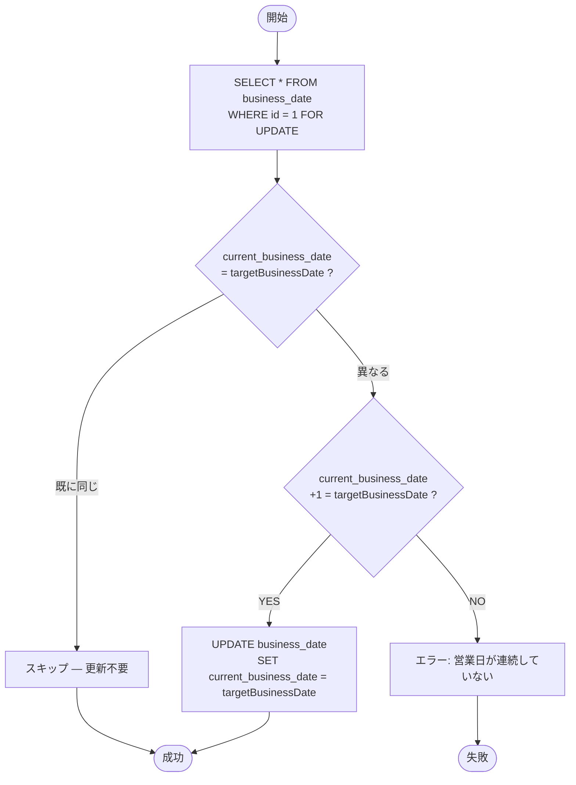
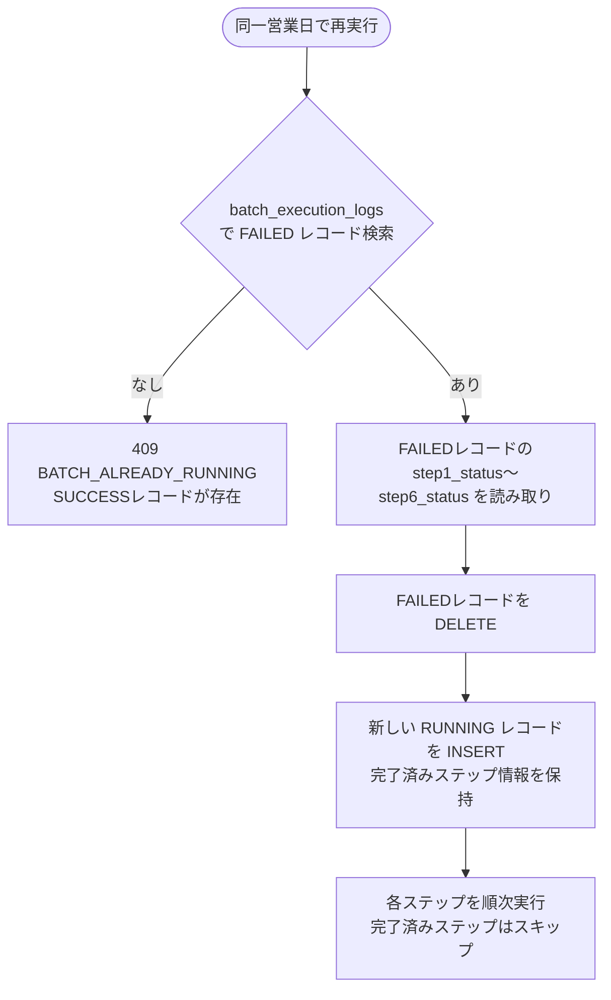

# 機能設計書 — バッチ設計 日替処理（BAT-001）

## 1. バッチ概要

| 項目 | 内容 |
|------|------|
| **バッチID** | `BAT-001` |
| **バッチ名** | 日替処理（Daily Close） |
| **実行方式** | APIリクエスト経由の同期実行（`POST /api/v1/batch/daily-close`） |
| **実行権限** | SYSTEM_ADMIN, WAREHOUSE_MANAGER |
| **入力** | `targetBusinessDate`（処理対象営業日） |
| **処理時間目安** | 数秒〜数十秒 |
| **API仕様** | [API-09-batch.md](API-09-batch.md) API-BAT-001 を参照 |
| **画面仕様** | [SCR-11-batch.md](SCR-11-batch.md) BAT-001 を参照 |
| **業務要件** | [functional-requirements/06-batch-processing.md](../functional-requirements/06-batch-processing.md) を参照 |

---

## 2. 処理フロー全体



> **注記**: 業務要件では5ステップだが、実装上は「日次集計レコード生成」を独立した Step 6 として管理する。Step 6 は Steps 2〜5 の集計結果を `daily_summary_records` に統合する。

---

## 3. トランザクション設計

### 3.1 トランザクション境界

各ステップは **独立したトランザクション** で実行する。ステップ間は `batch_execution_logs` の `stepN_status` を直接更新（各ステップの成功直後に COMMIT）して進捗を永続化する。

```
[Step 1 トランザクション]  → COMMIT → stepN_status更新 → COMMIT
[Step 2 トランザクション]  → COMMIT → stepN_status更新 → COMMIT
...
```

### 3.2 ステップステータス更新の実装

```java
@Service
@RequiredArgsConstructor
public class DailyCloseService {

    private final BatchExecutionLogRepository logRepository;
    private final PlatformTransactionManager txManager;

    public BatchResultResponse execute(LocalDate targetBusinessDate, Long executedBy) {
        // 1. 二重実行チェック + RUNNINGレコード作成（独立トランザクション）
        BatchExecutionLog log = initExecution(targetBusinessDate, executedBy);

        // 2. 各ステップを順次実行
        StepResult[] results = new StepResult[6];
        boolean[] previouslyCompleted = loadPreviouslyCompletedSteps(log);

        for (int step = 1; step <= 6; step++) {
            if (previouslyCompleted[step - 1]) {
                results[step - 1] = StepResult.skipped();
                continue;
            }
            results[step - 1] = executeStepInNewTransaction(step, targetBusinessDate, log.getId());
            updateStepStatus(log.getId(), step, results[step - 1]);

            if (results[step - 1].isFailed()) {
                markRemainingAsSkipped(log.getId(), step + 1);
                return buildFailedResponse(log, results);
            }
        }

        // 3. 全ステップ成功
        completeExecution(log.getId());
        return buildSuccessResponse(log, results, targetBusinessDate);
    }
}
```

### 3.3 ステップステータス更新SQL

各ステップ完了後に即座に実行（専用トランザクション）:

```sql
-- ステップN成功時
UPDATE batch_execution_logs
SET step{N}_status = 'SUCCESS'
WHERE id = :logId;

-- ステップN失敗時
UPDATE batch_execution_logs
SET step{N}_status = 'FAILED',
    error_message = :errorMessage,
    status = 'FAILED',
    completed_at = NOW()
WHERE id = :logId;

-- 後続ステップのSKIPPED設定
UPDATE batch_execution_logs
SET step{M}_status = 'SKIPPED'  -- M = N+1 ~ 6
WHERE id = :logId;
```

---

## 4. 各ステップ詳細設計

### Step 1: 営業日更新

| 項目 | 内容 |
|------|------|
| **目的** | `business_date` テーブルの `current_business_date` を `targetBusinessDate` に更新する |
| **対象テーブル** | `business_date` |
| **トランザクション** | 独立（READ COMMITTED） |
| **冪等性** | あり。既に更新済みの場合はスキップ |

#### 処理フロー



#### SQL

```sql
-- 排他ロック取得
SELECT current_business_date FROM business_date WHERE id = 1 FOR UPDATE;

-- 冪等性チェック: 既に更新済みならスキップ
-- current_business_date = targetBusinessDate → スキップ

-- 連続性チェック: current_business_date + 1 = targetBusinessDate であること
-- 満たさない場合はエラー（営業日が2日以上飛ぶことを防止）

-- 更新
UPDATE business_date
SET current_business_date = :targetBusinessDate,
    updated_at = NOW(),
    updated_by = :executedBy
WHERE id = 1;
```

#### ビジネスルール

| # | ルール |
|---|--------|
| 1 | `current_business_date + 1日 = targetBusinessDate` でない場合はエラー（営業日スキップ防止） |
| 2 | `current_business_date = targetBusinessDate` の場合はスキップ（冪等性：再実行時に二重進行しない） |
| 3 | `SELECT ... FOR UPDATE` で排他制御（複数ユーザーの同時実行を防止） |
| 4 | 営業日カレンダーは管理しない。土日・祝日を跨ぐ場合は、金曜→土曜、土曜→日曜、日曜→月曜の順に3回日替処理を実行する運用とする。`targetBusinessDate` をユーザーが指定するため、運用ルールとして周知する |

---

### Step 2: 入荷実績集計

| 項目 | 内容 |
|------|------|
| **目的** | 対象営業日に入庫完了した入荷伝票を倉庫別に集計して `inbound_summaries` に保存する |
| **対象テーブル** | 読取: `inbound_slips`, `inbound_slip_lines` / 書込: `inbound_summaries` |
| **トランザクション** | 独立（READ COMMITTED） |
| **冪等性** | `ON CONFLICT DO UPDATE` で冪等 |

#### SQL

```sql
-- 入荷実績を倉庫別に集計して INSERT（冪等: 既存は UPDATE）
INSERT INTO inbound_summaries (
    business_date,
    warehouse_id,
    warehouse_code,
    inbound_count,
    inbound_line_count,
    inbound_quantity_total,
    created_at
)
SELECT
    :targetBusinessDate,
    s.warehouse_id,
    w.warehouse_code,
    COUNT(DISTINCT s.id),                          -- 入庫完了件数（ヘッダ単位）
    COUNT(l.id),                                   -- 入庫完了明細件数
    COALESCE(SUM(l.inspected_qty * CASE
        WHEN l.unit_type = 'CASE' THEN p.case_quantity * p.ball_quantity
        WHEN l.unit_type = 'BALL' THEN p.ball_quantity
        ELSE 1
    END), 0),                                      -- 入庫数量合計（バラ換算）
    NOW()
FROM inbound_slips s
JOIN inbound_slip_lines l ON l.inbound_slip_id = s.id
JOIN warehouses w ON w.id = s.warehouse_id
JOIN products p ON p.id = l.product_id
WHERE s.status = 'STORED'
  AND l.stored_at::date = :targetBusinessDate
GROUP BY s.warehouse_id, w.warehouse_code
ON CONFLICT (business_date, warehouse_id)
DO UPDATE SET
    inbound_count = EXCLUDED.inbound_count,
    inbound_line_count = EXCLUDED.inbound_line_count,
    inbound_quantity_total = EXCLUDED.inbound_quantity_total;
```

#### 補足

- `stored_at::date` で入庫完了日を判定（`stored_at` は `inbound_slip_lines` の入庫確定日時カラム。ヘッダの `inbound_slips` には `stored_at` カラムは存在しないため、明細の `stored_at` で判定する）
- バラ換算は `products` テーブルの `case_quantity`（ケース入数）× `ball_quantity`（ボール入数）を使用。CASE→バラは `case_quantity * ball_quantity`、BALL→バラは `ball_quantity`
- 対象営業日に入庫完了データが0件の場合は集計レコードを生成しない（空INSERTなし）

---

### Step 3: 出荷実績集計

| 項目 | 内容 |
|------|------|
| **目的** | 対象営業日に出荷完了した出荷伝票を倉庫別に集計して `outbound_summaries` に保存する |
| **対象テーブル** | 読取: `outbound_slips`, `outbound_slip_lines` / 書込: `outbound_summaries` |
| **トランザクション** | 独立（READ COMMITTED） |
| **冪等性** | `ON CONFLICT DO UPDATE` で冪等 |

#### SQL

```sql
INSERT INTO outbound_summaries (
    business_date,
    warehouse_id,
    warehouse_code,
    outbound_count,
    outbound_line_count,
    outbound_quantity_total,
    created_at
)
SELECT
    :targetBusinessDate,
    s.warehouse_id,
    w.warehouse_code,
    COUNT(DISTINCT s.id),
    COUNT(l.id),
    COALESCE(SUM(l.shipped_qty * CASE
        WHEN l.unit_type = 'CASE' THEN p.case_quantity * p.ball_quantity
        WHEN l.unit_type = 'BALL' THEN p.ball_quantity
        ELSE 1
    END), 0),
    NOW()
FROM outbound_slips s
JOIN outbound_slip_lines l ON l.outbound_slip_id = s.id
JOIN warehouses w ON w.id = s.warehouse_id
JOIN products p ON p.id = l.product_id
WHERE s.status = 'SHIPPED'
  AND s.shipped_at::date = :targetBusinessDate
GROUP BY s.warehouse_id, w.warehouse_code
ON CONFLICT (business_date, warehouse_id)
DO UPDATE SET
    outbound_count = EXCLUDED.outbound_count,
    outbound_line_count = EXCLUDED.outbound_line_count,
    outbound_quantity_total = EXCLUDED.outbound_quantity_total;
```

---

### Step 4: 在庫集計

| 項目 | 内容 |
|------|------|
| **目的** | 対象営業日末時点の在庫残高を倉庫・商品・荷姿単位で `inventory_snapshots` に保存する |
| **対象テーブル** | 読取: `inventories`, `warehouses`, `products`, `locations` / 書込: `inventory_snapshots` |
| **トランザクション** | 独立（READ COMMITTED） |
| **冪等性** | `ON CONFLICT DO UPDATE` で冪等 |

#### SQL

```sql
-- 既存のスナップショットを削除（冪等性: 再実行時にUPSERTで対応）
INSERT INTO inventory_snapshots (
    business_date,
    warehouse_id,
    warehouse_code,
    product_id,
    product_code,
    product_name,
    unit_type,
    total_quantity,
    created_at
)
SELECT
    :targetBusinessDate,
    loc.warehouse_id,
    w.warehouse_code,
    i.product_id,
    p.product_code,
    p.product_name,
    i.unit_type,
    SUM(i.quantity),         -- 在庫数量合計（荷姿単位のまま集計。バラ換算はStep 6で実施）
    NOW()
FROM inventories i
JOIN locations loc ON loc.id = i.location_id
JOIN warehouses w ON w.id = loc.warehouse_id
JOIN products p ON p.id = i.product_id
WHERE i.quantity > 0
GROUP BY loc.warehouse_id, w.warehouse_code,
         i.product_id, p.product_code, p.product_name,
         i.unit_type
ON CONFLICT (business_date, warehouse_id, product_id, unit_type)
DO UPDATE SET
    total_quantity = EXCLUDED.total_quantity,
    product_name = EXCLUDED.product_name;
```

#### 補足

- 在庫スナップショットは **現在の在庫テーブルのその時点の値** を記録する（日時ベースの履歴計算ではない）
- `quantity > 0` の在庫のみ対象（在庫0のレコードはスナップショットに含めない）
- `product_name` は `DO UPDATE` で最新化（商品名変更への対応）

---

### Step 5: アーカイブ + 未入荷・未出荷リスト生成

| 項目 | 内容 |
|------|------|
| **目的** | ① 2ヶ月以上前の完了済みトランデータをバックアップテーブルに複製<br/>② 未入荷リスト・未出荷リストを生成 |
| **対象テーブル** | 読取/書込: 下記参照 |
| **トランザクション** | 独立（READ COMMITTED） |
| **冪等性** | バックアップは `ON CONFLICT DO NOTHING`、リストは `DELETE + INSERT` |

#### 5a. トランデータバックアップ

```sql
-- 入荷伝票バックアップ（2ヶ月以上前の入庫完了データ）
INSERT INTO inbound_slips_backup
SELECT s.*, NOW() AS backed_up_at, :logId AS batch_execution_log_id
FROM inbound_slips s
WHERE s.status = 'STORED'
  AND s.updated_at < :targetBusinessDate::timestamp - INTERVAL '2 months'
ON CONFLICT DO NOTHING;

-- 入荷伝票明細バックアップ（親がバックアップ対象のもの）
INSERT INTO inbound_slip_lines_backup
SELECT l.*, NOW() AS backed_up_at, :logId AS batch_execution_log_id
FROM inbound_slip_lines l
WHERE l.inbound_slip_id IN (
    SELECT id FROM inbound_slips
    WHERE status = 'STORED'
      AND updated_at < :targetBusinessDate::timestamp - INTERVAL '2 months'
)
ON CONFLICT DO NOTHING;

-- 出荷伝票バックアップ
INSERT INTO outbound_slips_backup
SELECT s.*, NOW() AS backed_up_at, :logId AS batch_execution_log_id
FROM outbound_slips s
WHERE s.status = 'SHIPPED'
  AND s.updated_at < :targetBusinessDate::timestamp - INTERVAL '2 months'
ON CONFLICT DO NOTHING;

-- 出荷伝票明細バックアップ
INSERT INTO outbound_slip_lines_backup
SELECT l.*, NOW() AS backed_up_at, :logId AS batch_execution_log_id
FROM outbound_slip_lines l
WHERE l.outbound_slip_id IN (
    SELECT id FROM outbound_slips
    WHERE status = 'SHIPPED'
      AND updated_at < :targetBusinessDate::timestamp - INTERVAL '2 months'
)
ON CONFLICT DO NOTHING;

-- 在庫移動バックアップ
INSERT INTO inventory_movements_backup
SELECT m.*, NOW() AS backed_up_at, :logId AS batch_execution_log_id
FROM inventory_movements m
WHERE m.executed_at < :targetBusinessDate::timestamp - INTERVAL '2 months'
ON CONFLICT DO NOTHING;
```

#### 5a. 補足事項

- 元テーブルのデータは現時点では削除しない（参照整合性維持のため）。データ肥大化が問題になった場合は、バックアップ成功済みレコードの削除バッチを将来フェーズで追加する。その際はFK参照（明細テーブル）を含めた削除順序の設計が必要。

#### 5b. 未入荷リスト生成

```sql
-- 既存レコードを削除（冪等性: 再実行時に再生成）
DELETE FROM unreceived_list_records
WHERE batch_business_date = :targetBusinessDate;

-- 未入荷リスト生成
-- 対象: 入荷予定日が targetBusinessDate 以前で、入庫完了していない入荷明細
INSERT INTO unreceived_list_records (
    batch_business_date, inbound_slip_id, slip_number,
    planned_date, warehouse_code, partner_code, partner_name,
    product_code, product_name, unit_type, planned_qty,
    current_status, created_at
)
SELECT
    :targetBusinessDate,
    s.id,
    s.slip_number,
    s.planned_date,
    w.warehouse_code,
    pr.partner_code,
    pr.partner_name,
    p.product_code,
    p.product_name,
    l.unit_type,
    l.planned_qty,
    s.status,
    NOW()
FROM inbound_slips s
JOIN inbound_slip_lines l ON l.inbound_slip_id = s.id
JOIN warehouses w ON w.id = s.warehouse_id
LEFT JOIN partners pr ON pr.id = s.partner_id
JOIN products p ON p.id = l.product_id
WHERE s.planned_date <= :targetBusinessDate
  AND s.status NOT IN ('STORED', 'CANCELLED');
```

#### 5c. 未出荷リスト生成

```sql
-- 既存レコードを削除（冪等性）
DELETE FROM unshipped_list_records
WHERE batch_business_date = :targetBusinessDate;

-- 未出荷リスト生成
-- 対象: 出荷予定日が targetBusinessDate 以前で、出荷完了していない出荷明細
INSERT INTO unshipped_list_records (
    batch_business_date, outbound_slip_id, slip_number,
    planned_date, warehouse_code, partner_code, partner_name,
    product_code, product_name, unit_type, ordered_qty,
    current_status, created_at
)
SELECT
    :targetBusinessDate,
    s.id,
    s.slip_number,
    s.planned_date,
    w.warehouse_code,
    pr.partner_code,
    pr.partner_name,
    p.product_code,
    p.product_name,
    l.unit_type,
    l.ordered_qty,
    s.status,
    NOW()
FROM outbound_slips s
JOIN outbound_slip_lines l ON l.outbound_slip_id = s.id
JOIN warehouses w ON w.id = s.warehouse_id
LEFT JOIN partners pr ON pr.id = s.partner_id
JOIN products p ON p.id = l.product_id
WHERE s.planned_date <= :targetBusinessDate
  AND s.status NOT IN ('SHIPPED', 'CANCELLED');
```

---

### Step 6: 日次集計レコード生成

| 項目 | 内容 |
|------|------|
| **目的** | Steps 2〜5 の集計結果と返品データを統合して `daily_summary_records` に保存する |
| **対象テーブル** | 読取: `inbound_summaries`, `outbound_summaries`, `inventory_snapshots`, `return_slips`, `unreceived_list_records`, `unshipped_list_records` / 書込: `daily_summary_records` |
| **トランザクション** | 独立（READ COMMITTED） |
| **冪等性** | `ON CONFLICT DO UPDATE` で冪等 |

#### SQL

```sql
-- 対象倉庫の一覧を取得（アクティブ倉庫）
-- 各倉庫について日次集計レコードを生成
INSERT INTO daily_summary_records (
    business_date,
    warehouse_id,
    warehouse_code,
    inbound_count,
    inbound_line_count,
    inbound_quantity_total,
    outbound_count,
    outbound_line_count,
    outbound_quantity_total,
    return_quantity_total,
    return_count,
    inventory_quantity_total,
    unreceived_count,
    unshipped_count,
    created_at
)
SELECT
    :targetBusinessDate,
    w.id,
    w.warehouse_code,
    -- 入荷実績（Step 2の結果）
    COALESCE(ib.inbound_count, 0),
    COALESCE(ib.inbound_line_count, 0),
    COALESCE(ib.inbound_quantity_total, 0),
    -- 出荷実績（Step 3の結果）
    COALESCE(ob.outbound_count, 0),
    COALESCE(ob.outbound_line_count, 0),
    COALESCE(ob.outbound_quantity_total, 0),
    -- 返品実績（当日の返品を直接集計）
    COALESCE(rt.return_quantity_total, 0),
    COALESCE(rt.return_count, 0),
    -- 在庫総数量（Step 4のスナップショットから合算、バラ換算）
    COALESCE(inv.inventory_quantity_total, 0),
    -- 未入荷・未出荷件数（Step 5の結果）
    COALESCE(ur.unreceived_count, 0),
    COALESCE(us.unshipped_count, 0),
    NOW()
FROM warehouses w
-- 入荷サマリー
LEFT JOIN inbound_summaries ib
    ON ib.business_date = :targetBusinessDate AND ib.warehouse_id = w.id
-- 出荷サマリー
LEFT JOIN outbound_summaries ob
    ON ob.business_date = :targetBusinessDate AND ob.warehouse_id = w.id
-- 返品集計（当日分を直接集計）
LEFT JOIN (
    SELECT
        warehouse_id,
        COUNT(*) AS return_count,
        SUM(r.quantity * CASE
            WHEN r.unit_type = 'CASE' THEN p.case_quantity * p.ball_quantity
            WHEN r.unit_type = 'BALL' THEN p.ball_quantity
            ELSE 1
        END) AS return_quantity_total
    FROM return_slips r
    JOIN products p ON p.id = r.product_id
    WHERE r.return_date = :targetBusinessDate
      AND r.status = 'COMPLETED'
    GROUP BY r.warehouse_id
) rt ON rt.warehouse_id = w.id
-- 在庫スナップショット合算（バラ換算）
LEFT JOIN (
    SELECT
        warehouse_id,
        SUM(sn.total_quantity * CASE
            WHEN sn.unit_type = 'CASE' THEN p.case_quantity * p.ball_quantity
            WHEN sn.unit_type = 'BALL' THEN p.ball_quantity
            ELSE 1
        END) AS inventory_quantity_total
    FROM inventory_snapshots sn
    JOIN products p ON p.id = sn.product_id
    WHERE sn.business_date = :targetBusinessDate
    GROUP BY sn.warehouse_id
) inv ON inv.warehouse_id = w.id
-- 未入荷件数
LEFT JOIN (
    SELECT warehouse_code, COUNT(DISTINCT inbound_slip_id) AS unreceived_count
    FROM unreceived_list_records
    WHERE batch_business_date = :targetBusinessDate
    GROUP BY warehouse_code
) ur ON ur.warehouse_code = w.warehouse_code
-- 未出荷件数
LEFT JOIN (
    SELECT warehouse_code, COUNT(DISTINCT outbound_slip_id) AS unshipped_count
    FROM unshipped_list_records
    WHERE batch_business_date = :targetBusinessDate
    GROUP BY warehouse_code
) us ON us.warehouse_code = w.warehouse_code
WHERE w.is_active = true
ON CONFLICT (business_date, warehouse_id)
DO UPDATE SET
    inbound_count = EXCLUDED.inbound_count,
    inbound_line_count = EXCLUDED.inbound_line_count,
    inbound_quantity_total = EXCLUDED.inbound_quantity_total,
    outbound_count = EXCLUDED.outbound_count,
    outbound_line_count = EXCLUDED.outbound_line_count,
    outbound_quantity_total = EXCLUDED.outbound_quantity_total,
    return_quantity_total = EXCLUDED.return_quantity_total,
    return_count = EXCLUDED.return_count,
    inventory_quantity_total = EXCLUDED.inventory_quantity_total,
    unreceived_count = EXCLUDED.unreceived_count,
    unshipped_count = EXCLUDED.unshipped_count;
```

---

## 5. 再実行（リトライ）設計

### 5.1 再実行フロー



### 5.2 スキップ判定ロジック

```java
private boolean[] loadPreviouslyCompletedSteps(BatchExecutionLog failedLog) {
    if (failedLog == null) {
        return new boolean[]{false, false, false, false, false, false};
    }
    return new boolean[]{
        "SUCCESS".equals(failedLog.getStep1Status()),
        "SUCCESS".equals(failedLog.getStep2Status()),
        "SUCCESS".equals(failedLog.getStep3Status()),
        "SUCCESS".equals(failedLog.getStep4Status()),
        "SUCCESS".equals(failedLog.getStep5Status()),
        "SUCCESS".equals(failedLog.getStep6Status()),
    };
}
```

### 5.3 冪等性の保証

| ステップ | 冪等性の仕組み |
|---------|-------------|
| Step 1 | `current_business_date` が既に `targetBusinessDate` なら UPDATE をスキップ |
| Step 2 | `ON CONFLICT (business_date, warehouse_id) DO UPDATE` |
| Step 3 | `ON CONFLICT (business_date, warehouse_id) DO UPDATE` |
| Step 4 | `ON CONFLICT (business_date, warehouse_id, product_id, unit_type) DO UPDATE` |
| Step 5（バックアップ） | `ON CONFLICT DO NOTHING`（バックアップ済みレコードはスキップ） |
| Step 5（リスト） | `DELETE + INSERT`（対象営業日のリストを全削除して再生成） |
| Step 6 | `ON CONFLICT (business_date, warehouse_id) DO UPDATE` |

---

## 6. エラーハンドリング

### 6.1 ステップ失敗時の動作

```java
private StepResult executeStepInNewTransaction(int stepNumber, LocalDate targetDate, Long logId) {
    TransactionTemplate txTemplate = new TransactionTemplate(txManager);
    txTemplate.setPropagationBehavior(TransactionDefinition.PROPAGATION_REQUIRES_NEW);

    try {
        return txTemplate.execute(status -> {
            switch (stepNumber) {
                case 1: return step1UpdateBusinessDate(targetDate);
                case 2: return step2AggregateInbound(targetDate);
                case 3: return step3AggregateOutbound(targetDate);
                case 4: return step4SnapshotInventory(targetDate);
                case 5: return step5ArchiveAndGenerateLists(targetDate, logId);
                case 6: return step6GenerateDailySummary(targetDate);
                default: throw new IllegalArgumentException("Unknown step: " + stepNumber);
            }
        });
    } catch (Exception e) {
        log.error("Step {} failed for businessDate={}: {}", stepNumber, targetDate, e.getMessage(), e);
        return StepResult.failed(e.getMessage());
    }
}
```

### 6.2 エラー記録

失敗時は以下をDBに記録:
- `stepN_status = 'FAILED'`
- `error_message` = 例外メッセージ（最大1000文字に切り詰め）
- 後続ステップは全て `SKIPPED`
- `status = 'FAILED'`
- `completed_at = NOW()`

---

## 7. パフォーマンス考慮

### 7.1 インデックス活用

| ステップ | 使用インデックス |
|---------|----------------|
| Step 2 | `inbound_slips(status)` + `inbound_slip_lines(stored_at)` |
| Step 3 | `outbound_slips(status, shipped_at)` |
| Step 4 | `inventories(location_id)` + `locations(warehouse_id)` |
| Step 5a | `inbound_slips(status, updated_at)`, `outbound_slips(status, updated_at)`, `inventory_movements(executed_at)` |
| Step 5b | `inbound_slips(planned_date, status)` |
| Step 5c | `outbound_slips(planned_date, status)` |

### 7.2 バッチサイズ考慮

- ShowCase規模（データ件数: 数千〜数万件）では全ステップ合計で数秒〜数十秒で完了する想定
- バックアップ処理（Step 5a）が最も時間を要する可能性があるが、`ON CONFLICT DO NOTHING` により2回目以降は高速
- 将来的にデータ量が増加した場合は、Step 5a にバッチサイズ制限（LIMIT 10000 + ループ）を導入する

---

## 8. `batch_execution_logs` のステップ拡張

業務要件では5ステップだが、実装では6ステップ管理が必要。`batch_execution_logs` テーブルに `step6_status` カラムを追加する。

```sql
ALTER TABLE batch_execution_logs
ADD COLUMN step6_status varchar(20) NULL;

COMMENT ON COLUMN batch_execution_logs.step6_status IS '日次集計レコード生成: SUCCESS / FAILED / SKIPPED';
```

> **data-model/04-batch-tables.md への反映が必要**。

---

## 9. テスト観点

| # | テスト観点 | 確認内容 |
|---|----------|---------|
| 1 | 正常系: 新規実行 | 全6ステップが SUCCESS になること |
| 2 | 正常系: 0件データ | 対象営業日にデータが0件でもエラーにならないこと |
| 3 | 二重実行防止 | SUCCESS レコードが存在する営業日に再実行で 409 が返ること |
| 4 | 再実行: Step 3 失敗→再実行 | Step 1, 2 がスキップされ、Step 3 から再開すること |
| 5 | 冪等性: Step 1 | 再実行で営業日が二重に進まないこと |
| 6 | 冪等性: Step 2〜4 | 再実行で集計レコードが重複しないこと（UPSERT） |
| 7 | 冪等性: Step 5 リスト | 再実行でリストが重複しないこと（DELETE + INSERT） |
| 8 | バックアップ | 2ヶ月以上前のデータのみバックアップされること |
| 9 | 返品データ | Step 6 で当日の返品実績が正しく集計されること |
| 10 | 複数倉庫 | 倉庫別に正しく集計・分離されること |
| 11 | 未入荷/未出荷 | 予定日 ≦ 営業日 かつ未完了のデータのみリストに含まれること |
| 12 | トランザクション分離 | Step 3 失敗時に Step 2 の結果がロールバックされないこと |
