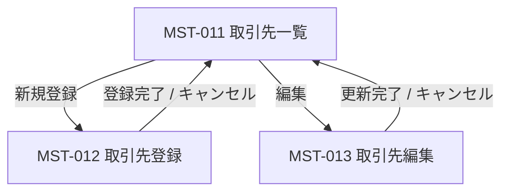

# 機能設計書 — 画面設計 マスタ管理（取引先）

**対象画面**: MST-011〜MST-013（取引先）
**対象ロール**: SYSTEM_ADMIN
**作成日**: 2026-03-13

---

## MST-011 取引先一覧

### 1. 画面概要

| 項目 | 内容 |
|------|------|
| **画面ID** | `MST-011` |
| **画面名** | 取引先一覧 |
| **URL パス** | `/master/partners` |
| **対象ロール** | SYSTEM_ADMIN |
| **概要** | 登録済みの取引先を一覧表示する。種別・有効/無効フラグで絞り込みができ、取引先の新規登録・編集・有効/無効切り替えの起点となる画面。 |

---

### 2. 画面レイアウト

**モックアップ**: [MST-011-partner-list.html](mockups/MST-011-partner-list.html)

```
┌─────────────────────────────────────────────────────────────┐
│ [メタバー] MST-011 | URL: /master/partners | SYSTEM_ADMIN  │
├─────────────────────────────────────────────────────────────┤
│ ヘッダー（WMS | 倉庫切替▼ | ユーザー名 | ログアウト）       │
├──────────┬──────────────────────────────────────────────────┤
│          │ ホーム › マスタ管理 › 取引先一覧                 │
│ マスタ   │──────────────────────────────────────────────────│
│ 管理     │ 取引先一覧                                        │
│  ├取引先 │──────────────────────────────────────────────────│
│  └倉庫   │ [検索フォーム]                                    │
│          │  取引先名: [______]  種別: [▼]  状態: [▼]       │
│ 入荷管理 │  [検索]  [クリア]                                 │
│ 在庫管理 │──────────────────────────────────────────────────│
│ 出荷管理 │ [＋ 新規登録]                    全12件           │
│ バッチ   │──────────┬──────┬──────┬──────┬──────────────────│
│          │ 取引先CD │ 名称 │ 種別 │ 状態 │ 操作            │
│          ├──────────┼──────┼──────┼──────┼──────────────────│
│          │ P-001    │ ○○  │ 仕入先│ 有効 │ [編集][無効化]  │
│          ├──────────┴──────┴──────┴──────┴──────────────────│
│          │              ← 1 2 →   20件/ページ▼             │
└──────────┴──────────────────────────────────────────────────┘
```

**検索フォーム**

| 項目 | 種別 | 備考 |
|------|------|------|
| 取引先コード | テキスト | 前方一致 |
| 取引先名 | テキスト | 部分一致 |
| 種別 | セレクト | すべて / 仕入先 / 出荷先 / 両方 |
| 状態 | セレクト | すべて / 有効のみ / 無効のみ |

**テーブル列**

| 列 | 内容 |
|----|------|
| 取引先コード | クリックで編集画面へ遷移するリンク |
| 取引先名 | |
| 取引先名カナ | |
| 種別 | バッジ表示（仕入先/出荷先/両方） |
| 状態 | バッジ表示（有効/無効） |
| 操作 | [編集] [無効化] または [編集] [有効化] |

---

### 3. 画面項目一覧

| 項目ID | 項目名 | 種別 | 必須 | 初期値 | バリデーション | 備考 |
|--------|--------|------|:----:|--------|--------------|------|
| MST011-S01 | 取引先コード（検索） | テキスト | — | 空 | 最大20文字 | 前方一致検索 |
| MST011-S02 | 取引先名（検索） | テキスト | — | 空 | 最大100文字 | 部分一致検索 |
| MST011-S03 | 種別（検索） | セレクト | — | すべて | — | 仕入先/出荷先/両方/すべて |
| MST011-S04 | 状態（検索） | セレクト | — | すべて | — | 有効のみ/無効のみ/すべて |
| MST011-B01 | 検索ボタン | ボタン | — | — | — | |
| MST011-B02 | クリアボタン | ボタン | — | — | — | 検索条件を初期化 |
| MST011-B03 | 新規登録ボタン | ボタン | — | — | — | MST-012へ遷移 |
| MST011-T01 | 取引先一覧テーブル | テーブル | — | — | — | 20件/ページ |
| MST011-T01-C01 | 取引先コード | 表示 | — | — | — | クリックでMST-013へ遷移 |
| MST011-T01-C02 | 取引先名 | 表示 | — | — | — | |
| MST011-T01-C03 | 取引先名カナ | 表示 | — | — | — | |
| MST011-T01-C04 | 種別 | 表示 | — | — | — | バッジ表示 |
| MST011-T01-C05 | 状態 | 表示 | — | — | — | 有効:緑バッジ / 無効:グレーバッジ |
| MST011-T01-C06 | 編集ボタン | ボタン | — | — | — | MST-013へ遷移 |
| MST011-T01-C07 | 無効化/有効化ボタン | ボタン | — | — | — | 確認ダイアログを表示 |
| MST011-P01 | ページング | ページング | — | 1ページ目 | — | 20件/50件/100件 切替可 |

---

### 4. イベント一覧

| イベントID | トリガー | 処理概要 | 遷移先 / 結果 | 実行可能ロール |
|----------|---------|---------|-------------|-------------|
| `EVT-MST011-001` | 検索ボタンクリック | 入力条件で `GET /api/v1/master/partners` を呼び出し、一覧を再描画 | 同画面リロード（1ページ目） | SYSTEM_ADMIN |
| `EVT-MST011-002` | クリアボタンクリック | 検索条件を初期値にリセット | 同画面（検索フォームリセット） | SYSTEM_ADMIN |
| `EVT-MST011-003` | 新規登録ボタンクリック | MST-012に遷移 | MST-012 取引先登録 | SYSTEM_ADMIN |
| `EVT-MST011-004` | 取引先コードリンククリック | MST-013（編集画面）に遷移 | MST-013 取引先編集 | SYSTEM_ADMIN |
| `EVT-MST011-005` | 編集ボタンクリック | MST-013（編集画面）に遷移 | MST-013 取引先編集 | SYSTEM_ADMIN |
| `EVT-MST011-006` | 無効化ボタンクリック | 確認ダイアログを表示。確認後 `PATCH /api/v1/master/partners/{id}/toggle-active` を呼び出し | 同画面リロード（成功メッセージ表示） | SYSTEM_ADMIN |
| `EVT-MST011-007` | 有効化ボタンクリック | 確認ダイアログを表示。確認後 `PATCH /api/v1/master/partners/{id}/activate` を呼び出し | 同画面リロード（成功メッセージ表示） | SYSTEM_ADMIN |
| `EVT-MST011-008` | ページ番号クリック | 指定ページを `GET /api/v1/master/partners?page={n}` で取得 | 同画面（ページ変更） | SYSTEM_ADMIN |
| `EVT-MST011-009` | 表示件数変更 | 選択件数で再取得 | 同画面リロード | SYSTEM_ADMIN |

---

### 5. メッセージ一覧

| メッセージID | 種別 | 発生条件 | メッセージ文（日本語） |
|------------|------|---------|-------------------|
| `MSG-W-MST011-001` | 警告 | 無効化ボタンクリック時 | この取引先を無効化しますか？無効化すると新規の入荷・出荷登録で選択できなくなります。 |
| `MSG-W-MST011-002` | 警告 | 有効化ボタンクリック時 | この取引先を有効化しますか？ |
| `MSG-S-MST011-001` | 成功 | 無効化完了時 | 取引先を無効化しました。 |
| `MSG-S-MST011-002` | 成功 | 有効化完了時 | 取引先を有効化しました。 |
| `MSG-E-MST011-001` | エラー | API通信エラー時 | データの取得に失敗しました。時間をおいて再度お試しください。 |

---

---

## MST-012 取引先登録

### 1. 画面概要

| 項目 | 内容 |
|------|------|
| **画面ID** | `MST-012` |
| **画面名** | 取引先登録 |
| **URL パス** | `/master/partners/new` |
| **対象ロール** | SYSTEM_ADMIN |
| **概要** | 新規取引先を登録する。取引先コードは一意であり、登録後は変更不可。登録完了後は取引先一覧（MST-011）に戻る。 |

---

### 2. 画面レイアウト

**モックアップ**: [MST-012-partner-new.html](mockups/MST-012-partner-new.html)

```
┌─────────────────────────────────────────────────────────────┐
│ [メタバー] MST-012 | URL: /master/partners/new | SYSTEM_ADMIN│
├─────────────────────────────────────────────────────────────┤
│ ヘッダー                                                     │
├──────────┬──────────────────────────────────────────────────┤
│          │ ホーム › マスタ管理 › 取引先一覧 › 新規登録       │
│ サイドバー│──────────────────────────────────────────────────│
│          │ 取引先登録                                        │
│          │──────────────────────────────────────────────────│
│          │ 基本情報                                          │
│          │  取引先コード *  [__________]                     │
│          │  取引先名 *      [______________________]         │
│          │  取引先名カナ *  [______________________]         │
│          │  種別 *          (●)仕入先 ( )出荷先 ( )両方     │
│          │──────────────────────────────────────────────────│
│          │ 連絡先情報                                        │
│          │  住所            [______________________]         │
│          │  電話番号        [__________]                     │
│          │  担当者名        [__________]                     │
│          │  メールアドレス  [______________________]         │
│          │──────────────────────────────────────────────────│
│          │                          [キャンセル]  [登録]     │
└──────────┴──────────────────────────────────────────────────┘
```

---

### 3. 画面項目一覧

| 項目ID | 項目名 | 種別 | 必須 | 初期値 | バリデーション | 備考 |
|--------|--------|------|:----:|--------|--------------|------|
| MST012-F01 | 取引先コード | テキスト | ○ | 空 | 必須、最大50文字、英数字・ハイフン、一意チェック | 登録後変更不可 |
| MST012-F02 | 取引先名 | テキスト | ○ | 空 | 必須、最大200文字 | |
| MST012-F03 | 取引先名カナ | テキスト | ○ | 空 | 必須、最大200文字、全角カナ | |
| MST012-F04 | 種別 | ラジオ | ○ | 仕入先 | 必須 | 仕入先/出荷先/両方 |
| MST012-F05 | 住所 | テキスト | — | 空 | 最大200文字 | |
| MST012-F06 | 電話番号 | テキスト | — | 空 | 最大20文字、数字・ハイフン | |
| MST012-F07 | 担当者名 | テキスト | — | 空 | 最大50文字 | |
| MST012-F08 | メールアドレス | テキスト | — | 空 | 最大254文字、メール形式 | |
| MST012-B01 | キャンセルボタン | ボタン | — | — | — | MST-011へ戻る |
| MST012-B02 | 登録ボタン | ボタン | — | — | — | バリデーション後 `POST /api/v1/master/partners` |

---

### 4. イベント一覧

| イベントID | トリガー | 処理概要 | 遷移先 / 結果 | 実行可能ロール |
|----------|---------|---------|-------------|-------------|
| `EVT-MST012-001` | 登録ボタンクリック | フォームバリデーション実行。成功時 `POST /api/v1/master/partners` を呼び出し | MST-011（成功メッセージ付き） | SYSTEM_ADMIN |
| `EVT-MST012-002` | キャンセルボタンクリック | 入力を破棄してMST-011へ戻る | MST-011 取引先一覧 | SYSTEM_ADMIN |
| `EVT-MST012-003` | 取引先コードフォーカスアウト | 重複チェック `GET /api/v1/master/partners/exists?partnerCode={code}` | インラインエラー表示 | SYSTEM_ADMIN |

---

### 5. メッセージ一覧

| メッセージID | 種別 | 発生条件 | メッセージ文（日本語） |
|------------|------|---------|-------------------|
| `MSG-E-MST012-001` | エラー | 取引先コード未入力 | 取引先コードは必須です |
| `MSG-E-MST012-002` | エラー | 取引先コード形式エラー | 取引先コードは英数字・ハイフンで入力してください |
| `MSG-E-MST012-003` | エラー | 取引先コード重複 | このコードは既に登録されています |
| `MSG-E-MST012-004` | エラー | 取引先名未入力 | 取引先名は必須です |
| `MSG-E-MST012-005` | エラー | 取引先名カナ未入力 | 取引先名カナは必須です |
| `MSG-E-MST012-006` | エラー | 取引先名カナ形式エラー | 取引先名カナは全角カタカナで入力してください |
| `MSG-E-MST012-007` | エラー | メールアドレス形式エラー | メールアドレスの形式が正しくありません |
| `MSG-S-MST012-001` | 成功 | 登録成功 | 取引先を登録しました。 |

---

---

## MST-013 取引先編集

### 1. 画面概要

| 項目 | 内容 |
|------|------|
| **画面ID** | `MST-013` |
| **画面名** | 取引先編集 |
| **URL パス** | `/master/partners/:id/edit` |
| **対象ロール** | SYSTEM_ADMIN |
| **概要** | 既存取引先の情報を更新する。取引先コードは読み取り専用で変更不可。更新完了後は取引先一覧（MST-011）に戻る。 |

---

### 2. 画面レイアウト

**モックアップ**: [MST-013-partner-edit.html](mockups/MST-013-partner-edit.html)

```
┌─────────────────────────────────────────────────────────────┐
│ [メタバー] MST-013 | URL: /master/partners/:id/edit        │
├─────────────────────────────────────────────────────────────┤
│ ヘッダー                                                     │
├──────────┬──────────────────────────────────────────────────┤
│          │ ホーム › マスタ管理 › 取引先一覧 › 編集          │
│ サイドバー│──────────────────────────────────────────────────│
│          │ 取引先編集                                        │
│          │──────────────────────────────────────────────────│
│          │ 基本情報                                          │
│          │  取引先コード  [P-001] （変更不可）               │
│          │  取引先名 *    [______________________]           │
│          │  取引先名カナ* [______________________]           │
│          │  種別 *        (●)仕入先 ( )出荷先 ( )両方      │
│          │──────────────────────────────────────────────────│
│          │ 連絡先情報                                        │
│          │  住所          [______________________]           │
│          │  電話番号      [__________]                       │
│          │  担当者名      [__________]                       │
│          │  メールアドレス[______________________]           │
│          │──────────────────────────────────────────────────│
│          │                          [キャンセル]  [更新]     │
└──────────┴──────────────────────────────────────────────────┘
```

---

### 3. 画面項目一覧

| 項目ID | 項目名 | 種別 | 必須 | 初期値 | バリデーション | 備考 |
|--------|--------|------|:----:|--------|--------------|------|
| MST013-F01 | 取引先コード | 表示 | — | 取得値 | — | 変更不可（読み取り専用） |
| MST013-F02 | 取引先名 | テキスト | ○ | 取得値 | 必須、最大200文字 | |
| MST013-F03 | 取引先名カナ | テキスト | ○ | 取得値 | 必須、最大200文字、全角カナ | |
| MST013-F04 | 種別 | ラジオ | ○ | 取得値 | 必須 | 仕入先/出荷先/両方 |
| MST013-F05 | 住所 | テキスト | — | 取得値 | 最大200文字 | |
| MST013-F06 | 電話番号 | テキスト | — | 取得値 | 最大20文字、数字・ハイフン | |
| MST013-F07 | 担当者名 | テキスト | — | 取得値 | 最大50文字 | |
| MST013-F08 | メールアドレス | テキスト | — | 取得値 | 最大254文字、メール形式 | |
| MST013-B01 | キャンセルボタン | ボタン | — | — | — | MST-011へ戻る |
| MST013-B02 | 更新ボタン | ボタン | — | — | — | バリデーション後 `PUT /api/v1/master/partners/{id}` |

---

### 4. イベント一覧

| イベントID | トリガー | 処理概要 | 遷移先 / 結果 | 実行可能ロール |
|----------|---------|---------|-------------|-------------|
| `EVT-MST013-001` | 画面初期表示 | `GET /api/v1/master/partners/{id}` を呼び出し、取引先情報をフォームにセット | — | SYSTEM_ADMIN |
| `EVT-MST013-002` | 更新ボタンクリック | フォームバリデーション実行。成功時 `PUT /api/v1/master/partners/{id}` を呼び出し。409 Conflict時はMSG-E-MST013-006（楽観的ロック競合）を表示 | MST-011（成功メッセージ付き） | SYSTEM_ADMIN |
| `EVT-MST013-003` | キャンセルボタンクリック | 変更を破棄してMST-011へ戻る | MST-011 取引先一覧 | SYSTEM_ADMIN |

---

### 5. メッセージ一覧

| メッセージID | 種別 | 発生条件 | メッセージ文（日本語） |
|------------|------|---------|-------------------|
| `MSG-E-MST013-001` | エラー | 取引先名未入力 | 取引先名は必須です |
| `MSG-E-MST013-002` | エラー | 取引先名カナ未入力 | 取引先名カナは必須です |
| `MSG-E-MST013-003` | エラー | 取引先名カナ形式エラー | 取引先名カナは全角カタカナで入力してください |
| `MSG-E-MST013-004` | エラー | メールアドレス形式エラー | メールアドレスの形式が正しくありません |
| `MSG-E-MST013-005` | エラー | 対象取引先が存在しない | 指定された取引先は存在しないか、削除されています |
| `MSG-E-MST013-006` | エラー | 更新時に 409 Conflict（楽観的ロック競合） | 他のユーザーが更新済みです。画面を再読み込みしてください |
| `MSG-S-MST013-001` | 成功 | 更新成功 | 取引先情報を更新しました。 |

---

---

## 画面遷移フロー（取引先マスタ）


