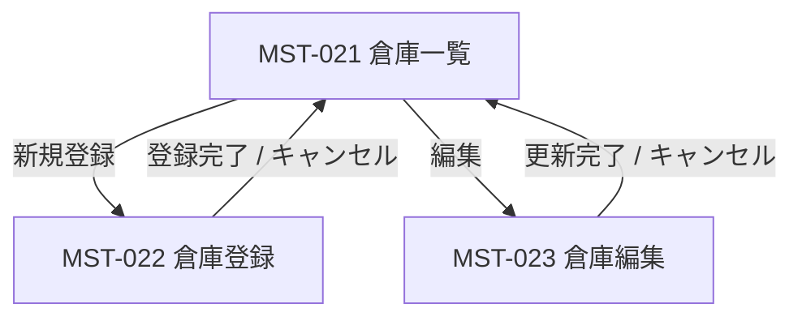

# 機能設計書 — 画面設計 マスタ管理（倉庫）

**対象画面**: MST-021〜MST-023（倉庫）
**対象ロール**: SYSTEM_ADMIN, WAREHOUSE_MANAGER
**作成日**: 2026-03-13

---

## MST-021 倉庫一覧

### 1. 画面概要

| 項目 | 内容 |
|------|------|
| **画面ID** | `MST-021` |
| **画面名** | 倉庫一覧 |
| **URL パス** | `/master/warehouses` |
| **対象ロール** | SYSTEM_ADMIN, WAREHOUSE_MANAGER |
| **概要** | 登録済みの倉庫を一覧表示する。倉庫の新規登録・編集・有効/無効切り替えの起点となる画面。在庫が存在する倉庫は無効化不可。 |

---

### 2. 画面レイアウト

**モックアップ**: [MST-021-warehouse-list.html](mockups/MST-021-warehouse-list.html)

```
┌─────────────────────────────────────────────────────────────┐
│ [メタバー] MST-021 | URL: /master/warehouses | SYSTEM_ADMIN, WAREHOUSE_MANAGER │
├─────────────────────────────────────────────────────────────┤
│ ヘッダー                                                     │
├──────────┬──────────────────────────────────────────────────┤
│          │ ホーム › マスタ管理 › 倉庫一覧                   │
│ マスタ   │──────────────────────────────────────────────────│
│ 管理     │ 倉庫一覧                                          │
│  ├取引先 │──────────────────────────────────────────────────│
│  └倉庫   │ [検索フォーム]                                    │
│          │  倉庫名: [______]  状態: [▼]                     │
│ 入荷管理 │  [検索]  [クリア]                                 │
│ 在庫管理 │──────────────────────────────────────────────────│
│ 出荷管理 │ [＋ 新規登録]                    全4件            │
│ バッチ   │──────────┬──────────┬──────────┬─────────────────│
│          │ 倉庫CD   │ 倉庫名   │ 状態     │ 操作           │
│          ├──────────┼──────────┼──────────┼─────────────────│
│          │ WH-001   │ 東京DC   │ 有効     │ [編集][無効化] │
│          ├──────────┴──────────┴──────────┴─────────────────│
│          │              ← 1 →   20件/ページ▼               │
└──────────┴──────────────────────────────────────────────────┘
```

**検索フォーム**

| 項目 | 種別 | 備考 |
|------|------|------|
| 倉庫コード | テキスト | 前方一致 |
| 倉庫名 | テキスト | 部分一致 |
| 状態 | セレクト | すべて / 有効のみ / 無効のみ |

**テーブル列**

| 列 | 内容 |
|----|------|
| 倉庫コード | クリックで編集画面へ遷移するリンク |
| 倉庫名 | |
| 倉庫名カナ | |
| 住所 | |
| 状態 | バッジ表示（有効/無効） |
| 操作 | [編集] [無効化] または [編集] [有効化] |

---

### 3. 画面項目一覧

| 項目ID | 項目名 | 種別 | 必須 | 初期値 | バリデーション | 備考 |
|--------|--------|------|:----:|--------|--------------|------|
| MST021-S01 | 倉庫コード（検索） | テキスト | — | 空 | 最大20文字 | 前方一致検索 |
| MST021-S02 | 倉庫名（検索） | テキスト | — | 空 | 最大100文字 | 部分一致検索 |
| MST021-S03 | 状態（検索） | セレクト | — | すべて | — | 有効のみ/無効のみ/すべて |
| MST021-B01 | 検索ボタン | ボタン | — | — | — | |
| MST021-B02 | クリアボタン | ボタン | — | — | — | 検索条件を初期化 |
| MST021-B03 | 新規登録ボタン | ボタン | — | — | — | MST-022へ遷移 |
| MST021-T01 | 倉庫一覧テーブル | テーブル | — | — | — | 20件/ページ |
| MST021-T01-C01 | 倉庫コード | 表示 | — | — | — | クリックでMST-023へ遷移 |
| MST021-T01-C02 | 倉庫名 | 表示 | — | — | — | |
| MST021-T01-C03 | 倉庫名カナ | 表示 | — | — | — | |
| MST021-T01-C04 | 住所 | 表示 | — | — | — | |
| MST021-T01-C05 | 状態 | 表示 | — | — | — | 有効:緑バッジ / 無効:グレーバッジ |
| MST021-T01-C06 | 編集ボタン | ボタン | — | — | — | MST-023へ遷移 |
| MST021-T01-C07 | 無効化/有効化ボタン | ボタン | — | — | — | 確認ダイアログを表示 |
| MST021-P01 | ページング | ページング | — | 1ページ目 | — | 20件/50件/100件 切替可 |

---

### 4. イベント一覧

| イベントID | トリガー | 処理概要 | 遷移先 / 結果 | 実行可能ロール |
|----------|---------|---------|-------------|-------------|
| `EVT-MST021-001` | 検索ボタンクリック | 入力条件で `GET /api/v1/master/warehouses` を呼び出し、一覧を再描画 | 同画面リロード（1ページ目） | SYSTEM_ADMIN, WAREHOUSE_MANAGER |
| `EVT-MST021-002` | クリアボタンクリック | 検索条件を初期値にリセット | 同画面（検索フォームリセット） | SYSTEM_ADMIN, WAREHOUSE_MANAGER |
| `EVT-MST021-003` | 新規登録ボタンクリック | MST-022に遷移 | MST-022 倉庫登録 | SYSTEM_ADMIN, WAREHOUSE_MANAGER |
| `EVT-MST021-004` | 倉庫コードリンククリック | MST-023（編集画面）に遷移 | MST-023 倉庫編集 | SYSTEM_ADMIN, WAREHOUSE_MANAGER |
| `EVT-MST021-005` | 編集ボタンクリック | MST-023（編集画面）に遷移 | MST-023 倉庫編集 | SYSTEM_ADMIN, WAREHOUSE_MANAGER |
| `EVT-MST021-006` | 無効化ボタンクリック | 確認ダイアログを表示。確認後 `PATCH /api/v1/master/warehouses/{id}/deactivate` を呼び出し | 同画面リロード（成功メッセージ表示） | SYSTEM_ADMIN, WAREHOUSE_MANAGER |
| `EVT-MST021-007` | 有効化ボタンクリック | 確認ダイアログを表示。確認後 `PATCH /api/v1/master/warehouses/{id}/activate` を呼び出し | 同画面リロード（成功メッセージ表示） | SYSTEM_ADMIN, WAREHOUSE_MANAGER |
| `EVT-MST021-008` | ページ番号クリック | 指定ページを `GET /api/v1/master/warehouses?page={n}` で取得 | 同画面（ページ変更） | SYSTEM_ADMIN, WAREHOUSE_MANAGER |

---

### 5. メッセージ一覧

| メッセージID | 種別 | 発生条件 | メッセージ文（日本語） |
|------------|------|---------|-------------------|
| `MSG-W-MST021-001` | 警告 | 無効化ボタンクリック時 | この倉庫を無効化しますか？在庫が存在する場合は無効化できません。 |
| `MSG-W-MST021-002` | 警告 | 有効化ボタンクリック時 | この倉庫を有効化しますか？ |
| `MSG-S-MST021-001` | 成功 | 無効化完了時 | 倉庫を無効化しました。 |
| `MSG-S-MST021-002` | 成功 | 有効化完了時 | 倉庫を有効化しました。 |
| `MSG-E-MST021-001` | エラー | 在庫が存在する倉庫を無効化しようとした場合 | 在庫が存在するため、この倉庫を無効化できません。 |
| `MSG-E-MST021-002` | エラー | API通信エラー時 | データの取得に失敗しました。時間をおいて再度お試しください。 |

---

---

## MST-022 倉庫登録

### 1. 画面概要

| 項目 | 内容 |
|------|------|
| **画面ID** | `MST-022` |
| **画面名** | 倉庫登録 |
| **URL パス** | `/master/warehouses/new` |
| **対象ロール** | SYSTEM_ADMIN, WAREHOUSE_MANAGER |
| **概要** | 新規倉庫を登録する。倉庫コードは一意であり、登録後は変更不可。登録完了後は倉庫一覧（MST-021）に戻る。 |

---

### 2. 画面レイアウト

**モックアップ**: [MST-022-warehouse-new.html](mockups/MST-022-warehouse-new.html)

```
┌─────────────────────────────────────────────────────────────┐
│ [メタバー] MST-022 | URL: /master/warehouses/new           │
├─────────────────────────────────────────────────────────────┤
│ ヘッダー                                                     │
├──────────┬──────────────────────────────────────────────────┤
│          │ ホーム › マスタ管理 › 倉庫一覧 › 新規登録        │
│ サイドバー│──────────────────────────────────────────────────│
│          │ 倉庫登録                                          │
│          │──────────────────────────────────────────────────│
│          │ 基本情報                                          │
│          │  倉庫コード *  [__________]                       │
│          │  倉庫名 *      [______________________]           │
│          │  倉庫名カナ *  [______________________]           │
│          │  住所          [______________________]           │
│          │──────────────────────────────────────────────────│
│          │                          [キャンセル]  [登録]     │
└──────────┴──────────────────────────────────────────────────┘
```

---

### 3. 画面項目一覧

| 項目ID | 項目名 | 種別 | 必須 | 初期値 | バリデーション | 備考 |
|--------|--------|------|:----:|--------|--------------|------|
| MST022-F01 | 倉庫コード | テキスト | ○ | 空 | 必須、最大20文字、英数字・ハイフン、一意チェック | 登録後変更不可 |
| MST022-F02 | 倉庫名 | テキスト | ○ | 空 | 必須、最大200文字 | |
| MST022-F03 | 倉庫名カナ | テキスト | ○ | 空 | 必須、最大200文字、全角カナ | |
| MST022-F04 | 住所 | テキスト | — | 空 | 最大200文字 | |
| MST022-B01 | キャンセルボタン | ボタン | — | — | — | MST-021へ戻る |
| MST022-B02 | 登録ボタン | ボタン | — | — | — | バリデーション後 `POST /api/v1/master/warehouses` |

---

### 4. イベント一覧

| イベントID | トリガー | 処理概要 | 遷移先 / 結果 | 実行可能ロール |
|----------|---------|---------|-------------|-------------|
| `EVT-MST022-001` | 登録ボタンクリック | フォームバリデーション実行。成功時 `POST /api/v1/master/warehouses` を呼び出し | MST-021（成功メッセージ付き） | SYSTEM_ADMIN, WAREHOUSE_MANAGER |
| `EVT-MST022-002` | キャンセルボタンクリック | 入力を破棄してMST-021へ戻る | MST-021 倉庫一覧 | SYSTEM_ADMIN, WAREHOUSE_MANAGER |
| `EVT-MST022-003` | 倉庫コードフォーカスアウト | 重複チェック `GET /api/v1/master/warehouses/exists?warehouseCode={code}` | インラインエラー表示 | SYSTEM_ADMIN, WAREHOUSE_MANAGER |

---

### 5. メッセージ一覧

| メッセージID | 種別 | 発生条件 | メッセージ文（日本語） |
|------------|------|---------|-------------------|
| `MSG-E-MST022-001` | エラー | 倉庫コード未入力 | 倉庫コードは必須です |
| `MSG-E-MST022-002` | エラー | 倉庫コード形式エラー | 倉庫コードは英数字・ハイフンで入力してください |
| `MSG-E-MST022-003` | エラー | 倉庫コード重複 | このコードは既に登録されています |
| `MSG-E-MST022-004` | エラー | 倉庫名未入力 | 倉庫名は必須です |
| `MSG-E-MST022-005` | エラー | 倉庫名カナ未入力 | 倉庫名カナは必須です |
| `MSG-E-MST022-006` | エラー | 倉庫名カナ形式エラー | 倉庫名カナは全角カタカナで入力してください |
| `MSG-S-MST022-001` | 成功 | 登録成功 | 倉庫を登録しました。 |

---

---

## MST-023 倉庫編集

### 1. 画面概要

| 項目 | 内容 |
|------|------|
| **画面ID** | `MST-023` |
| **画面名** | 倉庫編集 |
| **URL パス** | `/master/warehouses/:id/edit` |
| **対象ロール** | SYSTEM_ADMIN, WAREHOUSE_MANAGER |
| **概要** | 既存倉庫の情報を更新する。倉庫コードは読み取り専用で変更不可。更新完了後は倉庫一覧（MST-021）に戻る。 |

---

### 2. 画面レイアウト

**モックアップ**: [MST-023-warehouse-edit.html](mockups/MST-023-warehouse-edit.html)

```
┌─────────────────────────────────────────────────────────────┐
│ [メタバー] MST-023 | URL: /master/warehouses/:id/edit      │
├─────────────────────────────────────────────────────────────┤
│ ヘッダー                                                     │
├──────────┬──────────────────────────────────────────────────┤
│          │ ホーム › マスタ管理 › 倉庫一覧 › 編集            │
│ サイドバー│──────────────────────────────────────────────────│
│          │ 倉庫編集                                          │
│          │──────────────────────────────────────────────────│
│          │ 基本情報                                          │
│          │  倉庫コード    [WH-001] （変更不可）              │
│          │  倉庫名 *      [______________________]           │
│          │  倉庫名カナ *  [______________________]           │
│          │  住所          [______________________]           │
│          │──────────────────────────────────────────────────│
│          │                          [キャンセル]  [更新]     │
└──────────┴──────────────────────────────────────────────────┘
```

---

### 3. 画面項目一覧

| 項目ID | 項目名 | 種別 | 必須 | 初期値 | バリデーション | 備考 |
|--------|--------|------|:----:|--------|--------------|------|
| MST023-F01 | 倉庫コード | 表示 | — | 取得値 | — | 変更不可（読み取り専用） |
| MST023-F02 | 倉庫名 | テキスト | ○ | 取得値 | 必須、最大200文字 | |
| MST023-F03 | 倉庫名カナ | テキスト | ○ | 取得値 | 必須、最大200文字、全角カナ | |
| MST023-F04 | 住所 | テキスト | — | 取得値 | 最大200文字 | |
| MST023-B01 | キャンセルボタン | ボタン | — | — | — | MST-021へ戻る |
| MST023-B02 | 更新ボタン | ボタン | — | — | — | バリデーション後 `PUT /api/v1/master/warehouses/{id}` |

---

### 4. イベント一覧

| イベントID | トリガー | 処理概要 | 遷移先 / 結果 | 実行可能ロール |
|----------|---------|---------|-------------|-------------|
| `EVT-MST023-001` | 画面初期表示 | `GET /api/v1/master/warehouses/{id}` を呼び出し、倉庫情報をフォームにセット | — | SYSTEM_ADMIN, WAREHOUSE_MANAGER |
| `EVT-MST023-002` | 更新ボタンクリック | フォームバリデーション実行。成功時 `PUT /api/v1/master/warehouses/{id}` を呼び出し。409 Conflict時はMSG-E-MST023-005（楽観的ロック競合）を表示 | MST-021（成功メッセージ付き） | SYSTEM_ADMIN, WAREHOUSE_MANAGER |
| `EVT-MST023-003` | キャンセルボタンクリック | 変更を破棄してMST-021へ戻る | MST-021 倉庫一覧 | SYSTEM_ADMIN, WAREHOUSE_MANAGER |

---

### 5. メッセージ一覧

| メッセージID | 種別 | 発生条件 | メッセージ文（日本語） |
|------------|------|---------|-------------------|
| `MSG-E-MST023-001` | エラー | 倉庫名未入力 | 倉庫名は必須です |
| `MSG-E-MST023-002` | エラー | 倉庫名カナ未入力 | 倉庫名カナは必須です |
| `MSG-E-MST023-003` | エラー | 倉庫名カナ形式エラー | 倉庫名カナは全角カタカナで入力してください |
| `MSG-E-MST023-004` | エラー | 対象倉庫が存在しない | 指定された倉庫は存在しないか、削除されています |
| `MSG-E-MST023-005` | エラー | 更新時に 409 Conflict（楽観的ロック競合） | 他のユーザーが更新済みです。画面を再読み込みしてください |
| `MSG-S-MST023-001` | 成功 | 更新成功 | 倉庫情報を更新しました。 |

---

---

## 画面遷移フロー（倉庫マスタ）


