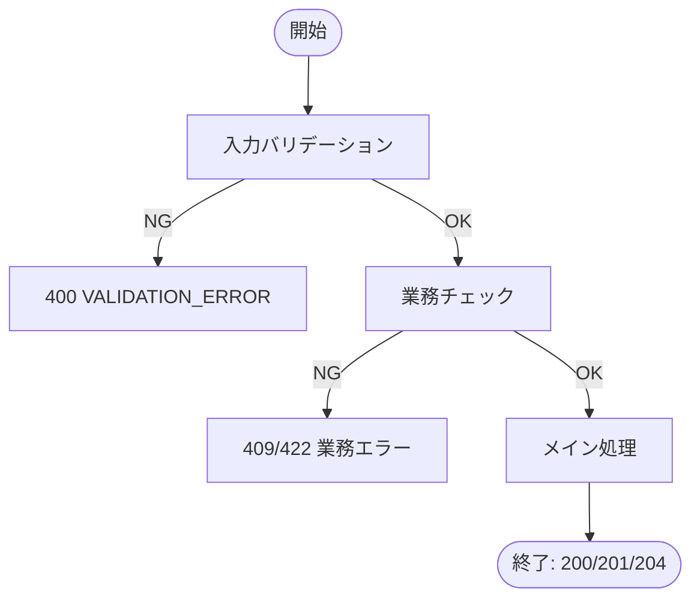
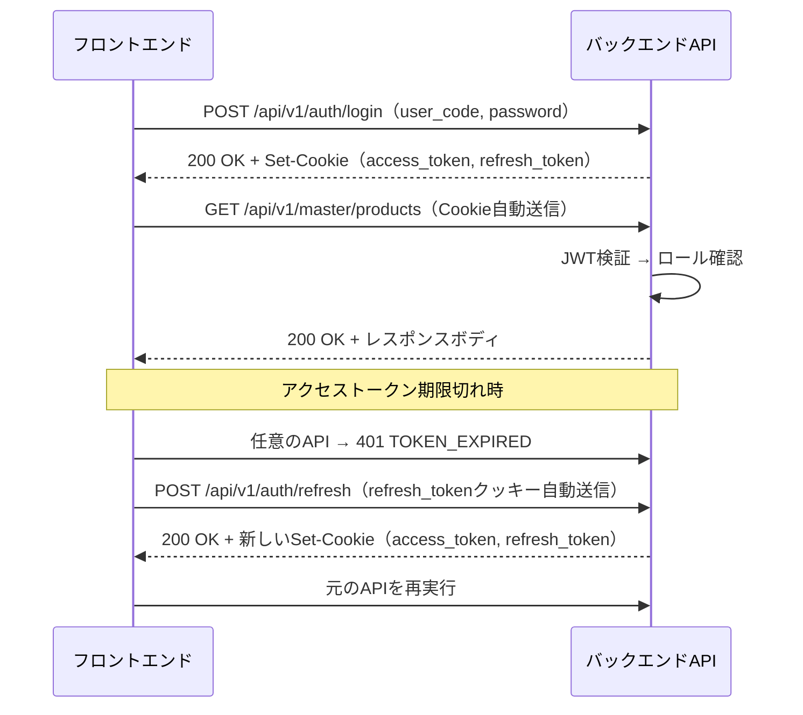

# 機能設計書 — API設計 概要・共通仕様

## API設計書の記載粒度（テンプレート定義）

各API設計書は以下の5項目を統一フォーマットで記述する。

---

### 1. API概要

| 項目 | 内容 |
|------|------|
| **API ID** | `API-XXX-001` 形式 |
| **API名** | 日本語の操作名称（例: 商品一覧取得） |
| **メソッド** | `GET` / `POST` / `PUT` / `PATCH` / `DELETE` |
| **パス** | `/api/v1/{リソース}` |
| **認証** | 要（ロール指定） / 不要 |
| **対象ロール** | アクセス可能なロール（例: WAREHOUSE_MANAGER, WAREHOUSE_STAFF） |
| **概要** | APIの目的・用途を1〜2文で説明 |
| **関連画面** | 呼び出し元画面ID（例: MST-001） |

---

### 2. リクエスト仕様

#### パスパラメータ

| パラメータ名 | 型 | 必須 | 説明 |
|------------|-----|:----:|------|
| `id` | Long | ○ | リソースID |

#### クエリパラメータ（GET系）

| パラメータ名 | 型 | 必須 | デフォルト | 説明 |
|------------|-----|:----:|----------|------|
| `keyword` | String | — | — | キーワード検索 |
| `page` | Integer | — | `0` | ページ番号（0始まり） |
| `size` | Integer | — | `20` | 1ページあたりの件数 |
| `sort` | String | — | — | ソート指定（例: `productCode,asc`） |

#### リクエストボディ（POST/PUT/PATCH系）

```json
{
  "fieldName": "value"
}
```

| フィールド名 | 型 | 必須 | バリデーション | 説明 |
|------------|-----|:----:|-------------|------|
| `fieldName` | String | ○ | 最大50文字 | 項目説明 |

---

### 3. レスポンス仕様

#### 成功レスポンス

| HTTPステータス | 用途 |
|-------------|------|
| `200 OK` | 取得・更新成功 |
| `201 Created` | 登録成功 |
| `204 No Content` | 削除・アクション系成功（レスポンスボディなし） |

#### エラーレスポンス

標準エラーレスポンス形式（[エラー仕様](#4-エラー仕様) 参照）

---

### 4. 業務ロジック

処理フローをMermaidフローチャートで表現し、その後にビジネスルール・排他制御・後処理等を補足する。



**ビジネスルール**:

| # | ルール | エラーコード |
|---|--------|------------|
| 1 | ルール説明 | `ERROR_CODE` |

---

### 5. 補足事項

トランザクション境界、外部連携、パフォーマンス考慮事項等を記述する。

---

---

## API共通仕様

### ベースURL

| 環境 | ベースURL |
|-----|---------|
| ローカル開発 | `http://localhost:8080` |
| 本番 | Azure Container Apps の FQDN（Terraform で自動取得） |

全エンドポイントのパスプレフィックス: `/api/v1/`

### リクエスト共通仕様

| 項目 | 仕様 |
|------|------|
| **Content-Type** | `application/json; charset=UTF-8`（ボディあり時） |
| **文字コード** | UTF-8 |
| **日時フォーマット** | ISO 8601（例: `2026-03-13T09:00:00+09:00`） |
| **日付フォーマット** | `yyyy-MM-dd`（例: `2026-03-13`） |
| **タイムゾーン** | Asia/Tokyo（フロントエンド ↔ バックエンド間の送受信はJST） |
| **数値** | JSON number 型（文字列として送らない） |

### レスポンス共通仕様

| 項目 | 仕様 |
|------|------|
| **Content-Type** | `application/json; charset=UTF-8` |
| **null フィールド** | レスポンスに含めない（`@JsonInclude(NON_NULL)` で制御） |
| **空配列** | `[]`（null にしない） |

---

## 標準レスポンス形式

### 単一リソース取得・登録・更新

```json
{
  "id": 1,
  "productCode": "P-001",
  "productName": "テスト商品A",
  "isActive": true,
  "createdAt": "2026-03-13T09:00:00+09:00",
  "updatedAt": "2026-03-13T09:00:00+09:00"
}
```

> レスポンスは直接リソースオブジェクトを返す（`data` ラッパーなし）。

### ページングリスト取得

```json
{
  "content": [
    { "id": 1, "productCode": "P-001", "productName": "テスト商品A" },
    { "id": 2, "productCode": "P-002", "productName": "テスト商品B" }
  ],
  "page": 0,
  "size": 20,
  "totalElements": 42,
  "totalPages": 3
}
```

| フィールド | 型 | 説明 |
|----------|-----|------|
| `content` | Array | 検索結果の配列 |
| `page` | Integer | 現在のページ番号（0始まり） |
| `size` | Integer | 1ページあたりの件数 |
| `totalElements` | Long | 総件数 |
| `totalPages` | Integer | 総ページ数 |

### シンプルリスト取得（ページングなし）

プルダウン選択肢など少量データの場合はページングなしの配列を直接返す。

```json
[
  { "id": 1, "warehouseCode": "WH-001", "warehouseName": "東京DC" },
  { "id": 2, "warehouseCode": "WH-002", "warehouseName": "大阪DC" }
]
```

---

## エラー仕様

### エラーレスポンス形式

```json
{
  "errorCode": "PRODUCT_NOT_FOUND",
  "message": "指定された商品が見つかりません",
  "details": []
}
```

バリデーションエラー（`details` あり）:

```json
{
  "errorCode": "VALIDATION_ERROR",
  "message": "入力内容に誤りがあります",
  "details": [
    {
      "field": "productCode",
      "message": "商品コードは必須です"
    },
    {
      "field": "casQuantity",
      "message": "ケース入数は1以上の整数を入力してください"
    }
  ]
}
```

| フィールド | 型 | 説明 |
|----------|-----|------|
| `errorCode` | String | エラーコード（[エラーコード一覧](#エラーコード一覧) 参照） |
| `message` | String | エラーメッセージ（日本語） |
| `details` | Array | フィールドエラー詳細（バリデーションエラー時のみ） |
| `details[].field` | String | エラー対象フィールド名（キャメルケース） |
| `details[].message` | String | フィールドのエラーメッセージ（日本語） |

### HTTPステータスコード一覧

| ステータスコード | 用途 | エラーコード例 |
|--------------|------|-------------|
| `200 OK` | 正常（取得・更新） | — |
| `201 Created` | 正常（登録） | — |
| `204 No Content` | 正常（削除・完了アクション） | — |
| `400 Bad Request` | リクエスト形式エラー / バリデーションエラー | `VALIDATION_ERROR` |
| `401 Unauthorized` | 未認証（Cookieなし・JWT期限切れ） | `UNAUTHORIZED` |
| `403 Forbidden` | 認可エラー（ロール不足） | `FORBIDDEN` |
| `404 Not Found` | リソース未存在 | `PRODUCT_NOT_FOUND` 等 |
| `409 Conflict` | 業務ルール違反（重複コード・状態不整合） | `DUPLICATE_CODE` 等 |
| `422 Unprocessable Entity` | 業務制約違反（在庫あり無効化不可等） | `CANNOT_DEACTIVATE_*` 等 |
| `500 Internal Server Error` | サーバー内部エラー | `INTERNAL_SERVER_ERROR` |

### エラーコード一覧

#### 共通

| エラーコード | HTTPステータス | 説明 |
|-----------|-------------|------|
| `VALIDATION_ERROR` | 400 | バリデーションエラー |
| `UNAUTHORIZED` | 401 | 未認証 |
| `FORBIDDEN` | 403 | 権限不足 |
| `INTERNAL_SERVER_ERROR` | 500 | サーバー内部エラー |

#### 認証

| エラーコード | HTTPステータス | 説明 |
|-----------|-------------|------|
| `INVALID_CREDENTIALS` | 401 | ユーザーコードまたはパスワードが不正 |
| `ACCOUNT_LOCKED` | 401 | アカウントがロックされている |
| `ACCOUNT_INACTIVE` | 401 | アカウントが無効化されている |
| `TOKEN_EXPIRED` | 401 | アクセストークン期限切れ |
| `REFRESH_TOKEN_EXPIRED` | 401 | リフレッシュトークン期限切れ（再ログイン要） |
| `SAME_PASSWORD` | 409 | 新しいパスワードが現在のパスワードと同じ |

#### マスタ管理（共通パターン）

| エラーコード | HTTPステータス | 説明 |
|-----------|-------------|------|
| `DUPLICATE_CODE` | 409 | コードの重複（商品コード・ユーザーコード等） |
| `INVALID_PARAMETER` | 400 | クエリパラメータが不正 |
| `PRODUCT_NOT_FOUND` | 404 | 商品が見つからない |
| `PARTNER_NOT_FOUND` | 404 | 取引先が見つからない |
| `WAREHOUSE_NOT_FOUND` | 404 | 倉庫が見つからない |
| `BUILDING_NOT_FOUND` | 404 | 棟が見つからない |
| `AREA_NOT_FOUND` | 404 | エリアが見つからない |
| `LOCATION_NOT_FOUND` | 404 | ロケーションが見つからない |
| `USER_NOT_FOUND` | 404 | ユーザーが見つからない |
| `CANNOT_DEACTIVATE_HAS_INVENTORY` | 422 | 在庫があるため無効化不可 |
| `CANNOT_DEACTIVATE_HAS_CHILDREN` | 422 | 配下データがあるため無効化不可 |
| `CANNOT_DEACTIVATE_SELF` | 422 | 自分自身を無効化不可 |
| `CANNOT_DEACTIVATE_HAS_ACTIVE_INBOUND` | 422 | 処理中の入荷予定に紐づいているため取引先無効化不可 |
| `CANNOT_DEACTIVATE_HAS_ACTIVE_OUTBOUND` | 422 | 処理中の受注に紐づいているため取引先無効化不可 |
| `CANNOT_DEACTIVATE_STOCKTAKE_IN_PROGRESS` | 422 | 棚卸中のため無効化不可 |
| `CANNOT_CHANGE_CODE` | 422 | 登録後変更不可のコード項目を変更しようとした |
| `CANNOT_CHANGE_LOT_MANAGE_FLAG` | 422 | 在庫が存在するためロット管理フラグを変更不可 |
| `CANNOT_CHANGE_EXPIRY_MANAGE_FLAG` | 422 | 在庫が存在するため賞味期限管理フラグを変更不可 |
| `CANNOT_CHANGE_SELF_ROLE` | 422 | 自分自身のロールを変更しようとした |
| `AREA_LOCATION_LIMIT_EXCEEDED` | 422 | エリアのロケーション登録上限を超過 |
| `INVALID_LOCATION_CODE_FORMAT` | 400 | ロケーションコード形式が不正 |

#### 入荷管理

| エラーコード | HTTPステータス | 説明 |
|-----------|-------------|------|
| `INBOUND_SLIP_NOT_FOUND` | 404 | 入荷伝票が見つからない |
| `INBOUND_LINE_NOT_FOUND` | 404 | 指定IDの入荷明細が当該伝票に存在しない |
| `INBOUND_INVALID_STATUS` | 409 | 現在のステータスではその操作は不可 |
| `INBOUND_LINE_NOT_INSPECTED` | 409 | 対象明細が検品済（INSPECTED）でないため入庫確定不可 |
| `DUPLICATE_PRODUCT_IN_LINES` | 409 | 同一伝票内に同じ商品IDの明細が重複 |
| `INBOUND_PARTNER_NOT_SUPPLIER` | 422 | 取引先種別が仕入先でない |
| `INBOUND_LOCATION_AREA_MISMATCH` | 422 | 指定ロケーションが入荷エリアに属さない |
| `PLANNED_DATE_TOO_EARLY` | 422 | 入荷予定日が現在営業日より前 |
| `LOT_NUMBER_REQUIRED` | 422 | ロット管理フラグONの商品のロット番号未指定 |
| `EXPIRY_DATE_REQUIRED` | 422 | 期限管理フラグONの商品の期限日未指定 |

#### 在庫管理

| エラーコード | HTTPステータス | 説明 |
|-----------|-------------|------|
| `INVENTORY_NOT_FOUND` | 404 | 在庫レコードが見つからない |
| `INVENTORY_INSUFFICIENT` | 422 | 在庫数量不足 |
| `INVENTORY_STOCKTAKE_IN_PROGRESS` | 409 | 棚卸中のため操作不可 |
| `INVENTORY_CAPACITY_EXCEEDED` | 422 | ロケーションの収容数上限を超過 |
| `INVENTORY_STOCKTAKE_NOT_ALL_COUNTED` | 409 | 未入力の実数がある（棚卸確定前に全明細の入力が必要） |
| `STOCKTAKE_NOT_FOUND` | 404 | 棚卸が見つからない |
| `STOCKTAKE_INVALID_STATUS` | 409 | 現在のステータスではその操作は不可 |

#### 出荷管理

| エラーコード | HTTPステータス | 説明 |
|-----------|-------------|------|
| `OUTBOUND_SLIP_NOT_FOUND` | 404 | 出荷伝票が見つからない |
| `OUTBOUND_INVALID_STATUS` | 409 | 現在のステータスではその操作は不可 |
| `OUTBOUND_PARTNER_NOT_CUSTOMER` | 422 | 取引先種別が出荷先でない |
| `OUTBOUND_PRODUCT_SHIPMENT_STOPPED` | 422 | 出荷禁止商品 |
| `PICKING_NOT_FOUND` | 404 | ピッキング指示が見つからない |
| `ALLOCATION_INSUFFICIENT` | 422 | 在庫引当に必要な在庫が不足 |

#### 返品管理

| エラーコード | HTTPステータス | 説明 |
|-----------|-------------|------|
| `RETURN_ALLOCATED_INVENTORY` | 422 | 引当済み在庫は返品できません |
| `RETURN_STOCKTAKE_LOCKED` | 422 | 棚卸ロック中のロケーションからは返品できません |
| `RETURN_INSUFFICIENT_QUANTITY` | 422 | 返品数量が在庫数を超えています |

#### バッチ

| エラーコード | HTTPステータス | 説明 |
|-----------|-------------|------|
| `BATCH_ALREADY_RUNNING` | 409 | 日替処理が実行中 |
| `BATCH_EXECUTION_NOT_FOUND` | 404 | バッチ実行履歴が見つからない。RPT-017（日次集計レポート）で指定日の日替処理が完了していない場合にも返却 |

---

## ページング仕様

### リクエストパラメータ

| パラメータ名 | 型 | デフォルト | 上限 | 説明 |
|------------|-----|---------|------|------|
| `page` | Integer | `0` | — | ページ番号（0始まり） |
| `size` | Integer | `20` | `100` | 1ページあたりの件数 |
| `sort` | String | 各API定義 | — | `{フィールド名},{asc\|desc}` |

### ソート指定例

```
GET /api/v1/master/products?page=0&size=20&sort=productCode,asc
GET /api/v1/master/products?page=0&size=20&sort=updatedAt,desc
```

複数ソートキーは `sort` パラメータを複数指定:

```
GET /api/v1/master/products?sort=isActive,desc&sort=productCode,asc
```

---

## 認証・認可仕様

### JWT + httpOnly Cookie 方式

| 項目 | 仕様 |
|------|------|
| **認証トークン保存場所** | httpOnly Cookie（XSS対策） |
| **Cookie名** | `access_token` |
| **CSRF対策** | SameSite=Lax |
| **アクセストークン有効期限** | 1時間 |
| **リフレッシュトークン有効期限** | スライディング方式（最終アクセスから1時間） |
| **リフレッシュトークン保存場所** | httpOnly Cookie（Cookie名: `refresh_token`） |

### 認証フロー



### ロール別アクセス権限

| API グループ | SYSTEM_ADMIN | WAREHOUSE_MANAGER | WAREHOUSE_STAFF | VIEWER |
|-----------|:---:|:---:|:---:|:---:|
| **認証API** | ✅ | ✅ | ✅ | ✅ |
| **システム共通API** | ✅ | ✅ | ✅ | ✅ |
| **マスタ管理（参照）** | ✅ | ✅ | ✅ | ✅ |
| **マスタ管理（更新）** | ✅ | ✅ | ✗ | ✗ |
| **ユーザー管理（全操作）** | ✅ | ✗ | ✗ | ✗ |
| **入荷管理（参照）** | ✅ | ✅ | ✅ | ✅ |
| **入荷管理（更新・完了）** | ✅ | ✅ | ✅ | ✗ |
| **在庫管理（参照）** | ✅ | ✅ | ✅ | ✅ |
| **在庫管理（移動・訂正）** | ✅ | ✅ | ✅ | ✗ |
| **在庫引当** | ✅ | ✅ | ✗ | ✗ |
| **出荷管理（参照）** | ✅ | ✅ | ✅ | ✅ |
| **出荷管理（更新・完了）** | ✅ | ✅ | ✅ | ✗ |
| **返品管理（参照）** | ✅ | ✅ | ✅ | ✅ |
| **返品管理（登録）** | ✅ | ✅ | ✅ | ✗ |
| **レポート出力** | ✅ | ✅ | ✅ | ✅ |
| **バッチ実行** | ✅ | ✅ | ✗ | ✗ |

---

## ID体系・全API一覧

> ID体系とAPI一覧は [_id-registry.md](_id-registry.md) で一元管理しています（SSOTルール）。
> 新規APIの追加・ID変更は _id-registry.md を先に更新してください。

---

## API設計書ファイル構成

| ファイル名 | 内容 |
|-----------|------|
| `_standard-api.md`（本ファイル） | API設計 概要・共通仕様・全API一覧 |
| `API-01-auth.md` | 認証API（AUTH-001〜006） |
| `API-02-master-facility.md` | 施設マスタAPI（MST-FAC-001〜035） |
| `API-03-master-partner.md` | 取引先マスタAPI（MST-PAR-001〜005） |
| `API-04-master-product.md` | 商品マスタAPI（MST-PRD-001〜005） |
| `API-05-master-user.md` | ユーザーマスタAPI（MST-USR-001〜007） |
| `API-06-inbound.md` | 入荷管理API（INB-001〜010） |
| `API-07-inventory.md` | 在庫管理API（INV-001〜015） |
| `API-08-outbound.md` | 出荷管理API（OUT-001〜022） |
| `API-09-batch.md` | バッチ管理API（BAT-001〜003） |
| `API-10-report.md` | レポートAPI（RPT-001〜018） |
| `API-11-system-parameters.md` | システムパラメータAPI（SYS-001〜002） |
| `API-12-allocation.md` | 在庫引当API（ALL-001〜006） |
| `API-13-returns.md` | 返品管理API（RTN-001〜002） |
