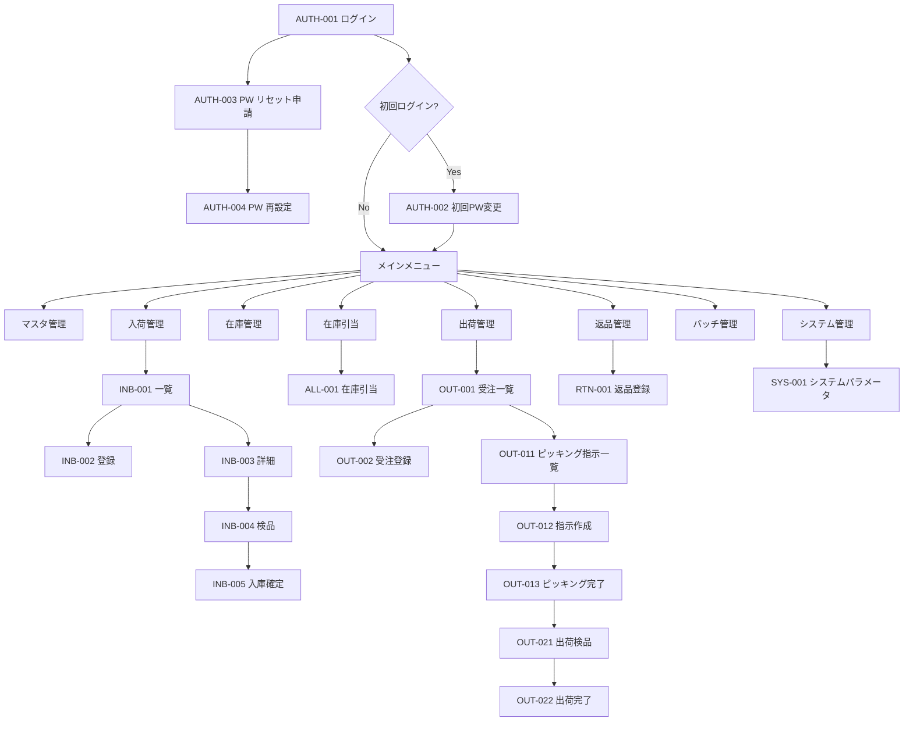

# 機能設計書 — 画面設計 概要・共通仕様

## 画面設計の記載粒度（テンプレート定義）

各画面設計書は以下の5項目を統一フォーマットで記述する。

---

### 1. 画面概要

| 項目 | 内容 |
|------|------|
| **画面ID** | `XXX-001` 形式 |
| **画面名** | 日本語の画面名称 |
| **URL パス** | Vue Router のパス（例: `/inbound/slips`） |
| **対象ロール** | アクセス可能なロール（例: WAREHOUSE_MANAGER, WAREHOUSE_STAFF） |
| **概要** | 画面の目的・用途を1〜2文で説明 |

---

### 2. 画面レイアウト

テキストベースのレイアウト図で表現する。以下の記法を使用する。

```
┌─────────────────────────────────────────────────┐
│ ヘッダー（倉庫切替 / ユーザー名 / ログアウト）    │
├──────────┬──────────────────────────────────────┤
│          │ パンくず                              │
│ サイドバー│──────────────────────────────────────│
│（メニュー）│ ページタイトル  [操作ボタン群]       │
│          │──────────────────────────────────────│
│          │                                      │
│          │  コンテンツエリア                    │
│          │                                      │
└──────────┴──────────────────────────────────────┘
```

コンテンツエリアの内容（検索フォーム・テーブル・フォーム等）を詳細に記述する。

---

### 3. 画面項目一覧

| 項目ID | 項目名 | 種別 | 必須 | 初期値 | バリデーション | 備考 |
|--------|--------|------|:----:|--------|--------------|------|
| 英数字のID | 表示名 | 入力種別※ | ○/— | 初期表示値 | バリデーションルール | 補足 |

**入力種別の凡例**:
- `テキスト` — el-input（テキスト）
- `数値` — el-input-number
- `日付` — el-date-picker
- `日付範囲` — el-date-picker（range）
- `セレクト` — el-select
- `ラジオ` — el-radio-group
- `チェックボックス` — el-checkbox
- `テキストエリア` — el-input（textarea）
- `表示` — 読み取り専用テキスト
- `ラベル` — 見出し・説明テキスト
- `ボタン` — el-button
- `テーブル` — el-table（一覧）
- `ページング` — el-pagination

---

### 4. イベント一覧

| イベントID | トリガー | 処理概要 | 遷移先 / 結果 | 実行可能ロール |
|----------|---------|---------|-------------|-------------|
| `EVT-XXX-001` | ボタンクリック / 画面遷移等 | 処理内容の概要 | 画面IDまたは「同画面リロード」「ダイアログ表示」等 | ロール名 |

---

### 5. メッセージ一覧

| メッセージID | 種別 | 発生条件 | メッセージ文（日本語） |
|------------|------|---------|-------------------|
| `MSG-E-xxx` | エラー | 発生条件 | メッセージ本文 |
| `MSG-W-xxx` | 警告 | 発生条件 | メッセージ本文 |
| `MSG-S-xxx` | 成功 | 発生条件 | メッセージ本文 |
| `MSG-I-xxx` | 情報 | 発生条件 | メッセージ本文 |

**種別の表示方法**:
- `エラー` — el-message（type: error）またはフォームバリデーションエラー
- `警告` — el-message-box（confirm ダイアログ）
- `成功` — el-message（type: success）
- `情報` — el-message（type: info）

---

## ID体系・全画面一覧・メッセージID体系

> 画面ID体系・全画面一覧・メッセージID体系は [_id-registry.md](_id-registry.md) で一元管理しています（SSOTルール）。
> 新規画面の追加・ID変更は _id-registry.md を先に更新してください。

---

## 共通UIコンポーネント仕様

### ヘッダー

```
┌──────────────────────────────────────────────────────────────────────────┐
│ 🏭 WMS  │  [倉庫切替▼ 東京DC]  │  営業日: 2026/03/13  │  ○○○ユーザー  │ ログアウト │
└──────────────────────────────────────────────────────────────────────────┘
```

| コンポーネント | 仕様 |
|-------------|------|
| システム名 | 「WMS」ロゴ・テキスト |
| 倉庫切替プルダウン | 有効な倉庫一覧を表示。選択変更でストア（Pinia）の `currentWarehouseId` を更新し、全画面のデータを再取得 |
| **現在営業日表示** | **「営業日: YYYY/MM/DD」形式で常時表示。ヘッダー中央に配置。日替処理実行後は自動更新される。システム日付（カレンダー上の今日）ではなく、業務上の現在日付（最後に実行された日替処理以降の営業日）を表示する。** |
| ユーザー名 | ログイン中ユーザーの氏名 |
| ログアウトボタン | `POST /api/v1/auth/logout` を呼び出してセッション破棄 → ログイン画面へ |

> **営業日について**: 営業日とはカレンダー上の今日（システム日付）ではなく、「日替処理（バッチ）が実行されるまで変わらない業務上の日付」を指す。日替処理を実行すると翌営業日に進む。全ての業務操作は営業日を基準とし、「今日」「当日」「本日」はすべて「現在営業日」を意味する。現在営業日は Pinia ストアの `currentBusinessDate` として管理し、全画面で参照する。

### サイドバーナビゲーション

ロールに応じて表示メニューを制御する。

| メニュー | サブメニュー | 表示ロール |
|---------|------------|---------|
| マスタ管理 | 商品 / 取引先 / 倉庫 / 棟 / エリア / ロケーション / ユーザー | SYSTEM_ADMIN |
| 入荷管理 | 入荷予定一覧 / 入荷実績照会 | WAREHOUSE_MANAGER, WAREHOUSE_STAFF, VIEWER |
| 在庫管理 | 在庫一覧 / 在庫移動 / ばらし / 在庫訂正 / 棚卸 | WAREHOUSE_MANAGER, WAREHOUSE_STAFF, VIEWER |
| 在庫引当 | 引当実行 / 引当済み一覧 | SYSTEM_ADMIN, WAREHOUSE_MANAGER |
| 出荷管理 | 受注一覧 / ピッキング / 出荷検品 | WAREHOUSE_MANAGER, WAREHOUSE_STAFF, VIEWER |
| 返品管理 | 返品登録 | WAREHOUSE_MANAGER, WAREHOUSE_STAFF |
| バッチ管理 | 日替処理 / バッチ実行履歴 | SYSTEM_ADMIN, WAREHOUSE_MANAGER |
| システム管理 | システムパラメータ | SYSTEM_ADMIN |

### 共通一覧画面レイアウト

```
┌─────────────────────────────────────────────────────────────┐
│ 検索フォームエリア                          [検索] [クリア]  │
├─────────────────────────────────────────────────────────────┤
│ [新規登録]  [CSVインポート]  etc.           件数: XX件       │
├───┬────────┬────────┬────────┬────────────────────────────┤
│ # │ 項目1 │ 項目2 │ 項目3 │ 操作                        │
├───┼────────┼────────┼────────┼────────────────────────────┤
│   │       │       │       │ [編集] [無効化]              │
├───┴────────┴────────┴────────┴────────────────────────────┤
│                    ← 1 2 3 ... 10 →   10件/ページ▼        │
└─────────────────────────────────────────────────────────────┘
```

### 共通フォーム画面レイアウト

```
┌─────────────────────────────────────────────────────────────┐
│ 基本情報                                                     │
│  項目名 *  [______________]   項目名  [______________]      │
│  項目名 *  [______________]   項目名  [______________]      │
├─────────────────────────────────────────────────────────────┤
│ 明細（テーブル形式の場合）                                   │
│  [行追加]                                                    │
│  No │ 項目 │ 項目 │ 操作                                    │
│   1 │      │      │ [削除]                                  │
└─────────────────────────────────────────────────────────────┘
                              [キャンセル]  [登録 / 更新]
```

### 共通バリデーション仕様

| ルール | メッセージ例 |
|--------|------------|
| 必須チェック | `{項目名}は必須です` |
| 最大文字数 | `{項目名}は{N}文字以内で入力してください` |
| 数値範囲 | `{項目名}は{min}以上{max}以下で入力してください` |
| 形式チェック | `{項目名}の形式が正しくありません` |
| 重複チェック | `{コード}は既に登録されています` |

### 共通権限エラー

- 認可エラー（403）: `この操作を実行する権限がありません`
- 未認証（401）: ログイン画面へリダイレクト

---

## 画面遷移フロー概要


