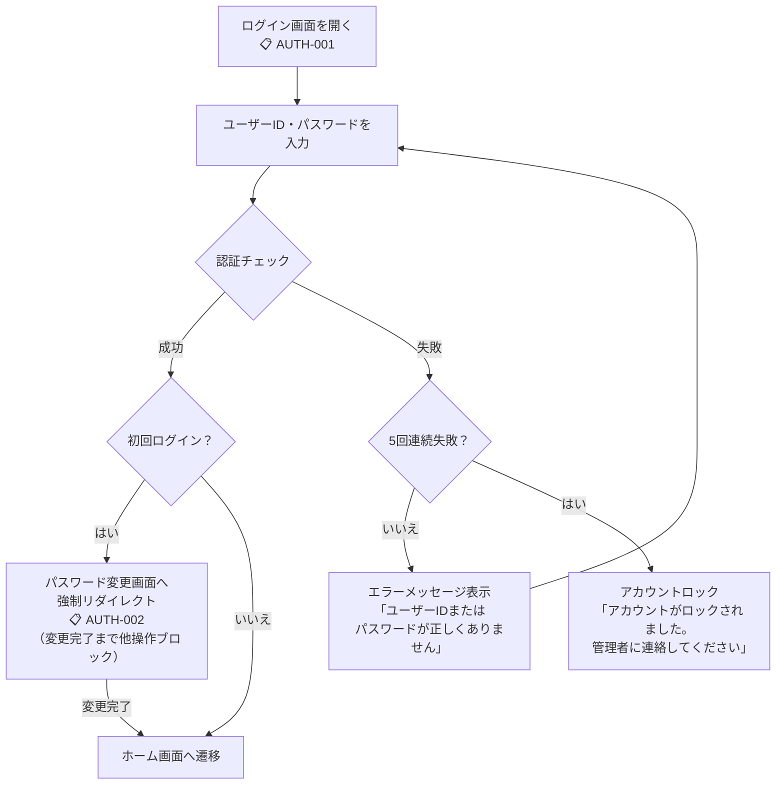
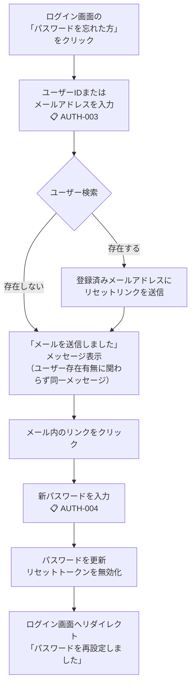

# 機能要件定義書 — 認証・ログイン

> 認証方式・トークン設計・セキュリティ仕様の詳細は
> [07-auth-architecture.md](../architecture-blueprint/07-auth-architecture.md)、
> [10-security-architecture.md](../architecture-blueprint/10-security-architecture.md) を参照

## 概要

| 項目 | 内容 |
|------|------|
| **認証方式** | JWT + httpOnly Cookie（SameSite=Lax） |
| **セッション有効期間** | 最終操作から1時間（リフレッシュトークンのスライディング方式） |
| **パスワードポリシー** | 8〜128文字、英大文字・英小文字・数字を各1文字以上必須 |
| **ログイン失敗ロック** | 連続5回失敗でアカウントロック。解除はSYSTEM_ADMINのみ |
| **メール送信基盤** | Azure Communication Services（Email） |

---

## 業務フロー

### 通常ログインフロー

### パスワードリセットフロー

---

## 機能一覧

### 1. ログイン（AUTH-001）

- ユーザーID・パスワードを入力してログインする
- 認証成功時：httpOnly Cookie にJWTトークンをセットし、ホーム画面へ遷移する
- 認証失敗時：「ユーザーIDまたはパスワードが正しくありません」を表示する（IDとPWのどちらが間違いかは区別しない）
- アカウントロック時：「アカウントがロックされました。管理者に連絡してください」を表示する
- ログイン成功時に失敗カウンタをリセットする

### 2. 初回パスワード変更（AUTH-002）

- 初回ログイン（`password_change_required` フラグON）時にパスワード変更画面へ強制リダイレクトする
- **変更完了までサイドメニュー・他画面への遷移を一切ブロックする**
- 旧パスワード + 新パスワード + 新パスワード確認を入力する
- パスワードポリシー（8〜128文字、英大文字・英小文字・数字を各1文字以上）を満たさない場合はエラー
- 旧パスワードが一致しない場合はエラー
- 変更成功後に `password_change_required` フラグをOFFに更新し、ホーム画面へ遷移する

### 3. パスワード変更（AUTH-002、ログイン後）

- ログイン済みユーザーが自身のパスワードを変更できる
- ヘッダーのユーザーメニューからアクセスする
- 旧パスワード + 新パスワード + 新パスワード確認を入力する
- パスワードポリシーを満たさない場合はエラー
- 旧パスワードが一致しない場合はエラー
- パスワード変更APIの連続5回失敗でもアカウントロック（ログイン失敗ロックと同一の仕組み）
- 変更成功時にトースト通知「パスワードを変更しました」を表示する

### 4. パスワードリセット申請（AUTH-003）

- ログイン画面の「パスワードを忘れた方」リンクからアクセスする
- ユーザーIDまたはメールアドレスを入力してリセットを申請する
- 入力値に該当するユーザーが存在する場合、登録済みメールアドレスにリセットリンクを送信する
- **ユーザーが存在しない場合も同一のメッセージを表示する**（「メールを送信しました。届かない場合は管理者にお問い合わせください」）。ユーザーの存在有無を外部に露出させない
- リセットリンクの有効期限は **30分**
- リセットトークンはDBで管理し、使用済みトークンは無効化する

### 5. パスワード再設定（AUTH-004）

- メール内のリセットリンクからアクセスする
- 新パスワード + 新パスワード確認を入力する（旧パスワードの入力は不要）
- パスワードポリシーを満たさない場合はエラー
- リセットトークンが期限切れまたは使用済みの場合は「リンクが無効です。再度パスワードリセットを申請してください」を表示する
- 変更成功時にリセットトークンを無効化し、ログイン画面へリダイレクトする。「パスワードを再設定しました」メッセージを表示する
- アカウントがロック中の場合も、パスワードリセットは可能とする（リセット完了時にロックを解除し、失敗カウンタもリセットする）

### 6. ログアウト

- ヘッダーのログアウトボタンから実行する
- サーバー側：リフレッシュトークンをDBから削除し、httpOnly Cookie を削除する
- フロントエンド側：Piniaストア（authStore, systemStore）をクリアする
- ログイン画面にリダイレクトし、トースト通知「ログアウトしました」をフェードアウト表示する

---

## セッションタイムアウト

| 項目 | 内容 |
|------|------|
| **タイムアウト時間** | 最終操作から1時間 |
| **フロントエンドタイマー** | 最終API呼び出しから55分経過時点で警告ダイアログを表示（「まもなくセッションが切れます。操作を続けますか？」）。「続ける」ボタンで `POST /api/v1/auth/refresh` を呼び出してセッション延長 |
| **API 401 フォールバック** | フロントタイマーを超えてしまった場合、次のAPI呼び出し時に401を受信。リフレッシュ失敗時はログイン画面へリダイレクトし、「セッションがタイムアウトしました」メッセージを表示する |

---

## メール送信仕様

### リセットメール

| 項目 | 内容 |
|------|------|
| **送信サービス** | Azure Communication Services（Email） |
| **送信元アドレス** | `noreply@{ドメイン}`（Azure Communication Servicesのドメイン） |
| **件名** | 「【WMS】パスワードリセットのご案内」 |
| **本文** | パスワードリセットリンク（有効期限30分）を含む。HTMLメール + テキストメールの両方を送信 |
| **リセットリンク形式** | `https://{フロントエンドURL}/auth/reset-password?token={リセットトークン}` |

### リセットトークン管理

| 項目 | 内容 |
|------|------|
| **トークン形式** | ランダム文字列（UUID v4等）。推測不可能であること |
| **保存方式** | DBの `password_reset_tokens` テーブルにハッシュ化して保存 |
| **有効期限** | 30分 |
| **使用回数** | 1回のみ。使用済みトークンは無効化する |
| **同一ユーザーの複数申請** | 新規トークン発行時に、同一ユーザーの未使用トークンを無効化する |

---

## ビジネスルール

| ルール | 内容 |
|--------|------|
| **エラーメッセージの安全性** | ログイン失敗時にユーザーIDの存在有無を露出させない。パスワードリセット時も同様 |
| **ロック通知** | アカウントロック時は「ロックされました」を明示する（ロック状態の隠蔽より、ユーザーの次のアクション（管理者連絡）を明確にすることを優先） |
| **パスワードポリシー** | 8〜128文字、英大文字・英小文字・数字を各1文字以上必須。フロントエンド・バックエンド両方でチェック |
| **初回変更の強制** | 初回ログイン時はパスワード変更完了まで他操作を一切ブロックする |
| **パスワード変更失敗ロック** | パスワード変更APIの連続5回失敗でもアカウントロック（ログイン失敗ロックと同一カウンタ） |
| **パスワードリセットとロック解除** | パスワードリセット完了時にアカウントロックを解除し、失敗カウンタをリセットする |
| **セッションタイムアウト** | 55分で警告ダイアログ、60分で強制ログアウト。フロントタイマー + API 401の二重チェック |
| **ログアウト表示** | トースト通知「ログアウトしました」をフェードアウト表示 |
