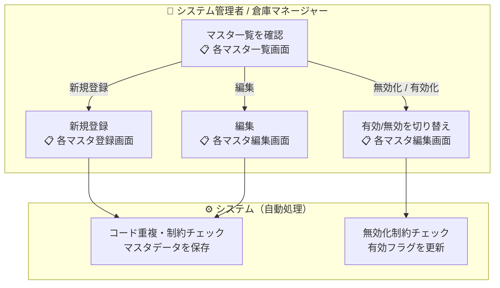
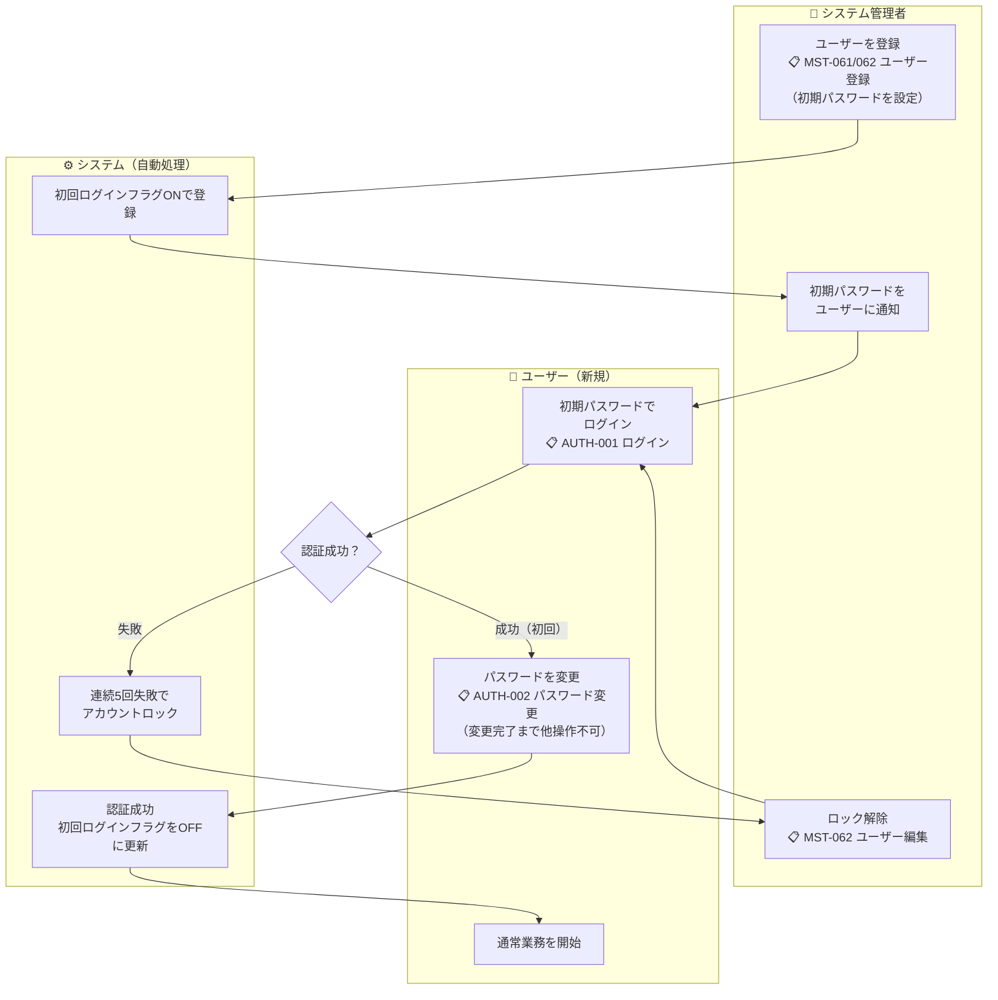

# 機能要件定義書 — マスタ管理

## 共通設計方針

| 項目 | 内容 |
|------|------|
| **削除方式** | 論理削除（有効/無効フラグ）。物理削除は行わない |
| **トランへのコピー** | トランザクションデータはマスタIDに加え、利用する名称等の情報をその時点でコピー保持する。マスタの変更・無効化後もトランデータは登録時の情報を維持する |
| **一括登録** | CSVインポート不要。初期データ・テストデータはFlywayのSQLスクリプトで投入する |
| **アクセス権限** | 認可方式は [07-auth-architecture.md](../architecture-blueprint/07-auth-architecture.md) の権限マトリクスに従う |
| **有効フラグ初期値** | 全マスタ共通。新規登録時の有効フラグはON固定（登録直後に無効化するケースは想定しない） |
| **営業日表示** | 全画面のヘッダーに現在営業日を表示する。営業日はシステムが管理する業務上の日付であり、日替処理（BAT-001）の実行によってのみ翌営業日に更新される |

---

## 業務フロー

### 共通マスタ登録フロー

商品・取引先・倉庫・棟・エリア・ロケーションマスタに共通するフロー。

### ユーザー登録・初回ログインフロー

---

## 1. 商品マスタ

### 機能一覧

| 機能 | 説明 |
|------|------|
| 商品一覧照会 | 登録済み商品を一覧表示する。有効・無効を絞り込める。一覧の表示列は「商品コード・商品名・保管条件・危険物フラグ・ロット管理フラグ・有効/無効」とする。賞味/使用期限管理フラグ・出荷禁止フラグは詳細（編集）画面でのみ確認する |
| 商品登録 | 新規商品を登録する |
| 商品編集 | 登録済み商品の情報を更新する |
| 商品無効化 / 有効化 | 商品の有効/無効を切り替える |

### 管理項目

| 項目 | 説明 |
|------|------|
| 商品コード | システム全体で一意。登録後は変更不可 |
| 商品名 | |
| 商品名カナ | |
| ケース入数 | 1ケースに含まれるボール数 |
| ボール入数 | 1ボールに含まれるバラ数 |
| バーコード / JANコード | |
| 保管条件 | 常温・冷蔵・冷凍 |
| 危険物フラグ | 危険物該当の有無 |
| 有効/無効フラグ | |
| ロット管理フラグ | ロット番号単位で在庫を追跡するか否か |
| 賞味/使用期限管理フラグ | 期限日を在庫に紐付けて管理するか否か |
| 出荷禁止フラグ | ONの場合、出荷指示・ピッキングで選択不可（回収・品質問題時の一時停止用） |

### ビジネスルール

- 商品コードはシステム全体で一意
- 商品コードは登録後に変更不可
- 無効化した商品は入荷・出荷・棚卸の新規登録で選択不可
- 既存トランザクション（入荷・出荷等）に紐づく商品の情報をトランが保持するため、商品情報を変更しても過去トランに影響しない
- ロット管理フラグONの商品は、入荷時にロット番号の入力が必須
- 賞味/使用期限管理フラグONの商品は、入荷時に期限日の入力が必須
- 出荷禁止フラグONの商品は、出荷指示・ピッキングで選択不可
- ロット管理フラグ・賞味/使用期限管理フラグは、在庫が存在する場合は変更不可

---

## 2. 取引先マスタ

### 機能一覧

| 機能 | 説明 |
|------|------|
| 取引先一覧照会 | 登録済み取引先を一覧表示する。種別・有効/無効で絞り込める |
| 取引先登録 | 新規取引先を登録する |
| 取引先編集 | 登録済み取引先の情報を更新する |
| 取引先無効化 / 有効化 | 取引先の有効/無効を切り替える |

### 管理項目

| 項目 | 説明 |
|------|------|
| 取引先コード | システム全体で一意。登録後は変更不可。半角英数字・記号、50文字以内 |
| 取引先名 | |
| 取引先名カナ | |
| 種別 | 仕入先 / 出荷先 / 両方 |
| 住所 | |
| 電話番号 | |
| 担当者名 | |
| メールアドレス | 連絡先として使用 |
| 有効/無効フラグ | |

### ビジネスルール

- 取引先コードはシステム全体で一意
- 取引先コードは登録後に変更不可
- 種別「仕入先」または「両方」の取引先のみ、入荷予定の入荷元として選択可能
- 種別「出荷先」または「両方」の取引先のみ、受注の出荷先として選択可能
- 無効化した取引先は新規の入荷・出荷の登録で選択不可

---

## 3. 倉庫マスタ

### 機能一覧

| 機能 | 説明 |
|------|------|
| 倉庫一覧照会 | 登録済み倉庫を一覧表示する |
| 倉庫登録 | 新規倉庫を登録する |
| 倉庫編集 | 倉庫情報を更新する（コードは変更不可） |
| 倉庫無効化 / 有効化 | 倉庫の有効/無効を切り替える |

### 管理項目

| 項目 | 説明 |
|------|------|
| 倉庫コード | システム全体で一意。登録後は変更不可。英大文字4文字固定（例：`WARA`） |
| 倉庫名 | |
| 倉庫名カナ | |
| 住所 | |
| 有効/無効フラグ | |

### ビジネスルール

- 倉庫コードはシステム全体で一意
- 倉庫コードは登録後に変更不可
- フロントエンドのヘッダーに倉庫切り替えプルダウンを常設し、選択中の倉庫で全業務画面をフィルタする
- **倉庫マスタ管理画面（倉庫一覧・登録・編集）はヘッダーの倉庫切替の影響を受けない**（全倉庫を一覧表示・管理する性質のため）
- 在庫が存在する倉庫は無効化不可

---

## 4. 棟マスタ

### 機能一覧

| 機能 | 説明 |
|------|------|
| 棟一覧照会 | 選択中倉庫の棟を一覧表示する |
| 棟登録 | 新規棟を登録する |
| 棟編集 | 棟名称を更新する（コードは変更不可） |
| 棟無効化 / 有効化 | 棟の有効/無効を切り替える |

### 管理項目

| 項目 | 説明 |
|------|------|
| 棟コード | 倉庫内で一意（A, B, C 等）。登録後は変更不可 |
| 棟名称 | |
| 倉庫コード | 所属倉庫 |
| 有効/無効フラグ | |

### ビジネスルール

- 棟コードは倉庫内で一意
- 棟コードは登録後に変更不可
- 配下にエリアが存在する棟は無効化不可

---

## 5. エリアマスタ

### 機能一覧

| 機能 | 説明 |
|------|------|
| エリア一覧照会 | 選択中倉庫のエリアを一覧表示する。棟で絞り込める |
| エリア登録 | 新規エリアを登録する |
| エリア編集 | エリア情報を更新する（コードは変更不可） |
| エリア無効化 / 有効化 | エリアの有効/無効を切り替える |

### 管理項目

| 項目 | 説明 |
|------|------|
| エリアコード | 棟内で一意。登録後は変更不可 |
| エリア名称 | |
| 倉庫コード | 所属倉庫 |
| 棟コード | 所属棟 |
| 保管条件 | 常温 / 冷蔵 / 冷凍 |
| エリア種別 | 在庫エリア / 入荷エリア / 出荷エリア / 返品エリア |
| 有効/無効フラグ | |

### ビジネスルール

- エリアコードは棟内で一意
- エリアコードは登録後に変更不可
- 入荷エリア・出荷エリア・返品エリアは棚番なしのロケーションをエリアごとに1件のみ登録する
- 配下にロケーションが存在するエリアは無効化不可

---

## 6. ロケーションマスタ

### 機能一覧

| 機能 | 説明 |
|------|------|
| ロケーション一覧照会 | 選択中倉庫のロケーションを一覧表示する。コードの前方一致で絞り込める |
| ロケーション登録 | 新規ロケーションを登録する |
| ロケーション編集 | ロケーション名称等を更新する（コードは変更不可） |
| ロケーション無効化 / 有効化 | ロケーションの有効/無効を切り替える |

### 管理項目

| 項目 | 説明 |
|------|------|
| ロケーションコード | 倉庫内で一意。在庫エリアは `棟(1桁英字)-フロア(2桁数字)-エリア(1桁英字)-棚(2桁数字)-段(2桁数字)-並び(2桁数字)` の形式（例：`A-01-A-01-01-01`）。入荷/出荷/返品エリアはエリアコードをそのまま使用 |
| ロケーション名称 | 任意の説明的な名前 |
| 倉庫コード | 所属倉庫 |
| エリアコード | 所属エリア |
| 有効/無効フラグ | |

### ビジネスルール

- ロケーションコードは倉庫内で一意（異なる倉庫間では同一コードを使用可能）
- ロケーションコードは登録後に変更不可
- 一覧の絞り込みはコードの前方一致で行う（棟→フロア→エリアの順に上位から絞り込める）
- 在庫が存在するロケーションは無効化不可
- 棚卸中のロケーションは無効化不可（棚卸確定後に無効化可能）
- 無効化したロケーションは入庫・在庫移動の登録で選択不可
- 入荷/出荷/返品エリアのロケーションはエリアごとに1件のみ登録可能

---

## 7. ユーザーマスタ

> 認証・認可の詳細は [07-auth-architecture.md](../architecture-blueprint/07-auth-architecture.md)、セキュリティ仕様は [10-security-architecture.md](../architecture-blueprint/10-security-architecture.md) を参照

### 機能一覧

| 機能 | 説明 | 操作可能ロール |
|------|------|--------------|
| ユーザー一覧照会 | 登録済みユーザーを一覧表示する | SYSTEM_ADMIN |
| ユーザー登録 | 新規ユーザーを登録し、初期パスワードを発行する | SYSTEM_ADMIN |
| ユーザー編集 | ユーザー情報（氏名・メールアドレス・ロール等）を更新する | SYSTEM_ADMIN |
| ユーザー無効化 / 有効化 | ユーザーの有効/無効を切り替える。切り替えはユーザー編集画面のステータスフィールドから行う（一覧からの独立ボタンは設けない） | SYSTEM_ADMIN |
| アカウントロック解除 | ログイン失敗によりロックされたアカウントを解除する | SYSTEM_ADMIN |

### 管理項目

| 項目 | 説明 |
|------|------|
| ユーザーコード | ログインIDとして使用。システム全体で一意。登録後は変更不可 |
| 氏名 | |
| メールアドレス | 通知・連絡先として使用。ログインIDとは別 |
| ロール | SYSTEM_ADMIN / WAREHOUSE_MANAGER / WAREHOUSE_STAFF / VIEWER |
| 有効/無効フラグ | |
| 初回ログインフラグ | ONの間は初回パスワード変更を強制（他操作不可） |

### ビジネスルール

- ユーザーコードはシステム全体で一意
- ユーザー登録時に SYSTEM_ADMIN が初期パスワードを設定する
- 登録されたユーザーは初回ログイン時にパスワード変更を強制される（変更完了まで他操作不可）
- ログイン失敗が連続5回でアカウントロック（ロック解除は SYSTEM_ADMIN のみ）
- 自分自身のロールを変更・無効化することはできない（誤操作による管理者不在の防止）
