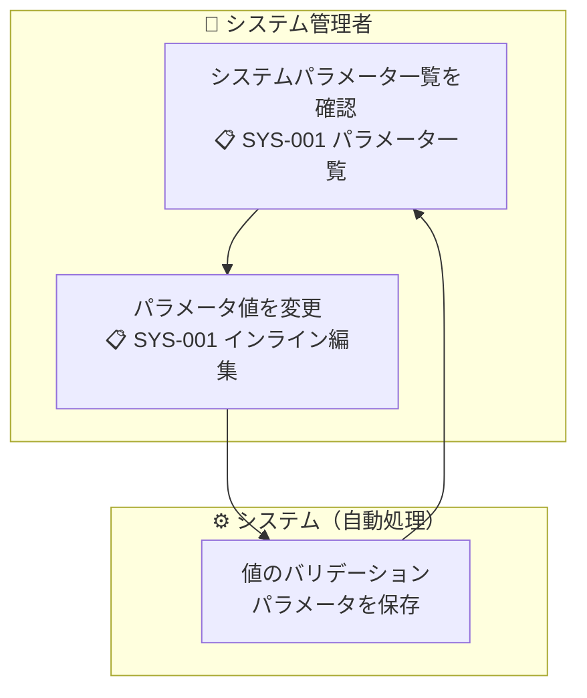

# 機能要件定義書 — システムパラメータ管理

## 概要

システム全体の動作を制御する設定値を管理する画面。パラメータの値の変更のみ可能で、パラメータの追加・削除はFlywayマイグレーション（開発者作業）で行う。

| 項目 | 内容 |
|------|------|
| **操作可能ロール** | SYSTEM_ADMIN のみ |
| **操作** | 値の参照・変更のみ（追加・削除は不可） |

---

## 業務フロー

---

## 機能一覧

### 1. パラメータ一覧照会（SYS-001）

- 登録済みのシステムパラメータを一覧表示する
- カテゴリでグルーピングして表示する
- 各パラメータのキー・表示名・現在値・説明・デフォルト値を表示する

### 2. パラメータ値変更（SYS-001 インライン編集）

- 一覧画面上でパラメータ値をインライン編集して保存する
- 値の型（整数・文字列等）に応じたバリデーションを行う
- 変更前の値を確認できる（変更前→変更後の表示）
- 保存時に確認ダイアログを表示する（「パラメータを変更します。よろしいですか？」）
- 変更はリアルタイムに反映される（アプリ再起動不要）

---

## パラメータ一覧

### 在庫管理カテゴリ

| パラメータキー | 表示名 | 型 | デフォルト値 | 説明 |
|---------------|--------|-----|------------|------|
| `LOCATION_CAPACITY_CASE` | ロケーション収容上限（ケース） | 整数 | 1 | 1ロケーションあたりのケース最大数 |
| `LOCATION_CAPACITY_BALL` | ロケーション収容上限（ボール） | 整数 | 6 | 1ロケーションあたりのボール最大数 |
| `LOCATION_CAPACITY_PIECE` | ロケーション収容上限（バラ） | 整数 | 100 | 1ロケーションあたりのバラ最大数 |

### 認証・セキュリティカテゴリ

| パラメータキー | 表示名 | 型 | デフォルト値 | 説明 |
|---------------|--------|-----|------------|------|
| `LOGIN_FAILURE_LOCK_COUNT` | ログイン失敗ロック回数 | 整数 | 5 | 連続ログイン失敗でアカウントをロックする回数 |
| `SESSION_TIMEOUT_MINUTES` | セッションタイムアウト（分） | 整数 | 60 | 最終操作からセッションが失効するまでの時間（分） |
| `PASSWORD_RESET_EXPIRY_MINUTES` | パスワードリセットリンク有効期限（分） | 整数 | 30 | パスワードリセットリンクの有効期限（分） |

---

## ビジネスルール

| ルール | 内容 |
|--------|------|
| **変更のみ** | 画面からはパラメータの値の変更のみ可能。パラメータの追加・削除はFlywayマイグレーションで行う |
| **バリデーション** | 整数型パラメータは正の整数のみ許可。型に応じたバリデーションを実施 |
| **即時反映** | 変更はアプリケーション再起動なしに即時反映される。バックエンドはパラメータ値をキャッシュせず、都度DBから取得する |
| **監査カラム** | 変更時に `updated_at`・`updated_by` を記録する。誰がいつ変更したかを追跡できる |
| **操作権限** | SYSTEM_ADMIN のみ。他ロールにはサイドメニューに表示しない |
