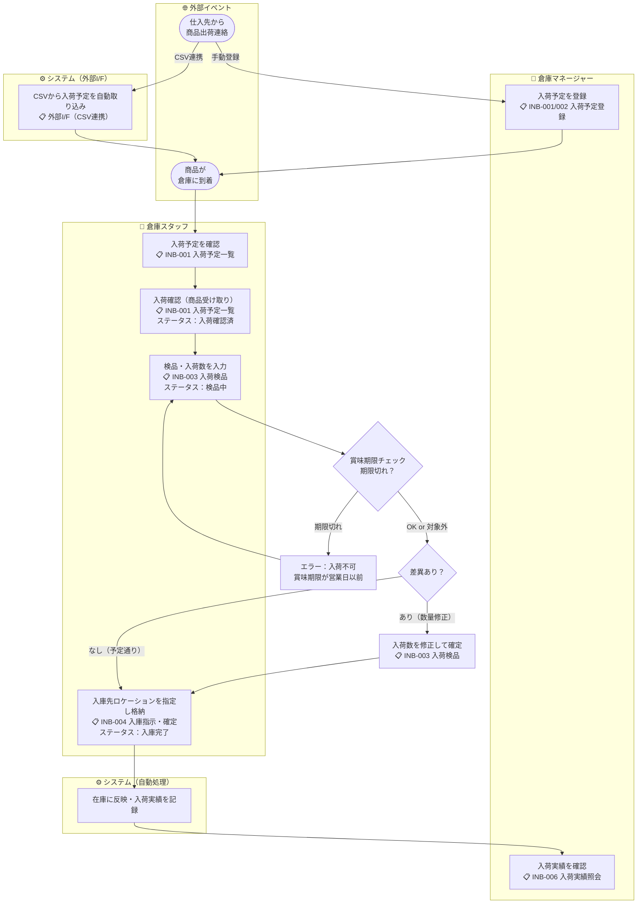

# 機能要件定義書 — 入荷管理

## 入荷種別

| 種別 | 登録方法 | 説明 |
|------|---------|------|
| **通常入荷** | 手動 または 外部I/F（CSV） | 仕入先取引先からの入荷 |
| **倉庫振替入荷** | 倉庫振替登録で自動生成 | 別倉庫からの在庫振替による入荷。振替伝票番号で振替元の出荷伝票と照会できる |

> 倉庫振替の登録フローは [04-outbound-management.md](04-outbound-management.md) の「倉庫振替登録」を参照。振替登録時に出荷側（振替元）・入荷側（振替先）の伝票が同時に生成される。生成後は各伝票が独立して処理される（在庫型倉庫のため通過管理は行わない）。

入荷予定一覧は **伝票番号・入荷予定日** で絞り込み可能（種別・ステータスでの絞り込みも可）。

---

## 業務フロー



---

## ステータス遷移

```
入荷予定 → 入荷確認済 → 検品中 → 一部入庫 → 入庫完了
                                          ↑
                                     (一部商品のみ入庫完了時)
```

| ステータス | 説明 |
|-----------|------|
| **入荷予定** | 入荷予定データが登録された初期状態 |
| **入荷確認済** | 入荷予定を担当者が確認・受領した状態 |
| **検品中** | 少なくとも1明細の検品が開始された状態 |
| **一部入庫** | 一部の商品明細の入庫が完了しているが全体未完了の状態 |
| **入庫完了** | 全商品明細の入庫が完了した状態 |

---

## 機能一覧

### 1. 入荷予定登録（手動）

- ユーザーが画面から直接入荷予定を登録できる（種別：通常入荷）
- 入荷予定日・仕入先・商品明細（商品・予定数量）を入力する
- 入荷予定日は**現在営業日以降**の日付を指定する（現在営業日より前の日付は登録不可）
- 同一伝票内に同一商品コードの明細を2行以上登録することはできない
- 登録時のステータスは「入荷予定」

### 2. 入荷予定取り込み（外部I/F）

- 外部I/F（CSV）から入荷予定を取り込める
- 取り込み仕様は [09-interface-architecture.md](../architecture-blueprint/09-interface-architecture.md) を参照
- 取り込み後のステータスは「入荷予定」

### 3. 入荷予定一覧照会

- 登録済みの入荷予定を一覧表示する
- ステータス・入荷予定日・仕入先で絞り込める

### 4. 入荷確認

- 「入荷予定」ステータスの入荷予定を「入荷確認済」に更新する
- 入荷物が届いたことを記録する操作

### 5. 入荷キャンセル

- 「入庫完了」以外のステータスの入荷予定をキャンセルできる
- キャンセルされた入荷予定は修正不可（再登録が必要）
- キャンセル時の在庫戻し処理は以下の条件で発動する：
  - ステータスが「一部入庫」の場合：入庫確定済み明細の在庫数量を在庫から減算して戻す
  - ステータスが「検品中」以下（入荷予定・入荷確認済・検品中）の場合：在庫への影響なし（検品は在庫を変動させない）

### 6. 入荷検品

- 伝票番号を条件に検品画面を開き、商品明細単位で入荷数を入力する
- **入荷数の初期値は入荷予定数と同数**にプリセットする。予定通り入荷していればそのまま確定ボタン1クリックで完了できる
- 差異がある明細のみ入荷数を修正して確定する
- 最初の検品入力でステータスが「検品中」に遷移する
- 検品数が予定数と異なる場合も、検品数をそのまま確定できる（差異は記録として保持）
- 入力済みの検品数は確定前であれば修正可能
- **賞味期限管理対象商品**（`expiry_manage_flag = true`）の場合、検品時に賞味期限を入力する。入力された賞味期限が営業日以前（期限切れ）の場合はエラーとし、入荷を受け付けない（エラーメッセージ：「賞味期限が営業日以前の商品は入荷できません」）
- 検品実施前に **入荷検品レポート**（伝票番号・入荷予定日で絞り込み可）をPDF出力して作業帳票として使用できる

### 7. 入庫指示・確定

- 検品済みの商品明細ごとに入庫先ロケーションを指定して入庫を確定する
- **ロケーション自動割当**：システムが以下の優先順で候補ロケーションを初期表示する
  1. 同一商品の既存在庫があるロケーション
  2. 在庫ゼロの空きロケーション（先着順）
- ユーザーは自動割当候補をそのまま使うか、別のロケーションを選択できる
- 商品明細を個別に入庫確定できる（全明細一括・部分確定どちらも可）
- 一部の明細のみ入庫確定するとステータスが「一部入庫」に遷移する
- 全明細の入庫確定でステータスが「入庫完了」に遷移する

### 8. 入荷実績照会

- 入庫完了した入荷実績を照会できる
- 照会の単位は**伝票単位**とする（伝票を選択して明細を展開する2段階表示）
- 入荷予定数・検品数・差異数を確認できる

---

## ビジネスルール

| ルール | 内容 |
|--------|------|
| **営業日基準** | 全操作は現在営業日を基準とする。「今日」「当日」「本日」はすべて現在営業日を意味する。現在営業日は日替処理（BAT-001）の実行によってのみ更新される |
| 手動登録とCSV取り込みの共存 | どちらの方法で作成した入荷予定も同一の業務フローで処理する |
| 検品差異の扱い | 予定数と検品数の差異はデータとして記録するが、確定を妨げない |
| 修正不可 | 作成済みの入荷予定の内容（明細・数量等）は変更不可。修正が必要な場合はキャンセルして再登録 |
| 未入荷の扱い | 入荷予定日を過ぎても入庫完了していない入荷予定は、日替処理で未入荷として記録し帳票出力できる |
| 倉庫振替入荷のキャンセル | 倉庫振替入荷は単独でキャンセルできる（振替元の出荷伝票とは独立。在庫型倉庫のため連動しない） |
| 倉庫コードの保持 | 全入荷レコードに倉庫コードを保持する（選択中倉庫を自動セット） |
| トランへのマスタ情報コピー | 入荷データには商品コード・商品名・取引先コード・取引先名・倉庫コード・倉庫名等をコピー保持する |
| **期限切れ商品の入荷防止** | 賞味期限管理対象商品（`expiry_manage_flag = true`）の入荷検品時、入力された賞味期限が営業日以前（期限切れ）の場合は入荷を受け付けない |
