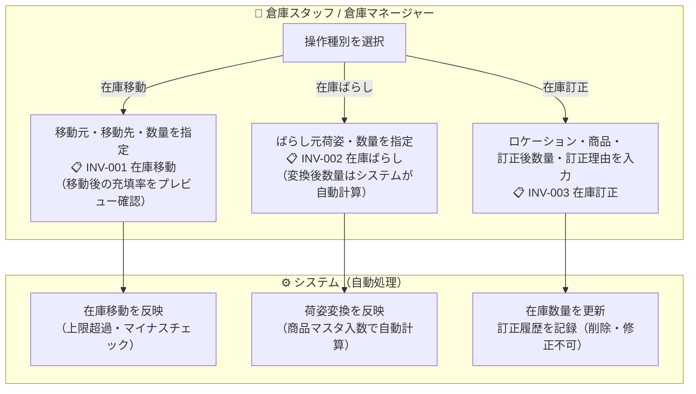
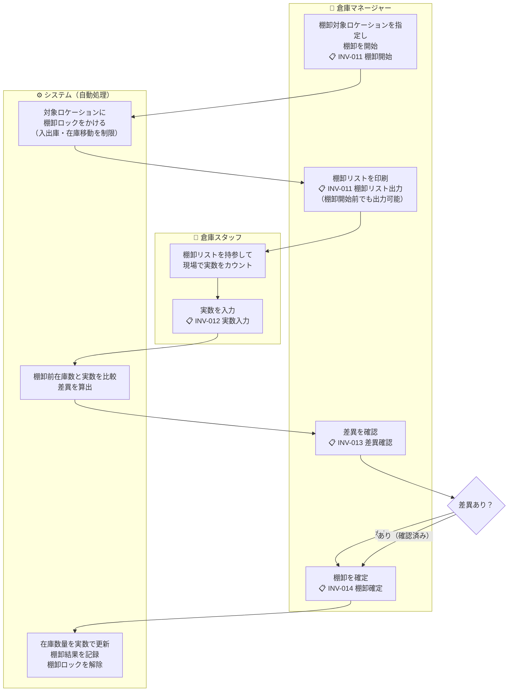

# 機能要件定義書 — 在庫管理

## 在庫の管理単位

在庫は **ロケーション × 商品 × 荷姿** の組み合わせで管理する。

### 荷姿の種類

| 荷姿 | 説明 |
|------|------|
| **ケース** | 最大単位。段ボール等の梱包単位 |
| **ボール** | 中間単位。6個入り等、少量がまとまった単位 |
| **バラ** | 最小単位。1個単位 |

荷姿間の変換レート（ケース入数・ボール入数）は商品マスタで管理する。

---

## 業務フロー

### 在庫操作フロー（移動・ばらし・訂正）

### 棚卸業務フロー

---

## 機能一覧

### 1. 在庫照会

- ロケーション・商品・荷姿で絞り込んで在庫を照会できる
- 商品単位での合計在庫数（荷姿別・全体）を確認できる。商品ごとの全荷姿バラ換算合計も表示できる
- ロケーション別の在庫一覧を確認できる
- 棚卸ロック中のロケーションは在庫一覧で視覚的に区別して表示する（ロックアイコンまたはバッジを付与）

### 2. 在庫移動

- 在庫をあるロケーションから別のロケーションへ移動できる
- 移動元ロケーション・移動先ロケーション・商品・荷姿・数量を指定して実行する
- 移動元の在庫が指定数量を下回る場合はエラー

### 3. 在庫ばらし

- 大きな荷姿を小さな荷姿に分解できる
  - ケース → ボール（1ケース = 商品マスタのケース入数 分のボールに変換）
  - ケース → バラ（1ケース = ケース入数 × ボール入数 分のバラに変換）
  - ボール → バラ（1ボール = 商品マスタのボール入数 分のバラに変換）
- ばらし元・ばらし先のロケーションは同一でも別でも指定可能
- 変換後の数量はシステムが自動計算して表示する（ユーザーが確認して実行）
- まとめ（小→大）機能は対象外

### 4. 在庫訂正

- 在庫数量を直接補正できる（増加・減少どちらも可）
- 訂正時に訂正理由を入力必須とする
- 訂正の履歴（訂正日時・対象ロケーション/商品/荷姿・訂正前数量・訂正後数量・訂正理由・実施者）をすべて記録する
- 在庫訂正一覧は帳票出力できる

### 5. 棚卸

- ロケーションを範囲指定して棚卸を実施できる（例：棟Aのみ、特定エリアのみ）
- 1回の棚卸で扱う明細数の上限は **2,000行** とする（パフォーマンス設計の前提）
- 棚卸の流れ：
  1. **棚卸開始**：対象ロケーション範囲を指定して棚卸を開始する。棚卸リストを帳票出力できる（棚卸開始前・対象ロケーション選択後でも出力可能）
  2. **実数入力**：ロケーション・商品・荷姿ごとに実際に数えた数量を画面入力する
  3. **差異確認**：システムが棚卸前在庫数と入力実数を比較し差異を表示する
  4. **棚卸確定**：差異を確認の上、確定すると在庫数が実数に更新される。棚卸結果の棚卸日は確定時の現在営業日で記録する
- 棚卸中（開始〜確定前）のロケーションへの入出庫を制限する（棚卸ロック）
- 棚卸結果（差異含む）は記録として保持し、帳票出力できる

---

## ロケーション収容制約

同一ロケーションには **1種類の商品** のみ保管できる（混在不可）。さらに荷姿ごとに以下の上限数を設ける。在庫移動画面では移動後の充填率（上限に対する使用率）をプレビュー表示し、上限超過になる場合は移動前に確認できるようにする。

| 荷姿 | 上限数（デフォルト） |
|------|-----------------|
| **ケース** | 1 |
| **ボール** | 6 |
| **バラ** | 100 |

> これらの上限値は **システムパラメータ** として管理し、管理画面から変更可能とする。

上限超過となる入庫・在庫移動はエラーとする（確認なしに上限を超えた数量を登録することはできない）。

---

## ビジネスルール

| ルール | 内容 |
|--------|------|
| **営業日基準** | 全操作は現在営業日を基準とする。在庫訂正・棚卸等の各操作の実施日は現在営業日で記録する。現在営業日は日替処理（BAT-001）の実行によってのみ更新される |
| 在庫マイナス禁止 | 在庫移動・ばらし・出荷確定において在庫数が0を下回る操作はエラー。在庫訂正においても訂正後数量は0以上でなければならない |
| ロケーション単一商品 | 同一ロケーションには1種類の商品のみ保管可能。異なる商品を入庫しようとした場合はエラー |
| ロケーション上限超過禁止 | 荷姿ごとのロケーション収容上限（システムパラメータ）を超える入庫・移動はエラー |
| 在庫訂正の記録 | 在庫訂正は必ず履歴として記録する。削除・修正は不可 |
| 棚卸ロック | 棚卸中のロケーションは入出庫操作（入庫指示・出荷確定・在庫移動）の対象外とする |
| 荷姿変換の自動計算 | ばらし時の変換数量は商品マスタの入数から自動計算する。端数が出る場合はエラー（端数ばらし不可） |
| トランへのマスタ情報コピー | 在庫訂正・棚卸等のトランには商品コード・商品名・ロケーションコード等をコピー保持する |
