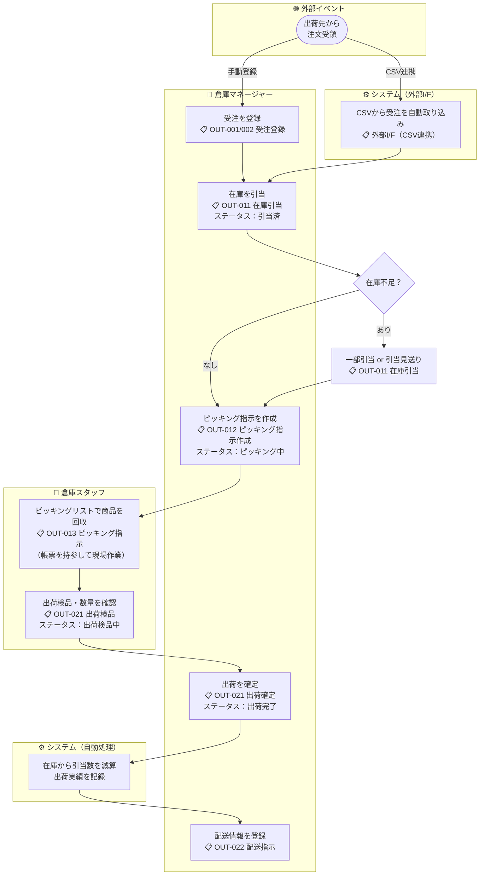

# 機能要件定義書 — 出荷管理

## 出荷種別

| 種別 | 説明 |
|------|------|
| **通常出荷** | 出荷先取引先への出荷 |
| **倉庫振替出荷** | 別倉庫への在庫振替による出荷。振替伝票番号で振替先の入荷伝票と照会できる |

---

## 業務フロー



---

## ステータス遷移

```
受注 → 一部引当 → 引当済 → ピッキング中 → 出荷検品中 → 出荷完了
```

| ステータス | 説明 |
|-----------|------|
| **受注** | 受注データが登録された初期状態。在庫未引当 |
| **一部引当** | 一部の明細または数量のみ引当済み。不足分が残っている状態 |
| **引当済（ALLOCATED）** | 全明細の在庫引当が完了した状態。引当完了はピッキング指示済みを意味する。独立した「ピッキング中」ステータスは設けず、引当完了後にピッキング指示が作成される運用とする |
| **ピッキング中** | ピッキング指示が作成された状態 |
| **出荷検品中** | 少なくとも1明細の出荷検品が開始された状態 |
| **出荷完了** | 全明細の出荷検品・確定が完了した状態 |

---

## 荷姿について

出荷管理で扱う荷姿（ケース・ボール・バラ）の定義および変換レートは [03-inventory-management.md](03-inventory-management.md) に準じる。

---

## 機能一覧

### 1. 受注登録（手動）

- ユーザーが画面から直接受注を登録できる（種別：通常出荷）
- 出荷予定日・出荷先取引先・商品明細（商品・荷姿・数量）を入力する
- 登録時のステータスは「受注」

### 2. 倉庫振替登録

- 振替元倉庫（選択中倉庫）・振替先倉庫・振替予定日・商品明細（商品・荷姿・数量）を入力する
- 登録時に以下の2件の伝票を同時に生成する
  - 振替元倉庫の出荷伝票（種別：倉庫振替出荷、ステータス：受注）
  - 振替先倉庫の入荷伝票（種別：倉庫振替入荷、ステータス：入荷予定）
- 2件の伝票は振替伝票番号で照会可能（参照用）
- 生成後は各伝票が独立して処理される（在庫型倉庫のため通過管理は行わない）
- 以降の処理は通常出荷・通常入荷と同じフローで処理する

### 3. 受注取り込み（外部I/F）

- 外部I/F（CSV）から受注を取り込める
- 取り込み仕様は [09-interface-architecture.md](../architecture-blueprint/09-interface-architecture.md) を参照
- 取り込み後のステータスは「受注」

### 4. 受注一覧照会

- 登録済みの受注を一覧表示する
- ステータス・出荷予定日・出荷先で絞り込める

### 5. 在庫引当

> 在庫引当は独立モジュール（`allocation`）として実装する。詳細は [04a-allocation.md](04a-allocation.md) を参照。

- 受注を選択して引当実行画面（在庫引当モジュール）から実行する
- FIFO/FEFO による自動引当、荷姿ばらし自動実行、部分引当に対応
- 引当完了でステータスが「引当済」、部分引当の場合は「一部引当」に遷移する

### 6. ピッキング指示作成

- 「引当済」の受注を複数まとめてピッキング指示1件として作成できる（バッチピッキング）
- ピッキング対象エリアを指定してリストを生成することで、そのエリア内の商品を効率的に回収できる
- ピッキングリストを帳票出力できる（ロケーション順にソートされた作業リスト）
- 指示作成後にステータスが「ピッキング中」に遷移する
- ピッキング完了後、ピッキング指示画面（OUT-013）に対象受注の一覧を表示し、受注ごとに「出荷検品へ」ボタンから出荷検品画面（OUT-021）へ個別に遷移する

### 7. 出荷検品

- ピッキング完了後、商品明細単位で検品数量を入力する
- 検品数がピッキング数と異なる場合も、検品数をそのまま出荷数として確定できる（差異は記録として保持）
- 最初の検品入力でステータスが「出荷検品中」に遷移する

### 8. 出荷確定

- 全明細の出荷検品完了後、出荷を確定する
- 確定時に引当在庫が実際の在庫から減算される
- ステータスが「出荷完了」に遷移する

### 9. 配送指示

- 出荷完了した受注に対して配送情報を登録できる
- 配送業者・送り状番号を入力して管理する
- 配送リストを帳票出力できる（出荷完了した受注の配送情報一覧）
- 操作可能ロール：SYSTEM_ADMIN・WAREHOUSE_MANAGER・WAREHOUSE_STAFF

### 10. 受注キャンセル

- 「受注（ORDERED）」「一部引当（PARTIAL_ALLOCATED）」「引当済（ALLOCATED）」のステータスの受注をキャンセルできる（PICKING_COMPLETED以降はキャンセル不可）
- 引当済みの在庫がある場合はキャンセル時に引当を解放する

---

## ビジネスルール

| ルール | 内容 |
|--------|------|
| **営業日基準** | 全操作は現在営業日を基準とする。「今日」「当日」「本日」はすべて現在営業日を意味する。現在営業日は日替処理（BAT-001）の実行によってのみ更新される |
| 手動登録とCSV取り込みの共存 | どちらの方法で作成した受注も同一の業務フローで処理する |
| 引当ルール | 在庫引当モジュール（[04a-allocation.md](04a-allocation.md)）に従う。FIFO/FEFO、ばらし自動実行、部分引当に対応 |
| 検品差異の扱い | 予定数と検品数の差異はデータとして記録するが、確定を妨げない |
| 在庫減算タイミング | 引当時は在庫を仮確保（引当数として管理）し、出荷確定時に実際の在庫から減算する |
| キャンセル可能範囲 | キャンセル可能なステータスは ORDERED、PARTIAL_ALLOCATED、ALLOCATED のみ。PICKING_COMPLETED 以降はキャンセル不可 |
| 倉庫振替出荷のキャンセル | 倉庫振替出荷は単独でキャンセルできる（振替先の入荷伝票とは独立。在庫型倉庫のため連動しない） |
| 倉庫コードの保持 | 全出荷レコードに倉庫コードを保持する（選択中倉庫を自動セット） |
| トランへのマスタ情報コピー | 受注データには商品コード・商品名・荷姿・取引先コード・取引先名・倉庫コード・倉庫名等をコピー保持する |
