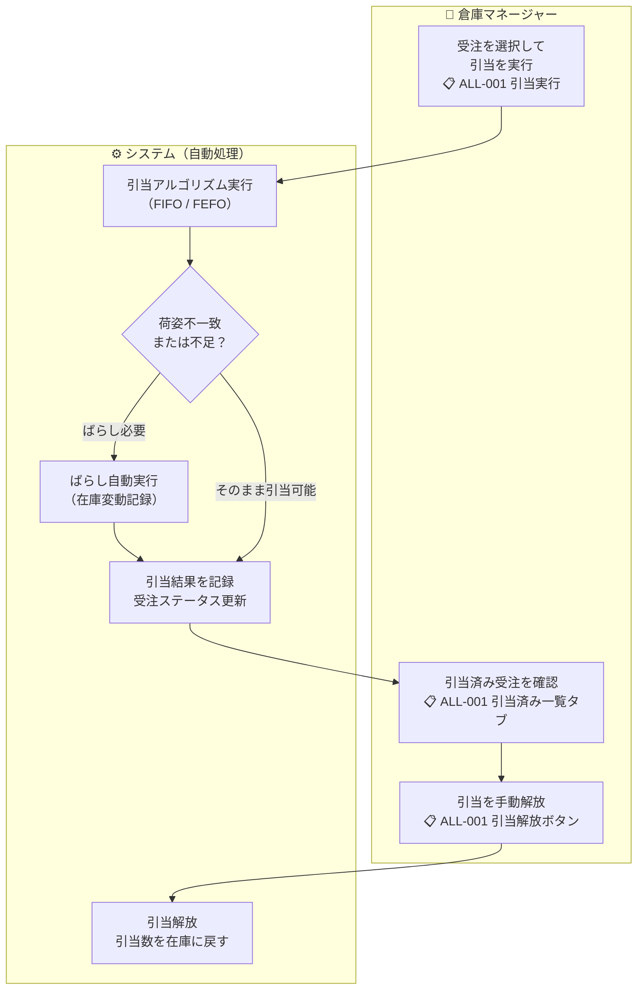

# 機能要件定義書 — 在庫引当

## 概要

受注データに対して在庫を引き当て、ピッキング可能な状態にするモジュール。出荷管理（受注登録）と在庫管理の中間に位置し、独立した画面・APIを持つ。

| 項目 | 内容 |
|------|------|
| **モジュール** | `allocation` |
| **操作可能ロール** | SYSTEM_ADMIN、WAREHOUSE_MANAGER |
| **前提** | 受注が「受注」ステータスであること |

---

## 業務フロー



---

## 引当アルゴリズム

### 基本ルール

受注単位（1受注の全明細をまとめて）で引当を実行する。明細ごとに以下のアルゴリズムで在庫を割り当てる。

### 引当優先順位

| 優先度 | 条件 | 適用対象 |
|--------|------|---------|
| **1（最優先）** | 賞味/使用期限が短い順（FEFO: First Expiry, First Out） | 賞味/使用期限管理フラグONの商品 |
| **2** | 入庫日時が古い順（FIFO: First In, First Out） | 全商品共通（FEFO同率の場合もFIFOで決定） |

> 入庫日時は `inventory_movements` テーブルの入庫タイプ（INBOUND）の日時を基準とする。

### 荷姿ばらし指示

引当対象の荷姿で在庫が不足している場合、システムが引当と同時にばらし指示を自動生成する。

**ばらし指示のステータス管理:**

```
指示済（INSTRUCTED） → 完了（COMPLETED）
```

| ステータス | 説明 |
|-----------|------|
| **指示済** | 引当実行時にシステムがばらし指示を自動生成した状態。在庫はまだ変動していない |
| **完了** | 倉庫スタッフが現場でばらし作業を実施し、完了を記録した状態。在庫が変動する |

**ばらし指示ルール:**

| 項目 | 内容 |
|------|------|
| **トリガー** | 引当実行時に、指定荷姿の在庫（有効在庫）が受注数量に不足している場合 |
| **ばらし対象** | 不足分を充足するために必要な最小数のより大きい荷姿 |
| **ばらし優先順位** | 小さい荷姿から優先（ボール→バラ を ケース→バラ より先に実行） |
| **指示生成** | 引当実行と同時にばらし指示を自動生成する。引当結果画面にばらし指示の内容を表示する |
| **引当の仮確保** | ばらし指示生成時に、ばらし元の在庫を引当数（`allocated_qty`）として仮確保する。ばらし完了前でも他の引当に取られないようにする |
| **在庫変動タイミング** | ばらし指示を「完了」にしたタイミングで在庫が変動する（ばらし元の荷姿を減算、ばらし先の荷姿を加算） |
| **在庫変動記録** | ばらし完了時に `inventory_movements` に種別「BREAKDOWN_OUT / BREAKDOWN_IN」として記録する |
| **ピッキング開始条件** | ばらし指示が「完了」にならないとピッキング指示を作成できない |

**例: バラ10個の引当指示に対し、バラ在庫5 + ボール在庫1（ボール入数=6）の場合**

1. バラ5を引当（`allocated_qty` += 5）
2. ボール1のばらし指示を自動生成（ボール1 → バラ6）。ボールの`allocated_qty` += 1
3. 倉庫スタッフが現場でボールをばらし、完了を記録
4. 在庫変動: ボール -= 1（`allocated_qty` も -= 1）、バラ += 6
5. 新たに生まれたバラ6のうち5を引当（`allocated_qty` += 5）
6. 合計バラ10が引当済み

### 部分引当

在庫が不足している場合（ばらし実行後も不足の場合）、引当可能な数量のみを引当する（部分引当）。

| 項目 | 内容 |
|------|------|
| **動作** | 在庫がある分だけ引当し、不足分は「未引当」として残す |
| **受注ステータス** | 全明細が完全引当 →「引当済」/ 一部未引当あり →「一部引当」 |
| **未引当の表示** | 引当結果画面に未引当明細と不足数量を表示する |
| **再引当** | 「一部引当」状態の受注は再度引当を実行できる（在庫補充後に不足分を引当） |

---

## ステータス遷移

出荷管理の受注ステータスに「一部引当」を追加する。

```
受注 → 一部引当 → 引当済 → ピッキング中 → 出荷検品中 → 出荷完了
```

| ステータス | 説明 |
|-----------|------|
| **受注** | 受注データが登録された初期状態。在庫未引当 |
| **一部引当** | 一部の明細または数量のみ引当済み。不足分が残っている状態 |
| **引当済** | 全明細の在庫引当が完了した状態 |

> 「一部引当」から「引当済」への遷移は、再引当で全明細の引当が完了した時点で自動的に行われる。

---

## 引当データの管理

### 引当数の管理

`inventories` テーブルに `allocated_qty`（引当数）カラムを追加して管理する。

| 項目 | 内容 |
|------|------|
| **在庫数（quantity）** | ロケーション上の物理的な在庫数 |
| **引当数（allocated_qty）** | 引当済みの数量。出荷確定まで保持 |
| **有効在庫数** | `quantity - allocated_qty`（新規引当・移動・ばらし等で利用可能な数量） |

> 引当処理は有効在庫数（`quantity - allocated_qty`）に対して行う。引当数がquantityを超えることはない。

### 引当明細の記録

引当実行時に、受注明細とロケーション在庫の紐付けを記録する。ピッキング指示作成時にこの紐付けを使用する。

| 記録項目 | 内容 |
|---------|------|
| 受注明細ID | どの受注明細に対する引当か |
| ロケーションID | どのロケーションから引当したか |
| 引当数量 | そのロケーションからの引当数 |
| ロット番号 | ロット管理品の場合 |
| 賞味/使用期限日 | 期限管理品の場合 |

> 1つの受注明細が複数ロケーションから引当される場合がある（在庫が分散している場合）。

---

## 機能一覧

### 1. 引当実行

- 「受注」または「一部引当」ステータスの受注を1件以上選択して一括引当を実行する
- 引当は受注単位で実行する（受注内の全明細をまとめて処理）
- 引当アルゴリズムに従い、FIFO/FEFOで自動的にロケーションを割り当てる
- 荷姿不一致・不足時はばらし指示を自動生成して引当を計画する
- 在庫不足時は部分引当を行い、結果画面に未引当明細を表示する
- 引当結果（引当されたロケーション・数量・ばらし指示の内容）を画面に表示する

### 1a. ばらし完了登録

- 引当時に生成されたばらし指示の一覧を表示する
- 倉庫スタッフが現場でばらし作業を実施後、ばらし指示を「完了」にする
- 完了時に在庫が変動する（ばらし元の荷姿を減算、ばらし先の荷姿を加算）
- 全てのばらし指示が完了しないとピッキング指示を作成できない

### 2. 引当済み受注一覧（引当実行画面のタブ）

- 引当済み（「一部引当」「引当済」ステータス）の受注を一覧表示する
- 各受注の引当状況（全量引当 / 一部引当）を確認できる
- 受注を選択して引当解放を実行できる

### 3. 引当解放

- 引当済みの受注を選択して引当を解放する（受注単位）
- 解放された引当数は有効在庫に戻る（`allocated_qty` を減算）
- 引当解放後の受注ステータスは「受注」に戻る
- 「ピッキング中」以降のステータスの受注は引当解放できない

---

## ビジネスルール

| ルール | 内容 |
|--------|------|
| **営業日基準** | 全操作は現在営業日を基準とする。現在営業日は日替処理（BAT-001）の実行によってのみ更新される |
| **引当単位** | 受注単位で引当を実行する。明細単位の個別引当は行わない |
| **FIFO / FEFO** | 賞味/使用期限管理品はFEFO（期限短い順）、それ以外はFIFO（入庫日時古い順）で引当する |
| **ばらし指示** | 荷姿不足時はシステムが引当と同時にばらし指示を自動生成する。ばらし優先順はボール→バラ、ケース→バラ、ケース→ボールの順 |
| **ばらしステータス管理** | ばらし指示は「指示済」→「完了」の2ステータスで管理する。完了時に在庫が変動する |
| **ばらしとピッキング** | ばらし指示が全件「完了」にならないとピッキング指示を作成できない |
| **部分引当** | 在庫不足時は引当可能な分だけ引当する。全量が揃わなくても引当を実行できる |
| **引当対象在庫** | 有効在庫数（`quantity - allocated_qty`）が対象。他の受注で引当済みの在庫は対象外 |
| **引当解放** | 受注単位で手動解放可能。「ピッキング中」以降は解放不可 |
| **キャンセル時自動解放** | 受注キャンセル時は引当を自動的に解放する |
| **棚卸ロック中ロケーション** | 棚卸中のロケーションの在庫は引当対象外とする |
| **出荷禁止商品** | 出荷禁止フラグONの商品は引当対象外とする |
| **倉庫コードの保持** | 引当データに選択中倉庫コードを保持する |
