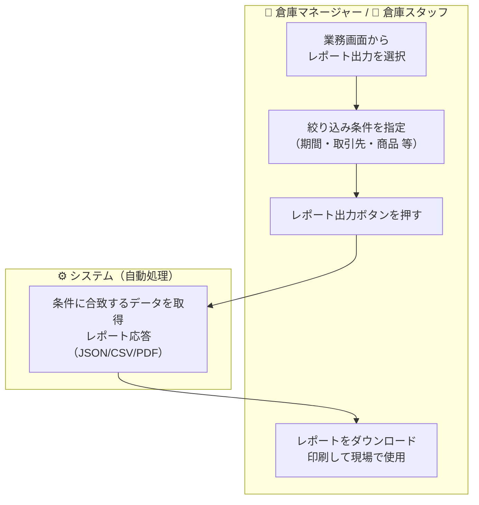

# 機能要件定義書 — レポート

## 共通仕様

| 項目 | 内容 |
|------|------|
| **出力形式** | JSON/CSV/PDF（API経由で出力） |
| **配置方針** | 各業務メニュー内に配置（レポート専用メニューは設けない） |

---

## 業務フロー

レポートは各業務メニュー内から呼び出す。共通の出力フローは以下の通り。

---

※RPT-02は欠番

## 入荷管理メニュー内レポート

### 1. 入荷検品レポート

- 入荷検品の作業帳票として使用するPDF
- **伝票番号・入荷予定日** で絞り込んで出力する
- 伝票番号・入荷予定日・仕入先・商品明細（商品コード・商品名・荷姿別数量（ケース/バラ）・入荷数記入欄）を含む
  - ※ケース数量・バラ数量をそれぞれ個別列で表示する。荷姿列は設けない
- 倉庫スタッフが現場での検品作業に携行して使用する

### 3. 入荷予定レポート

- 指定期間・仕入先・ステータスで絞り込んだ入荷予定の一覧を出力する
- 入荷予定日・仕入先・商品・予定数量・ステータスを含む

### 4. 入庫実績レポート

- 指定期間・仕入先・商品で絞り込んだ入庫実績の一覧を出力する
- 入荷予定数・検品数・差異数を並べて確認できる

### 5. 未入荷リスト（リアルタイム）

- バッチ処理不要。画面表示時点のデータをリアルタイムで出力する
- **対象**：指定基準日（asOfDate）以前の入荷予定日を持ち、ステータスが入庫完了でない入荷伝票
- 入荷予定日・仕入先・商品・予定数量・現在ステータスを含む
- 現在営業日の業務状況確認・督促に使用する

### 6. 未入荷リスト（確定）

- 日替処理で自動生成されるデータをもとに出力する
- **対象**：前日以前の入荷予定日を過ぎても入庫完了していない入荷予定（日替処理確定済み）
- 入荷予定日・仕入先・商品・予定数量・現在ステータスを含む
- 翌日以降の未処理案件の管理・報告に使用する

---

## 在庫管理メニュー内レポート

### 7. 在庫一覧レポート

- ロケーション・商品・荷姿・保管条件で絞り込んだ現在在庫の一覧を出力する
- ロケーションコード・商品・荷姿・在庫数量を含む

### 8. 在庫推移レポート（入出庫履歴）

- 指定期間・商品・ロケーションで絞り込んだ在庫変動履歴を出力する
- 日時・種別（入庫/出庫/移動/ばらし/訂正/棚卸）・数量・変動後在庫数を時系列で表示する
- 棚卸差異の原因調査や在庫動向の把握に使用する

### 9. 在庫訂正一覧

- 指定期間に実施した在庫訂正の一覧を出力する
- 訂正日時・対象ロケーション・商品・荷姿・訂正前数量・訂正後数量・訂正理由・実施者を含む

### 10. 棚卸リスト

- 棚卸開始時に出力する作業用帳票
- 対象ロケーション範囲・商品・荷姿・棚卸前在庫数を含む（実数記入欄あり）
  - ※PDF出力時は帳簿数量カラムを非表示にできる（`hideBookQty=true` パラメータ）。現場カウント時に帳簿数量が見えると先入観でカウント精度が下がるため
- ロケーションコード順にソートして出力する

### 11. 棚卸結果レポート

- 棚卸確定後に出力する
- ロケーション・商品・荷姿・棚卸前数量・実数・差異数を含む
- 差異があった明細を識別できる

---

## 出荷管理メニュー内レポート

### 12. ピッキング指示書

- ピッキング指示作成時に出力する作業用帳票
- 指定エリア内のロケーション順にソートして出力する（効率的なピッキング動線を実現）
- ロケーション・商品・荷姿・ピッキング数量・対応受注番号を含む

### 13. 出荷検品レポート

- 指定された出荷伝票ID（単数または複数指定可）の検品結果を出力する
- 受注数量・出荷数量・差異数を並べて確認できる

### 14. 配送リスト

- 出荷完了した受注の配送情報一覧を出力する
- 伝票ヘッダー（出荷先、配送業者、送り状番号等）+ 商品明細（商品コード、商品名、数量、荷姿）を含む
- 指定期間・配送業者で絞り込める

### 15. 未出荷リスト（リアルタイム）

- バッチ処理不要。画面表示時点のデータをリアルタイムで出力する
- **対象**：基準日（asOfDate）以前の出荷予定日で、出荷完了していない伝票
- 出荷予定日・出荷先・商品・受注数量・現在ステータスを含む
- 現在営業日の業務状況確認・出荷督促に使用する

### 16. 未出荷リスト（確定）

- 日替処理で自動生成されるデータをもとに出力する
- **対象**：前日以前の出荷予定日を過ぎても出荷完了していない受注（日替処理確定済み）
- 出荷予定日・出荷先・商品・受注数量・現在ステータスを含む
- 翌日以降の未処理案件の管理・報告・取引先対応に使用する

---

## バッチ処理メニュー内レポート

### 17. 日次集計レポート

- 日替処理実行後に出力できる
- 対象営業日の入荷・出荷・在庫の集計サマリーを出力する
- 入荷件数・入荷数量合計、出荷件数・出荷数量合計、在庫数量（営業日末時点）、未入荷件数、未出荷件数を含む
