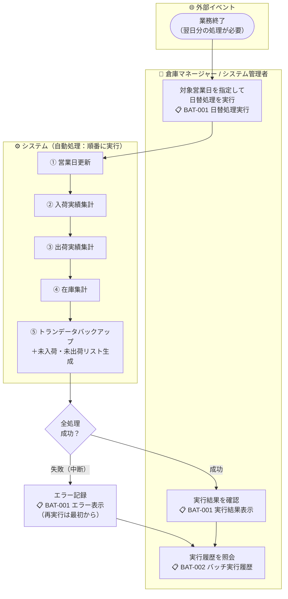

# 機能要件定義書 — バッチ処理

## 営業日について

営業日とは、システムが管理する業務上の日付であり、カレンダー上のシステム日付（サーバー時刻）とは独立している。

| 項目 | 内容 |
|------|------|
| **定義** | システムが内部で保持する「業務上の今日」を表す日付 |
| **更新タイミング** | 日替処理（BAT-001）の実行によってのみ翌営業日に更新される。日替処理を実行しない限り、カレンダーの日付が変わっても営業日は変わらない |
| **業務への影響** | 全ての業務操作（入荷予定・受注・在庫操作・各種照会）は現在営業日を基準とする。「今日」「当日」「本日」はすべて現在営業日を意味する |
| **画面表示** | 全画面のヘッダーに現在営業日を常時表示する |

---

## 実行方式

| 項目 | 内容 |
|------|------|
| **実行方法** | バッチ管理画面から手動実行（対象営業日を指定して実行ボタンを押す） |
| **実行単位** | 5種をまとめた「日替処理」として1回の操作で実行する |
| **二重実行** | 同一営業日に処理済みの場合はエラーにして実行不可 |
| **実行権限** | SYSTEM_ADMIN・WAREHOUSE_MANAGER のみ実行可 |

---

## 業務フロー

---

## 日替処理の内容

5種を以下の順序で内部的に順番に実行する。各ステップの完了状態をDBに記録し、いずれか1つが失敗した場合は処理を中断する。

| 順序 | 処理名 | 内容 |
|------|--------|------|
| 1 | **営業日更新** | システムの現在営業日を翌営業日に更新する。冪等性あり（既に更新済みの場合はスキップ） |
| 2 | **入荷実績集計** | 対象営業日の入庫完了データを集計し、入荷実績サマリーを生成する |
| 3 | **出荷実績集計** | 対象営業日の出荷完了データを集計し、出荷実績サマリーを生成する |
| 4 | **在庫集計** | 対象営業日末時点の在庫数量サマリーを生成する |
| 5 | **トランデータバックアップ** | ステータスが完了状態（入庫完了・出荷完了・棚卸確定等）かつ **2か月以上前** のトランザクションデータ（入荷・出荷・在庫変動）をDBのバックアップテーブルに複製して保存する。保持期間は無期限（Azure PostgreSQLの自動バックアップとは別の業務データアーカイブ） |

加えて、日替処理の中で以下を自動生成する：

- **未入荷リスト**：入荷予定日が対象営業日以前で入庫未完了の入荷予定を記録する
- **未出荷リスト**：出荷予定日が対象営業日以前で出荷未完了の受注を記録する

---

## 機能一覧

### 1. 日替処理実行

- 対象営業日を指定して日替処理を実行できる（デフォルトは翌営業日）
- 同一営業日に処理済みの場合は実行不可（エラー表示）
- 実行中は進捗ステータスを画面に表示する
- 完了後に結果（成功・失敗・各処理の実行結果）を画面に表示する

### 2. バッチ実行履歴照会

- 過去の日替処理の実行履歴を一覧で確認できる
- 実行日時・対象営業日・実行者・実行結果（成功/失敗）・失敗時のエラー内容を表示する

### 3. 日次集計レポート出力

- バッチ実行履歴から対象営業日を選択して日次集計レポートをPDF出力できる
- 詳細は [05-reports.md](05-reports.md) を参照

---

## ビジネスルール

| ルール | 内容 |
|--------|------|
| 処理順序 | 5種は定義された順序で実行する。順序の変更・スキップは不可 |
| 途中失敗時の扱い | いずれかの処理が失敗した場合は残りの処理を中断し、エラーを記録する。再実行時は各ステップの完了状態を確認し、**完了済みのステップはスキップして未完了のステップから再開する** |
| 営業日更新の冪等性 | Step1（営業日更新）は冪等に実装する。現在営業日が対象営業日の翌日に既に更新されている場合はスキップする。これにより途中失敗→再実行で営業日が二重に進むことを防止する |
| 二重実行防止 | 対象営業日の全ステップ完了フラグをDBで管理し、全ステップ完了済みの営業日に対する再実行をエラーで防止する |
| 実行履歴の保持 | 全ての実行履歴（成功・失敗を問わず）をステップ単位で記録する |
