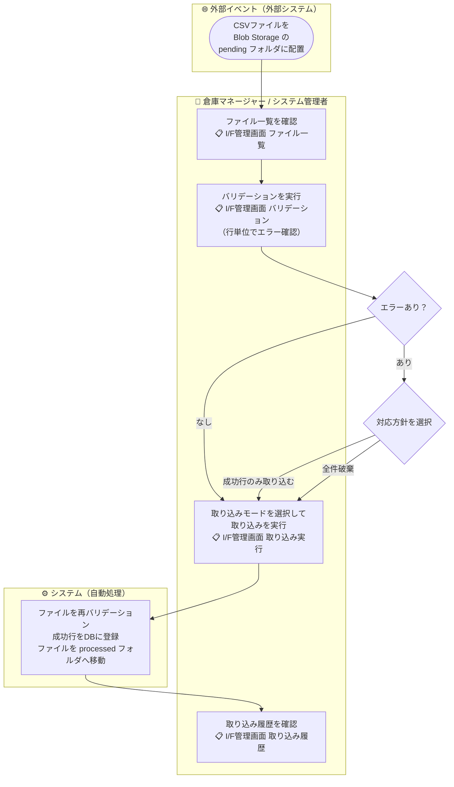

# 機能要件定義書 — 外部連携I/F

> 取り込みフロー・APIエンドポイント・Blob Storageフォルダ構成の詳細は
> [09-interface-architecture.md](../architecture-blueprint/09-interface-architecture.md) を参照

## 概要

| 項目 | 内容 |
|------|------|
| **連携方式** | ファイルベース（CSV）。リアルタイムAPI連携は対象外 |
| **ファイル配置** | WMS外部（外部システム等）が Azure Blob Storage の `pending` フォルダに配置する |
| **実装** | モック実装（実際の外部システム接続なし） |
| **実行権限** | SYSTEM_ADMIN・WAREHOUSE_MANAGER のみ実行可 |

## 業務フロー

---

## I/F一覧

| I/F ID | I/F名 | 取り込み先 |
|--------|-------|-----------|
| IFX-001 | 入荷予定取り込みI/F | 入荷予定データ（入荷管理） |
| IFX-002 | 受注取り込みI/F | 受注データ（出荷管理） |

---

## 機能一覧

### 1. ファイル一覧照会

- `pending` フォルダに配置されたCSVファイルの一覧を画面に表示する
- ファイル名・ファイルサイズ・配置日時を表示する

### 2. バリデーション実行

- 一覧からファイルを選択してバリデーションを実行できる
- バリデーション結果を行単位で表示する（成功行・失敗行・失敗理由）
- バリデーション結果はDBやキャッシュに保存しない（ステートレス）

### 3. 取り込み実行

- バリデーション後、以下の2つのモードから選択して実行できる

| モード | 動作 |
|--------|------|
| **成功行のみ取り込む** | バリデーション成功行のみDBに登録する。失敗行はスキップ |
| **全件破棄** | DBへの登録は行わず、ファイルをprocessedフォルダへ移動するのみ |

- 取り込み実行時（成功行のみ・全件破棄どちらも）、CSVファイルを `pending` から `processed` フォルダへ移動する
- 取り込み実行時に再度バリデーションを実行して整合性を確保する（ファイルの2度読み）

### 4. 取り込み履歴照会

- 過去の取り込み実行履歴を一覧で確認できる
- 実行日時・ファイル名・総レコード数・成功件数・エラー件数・実行モード・実行者を表示する

---

## ビジネスルール

| ルール | 内容 |
|--------|------|
| ファイル移動 | 取り込み実行後（成功行のみ・全件破棄どちらでも）、必ず `processed` フォルダへ移動する |
| ステートレス処理 | バリデーション結果はサーバー側で保持しない。取り込み実行時は再度ファイルを読み込む |
| 取り込み後の扱い | IFX-001 で取り込んだ入荷予定データは入荷管理の「入荷予定」ステータスで登録される |
| 取り込み後の扱い | IFX-002 で取り込んだ受注データは出荷管理の「受注」ステータスで登録される |
| **営業日基準** | CSVファイルの取り込み処理によって登録されるデータの日付基準は現在営業日とする。取り込み実行時点の現在営業日がトランザクションデータの登録日として記録される |
