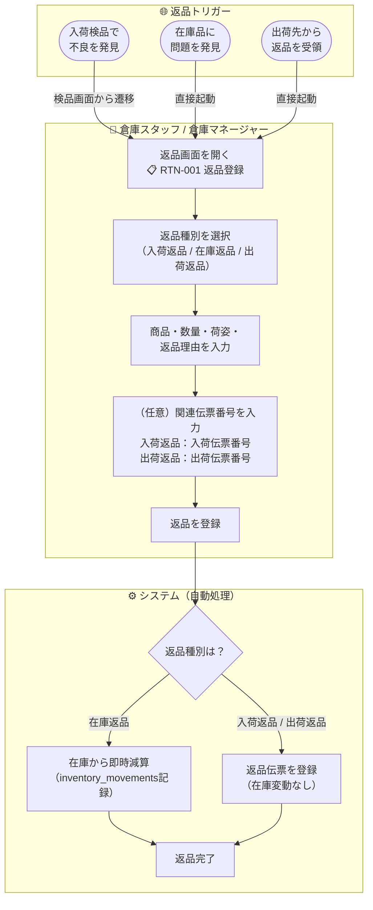

# 機能要件定義書 — 返品管理

## 返品種別

| 種別 | 種別コード | 伝票プレフィックス | 説明 | 在庫への影響 |
|------|-----------|-----------------|------|------------|
| **入荷返品** | INBOUND | RTN-I | 入荷検品時に問題のあった商品を仕入先に返品する。入庫前のため在庫に載っていない | なし |
| **在庫返品** | INVENTORY | RTN-S | 倉庫に在庫している商品に問題があり仕入先に返品する | 即時減算 |
| **出荷返品** | OUTBOUND | RTN-O | 出荷先から返品された商品を在庫に入れず仕入先に返品する | なし |

> **入庫前 vs 入庫後**: 入荷検品中に不良が見つかった場合は「入荷返品」、入庫完了後に倉庫在庫から返品する場合は「在庫返品」として登録する。

> **出荷先からの良品受入について**: 出荷先から返品された商品が良品で在庫に戻す場合は、通常の入荷予定登録（入荷管理）で受入処理を行う。返品管理モジュールは仕入先への返品のみを扱い、顧客からの良品受入は入荷管理で代替する。

---

## 業務フロー



---

## ステータス遷移

```
登録済 → 完了
```

| ステータス | 説明 |
|-----------|------|
| **登録済** | 返品伝票が登録された状態 |
| **完了** | 返品処理が完了した状態（在庫返品の場合は在庫減算も完了） |

> 返品はシンプルな2段階フローとする。仕入先への返送管理（配送追跡等）はスコープ外。

---

## 機能一覧

### 1. 返品登録

- 返品画面（RTN-001）から返品伝票を登録する
- **1伝票1商品**（1つの返品伝票に載せる商品は1つのみ）
- 入力項目:
  - 返品種別（入荷返品 / 在庫返品 / 出荷返品）— 必須
  - 商品（商品コードで検索・選択）— 必須
  - 数量 — 必須
  - 荷姿（ケース / ボール / バラ）— 必須
  - 返品理由（選択肢 + 備考）— 必須（備考は任意）
  - 関連伝票番号 — 入荷返品・出荷返品の場合は入力可能（任意）
  - ロット番号 — ロット管理商品の場合は入力可能（任意）
  - 賞味期限 — 期限管理商品の場合は入力可能（任意）
- 登録と同時にステータスは「完了」になる（登録 = 完了の即時処理）

### 2. 返品理由

返品理由は以下の定型選択肢 + 備考欄で管理する。

| 理由コード | 理由名 |
|-----------|--------|
| QUALITY_DEFECT | 品質不良 |
| EXCESS_QUANTITY | 数量過剰 |
| WRONG_DELIVERY | 誤配送 |
| EXPIRED | 期限切れ |
| DAMAGED | 破損 |
| OTHER | その他 |

- 「その他」選択時は備考欄の入力を必須とする
- 備考欄は全理由コードで入力可能（任意）

### 3. 入荷返品（種別固有ルール）

- 入荷検品画面（INB-003）から返品画面を呼び出せる（リンクボタン）
- 関連伝票番号として入荷伝票番号を入力可能
- **在庫への影響なし**（入庫前の商品のため、在庫テーブルへの書き込みは発生しない）
- inventory_movements には記録しない

### 4. 在庫返品（種別固有ルール）

- 返品画面を直接起動して登録する
- 在庫から**即時に数量を減算**する
- 減算対象の在庫はロケーション・商品・荷姿で特定する（ロケーション選択が必要）
- **引当済み在庫は返品不可**（`allocated_qty > 0` の在庫レコードからの返品は拒否する）
- **棚卸ロック中のロケーションからの返品は不可**
- **在庫マイナス禁止**（返品数量が現在庫数を超える場合は拒否する）
- inventory_movements に `RETURN_OUT` として記録する

### 5. 出荷返品（種別固有ルール）

- 返品画面を直接起動して登録する
- 関連伝票番号として出荷伝票番号を入力可能
- **在庫への影響なし**（出荷先から戻った商品を在庫に入れず、直接仕入先に返品する）
- inventory_movements には記録しない

### 6. 返品一覧照会

- 返品レポート（RPT-18）で代替する（専用の一覧画面は設けない）
- 検索条件: 返品種別・返品日範囲・仕入先・商品・返品理由

---

## 他機能への影響

### 入荷実績レポート（RPT-04）への影響

- 入荷実績レポートに**返品数量列**を追加する
- 表示内容: 入荷予定数・検品数・返品数・差異数
- 差異数の計算: `差異数 = 検品数 - 返品数 - 入荷予定数`
- 入荷返品のみが対象（在庫返品・出荷返品は含まない）

### 日次集計レポート（RPT-17）への影響

- 日次集計に**返品数量合計**（バラ換算）を追加する
- 3種別の合計を表示する

### 返品レポート（RPT-18）

- 返品専用のレポートを新設する
- 検索条件: 返品種別・返品日範囲・仕入先・商品・返品理由
- 出力項目: 返品伝票番号・返品種別・返品日・商品コード・商品名・数量・荷姿・返品理由・関連伝票番号・仕入先名
- 出力形式: JSON/CSV/PDF（API経由）

### 入荷検品画面（INB-003）への影響

- 入荷検品画面に「返品登録」ボタンを追加する
- ボタン押下で返品画面に遷移し、返品種別「入荷返品」・入荷伝票番号がプリセットされる

---

## ビジネスルール

| ルール | 内容 |
|--------|------|
| **営業日基準** | 全操作は現在営業日を基準とする。返品日は登録時の現在営業日が自動セットされる |
| **1伝票1商品** | 1つの返品伝票に載せる商品は1つのみ。複数商品を返品する場合は伝票を分ける |
| **在庫返品の即時減算** | 在庫返品は登録と同時に在庫を減算する。取り消し不可（誤登録の場合は在庫訂正で対応） |
| **入荷返品・出荷返品は在庫不変** | 在庫テーブルへの書き込みは発生しない |
| **引当済み在庫の保護** | 引当済み在庫（`allocated_qty > 0`）は返品対象にできない |
| **棚卸ロック中の保護** | 棚卸ロック中のロケーションからの在庫返品は不可 |
| **在庫マイナス禁止** | 返品数量が現在庫数（`quantity - allocated_qty`）を超える場合は拒否する |
| **返品伝票の修正不可** | 登録済みの返品伝票は修正・削除不可。誤登録の場合は在庫訂正で対応する |
| **倉庫コードの保持** | 全返品レコードに倉庫コードを保持する（選択中倉庫を自動セット） |
| **トランへのマスタ情報コピー** | 返品データには商品コード・商品名・取引先コード・取引先名・倉庫コード・倉庫名等をコピー保持する |
| **仕入先への返送管理はスコープ外** | RMA番号・配送追跡等の返送プロセスは管理しない |
